# 21.4 全栈调度协同

> **主题**: 21. 基础设施调度 - 21.4 全栈调度协同
> **覆盖**: 跨层调度协同、拓扑感知调度、故障自愈调度、全栈数字孪生

---

## 📋 目录

- [21.4 全栈调度协同](#214-全栈调度协同)
  - [📋 目录](#-目录)
  - [1 全栈调度协同概述](#1-全栈调度协同概述)
    - [1.1 全栈调度的核心突破](#11-全栈调度的核心突破)
    - [1.2 全栈调度的三大协同机制](#12-全栈调度的三大协同机制)
  - [2 跨层调度协同](#2-跨层调度协同)
    - [2.1 主机级调度 → 机柜级约束](#21-主机级调度--机柜级约束)
    - [2.2 机柜级调度 → IDC级拓扑](#22-机柜级调度--idc级拓扑)
    - [2.3 IDC级调度 → 主机级反馈](#23-idc级调度--主机级反馈)
  - [3 拓扑感知调度](#3-拓扑感知调度)
    - [3.1 物理拓扑显性化](#31-物理拓扑显性化)
    - [3.2 拓扑感知调度策略](#32-拓扑感知调度策略)
    - [3.3 拓扑感知调度实现](#33-拓扑感知调度实现)
  - [4 故障自愈调度](#4-故障自愈调度)
    - [4.1 故障检测与诊断](#41-故障检测与诊断)
    - [4.2 自动修复机制](#42-自动修复机制)
    - [4.3 预测性维护](#43-预测性维护)
  - [5 全栈数字孪生](#5-全栈数字孪生)
    - [5.1 数字孪生模型构建](#51-数字孪生模型构建)
    - [5.2 虚拟环境预演](#52-虚拟环境预演)
    - [5.3 数字孪生应用](#53-数字孪生应用)
  - [6 形式化模型](#6-形式化模型)
    - [6.1 全栈调度系统定义](#61-全栈调度系统定义)
    - [6.2 约束传导机制](#62-约束传导机制)
  - [7 跨领域洞察](#7-跨领域洞察)
    - [7.1 全栈调度的三大突破](#71-全栈调度的三大突破)
    - [7.2 全栈调度的未来演进](#72-全栈调度的未来演进)
  - [8 多维度对比](#8-多维度对比)
    - [8.1 调度方式对比](#81-调度方式对比)
    - [8.2 故障处理方式对比](#82-故障处理方式对比)
  - [9 2025年最新技术（更新至2025年11月）](#9-2025年最新技术更新至2025年11月)
  - [10 思维导图](#10-思维导图)
  - [11 相关主题](#11-相关主题)
    - [11.1 跨视角链接](#111-跨视角链接)

---

## 1 全栈调度协同概述

### 1.1 全栈调度的核心突破

全栈调度的核心突破在于将**物理世界的刚性约束**转化为**软件可感知的拓扑与成本**，再通过**智能算法**实现全局最优：

1. **拓扑显性化**：过去PCB走线长度、PCIe Switch端口、PDU相位是黑盒，现在通过DMI/Redfish暴露为调度器的决策输入
2. **通信最短化**：从"CPU居中调度"转向"GPU P2P DMA+NIC RDMA"，数据路径缩短 **60%**
3. **故障自闭环**：从"人工巡检"到"BMC感知-调度器决策-带外执行"，MTTR压缩至 **<5分钟**

### 1.2 全栈调度的三大协同机制

**机制一：数据流驱动决策流**

机房资产全生命周期监管的核心是将"资产实物与运维数据库一一对应"。通过LLDP协议自动发现交换机端口与服务器MAC的映射关系，结合预先录入的交换机地理位置，可反向校验服务器所在的机柜号。这种自动化发现-校验闭环，使调度决策基于真实物理拓扑而非人工台账，准确率提升至99.9%。

**机制二：告警触发编排流**

智能告警不仅是通知，更是调度的触发器。当磁盘爆满告警产生时，系统可自动触发预编排的运维策略：先清理日志，若无效则迁移容器，最后扩展存储卷。告警与调度的联动，将MTTR（平均修复时间）从小时级压缩至分钟级。

**机制三：容量规划与动态调度闭环**

资源视图功能实时展示"可用IP、已用IP、可用带宽、已用带宽"的机柜级统计。当某机柜利用率超过85%时，调度系统将其标记为"饱和"，新上架请求自动路由至相邻低负载机柜。同时，月度报表分析可识别长期低负载机柜（<30%），触发业务整合调度，释放机柜空间。

---

## 2 跨层调度协同

### 2.1 主机级调度 → 机柜级约束

**电源功率调度**：

单台8x GPU服务器峰值功耗达 **5600W**（8×700W），需接入双PDU（每个PDU≤16A/220V=3520W）。机柜调度系统必须确保：

- **机柜总功率≤12kW**：若部署2台此类服务器（11.2kW），剩余空间仅能容纳低功耗存储节点
- **动态功率封顶**：通过IPMI设置服务器功率墙（Power Cap），当机柜总负载>90%时，强制降低GPU频率，避免跳闸

**散热风道调度**：

GPU服务器采用 **前进后出** 风道，机柜需采用**封闭热通道**设计。若机柜内混插风道方向不同的旧服务器（如左进右出），会导致气流短路，GPU温度上升 **15-20℃**，触发降频保护。调度策略必须保证**同机柜风道一致性**。

### 2.2 机柜级调度 → IDC级拓扑

**网络拓扑映射**：

- **TOR（Top of Rack）交换机**：每机柜顶部部署，连接服务器**25G/100G**网卡，延迟 **0.1ms**
- **EOR（End of Row）汇聚**：每列机柜末端，延迟 **0.5ms**，带宽收敛比 **4:1**
- **Spine核心**：跨列通信经由Spine，延迟 **1-2ms**，带宽收敛比 **8:1**

**调度决策**：

AI训练任务需将Parameter Server与Worker部署在**同一机柜**（TOR直连），AllReduce通信带宽达**100Gbps**。若跨机柜部署，经EOR收敛后带宽降至**25Gbps**，训练周期延长 **3-4倍**。

**电力拓扑映射**：

- **A/B路供电**：机柜内服务器双电源需分别接入**不同PDU**，且这两个PDU源自**不同UPS系统**，形成"**双路异源**"
- **调度约束**：同一业务集群必须分散在**A/B两路**供电下，当一路UPS故障时，业务不中断

### 2.3 IDC级调度 → 主机级反馈

**宏观容量规划驱动微观部署**：

IDC调度系统预测下季度AI训练需求增长**200%**，提前规划**整列GPU机柜**（20柜）。在主机级，需确保：

- **BIOS批量配置**：通过Redfish API统一设置新上架服务器的NUMA、PCIe、电源策略，避免逐台手动配置
- **固件版本一致性**：同一训练集群所有服务器GPU驱动版本差≤**0.1**，防止NCCL通信因版本不兼容失败

---

## 3 拓扑感知调度

### 3.1 物理拓扑显性化

**拓扑显性化技术**：

- **DMI（Desktop Management Interface）**：暴露硬件拓扑信息
- **Redfish API**：标准化硬件管理接口
- **SMBIOS**：系统管理BIOS信息
- **LLDP（Link Layer Discovery Protocol）**：自动发现网络拓扑

**拓扑信息暴露**：

- **PCB走线长度**：通过Redfish API暴露
- **PCIe Switch端口**：通过lspci工具读取
- **PDU相位**：通过智能PDU API暴露
- **NUMA拓扑**：通过numactl工具读取

### 3.2 拓扑感知调度策略

**拓扑感知调度原则**：

1. **最短路径优先**：优先选择延迟最低的路径
2. **本地访问优先**：优先使用本地资源，避免跨节点访问
3. **带宽最大化**：优先选择带宽最高的路径
4. **故障域隔离**：避免将关键业务部署在同一故障域

**拓扑感知调度案例**：

**案例1：AI训练任务调度**

```text
需求：8卡全互联GPU训练任务
  ↓
IDC层：筛选部署有SXM5模块的HGX机柜列
  ↓
机柜层：选择剩余功率>7kW的机柜
  ↓
主机层：验证GPU间为NV8（8条NVLink）
  ↓
NUMA层：绑定GPU所在Socket的CPU核心
  ↓
内核层：CFS调度+中断affinity
```

**案例2：网络延迟敏感业务调度**

```text
需求：金融高频交易，延迟<1ms
  ↓
IDC层：选择直连核心交换机的机柜列
  ↓
机柜层：选择TOR直连的机柜
  ↓
主机层：绑定离网络出口最近的NUMA节点
  ↓
内核层：实时调度+CPU绑定
```

### 3.3 拓扑感知调度实现

**Kubernetes Topology Manager**：

- **NodeResourceTopology CRD**：读取服务器的NUMA、PCIe拓扑信息
- **Topology Hints**：设备插件提供拓扑提示
- **调度策略**：将拓扑信息注入调度器，实现GPU-CPU亲和性、网络延迟敏感调度

**实现示例**：

```yaml
apiVersion: topology.node.k8s.io/v1alpha1
kind: NodeResourceTopology
metadata:
  name: node-1
spec:
  topologyPolicies:
    - name: best-effort
      scope: container
  zones:
    - name: node-0
      type: Node
      resources:
        - name: cpu
          capacity: 64
          allocatable: 64
        - name: memory
          capacity: 256Gi
          allocatable: 256Gi
      children:
        - name: numa-0
          type: NUMANode
          resources:
            - name: cpu
              capacity: 32
            - name: memory
              capacity: 128Gi
            - name: pci/gpu
              capacity: 4
```

---

## 4 故障自愈调度

### 4.1 故障检测与诊断

**故障检测机制**：

- **BMC传感器监控**：温度、电压、风扇转速、功耗等
- **IPMI SEL日志**：系统事件日志记录硬件事件
- **PECI总线**：读取CPU MSR寄存器，识别故障DIMM槽位
- **PCIe AER**：高级错误报告，记录PCIe设备错误

**故障诊断流程**：

```text
检测到异常
  ↓
BMC传感器告警？
  ├─ 是 → 硬件故障 → 隔离设备，触发维修
  └─ 否 → IPMI硬重启
      ↓
硬件状态正常？
  ├─ 是 → OS级故障 → 自动迁移业务
  └─ 否 → 硬件故障 → 隔离设备，触发维修
```

### 4.2 自动修复机制

**自动修复策略**：

- **硬重启**：OS无响应时，通过IPMI强制断电重启
- **驱动重启**：PCIe设备掉链时，自动重启PCIe Root Port驱动
- **业务迁移**：硬件故障时，自动将业务迁移至备用节点
- **固件回滚**：固件更新失败时，自动回滚至旧版本

**自动修复时间**：

- **硬重启**：<3分钟
- **驱动重启**：<30秒
- **业务迁移**：<100ms（热迁移）
- **固件回滚**：<10分钟

### 4.3 预测性维护

**预测性维护模型**：

通过LSTM模型分析服务器传感器数据，提前72小时预测硬件故障，准确率达**93%**。

**预测指标**：

- **风扇转速**：异常转速模式
- **CPU温度**：温度趋势异常
- **内存CE率**：可纠正错误率上升
- **硬盘SMART**：SMART属性异常

**预测性维护效果**：

- **故障预测准确率**：93%
- **非计划宕机减少**：76%
- **MTTR降低**：从90分钟降至8分钟

---

## 5 全栈数字孪生

### 5.1 数字孪生模型构建

**数字孪生层级**：

- **微观层**：模拟晶体管发热与电流分布
- **中观层**：模拟PCIe信号完整性
- **宏观层**：模拟机柜CFD气流组织

**数字孪生模型**：

$$
\text{DigitalTwin} = (PhysicalSystem, VirtualModel, DataFlow, ControlLoop)
$$

其中：

- $PhysicalSystem$：物理系统状态
- $VirtualModel$：虚拟模型
- $DataFlow$：数据流（物理→虚拟）
- $ControlLoop$：控制回路（虚拟→物理）

### 5.2 虚拟环境预演

**预演流程**：

1. **构建虚拟环境**：基于物理拓扑构建数字孪生模型
2. **预演调度策略**：在虚拟环境中测试调度策略
3. **预测性能与风险**：预测PUE、温度、性能等指标
4. **决策优化**：根据预测结果优化调度策略

**预演案例**：

在孪生模型中测试某机柜部署8台GPU服务器，预测：

- **PUE**：1.18
- **热点温度**：92℃
- **LLC失效率**：上升5%

根据预测结果，拒绝该部署方案，选择更优的部署策略。

### 5.3 数字孪生应用

**应用场景**：

- **容量规划**：在虚拟环境中测试不同容量规划方案
- **故障模拟**：模拟故障场景，测试故障恢复能力
- **性能优化**：在虚拟环境中优化调度策略
- **风险评估**：评估调度策略的风险

---

## 6 形式化模型

### 6.1 全栈调度系统定义

**全栈调度系统**：

$$
\mathcal{S} = \langle \mathcal{L}, \mathcal{R}, \mathcal{T}, \mathcal{C}, \mathcal{G}, \mathcal{M}, \mathcal{O} \rangle
$$

其中：

- $\mathcal{L} = \{\text{Die}, \text{Socket}, \text{Node}, \text{Host}, \text{Rack}, \text{IDC}\}$：层级集合
- $\mathcal{R}$：资源向量（算力、内存、功耗、带宽、空间拓扑）
- $\mathcal{T}$：任务集合
- $\mathcal{C}$：约束集合（硬约束与软约束）
- $\mathcal{G}$：拓扑图
- $\mathcal{M}$：调度算法
- $\mathcal{O}$：优化目标

### 6.2 约束传导机制

**约束传导定义**：

下层的物理缺陷会逐层放大为上层调度瓶颈。

**约束传导示例**：

- **PCB走线长度差异**：5cm → 延迟差250ps → PCIe链路降速 → GPU性能下降
- **PCIe Switch端口差异**：跨Switch带宽降71% → 多卡训练效率下降40%
- **机柜功率约束**：12kW → 单台服务器5600W → 最多部署2台

**约束传导公式**：

$$
\text{Impact}_{L+1} = f(\text{Defect}_L, \text{Topology}_L, \text{Load}_L)
$$

其中：

- $\text{Defect}_L$：L层的物理缺陷
- $\text{Topology}_L$：L层的拓扑结构
- $\text{Load}_L$：L层的负载情况

---

## 7 跨领域洞察

### 7.1 全栈调度的三大突破

**突破一：拓扑显性化**

过去PCB走线长度、PCIe Switch端口、PDU相位是黑盒，现在通过DMI/Redfish暴露为调度器的决策输入。

**突破二：通信最短化**

从"CPU居中调度"转向"GPU P2P DMA+NIC RDMA"，数据路径缩短 **60%**。

**突破三：故障自闭环**

从"人工巡检"到"BMC感知-调度器决策-带外执行"，MTTR压缩至 **<5分钟**。

### 7.2 全栈调度的未来演进

**演进方向一：CXL内存池化**

CXL 3.0支持**全局内存池化**，CPU与GPU共享统一地址空间。调度器可将远程机柜的内存动态映射至本地NUMA节点，延迟 **80ns**（接近本地内存）。这意味着**机柜级内存调度**成为可能，打破单机内存墙。

**演进方向二：量子-经典混合IDC**

量子计算机需 **-273℃** 环境，且**不能**与经典服务器共机柜（振动干扰）。调度系统需：

1. 预留**量子机柜列**，独立地基减震（**10Hz**以上振动衰减 **99%**）
2. 部署**超低抖动光纤**（抖动 **<1ns rms**）连接量子与经典节点
3. 调度器将量子计算结果通过**专用低延迟网络**传输至GPU集群后处理

**演进方向三：AI驱动的全栈数字孪生**

构建从**硅片到IDC**的全栈数字孪生模型，调度器在**虚拟环境**中预演调度策略，预测性能与风险。

**终极愿景：IDC即计算机**

全栈调度将从"资源分配"进化为**"算力编排"**，最终实现**IDC即计算机**（IDC-as-a-Computer）的宏大愿景。

---

## 8 多维度对比

### 8.1 调度方式对比

| **调度方式** | **拓扑感知** | **自动化程度** | **MTTR** | **适用场景** |
|------------|------------|--------------|---------|------------|
| **传统调度** | 无 | 低 | 90分钟 | 小规模IDC |
| **拓扑感知调度** | 有 | 中 | 30分钟 | 中大规模IDC |
| **全栈协同调度** | 有 | 高 | <5分钟 | 超大规模IDC |

### 8.2 故障处理方式对比

| **故障处理方式** | **检测时间** | **诊断时间** | **修复时间** | **自动化程度** |
|----------------|------------|------------|------------|--------------|
| **人工处理** | 30分钟 | 60分钟 | 90分钟 | 低 |
| **半自动处理** | 5分钟 | 15分钟 | 30分钟 | 中 |
| **全自动处理** | <5秒 | <30秒 | <5分钟 | 高 |

---

## 9 2025年最新技术（更新至2025年11月）

**最新技术发展**：

- **全栈数字孪生成熟**：2025年全栈数字孪生技术在超大规模IDC广泛应用，从硅片到IDC的全栈建模，调度策略预演准确率>95%，风险预测准确率>90%，调度决策优化效果提升30%+。
- **CXL 3.0内存池化商用**：2025年CXL 3.0在超大规模IDC商用，支持全局内存池化，机柜级内存调度成为可能，远程内存访问延迟降至80ns（接近本地内存），打破单机内存墙。
- **量子-经典混合IDC预埋**：2025年量子-经典混合IDC开始预埋，量子机柜列独立部署，超低抖动光纤（抖动<1ns rms）连接量子与经典节点，为未来量子计算做好准备。
- **AI驱动的全栈调度优化**：2025年AI驱动的全栈调度优化系统在超大规模IDC应用，通过强化学习和数字孪生，调度决策优化效果提升30%+，资源利用率提升40%+，能耗成本降低25%+。

**实践案例：超大规模IDC全栈调度协同优化**（2025年最新）：

- **架构**：基于全栈数字孪生的智能调度平台
- **性能**：MTTR从90分钟降至<5分钟，资源利用率从58%提升至81%，能耗成本降低25%+，调度决策优化效果提升30%+
- **应用场景**：超大规模IDC、AI训练集群、云原生基础设施
- **优势**：全栈协同、拓扑感知、故障自愈、智能优化

**技术对比**：

| **技术** | **预演准确率** | **内存延迟** | **调度优化效果** | **MTTR** | **成本/复杂度** |
|---------|-------------|------------|--------------|---------|--------------|
| **全栈数字孪生** | 95%+ | - | 30%+ | - | 极高 |
| **CXL 3.0内存池化** | - | 80ns | - | - | 高 |
| **量子-经典混合IDC** | - | - | - | - | 极高 |
| **AI全栈调度优化** | - | - | 30%+ | <5分钟 | 高 |

**批判性分析**：

1. **全栈数字孪生的建模复杂度**：虽然预演准确率>95%，但从硅片到IDC的全栈建模复杂度极高，需要大量领域知识，模型维护成本高。并非所有场景都需要全栈建模。
2. **CXL内存池化的延迟权衡**：虽然远程内存访问延迟降至80ns，但仍高于本地内存（~50ns），需要智能调度优化。并非所有应用都适合使用远程内存。
3. **量子-经典混合IDC的投资回报**：虽然量子-经典混合IDC开始预埋，但量子计算仍处于早期阶段，实际应用场景有限，投资回报不确定，需要谨慎评估。

---

## 10 思维导图

```mermaid
graph TD
    subgraph 全栈调度协同
        FullStack[全栈调度协同]
        FullStack---跨层协同[跨层调度协同]
        FullStack---拓扑感知[拓扑感知调度]
        FullStack---故障自愈[故障自愈调度]
        FullStack---数字孪生[全栈数字孪生]
        FullStack---模型[形式化模型]
    end

    subgraph 跨层调度协同
        跨层协同---主机到机柜[主机级调度→机柜级约束]
        跨层协同---机柜到IDC[机柜级调度→IDC级拓扑]
        跨层协同---IDC到主机[IDC级调度→主机级反馈]
        主机到机柜---电源功率[电源功率调度]
        主机到机柜---散热风道[散热风道调度]
        机柜到IDC---网络拓扑[网络拓扑映射]
        机柜到IDC---电力拓扑[电力拓扑映射]
        IDC到主机---容量反馈[容量反馈]
        IDC到主机---能耗反馈[能耗反馈]
    end

    subgraph 拓扑感知调度
        拓扑感知---物理拓扑[物理拓扑显性化]
        拓扑感知---调度策略[拓扑感知调度策略]
        拓扑感知---调度实现[拓扑感知调度实现]
        物理拓扑---硅片拓扑[硅片级拓扑]
        物理拓扑---板级拓扑[板级拓扑]
        物理拓扑---主机拓扑[主机级拓扑]
        物理拓扑---机柜拓扑[机柜级拓扑]
        物理拓扑---IDC拓扑[IDC级拓扑]
        调度策略---局部性优化[局部性优化]
        调度策略---延迟优化[延迟优化]
        调度实现---Redfish[Redfish API]
        调度实现---DMI[DMI协议]
    end

    subgraph 故障自愈调度
        故障自愈---故障检测[故障检测与诊断]
        故障自愈---自动修复[自动修复机制]
        故障自愈---预测性维护[预测性维护]
        故障检测---BMC感知[BMC感知]
        故障检测---智能诊断[智能诊断]
        自动修复---调度器决策[调度器决策]
        自动修复---带外执行[带外执行]
        自动修复---MTTR[MTTR<5分钟]
        预测性维护---AI预测[AI预测]
        预测性维护---预防性调度[预防性调度]
    end

    subgraph 全栈数字孪生
        数字孪生---模型构建[数字孪生模型构建]
        数字孪生---虚拟预演[虚拟环境预演]
        数字孪生---应用场景[数字孪生应用]
        模型构建---全栈建模[全栈建模]
        模型构建---实时同步[实时同步]
        虚拟预演---预演准确率[预演准确率>95%]
        虚拟预演---优化验证[优化验证]
        应用场景---容量规划[容量规划]
        应用场景---故障模拟[故障模拟]
        应用场景---性能优化[性能优化]
    end

    subgraph 形式化模型
        模型---系统定义[全栈调度系统定义]
        模型---约束传导[约束传导机制]
        系统定义---系统元组[系统元组定义]
        系统定义---调度问题[调度问题定义]
        约束传导---约束传播[约束传播]
        约束传导---约束满足[约束满足]
    end

    subgraph 2025年最新技术
        Tech[2025年最新技术]
        Tech---全栈数字孪生[全栈数字孪生]
        Tech---CXL内存池化[CXL内存池化]
        Tech---AI全栈调度[AI全栈调度优化]
        全栈数字孪生---预演准确率[预演准确率>95%]
        CXL内存池化---延迟[远程内存访问延迟80ns]
        AI全栈调度---性能提升[性能提升30%+]
        AI全栈调度---MTTR[MTTR<5分钟]
    end

    FullStack --> Tech
```



---

## 11 相关主题

- [21.1 主机级调度](./21.1_主机级调度.md) - 物理服务器调度、BMC管理
- [21.2 机柜级调度](./21.2_机柜级调度.md) - 机柜空间调度、PDU电力调度
- [21.3 IDC级调度](./21.3_IDC级调度.md) - IDC容量规划、电力系统调度
- [12. 跨层次调度协同](../12_跨层次调度协同/README.md) - 端到端延迟分解

### 11.1 跨视角链接

- [概念交叉索引（七视角版）](../../../Concept/CONCEPT_CROSS_INDEX.md) - 查看相关概念的七视角分析：
  - [通信复杂度](../../../Concept/CONCEPT_CROSS_INDEX.md#56-通信复杂度-communication-complexity-七视角) - 全栈调度协同的通信开销
  - [熵](../../../Concept/CONCEPT_CROSS_INDEX.md#71-熵-entropy-七视角) - 全栈调度协同中的信息不确定性
  - [反身性](../../../Concept/CONCEPT_CROSS_INDEX.md#31-反身性-reflexivity-七视角) - 全栈调度协同的自指机制
- [10. AI驱动调度](../10_AI驱动调度/README.md) - 强化学习调度、预测性调度

---

**最后更新**: 2025-11-14
