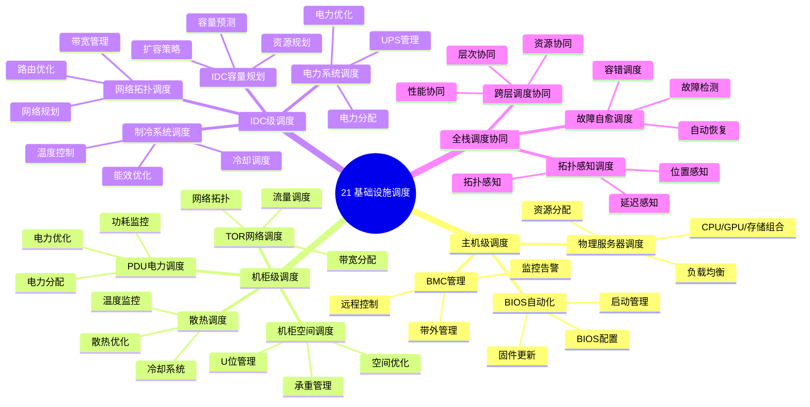

# 21. 基础设施调度

> **主题**: IDC、机柜、机架、主机等基础设施调度
> **覆盖范围**: 从主机级到IDC级的全栈基础设施调度体系

---

## 📋 目录

- [21. 基础设施调度](#21-基础设施调度)
  - [📋 目录](#-目录)
  - [1 子主题索引](#1-子主题索引)
    - [1.0 基础设施调度思维导图](#10-基础设施调度思维导图)
  - [2 相关主题](#2-相关主题)
  - [3 核心概念矩阵](#3-核心概念矩阵)
  - [4 全栈物理拓扑层级](#4-全栈物理拓扑层级)
  - [5 形式化模型](#5-形式化模型)
    - [5.1 全栈调度系统定义](#51-全栈调度系统定义)

---

## 1 子主题索引

### 1.0 基础设施调度思维导图



**可视化文档**: 查看 [思维导图与知识矩阵](../思维导图与知识矩阵.md#310-10-24-扩展主题) 获取更详细的思维导图。


- [21.1 主机级调度](./21.1_主机级调度.md) - 物理服务器调度、BMC管理、BIOS自动化、带外监控
- [21.2 机柜级调度](./21.2_机柜级调度.md) - 机柜空间调度、PDU电力调度、TOR网络调度、散热调度
- [21.3 IDC级调度](./21.3_IDC级调度.md) - IDC容量规划、电力系统调度、制冷系统调度、网络拓扑调度
- [21.4 全栈调度协同](./21.4_全栈调度协同.md) - 跨层调度协同、拓扑感知调度、故障自愈调度

---

## 2 相关主题

- [01. CPU硬件层](../01_CPU硬件层/README.md) - CPU微架构、NUMA拓扑
- [02. 系统总线层](../02_系统总线层/README.md) - PCIe子系统、芯片组架构
- [03. OS抽象层](../03_OS抽象层/README.md) - 进程调度、内存管理
- [06. 调度模型](../06_调度模型/README.md) - 硬件调度、OS调度
- [12. 跨层次调度协同](../12_跨层次调度协同/README.md) - 端到端延迟分解

---

## 3 核心概念矩阵

| **调度层级** | **调度单元** | **延迟范围** | **主要约束** | **典型实现** |
|------------|------------|------------|------------|------------|
| **主机级** | 物理服务器 | 0.1ms-2ms | CPU/GPU/存储组合 | IPMI/Redfish |
| **机柜级** | PDU/交换机/U位 | 0.5ms-1ms | 功率/空间/承重 | DCIM系统 |
| **IDC级** | 机房模块/园区 | 5ms-50ms | PUE/电力/制冷 | AI预测模型 |

---

## 4 全栈物理拓扑层级

```text
硅片级（Die）→ 板卡级（Card）→ 主机级（Host）→ 机柜级（Rack）→ 机房级（IDC）
  ↓              ↓              ↓              ↓              ↓
SM/Warp       CPU/GPU       服务器        42U空间       模块化机房
  ↓              ↓              ↓              ↓              ↓
L1/L2缓存     PCIe插槽      电源/网卡      PDU/交换机     电力/制冷园区
```

**关键约束传导机制**：下层的物理缺陷会逐层放大为上层调度瓶颈。

---

## 5 形式化模型

### 5.1 全栈调度系统定义

$$
\mathcal{S} = \langle \mathcal{L}, \mathcal{R}, \mathcal{T}, \mathcal{C}, \mathcal{G}, \mathcal{M}, \mathcal{O} \rangle
$$

其中：

- $\mathcal{L}$ = 层级集合 $\{\text{Die}, \text{Socket}, \text{Node}, \text{Host}, \text{Rack}, \text{IDC}\}$
- $\mathcal{R}$ = 资源向量（算力、内存、功耗、带宽、空间拓扑）
- $\mathcal{T}$ = 任务集合
- $\mathcal{C}$ = 约束集合（硬约束与软约束）
- $\mathcal{G}$ = 拓扑图
- $\mathcal{M}$ = 调度算法
- $\mathcal{O}$ = 优化目标

---

**最后更新**: 2025-11-14
**文档状态**: ✅ 已完成，包含思维导图和2025年最新技术章节
