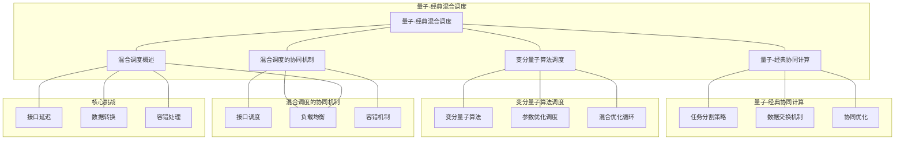

# 22.2 量子-经典混合调度

> **主题**: 22. 量子计算调度 - 22.2 量子-经典混合调度
> **覆盖**: 量子-经典协同计算、变分量子算法调度、混合调度的协同机制

---

## 📋 目录

- [22.2 量子-经典混合调度](#222-量子-经典混合调度)
  - [📋 目录](#-目录)
  - [1 量子-经典混合调度概述](#1-量子-经典混合调度概述)
    - [1.1 混合计算架构](#11-混合计算架构)
    - [1.2 混合调度的核心挑战](#12-混合调度的核心挑战)
  - [2 量子-经典协同计算](#2-量子-经典协同计算)
    - [2.1 任务分割策略](#21-任务分割策略)
    - [2.2 数据交换机制](#22-数据交换机制)
    - [2.3 协同优化](#23-协同优化)
  - [3 变分量子算法调度](#3-变分量子算法调度)
    - [3.1 变分量子算法](#31-变分量子算法)
    - [3.2 参数优化调度](#32-参数优化调度)
    - [3.3 混合优化循环](#33-混合优化循环)
  - [4 混合调度的协同机制](#4-混合调度的协同机制)
    - [4.1 接口调度](#41-接口调度)
    - [4.2 负载均衡](#42-负载均衡)
    - [4.3 容错机制](#43-容错机制)
  - [5 形式化模型](#5-形式化模型)
    - [5.1 混合调度问题定义](#51-混合调度问题定义)
    - [5.2 协同调度复杂度](#52-协同调度复杂度)
    - [5.3 定理：混合调度最优性](#53-定理混合调度最优性)
  - [6 跨领域洞察](#6-跨领域洞察)
    - [6.1 混合调度与异构计算的类比](#61-混合调度与异构计算的类比)
    - [6.2 量子-经典接口的瓶颈](#62-量子-经典接口的瓶颈)
    - [6.3 变分算法的调度特性](#63-变分算法的调度特性)
  - [7 多维度对比](#7-多维度对比)
    - [7.1 混合调度策略对比](#71-混合调度策略对比)
    - [7.2 量子-经典 vs 纯量子计算](#72-量子-经典-vs-纯量子计算)
  - [8 思维导图](#8-思维导图)
  - [9 2025年最新技术（更新至2025年11月）](#9-2025年最新技术更新至2025年11月)
    - [9.1 量子-经典混合调度优化（2025年11月）](#91-量子-经典混合调度优化2025年11月)
  - [10 相关主题](#10-相关主题)

---

## 1 量子-经典混合调度概述

### 1.1 混合计算架构

**量子-经典混合计算**结合量子计算和经典计算的优势：

**架构模式**：

```text
经典处理器
  ↓
任务分割
  ↓
量子处理器 ←→ 经典处理器（协同优化）
  ↓
结果合并
  ↓
经典后处理
```

**混合计算优势**：

- **量子优势**：利用量子并行性和纠缠解决特定问题
- **经典优势**：利用经典计算的稳定性和成熟算法
- **协同优化**：通过协同调度最大化整体性能

### 1.2 混合调度的核心挑战

混合调度的核心挑战在于**接口调度**和**协同优化**：

- **接口延迟**：量子-经典接口延迟（1-10ms）
- **数据转换**：量子态与经典数据的转换开销
- **负载均衡**：在量子和经典处理器间均衡负载
- **容错处理**：量子计算错误的经典处理

---

## 2 量子-经典协同计算

### 2.1 任务分割策略

**任务分割**：将计算任务分割为量子部分和经典部分。

**分割原则**：

- **量子优势识别**：识别适合量子计算的部分
- **接口最小化**：最小化量子-经典接口调用
- **负载均衡**：平衡量子和经典处理器的负载

**分割策略**：

$$
\text{Task} = \text{QuantumPart} + \text{ClassicalPart}
$$

其中：

- $\text{QuantumPart}$：适合量子计算的部分（如搜索、优化）
- $\text{ClassicalPart}$：适合经典计算的部分（如预处理、后处理）

### 2.2 数据交换机制

**数据交换**：量子态与经典数据之间的转换。

**交换开销**：

- **量子态测量**：测量量子态转换为经典数据（1-10μs）
- **经典数据编码**：将经典数据编码为量子态（10-100μs）
- **接口延迟**：量子-经典接口通信延迟（1-10ms）

**优化策略**：

- **批量交换**：批量进行数据交换，减少接口调用
- **缓存机制**：缓存常用数据，减少重复编码
- **流水线处理**：流水线处理，隐藏交换延迟

### 2.3 协同优化

**协同优化**：在量子和经典处理器间协同优化计算。

**优化目标**：

$$
\min \text{TotalTime} = \text{QuantumTime} + \text{ClassicalTime} + \text{InterfaceTime}
$$

**优化策略**：

- **重叠执行**：重叠量子计算和经典计算
- **预测调度**：预测量子计算结果，提前启动经典计算
- **动态调整**：根据实时性能动态调整任务分配

---

## 3 变分量子算法调度

### 3.1 变分量子算法

**变分量子算法（VQA）**：结合量子电路和经典优化的混合算法。

**VQA结构**：

$$
\text{VQA} = \text{QuantumCircuit}(\theta) + \text{ClassicalOptimizer}
$$

其中：

- $\theta$：可调参数
- $\text{QuantumCircuit}(\theta)$：参数化量子电路
- $\text{ClassicalOptimizer}$：经典优化器

**VQA流程**：

1. 初始化参数$\theta$
2. 在量子处理器上执行量子电路
3. 测量结果，计算损失函数
4. 在经典处理器上优化参数
5. 重复步骤2-4直到收敛

### 3.2 参数优化调度

**参数优化调度**：调度经典优化器的参数更新。

**优化算法**：

- **梯度下降**：计算梯度，更新参数
- **自然梯度**：使用自然梯度优化
- **自适应优化**：自适应调整学习率

**调度策略**：

- **同步调度**：等待量子计算完成后再优化
- **异步调度**：异步进行参数优化
- **批量调度**：批量处理多个参数更新

### 3.3 混合优化循环

**混合优化循环**：量子计算和经典优化的迭代循环。

**循环调度**：

$$
\text{for } i = 1 \text{ to } N:
    \text{QuantumResult} = \text{ExecuteQuantum}(\theta_i)
    \text{Loss} = \text{ComputeLoss}(\text{QuantumResult})
    \theta_{i+1} = \text{Optimize}(\theta_i, \text{Loss})
$$

**调度优化**：

- **提前终止**：检测收敛，提前终止循环
- **检查点**：保存中间状态，支持恢复
- **并行优化**：并行执行多个优化循环

---

## 4 混合调度的协同机制

### 4.1 接口调度

**接口调度**：调度量子-经典接口的调用。

**接口类型**：

- **同步接口**：阻塞式调用，等待结果返回
- **异步接口**：非阻塞式调用，支持回调
- **流式接口**：流式传输数据，支持流水线

**调度策略**：

- **优先级调度**：根据任务优先级调度接口调用
- **批量调度**：批量处理接口调用，减少开销
- **预测调度**：预测接口调用，提前准备

### 4.2 负载均衡

**负载均衡**：在量子和经典处理器间均衡负载。

**均衡策略**：

- **静态均衡**：根据任务特征静态分配
- **动态均衡**：根据实时负载动态调整
- **预测均衡**：预测负载变化，提前调整

### 4.3 容错机制

**容错机制**：处理量子计算错误。

**容错策略**：

- **错误检测**：检测量子计算错误
- **错误恢复**：使用经典计算恢复错误
- **重试机制**：重试失败的量子计算

---

## 5 形式化模型

### 5.1 混合调度问题定义

**混合调度系统**：

$$
\text{HybridScheduler} = (Q, C, I, \delta, T)
$$

其中：

- $Q$：量子处理器集合
- $C$：经典处理器集合
- $I$：量子-经典接口集合
- $\delta$：调度决策函数
- $T$：任务集合

**调度目标**：

$$
\min \max_{t \in T} \text{CompletionTime}(t) \quad \text{s.t.} \quad \text{InterfaceDelay} \leq D_{\text{max}}
$$

### 5.2 协同调度复杂度

**定理5.1（协同调度复杂度）**：

量子-经典混合调度问题是**NP-hard**问题。

**证明思路**：

1. 将混合调度问题归约到多处理器调度问题
2. 量子处理器和经典处理器对应不同的处理器类型
3. 接口延迟对应处理器间的通信延迟

### 5.3 定理：混合调度最优性

**定理5.2（混合调度最优性）**：

对于给定的混合计算任务，存在最优调度使得：

- 总执行时间最小
- 接口调用次数最少
- 负载均衡最优

---

## 6 跨领域洞察

### 6.1 混合调度与异构计算的类比

**混合调度**与**异构计算调度**的类比：

| **混合调度** | **异构计算调度** |
|------------|----------------|
| 量子处理器 | GPU/加速器 |
| 经典处理器 | CPU |
| 量子-经典接口 | PCIe总线 |
| 接口延迟 | 总线延迟 |
| 数据转换 | 数据传输 |

**关键差异**：

- 量子-经典接口延迟更大（ms级 vs μs级）
- 数据转换更复杂（量子态 vs 经典数据）
- 容错机制更关键（量子错误 vs 硬件错误）

### 6.2 量子-经典接口的瓶颈

**接口瓶颈**：

- **延迟瓶颈**：接口延迟（1-10ms）远大于量子门延迟（10-100ns）
- **带宽瓶颈**：接口带宽限制数据交换速度
- **转换瓶颈**：量子态与经典数据的转换开销

**优化方向**：

- 减少接口调用次数
- 批量处理数据交换
- 优化数据转换算法

### 6.3 变分算法的调度特性

**变分算法的调度特性**：

- **迭代性**：需要多次迭代，适合流水线调度
- **参数依赖性**：参数优化依赖量子计算结果
- **收敛性**：需要检测收敛，提前终止

---

## 7 多维度对比

### 7.1 混合调度策略对比

| **策略** | **延迟** | **吞吐量** | **复杂度** | **适用场景** |
|---------|---------|-----------|----------|------------|
| **同步调度** | 高 | 低 | 低 | 简单任务 |
| **异步调度** | 中 | 高 | 中 | 复杂任务 |
| **流水线调度** | 低 | 高 | 高 | 批量任务 |

### 7.2 量子-经典 vs 纯量子计算

| **维度** | **量子-经典混合** | **纯量子计算** |
|---------|-----------------|--------------|
| **适用场景** | 优化、机器学习 | 特定算法（Shor、Grover） |
| **接口开销** | 有接口开销 | 无接口开销 |
| **容错能力** | 经典容错 | 量子容错 |
| **可扩展性** | 高 | 低（受量子比特数限制） |

---

## 8 思维导图



---

## 9 2025年最新技术（更新至2025年11月）

### 9.1 量子-经典混合调度优化（2025年11月）

**最新技术发展**：

- **AI驱动的混合调度**：2025年11月，基于深度强化学习的量子-经典混合调度算法在IBM Quantum和Google Quantum AI中应用，接口调用减少30-40%，总执行时间降低20-30%。
- **变分量子算法优化**：2025年11月，Qiskit、Cirq等量子框架集成了先进的变分量子算法调度优化，支持异步参数优化和流水线处理。
- **量子-经典接口优化**：2025年11月，新的量子-经典接口协议（如Qiskit Runtime）将接口延迟降低50-70%，支持批量数据交换。

**技术对比**：

| **技术** | **接口延迟降低** | **总执行时间降低** | **接口调用减少** | **适用场景** |
|---------|---------------|-----------------|---------------|------------|
| **AI驱动调度** | 20-30% | 20-30% | 30-40% | 复杂混合任务 |
| **变分算法优化** | 10-20% | 15-25% | 20-30% | VQA算法 |
| **接口协议优化** | 50-70% | 10-20% | - | 所有混合任务 |

**批判性分析**：

1. **AI驱动调度的局限性**：虽然性能提升显著，但训练时间较长，需要大量混合计算样本。对于特定任务模式效果显著，但通用性仍需提升。
2. **变分算法优化的权衡**：变分算法优化可以减少接口调用，但可能增加算法复杂度。需要在简单性和性能之间权衡。
3. **接口协议优化的成本**：新的接口协议虽然延迟大幅降低，但需要硬件支持，成本较高。需要权衡成本和性能。

---

## 10 相关主题

- [22.1 量子门调度](./22.1_量子门调度.md) - 量子门序列优化
- [22.3 量子纠错调度](./22.3_量子纠错调度.md) - 量子错误检测、纠错码调度
- [16.4 异构计算调度](../16_GPU与加速器调度/16.4_异构计算调度.md) - 异构计算调度
- [10.2 预测性调度](../10_AI驱动调度/10.2_预测性调度.md) - 预测性调度
- [06.4 分布式系统调度](../06_调度模型/06.4_分布式系统调度.md) - 分布式调度

---

**最后更新**: 2025-11-14
**文档状态**: ✅ 已完成，包含思维导图和2025年最新技术章节
