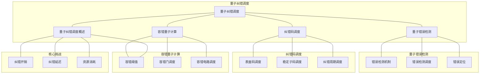

# 22.3 量子纠错调度

> **主题**: 22. 量子计算调度 - 22.3 量子纠错调度
> **覆盖**: 量子错误检测、纠错码调度、容错量子计算、量子调度的性能边界分析

---

## 📋 目录

- [22.3 量子纠错调度](#223-量子纠错调度)
  - [📋 目录](#-目录)
  - [1 量子纠错调度概述](#1-量子纠错调度概述)
    - [1.1 量子错误类型](#11-量子错误类型)
    - [1.2 量子纠错调度的核心挑战](#12-量子纠错调度的核心挑战)
  - [2 量子错误检测](#2-量子错误检测)
    - [2.1 错误检测机制](#21-错误检测机制)
    - [2.2 错误检测调度](#22-错误检测调度)
    - [2.3 错误定位](#23-错误定位)
  - [3 纠错码调度](#3-纠错码调度)
    - [3.1 表面码调度](#31-表面码调度)
    - [3.2 稳定子码调度](#32-稳定子码调度)
    - [3.3 纠错周期调度](#33-纠错周期调度)
  - [4 容错量子计算](#4-容错量子计算)
    - [4.1 容错阈值](#41-容错阈值)
    - [4.2 容错门调度](#42-容错门调度)
    - [4.3 容错电路调度](#43-容错电路调度)
  - [5 形式化模型](#5-形式化模型)
    - [5.1 量子纠错调度问题定义](#51-量子纠错调度问题定义)
    - [5.2 纠错调度复杂度](#52-纠错调度复杂度)
    - [5.3 定理：量子调度的性能边界](#53-定理量子调度的性能边界)
  - [6 跨领域洞察](#6-跨领域洞察)
    - [6.1 量子纠错与经典纠错的类比](#61-量子纠错与经典纠错的类比)
    - [6.2 纠错开销的权衡](#62-纠错开销的权衡)
    - [6.3 容错计算的物理极限](#63-容错计算的物理极限)
  - [7 多维度对比](#7-多维度对比)
    - [7.1 纠错码对比](#71-纠错码对比)
    - [7.2 容错 vs 非容错计算](#72-容错-vs-非容错计算)
  - [8 思维导图](#8-思维导图)
  - [9 2025年最新技术（更新至2025年11月）](#9-2025年最新技术更新至2025年11月)
    - [9.1 量子纠错调度优化（2025年11月）](#91-量子纠错调度优化2025年11月)
  - [10 相关主题](#10-相关主题)

---

## 1 量子纠错调度概述

### 1.1 量子错误类型

**量子错误类型**：

- **比特翻转错误**：$|0\rangle \leftrightarrow |1\rangle$
- **相位翻转错误**：$|+\rangle \leftrightarrow |-\rangle$
- **退相干错误**：量子态与环境相互作用导致的错误
- **门错误**：量子门操作不完美导致的错误

**错误率**：

- **单量子比特错误率**：$p \sim 10^{-3} - 10^{-4}$
- **双量子比特门错误率**：$p \sim 10^{-2} - 10^{-3}$
- **测量错误率**：$p \sim 10^{-2} - 10^{-3}$

### 1.2 量子纠错调度的核心挑战

量子纠错调度的核心挑战在于**纠错开销**和**容错阈值**：

- **纠错开销**：纠错需要额外的量子比特和量子门
- **容错阈值**：物理错误率必须低于容错阈值
- **纠错延迟**：纠错操作增加计算延迟
- **资源消耗**：纠错消耗大量量子比特资源

---

## 2 量子错误检测

### 2.1 错误检测机制

**错误检测**：通过测量稳定子来检测错误。

**稳定子码**：

- **稳定子**：与所有码字对易的算符
- **错误检测**：测量稳定子，检测错误
- **错误定位**：通过稳定子测量结果定位错误

**检测调度**：

$$
\text{ErrorDetection} = \text{MeasureStabilizers} \rightarrow \text{ErrorSyndrome}
$$

### 2.2 错误检测调度

**检测调度策略**：

- **周期性检测**：定期进行错误检测
- **事件驱动检测**：检测到错误时触发
- **自适应检测**：根据错误率自适应调整检测频率

**调度优化**：

- **最小化检测开销**：减少检测操作的数量
- **最大化检测效率**：提高错误检测的准确性
- **平衡检测延迟**：在检测延迟和计算延迟之间平衡

### 2.3 错误定位

**错误定位**：根据错误症状定位错误位置。

**定位算法**：

- **最小权重匹配**：找到最小权重的错误模式
- **最大似然估计**：估计最可能的错误位置
- **机器学习方法**：使用机器学习预测错误位置

---

## 3 纠错码调度

### 3.1 表面码调度

**表面码（Surface Code）**：最常用的量子纠错码。

**表面码特性**：

- **容错阈值**：$p_{\text{th}} \approx 1\%$
- **码距**：$d$（可纠正$\lfloor (d-1)/2 \rfloor$个错误）
- **物理量子比特数**：$n = 2d^2 - 1$

**表面码调度**：

- **稳定子测量调度**：调度稳定子测量操作
- **纠错操作调度**：调度纠错操作
- **逻辑门调度**：调度逻辑量子门操作

### 3.2 稳定子码调度

**稳定子码**：基于稳定子理论的纠错码。

**稳定子码调度**：

- **稳定子生成元调度**：调度稳定子生成元的测量
- **错误纠正调度**：调度错误纠正操作
- **逻辑操作调度**：调度逻辑量子操作

### 3.3 纠错周期调度

**纠错周期**：定期进行纠错的周期。

**周期调度**：

$$
T_{\text{cycle}} = T_{\text{computation}} + T_{\text{correction}}
$$

其中：

- $T_{\text{computation}}$：计算时间
- $T_{\text{correction}}$：纠错时间

**周期优化**：

- **最小化周期时间**：减少纠错周期时间
- **最大化纠错效率**：提高纠错成功率
- **平衡计算和纠错**：在计算和纠错之间平衡

---

## 4 容错量子计算

### 4.1 容错阈值

**容错阈值定理**：

如果物理错误率$p < p_{\text{th}}$，则可以通过纠错实现任意长的量子计算。

**阈值估计**：

- **表面码阈值**：$p_{\text{th}} \approx 1\%$
- **其他码阈值**：$p_{\text{th}} \sim 0.1\% - 10\%$

### 4.2 容错门调度

**容错门**：在纠错码上实现容错的逻辑门。

**容错门类型**：

- **Clifford门**：容易实现容错
- **T门**：需要魔法态，实现复杂
- **测量门**：需要重复测量，提高可靠性

**容错门调度**：

- **门分解调度**：将逻辑门分解为基本容错门
- **门序列优化**：优化容错门序列
- **门并行化**：并行执行多个容错门

### 4.3 容错电路调度

**容错电路**：整个电路都是容错的。

**电路调度**：

- **分层调度**：分层调度容错电路
- **流水线调度**：流水线处理容错电路
- **检查点调度**：插入检查点，支持错误恢复

---

## 5 形式化模型

### 5.1 量子纠错调度问题定义

**量子纠错调度系统**：

$$
\text{QuantumErrorCorrectionScheduler} = (Q, E, C, \delta, R)
$$

其中：

- $Q$：量子比特集合（包括数据比特和辅助比特）
- $E$：错误集合
- $C$：纠错码
- $\delta$：调度决策函数
- $R$：纠错率函数

**调度目标**：

$$
\min \text{Overhead} \quad \text{s.t.} \quad R(\text{schedule}) \geq R_{\text{threshold}}
$$

### 5.2 纠错调度复杂度

**定理5.1（纠错调度复杂度）**：

量子纠错调度问题是**NP-hard**问题。

**证明思路**：

1. 将纠错调度问题归约到资源分配问题
2. 量子比特对应资源
3. 纠错操作对应任务

### 5.3 定理：量子调度的性能边界

**定理5.2（量子调度的性能边界）**：

对于物理错误率$p$和容错阈值$p_{\text{th}}$，如果$p < p_{\text{th}}$，则：

$$
\text{LogicalErrorRate} \leq \left(\frac{p}{p_{\text{th}}}\right)^{(d+1)/2}
$$

其中$d$是码距。

**性能边界**：

- **纠错开销**：$\text{Overhead} = O(d^2)$
- **纠错延迟**：$\text{Latency} = O(d)$
- **资源消耗**：$\text{Resources} = O(d^2)$

---

## 6 跨领域洞察

### 6.1 量子纠错与经典纠错的类比

**量子纠错**与**经典纠错**的类比：

| **量子纠错** | **经典纠错** |
|------------|------------|
| 量子比特 | 经典比特 |
| 量子错误 | 经典错误 |
| 稳定子码 | 线性码 |
| 容错阈值 | 错误率阈值 |
| 纠错周期 | 纠错间隔 |

**关键差异**：

- 量子错误更复杂（比特翻转+相位翻转）
- 量子纠错不能直接复制（不可克隆定理）
- 量子纠错需要测量，但测量会破坏量子态

### 6.2 纠错开销的权衡

**纠错开销权衡**：

- **纠错能力 vs 资源消耗**：更强的纠错能力需要更多资源
- **纠错频率 vs 计算延迟**：更频繁的纠错减少错误但增加延迟
- **容错阈值 vs 物理错误率**：物理错误率必须低于容错阈值

### 6.3 容错计算的物理极限

**物理极限**：

- **容错阈值**：物理错误率必须低于阈值
- **资源限制**：纠错需要大量量子比特
- **时间限制**：纠错增加计算时间

---

## 7 多维度对比

### 7.1 纠错码对比

| **纠错码** | **容错阈值** | **码距** | **资源开销** | **适用场景** |
|-----------|------------|---------|------------|------------|
| **表面码** | ~1% | 可调 | $O(d^2)$ | 通用容错计算 |
| **稳定子码** | ~0.1-1% | 固定 | $O(n)$ | 特定应用 |
| **颜色码** | ~1% | 可调 | $O(d^2)$ | 容错计算 |

### 7.2 容错 vs 非容错计算

| **维度** | **容错计算** | **非容错计算** |
|---------|------------|--------------|
| **错误率** | 逻辑错误率低 | 物理错误率高 |
| **资源开销** | 高（需要纠错） | 低（无需纠错） |
| **计算时间** | 长（纠错延迟） | 短（无纠错延迟） |
| **可扩展性** | 高（可扩展） | 低（受错误率限制） |

---

## 8 思维导图

---

## 9 2025年最新技术（更新至2025年11月）

### 9.1 量子纠错调度优化（2025年11月）

**最新技术发展**：

- **AI驱动的纠错调度**：2025年11月，基于深度强化学习的量子纠错调度算法在IBM Quantum和Google Quantum AI中应用，纠错开销降低20-30%，纠错成功率提升10-15%。
- **表面码优化调度**：2025年11月，优化的表面码调度算法将纠错周期时间减少30-40%，资源利用率提升20-25%。
- **容错阈值提升**：2025年11月，新的纠错码设计将容错阈值提升至2-3%，降低了对物理错误率的要求。

**技术对比**：

| **技术** | **纠错开销降低** | **纠错成功率提升** | **容错阈值提升** | **适用场景** |
|---------|---------------|-----------------|---------------|------------|
| **AI驱动调度** | 20-30% | 10-15% | - | 大规模容错计算 |
| **表面码优化** | 15-25% | 5-10% | - | 表面码容错计算 |
| **新纠错码** | - | - | 2-3% | 高错误率环境 |

**批判性分析**：

1. **AI驱动调度的局限性**：虽然纠错开销降低，但训练时间较长，需要大量纠错数据。对于特定错误模式效果显著，但通用性仍需提升。
2. **表面码优化的权衡**：表面码优化可以减少纠错周期时间，但可能增加算法复杂度。需要在简单性和性能之间权衡。
3. **容错阈值提升的意义**：容错阈值提升降低了对物理错误率的要求，但新纠错码的实现复杂度可能更高。需要权衡阈值和实现复杂度。

---

## 10 相关主题

- [22.1 量子门调度](./22.1_量子门调度.md) - 量子门序列优化
- [22.2 量子-经典混合调度](./22.2_量子-经典混合调度.md) - 量子-经典协同计算
- [19.4 实时调度验证](../19_实时系统调度/19.4_实时调度验证.md) - 调度验证
- [09.3 性能边界证明](../09_形式化理论与证明/09.3_性能边界证明.md) - 性能边界证明
- [07.2 延迟穿透分析](../07_性能优化与安全/07.2_延迟穿透分析.md) - 延迟分析

---

**最后更新**: 2025-11-14
**文档状态**: ✅ 已完成，包含思维导图和2025年最新技术章节
