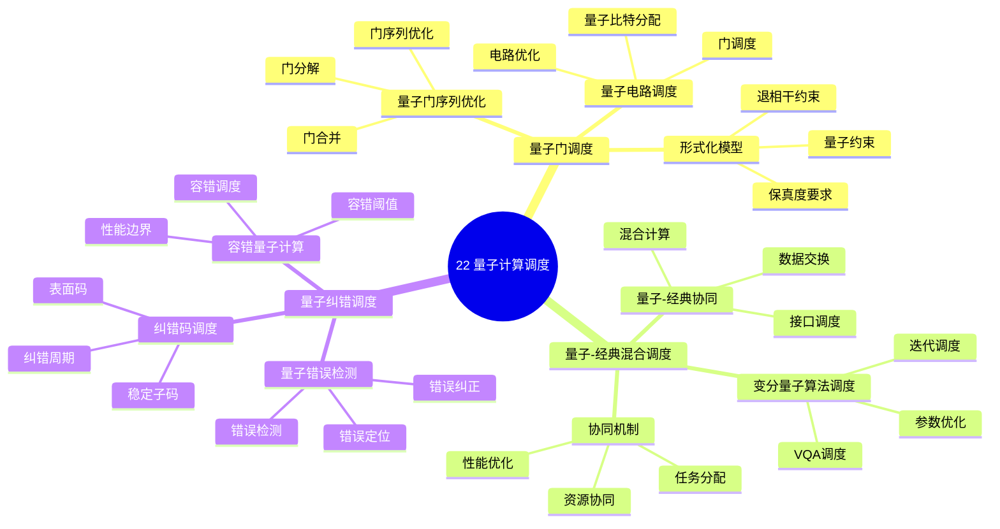

# 22. 量子计算调度

> **主题**: 量子计算中的调度问题
> **覆盖范围**: 量子门调度、量子-经典混合调度、量子纠错调度

---

## 📋 目录

- [22. 量子计算调度](#22-量子计算调度)
  - [📋 目录](#-目录)
  - [1 子主题索引](#1-子主题索引)
    - [1.0 量子计算调度思维导图](#10-量子计算调度思维导图)
  - [2 相关主题](#2-相关主题)
  - [3 核心概念矩阵](#3-核心概念矩阵)
  - [4 量子计算调度特征](#4-量子计算调度特征)
    - [4.1 量子调度的特殊性](#41-量子调度的特殊性)
    - [4.2 调度目标](#42-调度目标)
  - [5 形式化模型](#5-形式化模型)
    - [5.1 量子调度问题定义](#51-量子调度问题定义)

---

## 1 子主题索引

### 1.0 量子计算调度思维导图

**可视化文档**: 查看 [思维导图与知识矩阵](../思维导图与知识矩阵.md#310-10-24-扩展主题) 获取更详细的思维导图。

- [22.1 量子门调度](./22.1_量子门调度.md) - 量子门序列优化、量子电路调度、量子门调度的形式化模型
- [22.2 量子-经典混合调度](./22.2_量子-经典混合调度.md) - 量子-经典协同计算、变分量子算法调度、混合调度的协同机制
- [22.3 量子纠错调度](./22.3_量子纠错调度.md) - 量子错误检测、纠错码调度、容错量子计算、量子调度的性能边界分析

---

## 2 相关主题

- [01. CPU硬件层](../01_CPU硬件层/README.md) - 指令调度、硬件调度
- [06. 调度模型](../06_调度模型/README.md) - 统一调度元模型
- [09. 形式化理论与证明](../09_形式化理论与证明/README.md) - 形式化模型、性能边界证明
- [16. GPU与加速器调度](../16_GPU与加速器调度/README.md) - 异构计算调度
- [19. 实时系统调度](../19_实时系统调度/README.md) - 实时调度、可调度性分析

---

## 3 核心概念矩阵

| **调度层级** | **调度单元** | **延迟范围** | **主要约束** | **典型实现** |
|------------|------------|------------|------------|------------|
| **量子门级** | 量子门操作 | 10-100ns | 量子约束、退相干 | 量子电路优化 |
| **量子电路级** | 量子电路 | 1-100μs | 量子比特数、保真度 | 量子编译器 |
| **量子-经典混合** | 混合任务 | 1-10ms | 量子-经典接口 | 变分量子算法 |
| **量子纠错级** | 纠错周期 | 10-100μs | 纠错码、容错阈值 | 表面码调度 |

---

## 4 量子计算调度特征

### 4.1 量子调度的特殊性

**量子调度的核心特征**：

- **量子约束**：量子不可克隆定理、量子纠缠、量子测量
- **退相干约束**：量子态会随时间退相干，需要快速执行
- **保真度要求**：量子操作必须保持高保真度（>99%）
- **资源限制**：量子比特数量有限，需要高效利用

### 4.2 调度目标

**量子调度的主要目标**：

1. **最小化量子门数**：减少量子门操作数量，降低错误率
2. **最大化保真度**：保持量子操作的高保真度
3. **最小化退相干**：快速执行，减少退相干影响
4. **优化量子比特利用率**：高效利用有限的量子比特资源

---

## 5 形式化模型

### 5.1 量子调度问题定义

**量子调度系统**：

$$
\text{QuantumScheduler} = (Q, G, C, \delta, F)
$$

其中：

- $Q = \{q_1, q_2, ..., q_n\}$：量子比特集合
- $G = \{g_1, g_2, ..., g_m\}$：量子门操作集合
- $C$：量子约束（不可克隆、纠缠、测量）
- $\delta$：调度决策函数
- $F$：保真度函数

**调度目标**：

$$
\min \sum_{g \in G} \text{Time}(g) \quad \text{s.t.} \quad F(\text{circuit}) \geq F_{\text{threshold}}
$$

---

**最后更新**: 2025-11-14
**文档状态**: ✅ 已完成，包含思维导图和2025年最新技术章节
