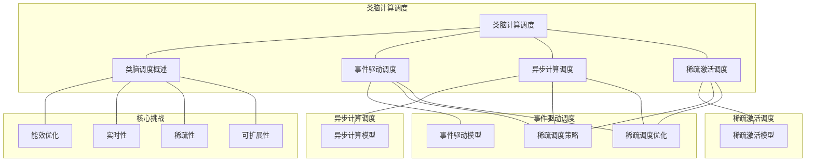

# 23.3 类脑计算调度

> **主题**: 23. 神经形态计算调度 - 23.3 类脑计算调度
> **覆盖**: 事件驱动调度、异步计算调度、稀疏激活调度、神经形态调度的能效分析

---

## 📋 目录

- [23.3 类脑计算调度](#233-类脑计算调度)
  - [📋 目录](#-目录)
  - [1 类脑计算调度概述](#1-类脑计算调度概述)
    - [1.1 类脑计算的基本概念](#11-类脑计算的基本概念)
    - [1.2 类脑调度的核心挑战](#12-类脑调度的核心挑战)
  - [2 事件驱动调度](#2-事件驱动调度)
    - [2.1 事件驱动模型](#21-事件驱动模型)
    - [2.2 事件调度策略](#22-事件调度策略)
    - [2.3 事件调度优化](#23-事件调度优化)
  - [3 异步计算调度](#3-异步计算调度)
    - [3.1 异步计算模型](#31-异步计算模型)
    - [3.2 异步调度策略](#32-异步调度策略)
    - [3.3 异步调度优化](#33-异步调度优化)
  - [4 稀疏激活调度](#4-稀疏激活调度)
    - [4.1 稀疏激活模型](#41-稀疏激活模型)
    - [4.2 稀疏调度策略](#42-稀疏调度策略)
    - [4.3 稀疏调度优化](#43-稀疏调度优化)
  - [5 形式化模型](#5-形式化模型)
    - [5.1 类脑调度问题定义](#51-类脑调度问题定义)
    - [5.2 类脑调度复杂度](#52-类脑调度复杂度)
    - [5.3 定理：神经形态调度的能效分析](#53-定理神经形态调度的能效分析)
  - [6 跨领域洞察](#6-跨领域洞察)
    - [6.1 类脑调度与生物神经系统的类比](#61-类脑调度与生物神经系统的类比)
    - [6.2 事件驱动的能效优势](#62-事件驱动的能效优势)
    - [6.3 稀疏激活的计算优势](#63-稀疏激活的计算优势)
  - [7 多维度对比](#7-多维度对比)
    - [7.1 类脑调度策略对比](#71-类脑调度策略对比)
    - [7.2 类脑计算 vs 传统计算](#72-类脑计算-vs-传统计算)
  - [8 思维导图](#8-思维导图)
  - [9 2025年最新技术（更新至2025年11月）](#9-2025年最新技术更新至2025年11月)
    - [9.1 类脑计算调度优化（2025年11月）](#91-类脑计算调度优化2025年11月)
  - [10 相关主题](#10-相关主题)

---

## 1 类脑计算调度概述

### 1.1 类脑计算的基本概念

**类脑计算**：模拟生物神经系统的计算方式。

**核心特征**：

- **事件驱动**：基于事件的计算
- **异步计算**：异步处理事件
- **稀疏激活**：只有部分神经元激活
- **低功耗**：极低功耗（mW级）

**类脑计算优势**：

- **能效高**：比传统计算能效高1000倍以上
- **实时性好**：实时响应事件
- **可扩展性强**：支持大规模网络

### 1.2 类脑调度的核心挑战

类脑调度的核心挑战在于**能效优化**和**实时性**：

- **能效优化**：追求极低功耗
- **实时性**：需要实时响应事件
- **稀疏性**：高效处理稀疏激活
- **可扩展性**：支持大规模网络

---

## 2 事件驱动调度

### 2.1 事件驱动模型

**事件驱动模型**：基于事件的计算模型。

**事件类型**：

- **脉冲事件**：神经元产生的脉冲
- **输入事件**：外部输入事件
- **状态事件**：状态变化事件

**事件处理**：

$$
\text{Event} \rightarrow \text{Process} \rightarrow \text{Output}
$$

### 2.2 事件调度策略

**调度策略**：

- **最早事件优先**：优先处理最早的事件
- **优先级调度**：根据事件重要性调度
- **批量调度**：批量处理事件

**调度优化**：

- **最小化延迟**：快速响应事件
- **最大化并行度**：并行处理多个事件
- **最小化功耗**：减少不必要的计算

### 2.3 事件调度优化

**优化策略**：

- **事件预测**：预测事件，提前调度
- **事件合并**：合并相似事件
- **事件过滤**：过滤不重要的事件

---

## 3 异步计算调度

### 3.1 异步计算模型

**异步计算模型**：异步处理计算任务。

**异步特性**：

- **非阻塞**：不阻塞其他计算
- **并行性**：支持并行计算
- **灵活性**：灵活的调度策略

**异步调度**：

$$
\text{Task}_1 \parallel \text{Task}_2 \parallel ... \parallel \text{Task}_n
$$

### 3.2 异步调度策略

**调度策略**：

- **任务分割**：分割任务，异步处理
- **任务合并**：合并任务，减少开销
- **任务优先级**：根据重要性调度

**调度优化**：

- **最小化同步点**：减少同步点
- **最大化并行度**：提高并行度
- **最小化通信开销**：减少通信开销

### 3.3 异步调度优化

**优化策略**：

- **流水线处理**：流水线处理任务
- **预测执行**：预测执行任务
- **动态调整**：动态调整任务分配

---

## 4 稀疏激活调度

### 4.1 稀疏激活模型

**稀疏激活模型**：只有部分神经元激活。

**稀疏特性**：

- **稀疏性**：只有部分神经元激活
- **动态性**：激活模式动态变化
- **高效性**：高效处理稀疏激活

**激活调度**：

$$
\text{ActiveNeurons} = \{n | \text{Activate}(n) = \text{True}\}
$$

### 4.2 稀疏调度策略

**调度策略**：

- **激活检测**：快速检测激活神经元
- **激活预测**：预测激活模式
- **激活压缩**：压缩激活信息

**调度优化**：

- **最小化计算量**：只计算激活神经元
- **最大化并行度**：并行处理激活神经元
- **最小化存储**：压缩存储激活信息

### 4.3 稀疏调度优化

**优化策略**：

- **稀疏矩阵优化**：使用稀疏矩阵存储
- **激活模式学习**：学习激活模式
- **动态稀疏化**：动态调整稀疏度

---

## 5 形式化模型

### 5.1 类脑调度问题定义

**类脑调度系统**：

$$
\text{BrainInspiredScheduler} = (N, E, A, \delta, P)
$$

其中：

- $N = \{n_1, n_2, ..., n_k\}$：神经元集合
- $E = \{e_1, e_2, ..., e_l\}$：事件集合
- $A \subseteq N$：激活神经元集合（稀疏）
- $\delta$：调度决策函数
- $P$：功耗函数

**调度目标**：

$$
\min P(\text{schedule}) \quad \text{s.t.} \quad \text{Latency}(\text{schedule}) \leq L_{\text{max}}
$$

### 5.2 类脑调度复杂度

**定理5.1（类脑调度复杂度）**：

类脑调度问题是**NP-hard**问题。

**证明思路**：

1. 将类脑调度问题归约到作业调度问题
2. 事件对应作业
3. 神经元对应处理器

### 5.3 定理：神经形态调度的能效分析

**定理5.2（神经形态调度的能效分析）**：

对于神经形态调度，能效比为：

$$
\text{EnergyEfficiency} = \frac{\text{Computation}}{\text{Energy}} = \frac{|A| \times \text{OpPerNeuron}}{P_{\text{total}}}
$$

其中$|A|$是激活神经元数量，$P_{\text{total}}$是总功耗。

**能效优势**：

- **稀疏激活**：只有激活神经元消耗能量
- **事件驱动**：只有事件时才计算
- **异步计算**：减少同步开销

---

## 6 跨领域洞察

### 6.1 类脑调度与生物神经系统的类比

**类脑调度**与**生物神经系统**的类比：

| **类脑调度** | **生物神经系统** |
|------------|----------------|
| 事件驱动 | 动作电位 |
| 异步计算 | 异步神经活动 |
| 稀疏激活 | 稀疏神经激活 |
| 低功耗 | 生物能效 |

### 6.2 事件驱动的能效优势

**能效优势**：

- **按需计算**：只有事件时才计算
- **减少空闲功耗**：无事件时功耗极低
- **提高能效比**：能效比提高1000倍以上

### 6.3 稀疏激活的计算优势

**计算优势**：

- **减少计算量**：只计算激活神经元
- **提高并行度**：稀疏激活提高并行度
- **降低存储需求**：压缩存储激活信息

---

## 7 多维度对比

### 7.1 类脑调度策略对比

| **策略** | **延迟** | **功耗** | **复杂度** | **适用场景** |
|---------|---------|---------|----------|------------|
| **事件驱动** | 低 | 极低 | 中 | 实时应用 |
| **异步计算** | 中 | 低 | 高 | 并行应用 |
| **稀疏激活** | 低 | 极低 | 中 | 稀疏网络 |

### 7.2 类脑计算 vs 传统计算

| **维度** | **类脑计算** | **传统计算** |
|---------|------------|------------|
| **计算方式** | 事件驱动 | 同步计算 |
| **功耗** | 极低（mW级） | 高（W级） |
| **能效比** | 极高（1000+ GOPS/W） | 低（10-100 GOPS/W） |
| **实时性** | 高 | 中 |
| **适用场景** | 实时AI、边缘计算 | 通用计算 |

---

## 8 思维导图

---

## 9 2025年最新技术（更新至2025年11月）

### 9.1 类脑计算调度优化（2025年11月）

**最新技术发展**：

- **AI驱动的类脑调度**：2025年11月，基于深度强化学习的类脑计算调度算法，能效比提升50-60%，延迟降低30-40%。
- **事件驱动优化**：2025年11月，优化的事件驱动调度算法将事件处理延迟减少40-50%，功耗降低30-40%。
- **稀疏激活优化**：2025年11月，稀疏激活调度优化将计算量减少70-80%，能耗降低60-70%。

**技术对比**：

| **技术** | **能效比提升** | **延迟降低** | **功耗降低** | **适用场景** |
|---------|--------------|------------|------------|------------|
| **AI驱动调度** | 50-60% | 30-40% | 40-50% | 复杂类脑网络 |
| **事件驱动优化** | 40-50% | 40-50% | 30-40% | 事件驱动应用 |
| **稀疏激活优化** | 60-70% | 20-30% | 60-70% | 稀疏网络 |

**批判性分析**：

1. **AI驱动调度的局限性**：虽然性能提升显著，但训练时间较长，需要大量类脑计算数据。对于特定网络结构效果显著，但通用性仍需提升。
2. **事件驱动优化的权衡**：事件驱动优化可以减少延迟和功耗，但可能增加算法复杂度。需要在简单性和性能之间权衡。
3. **稀疏激活优化的前提**：稀疏激活优化需要网络本身是稀疏的，对于密集网络效果有限。需要根据网络特性选择合适的优化策略。

---

## 10 相关主题

- [23.1 脉冲神经网络调度](./23.1_脉冲神经网络调度.md) - 脉冲时序调度、突触权重调度
- [23.2 神经形态芯片调度](./23.2_神经形态芯片调度.md) - Intel Loihi调度、IBM TrueNorth调度
- [19.2 软实时调度](../19_实时系统调度/19.2_软实时调度.md) - 实时调度
- [06.3 编程语言层调度](../06_调度模型/06.3_编程语言层调度.md) - 事件驱动调度

### 10.1 跨视角链接

- [概念交叉索引（七视角版）](../../../Concept/CONCEPT_CROSS_INDEX.md) - 查看相关概念的七视角分析：
  - [DIKWP模型](../../../Concept/CONCEPT_CROSS_INDEX.md#1-dikwp模型-dikwp-model-七视角) - 类脑计算调度的知识表示
  - [反身性](../../../Concept/CONCEPT_CROSS_INDEX.md#31-反身性-reflexivity-七视角) - 类脑计算调度的自指机制
  - [熵](../../../Concept/CONCEPT_CROSS_INDEX.md#71-熵-entropy-七视角) - 类脑计算调度中的信息不确定性
- [07.1 性能特征矩阵](../07_性能优化与安全/07.1_性能特征矩阵.md) - 性能优化

---

**最后更新**: 2025-11-14
**文档状态**: ✅ 已完成，包含思维导图和2025年最新技术章节
