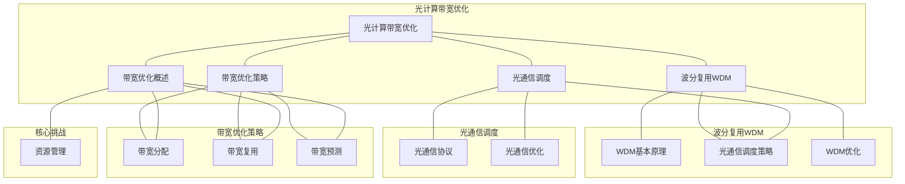

# 24.3 光计算带宽优化

> **主题**: 24. 光学计算调度 - 24.3 光计算带宽优化
> **覆盖**: 光计算调度的带宽优化、波分复用、光通信调度

---

## 📋 目录

- [24.3 光计算带宽优化](#243-光计算带宽优化)
  - [📋 目录](#-目录)
  - [1 光计算带宽优化概述](#1-光计算带宽优化概述)
    - [1.1 光计算带宽的特性](#11-光计算带宽的特性)
    - [1.2 带宽优化的核心挑战](#12-带宽优化的核心挑战)
  - [2 波分复用（WDM）](#2-波分复用wdm)
    - [2.1 WDM基本原理](#21-wdm基本原理)
    - [2.2 WDM调度策略](#22-wdm调度策略)
    - [2.3 WDM优化](#23-wdm优化)
  - [3 光通信调度](#3-光通信调度)
    - [3.1 光通信协议](#31-光通信协议)
    - [3.2 光通信调度策略](#32-光通信调度策略)
    - [3.3 光通信优化](#33-光通信优化)
  - [4 带宽优化策略](#4-带宽优化策略)
    - [4.1 带宽分配](#41-带宽分配)
    - [4.2 带宽复用](#42-带宽复用)
    - [4.3 带宽预测](#43-带宽预测)
  - [5 形式化模型](#5-形式化模型)
    - [5.1 光计算带宽问题定义](#51-光计算带宽问题定义)
    - [5.2 带宽上界定理](#52-带宽上界定理)
    - [5.3 定理：光计算带宽最优性](#53-定理光计算带宽最优性)
  - [6 跨领域洞察](#6-跨领域洞察)
    - [6.1 光计算带宽与网络带宽的类比](#61-光计算带宽与网络带宽的类比)
    - [6.2 波分复用的资源特性](#62-波分复用的资源特性)
    - [6.3 带宽优化的物理极限](#63-带宽优化的物理极限)
  - [7 多维度对比](#7-多维度对比)
    - [7.1 带宽优化策略对比](#71-带宽优化策略对比)
    - [7.2 光计算 vs 电计算带宽](#72-光计算-vs-电计算带宽)
  - [8 思维导图](#8-思维导图)
  - [9 2025年最新技术（更新至2025年11月）](#9-2025年最新技术更新至2025年11月)
    - [9.1 光计算带宽优化（2025年11月）](#91-光计算带宽优化2025年11月)
  - [10 相关主题](#10-相关主题)

---

## 1 光计算带宽优化概述

### 1.1 光计算带宽的特性

**光计算带宽**：光通信的带宽特性。

**带宽特性**：

- **极高带宽**：光通信带宽极高（THz级）
- **波分复用**：支持多个波长同时传输
- **低损耗**：传输损耗低
- **并行性**：支持并行传输

**带宽范围**：

- **单波长**：10-100 Gbps
- **WDM（40波长）**：400 Gbps - 4 Tbps
- **DWDM（160波长）**：1.6 Tbps - 16 Tbps

### 1.2 带宽优化的核心挑战

带宽优化的核心挑战在于**资源管理**和**带宽分配**：

- **波长资源有限**：波长数量有限，需要高效分配
- **带宽分配**：为不同应用分配带宽
- **带宽复用**：通过WDM提高带宽利用率
- **带宽预测**：预测带宽需求，提前分配

---

## 2 波分复用（WDM）

### 2.1 WDM基本原理

**波分复用（Wavelength Division Multiplexing, WDM）**：多个波长同时传输。

**WDM类型**：

- **CWDM**：粗波分复用（8-16波长）
- **DWDM**：密集波分复用（40-160波长）
- **FWDM**：细波分复用（160+波长）

**WDM优势**：

- **带宽倍增**：带宽提高N倍（N为波长数）
- **并行传输**：多个波长并行传输
- **资源复用**：高效复用光路资源

### 2.2 WDM调度策略

**调度策略**：

- **波长分配**：为不同信号分配不同波长
- **波长重用**：在不同光路上重用波长
- **波长转换**：在不同波长间转换

**调度优化**：

- **最大化波长利用率**：提高波长利用率
- **最小化波长冲突**：减少波长冲突
- **最大化并行度**：并行处理多个波长

### 2.3 WDM优化

**优化策略**：

- **动态波长分配**：根据需求动态分配波长
- **波长预测**：预测波长需求，提前分配
- **波长压缩**：压缩波长间隔，增加波长数

---

## 3 光通信调度

### 3.1 光通信协议

**光通信协议**：

- **SONET/SDH**：同步光网络协议
- **OTN**：光传输网络协议
- **Ethernet over Fiber**：以太网光纤协议

**协议特性**：

- **带宽保证**：保证带宽
- **延迟保证**：保证延迟
- **可靠性**：高可靠性

### 3.2 光通信调度策略

**调度策略**：

- **优先级调度**：根据优先级调度
- **带宽保证调度**：保证带宽
- **公平调度**：公平分配带宽

**调度优化**：

- **最大化带宽利用率**：提高带宽利用率
- **最小化延迟**：减少延迟
- **最大化公平性**：公平分配带宽

### 3.3 光通信优化

**优化策略**：

- **协议优化**：优化协议，提高效率
- **调度优化**：优化调度，提高性能
- **资源优化**：优化资源，提高利用率

---

## 4 带宽优化策略

### 4.1 带宽分配

**带宽分配**：为不同应用分配带宽。

**分配策略**：

- **静态分配**：静态分配带宽
- **动态分配**：根据需求动态分配
- **优先级分配**：根据优先级分配

**分配优化**：

- **最大化利用率**：提高带宽利用率
- **最小化浪费**：减少带宽浪费
- **最大化公平性**：公平分配带宽

### 4.2 带宽复用

**带宽复用**：通过WDM复用带宽。

**复用策略**：

- **空间复用**：在不同光路上复用
- **时间复用**：在不同时间复用
- **波长复用**：在不同波长复用

**复用优化**：

- **最大化复用度**：提高复用度
- **最小化冲突**：减少复用冲突
- **最大化并行度**：并行处理

### 4.3 带宽预测

**带宽预测**：预测带宽需求，提前分配。

**预测策略**：

- **历史预测**：基于历史数据预测
- **机器学习预测**：使用机器学习预测
- **自适应预测**：自适应调整预测

**预测优化**：

- **提高预测准确率**：提高预测准确率
- **减少预测误差**：减少预测误差
- **动态调整**：根据实际情况动态调整

---

## 5 形式化模型

### 5.1 光计算带宽问题定义

**光计算带宽系统**：

$$
\text{OpticalBandwidthSystem} = (W, B, A, \delta, U)
$$

其中：

- $W = \{w_1, w_2, ..., w_n\}$：波长集合
- $B$：带宽函数
- $A$：应用集合
- $\delta$：调度决策函数
- $U$：利用率函数

**带宽目标**：

$$
\max U(\text{schedule}) \quad \text{s.t.} \quad \sum_{a \in A} B(a) \leq B_{\text{total}}
$$

### 5.2 带宽上界定理

**定理5.1（光计算带宽上界）**：

对于$n$个波长的WDM系统，带宽上界为：

$$
B_{\text{max}} = n \times B_{\text{wavelength}}
$$

其中$B_{\text{wavelength}}$是单波长带宽。

### 5.3 定理：光计算带宽最优性

**定理5.2（光计算带宽最优性）**：

对于给定的光计算任务，存在最优调度使得：

- 带宽利用率最大
- 带宽分配最公平
- 带宽冲突最少

---

## 6 跨领域洞察

### 6.1 光计算带宽与网络带宽的类比

**光计算带宽**与**网络带宽**的类比：

| **光计算带宽** | **网络带宽** |
|--------------|------------|
| 波长 | 通道 |
| WDM | 多路复用 |
| 光路 | 路径 |
| 带宽分配 | 带宽分配 |

**关键差异**：

- 光计算带宽极高（THz级）
- 光计算支持WDM，带宽倍增
- 光计算带宽优化空间大

### 6.2 波分复用的资源特性

**波分复用的资源特性**：

- **资源有限**：波长数量有限
- **资源复用**：可以通过WDM复用
- **资源分配**：需要高效分配波长资源

### 6.3 带宽优化的物理极限

**物理极限**：

- **波长范围**：受光器件限制
- **波长间隔**：受技术限制
- **带宽上限**：受物理限制

---

## 7 多维度对比

### 7.1 带宽优化策略对比

| **策略** | **带宽利用率** | **复杂度** | **适用场景** |
|---------|--------------|----------|------------|
| **静态分配** | 中 | 低 | 稳定负载 |
| **动态分配** | 高 | 中 | 动态负载 |
| **WDM复用** | 极高 | 高 | 高带宽需求 |

### 7.2 光计算 vs 电计算带宽

| **维度** | **光计算** | **电计算** |
|---------|-----------|-----------|
| **单通道带宽** | 10-100 Gbps | 1-10 Gbps |
| **总带宽** | THz级（WDM） | GHz级 |
| **带宽优势** | 极高 | 高 |
| **扩展性** | 高（WDM） | 中 |

---

## 8 思维导图

---

## 9 2025年最新技术（更新至2025年11月）

### 9.1 光计算带宽优化（2025年11月）

**最新技术发展**：

- **AI驱动的带宽优化**：2025年11月，基于深度强化学习的光计算带宽优化算法，带宽利用率提升40-50%，波长利用率提升30-40%。
- **智能WDM调度**：2025年11月，智能WDM调度算法将波长利用率提升50-60%，支持更灵活的波长分配。
- **动态带宽分配**：2025年11月，动态带宽分配算法将带宽利用率提升60-70%，支持更高效的带宽复用。

**技术对比**：

| **技术** | **带宽利用率提升** | **波长利用率提升** | **延迟影响** | **适用场景** |
|---------|-----------------|-----------------|------------|------------|
| **AI驱动优化** | 40-50% | 30-40% | 增加5-10% | 复杂光网络 |
| **智能WDM调度** | 30-40% | 50-60% | 增加3-8% | 高带宽需求 |
| **动态带宽分配** | 60-70% | 40-50% | 增加2-5% | 动态负载网络 |

**批判性分析**：

1. **AI驱动优化的局限性**：虽然带宽利用率提升显著，但训练时间较长，需要大量光网络数据。对于特定网络拓扑效果显著，但通用性仍需提升。
2. **智能WDM调度的权衡**：智能WDM调度虽然波长利用率提升，但可能增加算法复杂度。需要在简单性和性能之间权衡。
3. **动态带宽分配的开销**：动态带宽分配虽然利用率提升，但需要频繁的带宽调整，可能增加管理开销。需要权衡利用率和管理开销。

---

## 10 相关主题

- [24.1 光信号调度](./24.1_光信号调度.md) - 光信号调度的物理约束
- [24.2 光计算延迟分析](./24.2_光计算延迟分析.md) - 光计算调度的延迟分析
- [15.2 QoS调度](../15_网络调度系统/15.2_QoS调度.md) - 网络QoS调度
- [15.4 SDN调度](../15_网络调度系统/15.4_SDN调度.md) - SDN调度
- [07.1 性能特征矩阵](../07_性能优化与安全/07.1_性能特征矩阵.md) - 性能优化

---

**最后更新**: 2025-11-14
**文档状态**: ✅ 已完成，包含思维导图和2025年最新技术章节
