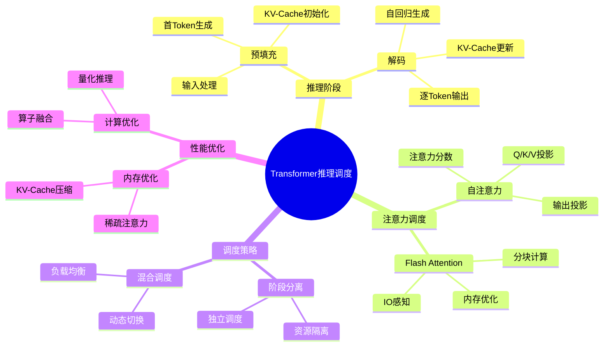
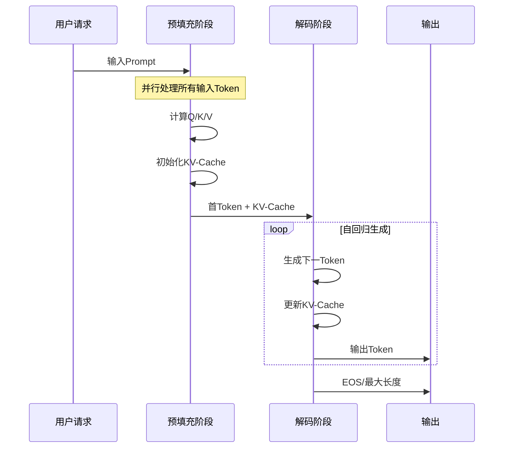
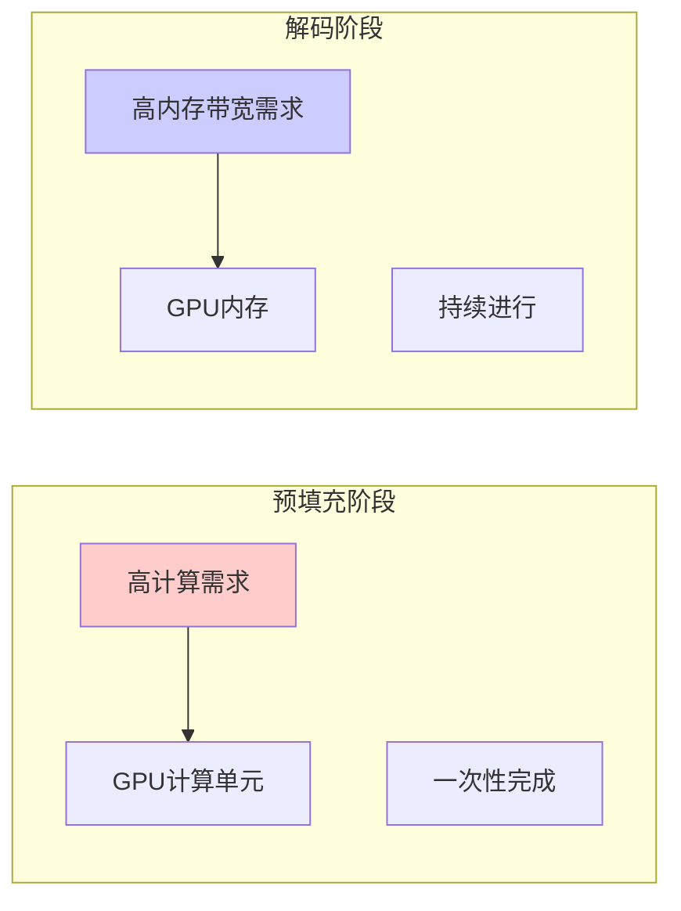
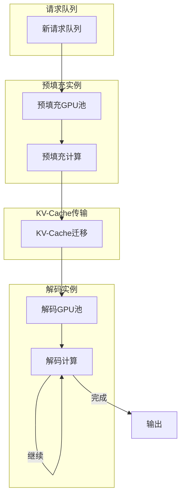
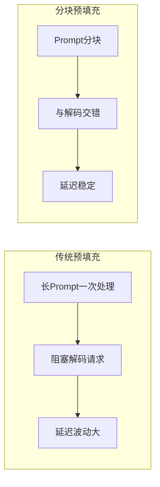
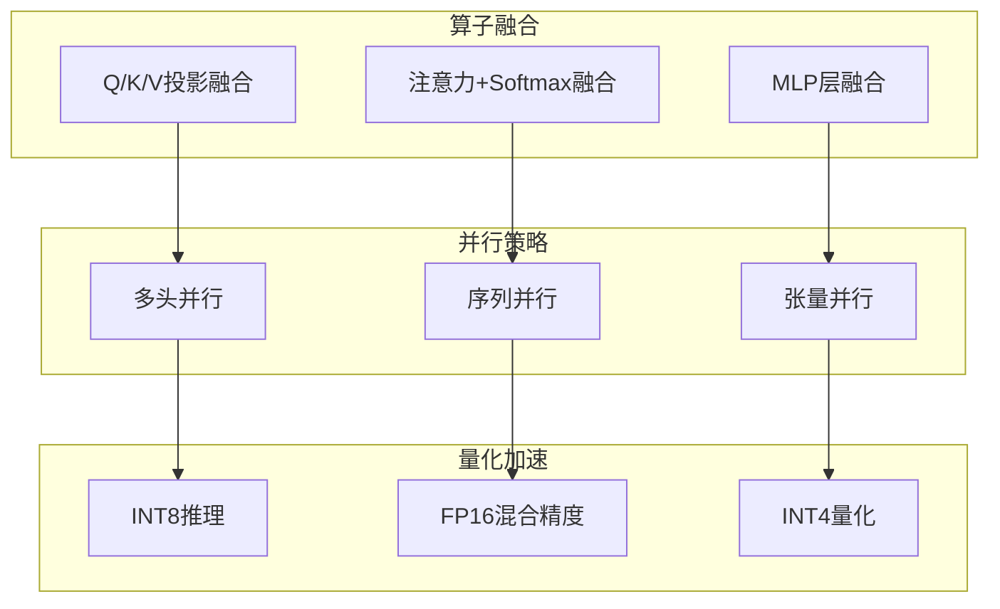
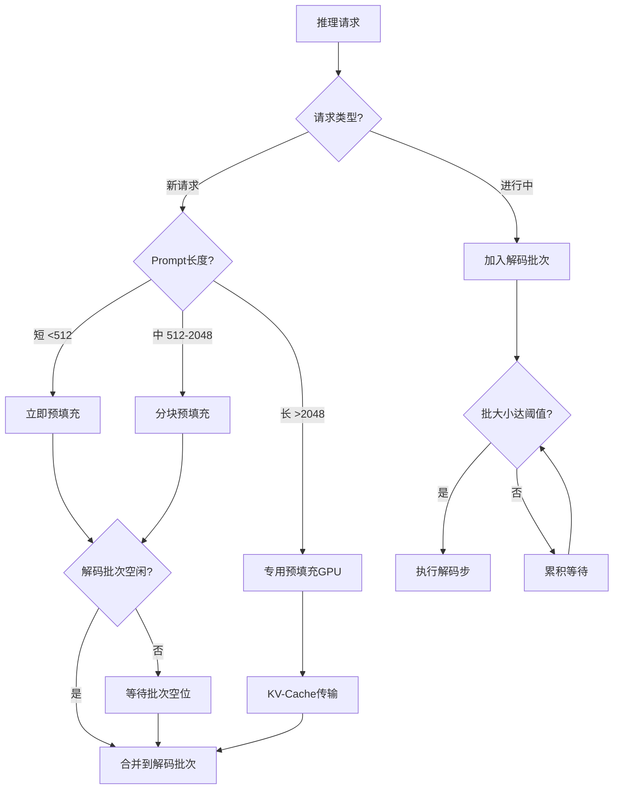

# 25.1 Transformer推理调度

> **子主题编号**: 25.1
> **主题**: LLM推理调度
> **最后更新**: 2025-12-02
> **文档状态**: ✅ 完成

---

## 📋 目录

- [1 概述](#1-概述)
- [2 思维导图](#2-思维导图)
- [3 Transformer推理阶段](#3-transformer推理阶段)
- [4 注意力机制调度](#4-注意力机制调度)
- [5 预填充与解码分离](#5-预填充与解码分离)
- [6 知识矩阵](#6-知识矩阵)
- [7 形式化模型](#7-形式化模型)
- [8 优化策略](#8-优化策略)
- [9 跨视角链接](#9-跨视角链接)

---

## 1 概述

### 1.1 核心洞察

Transformer推理调度的核心挑战在于自回归生成的特性：每个新Token的生成都依赖于之前所有Token的注意力计算，这导致了独特的调度模式。

### 1.2 推理特性对比

| 特性 | 预填充阶段 (Prefill) | 解码阶段 (Decode) |
|------|---------------------|------------------|
| **计算模式** | 计算密集型 | 内存密集型 |
| **批处理** | 高效 | 受KV-Cache限制 |
| **GPU利用率** | 高 | 通常较低 |
| **延迟组成** | 首Token延迟 | Token间延迟 |
| **并行度** | 高（Token间并行） | 低（序列依赖） |

---

## 2 思维导图



---

## 3 Transformer推理阶段

### 3.1 阶段详解



### 3.2 计算复杂度分析

```text
预填充阶段 (输入长度 n):
  时间复杂度: O(n² · d)  [注意力计算]
  空间复杂度: O(n · d)   [KV-Cache]

解码阶段 (生成 m 个Token):
  每步时间: O(n · d)     [与历史注意力]
  总时间: O(m · n · d)
  空间增长: O(m · d)     [KV-Cache增量]

其中 d = 模型隐藏维度
```

### 3.3 阶段资源需求对比



---

## 4 注意力机制调度

### 4.1 标准注意力计算

```text
标准自注意力:
  Attention(Q, K, V) = softmax(QK^T / √d_k) · V

调度步骤:
  1. Q, K, V 线性投影 (并行)
  2. 注意力分数计算 (O(n²))
  3. Softmax归一化
  4. 加权求和
  5. 输出投影
```

### 4.2 Flash Attention优化

Flash Attention通过分块计算和IO感知优化，显著减少内存访问：

```mermaid
graph TB
    subgraph "标准注意力"
        S1[完整QK^T矩阵]
        S2[O(n²) HBM读写]
        S3[内存瓶颈]
    end

    subgraph "Flash Attention"
        F1[分块计算]
        F2[SRAM复用]
        F3[在线Softmax]
        F4[单次HBM写入]
    end

    S1 --> S2 --> S3
    F1 --> F2 --> F3 --> F4

    style S3 fill:#ffcccc
    style F4 fill:#ccffcc
```

### 4.3 Flash Attention算法

```python
# Flash Attention 伪代码
def flash_attention(Q, K, V, block_size):
    """
    分块计算注意力，减少HBM访问
    """
    N = Q.shape[0]
    output = zeros_like(Q)

    for i in range(0, N, block_size):
        # 加载Q块到SRAM
        Q_block = Q[i:i+block_size]

        # 在线Softmax状态
        m_i = -inf  # 最大值
        l_i = 0     # 归一化因子
        O_i = 0     # 累积输出

        for j in range(0, N, block_size):
            # 加载K, V块到SRAM
            K_block = K[j:j+block_size]
            V_block = V[j:j+block_size]

            # 计算局部注意力分数
            S_ij = Q_block @ K_block.T / sqrt(d)

            # 在线Softmax更新
            m_new = max(m_i, S_ij.max())
            l_new = exp(m_i - m_new) * l_i + exp(S_ij - m_new).sum()
            O_i = exp(m_i - m_new) * O_i + exp(S_ij - m_new) @ V_block

            m_i, l_i = m_new, l_new

        output[i:i+block_size] = O_i / l_i

    return output
```

---

## 5 预填充与解码分离

### 5.1 分离调度架构



### 5.2 Splitwise/DistServe架构

```text
分离式部署优势:
  1. 资源专门化: 预填充GPU可选择计算优化型，解码GPU选择内存优化型
  2. 独立扩展: 根据负载独立扩展预填充或解码实例
  3. SLO优化: 分别优化首Token延迟和吞吐量

调度策略:
  预填充调度: FCFS或优先级队列
  解码调度: 批次合并，Continuous Batching
  KV-Cache: 高速互联传输 (NVLink/InfiniBand)
```

### 5.3 分块预填充 (Chunked Prefill)



**分块预填充调度算法**:

```python
def chunked_prefill_schedule(prefill_requests, decode_batch, chunk_size):
    """
    分块预填充调度，与解码请求交错执行
    """
    schedule = []

    while prefill_requests or decode_batch:
        # 处理一个预填充块
        if prefill_requests:
            req = prefill_requests[0]
            chunk = req.get_next_chunk(chunk_size)
            schedule.append(('prefill', chunk))

            if req.is_complete():
                prefill_requests.pop(0)
                decode_batch.append(req)

        # 处理解码批次
        if decode_batch:
            schedule.append(('decode', decode_batch))

            # 移除完成的请求
            decode_batch = [r for r in decode_batch if not r.is_done()]

    return schedule
```

---

## 6 知识矩阵

### 6.1 推理优化技术矩阵

| 技术 | 优化目标 | 适用阶段 | 加速比 | 内存节省 |
|------|---------|---------|-------|---------|
| **Flash Attention** | 计算+内存 | 两阶段 | 2-4x | 10-20x |
| **Flash Attention 2** | 计算 | 两阶段 | 2x vs FA1 | - |
| **PagedAttention** | 内存 | 解码 | 1.5x | 2-4x |
| **分块预填充** | 延迟 | 预填充 | - | - |
| **推测解码** | 延迟 | 解码 | 2-3x | - |
| **量化推理** | 计算+内存 | 两阶段 | 1.5-2x | 2-4x |
| **稀疏注意力** | 计算 | 两阶段 | 2-4x | 2-4x |

### 6.2 系统对比矩阵

| 系统 | 预填充优化 | 解码优化 | 批处理 | 分布式 | 特色 |
|------|-----------|---------|-------|-------|------|
| **vLLM** | Flash Attn | PagedAttn | Continuous | ✅ | 内存效率 |
| **TensorRT-LLM** | CUDA优化 | 量化推理 | In-flight | ✅ | 低延迟 |
| **TGI** | Flash Attn | 标准 | Continuous | ✅ | 易部署 |
| **SGLang** | RadixAttn | RadixAttn | Continuous | ✅ | 前缀共享 |
| **DeepSpeed** | Flash Attn | ZeRO | 静态 | ✅ | 大模型 |

---

## 7 形式化模型

### 7.1 推理调度形式化

```text
定义: Transformer推理调度系统

结构 TransformerScheduler:
  State = {
    prefill_queue: Queue<Request>,
    decode_batch: Set<Request>,
    kv_cache: Map<RequestId, KVCache>,
    gpu_memory: MemoryPool
  }

  推理阶段类型 Phase = Prefill | Decode

  调度函数 schedule: State → Action
  其中 Action =
    | RunPrefill(requests: List<Request>)
    | RunDecode(batch: Set<Request>)
    | Idle

约束条件:
  ∀r ∈ decode_batch: kv_cache[r.id] ≠ ∅
  Σ(kv_cache[r].size for r in decode_batch) ≤ gpu_memory.capacity
```

### 7.2 延迟模型

```text
总延迟分解:

TTFT (Time To First Token):
  T_TTFT = T_queue + T_prefill
  T_prefill = f(input_length, batch_size, model_size)

TPOT (Time Per Output Token):
  T_TPOT = T_decode_step
  T_decode_step = g(batch_size, seq_length, memory_bandwidth)

端到端延迟:
  T_total = T_TTFT + (output_length - 1) × T_TPOT
```

### 7.3 吞吐量模型

```text
吞吐量计算:

批处理吞吐量:
  Throughput = batch_size × tokens_per_second

GPU利用率约束:
  Utilization = min(compute_bound, memory_bound)

  compute_bound = FLOPs_required / GPU_FLOPs
  memory_bound = memory_access / memory_bandwidth

最优批大小:
  batch_size_opt = argmax_b { Throughput(b) | Memory(b) ≤ GPU_Memory }
```

---

## 8 优化策略

### 8.1 计算优化



### 8.2 内存优化

| 优化技术 | 原理 | 内存节省 | 适用场景 |
|---------|------|---------|---------|
| **KV-Cache量化** | INT8/FP8存储 | 50-75% | 长序列 |
| **PagedAttention** | 按需分配 | 50-90% | 通用 |
| **多查询注意力(MQA)** | 共享KV | 50-90% | 模型设计 |
| **分组查询注意力(GQA)** | KV分组 | 30-70% | 模型设计 |
| **稀疏注意力** | 稀疏模式 | 50-80% | 特定任务 |

### 8.3 调度优化决策树



---

## 9 跨视角链接

### 9.1 调度视角关联

- [GPU任务调度](../16_GPU与加速器调度/16.1_GPU任务调度.md) - GPU计算调度基础
- [异构计算调度](../16_GPU与加速器调度/16.4_异构计算调度.md) - CPU-GPU协同
- [分布式调度](../06_调度模型/06.4_分布式系统调度.md) - 集群级调度

### 9.2 形式语言视角关联

| 形式语言概念 | LLM调度对应 | 映射说明 |
|------------|------------|---------|
| **线性类型** | KV-Cache生命周期 | 资源所有权管理 |
| **效应系统** | 推理状态追踪 | 副作用管理 |
| **依赖类型** | 动态序列长度 | 运行时类型依赖 |

---

**返回**: [LLM推理调度主索引](./README.md) | [调度视角主索引](../README.md)
