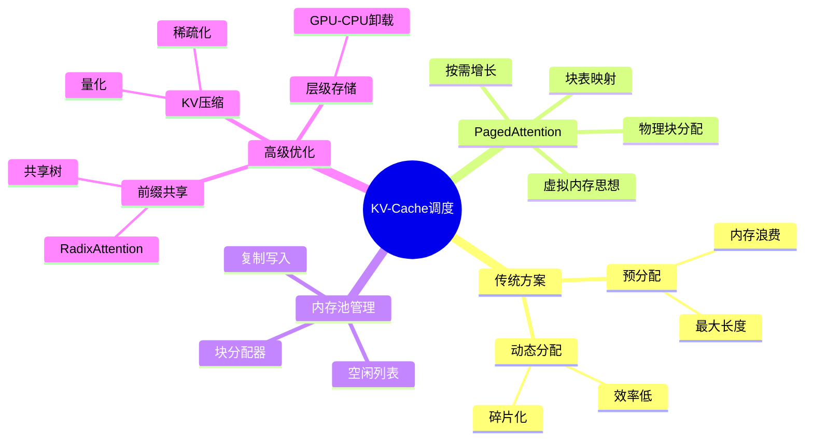
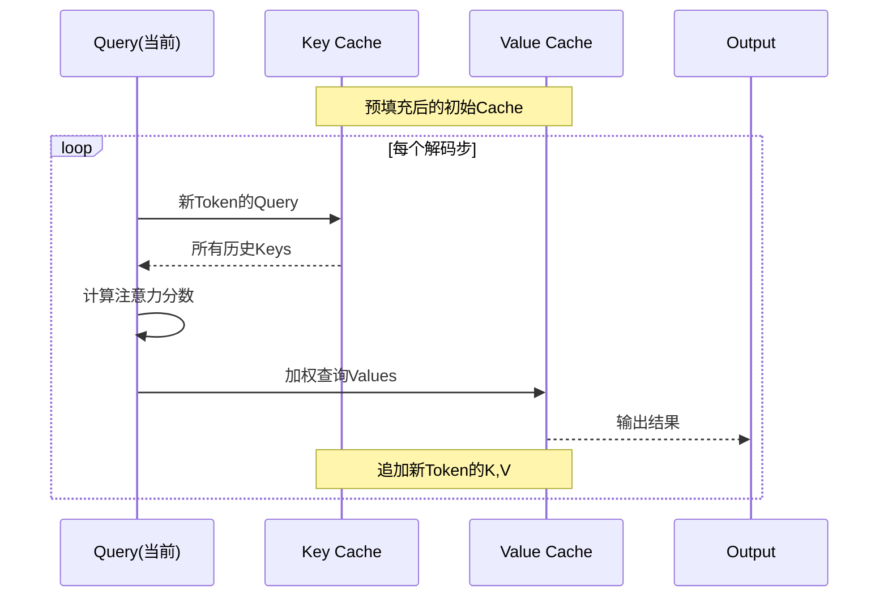
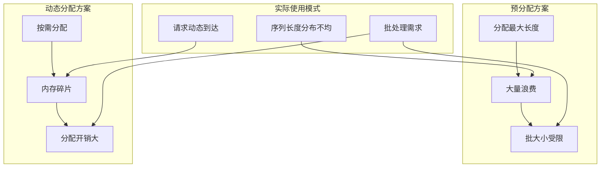
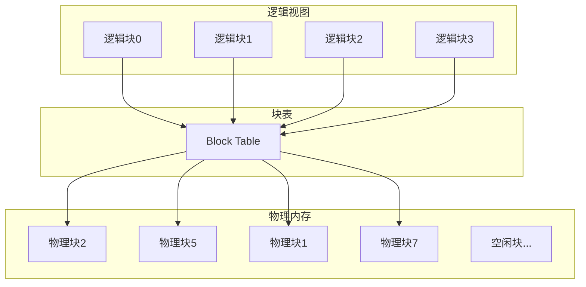
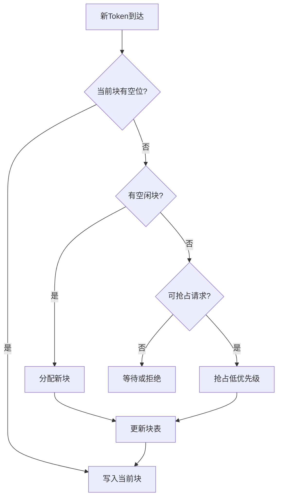
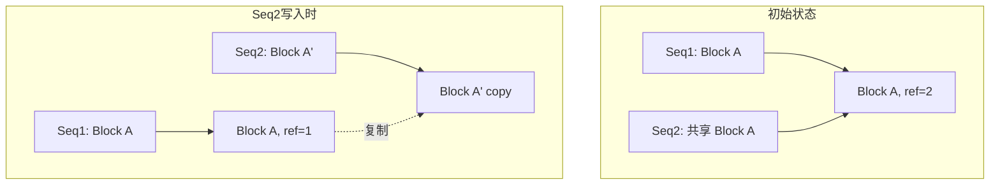
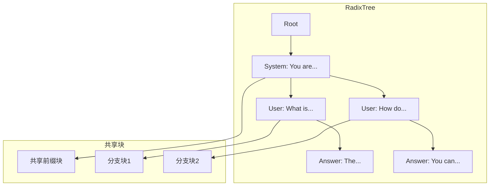
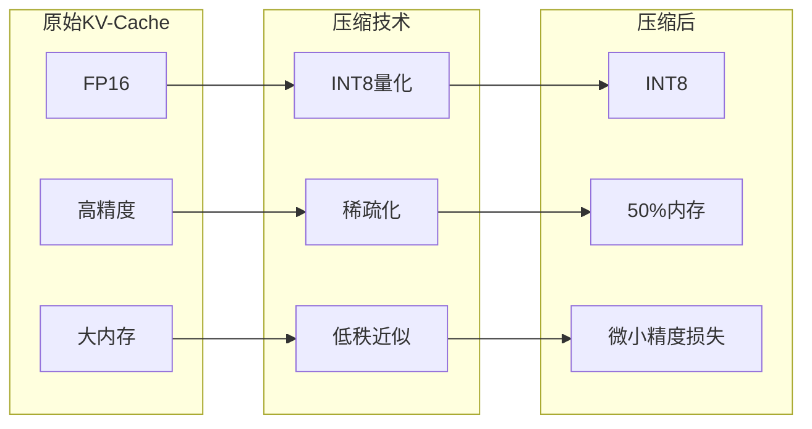

# 25.2 KV-Cache调度

> **子主题编号**: 25.2
> **主题**: LLM推理调度
> **最后更新**: 2025-12-02
> **文档状态**: ✅ 完成

---

## 📋 目录

- [1 概述](#1-概述)
- [2 思维导图](#2-思维导图)
- [3 KV-Cache原理](#3-kv-cache原理)
- [4 PagedAttention](#4-pagedattention)
- [5 内存管理策略](#5-内存管理策略)
- [6 知识矩阵](#6-知识矩阵)
- [7 形式化模型](#7-形式化模型)
- [8 高级优化](#8-高级优化)
- [9 跨视角链接](#9-跨视角链接)

---

## 1 概述

### 1.1 核心洞察

KV-Cache是LLM推理中最关键的内存管理问题。在自回归生成过程中，每个Token的注意力计算需要访问之前所有Token的Key和Value向量，将这些向量缓存起来可以避免重复计算，但会带来巨大的内存开销。

### 1.2 KV-Cache挑战

| 挑战 | 描述 | 影响 |
|------|------|------|
| **内存增长** | 随序列长度线性增长 | 限制最大序列长度 |
| **碎片化** | 请求长度不一导致碎片 | 内存利用率低 |
| **动态性** | 序列长度运行时确定 | 预分配困难 |
| **共享需求** | 前缀共享、Beam Search | 复制开销大 |

### 1.3 KV-Cache内存计算

```text
单请求KV-Cache大小:
  Size = 2 × num_layers × seq_len × num_heads × head_dim × dtype_size

示例 (LLaMA-70B, FP16, 2048 tokens):
  Size = 2 × 80 × 2048 × 64 × 128 × 2 bytes
       = 2 × 80 × 2048 × 8192 × 2 bytes
       ≈ 5.24 GB (单请求!)

批大小=32时:
  Total = 32 × 5.24 GB ≈ 168 GB > 单GPU容量
```

---

## 2 思维导图



---

## 3 KV-Cache原理

### 3.1 注意力计算中的KV-Cache



### 3.2 传统内存管理问题



### 3.3 内存碎片化示例

```text
传统分配导致的碎片:

时间T1 (3个请求，预分配2048):
┌──────────────────────┐
│ Req1: 512 used │空闲1536│  ← 75%浪费
├──────────────────────┤
│ Req2: 1024 used│空闲1024│  ← 50%浪费
├──────────────────────┤
│ Req3: 256 used │空闲1792│  ← 87.5%浪费
└──────────────────────┘

整体利用率: (512+1024+256)/(3×2048) = 29.2%
```

---

## 4 PagedAttention

### 4.1 核心思想

PagedAttention借鉴操作系统虚拟内存的分页机制，将KV-Cache分割成固定大小的块（Block），通过块表（Block Table）管理逻辑块到物理块的映射。



### 4.2 数据结构

```python
# PagedAttention 核心数据结构

class Block:
    """物理内存块"""
    def __init__(self, block_size: int, num_layers: int):
        self.block_size = block_size  # Token数量
        self.num_layers = num_layers
        # 每层的K和V张量
        self.k_cache: Tensor  # [num_layers, block_size, num_heads, head_dim]
        self.v_cache: Tensor  # [num_layers, block_size, num_heads, head_dim]
        self.ref_count: int = 0  # 引用计数（用于共享）

class BlockTable:
    """逻辑块到物理块的映射表"""
    def __init__(self):
        self.table: List[int] = []  # table[i] = 物理块索引

    def append_block(self, physical_block_id: int):
        self.table.append(physical_block_id)

    def get_physical_block(self, logical_idx: int) -> int:
        return self.table[logical_idx]

class KVCacheManager:
    """KV-Cache管理器"""
    def __init__(self, num_blocks: int, block_size: int):
        self.num_blocks = num_blocks
        self.block_size = block_size
        self.free_blocks: List[int] = list(range(num_blocks))
        self.block_tables: Dict[int, BlockTable] = {}  # request_id -> BlockTable

    def allocate(self, request_id: int) -> int:
        """为请求分配一个新块"""
        if not self.free_blocks:
            raise MemoryError("No free blocks")
        block_id = self.free_blocks.pop()
        if request_id not in self.block_tables:
            self.block_tables[request_id] = BlockTable()
        self.block_tables[request_id].append_block(block_id)
        return block_id

    def free(self, request_id: int):
        """释放请求的所有块"""
        if request_id in self.block_tables:
            for block_id in self.block_tables[request_id].table:
                self.free_blocks.append(block_id)
            del self.block_tables[request_id]
```

### 4.3 PagedAttention计算

```python
def paged_attention(
    query: Tensor,           # [batch, 1, num_heads, head_dim]
    key_cache: Tensor,       # [num_blocks, block_size, num_heads, head_dim]
    value_cache: Tensor,     # [num_blocks, block_size, num_heads, head_dim]
    block_tables: Tensor,    # [batch, max_num_blocks]
    context_lens: Tensor,    # [batch]
) -> Tensor:
    """
    分页注意力计算
    """
    batch_size = query.shape[0]
    outputs = []

    for b in range(batch_size):
        ctx_len = context_lens[b]
        num_blocks = (ctx_len + block_size - 1) // block_size

        # 收集该请求的所有K,V块
        keys = []
        values = []
        for i in range(num_blocks):
            physical_block = block_tables[b, i]
            keys.append(key_cache[physical_block])
            values.append(value_cache[physical_block])

        # 拼接并计算注意力
        k = torch.cat(keys, dim=0)[:ctx_len]
        v = torch.cat(values, dim=0)[:ctx_len]

        attn_output = scaled_dot_product_attention(query[b], k, v)
        outputs.append(attn_output)

    return torch.stack(outputs)
```

### 4.4 内存效率对比

```text
PagedAttention vs 传统方案:

场景: 3个请求，实际长度 [512, 1024, 256], 块大小=16

传统预分配 (max_len=2048):
  总分配: 3 × 2048 = 6144 slots
  实际使用: 512 + 1024 + 256 = 1792 slots
  利用率: 29.2%

PagedAttention:
  Req1: 512/16 = 32 blocks
  Req2: 1024/16 = 64 blocks
  Req3: 256/16 = 16 blocks
  总分配: 112 blocks = 1792 slots
  利用率: 100% (无浪费)

内存节省: (6144-1792)/6144 = 70.8%
```

---

## 5 内存管理策略

### 5.1 块分配策略



### 5.2 抢占与换出策略

```python
class PreemptionPolicy:
    """抢占策略"""

    @staticmethod
    def select_victim(requests: List[Request], needed_blocks: int) -> List[Request]:
        """选择被抢占的请求"""
        # 策略1: FCFS逆序（最后到达的先抢占）
        # 策略2: 最短剩余优先（接近完成的保留）
        # 策略3: 优先级（低优先级先抢占）

        candidates = sorted(requests, key=lambda r: r.priority)
        victims = []
        freed_blocks = 0

        for req in candidates:
            if freed_blocks >= needed_blocks:
                break
            victims.append(req)
            freed_blocks += req.num_blocks

        return victims

class SwapPolicy:
    """换出到CPU/磁盘策略"""

    def swap_out(self, request: Request):
        """将请求的KV-Cache换出到CPU"""
        for block_id in request.block_table.table:
            gpu_block = self.gpu_blocks[block_id]
            cpu_block = self.cpu_allocate()
            # 异步复制
            cpu_block.copy_from_async(gpu_block)
            request.cpu_block_table.append(cpu_block)
        # 释放GPU块
        self.free_gpu_blocks(request.block_table)

    def swap_in(self, request: Request):
        """将请求的KV-Cache换入GPU"""
        for cpu_block_id in request.cpu_block_table.table:
            gpu_block_id = self.gpu_allocate()
            gpu_block = self.gpu_blocks[gpu_block_id]
            cpu_block = self.cpu_blocks[cpu_block_id]
            gpu_block.copy_from_async(cpu_block)
            request.block_table.append(gpu_block_id)
```

### 5.3 Copy-on-Write（写时复制）

用于Beam Search和前缀共享场景：



---

## 6 知识矩阵

### 6.1 KV-Cache管理技术对比

| 技术 | 内存效率 | 计算开销 | 复杂度 | 适用场景 |
|------|---------|---------|-------|---------|
| **预分配** | 低 | 低 | 低 | 固定长度 |
| **动态分配** | 中 | 高 | 中 | 小批量 |
| **PagedAttention** | 高 | 中 | 中 | 通用 |
| **RadixAttention** | 极高 | 中 | 高 | 前缀共享 |
| **分层存储** | 极高 | 高 | 高 | 超长序列 |

### 6.2 块大小选择矩阵

| 块大小 | 内存碎片 | 元数据开销 | 计算效率 | 推荐场景 |
|-------|---------|-----------|---------|---------|
| **8** | 极低 | 高 | 低 | 极短序列 |
| **16** | 低 | 中 | 中 | 通用 |
| **32** | 中 | 低 | 高 | 长序列 |
| **64** | 高 | 极低 | 极高 | 固定长序列 |

---

## 7 形式化模型

### 7.1 PagedAttention形式化

```text
定义: 分页KV-Cache系统

结构 PagedKVCache:
  PhysicalMemory = Array<Block>  // 物理块数组
  BlockTable = Map<LogicalIdx, PhysicalIdx>  // 块表
  FreeList = Set<PhysicalIdx>  // 空闲块集合

类型:
  Block = { k: Tensor[block_size, d], v: Tensor[block_size, d] }

操作:
  allocate: FreeList → Option<PhysicalIdx>
  free: PhysicalIdx → FreeList
  read: BlockTable × LogicalIdx → Block
  write: BlockTable × LogicalIdx × TokenKV → ()

不变量:
  ∀ bt ∈ BlockTables: ∀ idx ∈ bt.values: idx ∉ FreeList
  |PhysicalMemory| = |FreeList| + Σ(|bt| for bt in BlockTables)
```

### 7.2 内存利用率证明

```text
定理: PagedAttention达到最优内存利用率

证明:
设总物理块数为 N，块大小为 B
设请求集合 R，每个请求 r 的实际长度为 len(r)

传统预分配利用率:
  U_trad = Σlen(r) / (|R| × max_len)

PagedAttention利用率:
  需要块数 = Σ⌈len(r)/B⌉
  U_paged = Σlen(r) / (Σ⌈len(r)/B⌉ × B)

由于 ⌈len(r)/B⌉ × B ≤ len(r) + B - 1
所以 U_paged ≥ Σlen(r) / (Σlen(r) + |R|×(B-1))

当 Σlen(r) >> |R|×B 时，U_paged → 1

∎
```

### 7.3 抢占正确性

```text
定理: 抢占策略保证进度

给定:
  - 有限请求集 R
  - 有限内存 M
  - 抢占策略选择ref_count最低的块

证明:
1. 若无阻塞: 直接进度
2. 若阻塞但存在可抢占请求:
   - 选择受害者释放块
   - 受害者可换出到CPU
   - 当前请求获得进度
3. 若所有请求都无法抢占:
   - 说明所有请求都是高优先级
   - 按优先级顺序完成
4. 最终: 所有请求完成或被显式取消

∎
```

---

## 8 高级优化

### 8.1 RadixAttention（前缀共享）



```python
class RadixAttention:
    """基数树注意力管理"""

    def __init__(self):
        self.radix_tree = RadixTree()

    def insert_sequence(self, tokens: List[int], kv_cache: KVCache):
        """插入序列，自动共享前缀"""
        node = self.radix_tree.root

        for i, token in enumerate(tokens):
            if token in node.children:
                # 前缀匹配，共享现有块
                node = node.children[token]
                node.ref_count += 1
            else:
                # 新分支，分配新块
                new_node = RadixNode(token)
                new_node.kv_block = self.allocate_block()
                node.children[token] = new_node
                node = new_node

    def get_shared_prefix_length(self, tokens: List[int]) -> int:
        """获取可共享的前缀长度"""
        node = self.radix_tree.root
        length = 0

        for token in tokens:
            if token in node.children:
                node = node.children[token]
                length += 1
            else:
                break

        return length
```

### 8.2 KV-Cache压缩



### 8.3 层级存储

```text
多层存储架构:

┌─────────────────────────────────────┐
│         GPU HBM (热数据)              │
│   - 当前活跃请求的KV-Cache           │
│   - 最近使用的块                      │
├─────────────────────────────────────┤
│         CPU DRAM (温数据)             │
│   - 被抢占请求的KV-Cache             │
│   - 候选换入的块                      │
├─────────────────────────────────────┤
│         NVMe SSD (冷数据)             │
│   - 长期暂停的请求                    │
│   - 检查点数据                        │
└─────────────────────────────────────┘

数据流:
  GPU ←→ CPU: PCIe/NVLink
  CPU ←→ SSD: NVMe
```

---

## 9 跨视角链接

### 9.1 调度视角关联

- [内存管理模型](../03_OS抽象层/03.2_内存管理模型.md) - 虚拟内存原理
- [存储层次调度](../14_存储调度系统/14.3_存储层次调度.md) - 多层存储调度
- [GPU任务调度](../16_GPU与加速器调度/16.1_GPU任务调度.md) - GPU内存管理

### 9.2 形式语言视角关联

| 形式语言概念 | KV-Cache对应 | 映射说明 |
|------------|-------------|---------|
| **线性类型** | 块所有权 | 唯一性保证 |
| **引用计数** | ref_count | 共享管理 |
| **写时复制** | CoW块 | 延迟复制 |
| **内存安全** | 块生命周期 | 无悬垂引用 |

---

**返回**: [LLM推理调度主索引](./README.md) | [调度视角主索引](../README.md)
