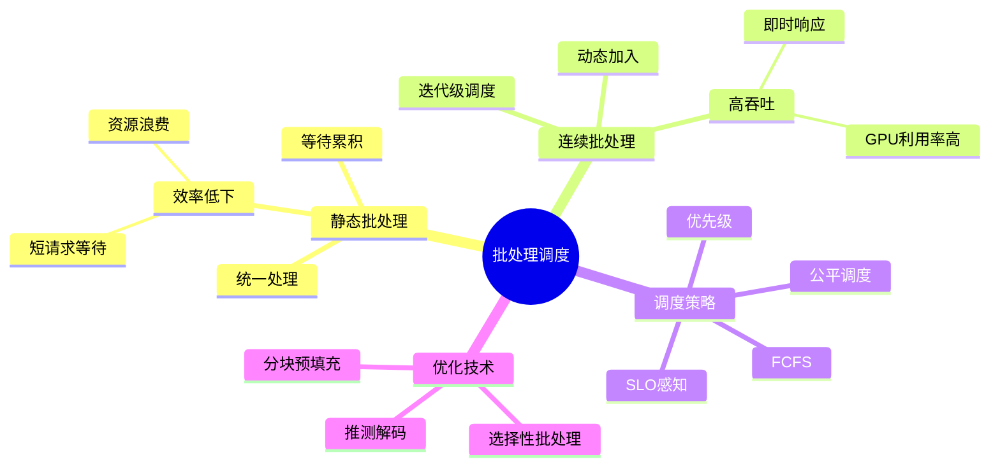
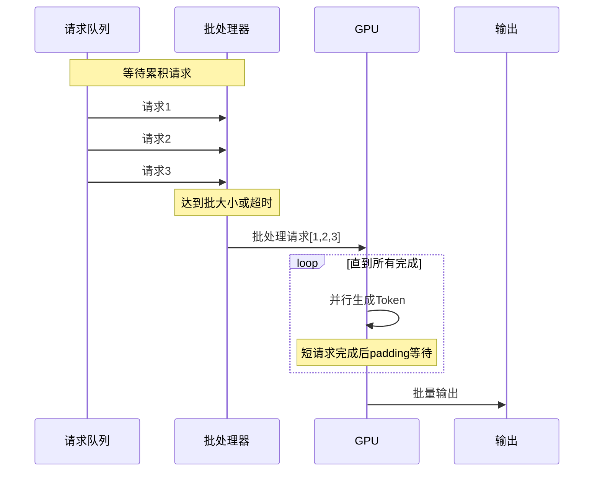
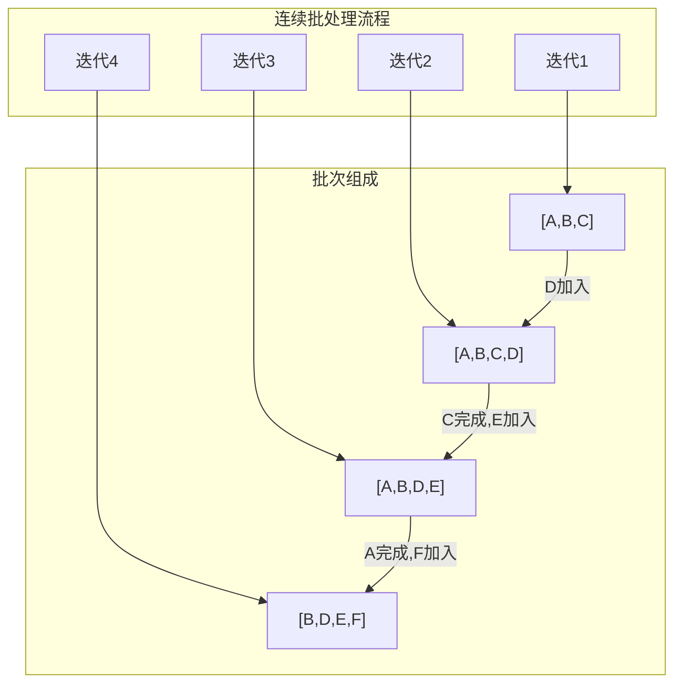
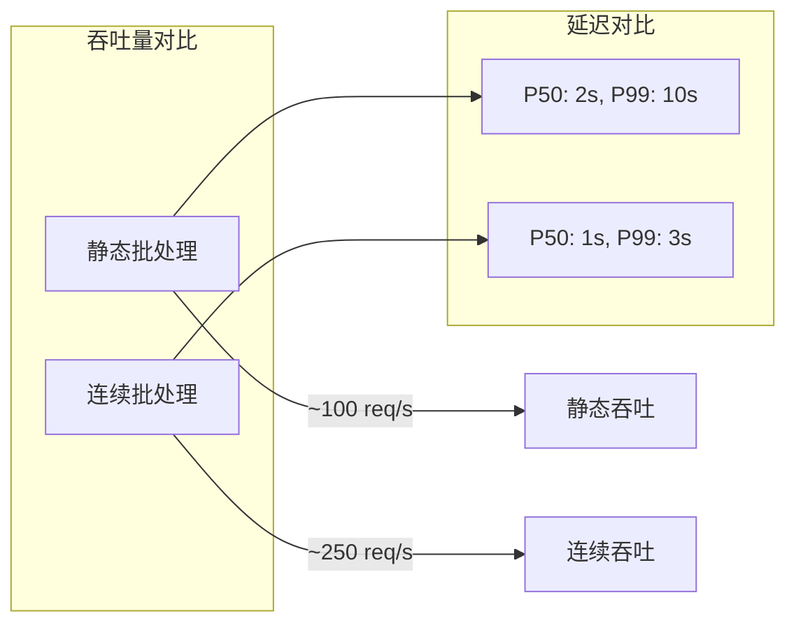
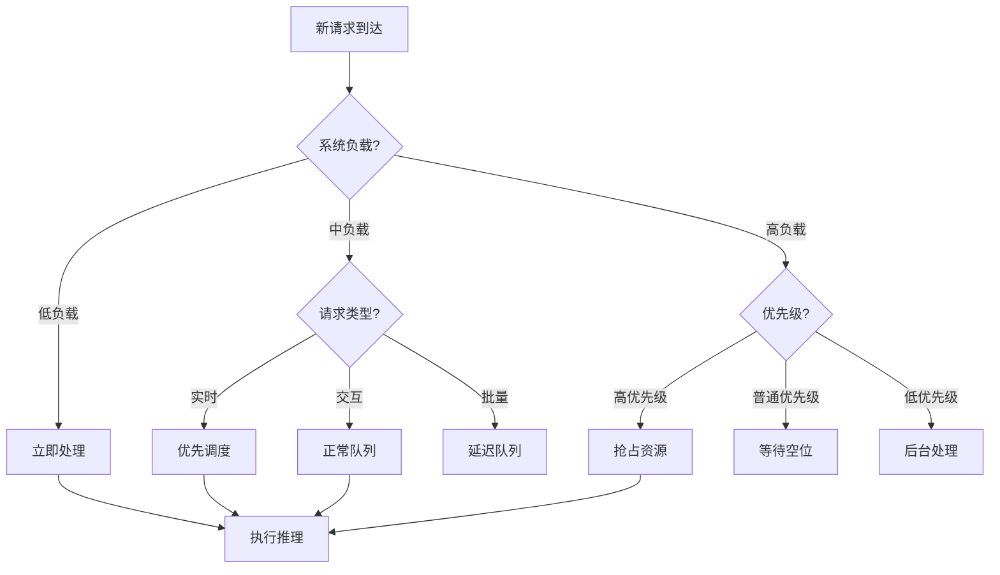
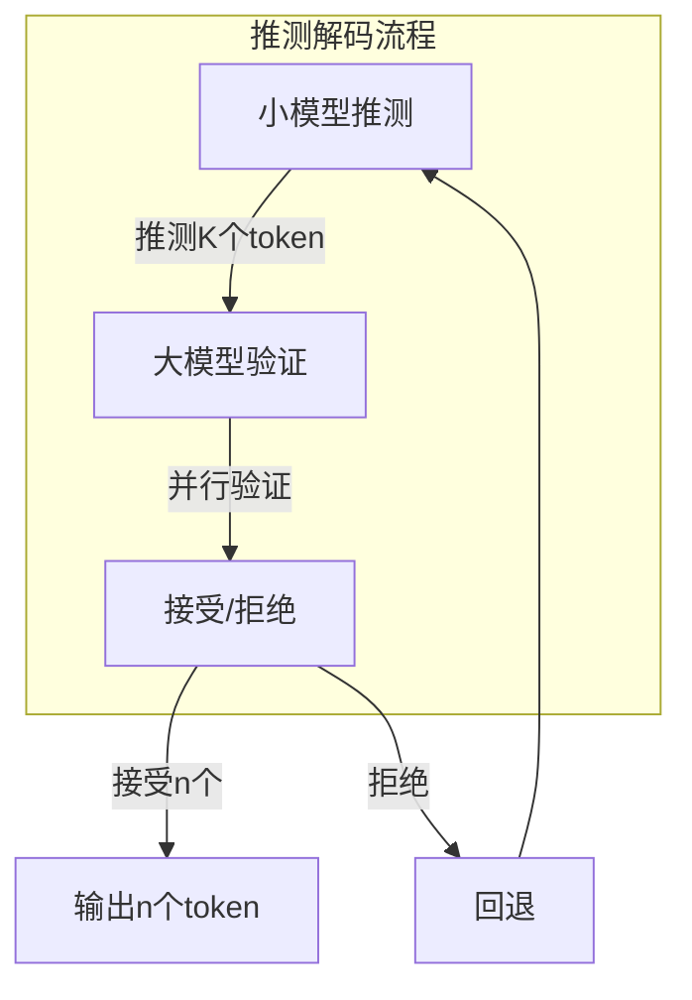
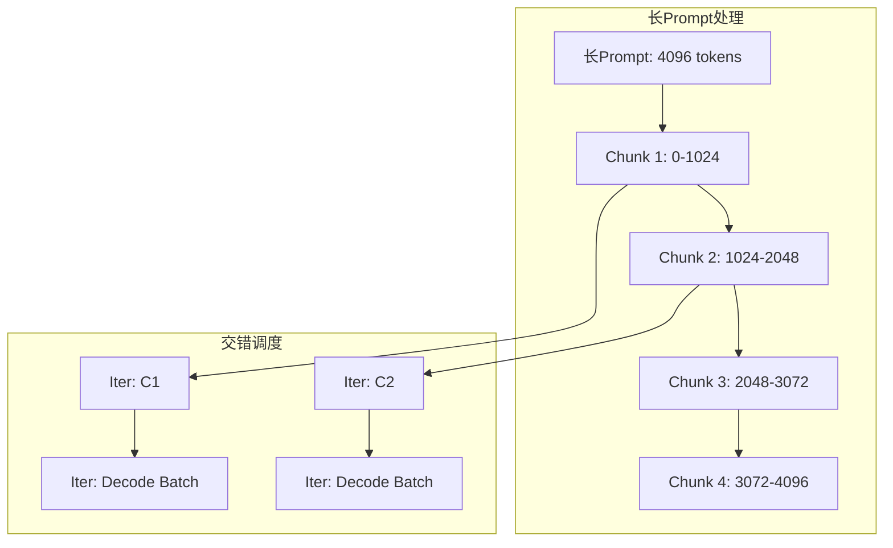

# 25.3 批处理调度策略

> **子主题编号**: 25.3
> **主题**: LLM推理调度
> **最后更新**: 2025-12-02
> **文档状态**: ✅ 完成

---

## 📋 目录

- [1 概述](#1-概述)
- [2 思维导图](#2-思维导图)
- [3 静态批处理](#3-静态批处理)
- [4 连续批处理](#4-连续批处理)
- [5 调度算法](#5-调度算法)
- [6 知识矩阵](#6-知识矩阵)
- [7 形式化模型](#7-形式化模型)
- [8 高级策略](#8-高级策略)
- [9 跨视角链接](#9-跨视角链接)

---

## 1 概述

### 1.1 核心洞察

批处理是提升LLM推理吞吐量的关键技术。由于GPU具有高度并行性，将多个请求合并成批次可以显著提高计算效率。然而，LLM的自回归特性使得传统批处理策略面临挑战。

### 1.2 批处理挑战

| 挑战 | 描述 | 影响 |
|------|------|------|
| **长度不一** | 请求输入/输出长度差异大 | 短请求等待长请求 |
| **动态到达** | 请求在线到达 | 批次组装延迟 |
| **资源争用** | 内存随批大小增长 | OOM风险 |
| **SLO约束** | 延迟要求不同 | 调度复杂 |

---

## 2 思维导图



---

## 3 静态批处理

### 3.1 静态批处理流程



### 3.2 静态批处理问题

```text
问题示例:

请求长度: [100, 500, 50] tokens
最长请求: 500 tokens

静态批处理执行:
┌────────────────────────────────────────────┐
│ Req1: ████████████████████████░░░░░░░░░░░░ │ 100 tokens + 400 padding
│ Req2: ████████████████████████████████████ │ 500 tokens (全长)
│ Req3: ██████████░░░░░░░░░░░░░░░░░░░░░░░░░░ │ 50 tokens + 450 padding
└────────────────────────────────────────────┘

实际计算: 500 × 3 = 1500 token-steps
有效计算: 100 + 500 + 50 = 650 token-steps
效率: 650/1500 = 43.3%
```

### 3.3 静态批处理代码

```python
class StaticBatcher:
    """静态批处理器"""

    def __init__(self, batch_size: int, max_wait_time: float):
        self.batch_size = batch_size
        self.max_wait_time = max_wait_time
        self.pending_requests: List[Request] = []
        self.last_batch_time = time.time()

    def add_request(self, request: Request):
        self.pending_requests.append(request)

    def should_process(self) -> bool:
        """判断是否应该处理批次"""
        return (
            len(self.pending_requests) >= self.batch_size or
            time.time() - self.last_batch_time > self.max_wait_time
        )

    def process_batch(self, model):
        """处理一个批次"""
        if not self.pending_requests:
            return []

        batch = self.pending_requests[:self.batch_size]
        self.pending_requests = self.pending_requests[self.batch_size:]

        # Padding到最大长度
        max_len = max(r.input_length for r in batch)
        padded_inputs = [pad_to_length(r.input, max_len) for r in batch]

        # 批量推理
        outputs = []
        finished = [False] * len(batch)

        while not all(finished):
            next_tokens = model.forward(padded_inputs)
            for i, token in enumerate(next_tokens):
                if not finished[i]:
                    batch[i].output.append(token)
                    if token == EOS or len(batch[i].output) >= batch[i].max_length:
                        finished[i] = True

        self.last_batch_time = time.time()
        return batch
```

---

## 4 连续批处理

### 4.1 核心思想

连续批处理（Continuous Batching / In-flight Batching）允许在每个解码迭代后动态调整批次：完成的请求立即退出，新请求随时加入。



### 4.2 连续批处理执行示例

```text
连续批处理执行:

时间  批次状态              事件
────────────────────────────────────
T0    [A(0)]               A开始
T1    [A(1),B(0)]          B加入
T2    [A(2),B(1),C(0)]     C加入
T3    [A(3),B(2),C(1)]
T4    [B(3),C(2),D(0)]     A完成(4 tokens), D加入
T5    [B(4),C(3),D(1)]
T6    [C(4),D(2),E(0)]     B完成(5 tokens), E加入
...

vs 静态批处理:
- 静态: A,B,C必须等最长的完成
- 连续: 完成即退出，新请求即加入
```

### 4.3 连续批处理实现

```python
class ContinuousBatcher:
    """连续批处理调度器"""

    def __init__(self, max_batch_size: int, kv_cache_manager: KVCacheManager):
        self.max_batch_size = max_batch_size
        self.kv_cache = kv_cache_manager
        self.running_requests: List[Request] = []
        self.waiting_queue: Queue[Request] = Queue()

    def add_request(self, request: Request):
        """添加新请求到等待队列"""
        self.waiting_queue.put(request)

    def _can_add_request(self, request: Request) -> bool:
        """检查是否可以添加新请求"""
        # 检查批大小限制
        if len(self.running_requests) >= self.max_batch_size:
            return False
        # 检查内存是否足够
        estimated_blocks = self._estimate_blocks(request)
        return self.kv_cache.has_free_blocks(estimated_blocks)

    def _schedule_iteration(self):
        """调度一个迭代"""
        # 1. 尝试添加等待中的请求
        while not self.waiting_queue.empty():
            request = self.waiting_queue.queue[0]
            if self._can_add_request(request):
                request = self.waiting_queue.get()
                self._prefill_request(request)
                self.running_requests.append(request)
            else:
                break

        # 2. 执行解码步
        if self.running_requests:
            outputs = self._decode_step(self.running_requests)

            # 3. 处理完成的请求
            finished = []
            for i, (req, token) in enumerate(zip(self.running_requests, outputs)):
                req.output.append(token)
                if self._is_finished(req, token):
                    finished.append(i)

            # 4. 移除完成的请求（逆序避免索引问题）
            for i in reversed(finished):
                req = self.running_requests.pop(i)
                self.kv_cache.free(req.id)
                self._return_result(req)

    def _prefill_request(self, request: Request):
        """预填充新请求"""
        # 分配KV-Cache
        self.kv_cache.allocate(request.id, request.input_length)
        # 运行预填充
        self._run_prefill(request)

    def _decode_step(self, requests: List[Request]) -> List[int]:
        """批量解码一步"""
        # 构建批次输入
        batch_input = self._prepare_batch(requests)
        # GPU前向传播
        logits = self.model.forward(batch_input)
        # 采样
        tokens = self._sample(logits, requests)
        return tokens
```

### 4.4 性能对比



---

## 5 调度算法

### 5.1 FCFS（先来先服务）

```python
class FCFSScheduler:
    """先来先服务调度器"""

    def select_requests(self, waiting: List[Request], max_batch: int) -> List[Request]:
        """按到达顺序选择请求"""
        return waiting[:max_batch]
```

### 5.2 SJF（最短作业优先）

```python
class SJFScheduler:
    """最短作业优先调度器"""

    def select_requests(self, waiting: List[Request], max_batch: int) -> List[Request]:
        """选择预计输出最短的请求"""
        # 按预估输出长度排序
        sorted_requests = sorted(waiting, key=lambda r: r.estimated_output_length)
        return sorted_requests[:max_batch]
```

### 5.3 SLO感知调度

```python
class SLOAwareScheduler:
    """SLO感知调度器"""

    def __init__(self):
        self.slo_targets = {
            'realtime': 0.5,    # 500ms TTFT
            'interactive': 2.0,  # 2s TTFT
            'batch': 10.0,       # 10s TTFT
        }

    def select_requests(self, waiting: List[Request], max_batch: int) -> List[Request]:
        """基于SLO紧迫度选择请求"""
        now = time.time()

        def urgency(r: Request) -> float:
            deadline = r.arrival_time + self.slo_targets[r.slo_class]
            slack = deadline - now
            return -slack  # 越紧迫越高优先级

        sorted_requests = sorted(waiting, key=urgency)
        return sorted_requests[:max_batch]
```

### 5.4 公平调度

```python
class FairScheduler:
    """公平调度器 - 基于虚拟时间"""

    def __init__(self):
        self.virtual_time: Dict[str, float] = defaultdict(float)  # user -> vtime

    def select_requests(self, waiting: List[Request], max_batch: int) -> List[Request]:
        """基于虚拟时间的公平调度"""
        # 按用户虚拟时间排序
        sorted_requests = sorted(waiting, key=lambda r: self.virtual_time[r.user])

        selected = []
        for req in sorted_requests:
            if len(selected) >= max_batch:
                break
            selected.append(req)
            # 更新虚拟时间
            self.virtual_time[req.user] += req.estimated_cost

        return selected
```

### 5.5 调度算法决策树



---

## 6 知识矩阵

### 6.1 批处理策略对比

| 策略 | 吞吐量 | 延迟 | 实现复杂度 | 适用场景 |
|------|-------|------|-----------|---------|
| **静态批处理** | 低 | 高 | 低 | 离线推理 |
| **连续批处理** | 高 | 低 | 中 | 在线服务 |
| **选择性批处理** | 极高 | 极低 | 高 | 混合负载 |
| **分块预填充** | 高 | 稳定 | 高 | 长prompt |

### 6.2 调度算法对比

| 算法 | 公平性 | 吞吐量 | 尾延迟 | 适用场景 |
|------|-------|-------|-------|---------|
| **FCFS** | 中 | 中 | 高 | 简单场景 |
| **SJF** | 低 | 高 | 低 | 批处理 |
| **SLO感知** | 高 | 中 | 可控 | 生产环境 |
| **公平调度** | 极高 | 中 | 中 | 多租户 |

---

## 7 形式化模型

### 7.1 连续批处理形式化

```text
定义: 连续批处理系统

状态空间:
  State = {
    running: Set<Request>,      // 运行中请求
    waiting: Queue<Request>,    // 等待队列
    memory: MemoryState,        // 内存状态
    time: Timestamp             // 当前时间
  }

转移函数:
  transition: State × Event → State

  Event =
    | Arrival(request)          // 新请求到达
    | IterationComplete(tokens) // 迭代完成
    | RequestFinish(request_id) // 请求完成

调度策略:
  schedule: State → Action
  Action =
    | AddToRunning(requests: List<Request>)
    | RemoveFromRunning(request_ids: List<RequestId>)
    | Preempt(request_id)
```

### 7.2 吞吐量分析

```text
定理: 连续批处理吞吐量上界

给定:
  - GPU计算能力: C FLOPs/s
  - 单Token计算量: F FLOPs
  - 平均序列长度: L
  - 批大小: B

理论最大吞吐量:
  Throughput_max = C / (F × L) tokens/s

实际吞吐量:
  Throughput = min(
    Throughput_max,
    Memory_Bandwidth / (2 × KV_Cache_size),
    B / decode_latency
  )

连续批处理增益:
  Gain = Throughput_continuous / Throughput_static
       = 1 / (padding_ratio × wait_ratio)

其中:
  padding_ratio: 静态批处理的padding开销
  wait_ratio: 静态批处理的等待开销
```

### 7.3 SLO满足率分析

```text
定理: SLO感知调度的满足率保证

设SLO目标为 T_slo，到达率为 λ

若使用SLO感知调度，且：
  - 平均服务时间 E[S] < T_slo
  - 系统利用率 ρ = λ × E[S] < 1

则SLO满足率:
  P(Response_Time ≤ T_slo) ≥ 1 - ρ^(T_slo/E[S])

证明思路: 基于M/G/1队列分析
```

---

## 8 高级策略

### 8.1 推测解码（Speculative Decoding）



```python
class SpeculativeDecoder:
    """推测解码器"""

    def __init__(self, draft_model, target_model, speculation_length: int = 4):
        self.draft_model = draft_model      # 小模型
        self.target_model = target_model    # 大模型
        self.k = speculation_length

    def decode_step(self, prefix: List[int]) -> List[int]:
        """推测解码一步"""
        # 1. 小模型推测K个token
        draft_tokens = []
        draft_probs = []
        for _ in range(self.k):
            logits = self.draft_model.forward(prefix + draft_tokens)
            prob = softmax(logits)
            token = sample(prob)
            draft_tokens.append(token)
            draft_probs.append(prob[token])

        # 2. 大模型并行验证
        all_positions = prefix + draft_tokens
        target_logits = self.target_model.forward(all_positions)
        target_probs = softmax(target_logits, dim=-1)

        # 3. 拒绝采样验证
        accepted = []
        for i, token in enumerate(draft_tokens):
            p_target = target_probs[len(prefix) + i - 1, token]
            p_draft = draft_probs[i]

            # 接受概率
            accept_prob = min(1, p_target / p_draft)
            if random.random() < accept_prob:
                accepted.append(token)
            else:
                # 从修正分布采样
                corrected_prob = max(0, target_probs[len(prefix) + i - 1] - draft_probs[i])
                corrected_prob = corrected_prob / corrected_prob.sum()
                new_token = sample(corrected_prob)
                accepted.append(new_token)
                break

        return accepted
```

### 8.2 选择性批处理

```python
class SelectiveBatcher:
    """选择性批处理 - 分离预填充和解码"""

    def __init__(self):
        self.prefill_batch: List[Request] = []
        self.decode_batch: List[Request] = []

    def schedule(self):
        """选择性调度策略"""
        # 优先处理短预填充
        short_prefills = [r for r in self.prefill_batch if r.input_length < 512]
        long_prefills = [r for r in self.prefill_batch if r.input_length >= 512]

        if short_prefills and len(self.decode_batch) < self.max_decode_batch:
            # 短预填充与解码混合
            return self._mixed_iteration(short_prefills, self.decode_batch)
        elif self.decode_batch:
            # 纯解码迭代
            return self._decode_iteration(self.decode_batch)
        elif long_prefills:
            # 长预填充单独处理
            return self._prefill_iteration(long_prefills[:1])
        else:
            return None
```

### 8.3 分块预填充调度



---

## 9 跨视角链接

### 9.1 调度视角关联

- [批处理调度原理](../06_调度模型/06.2_OS内核调度.md) - 操作系统批处理
- [GPU批处理](../16_GPU与加速器调度/16.1_GPU任务调度.md) - GPU批处理优化
- [分布式批处理](../06_调度模型/06.4_分布式系统调度.md) - 分布式批处理

### 9.2 形式语言视角关联

| 形式语言概念 | 批处理对应 | 映射说明 |
|------------|-----------|---------|
| **类型推断** | 批次组装 | 兼容性检查 |
| **惰性求值** | 延迟批处理 | 按需计算 |
| **流式处理** | 连续批处理 | 增量处理 |

---

**返回**: [LLM推理调度主索引](./README.md) | [调度视角主索引](../README.md)
