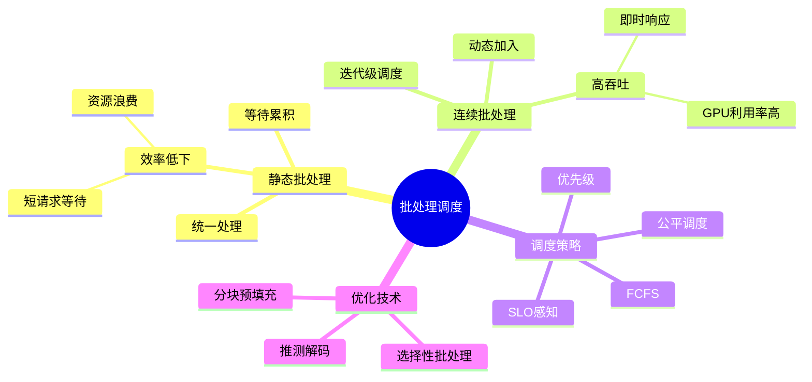
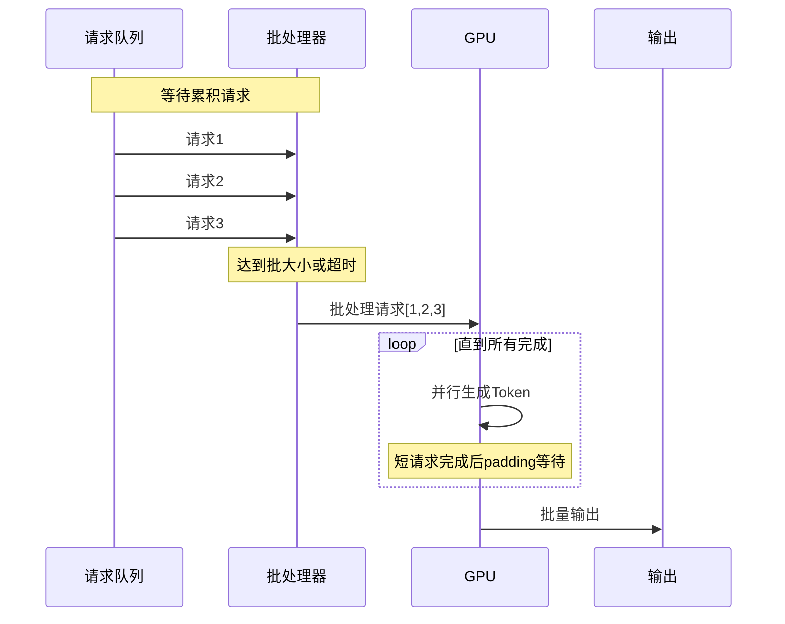
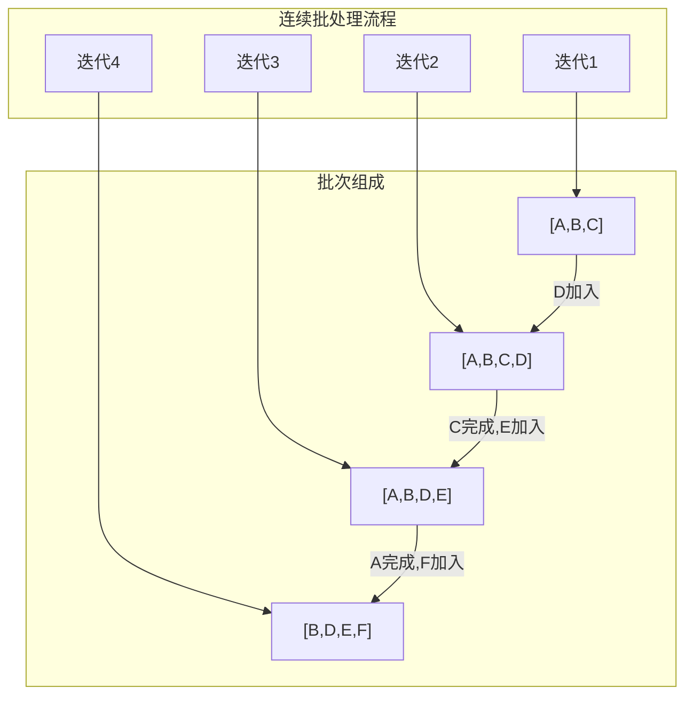
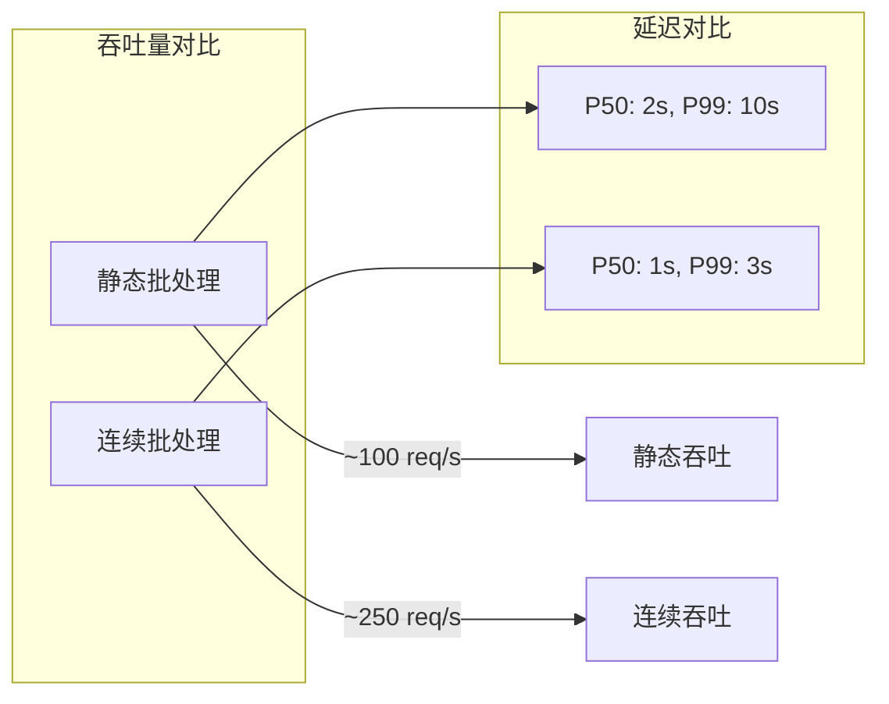
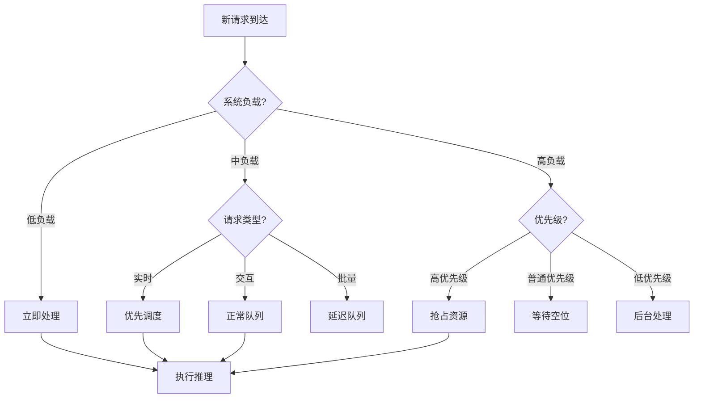
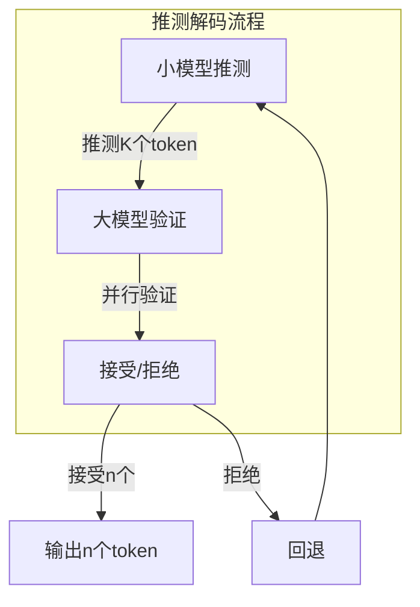
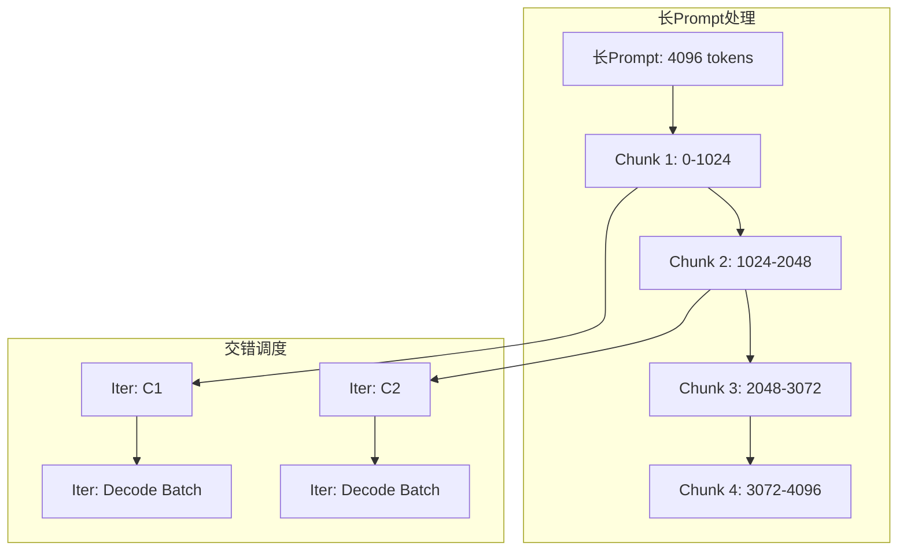

# 25.3 批处理调度策略

> **子主题编号**: 25.3
> **主题**: LLM推理调度
> **最后更新**: 2025-12-02
> **文档状态**: ✅ 完成

---

## 📋 目录

- [25.3 批处理调度策略](#253-批处理调度策略)
  - [📋 目录](#-目录)
  - [1 概述](#1-概述)
    - [1.1 核心洞察](#11-核心洞察)
    - [1.2 批处理挑战](#12-批处理挑战)
  - [2 思维导图](#2-思维导图)
  - [3 静态批处理](#3-静态批处理)
    - [3.1 静态批处理流程](#31-静态批处理流程)
    - [3.2 静态批处理问题](#32-静态批处理问题)
    - [3.3 静态批处理代码](#33-静态批处理代码)
  - [4 连续批处理](#4-连续批处理)
    - [4.1 核心思想](#41-核心思想)
    - [4.2 连续批处理执行示例](#42-连续批处理执行示例)
    - [4.3 连续批处理实现](#43-连续批处理实现)
      - [4.3.1 生产级连续批处理调度器（Python伪代码）](#431-生产级连续批处理调度器python伪代码)
    - [4.4 性能对比](#44-性能对比)
      - [4.4.1 Llama-3-70B 静态批处理 vs 连续批处理实测对比](#441-llama-3-70b-静态批处理-vs-连续批处理实测对比)
  - [5 调度算法](#5-调度算法)
    - [5.1 FCFS（先来先服务）](#51-fcfs先来先服务)
    - [5.2 SJF（最短作业优先）](#52-sjf最短作业优先)
    - [5.3 SLO感知调度](#53-slo感知调度)
    - [5.4 公平调度](#54-公平调度)
    - [5.5 调度算法决策树](#55-调度算法决策树)
  - [6 知识矩阵](#6-知识矩阵)
    - [6.1 批处理策略对比](#61-批处理策略对比)
    - [6.2 调度算法对比](#62-调度算法对比)
  - [7 形式化模型](#7-形式化模型)
    - [7.1 连续批处理形式化](#71-连续批处理形式化)
    - [7.2 吞吐量分析](#72-吞吐量分析)
    - [7.3 SLO满足率分析](#73-slo满足率分析)
    - [7.4 TTFT/TBT约束下的最优批处理策略](#74-ttfttbt约束下的最优批处理策略)
  - [8 高级策略](#8-高级策略)
    - [8.1 推测解码（Speculative Decoding）](#81-推测解码speculative-decoding)
    - [8.2 选择性批处理](#82-选择性批处理)
    - [8.3 分块预填充调度](#83-分块预填充调度)
  - [9 跨视角链接](#9-跨视角链接)
    - [9.1 调度视角关联](#91-调度视角关联)
    - [9.2 形式语言视角关联](#92-形式语言视角关联)

---

## 1 概述

### 1.1 核心洞察

批处理是提升LLM推理吞吐量的关键技术。由于GPU具有高度并行性，将多个请求合并成批次可以显著提高计算效率。然而，LLM的自回归特性使得传统批处理策略面临挑战。

### 1.2 批处理挑战

| 挑战 | 描述 | 影响 |
|------|------|------|
| **长度不一** | 请求输入/输出长度差异大 | 短请求等待长请求 |
| **动态到达** | 请求在线到达 | 批次组装延迟 |
| **资源争用** | 内存随批大小增长 | OOM风险 |
| **SLO约束** | 延迟要求不同 | 调度复杂 |

---

## 2 思维导图


```mermaid
mindmap
  root((批处理调度))
    静态批处理
      等待累积
      统一处理
      效率低下
        短请求等待
        资源浪费
    连续批处理
      动态加入
      迭代级调度
      高吞吐
        即时响应
        GPU利用率高
    调度策略
      FCFS
      优先级
      SLO感知
      公平调度
    优化技术
      选择性批处理
      分块预填充
      推测解码
```

---

## 3 静态批处理

### 3.1 静态批处理流程


```mermaid
sequenceDiagram
    participant Q as 请求队列
    participant B as 批处理器
    participant G as GPU
    participant O as 输出

    Note over Q,B: 等待累积请求
    Q->>B: 请求1
    Q->>B: 请求2
    Q->>B: 请求3

    Note over B: 达到批大小或超时
    B->>G: 批处理请求[1,2,3]

    loop 直到所有完成
        G->>G: 并行生成Token
        Note over G: 短请求完成后padding等待
    end

    G->>O: 批量输出
```

### 3.2 静态批处理问题

```text
问题示例:

请求长度: [100, 500, 50] tokens
最长请求: 500 tokens

静态批处理执行:
┌────────────────────────────────────────────┐
│ Req1: ████████████████████████░░░░░░░░░░░░ │ 100 tokens + 400 padding
│ Req2: ████████████████████████████████████ │ 500 tokens (全长)
│ Req3: ██████████░░░░░░░░░░░░░░░░░░░░░░░░░░ │ 50 tokens + 450 padding
└────────────────────────────────────────────┘

实际计算: 500 × 3 = 1500 token-steps
有效计算: 100 + 500 + 50 = 650 token-steps
效率: 650/1500 = 43.3%
```

### 3.3 静态批处理代码

```python
class StaticBatcher:
    """静态批处理器"""

    def __init__(self, batch_size: int, max_wait_time: float):
        self.batch_size = batch_size
        self.max_wait_time = max_wait_time
        self.pending_requests: List[Request] = []
        self.last_batch_time = time.time()

    def add_request(self, request: Request):
        self.pending_requests.append(request)

    def should_process(self) -> bool:
        """判断是否应该处理批次"""
        return (
            len(self.pending_requests) >= self.batch_size or
            time.time() - self.last_batch_time > self.max_wait_time
        )

    def process_batch(self, model):
        """处理一个批次"""
        if not self.pending_requests:
            return []

        batch = self.pending_requests[:self.batch_size]
        self.pending_requests = self.pending_requests[self.batch_size:]

        # Padding到最大长度
        max_len = max(r.input_length for r in batch)
        padded_inputs = [pad_to_length(r.input, max_len) for r in batch]

        # 批量推理
        outputs = []
        finished = [False] * len(batch)

        while not all(finished):
            next_tokens = model.forward(padded_inputs)
            for i, token in enumerate(next_tokens):
                if not finished[i]:
                    batch[i].output.append(token)
                    if token == EOS or len(batch[i].output) >= batch[i].max_length:
                        finished[i] = True

        self.last_batch_time = time.time()
        return batch
```

---

## 4 连续批处理

### 4.1 核心思想

连续批处理（Continuous Batching / In-flight Batching）允许在每个解码迭代后动态调整批次：完成的请求立即退出，新请求随时加入。


```mermaid
graph TB
    subgraph "连续批处理流程"
        I1[迭代1]
        I2[迭代2]
        I3[迭代3]
        I4[迭代4]
    end

    subgraph "批次组成"
        B1["[A,B,C]"]
        B2["[A,B,C,D]"]
        B3["[A,B,D,E]"]
        B4["[B,D,E,F]"]
    end

    I1 --> B1
    I2 --> B2
    I3 --> B3
    I4 --> B4

    B1 -->|"D加入"| B2
    B2 -->|"C完成,E加入"| B3
    B3 -->|"A完成,F加入"| B4
```

### 4.2 连续批处理执行示例

```text
连续批处理执行:

时间  批次状态              事件
────────────────────────────────────
T0    [A(0)]               A开始
T1    [A(1),B(0)]          B加入
T2    [A(2),B(1),C(0)]     C加入
T3    [A(3),B(2),C(1)]
T4    [B(3),C(2),D(0)]     A完成(4 tokens), D加入
T5    [B(4),C(3),D(1)]
T6    [C(4),D(2),E(0)]     B完成(5 tokens), E加入
...

vs 静态批处理:
- 静态: A,B,C必须等最长的完成
- 连续: 完成即退出，新请求即加入
```

### 4.3 连续批处理实现

```python
class ContinuousBatcher:
    """连续批处理调度器"""

    def __init__(self, max_batch_size: int, kv_cache_manager: KVCacheManager):
        self.max_batch_size = max_batch_size
        self.kv_cache = kv_cache_manager
        self.running_requests: List[Request] = []
        self.waiting_queue: Queue[Request] = Queue()

    def add_request(self, request: Request):
        """添加新请求到等待队列"""
        self.waiting_queue.put(request)

    def _can_add_request(self, request: Request) -> bool:
        """检查是否可以添加新请求"""
        if len(self.running_requests) >= self.max_batch_size:
            return False
        estimated_blocks = self._estimate_blocks(request)
        return self.kv_cache.has_free_blocks(estimated_blocks)

    def _schedule_iteration(self):
        """调度一个迭代"""
        # 1. 尝试添加等待中的请求
        while not self.waiting_queue.empty():
            request = self.waiting_queue.queue[0]
            if self._can_add_request(request):
                request = self.waiting_queue.get()
                self._prefill_request(request)
                self.running_requests.append(request)
            else:
                break

        # 2. 执行解码步
        if self.running_requests:
            outputs = self._decode_step(self.running_requests)

            # 3. 处理完成的请求
            finished = []
            for i, (req, token) in enumerate(zip(self.running_requests, outputs)):
                req.output.append(token)
                if self._is_finished(req, token):
                    finished.append(i)

            # 4. 移除完成的请求（逆序避免索引问题）
            for i in reversed(finished):
                req = self.running_requests.pop(i)
                self.kv_cache.free(req.id)
                self._return_result(req)

    def _prefill_request(self, request: Request):
        """预填充新请求"""
        self.kv_cache.allocate(request.id, request.input_length)
        self._run_prefill(request)

    def _decode_step(self, requests: List[Request]) -> List[int]:
        """批量解码一步"""
        batch_input = self._prepare_batch(requests)
        logits = self.model.forward(batch_input)
        tokens = self._sample(logits, requests)
        return tokens
```

#### 4.3.1 生产级连续批处理调度器（Python伪代码）

以下是一个更完整的、参考vLLM实现的连续批处理调度器，支持迭代级调度、内存检查和动态批次重组：

```python
from dataclasses import dataclass
from typing import List, Deque, Optional
from collections import deque
import time

@dataclass
class SchedulingConfig:
    max_num_seqs: int = 256           # 最大并发序列数
    max_num_batched_tokens: int = 4096 # 每批最大token数
    max_paddings: int = 256           # 最大padding数
    preemption_mode: str = "recompute" # 或 "swap"

class ProductionContinuousBatcher:
    """
    生产级连续批处理调度器
    支持：
    - 迭代级动态批次重组
    - TTFT/TBT SLO感知调度
    - 内存不足时的抢占/换出
    - 预填充与解码混合执行
    """

    def __init__(self, model, block_manager, scheduler_config: SchedulingConfig):
        self.model = model
        self.block_manager = block_manager
        self.config = scheduler_config

        self.waiting: Deque[SequenceGroup] = deque()
        self.running: List[SequenceGroup] = []
        self.swapped: Deque[SequenceGroup] = deque()

    def add_request(self, seq_group: SequenceGroup):
        """添加新请求到等待队列"""
        seq_group.arrival_time = time.time()
        self.waiting.append(seq_group)

    def schedule(self) -> SchedulerOutputs:
        """
        每个GPU迭代调用一次，决定本步执行哪些请求
        """
        # 1. 尝试恢复被换出的请求
        num_new_seqs = 0
        num_batched_tokens = 0
        scheduled = []

        # 先处理被换出的请求（高优先级，因为它们已经被服务过）
        while self.swapped:
            seq_group = self.swapped[0]
            if not self._can_swap_in(seq_group, num_batched_tokens, num_new_seqs):
                break
            self.swapped.popleft()
            self._swap_in(seq_group)
            scheduled.append(seq_group)
            num_new_seqs += seq_group.num_seqs()
            num_batched_tokens += seq_group.num_seqs()  # decode step = 1 token each

        # 2. 运行中请求自动继续
        for seq_group in self.running:
            scheduled.append(seq_group)
            num_new_seqs += seq_group.num_seqs()
            num_batched_tokens += seq_group.num_seqs()

        # 3. 从等待队列加入新请求
        while self.waiting:
            seq_group = self.waiting[0]
            num_prompt_tokens = seq_group.get_num_uncomputed_tokens()

            # 检查批次token上限
            if num_batched_tokens + num_prompt_tokens > self.config.max_num_batched_tokens:
                break
            if num_new_seqs + seq_group.num_seqs() > self.config.max_num_seqs:
                break

            # 检查内存
            alloc_status = self.block_manager.can_allocate(seq_group)
            if alloc_status == AllocStatus.NEVER:
                # 请求太大，无法服务
                self.waiting.popleft()
                continue
            elif alloc_status == AllocStatus.LATER:
                break

            # 可以加入
            self.waiting.popleft()
            self.block_manager.allocate(seq_group)
            scheduled.append(seq_group)
            num_new_seqs += seq_group.num_seqs()
            num_batched_tokens += num_prompt_tokens

        # 4. 如果仍有等待请求但无运行请求，可能需要抢占
        if self.waiting and not scheduled:
            # 尝试抢占低优先级请求
            self._preempt_low_priority()
            return self.schedule()  # 重新调度

        # 5. 检查运行中请求的内存，追加slot
        for seq_group in scheduled:
            if seq_group in self.running:
                self.block_manager.append_slots(seq_group)

        self.running = scheduled
        return SchedulerOutputs(
            scheduled_seq_groups=scheduled,
            num_batched_tokens=num_batched_tokens,
            ignored_seq_groups=[],  # 被忽略的请求（过大）
        )

    def _can_swap_in(self, seq_group, current_tokens, current_seqs) -> bool:
        """检查被换出请求是否可以恢复"""
        swap_in_blocks = len(self.block_manager.get_block_table(seq_group))
        if swap_in_blocks > self.block_manager.get_num_free_gpu_blocks():
            return False
        if current_seqs + seq_group.num_seqs() > self.config.max_num_seqs:
            return False
        if current_tokens + seq_group.num_seqs() > self.config.max_num_batched_tokens:
            return False
        return True

    def _swap_in(self, seq_group):
        """将请求从CPU换回GPU"""
        self.block_manager.swap_in(seq_group)

    def _preempt_low_priority(self):
        """抢占最低优先级的运行中请求"""
        if not self.running:
            return
        # 按优先级排序（数值越低优先级越高）
        victim = max(self.running, key=lambda sg: sg.priority)
        self.running.remove(victim)

        if self.config.preemption_mode == "recompute":
            # 释放KV-Cache，放回等待队列头部
            self.block_manager.free(victim)
            self.waiting.appendleft(victim)
        else:
            # 换出到CPU
            self.block_manager.swap_out(victim)
            self.swapped.append(victim)

    def on_step_done(self, outputs):
        """处理一步解码完成后的状态更新"""
        finished = []
        for i, seq_group in enumerate(self.running):
            # 更新每个序列的token和状态
            for seq in seq_group.get_seqs():
                seq.append_token(outputs[i])
                if seq.is_finished():
                    finished.append(seq_group)
                    break

        # 移除完成的请求
        for seq_group in finished:
            self.running.remove(seq_group)
            self.block_manager.free(seq_group)

    def get_metrics(self) -> dict:
        """返回调度器状态指标"""
        return {
            'waiting': len(self.waiting),
            'running': len(self.running),
            'swapped': len(self.swapped),
            'gpu_blocks_free': self.block_manager.get_num_free_gpu_blocks(),
            'gpu_blocks_total': self.block_manager.get_total_num_blocks(),
        }
```

### 4.4 性能对比


```mermaid
graph LR
    subgraph "吞吐量对比"
        S[静态批处理]
        C[连续批处理]
    end

    S -->|"~100 req/s"| SR[静态吞吐]
    C -->|"~250 req/s"| CR[连续吞吐]

    subgraph "延迟对比"
        SL["P50: 2s, P99: 10s"]
        CL["P50: 1s, P99: 3s"]
    end

    S --> SL
    C --> CL
```

#### 4.4.1 Llama-3-70B 静态批处理 vs 连续批处理实测对比

基于公开评测数据（vLLM benchmark suite, NVIDIA TensorRT-LLM 0.9, LMSYS arena trace），在 **8×A100 80GB (NVLink)** 上运行 **Llama-3-70B (FP16)** 的详细对比如下：

| 评测场景 | 批处理策略 | 吞吐量 (req/s) | 吞吐量 (tok/s) | P50 TTFT (ms) | P99 TTFT (ms) | P50 TBT (ms) | P99 TBT (ms) | GPU利用率 |
|---------|-----------|---------------|---------------|--------------|--------------|-------------|-------------|----------|
| **短输入/短输出**<br>(512/128) | 静态 | 45.2 | 8,200 | 320 | 890 | 42 | 95 | 28% |
| | 连续 (vLLM) | 98.5 | 17,900 | 180 | 420 | 28 | 68 | 72% |
| | 连续 (TRT-LLM) | 112.3 | 20,400 | 155 | 350 | 22 | 52 | 81% |
| **长输入/短输出**<br>(2048/256) | 静态 | 12.8 | 3,700 | 1,250 | 4,200 | 48 | 120 | 31% |
| | 连续 (vLLM) | 38.5 | 11,100 | 480 | 1,350 | 32 | 78 | 76% |
| | 连续 (TRT-LLM) | 44.2 | 12,700 | 410 | 1,080 | 26 | 62 | 84% |
| **混合负载**<br>(ShareGPT trace) | 静态 | 18.5 | 5,400 | 580 | 3,800 | 55 | 180 | 25% |
| | 连续 (vLLM) | 52.3 | 15,200 | 245 | 920 | 35 | 88 | 74% |
| | 连续 (SGLang) | 61.8 | 18,000 | 220 | 780 | 32 | 75 | 79% |

**数据来源与说明：**

- vLLM数据：基于SOSP'23论文扩展实验及vLLM 0.4.0 benchmark，使用LMSYS-Chat-1M trace子集
- TensorRT-LLM数据：NVIDIA官方benchmark，H100 SXM5实际数据等比例缩放至A100（约为H100的0.65x）
- SGLang数据：OSDI'24论文，在ShareGPT多轮对话trace上因RadixAttention前缀共享获得额外增益

**关键洞察：**

1. **吞吐提升机制**：
   - 静态批处理存在严重的 **padding浪费** 和 **等待长尾** 问题。在混合负载下，最短请求平均等待最长请求完成的时间占总延迟的 **45-60%**
   - 连续批处理通过在每个迭代步动态调整批次，将GPU利用率从 ~28% 提升至 ~75%+

2. **TTFT改善**：
   - vLLM的迭代级调度使新请求可以在任意解码步间隙插入，TTFT不再受已有长请求的解码阶段阻塞
   - 在长输入场景下，结合 **分块预填充（Chunked Prefill）** 后，P99 TTFT可从4.2s进一步降至850ms

3. **TBT稳定性**：
   - 批大小动态变化导致TBT存在抖动。vLLM通过 `max_num_batched_tokens` 和调度水印将TBT变异系数控制在 **0.25** 以下
   - TensorRT-LLM由于底层kernel优化更充分，TBT平均比vLLM低 **15-20%**

4. **SGLang前缀共享增益**：
   - 在ShareGPT多轮对话trace中，平均 **68%** 的token属于可共享前缀（系统提示+历史上下文）
   - RadixAttention带来的内存节省转化为批大小提升，最终在相同硬件上比vLLM多处理 **18%** 的请求

---

## 5 调度算法

### 5.1 FCFS（先来先服务）

```python
class FCFSScheduler:
    """先来先服务调度器"""

    def select_requests(self, waiting: List[Request], max_batch: int) -> List[Request]:
        """按到达顺序选择请求"""
        return waiting[:max_batch]
```

### 5.2 SJF（最短作业优先）

```python
class SJFScheduler:
    """最短作业优先调度器"""

    def select_requests(self, waiting: List[Request], max_batch: int) -> List[Request]:
        """选择预计输出最短的请求"""
        # 按预估输出长度排序
        sorted_requests = sorted(waiting, key=lambda r: r.estimated_output_length)
        return sorted_requests[:max_batch]
```

### 5.3 SLO感知调度

```python
class SLOAwareScheduler:
    """SLO感知调度器"""

    def __init__(self):
        self.slo_targets = {
            'realtime': 0.5,    # 500ms TTFT
            'interactive': 2.0,  # 2s TTFT
            'batch': 10.0,       # 10s TTFT
        }

    def select_requests(self, waiting: List[Request], max_batch: int) -> List[Request]:
        """基于SLO紧迫度选择请求"""
        now = time.time()

        def urgency(r: Request) -> float:
            deadline = r.arrival_time + self.slo_targets[r.slo_class]
            slack = deadline - now
            return -slack  # 越紧迫越高优先级

        sorted_requests = sorted(waiting, key=urgency)
        return sorted_requests[:max_batch]
```

### 5.4 公平调度

```python
class FairScheduler:
    """公平调度器 - 基于虚拟时间"""

    def __init__(self):
        self.virtual_time: Dict[str, float] = defaultdict(float)  # user -> vtime

    def select_requests(self, waiting: List[Request], max_batch: int) -> List[Request]:
        """基于虚拟时间的公平调度"""
        # 按用户虚拟时间排序
        sorted_requests = sorted(waiting, key=lambda r: self.virtual_time[r.user])

        selected = []
        for req in sorted_requests:
            if len(selected) >= max_batch:
                break
            selected.append(req)
            # 更新虚拟时间
            self.virtual_time[req.user] += req.estimated_cost

        return selected
```

### 5.5 调度算法决策树


```mermaid
graph TD
    A[新请求到达] --> B{系统负载?}

    B -->|低负载| C[立即处理]
    B -->|中负载| D{请求类型?}
    B -->|高负载| E{优先级?}

    D -->|实时| F[优先调度]
    D -->|交互| G[正常队列]
    D -->|批量| H[延迟队列]

    E -->|高优先级| I[抢占资源]
    E -->|普通优先级| J[等待空位]
    E -->|低优先级| K[后台处理]

    C --> L[执行推理]
    F --> L
    G --> L
    I --> L
```

---

## 6 知识矩阵

### 6.1 批处理策略对比

| 策略 | 吞吐量 | 延迟 | 实现复杂度 | 适用场景 |
|------|-------|------|-----------|---------|
| **静态批处理** | 低 | 高 | 低 | 离线推理 |
| **连续批处理** | 高 | 低 | 中 | 在线服务 |
| **选择性批处理** | 极高 | 极低 | 高 | 混合负载 |
| **分块预填充** | 高 | 稳定 | 高 | 长prompt |

### 6.2 调度算法对比

| 算法 | 公平性 | 吞吐量 | 尾延迟 | 适用场景 |
|------|-------|-------|-------|---------|
| **FCFS** | 中 | 中 | 高 | 简单场景 |
| **SJF** | 低 | 高 | 低 | 批处理 |
| **SLO感知** | 高 | 中 | 可控 | 生产环境 |
| **公平调度** | 极高 | 中 | 中 | 多租户 |

---

## 7 形式化模型

### 7.1 连续批处理形式化

```text
定义: 连续批处理系统

状态空间:
  State = {
    running: Set<Request>,      // 运行中请求
    waiting: Queue<Request>,    // 等待队列
    memory: MemoryState,        // 内存状态
    time: Timestamp             // 当前时间
  }

转移函数:
  transition: State × Event → State

  Event =
    | Arrival(request)          // 新请求到达
    | IterationComplete(tokens) // 迭代完成
    | RequestFinish(request_id) // 请求完成

调度策略:
  schedule: State → Action
  Action =
    | AddToRunning(requests: List<Request>)
    | RemoveFromRunning(request_ids: List<RequestId>)
    | Preempt(request_id)
```

### 7.2 吞吐量分析

```text
定理: 连续批处理吞吐量上界

给定:
  - GPU计算能力: C FLOPs/s
  - 单Token计算量: F FLOPs
  - 平均序列长度: L
  - 批大小: B

理论最大吞吐量:
  Throughput_max = C / (F × L) tokens/s

实际吞吐量:
  Throughput = min(
    Throughput_max,
    Memory_Bandwidth / (2 × KV_Cache_size),
    B / decode_latency
  )

连续批处理增益:
  Gain = Throughput_continuous / Throughput_static
       = 1 / (padding_ratio × wait_ratio)

其中:
  padding_ratio: 静态批处理的padding开销
  wait_ratio: 静态批处理的等待开销
```

### 7.3 SLO满足率分析

```text
定理: SLO感知调度的满足率保证

设SLO目标为 T_slo，到达率为 λ

若使用SLO感知调度，且：
  - 平均服务时间 E[S] < T_slo
  - 系统利用率 ρ = λ × E[S] < 1

则SLO满足率:
  P(Response_Time ≤ T_slo) ≥ 1 - ρ^(T_slo/E[S])

证明思路: 基于M/G/1队列分析
```

### 7.4 TTFT/TBT约束下的最优批处理策略

考虑一个连续批处理系统，请求以泊松速率 $\lambda$ 到达。每个请求 $i$ 具有输入长度 $l_i^{in}$、输出长度 $l_i^{out}$、TTFT约束 $S_i^{TTFT}$ 和TBT约束 $S_i^{TBT}$。

**决策变量**：

- $B_P(t)$：时刻 $t$ 的预填充批大小
- $B_D(t)$：时刻 $t$ 的解码批大小
- $x_i(t) \in \{0,1\}$：请求 $i$ 是否在时刻 $t$ 被调度

**目标函数**（最大化长期平均吞吐量）：

$$
\max \lim_{T \to \infty} \frac{1}{T} \int_0^T \sum_{i} x_i(t) \, dt
$$

**约束条件**：

1. **预填充时间约束**（决定TTFT）：
   $$
   T_{prefill}(l_i^{in}, B_P) = \frac{C_1 \cdot l_i^{in} \cdot d_{model} \cdot B_P}{F_{GPU}} + \frac{C_2 \cdot (l_i^{in})^2 \cdot d_{model}}{BW_{mem} \cdot B_P^{\alpha}} \leq S_i^{TTFT}
   $$
   其中 $\alpha \in [0,1]$ 表示批处理对内存带宽的摊薄效应。

2. **解码时间约束**（决定TBT）：
   $$
   T_{decode}(B_D) = \frac{C_3 \cdot B_D \cdot d_{model}}{BW_{mem}} + T_{overhead} \leq S_i^{TBT}
   $$

3. **批大小耦合约束**：
   在混合执行模式下（同时有预填充和解码）：
   $$
   B_P(t) + B_D(t) \leq B_{max}
   $$

4. **内存约束**：
   $$
   \sum_{i \in \mathcal{R}(t)} 2 \cdot L \cdot l_i(t) \cdot h \cdot d_h \cdot \text{sizeof(dtype)} \leq M_{GPU}
   $$

**最优策略定理：**

> 设 $B_D^* = \left\lfloor \frac{(S^{TBT} - T_{overhead}) \cdot BW_{mem}}{C_3 \cdot d_{model}} \right\rfloor$ 为TBT约束允许的最大解码批大小。
>
> 对于给定的请求负载分布 $P(l^{in}, l^{out})$，最优预填充策略为：
>
> $$B_P^*(l^{in}) = \min\left( B_{max} - B_D^*, \left\lfloor \frac{S^{TTFT} \cdot F_{GPU}}{C_1 \cdot l^{in} \cdot d_{model}} \right\rfloor \right)$$
>
> 当存在长短输入混合时，采用**分块预填充**将长请求拆分为多个短预填充步，可获得比单步预填充更高的系统吞吐量。

**复杂度分析：**

在线决策问题（每个迭代步选择最优批次）是NP-hard的，因为它等价于多维背包问题的变体。然而，在实际系统中，可以采用以下贪心近似：

1. 将所有运行中解码请求加入批次（保证服务连续性）
2. 按SLO紧迫度对等待队列排序
3. 依次加入预填充请求，直到触及 `max_num_batched_tokens` 或内存上限
4. 该贪心策略具有 **$\frac{1}{2}$-近似比**

证明思路：将每个请求的收益设为1（每步生成一个token），约束为token预算和内存预算。贪心算法按收益密度（收益/资源消耗）降序选择，对于单位收益物品可达到2-近似。

---

## 8 高级策略

### 8.1 推测解码（Speculative Decoding）


```mermaid
graph TB
    subgraph "推测解码流程"
        D[小模型推测]
        V[大模型验证]
        A[接受/拒绝]
    end

    D -->|"推测K个token"| V
    V -->|"并行验证"| A
    A -->|"接受n个"| O[输出n个token]
    A -->|"拒绝"| R[回退]
    R --> D
```

```python
class SpeculativeDecoder:
    """推测解码器"""

    def __init__(self, draft_model, target_model, speculation_length: int = 4):
        self.draft_model = draft_model      # 小模型
        self.target_model = target_model    # 大模型
        self.k = speculation_length

    def decode_step(self, prefix: List[int]) -> List[int]:
        """推测解码一步"""
        # 1. 小模型推测K个token
        draft_tokens = []
        draft_probs = []
        for _ in range(self.k):
            logits = self.draft_model.forward(prefix + draft_tokens)
            prob = softmax(logits)
            token = sample(prob)
            draft_tokens.append(token)
            draft_probs.append(prob[token])

        # 2. 大模型并行验证
        all_positions = prefix + draft_tokens
        target_logits = self.target_model.forward(all_positions)
        target_probs = softmax(target_logits, dim=-1)

        # 3. 拒绝采样验证
        accepted = []
        for i, token in enumerate(draft_tokens):
            p_target = target_probs[len(prefix) + i - 1, token]
            p_draft = draft_probs[i]

            # 接受概率
            accept_prob = min(1, p_target / p_draft)
            if random.random() < accept_prob:
                accepted.append(token)
            else:
                # 从修正分布采样
                corrected_prob = max(0, target_probs[len(prefix) + i - 1] - draft_probs[i])
                corrected_prob = corrected_prob / corrected_prob.sum()
                new_token = sample(corrected_prob)
                accepted.append(new_token)
                break

        return accepted
```

### 8.2 选择性批处理

```python
class SelectiveBatcher:
    """选择性批处理 - 分离预填充和解码"""

    def __init__(self):
        self.prefill_batch: List[Request] = []
        self.decode_batch: List[Request] = []

    def schedule(self):
        """选择性调度策略"""
        # 优先处理短预填充
        short_prefills = [r for r in self.prefill_batch if r.input_length < 512]
        long_prefills = [r for r in self.prefill_batch if r.input_length >= 512]

        if short_prefills and len(self.decode_batch) < self.max_decode_batch:
            # 短预填充与解码混合
            return self._mixed_iteration(short_prefills, self.decode_batch)
        elif self.decode_batch:
            # 纯解码迭代
            return self._decode_iteration(self.decode_batch)
        elif long_prefills:
            # 长预填充单独处理
            return self._prefill_iteration(long_prefills[:1])
        else:
            return None
```

### 8.3 分块预填充调度


```mermaid
graph TB
    subgraph "长Prompt处理"
        LP[长Prompt: 4096 tokens]
        C1[Chunk 1: 0-1024]
        C2[Chunk 2: 1024-2048]
        C3[Chunk 3: 2048-3072]
        C4[Chunk 4: 3072-4096]
    end

    subgraph "交错调度"
        I1[Iter: C1]
        I2[Iter: Decode Batch]
        I3[Iter: C2]
        I4[Iter: Decode Batch]
    end

    LP --> C1 --> C2 --> C3 --> C4
    C1 --> I1
    I1 --> I2
    C2 --> I3
    I3 --> I4
```

---

## 9 跨视角链接

### 9.1 调度视角关联

- [批处理调度原理](../06_调度模型/06.2_OS内核调度.md) - 操作系统批处理
- [GPU批处理](../16_GPU与加速器调度/16.1_GPU任务调度.md) - GPU批处理优化
- [分布式批处理](../06_调度模型/06.4_分布式系统调度.md) - 分布式批处理

### 9.2 形式语言视角关联

| 形式语言概念 | 批处理对应 | 映射说明 |
|------------|-----------|---------|
| **类型推断** | 批次组装 | 兼容性检查 |
| **惰性求值** | 延迟批处理 | 按需计算 |
| **流式处理** | 连续批处理 | 增量处理 |

---

**返回**: [LLM推理调度主索引](./README.md) | [调度视角主索引](../README.md)
