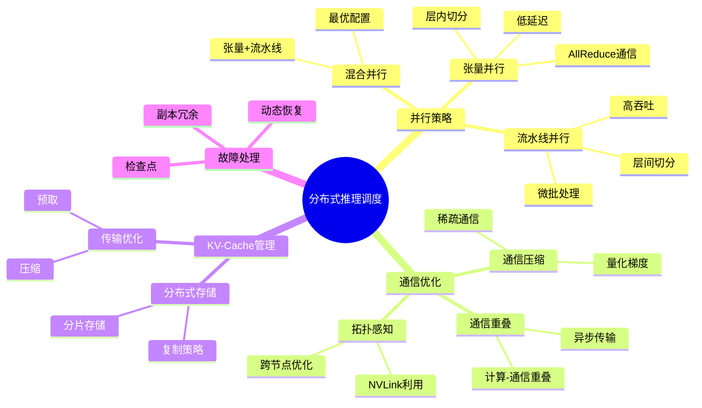
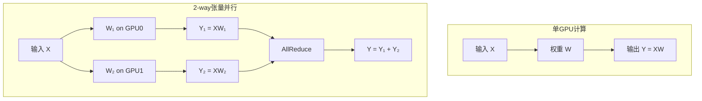
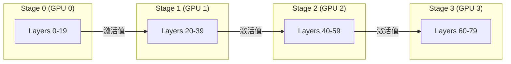
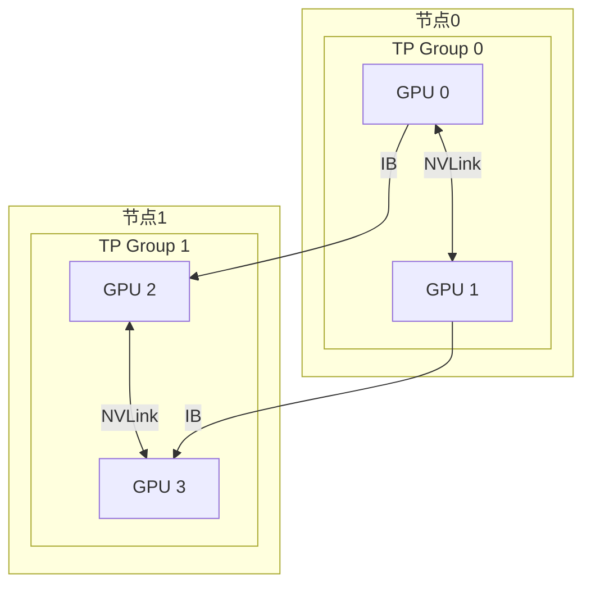
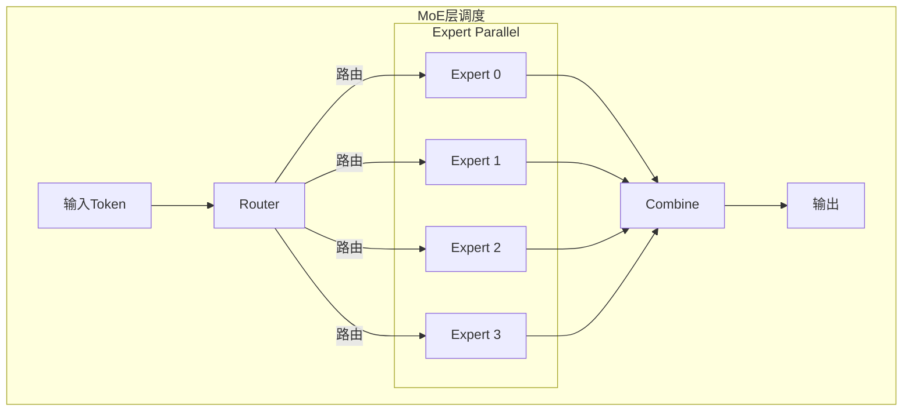
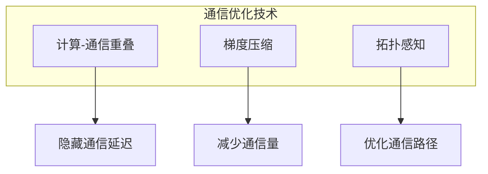

# 25.4 分布式推理调度

> **子主题编号**: 25.4
> **主题**: LLM推理调度
> **最后更新**: 2025-12-02
> **文档状态**: ✅ 完成

---

## 📋 目录

- [1 概述](#1-概述)
- [2 思维导图](#2-思维导图)
- [3 张量并行](#3-张量并行)
- [4 流水线并行](#4-流水线并行)
- [5 混合并行策略](#5-混合并行策略)
- [6 知识矩阵](#6-知识矩阵)
- [7 形式化模型](#7-形式化模型)
- [8 实践优化](#8-实践优化)
- [9 跨视角链接](#9-跨视角链接)

---

## 1 概述

### 1.1 核心洞察

大型语言模型（如GPT-4、LLaMA-70B+）的参数量远超单GPU内存容量，必须采用分布式推理。分布式LLM推理面临独特挑战：需要在保持低延迟的同时，高效协调多GPU间的通信和计算。

### 1.2 分布式推理挑战

| 挑战 | 描述 | 影响 |
|------|------|------|
| **模型切分** | 如何将模型分布到多GPU | 通信开销 |
| **KV-Cache同步** | 分布式KV-Cache管理 | 内存效率 |
| **通信瓶颈** | GPU间数据传输 | 延迟增加 |
| **负载均衡** | 各GPU负载不均 | 资源浪费 |
| **故障恢复** | 节点故障处理 | 可靠性 |

### 1.3 模型规模与GPU需求

```text
模型参数量 vs GPU需求 (FP16):

| 模型       | 参数量  | 模型内存  | 推荐GPU配置      |
|------------|---------|----------|-----------------|
| LLaMA-7B   | 7B      | ~14GB    | 1× A100 80GB    |
| LLaMA-13B  | 13B     | ~26GB    | 1× A100 80GB    |
| LLaMA-70B  | 70B     | ~140GB   | 2× A100 80GB    |
| GPT-3      | 175B    | ~350GB   | 8× A100 80GB    |
| GPT-4*     | ~1.8T   | ~3.6TB   | 多节点集群       |

*GPT-4为估计值
```

---

## 2 思维导图



---

## 3 张量并行

### 3.1 张量并行原理

张量并行（Tensor Parallelism, TP）将单层的计算分布到多个GPU上，适合低延迟场景。



### 3.2 注意力层张量并行

```text
多头注意力张量并行:

原始: Attention = Concat(head₁, ..., head_h) × W_O
      head_i = Softmax(Q_i × K_i^T / √d) × V_i

张量并行 (TP=2):
  GPU0: head₁, head₂, ..., head_{h/2}
  GPU1: head_{h/2+1}, ..., head_h

  计算流程:
  1. [并行] 各GPU计算负责的头
  2. [通信] AllReduce合并输出投影结果
```

```python
class TensorParallelAttention:
    """张量并行注意力层"""

    def __init__(self, hidden_size: int, num_heads: int, tp_size: int, rank: int):
        self.tp_size = tp_size
        self.rank = rank
        self.num_heads_per_rank = num_heads // tp_size

        # 每个rank只持有部分头的参数
        self.q_proj = Linear(hidden_size, hidden_size // tp_size)
        self.k_proj = Linear(hidden_size, hidden_size // tp_size)
        self.v_proj = Linear(hidden_size, hidden_size // tp_size)
        self.o_proj = Linear(hidden_size // tp_size, hidden_size)

    def forward(self, x: Tensor, kv_cache: Optional[KVCache]) -> Tensor:
        # 1. 计算本地Q, K, V
        q = self.q_proj(x)
        k = self.k_proj(x)
        v = self.v_proj(x)

        # 2. 更新KV-Cache
        if kv_cache is not None:
            k, v = kv_cache.update(k, v)

        # 3. 计算注意力（只涉及本地头）
        attn_output = scaled_dot_product_attention(q, k, v)

        # 4. 输出投影
        output = self.o_proj(attn_output)

        # 5. AllReduce合并所有rank的结果
        output = all_reduce(output)

        return output
```

### 3.3 MLP层张量并行

```text
MLP张量并行 (TP=2):

原始: Y = GeLU(X × W₁) × W₂

列并行 + 行并行:
  W₁ 按列切分: W₁ = [W₁ᴬ | W₁ᴮ]
  W₂ 按行切分: W₂ = [W₂ᴬ]
                    [W₂ᴮ]

GPU0: Y₀ = GeLU(X × W₁ᴬ) × W₂ᴬ
GPU1: Y₁ = GeLU(X × W₁ᴮ) × W₂ᴮ

AllReduce: Y = Y₀ + Y₁
```

### 3.4 通信分析

```text
张量并行通信开销:

每层通信量:
  - 注意力层: 2 × batch × seq_len × hidden_size × dtype_size
  - MLP层: 2 × batch × seq_len × hidden_size × dtype_size

总计每层: 4 × B × S × H × sizeof(dtype)

示例 (LLaMA-70B, B=1, S=2048, H=8192, FP16):
  每层通信: 4 × 1 × 2048 × 8192 × 2 = 128MB
  总通信 (80层): 80 × 128MB = 10GB

通信时间 (NVLink 300GB/s):
  T_comm = 10GB / 300GB/s ≈ 33ms
```

---

## 4 流水线并行

### 4.1 流水线并行原理

流水线并行（Pipeline Parallelism, PP）将模型按层切分，不同stage处理不同的层。



### 4.2 流水线气泡问题

```text
朴素流水线 (4 stages, 4 microbatches):

时间 →
      Stage0: [MB0][MB1][MB2][MB3][   ][   ][   ]
      Stage1: [   ][MB0][MB1][MB2][MB3][   ][   ]
      Stage2: [   ][   ][MB0][MB1][MB2][MB3][   ]
      Stage3: [   ][   ][   ][MB0][MB1][MB2][MB3]
              └─────气泡开销─────┘

气泡比例 = (p-1) / (m+p-1)
  其中 p=stages数, m=microbatch数

示例: p=4, m=4 → 气泡 = 3/7 = 42.9%
```

### 4.3 1F1B调度

```text
1F1B (One Forward One Backward) 调度:

时间 →
      Stage0: [F0][F1][F2][F3][B3][B2][B1][B0]
      Stage1: [  ][F0][F1][F2][B2][B3][B1][B0][B]
      Stage2: [  ][  ][F0][F1][B1][B2][B3][B0][B][B]
      Stage3: [  ][  ][  ][F0][B0][B1][B2][B3][B][B][B]

推理简化版 (仅前向):
      Stage0: [F0][F1][F2][F3]...
      Stage1: [  ][F0][F1][F2][F3]...
      Stage2: [  ][  ][F0][F1][F2][F3]...
      Stage3: [  ][  ][  ][F0][F1][F2][F3]...

稳态后无气泡!
```

### 4.4 流水线并行实现

```python
class PipelineStage:
    """流水线并行Stage"""

    def __init__(self, layers: List[Layer], stage_id: int, num_stages: int):
        self.layers = layers
        self.stage_id = stage_id
        self.num_stages = num_stages
        self.is_first = (stage_id == 0)
        self.is_last = (stage_id == num_stages - 1)

    def forward(self, hidden_states: Optional[Tensor] = None) -> Tensor:
        # 从上一stage接收激活值
        if not self.is_first:
            hidden_states = recv_tensor(src=self.stage_id - 1)

        # 计算本stage的层
        for layer in self.layers:
            hidden_states = layer(hidden_states)

        # 发送到下一stage
        if not self.is_last:
            send_tensor(hidden_states, dst=self.stage_id + 1)
            return None
        else:
            return hidden_states


class PipelineScheduler:
    """流水线调度器"""

    def __init__(self, num_stages: int, num_microbatches: int):
        self.num_stages = num_stages
        self.num_microbatches = num_microbatches

    def generate_schedule(self) -> List[Tuple[int, int]]:
        """生成1F1B调度"""
        schedule = []

        # Warm-up: 填充流水线
        for mb in range(min(self.num_stages, self.num_microbatches)):
            for stage in range(self.num_stages):
                if mb >= stage:
                    schedule.append(('forward', stage, mb - stage))

        # Steady state: 1F1B
        for mb in range(self.num_stages, self.num_microbatches):
            for stage in range(self.num_stages):
                schedule.append(('forward', stage, mb - stage))

        return schedule
```

---

## 5 混合并行策略

### 5.1 TP + PP混合



```text
混合并行配置示例 (LLaMA-70B, 8 GPUs):

配置1: TP=4, PP=2
  - Stage 0 (Layers 0-39): GPU 0-3 (张量并行)
  - Stage 1 (Layers 40-79): GPU 4-7 (张量并行)

配置2: TP=2, PP=4
  - Stage 0: GPU 0-1
  - Stage 1: GPU 2-3
  - Stage 2: GPU 4-5
  - Stage 3: GPU 6-7

选择依据:
  - 节点内GPU: 优先TP (NVLink高带宽)
  - 节点间: 优先PP (通信量小)
```

### 5.2 配置优化

```python
def optimize_parallel_config(
    model_size: int,
    num_layers: int,
    hidden_size: int,
    num_gpus: int,
    gpu_memory: int,
    intra_node_bandwidth: float,  # NVLink
    inter_node_bandwidth: float,  # InfiniBand
) -> Tuple[int, int]:
    """
    优化并行配置
    Returns: (tp_size, pp_size)
    """
    best_config = None
    best_latency = float('inf')

    for tp in range(1, num_gpus + 1):
        if num_gpus % tp != 0:
            continue
        pp = num_gpus // tp

        if num_layers % pp != 0:
            continue

        # 估算内存
        model_memory_per_gpu = model_size / tp / pp
        kv_cache_per_gpu = estimate_kv_cache(hidden_size, num_layers // pp)
        total_memory = model_memory_per_gpu + kv_cache_per_gpu

        if total_memory > gpu_memory:
            continue

        # 估算延迟
        tp_comm = 4 * hidden_size * 2 / intra_node_bandwidth  # AllReduce
        pp_comm = hidden_size * 2 / inter_node_bandwidth  # P2P
        compute_time = estimate_compute(model_size, tp, pp)

        total_latency = compute_time + (num_layers // pp) * tp_comm + (pp - 1) * pp_comm

        if total_latency < best_latency:
            best_latency = total_latency
            best_config = (tp, pp)

    return best_config
```

### 5.3 专家并行（MoE）

对于Mixture of Experts模型，还需要专家并行（Expert Parallelism, EP）：



```text
MoE调度挑战:
1. 负载不均: Token路由不均匀
2. 通信: All-to-All通信
3. 专家容量: 限制每个专家的Token数

解决方案:
- 辅助负载均衡损失
- 专家容量限制
- Top-k路由调优
```

---

## 6 知识矩阵

### 6.1 并行策略对比

| 策略 | 通信模式 | 通信量 | 延迟 | 吞吐量 | 适用场景 |
|------|---------|-------|------|-------|---------|
| **张量并行** | AllReduce | 高 | 低 | 中 | 节点内 |
| **流水线并行** | P2P | 低 | 高 | 高 | 节点间 |
| **专家并行** | All-to-All | 中 | 中 | 高 | MoE模型 |
| **混合并行** | 混合 | 可控 | 可控 | 高 | 大规模 |

### 6.2 系统实现对比

| 系统 | TP | PP | EP | 特色 |
|------|----|----|----|----|
| **Megatron-LM** | ✅ | ✅ | ✅ | NVIDIA官方 |
| **DeepSpeed** | ✅ | ✅ | ✅ | ZeRO优化 |
| **vLLM** | ✅ | ✅ | ❌ | PagedAttention |
| **TensorRT-LLM** | ✅ | ✅ | ✅ | 低延迟 |
| **Alpa** | ✅ | ✅ | ❌ | 自动并行 |

---

## 7 形式化模型

### 7.1 分布式推理形式化

```text
定义: 分布式LLM推理系统

结构 DistributedLLM:
  Model = List<Layer>
  Partition: Model → Map<DeviceId, List<Layer>>

并行配置:
  Config = {
    tp_size: Nat,      // 张量并行度
    pp_size: Nat,      // 流水线并行度
    ep_size: Nat,      // 专家并行度
  }

约束:
  tp_size × pp_size × ep_size = num_devices
  ∀ stage ∈ [0, pp_size): |layers(stage)| = num_layers / pp_size
```

### 7.2 延迟模型

```text
端到端推理延迟:

T_total = T_prefill + T_decode × output_length

预填充延迟 (TP=t, PP=p):
  T_prefill = T_compute(prefill) / t + (p-1) × T_bubble + T_comm_tp × num_layers

解码延迟:
  T_decode = T_compute(decode) / t + T_comm_tp × num_layers / p + T_comm_pp

其中:
  T_comm_tp = 2 × H × dtype_size / BW_nvlink  (AllReduce)
  T_comm_pp = B × S × H × dtype_size / BW_ib  (P2P)
  T_bubble = T_compute(decode) × (p-1) / m    (流水线气泡)
```

### 7.3 最优配置定理

```text
定理: 给定硬件拓扑，存在最优并行配置

给定:
  - n 个GPU，分布在 k 个节点
  - 节点内带宽 BW_intra
  - 节点间带宽 BW_inter
  - BW_intra >> BW_inter

最优配置:
  tp_size = gpus_per_node  (利用节点内高带宽)
  pp_size = num_nodes      (最小化节点间通信)

证明思路:
  张量并行通信量大但可用NVLink
  流水线并行通信量小适合跨节点
```

---

## 8 实践优化

### 8.1 通信优化



```python
class OverlappedTensorParallel:
    """计算-通信重叠的张量并行"""

    def forward(self, x: Tensor) -> Tensor:
        # 分割输入用于流水
        chunks = x.chunk(num_chunks, dim=0)
        outputs = []

        # 异步通信句柄
        handles = []

        for i, chunk in enumerate(chunks):
            # 计算当前块
            local_out = self.compute(chunk)

            # 异步启动AllReduce
            handle = all_reduce_async(local_out)
            handles.append(handle)

            # 等待上一个块的通信完成
            if i > 0:
                handles[i-1].wait()
                outputs.append(handles[i-1].result())

        # 等待最后一个
        handles[-1].wait()
        outputs.append(handles[-1].result())

        return torch.cat(outputs, dim=0)
```

### 8.2 KV-Cache分布式管理

```python
class DistributedKVCache:
    """分布式KV-Cache管理"""

    def __init__(self, tp_size: int, pp_size: int):
        self.tp_size = tp_size
        self.pp_size = pp_size
        # 每个stage维护自己层的KV-Cache
        self.local_cache = LocalKVCache()

    def update(self, layer_id: int, k: Tensor, v: Tensor):
        """更新KV-Cache"""
        # K,V已经是张量并行切分后的
        self.local_cache.update(layer_id, k, v)

    def migrate(self, request_id: int, target_device: int):
        """跨设备迁移KV-Cache"""
        cache_data = self.local_cache.get(request_id)
        # 异步传输
        send_async(cache_data, target_device)
```

### 8.3 故障恢复

```text
故障恢复策略:

1. 检查点保存:
   - 定期保存模型状态
   - KV-Cache检查点(可选)
   - 请求队列状态

2. 副本冗余:
   - 关键数据多副本
   - 快速故障检测

3. 动态恢复:
   - 检测故障节点
   - 重新分配任务
   - 从检查点恢复
```

---

## 9 跨视角链接

### 9.1 调度视角关联

- [分布式系统调度](../06_调度模型/06.4_分布式系统调度.md) - 分布式调度基础
- [GPU集群调度](../16_GPU与加速器调度/16.4_异构计算调度.md) - 异构集群
- [网络调度](../15_网络调度系统/README.md) - 通信调度

### 9.2 形式语言视角关联

| 形式语言概念 | 分布式推理对应 | 映射说明 |
|------------|--------------|---------|
| **分布式类型** | 张量切分 | 数据分布 |
| **通道类型** | GPU间通信 | 消息传递 |
| **并行组合** | 混合并行 | 并行组合 |

---

**返回**: [LLM推理调度主索引](./README.md) | [调度视角主索引](../README.md)
