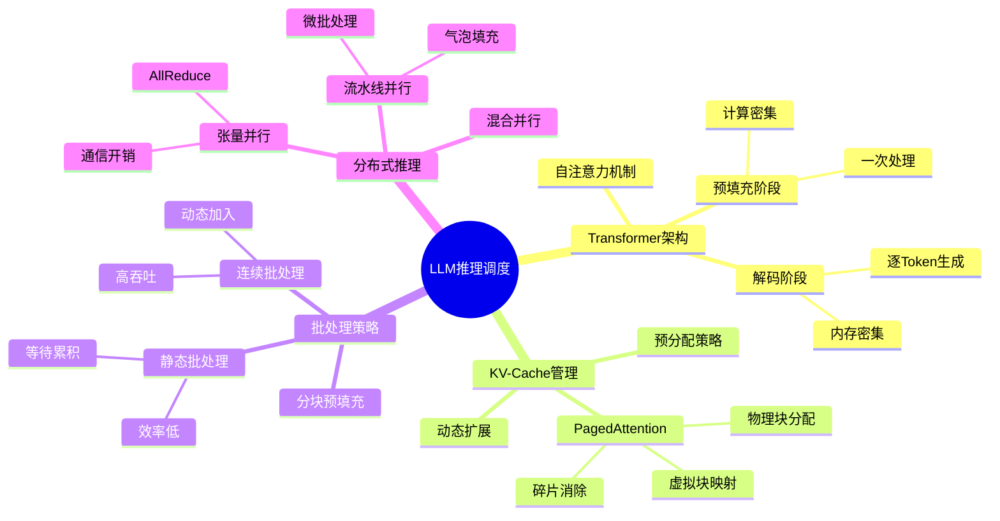
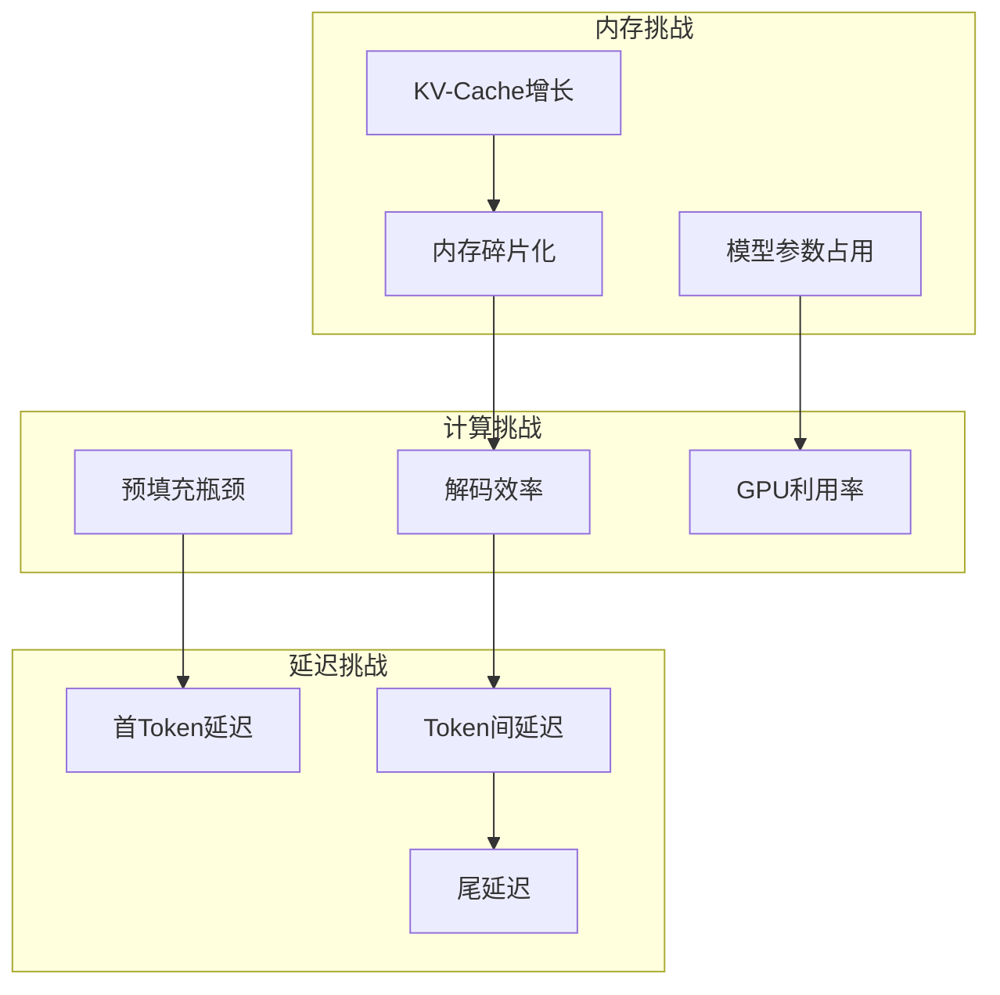
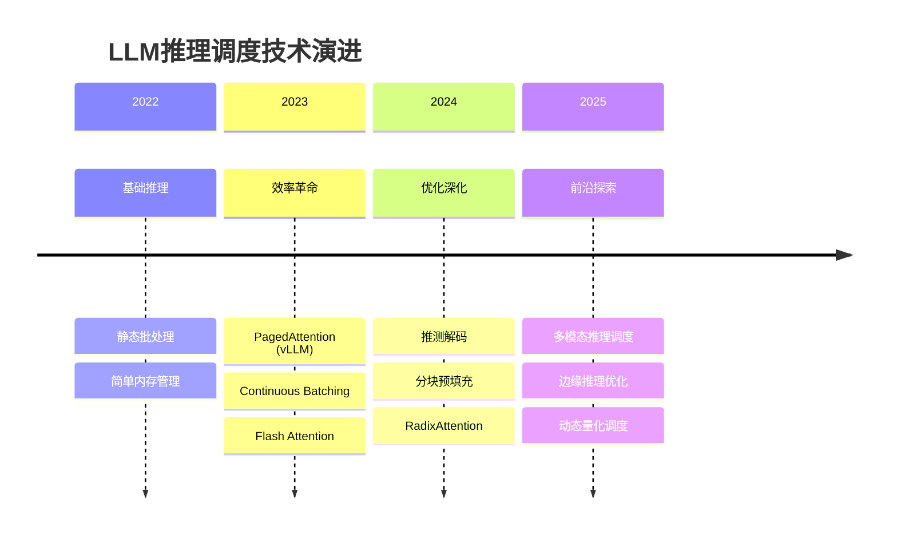

# 25 LLM推理调度

> **主题编号**: 25
> **主题**: 大语言模型推理调度
> **最后更新**: 2025-12-02
> **文档状态**: ✅ 完成

---

## 📋 目录

- [25 LLM推理调度](#1-概述)

---

## 1 概述

### 1.1 核心洞察

大语言模型（LLM）推理调度是当前AI基础设施中最具挑战性的调度问题之一。LLM推理具有以下独特特性：

| 特性 | 描述 | 调度挑战 |
|------|------|---------|
| **自回归生成** | Token逐个生成 | 批处理效率低 |
| **KV-Cache增长** | 注意力缓存线性增长 | 内存管理复杂 |
| **序列长度可变** | 输入/输出长度不固定 | 资源预估困难 |
| **计算密集** | Transformer注意力机制 | GPU利用率优化 |
| **内存受限** | 模型参数+KV-Cache | 内存带宽瓶颈 |

### 1.2 形式化定义

```text
LLM推理调度系统 S = (Q, M, G, P, σ)

其中：
  Q: 请求队列 {r₁, r₂, ..., rₙ}
  M: 内存管理器（KV-Cache分配）
  G: GPU计算调度器
  P: 预填充/解码阶段管理
  σ: 调度策略函数 σ: Q × M × G → Schedule

优化目标：
  minimize: Latency(P50, P99), Memory_Fragmentation
  maximize: Throughput, GPU_Utilization
```

---

## 2 子主题索引

| 编号 | 子主题 | 核心内容 | 状态 |
|------|--------|---------|------|
| [25.1](./25.1_Transformer推理调度.md) | Transformer推理调度 | 注意力机制调度、预填充/解码分离 | ✅ |
| [25.2](./25.2_KV-Cache调度.md) | KV-Cache调度 | PagedAttention、内存池化 | ✅ |
| [25.3](./25.3_批处理调度策略.md) | 批处理调度策略 | Continuous Batching、动态批处理 | ✅ |
| [25.4](./25.4_分布式推理调度.md) | 分布式推理调度 | 张量并行、流水线并行 | ✅ |

---

## 3 思维导图



---

## 4 核心挑战

### 4.1 挑战矩阵



### 4.2 性能对比

| 系统 | 吞吐量提升 | 延迟优化 | 内存效率 | 特点 |
|------|-----------|---------|---------|------|
| **vLLM** | 2-24x | P99↓50% | 高 | PagedAttention |
| **TensorRT-LLM** | 3-5x | 低延迟 | 中 | NVIDIA优化 |
| **TGI** | 2-3x | 中等 | 中 | HuggingFace |
| **DeepSpeed-Inference** | 1.5-3x | 中等 | 高 | 微软优化 |
| **SGLang** | 2-5x | 低 | 高 | RadixAttention |

---

## 5 技术演进



---

## 6 跨视角链接

### 6.1 调度视角关联

| 相关主题 | 关联内容 | 链接 |
|---------|---------|------|
| GPU调度 | 异构计算调度基础 | [16_GPU与加速器调度](../16_GPU与加速器调度/) |
| 分布式调度 | 集群调度策略 | [06_调度模型](../06_调度模型/) |
| AI调度 | 强化学习调度 | [10_AI驱动调度](../10_AI驱动调度/) |
| 内存管理 | 内存调度基础 | [03_OS抽象层](../03_OS抽象层/) |

### 6.2 形式语言视角关联

| 概念映射 | 形式语言 | LLM调度 |
|---------|---------|---------|
| **线性类型** | 资源所有权 | KV-Cache生命周期 |
| **效应系统** | 状态管理 | 推理状态追踪 |
| **泛型** | 参数化类型 | 调度策略参数化 |

---

## 参考资源

1. vLLM论文: [Efficient Memory Management for Large Language Model Serving with PagedAttention](https://arxiv.org/abs/2309.06180)
2. TensorRT-LLM文档: [NVIDIA TensorRT-LLM](https://github.com/NVIDIA/TensorRT-LLM)
3. Flash Attention: [Fast and Memory-Efficient Exact Attention](https://arxiv.org/abs/2205.14135)
4. SGLang: [Efficiently Programming Large Language Models](https://arxiv.org/abs/2312.07104)

---

**返回**: [调度视角主索引](../README.md)
