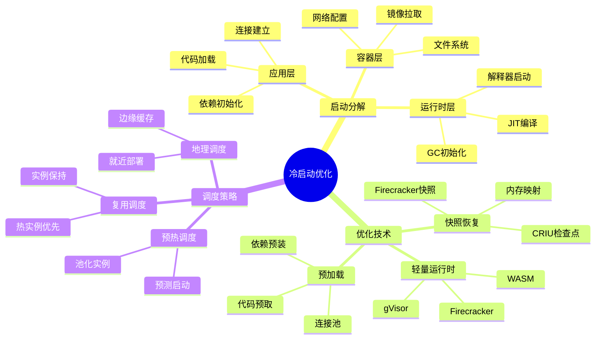
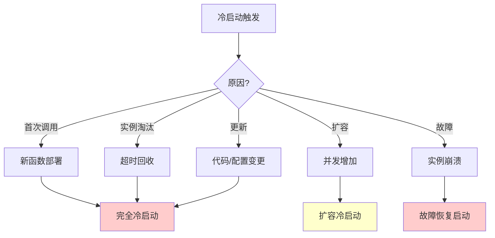
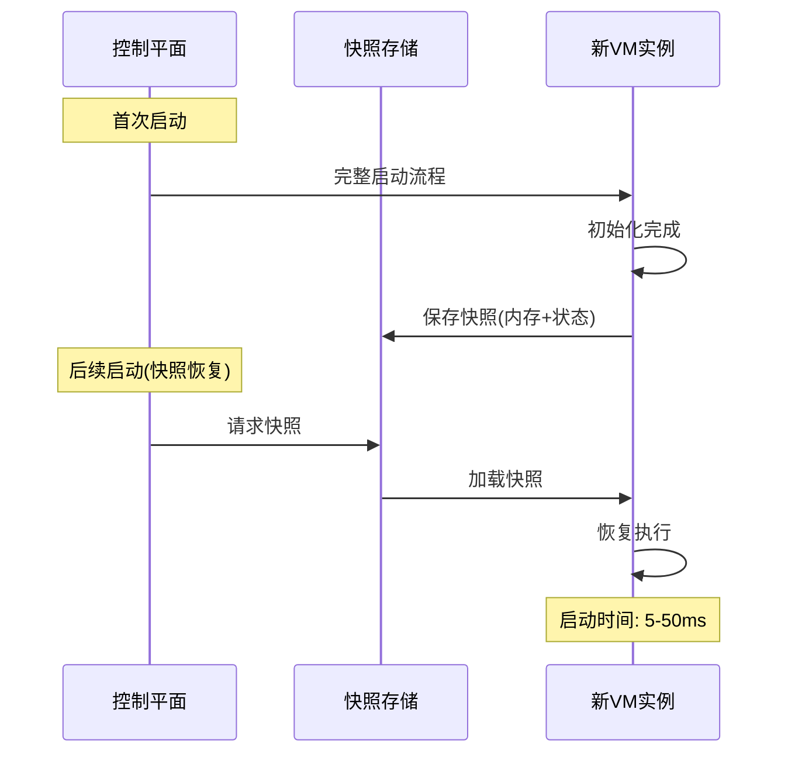
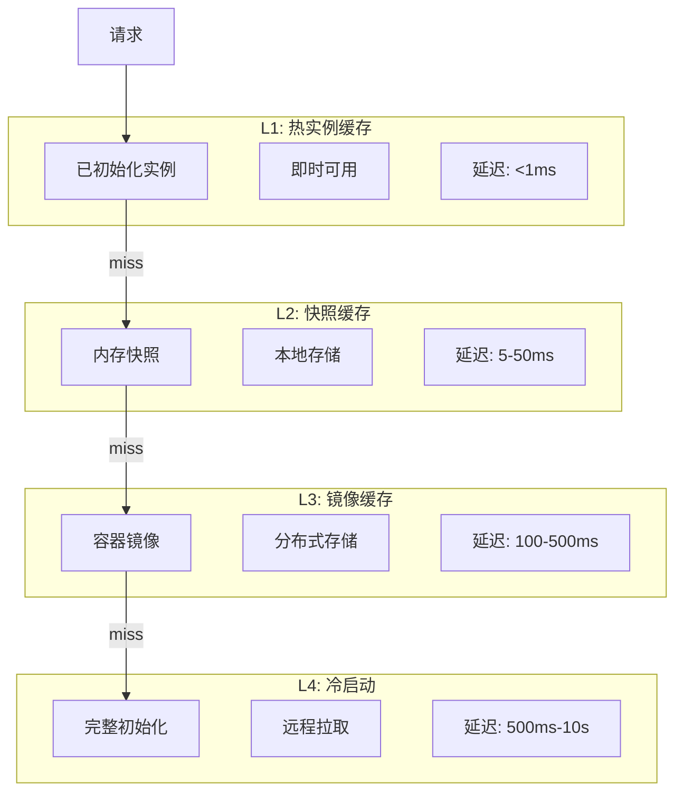

# 26.1 冷启动优化调度

> **子主题编号**: 26.1
> **主题**: Serverless调度
> **最后更新**: 2025-12-02
> **文档状态**: ✅ 完成

---

## 📋 目录

- [1 概述](#1-概述)
- [2 思维导图](#2-思维导图)
- [3 冷启动分析](#3-冷启动分析)
- [4 优化技术](#4-优化技术)
- [5 知识矩阵](#5-知识矩阵)
- [6 形式化模型](#6-形式化模型)
- [7 实践案例](#7-实践案例)
- [8 跨视角链接](#8-跨视角链接)

---

## 1 概述

### 1.1 核心洞察

冷启动是Serverless计算的核心挑战，指函数从无实例状态到可执行状态的过程。优化冷启动对用户体验和成本效率至关重要。

### 1.2 冷启动构成

| 阶段 | 耗时范围 | 描述 | 优化空间 |
|------|---------|------|---------|
| **调度决策** | 1-10ms | 选择执行节点 | 低 |
| **容器/VM启动** | 50-500ms | 启动运行时环境 | 高 |
| **运行时初始化** | 10-100ms | 语言运行时启动 | 中 |
| **代码加载** | 10-500ms | 下载/加载代码 | 高 |
| **依赖初始化** | 10ms-5s | 加载依赖、建立连接 | 高 |

---

## 2 思维导图



---

## 3 冷启动分析

### 3.1 冷启动时间线

```mermaid
gantt
    title 典型冷启动时间线 (Python Lambda)
    dateFormat X
    axisFormat %L ms

    section 基础设施
    调度决策          :a1, 0, 5
    沙盒准备          :a2, after a1, 100
    网络配置          :a3, after a2, 20

    section 运行时
    Python启动        :b1, after a3, 50
    依赖导入          :b2, after b1, 200

    section 应用
    Handler加载       :c1, after b2, 30
    初始化代码        :c2, after c1, 100

    section 就绪
    首次执行          :d1, after c2, 5
```



### 3.2 各语言冷启动对比

```text
冷启动时间分布 (AWS Lambda, 256MB内存):

┌─────────────────────────────────────────────────┐
│ 语言         │ P50    │ P99    │ 峰值     │
├─────────────────────────────────────────────────┤
│ Node.js      │ 150ms  │ 400ms  │ 800ms   │
│ Python       │ 200ms  │ 500ms  │ 1.5s    │
│ Go           │ 100ms  │ 250ms  │ 500ms   │
│ Java         │ 500ms  │ 2s     │ 10s     │
│ .NET         │ 300ms  │ 1s     │ 3s      │
│ Rust         │ 80ms   │ 200ms  │ 400ms   │
└─────────────────────────────────────────────────┘

影响因素:
- 运行时启动开销
- 包大小
- 依赖数量
- JIT编译需求
```

### 3.3 冷启动原因



---

## 4 优化技术

### 4.1 Firecracker微VM

```text
Firecracker架构:

┌─────────────────────────────────────┐
│            用户函数代码              │
├─────────────────────────────────────┤
│          轻量Linux内核               │
├─────────────────────────────────────┤
│       Firecracker VMM              │
│  - 最小设备模型                      │
│  - 快速启动 (<125ms)                 │
│  - 低内存开销 (<5MB)                 │
├─────────────────────────────────────┤
│            KVM虚拟化                 │
└─────────────────────────────────────┘

优化点:
1. 精简设备模型: 只包含必要设备
2. 按需加载: 延迟初始化非关键组件
3. 快照恢复: 支持VM快照/恢复
```

### 4.2 快照恢复技术



```python
# 快照恢复伪代码
class SnapshotManager:
    def __init__(self, storage: SnapshotStorage):
        self.storage = storage
        self.cache = LRUCache(max_size=1000)

    def create_snapshot(self, function_id: str, vm: MicroVM):
        """创建函数快照"""
        snapshot = Snapshot(
            memory=vm.dump_memory(),
            cpu_state=vm.dump_cpu_state(),
            device_state=vm.dump_device_state(),
        )
        self.storage.save(function_id, snapshot)
        self.cache.put(function_id, snapshot)

    def restore_from_snapshot(self, function_id: str) -> MicroVM:
        """从快照恢复"""
        # 优先从缓存获取
        snapshot = self.cache.get(function_id)
        if not snapshot:
            snapshot = self.storage.load(function_id)

        vm = MicroVM.from_snapshot(snapshot)
        return vm

    def start_function(self, function_id: str) -> MicroVM:
        """启动函数（优先快照恢复）"""
        if self.has_snapshot(function_id):
            return self.restore_from_snapshot(function_id)  # 快速路径
        else:
            vm = self.cold_start(function_id)  # 冷启动
            self.create_snapshot(function_id, vm)
            return vm
```

### 4.3 WASM轻量运行时

```text
WebAssembly优势:

┌─────────────────────────────────────────────┐
│            传统容器                          │
│  - 启动时间: 100ms-1s                        │
│  - 内存开销: 50-200MB                        │
│  - 隔离级别: 进程级                          │
├─────────────────────────────────────────────┤
│            WASM运行时                        │
│  - 启动时间: <10ms                           │
│  - 内存开销: <10MB                           │
│  - 隔离级别: 沙盒级                          │
│  - 语言无关                                  │
└─────────────────────────────────────────────┘

代表实现:
- Wasmtime (Bytecode Alliance)
- WasmEdge (CNCF)
- Spin (Fermyon)
```

### 4.4 多级缓存策略



---

## 5 知识矩阵

### 5.1 优化技术对比

| 技术 | 启动时间 | 内存开销 | 复杂度 | 适用场景 |
|------|---------|---------|-------|---------|
| **热实例复用** | <1ms | 高 | 低 | 高频函数 |
| **快照恢复** | 5-50ms | 中 | 中 | 通用 |
| **Firecracker** | 50-125ms | 低 | 中 | 安全隔离 |
| **gVisor** | 30-100ms | 中 | 高 | 安全+兼容 |
| **WASM** | <10ms | 极低 | 中 | 轻量函数 |

### 5.2 平台实现对比

| 平台 | 隔离技术 | 快照支持 | 冷启动优化 |
|------|---------|---------|-----------|
| **AWS Lambda** | Firecracker | SnapStart | 预置并发 |
| **Google Cloud** | gVisor | - | Min实例 |
| **Azure** | Hyper-V | - | Premium预热 |
| **Cloudflare** | V8 Isolates | - | 全局边缘 |

---

## 6 形式化模型

### 6.1 冷启动延迟模型

```text
冷启动延迟公式:

T_cold = T_schedule + T_provision + T_init + T_app

其中:
  T_schedule: 调度决策时间
  T_provision: 资源准备时间 (容器/VM)
  T_init: 运行时初始化时间
  T_app: 应用初始化时间

优化后延迟:
  T_warm = T_schedule + T_execute  (热启动)
  T_snap = T_schedule + T_restore + T_execute  (快照恢复)

优化效果:
  Speedup_snap = T_cold / T_snap
  典型值: 5-20x
```

### 6.2 成本-延迟权衡模型

```text
成本模型:

总成本 = 执行成本 + 预热成本 + 冷启动惩罚

C_total = Σ(C_exec × T_exec) + Σ(C_warm × T_warm) + Σ(C_cold × N_cold)

优化目标:
  minimize C_total
  subject to:
    P99_latency ≤ SLA_target
    Cold_start_rate ≤ threshold

最优预热实例数:
  N_warm* = argmin_N { C_warm × N + C_cold × f(N, λ) }
  其中 λ = 请求到达率, f = 冷启动概率函数
```

---

## 7 实践案例

### 7.1 AWS Lambda SnapStart

```yaml
# AWS SAM配置启用SnapStart
AWSTemplateFormatVersion: '2010-09-09'
Transform: AWS::Serverless-2016-10-31

Resources:
  MyFunction:
    Type: AWS::Serverless::Function
    Properties:
      FunctionName: my-java-function
      Runtime: java11
      Handler: com.example.Handler::handleRequest
      MemorySize: 512
      SnapStart:
        ApplyOn: PublishedVersions  # 启用SnapStart

# 效果:
# - Java冷启动: 2-5s → 200-500ms
# - 初始化代码只执行一次
# - 快照包含JVM预热状态
```

### 7.2 Knative冷启动优化

```yaml
# Knative Service配置
apiVersion: serving.knative.dev/v1
kind: Service
metadata:
  name: optimized-function
spec:
  template:
    metadata:
      annotations:
        # 最小实例数(避免完全冷启动)
        autoscaling.knative.dev/min-scale: "1"
        # 最大实例数
        autoscaling.knative.dev/max-scale: "100"
        # 实例保持时间
        autoscaling.knative.dev/scale-to-zero-grace-period: "30s"
    spec:
      containerConcurrency: 10  # 并发复用
      containers:
      - image: my-function:latest
        resources:
          limits:
            memory: 256Mi
            cpu: 100m
```

---

## 8 跨视角链接

### 8.1 调度视角关联

- [容器化技术](../05_虚拟化容器化沙盒化/05.2_容器化技术.md) - 容器调度基础
- [沙盒化技术](../05_虚拟化容器化沙盒化/05.3_沙盒化技术.md) - 轻量隔离
- [边缘计算调度](../20_边缘与移动调度/20.1_边缘计算调度.md) - 边缘冷启动

### 8.2 形式语言视角关联

| 形式语言概念 | 冷启动对应 | 映射说明 |
|------------|-----------|---------|
| **惰性求值** | 按需启动 | 延迟初始化 |
| **记忆化** | 快照缓存 | 计算结果复用 |
| **持久化数据结构** | 增量快照 | 共享不变部分 |

---

**返回**: [Serverless调度主索引](./README.md) | [调度视角主索引](../README.md)
