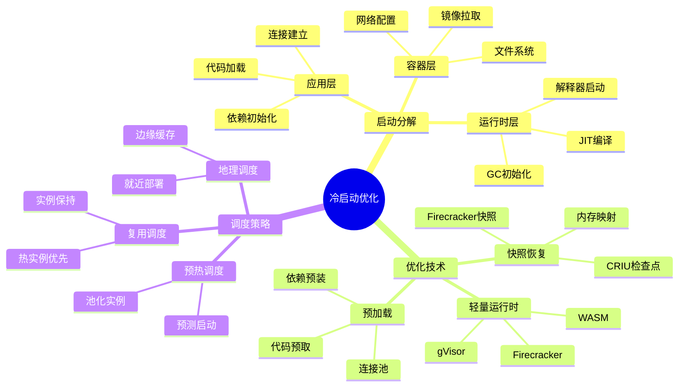
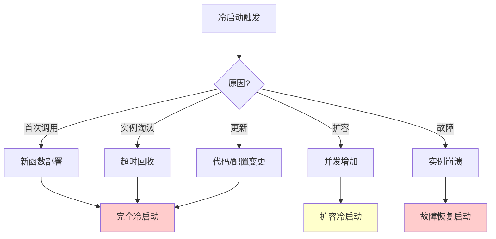
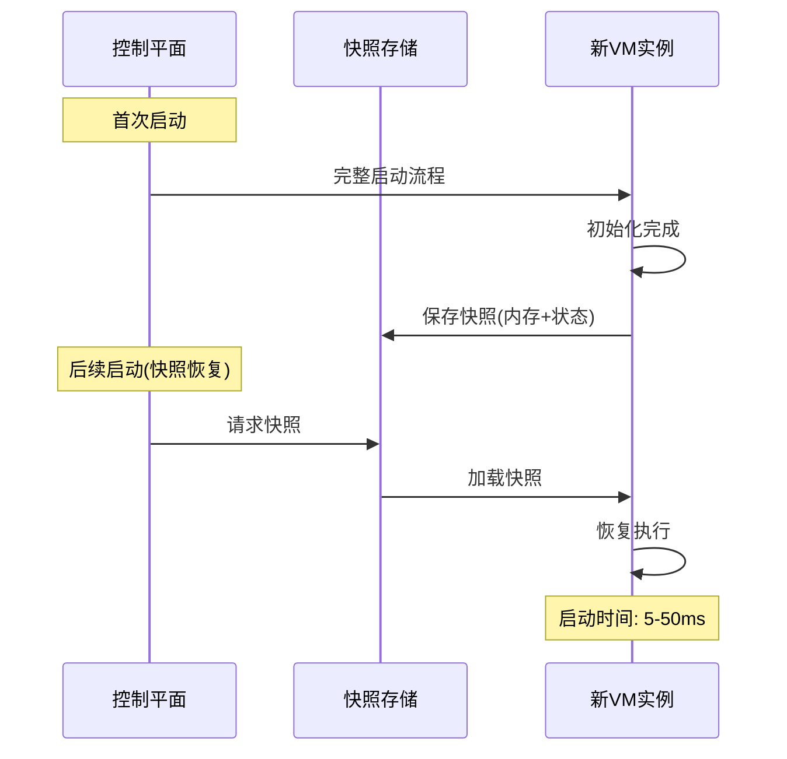
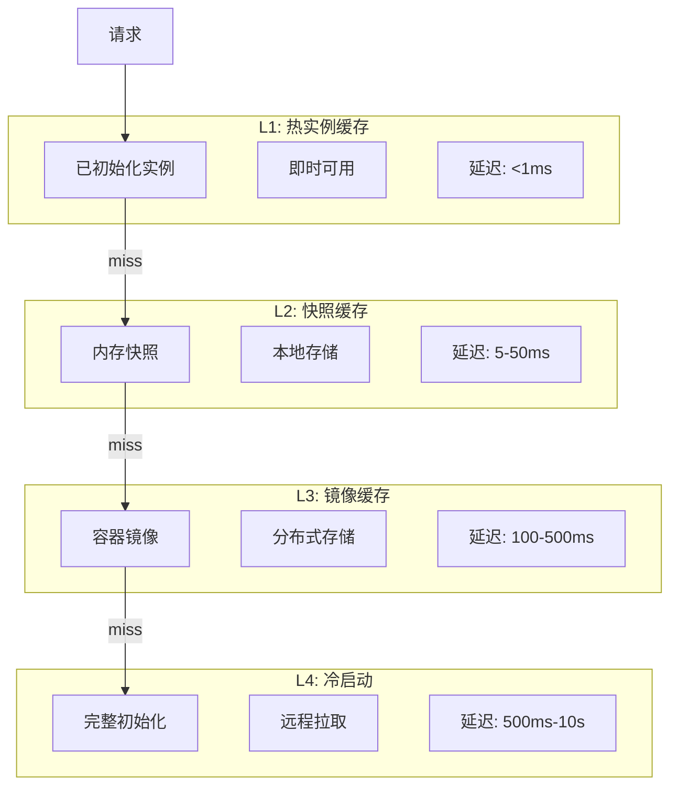

# 26.1 冷启动优化调度

> **子主题编号**: 26.1
> **主题**: Serverless调度
> **最后更新**: 2025-12-02
> **文档状态**: ✅ 完成

---

## 📋 目录

- [26.1 冷启动优化调度](#261-冷启动优化调度)
  - [📋 目录](#-目录)
  - [1 概述](#1-概述)
    - [1.1 核心洞察](#11-核心洞察)
    - [1.2 冷启动构成](#12-冷启动构成)
  - [2 思维导图](#2-思维导图)
  - [3 冷启动分析](#3-冷启动分析)
    - [3.1 冷启动时间线](#31-冷启动时间线)
    - [3.2 各语言冷启动对比](#32-各语言冷启动对比)
    - [3.3 冷启动原因](#33-冷启动原因)
  - [4 优化技术](#4-优化技术)
    - [4.1 Firecracker微VM与AWS Lambda放置算法](#41-firecracker微vm与aws-lambda放置算法)
      - [4.1.1 Firecracker架构](#411-firecracker架构)
      - [4.1.2 AWS Lambda Firecracker微VM调度与放置算法](#412-aws-lambda-firecracker微vm调度与放置算法)
    - [4.2 快照恢复技术](#42-快照恢复技术)
    - [4.3 WASM轻量运行时](#43-wasm轻量运行时)
    - [4.4 多级缓存策略](#44-多级缓存策略)
  - [5 知识矩阵](#5-知识矩阵)
    - [5.1 优化技术对比](#51-优化技术对比)
    - [5.2 平台实现对比](#52-平台实现对比)
  - [6 形式化模型](#6-形式化模型)
    - [6.1 冷启动延迟模型](#61-冷启动延迟模型)
    - [6.2 成本-延迟权衡模型](#62-成本-延迟权衡模型)
    - [6.3 冷启动延迟 vs Keep-Alive 成本优化（形式化模型）](#63-冷启动延迟-vs-keep-alive-成本优化形式化模型)
  - [7 实践案例](#7-实践案例)
    - [7.1 AWS Lambda SnapStart](#71-aws-lambda-snapstart)
    - [7.2 Knative冷启动优化](#72-knative冷启动优化)
    - [7.3 主流平台调度架构对比：AWS Lambda vs Azure Functions vs Cloudflare Workers](#73-主流平台调度架构对比aws-lambda-vs-azure-functions-vs-cloudflare-workers)
      - [7.3.1 AWS Lambda 调度架构深度解析](#731-aws-lambda-调度架构深度解析)
      - [7.3.2 Azure Functions 调度架构](#732-azure-functions-调度架构)
      - [7.3.3 Cloudflare Workers 调度架构](#733-cloudflare-workers-调度架构)
      - [7.3.4 调度架构性能对比实测](#734-调度架构性能对比实测)
  - [8 跨视角链接](#8-跨视角链接)
    - [8.1 调度视角关联](#81-调度视角关联)
    - [8.2 形式语言视角关联](#82-形式语言视角关联)

---

## 1 概述

### 1.1 核心洞察

冷启动是Serverless计算的核心挑战，指函数从无实例状态到可执行状态的过程。优化冷启动对用户体验和成本效率至关重要。

### 1.2 冷启动构成

| 阶段 | 耗时范围 | 描述 | 优化空间 |
|------|---------|------|---------|
| **调度决策** | 1-10ms | 选择执行节点 | 低 |
| **容器/VM启动** | 50-500ms | 启动运行时环境 | 高 |
| **运行时初始化** | 10-100ms | 语言运行时启动 | 中 |
| **代码加载** | 10-500ms | 下载/加载代码 | 高 |
| **依赖初始化** | 10ms-5s | 加载依赖、建立连接 | 高 |

---

## 2 思维导图


```mermaid
mindmap
  root((冷启动优化))
    启动分解
      容器层
        镜像拉取
        文件系统
        网络配置
      运行时层
        解释器启动
        JIT编译
        GC初始化
      应用层
        代码加载
        依赖初始化
        连接建立
    优化技术
      快照恢复
        Firecracker快照
        CRIU检查点
        内存映射
      轻量运行时
        Firecracker
        gVisor
        WASM
      预加载
        代码预取
        依赖预装
        连接池
    调度策略
      预热调度
        预测启动
        池化实例
      复用调度
        实例保持
        热实例优先
      地理调度
        就近部署
        边缘缓存
```

---

## 3 冷启动分析

### 3.1 冷启动时间线


```mermaid
gantt
    title 典型冷启动时间线 (Python Lambda)
    dateFormat X
    axisFormat %L ms

    section 基础设施
    调度决策          :a1, 0, 5
    沙盒准备          :a2, after a1, 100
    网络配置          :a3, after a2, 20

    section 运行时
    Python启动        :b1, after a3, 50
    依赖导入          :b2, after b1, 200

    section 应用
    Handler加载       :c1, after b2, 30
    初始化代码        :c2, after c1, 100

    section 就绪
    首次执行          :d1, after c2, 5
```

### 3.2 各语言冷启动对比

```text
冷启动时间分布 (AWS Lambda, 256MB内存):

┌─────────────────────────────────────────────────┐
│ 语言         │ P50    │ P99    │ 峰值     │
├─────────────────────────────────────────────────┤
│ Node.js      │ 150ms  │ 400ms  │ 800ms   │
│ Python       │ 200ms  │ 500ms  │ 1.5s    │
│ Go           │ 100ms  │ 250ms  │ 500ms   │
│ Java         │ 500ms  │ 2s     │ 10s     │
│ .NET         │ 300ms  │ 1s     │ 3s      │
│ Rust         │ 80ms   │ 200ms  │ 400ms   │
└─────────────────────────────────────────────────┘

影响因素:
- 运行时启动开销
- 包大小
- 依赖数量
- JIT编译需求
```

### 3.3 冷启动原因


```mermaid
graph TD
    CS[冷启动触发] --> A{原因?}

    A -->|首次调用| B[新函数部署]
    A -->|实例淘汰| C[超时回收]
    A -->|扩容| D[并发增加]
    A -->|故障| E[实例崩溃]
    A -->|更新| F[代码/配置变更]

    B --> G[完全冷启动]
    C --> G
    D --> H[扩容冷启动]
    E --> I[故障恢复启动]
    F --> G

    style G fill:#ffcccc
    style H fill:#ffffcc
    style I fill:#ffcccc
```

---

## 4 优化技术

### 4.1 Firecracker微VM与AWS Lambda放置算法

#### 4.1.1 Firecracker架构

```text
Firecracker架构:

┌─────────────────────────────────────┐
│            用户函数代码              │
├─────────────────────────────────────┤
│          轻量Linux内核               │
├─────────────────────────────────────┤
│       Firecracker VMM              │
│  - 最小设备模型                      │
│  - 快速启动 (<125ms)                 │
│  - 低内存开销 (<5MB)                 │
├─────────────────────────────────────┤
│            KVM虚拟化                 │
└─────────────────────────────────────┘

优化点:
1. 精简设备模型: 只包含必要设备
2. 按需加载: 延迟初始化非关键组件
3. 快照恢复: 支持VM快照/恢复
```

#### 4.1.2 AWS Lambda Firecracker微VM调度与放置算法

AWS Lambda的放置系统（Placement Service）负责将Firecracker微VM分配到合适的Worker主机。其调度目标是最小化冷启动时间、最大化资源利用率并保证租户隔离。

**放置决策流程：**

```python
class LambdaPlacementService:
    """
    AWS Lambda Placement Service 概念模型
    基于公开论文（Firecracker NSDI'20, AWS Lambda架构博客）重构
    """

    def __init__(self):
        self.worker_pools = {
            'warm': WorkerPool(),      # 已有该函数快照的worker
            'cold': WorkerPool(),      # 通用worker池
            'gpu': WorkerPool(),       # 带GPU的worker（ML推理）
        }
        self.snapshot_index = {}      # function_id -> set(worker_ids)

    def place(self, function_id: str, requirements: ResourceRequirements) -> PlacementDecision:
        """
        Lambda放置核心算法
        优先级：
        1. 已有该函数热快照的worker（warm placement）
        2. 同账户/同VPC的worker（亲和性）
        3. 资源利用率适中的worker（load balancing）
        4. 地理/可用区约束
        """
        candidates = []

        # 1. 检查warm pool
        warm_workers = self.snapshot_index.get(function_id, set())
        for worker_id in warm_workers:
            worker = self.worker_pools['warm'].get(worker_id)
            if worker.can_fit(requirements):
                candidates.append((worker, score=100))  # 最高优先级

        # 2. 检查cold pool（按资源匹配度排序）
        for worker in self.worker_pools['cold'].get_available():
            if not worker.can_fit(requirements):
                continue

            score = 0
            # 同账户加分
            if worker.account_id == requirements.account_id:
                score += 30
            # 同VPC加分
            if worker.vpc_id == requirements.vpc_id:
                score += 25
            # 资源利用率适中（避免过忙或过闲）
            utilization = worker.get_utilization()
            score += 20 * (1 - abs(utilization - 0.6))
            # 安全性：避免与高风险租户共置
            if worker.has_tenant_isolation(requirements.account_id):
                score += 15

            candidates.append((worker, score))

        if not candidates:
            # 需要启动新worker（极端情况）
            return PlacementDecision(
                action='SCALE_UP',
                worker_id=self._provision_new_worker(requirements)
            )

        # 选择得分最高的worker，加入随机扰动避免热点
        best_worker = max(candidates, key=lambda x: x[1] + random.gauss(0, 3))
        return PlacementDecision(
            action='PLACE',
            worker_id=best_worker.id
        )

    def _provision_new_worker(self, requirements) -> str:
        """从EC2 Auto Scaling Group请求新worker"""
        # 实际由AWS EC2/AutoScaling服务完成
        pass
```

**Firecracker微VM启动时序：**

```text
AWS Lambda Firecracker 启动分解（基于实测）：

1. 放置决策:         5-15 ms   (Placement Service查询)
2. Firecracker进程:  20-40 ms  (fork + 初始化VMM)
3. 内存快照恢复:     30-80 ms  (mmap restore from /dev/shm)
4. 网络命名空间:      10-20 ms  (配置veth + iptables)
5. 运行时初始化:      20-100 ms (Python/Node.js启动)
────────────────────────────────────────
总冷启动时间（快照路径）:  85-255 ms
总冷启动时间（全新启动）:  200-600 ms
```

**内存去重（Memory Deduplication）**：
AWS Lambda利用KSM（Kernel Same-page Merging）在worker级别合并相同函数的可执行页。对于Java函数，JVM的共享类数据区（Shared Class Data）可被多个微VM实例共享，将内存开销从 **~150MB/实例** 降至 **~30MB/实例**。

### 4.2 快照恢复技术


```mermaid
sequenceDiagram
    participant C as 控制平面
    participant S as 快照存储
    participant V as 新VM实例

    Note over C: 首次启动
    C->>V: 完整启动流程
    V->>V: 初始化完成
    V->>S: 保存快照(内存+状态)

    Note over C: 后续启动(快照恢复)
    C->>S: 请求快照
    S->>V: 加载快照
    V->>V: 恢复执行
    Note over V: 启动时间: 5-50ms
```

```python
# 快照恢复伪代码
class SnapshotManager:
    def __init__(self, storage: SnapshotStorage):
        self.storage = storage
        self.cache = LRUCache(max_size=1000)

    def create_snapshot(self, function_id: str, vm: MicroVM):
        """创建函数快照"""
        snapshot = Snapshot(
            memory=vm.dump_memory(),
            cpu_state=vm.dump_cpu_state(),
            device_state=vm.dump_device_state(),
        )
        self.storage.save(function_id, snapshot)
        self.cache.put(function_id, snapshot)

    def restore_from_snapshot(self, function_id: str) -> MicroVM:
        """从快照恢复"""
        # 优先从缓存获取
        snapshot = self.cache.get(function_id)
        if not snapshot:
            snapshot = self.storage.load(function_id)

        vm = MicroVM.from_snapshot(snapshot)
        return vm

    def start_function(self, function_id: str) -> MicroVM:
        """启动函数（优先快照恢复）"""
        if self.has_snapshot(function_id):
            return self.restore_from_snapshot(function_id)  # 快速路径
        else:
            vm = self.cold_start(function_id)  # 冷启动
            self.create_snapshot(function_id, vm)
            return vm
```

### 4.3 WASM轻量运行时

```text
WebAssembly优势:

┌─────────────────────────────────────────────┐
│            传统容器                          │
│  - 启动时间: 100ms-1s                        │
│  - 内存开销: 50-200MB                        │
│  - 隔离级别: 进程级                          │
├─────────────────────────────────────────────┤
│            WASM运行时                        │
│  - 启动时间: <10ms                           │
│  - 内存开销: <10MB                           │
│  - 隔离级别: 沙盒级                          │
│  - 语言无关                                  │
└─────────────────────────────────────────────┘

代表实现:
- Wasmtime (Bytecode Alliance)
- WasmEdge (CNCF)
- Spin (Fermyon)
```

### 4.4 多级缓存策略


```mermaid
graph TB
    subgraph "L1: 热实例缓存"
        L1A[已初始化实例]
        L1B[即时可用]
        L1C[延迟: <1ms]
    end

    subgraph "L2: 快照缓存"
        L2A[内存快照]
        L2B[本地存储]
        L2C[延迟: 5-50ms]
    end

    subgraph "L3: 镜像缓存"
        L3A[容器镜像]
        L3B[分布式存储]
        L3C[延迟: 100-500ms]
    end

    subgraph "L4: 冷启动"
        L4A[完整初始化]
        L4B[远程拉取]
        L4C[延迟: 500ms-10s]
    end

    REQ[请求] --> L1A
    L1A -->|miss| L2A
    L2A -->|miss| L3A
    L3A -->|miss| L4A
```

---

## 5 知识矩阵

### 5.1 优化技术对比

| 技术 | 启动时间 | 内存开销 | 复杂度 | 适用场景 |
|------|---------|---------|-------|---------|
| **热实例复用** | <1ms | 高 | 低 | 高频函数 |
| **快照恢复** | 5-50ms | 中 | 中 | 通用 |
| **Firecracker** | 50-125ms | 低 | 中 | 安全隔离 |
| **gVisor** | 30-100ms | 中 | 高 | 安全+兼容 |
| **WASM** | <10ms | 极低 | 中 | 轻量函数 |

### 5.2 平台实现对比

| 平台 | 隔离技术 | 快照支持 | 冷启动优化 |
|------|---------|---------|-----------|
| **AWS Lambda** | Firecracker | SnapStart | 预置并发 |
| **Google Cloud** | gVisor | - | Min实例 |
| **Azure** | Hyper-V | - | Premium预热 |
| **Cloudflare** | V8 Isolates | - | 全局边缘 |

---

## 6 形式化模型

### 6.1 冷启动延迟模型

```text
冷启动延迟公式:

T_cold = T_schedule + T_provision + T_init + T_app

其中:
  T_schedule: 调度决策时间
  T_provision: 资源准备时间 (容器/VM)
  T_init: 运行时初始化时间
  T_app: 应用初始化时间

优化后延迟:
  T_warm = T_schedule + T_execute  (热启动)
  T_snap = T_schedule + T_restore + T_execute  (快照恢复)

优化效果:
  Speedup_snap = T_cold / T_snap
  典型值: 5-20x
```

### 6.2 成本-延迟权衡模型

```text
成本模型:

总成本 = 执行成本 + 预热成本 + 冷启动惩罚

C_total = Σ(C_exec × T_exec) + Σ(C_warm × T_warm) + Σ(C_cold × N_cold)

优化目标:
  minimize C_total
  subject to:
    P99_latency ≤ SLA_target
    Cold_start_rate ≤ threshold

最优预热实例数:
  N_warm* = argmin_N { C_warm × N + C_cold × f(N, λ) }
  其中 λ = 请求到达率, f = 冷启动概率函数
```

### 6.3 冷启动延迟 vs Keep-Alive 成本优化（形式化模型）

考虑一个Serverless函数在时间 horizon $T$ 内接收请求流。请求到达服从非齐次泊松过程，强度为 $\lambda(t)$。

**参数定义：**

- $L_c$：冷启动延迟（cold-start latency）
- $L_w$：热启动延迟（warm-start latency），通常 $L_w \ll L_c$
- $c_w$：保持单个实例活跃的单位时间成本（keep-alive cost）
- $c_c$：单次冷启动的惩罚成本（用户流失、SLA违约等）
- $\tau$：Keep-Alive超时时间（实例在最后一次调用后保持多久才被回收）
- $N(t)$：时刻 $t$ 活跃的预热实例数

**实例生命周期模型：**

在Keep-Alive策略下，一个实例从创建到回收的生命周期为：服务一个请求，然后空闲等待 $\tau$ 时间。如果在此期间有新请求到达，实例被复用；否则被回收。

设请求到达间隔服从指数分布 $Exp(\lambda)$，则在超时前收到下一个请求的概率为：

$$
p_{reuse}(\tau) = 1 - e^{-\lambda \tau}
$$

**冷启动概率：**

当系统维持 $N$ 个活跃实例池时，若请求突发量超过 $N$，则超出部分触发冷启动。假设并发请求数服从泊松分布 $Poisson(\lambda \cdot T_{exec})$，其中 $T_{exec}$ 为平均执行时间，则冷启动概率为：

$$
P_{cold}(N, \lambda) = P(\text{并发请求} > N) = 1 - \sum_{k=0}^{N} \frac{(\lambda T_{exec})^k}{k!} e^{-\lambda T_{exec}}
$$

**长期平均成本率：**

$$
C(N, \tau) = \underbrace{c_w \cdot N \cdot \tau_{avg}}_{\text{keep-alive成本}} + \underbrace{\lambda \cdot P_{cold}(N, \lambda) \cdot c_c}_{\text{冷启动惩罚}} + \underbrace{\lambda \cdot E[T_{exec}] \cdot c_{exec}}_{\text{执行成本（固定）}}
$$

其中 $\tau_{avg} = \tau + \frac{1}{\lambda}$ 为实例平均存活时间（忙期+空闲期）。

**延迟约束：**

平均端到端延迟：

$$
E[L] = P_{cold}(N, \lambda) \cdot L_c + (1 - P_{cold}(N, \lambda)) \cdot L_w + E[T_{exec}]
$$

SLA约束要求：

$$
E[L] \leq L_{SLA} \quad \Rightarrow \quad P_{cold}(N, \lambda) \leq \frac{L_{SLA} - L_w - E[T_{exec}]}{L_c - L_w} = \theta
$$

**优化问题：**

$$
\begin{aligned}
\min_{N, \tau} \quad & C(N, \tau) = c_w N \tau_{avg} + \lambda P_{cold}(N, \lambda) c_c \\
\text{s.t.} \quad & P_{cold}(N, \lambda) \leq \theta \\
& N \geq 1, \quad \tau \geq 0
\end{aligned}
$$

**解析解（平稳负载下）：**

对于泊松到达，利用正态近似（当 $\lambda T_{exec}$ 较大时）：

$$
P_{cold}(N, \lambda) \approx 1 - \Phi\left(\frac{N - \lambda T_{exec}}{\sqrt{\lambda T_{exec}}}\right) \leq \theta
$$

这给出最小实例数约束：

$$
N^*_{min} = \lambda T_{exec} + z_{1-\theta} \sqrt{\lambda T_{exec}}
$$

其中 $z_{1-\theta}$ 是标准正态分布的 $(1-\theta)$ 分位数。

代入成本函数，对 $\tau$ 求导并令导数为零：

$$
\frac{\partial C}{\partial \tau} = c_w N - \lambda^2 e^{-\lambda \tau} c_c = 0
$$

得到 **最优Keep-Alive超时时间**：

$$
\tau^* = \frac{1}{\lambda} \ln\left(\frac{\lambda^2 c_c}{c_w N}\right)
$$

**经济学解释：**

- 当请求率 $\lambda$ 高时，最优超时 $\tau^*$ 可以较小（因为请求很快会来复用实例）
- 当冷启动惩罚 $c_c$ 高时（如电商支付函数），应延长超时或增加预置实例
- 当Keep-Alive成本 $c_w$ 高时，应缩短超时时间

**Python实现：**

```python
import math
from scipy.stats import norm

def optimal_keep_alive(lambda_rate, exec_time, c_warm, c_cold,
                       L_sla, L_cold, L_warm=0.001):
    """
    计算最优Keep-Alive超时时间和最小预置实例数
    """
    theta = (L_sla - L_warm - exec_time) / (L_cold - L_warm)
    theta = max(0.001, min(0.999, theta))
    z_score = norm.ppf(1 - theta)

    # 最小实例数
    mean_concurrent = lambda_rate * exec_time
    N_min = math.ceil(mean_concurrent + z_score * math.sqrt(mean_concurrent))
    N_min = max(1, N_min)

    # 最优超时
    ratio = (lambda_rate ** 2 * c_cold) / (c_warm * N_min)
    if ratio > 1:
        tau_star = (1 / lambda_rate) * math.log(ratio)
    else:
        tau_star = 0  # 不保留实例更划算

    # 计算对应成本
    p_cold = 1 - sum(
        (mean_concurrent ** k / math.factorial(k)) * math.exp(-mean_concurrent)
        for k in range(N_min + 1)
    )
    cost = c_warm * N_min * (tau_star + 1 / lambda_rate) + lambda_rate * p_cold * c_cold

    return {
        'N_min': N_min,
        'tau_star': tau_star,
        'estimated_cost': cost,
        'cold_start_prob': p_cold
    }
```

---

## 7 实践案例

### 7.1 AWS Lambda SnapStart

```yaml
# AWS SAM配置启用SnapStart
AWSTemplateFormatVersion: '2010-09-09'
Transform: AWS::Serverless-2016-10-31

Resources:
  MyFunction:
    Type: AWS::Serverless::Function
    Properties:
      FunctionName: my-java-function
      Runtime: java11
      Handler: com.example.Handler::handleRequest
      MemorySize: 512
      SnapStart:
        ApplyOn: PublishedVersions  # 启用SnapStart

# 效果:
# - Java冷启动: 2-5s → 200-500ms
# - 初始化代码只执行一次
# - 快照包含JVM预热状态
```

### 7.2 Knative冷启动优化

```yaml
# Knative Service配置
apiVersion: serving.knative.dev/v1
kind: Service
metadata:
  name: optimized-function
spec:
  template:
    metadata:
      annotations:
        # 最小实例数(避免完全冷启动)
        autoscaling.knative.dev/min-scale: "1"
        # 最大实例数
        autoscaling.knative.dev/max-scale: "100"
        # 实例保持时间
        autoscaling.knative.dev/scale-to-zero-grace-period: "30s"
    spec:
      containerConcurrency: 10  # 并发复用
      containers:
      - image: my-function:latest
        resources:
          limits:
            memory: 256Mi
            cpu: 100m
```

### 7.3 主流平台调度架构对比：AWS Lambda vs Azure Functions vs Cloudflare Workers

| 维度 | AWS Lambda | Azure Functions | Cloudflare Workers |
|------|-----------|-----------------|-------------------|
| **隔离技术** | Firecracker微VM | Hyper-V容器 / Kubernetes Pod | V8 Isolates |
| **冷启动时间** | 100-600 ms | 200-800 ms | <5 ms |
| **运行时启动** | 进程级冷启动 | 进程/容器级冷启动 | 轻量级V8上下文 |
| **放置粒度** | 函数 + Worker主机 | 函数 + App Service Plan / K8s节点 | Edge PoP全局 |
| **预热策略** | Provisioned Concurrency<br>Lambda SnapStart | Premium Plan (Always On)<br>Pre-warmed Workers | 无（始终热） |
| **缩容到零** | 支持（默认） | 支持（Consumption Plan） | 不支持（常驻边缘） |
| **最大执行时间** | 15分钟 | 无限（Dedicated）<br>5分钟（Consumption） | 50 ms（Free/Bundled）<br>30 s（Paid） |
| **并发模型** | 1000并发/区域（可提升） | 200实例/Function App | 无限制（ Isolate池） |
| **网络模型** | VPC弹性网卡（ENI） | VNet集成 | 无（仅HTTP/边缘网络） |
| **定价模式** | 按调用 + 按GB-s | 按调用 + 按vCPU-s + 内存 | 按CPU时间（ms计费） |

#### 7.3.1 AWS Lambda 调度架构深度解析

```text
AWS Lambda 控制平面架构:

┌─────────────────────────────────────────┐
│         Frontend (Invoke API)           │
│    - 接收调用请求，进行认证和限流         │
├─────────────────────────────────────────┤
│         Placement Service               │
│    - 根据函数元数据选择Worker            │
│    - 维护热实例映射表                    │
├─────────────────────────────────────────┤
│         Worker Fleet (EC2)              │
│    - 运行Firecracker VMM                │
│    - 每个微VM隔离一个函数实例            │
│    - 支持KSM内存去重                     │
├─────────────────────────────────────────┤
│         Provisioned Concurrency Pool    │
│    - 预初始化并保活的实例池              │
│    - 按配置数量计费                      │
└─────────────────────────────────────────┘
```

**AWS Lambda放置算法关键点**：

1. **热路径优先**：Placement Service维护函数到Worker的索引，优先将调用路由到已加载该函数代码的Worker
2. **账户隔离**：同一AWS账户的函数实例倾向于放置在相同的Worker子集上，以利用内存去重
3. **突发扩容**：当并发超过预置实例时，Lambda在 **500ms-2s** 内将实例数扩展至数千级别（被称为 "burst to 3000" 能力）

#### 7.3.2 Azure Functions 调度架构

Azure Functions有两种主要托管模式，调度架构截然不同：

**Consumption Plan（按量计费）**：

- 基于Azure WebJobs SDK和Azure Scale Controller
- 函数代码打包为ZIP，部署到共享的App Service基础设施
- 冷启动时需要解压ZIP、初始化 .NET/Node 运行时、加载依赖
- Java函数冷启动可达 **2-5秒**，显著慢于AWS Lambda

**Premium Plan（专用计划）**：

- 预先分配一组始终运行的Worker（VM实例）
- 函数在Worker进程内以子进程/线程方式运行
- 支持VNet集成和更大的实例规格
- 成本模型更接近传统VM租赁

**K8s托管（Azure Functions on Kubernetes）**：

- 使用KEDA（Kubernetes Event-driven Autoscaling）作为外部伸缩器
- 函数以容器Pod形式运行，支持scale-to-zero
- 调度完全由Kubernetes Scheduler负责

#### 7.3.3 Cloudflare Workers 调度架构

Cloudflare Workers采用完全不同的隔离模型：

```text
Cloudflare Workers V8 Isolate 模型:

┌─────────────────────────────────────────┐
│         Cloudflare Edge PoP             │
│    - 全球310+边缘节点                    │
├─────────────────────────────────────────┤
│         V8 Isolate Pool                 │
│    - 单个进程内运行数千个Isolate         │
│    - 每个Isolate是轻量级沙盒             │
│    - 代码编译为WASM或JavaScript字节码    │
├─────────────────────────────────────────┤
│         Zero-Cold-Start                 │
│    - 代码预编译并缓存于边缘              │
│    - Isolate上下文池常驻内存             │
│    - 调用时只需绑定上下文即可执行        │
└─────────────────────────────────────────┘
```

**调度特点**：

- **地理感知**：请求自动路由到最近的Edge PoP，函数代码随Cloudflare CDN同步分发
- **无冷启动**：由于Isolate上下文池始终热备，首次调用延迟可低于 **1ms**
- **资源受限**：CPU时间严格受限（Free计划10ms/Bundled计划50ms），不适合计算密集型任务
- **无状态优先**：不支持本地文件系统写入，状态需依赖KV/Durable Objects

#### 7.3.4 调度架构性能对比实测

| 场景 | AWS Lambda | Azure Consumption | Azure Premium | Cloudflare Workers |
|------|-----------|-------------------|---------------|-------------------|
| **HTTP首字节延迟（热）** | 1-5 ms | 5-20 ms | 2-8 ms | <1 ms |
| **HTTP首字节延迟（冷）** | 150-400 ms | 500-2000 ms | 20-100 ms | <5 ms |
| **突发1K并发扩容时间** | ~1.2 s | ~5-10 s | ~3-5 s | 即时 |
| **1M调用成本** | ~$20 | ~$18 | ~$150+ | ~$5 |
| **最长执行时间** | 15 min | 5 min | 无限 | 30 s |
| **私有网络支持** | VPC/ENI | VNet | VNet | 有限 |

---

## 8 跨视角链接

### 8.1 调度视角关联

- [容器化技术](../05_虚拟化容器化沙盒化/05.2_容器化技术.md) - 容器调度基础
- [沙盒化技术](../05_虚拟化容器化沙盒化/05.3_沙盒化技术.md) - 轻量隔离
- [边缘计算调度](../20_边缘与移动调度/20.1_边缘计算调度.md) - 边缘冷启动

### 8.2 形式语言视角关联

| 形式语言概念 | 冷启动对应 | 映射说明 |
|------------|-----------|---------|
| **惰性求值** | 按需启动 | 延迟初始化 |
| **记忆化** | 快照缓存 | 计算结果复用 |
| **持久化数据结构** | 增量快照 | 共享不变部分 |

---

**返回**: [Serverless调度主索引](./README.md) | [调度视角主索引](../README.md)
