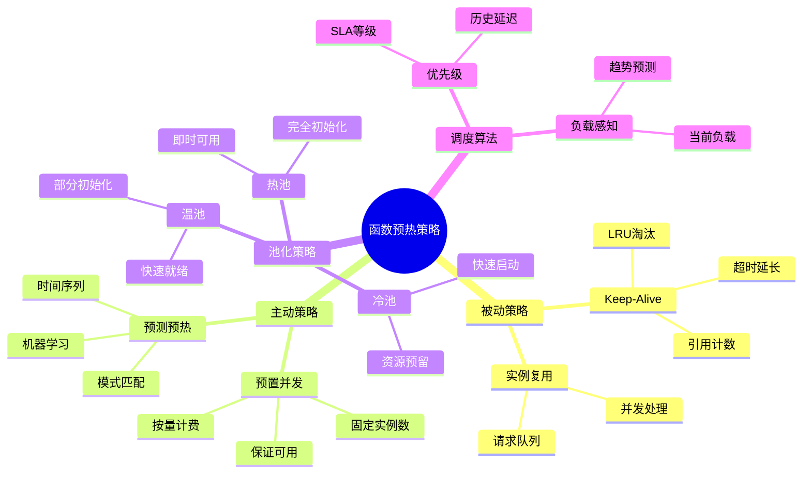
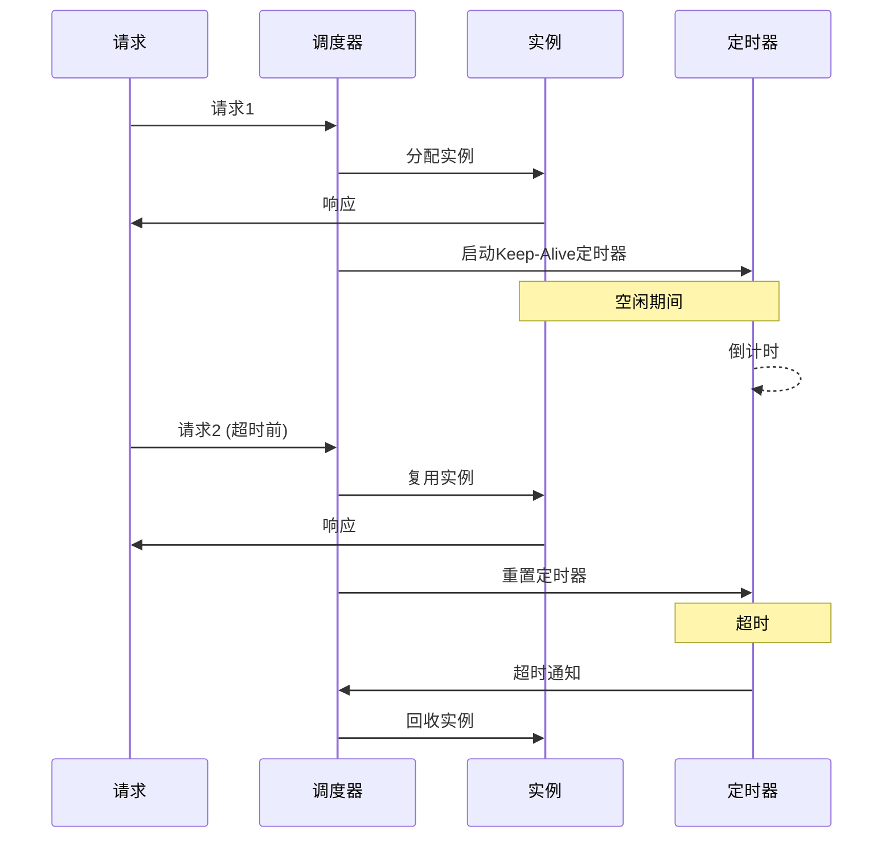
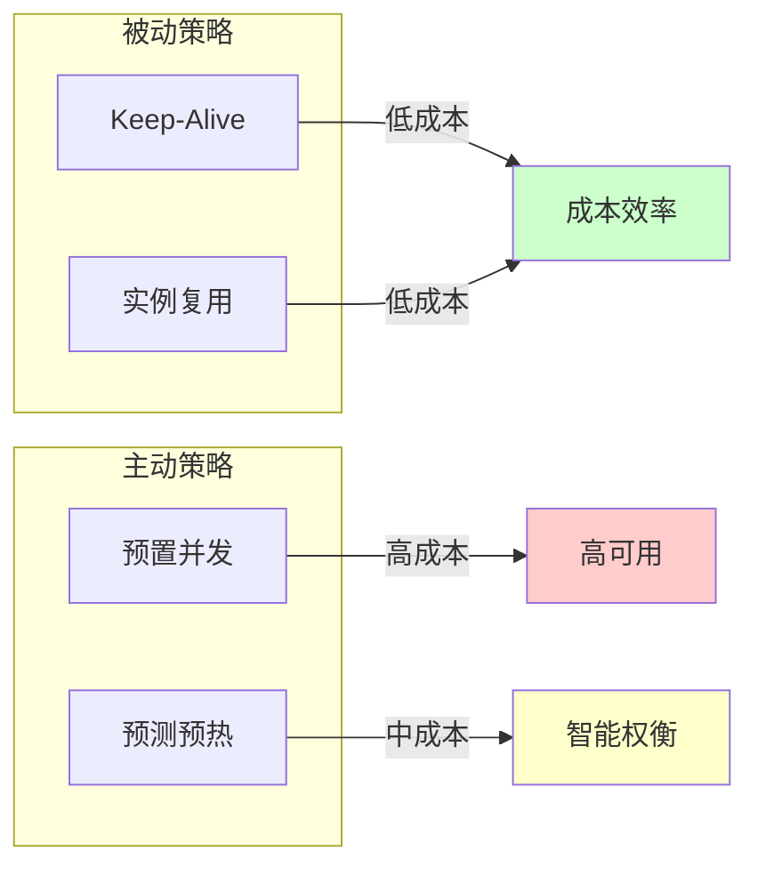
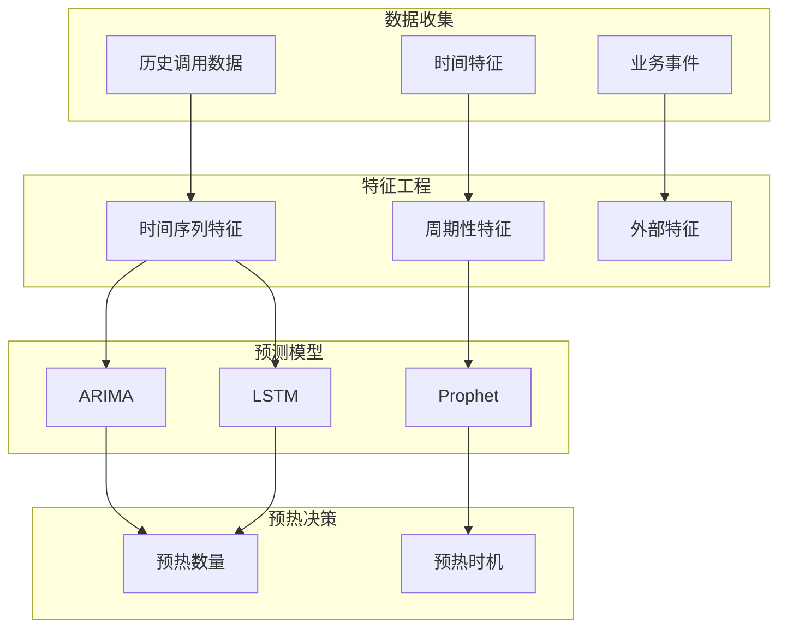
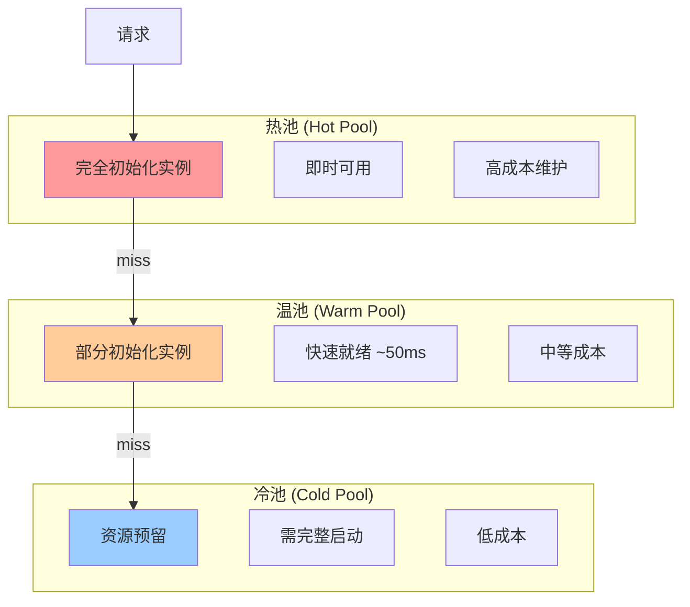

# 26.2 函数预热策略

> **子主题编号**: 26.2
> **主题**: Serverless调度
> **最后更新**: 2025-12-02
> **文档状态**: ✅ 完成

---

## 📋 目录

- [1 概述](#1-概述)
- [2 思维导图](#2-思维导图)
- [3 预热策略分类](#3-预热策略分类)
- [4 预测预热](#4-预测预热)
- [5 实例池管理](#5-实例池管理)
- [6 知识矩阵](#6-知识矩阵)
- [7 形式化模型](#7-形式化模型)
- [8 跨视角链接](#8-跨视角链接)

---

## 1 概述

### 1.1 核心洞察

函数预热是消除冷启动的主动策略，通过提前准备好可用实例来减少首次调用延迟。预热策略的核心挑战是**预测准确性**与**资源成本**的权衡。

### 1.2 预热策略分类

| 策略类型 | 描述 | 优点 | 缺点 |
|---------|------|------|------|
| **被动保持** | 延长实例存活时间 | 简单 | 资源浪费 |
| **预置并发** | 预先分配固定实例 | 可靠 | 成本高 |
| **预测预热** | 基于预测主动预热 | 高效 | 预测难 |
| **池化预热** | 维护通用实例池 | 灵活 | 初始化开销 |

---

## 2 思维导图



---

## 3 预热策略分类

### 3.1 Keep-Alive策略



```python
class KeepAliveManager:
    """Keep-Alive实例管理器"""

    def __init__(self, default_timeout: float = 300.0):
        self.default_timeout = default_timeout
        self.instances: Dict[str, Instance] = {}
        self.timers: Dict[str, Timer] = {}

    def get_or_create(self, function_id: str) -> Instance:
        """获取或创建实例"""
        if function_id in self.instances:
            # 复用现有实例，重置定时器
            self._reset_timer(function_id)
            return self.instances[function_id]
        else:
            # 创建新实例
            instance = Instance.create(function_id)
            self.instances[function_id] = instance
            self._start_timer(function_id)
            return instance

    def _start_timer(self, function_id: str):
        """启动Keep-Alive定时器"""
        timeout = self._get_timeout(function_id)
        timer = Timer(timeout, lambda: self._on_timeout(function_id))
        timer.start()
        self.timers[function_id] = timer

    def _reset_timer(self, function_id: str):
        """重置定时器"""
        if function_id in self.timers:
            self.timers[function_id].cancel()
        self._start_timer(function_id)

    def _on_timeout(self, function_id: str):
        """超时回调"""
        if function_id in self.instances:
            self.instances[function_id].terminate()
            del self.instances[function_id]
            del self.timers[function_id]

    def _get_timeout(self, function_id: str) -> float:
        """获取自适应超时时间"""
        # 可基于历史调用模式动态调整
        return self.default_timeout
```

### 3.2 预置并发 (Provisioned Concurrency)

```yaml
# AWS Lambda预置并发配置
AWSTemplateFormatVersion: '2010-09-09'
Resources:
  MyFunction:
    Type: AWS::Lambda::Function
    Properties:
      FunctionName: critical-function
      Runtime: nodejs18.x
      Handler: index.handler

  ProvisionedConcurrency:
    Type: AWS::Lambda::ProvisionedConcurrencyConfig
    Properties:
      FunctionName: !Ref MyFunction
      Qualifier: prod
      ProvisionedConcurrentExecutions: 10  # 预置10个实例

# 效果:
# - 10个实例始终保持热状态
# - 无冷启动延迟
# - 按预置时间计费
```

### 3.3 策略对比



---

## 4 预测预热

### 4.1 预测模型



### 4.2 预测预热算法

```python
import numpy as np
from sklearn.ensemble import RandomForestRegressor

class PredictiveWarmer:
    """预测预热调度器"""

    def __init__(self):
        self.model = RandomForestRegressor()
        self.history: Dict[str, List[CallRecord]] = defaultdict(list)

    def record_call(self, function_id: str, timestamp: datetime):
        """记录调用"""
        self.history[function_id].append(CallRecord(timestamp))

    def predict_load(self, function_id: str, future_window: timedelta) -> int:
        """预测未来负载"""
        features = self._extract_features(function_id, future_window)
        predicted_calls = self.model.predict([features])[0]
        return int(np.ceil(predicted_calls))

    def _extract_features(self, function_id: str, window: timedelta) -> List[float]:
        """提取预测特征"""
        now = datetime.now()
        history = self.history[function_id]

        features = [
            # 时间特征
            now.hour,
            now.weekday(),
            now.day,
            # 历史特征
            self._calls_in_window(history, timedelta(hours=1)),
            self._calls_in_window(history, timedelta(days=1)),
            self._calls_in_window(history, timedelta(weeks=1)),
            # 趋势特征
            self._trend(history),
        ]
        return features

    def schedule_warmup(self, function_id: str):
        """调度预热"""
        predicted_load = self.predict_load(function_id, timedelta(minutes=5))
        current_instances = self.get_warm_instances(function_id)

        if predicted_load > current_instances:
            # 需要预热更多实例
            warmup_count = predicted_load - current_instances
            self._warmup_instances(function_id, warmup_count)

    def _warmup_instances(self, function_id: str, count: int):
        """执行预热"""
        for _ in range(count):
            instance = Instance.create(function_id)
            instance.initialize()  # 预初始化
            self.warm_pool.add(function_id, instance)
```

### 4.3 时间序列预测

```python
# 基于Prophet的周期性预测
from prophet import Prophet

class TimeSeriesPredictor:
    """时间序列预测器"""

    def __init__(self):
        self.models: Dict[str, Prophet] = {}

    def train(self, function_id: str, history: pd.DataFrame):
        """训练预测模型"""
        model = Prophet(
            yearly_seasonality=True,
            weekly_seasonality=True,
            daily_seasonality=True,
        )
        model.fit(history)
        self.models[function_id] = model

    def predict(self, function_id: str, periods: int) -> pd.DataFrame:
        """预测未来负载"""
        model = self.models[function_id]
        future = model.make_future_dataframe(periods=periods, freq='5min')
        forecast = model.predict(future)
        return forecast[['ds', 'yhat', 'yhat_lower', 'yhat_upper']]

    def get_warmup_schedule(self, function_id: str) -> List[WarmupAction]:
        """生成预热调度计划"""
        forecast = self.predict(function_id, periods=12)  # 未来1小时

        schedule = []
        for _, row in forecast.iterrows():
            if row['yhat'] > self.current_capacity(function_id):
                schedule.append(WarmupAction(
                    time=row['ds'] - timedelta(minutes=5),  # 提前5分钟
                    target_instances=int(np.ceil(row['yhat_upper'])),
                ))

        return schedule
```

---

## 5 实例池管理

### 5.1 多级实例池



### 5.2 池化管理算法

```python
class InstancePoolManager:
    """多级实例池管理器"""

    def __init__(self):
        self.hot_pool: Dict[str, List[Instance]] = defaultdict(list)
        self.warm_pool: Dict[str, List[Instance]] = defaultdict(list)
        self.cold_pool: Dict[str, List[Instance]] = defaultdict(list)

        # 池大小配置
        self.config = PoolConfig(
            hot_pool_size=5,
            warm_pool_size=20,
            cold_pool_size=100,
        )

    def get_instance(self, function_id: str) -> Instance:
        """获取实例（按优先级）"""
        # 1. 尝试热池
        if self.hot_pool[function_id]:
            return self.hot_pool[function_id].pop()

        # 2. 尝试温池
        if self.warm_pool[function_id]:
            instance = self.warm_pool[function_id].pop()
            instance.complete_init()  # 完成初始化
            return instance

        # 3. 尝试冷池
        if self.cold_pool[function_id]:
            instance = self.cold_pool[function_id].pop()
            instance.full_init()  # 完整初始化
            return instance

        # 4. 创建新实例
        return Instance.create(function_id)

    def return_instance(self, function_id: str, instance: Instance):
        """归还实例到池"""
        if len(self.hot_pool[function_id]) < self.config.hot_pool_size:
            self.hot_pool[function_id].append(instance)
        else:
            instance.partial_cleanup()  # 部分清理
            if len(self.warm_pool[function_id]) < self.config.warm_pool_size:
                self.warm_pool[function_id].append(instance)
            else:
                instance.terminate()  # 释放

    def maintain_pools(self):
        """池维护任务"""
        for function_id in self.get_active_functions():
            # 预测负载
            predicted_load = self.predictor.predict(function_id)

            # 调整池大小
            self._adjust_pool_size(function_id, predicted_load)

    def _adjust_pool_size(self, function_id: str, target: int):
        """调整池大小"""
        current = len(self.hot_pool[function_id])

        if target > current:
            # 从温池提升到热池
            to_promote = min(target - current, len(self.warm_pool[function_id]))
            for _ in range(to_promote):
                instance = self.warm_pool[function_id].pop()
                instance.complete_init()
                self.hot_pool[function_id].append(instance)
```

---

## 6 知识矩阵

### 6.1 预热策略对比矩阵

| 策略 | 延迟消除 | 成本 | 准确性 | 复杂度 | 适用场景 |
|------|---------|------|-------|-------|---------|
| **Keep-Alive** | 部分 | 低 | - | 低 | 频繁调用 |
| **预置并发** | 完全 | 高 | 100% | 低 | 关键业务 |
| **预测预热** | 大部分 | 中 | 70-90% | 高 | 有规律负载 |
| **池化预热** | 大部分 | 中 | - | 中 | 通用 |

### 6.2 预测模型对比

| 模型 | 准确率 | 训练成本 | 实时性 | 适用场景 |
|------|-------|---------|-------|---------|
| **移动平均** | 60% | 极低 | 高 | 简单周期 |
| **ARIMA** | 70% | 低 | 中 | 平稳序列 |
| **Prophet** | 80% | 中 | 中 | 多周期 |
| **LSTM** | 85% | 高 | 低 | 复杂模式 |

---

## 7 形式化模型

### 7.1 预热决策模型

```text
预热决策问题:

给定:
  λ(t): 时刻t的预测请求率
  C_warm: 单实例预热成本/时间
  C_cold: 冷启动惩罚成本
  C_idle: 空闲实例成本/时间

决策变量:
  N(t): 时刻t的预热实例数

目标:
  minimize ∫[C_idle × max(0, N(t) - λ(t)) + C_cold × max(0, λ(t) - N(t))] dt

约束:
  N(t) ≥ N_min  (最小实例)
  N(t) ≤ N_max  (最大实例)
  |N(t+1) - N(t)| ≤ R_scale  (伸缩速率限制)
```

### 7.2 最优预热数量

```text
定理: 最优预热实例数

在平稳负载假设下:
  N* = λ + z_{1-α} × σ

其中:
  λ = 平均请求率
  σ = 请求率标准差
  z_{1-α} = 正态分布分位数 (SLA对应)

证明:
  设冷启动概率 P_cold = P(Requests > N)
  对于正态分布: P_cold = 1 - Φ((N - λ)/σ)

  要满足 P_cold ≤ α:
  1 - Φ((N - λ)/σ) ≤ α
  (N - λ)/σ ≥ z_{1-α}
  N ≥ λ + z_{1-α} × σ
```

---

## 8 跨视角链接

### 8.1 调度视角关联

- [冷启动优化](./26.1_冷启动优化调度.md) - 冷启动技术
- [资源弹性调度](./26.3_资源弹性调度.md) - 自动伸缩
- [AI驱动调度](../10_AI驱动调度/) - 预测模型

### 8.2 形式语言视角关联

| 形式语言概念 | 预热策略对应 | 映射说明 |
|------------|------------|---------|
| **记忆化** | 实例缓存 | 计算结果复用 |
| **投机执行** | 预测预热 | 提前计算 |
| **惰性求值** | 按需初始化 | 延迟到需要时 |

---

**返回**: [Serverless调度主索引](./README.md) | [调度视角主索引](../README.md)
