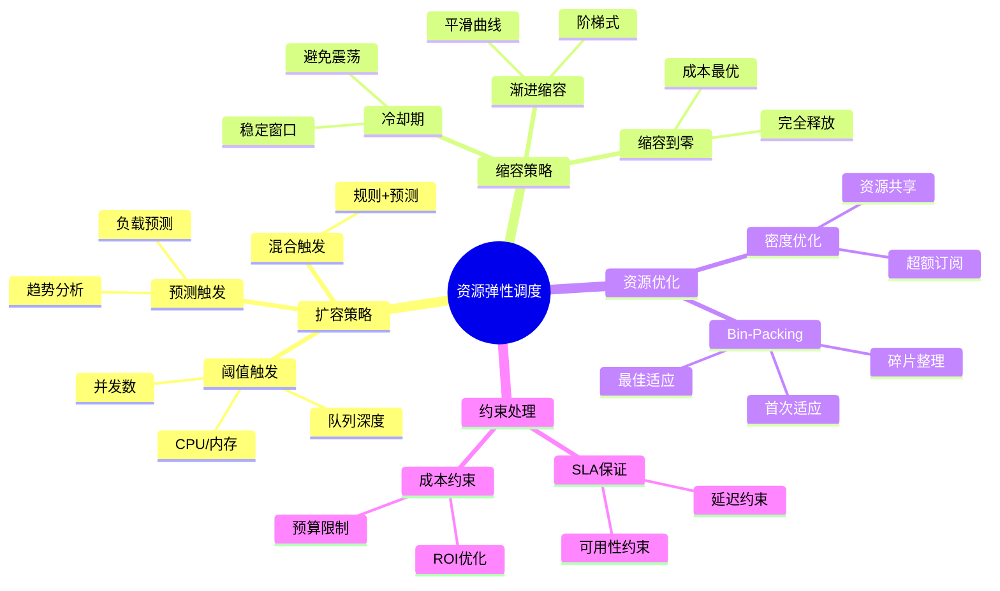
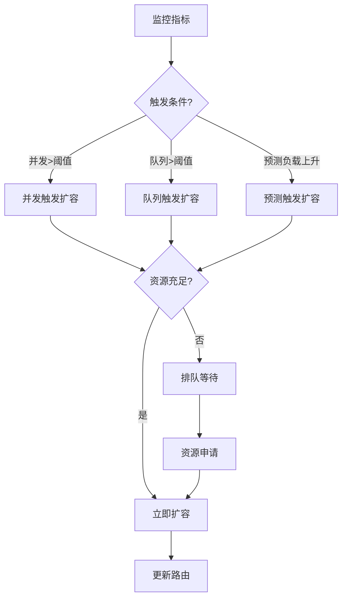
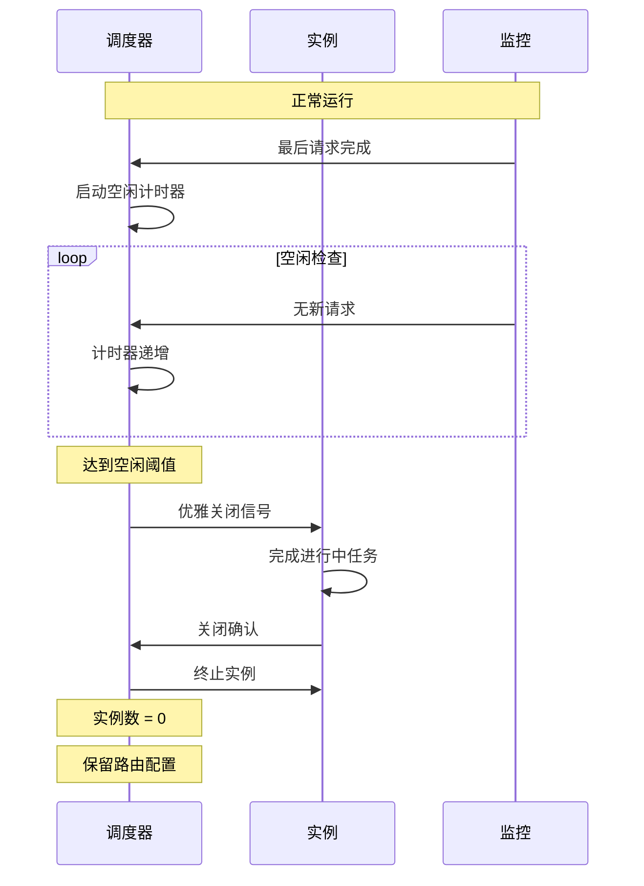
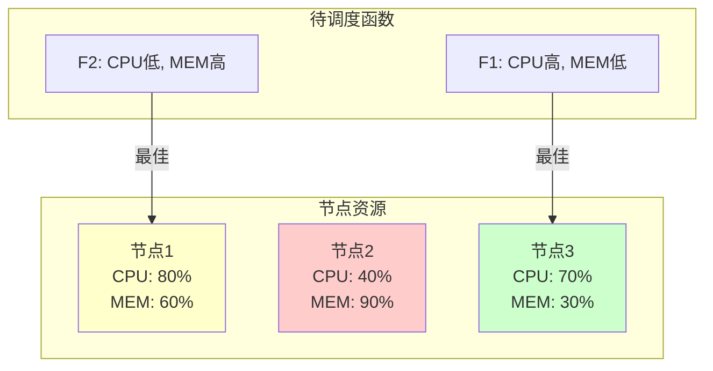

# 26.3 资源弹性调度

> **子主题编号**: 26.3
> **主题**: Serverless调度
> **最后更新**: 2025-12-02
> **文档状态**: ✅ 完成

---

## 📋 目录

- [1 概述](#1-概述)
- [2 思维导图](#2-思维导图)
- [3 自动伸缩策略](#3-自动伸缩策略)
- [4 Bin-Packing优化](#4-bin-packing优化)
- [5 知识矩阵](#5-知识矩阵)
- [6 形式化模型](#6-形式化模型)
- [7 跨视角链接](#7-跨视角链接)

---

## 1 概述

### 1.1 核心洞察

Serverless资源弹性调度需要在**响应速度**、**资源效率**和**成本**之间取得平衡。与传统auto-scaling不同，Serverless需要更细粒度、更快速的伸缩能力。

### 1.2 弹性调度特点

| 特点 | 传统Auto-Scaling | Serverless弹性 |
|------|-----------------|---------------|
| **伸缩粒度** | 实例级 | 函数级 |
| **响应时间** | 分钟级 | 秒/毫秒级 |
| **缩容到零** | 不支持 | 原生支持 |
| **计费模式** | 按实例 | 按调用 |

---

## 2 思维导图



---

## 3 自动伸缩策略

### 3.1 扩容策略



### 3.2 扩容算法

```python
class ElasticScaler:
    """弹性伸缩调度器"""

    def __init__(self, config: ScalingConfig):
        self.config = config
        self.metrics_collector = MetricsCollector()
        self.predictor = LoadPredictor()

    def evaluate_scaling(self, function_id: str) -> ScalingDecision:
        """评估伸缩决策"""
        metrics = self.metrics_collector.get_metrics(function_id)
        current_instances = self.get_instance_count(function_id)

        # 1. 基于当前负载
        load_based = self._load_based_decision(metrics, current_instances)

        # 2. 基于预测
        prediction_based = self._prediction_based_decision(function_id)

        # 3. 综合决策
        return self._combine_decisions(load_based, prediction_based)

    def _load_based_decision(self, metrics: Metrics, current: int) -> int:
        """基于负载的决策"""
        # 并发率
        concurrency_ratio = metrics.active_requests / (current * self.config.target_concurrency)

        if concurrency_ratio > self.config.scale_up_threshold:
            # 扩容
            target = int(current * concurrency_ratio / self.config.target_utilization)
            return min(target, self.config.max_instances)
        elif concurrency_ratio < self.config.scale_down_threshold:
            # 缩容
            target = max(int(current * concurrency_ratio), self.config.min_instances)
            return target
        else:
            return current

    def _prediction_based_decision(self, function_id: str) -> int:
        """基于预测的决策"""
        predicted_load = self.predictor.predict(function_id, lookahead=timedelta(minutes=5))
        return int(np.ceil(predicted_load / self.config.target_concurrency))

    def _combine_decisions(self, load_based: int, prediction_based: int) -> ScalingDecision:
        """综合决策"""
        # 取两者中更保守的值
        target = max(load_based, prediction_based)

        return ScalingDecision(
            target_instances=target,
            confidence=0.8,
            reason=f"load={load_based}, predicted={prediction_based}",
        )
```

### 3.3 缩容策略

```python
class ScaleDownPolicy:
    """缩容策略"""

    def __init__(self, config: ScaleDownConfig):
        self.config = config
        self.cooldown_tracker = CooldownTracker()

    def can_scale_down(self, function_id: str) -> bool:
        """检查是否可以缩容"""
        # 检查冷却期
        if self.cooldown_tracker.in_cooldown(function_id):
            return False

        # 检查稳定窗口
        metrics_history = self.get_metrics_window(function_id, self.config.stability_window)
        if not self._is_stable(metrics_history):
            return False

        return True

    def calculate_scale_down(self, function_id: str, current: int) -> int:
        """计算缩容目标"""
        metrics = self.get_current_metrics(function_id)

        # 渐进缩容（避免震荡）
        target = max(
            self.config.min_instances,
            int(current * (1 - self.config.scale_down_rate)),
            int(metrics.active_requests / self.config.target_concurrency),
        )

        return target

    def _is_stable(self, metrics_history: List[Metrics]) -> bool:
        """检查负载是否稳定"""
        if len(metrics_history) < 3:
            return False

        values = [m.active_requests for m in metrics_history]
        variance = np.var(values)
        mean = np.mean(values)

        # 变异系数小于阈值
        cv = np.sqrt(variance) / mean if mean > 0 else 0
        return cv < self.config.stability_threshold
```

### 3.4 缩容到零



---

## 4 Bin-Packing优化

### 4.1 问题定义

```text
Serverless Bin-Packing问题:

给定:
  - N个函数实例，每个需要资源 (cpu_i, mem_i)
  - M个节点，每个容量 (CPU_j, MEM_j)

目标:
  minimize 使用的节点数

约束:
  Σ cpu_i ≤ CPU_j  (每个节点)
  Σ mem_i ≤ MEM_j  (每个节点)
  每个实例分配到恰好一个节点
```

### 4.2 Bin-Packing算法

```python
class BinPackingScheduler:
    """Bin-Packing调度器"""

    def __init__(self, nodes: List[Node]):
        self.nodes = nodes

    def schedule(self, instances: List[FunctionInstance]) -> Dict[str, str]:
        """调度实例到节点"""
        # 按资源需求降序排序（First Fit Decreasing）
        sorted_instances = sorted(
            instances,
            key=lambda i: (i.cpu_request + i.memory_request),
            reverse=True,
        )

        assignments = {}

        for instance in sorted_instances:
            node = self._find_best_fit(instance)
            if node:
                node.allocate(instance)
                assignments[instance.id] = node.id
            else:
                # 无法调度，需要新节点
                new_node = self._request_new_node()
                new_node.allocate(instance)
                assignments[instance.id] = new_node.id

        return assignments

    def _find_best_fit(self, instance: FunctionInstance) -> Optional[Node]:
        """Best Fit算法"""
        best_node = None
        best_remaining = float('inf')

        for node in self.nodes:
            if node.can_fit(instance):
                remaining = node.remaining_capacity()
                if remaining < best_remaining:
                    best_remaining = remaining
                    best_node = node

        return best_node

    def defragment(self):
        """碎片整理"""
        # 收集所有实例
        all_instances = []
        for node in self.nodes:
            all_instances.extend(node.instances)
            node.clear()

        # 重新调度
        self.schedule(all_instances)

        # 释放空节点
        empty_nodes = [n for n in self.nodes if n.is_empty()]
        for node in empty_nodes:
            node.release()
```

### 4.3 多维资源打包



---

## 5 知识矩阵

### 5.1 伸缩策略对比

| 策略 | 响应速度 | 准确性 | 成本 | 复杂度 |
|------|---------|-------|------|-------|
| **阈值触发** | 快 | 中 | 中 | 低 |
| **预测触发** | 中 | 高 | 低 | 高 |
| **混合触发** | 快 | 高 | 中 | 高 |
| **事件触发** | 极快 | - | 低 | 中 |

### 5.2 Bin-Packing算法对比

| 算法 | 装箱效率 | 时间复杂度 | 适用场景 |
|------|---------|-----------|---------|
| **First Fit** | 中 | O(n) | 在线调度 |
| **Best Fit** | 高 | O(n log n) | 批量调度 |
| **First Fit Decreasing** | 高 | O(n log n) | 离线优化 |

---

## 6 形式化模型

### 6.1 伸缩决策模型

```text
伸缩决策优化:

状态: S = (N, λ, Q)
  N: 当前实例数
  λ: 当前请求率
  Q: 队列深度

动作: A = {扩容k, 缩容k, 保持}

奖励函数:
  R(s, a) = -C_instance × N - C_cold × P_cold(N, λ) - C_queue × Q

转移: P(s'|s, a)
  取决于负载变化模型

最优策略:
  π* = argmax_π E[Σ γ^t R(s_t, a_t)]
```

### 6.2 资源利用率证明

```text
定理: Best Fit Decreasing达到最优利用率的11/9近似

对于Bin-Packing问题:
  OPT ≤ BFD ≤ (11/9)OPT + 6/9

证明思路:
1. 物品按大小降序排列
2. 大物品优先填充
3. 小物品填补空隙
4. 浪费空间有界
```

---

## 7 跨视角链接

### 7.1 调度视角关联

- [分布式调度](../06_调度模型/06.4_分布式系统调度.md) - 集群调度
- [K8s调度](../05_虚拟化容器化沙盒化/05.2_容器化技术.md) - 容器调度

### 7.2 形式语言视角关联

| 形式语言概念 | 弹性调度对应 | 映射说明 |
|------------|------------|---------|
| **类型推断** | 资源估算 | 自动推断需求 |
| **垃圾回收** | 实例回收 | 自动释放资源 |

---

**返回**: [Serverless调度主索引](./README.md) | [调度视角主索引](../README.md)
