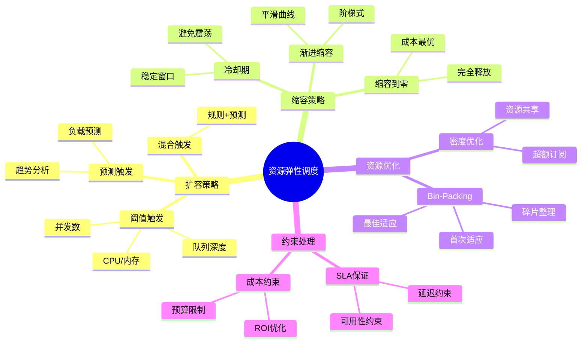
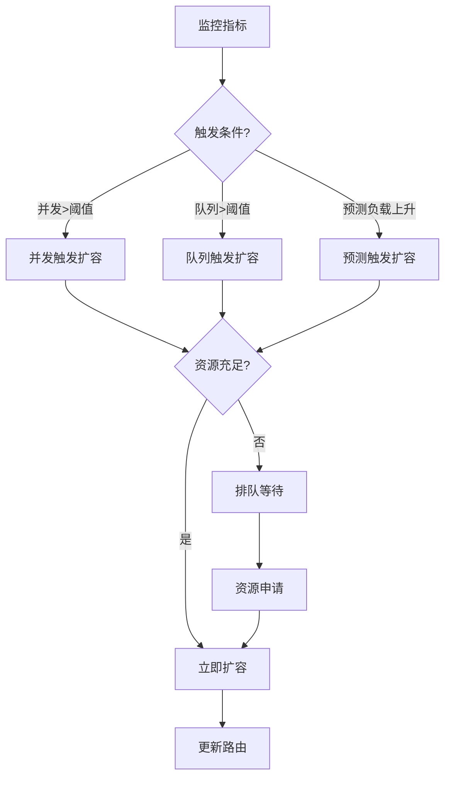
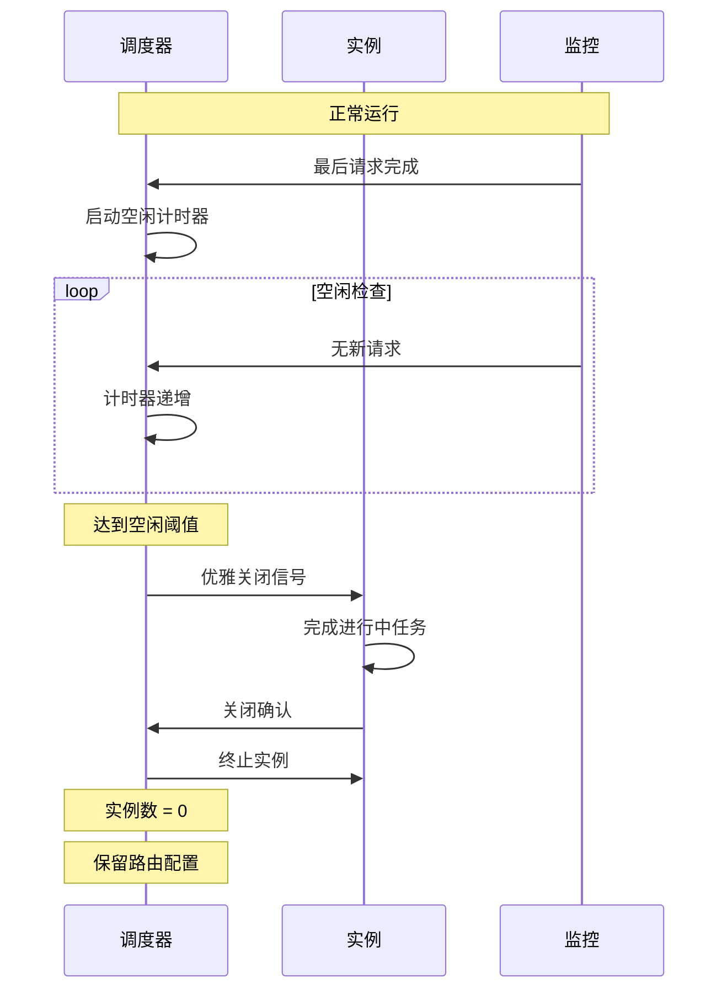
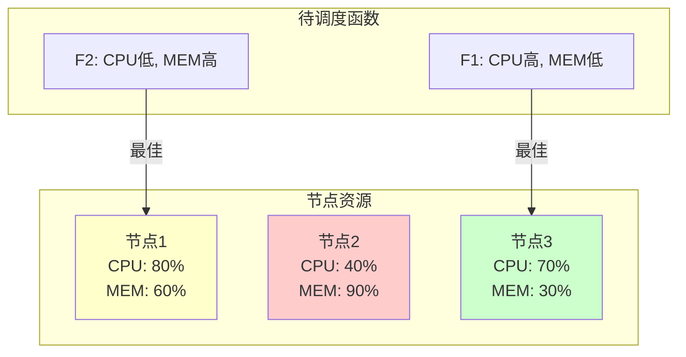

# 26.3 资源弹性调度

> **子主题编号**: 26.3
> **主题**: Serverless调度
> **最后更新**: 2025-12-02
> **文档状态**: ✅ 完成

---

## 📋 目录

- [26.3 资源弹性调度](#263-资源弹性调度)
  - [📋 目录](#-目录)
  - [1 概述](#1-概述)
    - [1.1 核心洞察](#11-核心洞察)
    - [1.2 弹性调度特点](#12-弹性调度特点)
  - [2 思维导图](#2-思维导图)
  - [3 自动伸缩策略](#3-自动伸缩策略)
    - [3.1 扩容策略](#31-扩容策略)
    - [3.2 扩容算法](#32-扩容算法)
    - [3.3 缩容策略](#33-缩容策略)
    - [3.4 缩容到零](#34-缩容到零)
  - [4 Knative/Kubernetes FaaS 弹性调度](#4-knativekubernetes-faas-弹性调度)
    - [4.1 KEDA Autoscaler 架构](#41-keda-autoscaler-架构)
      - [4.1.1 KEDA ScaledObject 配置示例](#411-keda-scaledobject-配置示例)
      - [4.1.2 KEDA 伸缩算法](#412-keda-伸缩算法)
    - [4.2 Knative Serving Scale-from-Zero](#42-knative-serving-scale-from-zero)
      - [4.2.1 Scale-from-Zero 执行流程](#421-scale-from-zero-执行流程)
      - [4.2.2 KPA Panic Mode 算法](#422-kpa-panic-mode-算法)
    - [4.3 KEDA vs KPA 对比](#43-keda-vs-kpa-对比)
  - [4 Bin-Packing优化](#4-bin-packing优化)
    - [4.1 问题定义](#41-问题定义)
    - [4.2 Bin-Packing算法](#42-bin-packing算法)
    - [4.3 多维资源打包](#43-多维资源打包)
  - [5 知识矩阵](#5-知识矩阵)
    - [5.1 伸缩策略对比](#51-伸缩策略对比)
    - [5.2 Bin-Packing算法对比](#52-bin-packing算法对比)
  - [6 形式化模型](#6-形式化模型)
    - [6.1 伸缩决策模型](#61-伸缩决策模型)
    - [6.2 资源利用率证明](#62-资源利用率证明)
  - [7 跨视角链接](#7-跨视角链接)
    - [7.1 调度视角关联](#71-调度视角关联)
    - [7.2 形式语言视角关联](#72-形式语言视角关联)

---

## 1 概述

### 1.1 核心洞察

Serverless资源弹性调度需要在**响应速度**、**资源效率**和**成本**之间取得平衡。与传统auto-scaling不同，Serverless需要更细粒度、更快速的伸缩能力。

### 1.2 弹性调度特点

| 特点 | 传统Auto-Scaling | Serverless弹性 |
|------|-----------------|---------------|
| **伸缩粒度** | 实例级 | 函数级 |
| **响应时间** | 分钟级 | 秒/毫秒级 |
| **缩容到零** | 不支持 | 原生支持 |
| **计费模式** | 按实例 | 按调用 |

---

## 2 思维导图


```mermaid
mindmap
  root((资源弹性调度))
    扩容策略
      阈值触发
        CPU/内存
        并发数
        队列深度
      预测触发
        负载预测
        趋势分析
      混合触发
        规则+预测
    缩容策略
      冷却期
        避免震荡
        稳定窗口
      渐进缩容
        阶梯式
        平滑曲线
      缩容到零
        完全释放
        成本最优
    资源优化
      Bin-Packing
        首次适应
        最佳适应
        碎片整理
      密度优化
        超额订阅
        资源共享
    约束处理
      SLA保证
        延迟约束
        可用性约束
      成本约束
        预算限制
        ROI优化
```

---

## 3 自动伸缩策略

### 3.1 扩容策略


```mermaid
graph TD
    M[监控指标] --> A{触发条件?}

    A -->|并发>阈值| B[并发触发扩容]
    A -->|队列>阈值| C[队列触发扩容]
    A -->|预测负载上升| D[预测触发扩容]

    B --> E{资源充足?}
    C --> E
    D --> E

    E -->|是| F[立即扩容]
    E -->|否| G[排队等待]

    F --> H[更新路由]
    G --> I[资源申请]
    I --> F
```

### 3.2 扩容算法

```python
class ElasticScaler:
    """弹性伸缩调度器"""

    def __init__(self, config: ScalingConfig):
        self.config = config
        self.metrics_collector = MetricsCollector()
        self.predictor = LoadPredictor()

    def evaluate_scaling(self, function_id: str) -> ScalingDecision:
        """评估伸缩决策"""
        metrics = self.metrics_collector.get_metrics(function_id)
        current_instances = self.get_instance_count(function_id)

        # 1. 基于当前负载
        load_based = self._load_based_decision(metrics, current_instances)

        # 2. 基于预测
        prediction_based = self._prediction_based_decision(function_id)

        # 3. 综合决策
        return self._combine_decisions(load_based, prediction_based)

    def _load_based_decision(self, metrics: Metrics, current: int) -> int:
        """基于负载的决策"""
        # 并发率
        concurrency_ratio = metrics.active_requests / (current * self.config.target_concurrency)

        if concurrency_ratio > self.config.scale_up_threshold:
            # 扩容
            target = int(current * concurrency_ratio / self.config.target_utilization)
            return min(target, self.config.max_instances)
        elif concurrency_ratio < self.config.scale_down_threshold:
            # 缩容
            target = max(int(current * concurrency_ratio), self.config.min_instances)
            return target
        else:
            return current

    def _prediction_based_decision(self, function_id: str) -> int:
        """基于预测的决策"""
        predicted_load = self.predictor.predict(function_id, lookahead=timedelta(minutes=5))
        return int(np.ceil(predicted_load / self.config.target_concurrency))

    def _combine_decisions(self, load_based: int, prediction_based: int) -> ScalingDecision:
        """综合决策"""
        # 取两者中更保守的值
        target = max(load_based, prediction_based)

        return ScalingDecision(
            target_instances=target,
            confidence=0.8,
            reason=f"load={load_based}, predicted={prediction_based}",
        )
```

### 3.3 缩容策略

```python
class ScaleDownPolicy:
    """缩容策略"""

    def __init__(self, config: ScaleDownConfig):
        self.config = config
        self.cooldown_tracker = CooldownTracker()

    def can_scale_down(self, function_id: str) -> bool:
        """检查是否可以缩容"""
        # 检查冷却期
        if self.cooldown_tracker.in_cooldown(function_id):
            return False

        # 检查稳定窗口
        metrics_history = self.get_metrics_window(function_id, self.config.stability_window)
        if not self._is_stable(metrics_history):
            return False

        return True

    def calculate_scale_down(self, function_id: str, current: int) -> int:
        """计算缩容目标"""
        metrics = self.get_current_metrics(function_id)

        # 渐进缩容（避免震荡）
        target = max(
            self.config.min_instances,
            int(current * (1 - self.config.scale_down_rate)),
            int(metrics.active_requests / self.config.target_concurrency),
        )

        return target

    def _is_stable(self, metrics_history: List[Metrics]) -> bool:
        """检查负载是否稳定"""
        if len(metrics_history) < 3:
            return False

        values = [m.active_requests for m in metrics_history]
        variance = np.var(values)
        mean = np.mean(values)

        # 变异系数小于阈值
        cv = np.sqrt(variance) / mean if mean > 0 else 0
        return cv < self.config.stability_threshold
```

### 3.4 缩容到零


```mermaid
sequenceDiagram
    participant S as 调度器
    participant I as 实例
    participant M as 监控

    Note over S,M: 正常运行

    M->>S: 最后请求完成
    S->>S: 启动空闲计时器

    loop 空闲检查
        M->>S: 无新请求
        S->>S: 计时器递增
    end

    Note over S: 达到空闲阈值

    S->>I: 优雅关闭信号
    I->>I: 完成进行中任务
    I->>S: 关闭确认
    S->>I: 终止实例

    Note over S: 实例数 = 0
    Note over S: 保留路由配置
```

---

## 4 Knative/Kubernetes FaaS 弹性调度

### 4.1 KEDA Autoscaler 架构

KEDA（Kubernetes Event-driven Autoscaling）是Kubernetes上Serverless函数弹性伸缩的标准方案。

```text
KEDA 控制循环架构:

┌─────────────────────────────────────────┐
│         ScaledObject CRD                │
│    - 定义触发器（Event Source）          │
│    - 目标Deployment/StatefulSet          │
│    - 最小/最大副本数、冷却期             │
├───────────────────────────────────────┬─┤
│         KEDA Operator                 │ │
│    - 监听ScaledObject                  │ │
│    - 管理HPA配置和Metrics Server       │ │
├───────────────────────────────────────┤ │
│         Metrics Adapter                │ │
│    - 连接各类Event Source              │ │
│    - 暴露自定义metrics API             │ │
│    (Kafka lag, SQS depth, etc.)        │ │
├───────────────────────────────────────┤ │
│         HPA Controller                 │ │
│    - 基于KEDA metrics调整副本数        │ │
├───────────────────────────────────────┴─┤
│         Kubernetes Deployment           │
│    - 函数容器Pod                        │
└─────────────────────────────────────────┘
```

#### 4.1.1 KEDA ScaledObject 配置示例

```yaml
# keda-scaledobject.yaml
apiVersion: keda.sh/v1alpha1
kind: ScaledObject
metadata:
  name: queue-consumer-scaler
  namespace: default
spec:
  scaleTargetRef:
    name: queue-consumer-deployment
    kind: Deployment
    apiVersion: apps/v1

  minReplicaCount: 0    # 支持scale-to-zero
  maxReplicaCount: 100
  cooldownPeriod: 300   # 缩容冷却期（秒）
  pollingInterval: 15   # metrics轮询间隔（秒）

  triggers:
    # 触发器1: Kafka consumer lag
    - type: kafka
      metadata:
        bootstrapServers: kafka-cluster:9092
        consumerGroup: my-consumer-group
        topic: orders
        lagThreshold: "100"      # lag > 100时扩容
        activationLagThreshold: "10"  # lag < 10时缩容到0

    # 触发器2: CPU利用率（fallback）
    - type: cpu
      metadata:
        type: Utilization
        value: "70"

  advanced:
    horizontalPodAutoscalerConfig:
      behavior:
        scaleDown:
          stabilizationWindowSeconds: 60
          policies:
            - type: Percent
              value: 50
              periodSeconds: 60
        scaleUp:
          stabilizationWindowSeconds: 0
          policies:
            - type: Percent
              value: 100
              periodSeconds: 15
```

#### 4.1.2 KEDA 伸缩算法

KEDA的核心伸缩逻辑可以形式化为：

```python
def keda_scale_decision(trigger_values, current_replicas, config) -> int:
    """
    KEDA 伸缩决策算法（简化版）
    """
    target_replicas_per_trigger = []

    for trigger in config.triggers:
        metric_value = trigger_values[trigger.type]
        threshold = float(trigger.metadata['lagThreshold'])

        # 计算该触发器建议的副本数
        # 向上取整保证处理能力
        suggested = math.ceil(metric_value / threshold)
        suggested = max(config.minReplicaCount,
                       min(suggested, config.maxReplicaCount))
        target_replicas_per_trigger.append(suggested)

    # 多触发器时取最大值（最保守策略）
    target = max(target_replicas_per_trigger)

    # 应用scale-to-zero规则
    if target == 0:
        # 检查所有触发器是否都处于激活阈值以下
        all_below_activation = all(
            trigger_values[t.type] < float(t.metadata.get('activationLagThreshold', 0))
            for t in config.triggers
        )
        if not all_below_activation:
            target = max(1, config.minReplicaCount)

    return target
```

**KEDA伸缩特点**：

- **事件驱动**：直接基于队列深度、Kafka lag等应用层指标伸缩，而非仅依赖CPU/内存
- **Scale-to-Zero**：当所有触发器值低于 `activationThreshold` 时，副本数可降至0
- **多触发器聚合**：支持 `max`（默认）、`min` 等聚合策略
- **冷却期**：缩容有稳定窗口，避免流量波动导致的Pod频繁创建/销毁

### 4.2 Knative Serving Scale-from-Zero

Knative Serving内置了针对HTTP流量的自动伸缩器（KPA: Knative Pod Autoscaler），专门优化了Serverless函数的scale-from-zero体验。

```text
Knative KPA 数据流:

┌─────────────────────────────────────────┐
│         Activator（零副本时流量入口）    │
│    - 当revision副本数为0时拦截所有请求   │
│    - 缓存请求并向Autoscaler发送扩容信号  │
│    - 新Pod就绪后将缓存请求转发           │
├─────────────────────────────────────────┤
│         Autoscaler (KPA)                │
│    - 基于并发请求数（concurrency）伸缩   │
│    - 支持panic模式（快速扩容）           │
│    - 稳定模式（常规伸缩）                │
├─────────────────────────────────────────┤
│         Queue-Proxy Sidecar             │
│    - 注入到每个函数Pod中                 │
│    - 报告实时并发数给Autoscaler          │
│    - 执行请求排队和超时控制              │
├─────────────────────────────────────────┤
│         User Container（函数容器）       │
└─────────────────────────────────────────┘
```

#### 4.2.1 Scale-from-Zero 执行流程

```python
class KnativeScaleFromZero:
    """
    Knative scale-from-zero 流程概念模型
    """

    def __init__(self):
        self.revision_replicas = {}  # revision -> current_replicas
        self.activator_request_buffer = defaultdict(list)

    def on_http_request(self, revision: str, request: Request):
        current = self.revision_replicas.get(revision, 0)

        if current == 0:
            # 1. Activator拦截请求
            self.activator_request_buffer[revision].append(request)

            # 2. 向Autoscaler发送快速扩容信号
            self.autoscaler.panic_scale(revision, target=1)

            # 3. 等待Pod创建（通常10-30秒）
            pod = self._provision_pod(revision)

            # 4. Pod就绪后转发缓冲的请求
            for buffered_req in self.activator_request_buffer[revision]:
                pod.forward(buffered_req)

            self.activator_request_buffer[revision].clear()
            self.revision_replicas[revision] = 1
        else:
            # 正常路由到现有Pod
            self._route_to_existing_pod(revision, request)

    def _provision_pod(self, revision: str) -> Pod:
        """调用Kubernetes API创建新Pod"""
        # 实际涉及：拉取镜像、启动容器、运行queue-proxy、 readiness probe
        pass
```

#### 4.2.2 KPA Panic Mode 算法

KPA有两种伸缩模式：

1. **Stable Mode（稳定模式）**：基于过去60秒的滑动窗口平均并发
2. **Panic Mode（恐慌模式）**：基于过去6秒的滑动窗口，当并发超过目标值2倍时触发

```python
class KnativePodAutoscaler:
    def __init__(self, target_concurrency=100.0):
        self.target_concurrency = target_concurrency
        self.panic_threshold = 2.0
        self.stable_window = 60  # 秒
        self.panic_window = 6    # 秒
        self.max_scale_up_rate = 1000.0  # 每秒最大扩容倍数

    def scale(self, revision: str, metrics_history: List[Metric]) -> int:
        current_replicas = self.get_current_replicas(revision)

        # 计算稳定窗口平均并发
        stable_metrics = [m for m in metrics_history
                         if m.timestamp >= now() - self.stable_window]
        stable_concurrency = sum(m.concurrency for m in stable_metrics) / len(stable_metrics)

        # 计算恐慌窗口平均并发
        panic_metrics = [m for m in metrics_history
                        if m.timestamp >= now() - self.panic_window]
        panic_concurrency = sum(m.concurrency for m in panic_metrics) / len(panic_metrics)

        # 检查是否进入恐慌模式
        is_panic = panic_concurrency > self.target_concurrency * self.panic_threshold

        if is_panic:
            # 恐慌模式：快速扩容
            desired = math.ceil(panic_concurrency / self.target_concurrency)
            max_allowed = int(current_replicas * self.max_scale_up_rate)
            return min(desired, max_allowed)
        else:
            # 稳定模式：平滑伸缩
            desired = math.ceil(stable_concurrency / self.target_concurrency)
            return desired
```

**Scale-from-Zero 性能数据**：

在标准Knative部署（使用容器运行时）下的实测性能：

| 阶段 | 耗时 | 说明 |
|------|------|------|
| Activator检测 | 1-5 ms | HTTP请求被Activator拦截 |
| Kubernetes调度 | 500-2000 ms | kube-scheduler分配节点 |
| 镜像拉取（缓存命中） | 0 ms | 节点已缓存镜像 |
| 镜像拉取（冷节点） | 3-15 s | 需要从registry拉取 |
| 容器启动 | 200-800 ms | 创建容器、配置网络 |
| Queue-Proxy启动 | 50-100 ms | sidecar就绪 |
| 应用初始化 | 100ms-5s | 取决于函数运行时和依赖 |
| **总计（最佳情况）** | **~1 s** | 镜像缓存、轻量运行时 |
| **总计（典型情况）** | **~5-15 s** | 需拉取镜像、Java运行时 |

**优化scale-from-zero的技术**：

1. **镜像预拉取（Image Cache）**：在节点上预置常用函数镜像
2. **Pool-based Provisioner**：维护少量未绑定的"空"Pod，调用时注入函数代码
3. **CRIU Checkpoint/Restore**：将已初始化的容器状态保存为checkpoint，恢复时间 <100ms
4. **WASM运行时**：使用WasmEdge/Spin替代容器，启动时间降至 **<10ms**

### 4.3 KEDA vs KPA 对比

| 特性 | KEDA | KPA (Knative) |
|------|------|---------------|
| **触发源** | 任意（Kafka, SQS, Redis, Prometheus...） | 仅限HTTP/gRPC并发 |
| **Scale-to-Zero** | ✅ | ✅ |
| **扩容速度** | 中等（依赖HPA轮询周期） | 快（Activator直接触发） |
| **最小副本** | 0 | 0（可配置min-scale≥1避免冷启动） |
| **适用平台** | 任意Kubernetes | Knative Serving |
| **HTTP零副本体验** | 差（无请求缓冲） | 优（Activator缓冲+转发） |
| **事件驱动场景** | 优 | 需额外Eventing组件 |

---

## 4 Bin-Packing优化

### 4.1 问题定义

```text
Serverless Bin-Packing问题:

给定:
  - N个函数实例，每个需要资源 (cpu_i, mem_i)
  - M个节点，每个容量 (CPU_j, MEM_j)

目标:
  minimize 使用的节点数

约束:
  Σ cpu_i ≤ CPU_j  (每个节点)
  Σ mem_i ≤ MEM_j  (每个节点)
  每个实例分配到恰好一个节点
```

### 4.2 Bin-Packing算法

```python
class BinPackingScheduler:
    """Bin-Packing调度器"""

    def __init__(self, nodes: List[Node]):
        self.nodes = nodes

    def schedule(self, instances: List[FunctionInstance]) -> Dict[str, str]:
        """调度实例到节点"""
        # 按资源需求降序排序（First Fit Decreasing）
        sorted_instances = sorted(
            instances,
            key=lambda i: (i.cpu_request + i.memory_request),
            reverse=True,
        )

        assignments = {}

        for instance in sorted_instances:
            node = self._find_best_fit(instance)
            if node:
                node.allocate(instance)
                assignments[instance.id] = node.id
            else:
                # 无法调度，需要新节点
                new_node = self._request_new_node()
                new_node.allocate(instance)
                assignments[instance.id] = new_node.id

        return assignments

    def _find_best_fit(self, instance: FunctionInstance) -> Optional[Node]:
        """Best Fit算法"""
        best_node = None
        best_remaining = float('inf')

        for node in self.nodes:
            if node.can_fit(instance):
                remaining = node.remaining_capacity()
                if remaining < best_remaining:
                    best_remaining = remaining
                    best_node = node

        return best_node

    def defragment(self):
        """碎片整理"""
        # 收集所有实例
        all_instances = []
        for node in self.nodes:
            all_instances.extend(node.instances)
            node.clear()

        # 重新调度
        self.schedule(all_instances)

        # 释放空节点
        empty_nodes = [n for n in self.nodes if n.is_empty()]
        for node in empty_nodes:
            node.release()
```

### 4.3 多维资源打包


```mermaid
graph TB
    subgraph "节点资源"
        N1["节点1<br/>CPU: 80%<br/>MEM: 60%"]
        N2["节点2<br/>CPU: 40%<br/>MEM: 90%"]
        N3["节点3<br/>CPU: 70%<br/>MEM: 30%"]
    end

    subgraph "待调度函数"
        F1["F1: CPU高, MEM低"]
        F2["F2: CPU低, MEM高"]
    end

    F1 -->|最佳| N3
    F2 -->|最佳| N1

    style N1 fill:#ffffcc
    style N2 fill:#ffcccc
    style N3 fill:#ccffcc
```

---

## 5 知识矩阵

### 5.1 伸缩策略对比

| 策略 | 响应速度 | 准确性 | 成本 | 复杂度 |
|------|---------|-------|------|-------|
| **阈值触发** | 快 | 中 | 中 | 低 |
| **预测触发** | 中 | 高 | 低 | 高 |
| **混合触发** | 快 | 高 | 中 | 高 |
| **事件触发** | 极快 | - | 低 | 中 |

### 5.2 Bin-Packing算法对比

| 算法 | 装箱效率 | 时间复杂度 | 适用场景 |
|------|---------|-----------|---------|
| **First Fit** | 中 | O(n) | 在线调度 |
| **Best Fit** | 高 | O(n log n) | 批量调度 |
| **First Fit Decreasing** | 高 | O(n log n) | 离线优化 |

---

## 6 形式化模型

### 6.1 伸缩决策模型

```text
伸缩决策优化:

状态: S = (N, λ, Q)
  N: 当前实例数
  λ: 当前请求率
  Q: 队列深度

动作: A = {扩容k, 缩容k, 保持}

奖励函数:
  R(s, a) = -C_instance × N - C_cold × P_cold(N, λ) - C_queue × Q

转移: P(s'|s, a)
  取决于负载变化模型

最优策略:
  π* = argmax_π E[Σ γ^t R(s_t, a_t)]
```

### 6.2 资源利用率证明

```text
定理: Best Fit Decreasing达到最优利用率的11/9近似

对于Bin-Packing问题:
  OPT ≤ BFD ≤ (11/9)OPT + 6/9

证明思路:
1. 物品按大小降序排列
2. 大物品优先填充
3. 小物品填补空隙
4. 浪费空间有界
```

---

## 7 跨视角链接

### 7.1 调度视角关联

- [分布式调度](../06_调度模型/06.4_分布式系统调度.md) - 集群调度
- [K8s调度](../05_虚拟化容器化沙盒化/05.2_容器化技术.md) - 容器调度

### 7.2 形式语言视角关联

| 形式语言概念 | 弹性调度对应 | 映射说明 |
|------------|------------|---------|
| **类型推断** | 资源估算 | 自动推断需求 |
| **垃圾回收** | 实例回收 | 自动释放资源 |

---

**返回**: [Serverless调度主索引](./README.md) | [调度视角主索引](../README.md)
