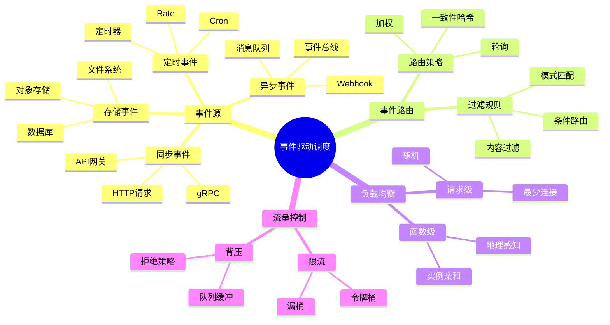
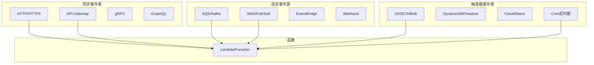
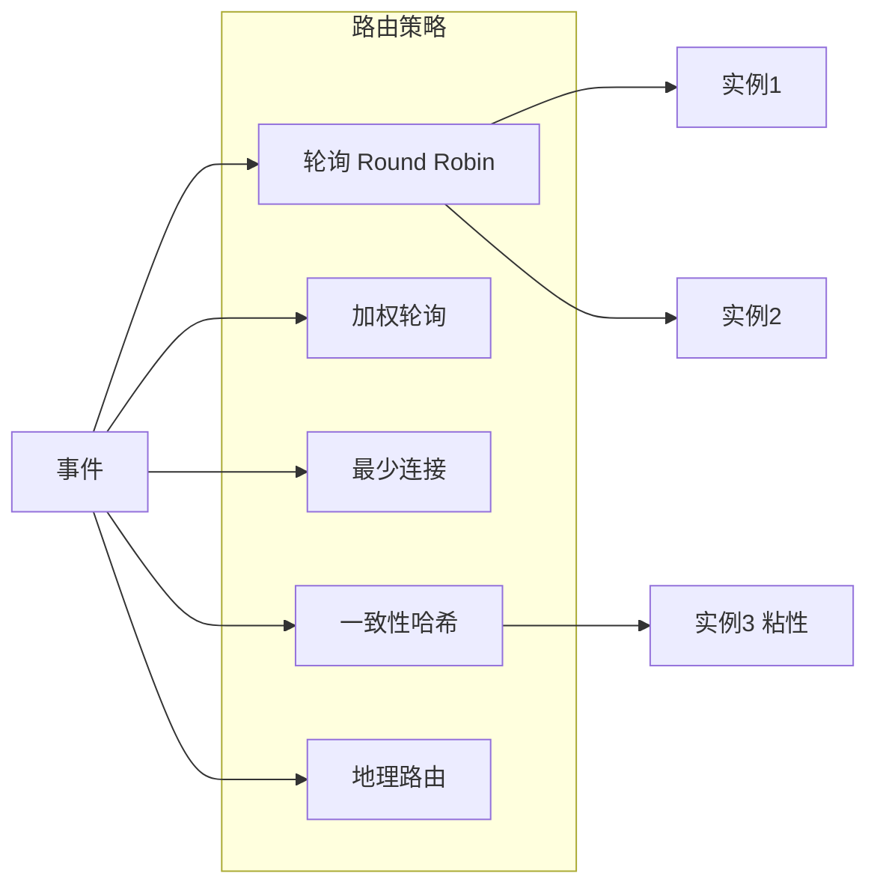
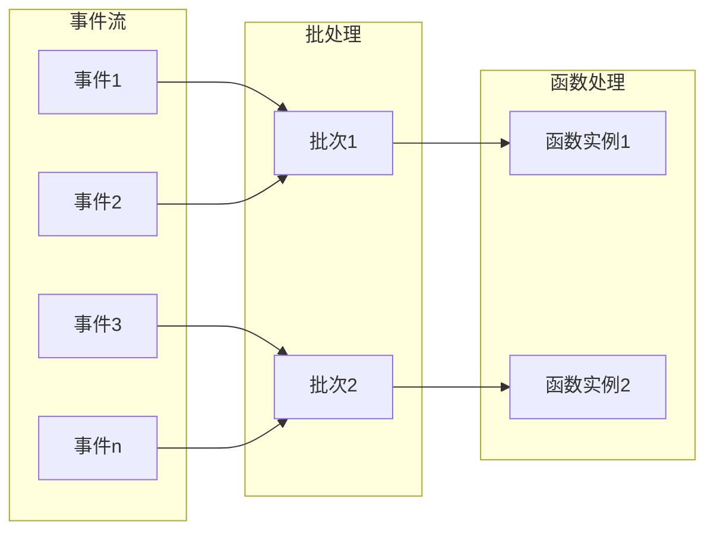

# 26.4 事件驱动调度

> **子主题编号**: 26.4
> **主题**: Serverless调度
> **最后更新**: 2025-12-02
> **文档状态**: ✅ 完成

---

## 📋 目录

- [1 概述](#1-概述)
- [2 思维导图](#2-思维导图)
- [3 事件源类型](#3-事件源类型)
- [4 事件路由调度](#4-事件路由调度)
- [5 流处理调度](#5-流处理调度)
- [6 知识矩阵](#6-知识矩阵)
- [7 形式化模型](#7-形式化模型)
- [8 跨视角链接](#8-跨视角链接)

---

## 1 概述

### 1.1 核心洞察

事件驱动是Serverless的核心执行模型。函数不主动运行，而是响应事件触发。事件驱动调度需要处理**事件路由**、**负载均衡**和**流量控制**等挑战。

### 1.2 事件驱动特点

| 特点 | 描述 | 调度挑战 |
|------|------|---------|
| **异步触发** | 事件到达即触发 | 突发流量处理 |
| **松耦合** | 生产者消费者分离 | 消息可靠传递 |
| **可伸缩** | 按事件量伸缩 | 精确伸缩 |
| **幂等性** | 可能重复触发 | 去重处理 |

---

## 2 思维导图



---

## 3 事件源类型

### 3.1 事件源分类



### 3.2 事件源配置示例

```yaml
# AWS SAM 多事件源配置
Resources:
  MyFunction:
    Type: AWS::Serverless::Function
    Properties:
      Handler: index.handler
      Runtime: nodejs18.x
      Events:
        # HTTP API事件
        HttpApi:
          Type: HttpApi
          Properties:
            Path: /items
            Method: GET

        # SQS队列事件
        SQSEvent:
          Type: SQS
          Properties:
            Queue: !GetAtt MyQueue.Arn
            BatchSize: 10

        # S3存储事件
        S3Event:
          Type: S3
          Properties:
            Bucket: !Ref MyBucket
            Events: s3:ObjectCreated:*

        # 定时事件
        ScheduleEvent:
          Type: Schedule
          Properties:
            Schedule: rate(5 minutes)

        # EventBridge规则
        EventBridgeRule:
          Type: EventBridgeRule
          Properties:
            Pattern:
              source:
                - "my.application"
              detail-type:
                - "order.created"
```

### 3.3 事件格式标准

```json
// CloudEvents格式 (CNCF标准)
{
  "specversion": "1.0",
  "type": "com.example.order.created",
  "source": "/orders/service",
  "id": "A234-1234-1234",
  "time": "2025-12-02T10:00:00Z",
  "datacontenttype": "application/json",
  "data": {
    "orderId": "12345",
    "customerId": "67890",
    "amount": 99.99
  }
}
```

---

## 4 事件路由调度

### 4.1 路由策略



### 4.2 事件路由器实现

```python
class EventRouter:
    """事件路由器"""

    def __init__(self, strategy: RoutingStrategy):
        self.strategy = strategy
        self.function_registry: Dict[str, List[FunctionInstance]] = {}
        self.rules: List[RoutingRule] = []

    def route(self, event: CloudEvent) -> Optional[FunctionInstance]:
        """路由事件到函数实例"""
        # 1. 匹配路由规则
        target_function = self._match_rules(event)
        if not target_function:
            return None

        # 2. 获取可用实例
        instances = self.function_registry.get(target_function, [])
        available = [i for i in instances if i.is_healthy()]

        if not available:
            # 触发扩容
            return self._scale_and_route(target_function, event)

        # 3. 选择实例
        return self.strategy.select(available, event)

    def _match_rules(self, event: CloudEvent) -> Optional[str]:
        """匹配路由规则"""
        for rule in self.rules:
            if rule.matches(event):
                return rule.target_function
        return None

    def add_rule(self, rule: RoutingRule):
        """添加路由规则"""
        self.rules.append(rule)
        self.rules.sort(key=lambda r: r.priority, reverse=True)


class ConsistentHashStrategy(RoutingStrategy):
    """一致性哈希路由"""

    def __init__(self, replicas: int = 100):
        self.replicas = replicas
        self.ring: SortedDict = SortedDict()

    def select(self, instances: List[FunctionInstance], event: CloudEvent) -> FunctionInstance:
        """选择实例"""
        # 基于事件属性计算哈希
        key = self._get_partition_key(event)
        hash_value = self._hash(key)

        # 在哈希环上查找
        idx = self.ring.bisect_left(hash_value)
        if idx >= len(self.ring):
            idx = 0

        return self.ring.peekitem(idx)[1]

    def _get_partition_key(self, event: CloudEvent) -> str:
        """获取分区键"""
        # 可以是用户ID、订单ID等
        return event.data.get('partitionKey', event.id)
```

### 4.3 事件过滤

```python
class EventFilter:
    """事件过滤器"""

    def __init__(self, pattern: Dict):
        self.pattern = pattern

    def matches(self, event: CloudEvent) -> bool:
        """检查事件是否匹配过滤器"""
        return self._match_recursive(self.pattern, event.to_dict())

    def _match_recursive(self, pattern: Any, value: Any) -> bool:
        """递归匹配"""
        if isinstance(pattern, dict):
            if not isinstance(value, dict):
                return False
            for key, sub_pattern in pattern.items():
                if key not in value:
                    return False
                if not self._match_recursive(sub_pattern, value[key]):
                    return False
            return True
        elif isinstance(pattern, list):
            # 列表表示OR条件
            return any(self._match_recursive(p, value) for p in pattern)
        else:
            # 精确匹配或通配符
            if pattern == "*":
                return True
            return pattern == value


# 使用示例
filter_pattern = {
    "source": ["order-service", "payment-service"],
    "detail-type": ["order.created"],
    "detail": {
        "status": ["pending", "confirmed"],
    }
}

filter = EventFilter(filter_pattern)
```

---

## 5 流处理调度

### 5.1 流处理模型



### 5.2 流调度器

```python
class StreamScheduler:
    """流事件调度器"""

    def __init__(self, config: StreamConfig):
        self.config = config
        self.batches: Dict[str, EventBatch] = {}
        self.timers: Dict[str, Timer] = {}

    def process_event(self, event: CloudEvent, stream_id: str):
        """处理流事件"""
        batch = self._get_or_create_batch(stream_id)
        batch.add(event)

        # 检查批次是否满足触发条件
        if self._should_flush(batch):
            self._flush_batch(stream_id)

    def _should_flush(self, batch: EventBatch) -> bool:
        """判断是否应该刷新批次"""
        return (
            batch.size >= self.config.batch_size or
            batch.bytes >= self.config.max_batch_bytes or
            batch.age >= self.config.max_batch_age
        )

    def _flush_batch(self, stream_id: str):
        """刷新批次"""
        batch = self.batches.pop(stream_id, None)
        if batch and batch.events:
            # 调度批次处理
            self._dispatch_batch(batch)

    def _dispatch_batch(self, batch: EventBatch):
        """分发批次到函数"""
        # 选择目标函数
        function = self.router.route_batch(batch)

        # 构建批处理请求
        request = BatchRequest(
            events=batch.events,
            metadata={
                'batch_id': batch.id,
                'batch_size': batch.size,
                'source_stream': batch.stream_id,
            }
        )

        # 异步调用函数
        self.invoker.invoke_async(function, request)


class EventBatch:
    """事件批次"""

    def __init__(self, stream_id: str):
        self.id = str(uuid.uuid4())
        self.stream_id = stream_id
        self.events: List[CloudEvent] = []
        self.created_at = datetime.now()

    @property
    def size(self) -> int:
        return len(self.events)

    @property
    def bytes(self) -> int:
        return sum(len(json.dumps(e.to_dict())) for e in self.events)

    @property
    def age(self) -> timedelta:
        return datetime.now() - self.created_at

    def add(self, event: CloudEvent):
        self.events.append(event)
```

### 5.3 背压处理

```python
class BackpressureController:
    """背压控制器"""

    def __init__(self, config: BackpressureConfig):
        self.config = config
        self.queue_depth: Dict[str, int] = defaultdict(int)
        self.processing_rate: Dict[str, float] = defaultdict(float)

    def should_accept(self, function_id: str) -> bool:
        """判断是否接受新事件"""
        depth = self.queue_depth[function_id]

        if depth >= self.config.max_queue_depth:
            return False

        if depth >= self.config.warning_threshold:
            # 概率性拒绝
            accept_prob = 1 - (depth - self.config.warning_threshold) / \
                         (self.config.max_queue_depth - self.config.warning_threshold)
            return random.random() < accept_prob

        return True

    def get_throttle_delay(self, function_id: str) -> float:
        """获取限流延迟"""
        depth = self.queue_depth[function_id]
        rate = self.processing_rate[function_id]

        if rate <= 0:
            return 0

        # 基于Little's Law估算等待时间
        estimated_wait = depth / rate

        # 如果等待时间过长，增加延迟
        if estimated_wait > self.config.target_latency:
            return estimated_wait - self.config.target_latency

        return 0

    def on_event_received(self, function_id: str):
        """事件接收回调"""
        self.queue_depth[function_id] += 1

    def on_event_processed(self, function_id: str, duration: float):
        """事件处理完成回调"""
        self.queue_depth[function_id] -= 1

        # 更新处理速率（指数移动平均）
        alpha = 0.1
        instant_rate = 1 / duration if duration > 0 else float('inf')
        self.processing_rate[function_id] = (
            alpha * instant_rate +
            (1 - alpha) * self.processing_rate[function_id]
        )
```

---

## 6 知识矩阵

### 6.1 事件源对比

| 事件源 | 延迟 | 吞吐量 | 可靠性 | 适用场景 |
|-------|------|-------|-------|---------|
| **HTTP/API** | 极低 | 高 | 低 | 同步调用 |
| **消息队列** | 低 | 极高 | 高 | 异步处理 |
| **事件总线** | 中 | 高 | 高 | 事件驱动 |
| **存储触发** | 中 | 中 | 高 | 数据处理 |
| **定时器** | - | 低 | 高 | 定时任务 |

### 6.2 路由策略对比

| 策略 | 负载均衡 | 亲和性 | 复杂度 | 适用场景 |
|------|---------|-------|-------|---------|
| **轮询** | 均匀 | 无 | 低 | 无状态 |
| **加权** | 可控 | 无 | 低 | 异构实例 |
| **一致性哈希** | 较均 | 高 | 中 | 有状态 |
| **最少连接** | 均匀 | 无 | 中 | 长连接 |

---

## 7 形式化模型

### 7.1 事件路由形式化

```text
事件路由系统:

定义:
  E: 事件空间
  F: 函数空间
  I: 实例空间
  R: E → F → I (路由函数)

路由规则:
  r = (pattern, target, priority)
  R(e) = argmax_{r ∈ Rules} { r.target | r.pattern.matches(e) }

负载均衡:
  LB: F × List<I> → I
  策略: 轮询、一致性哈希等
```

### 7.2 流处理延迟模型

```text
流处理延迟:

T_total = T_batch + T_queue + T_process

其中:
  T_batch = min(batch_size/event_rate, max_batch_age)
  T_queue = queue_depth / processing_rate
  T_process = function_execution_time

优化目标:
  minimize E[T_total]
  subject to: T_total ≤ SLA
```

---

## 8 跨视角链接

### 8.1 调度视角关联

- [消息队列调度](../04_同步通信机制/) - 消息调度
- [分布式调度](../06_调度模型/06.4_分布式系统调度.md) - 事件分发
- [网络调度](../15_网络调度系统/) - 流量控制

### 8.2 形式语言视角关联

| 形式语言概念 | 事件驱动对应 | 映射说明 |
|------------|------------|---------|
| **反应式编程** | 事件流处理 | 响应式模型 |
| **Actor模型** | 函数实例 | 消息传递 |
| **CPS** | 异步回调 | 延续传递 |

---

**返回**: [Serverless调度主索引](./README.md) | [调度视角主索引](../README.md)
