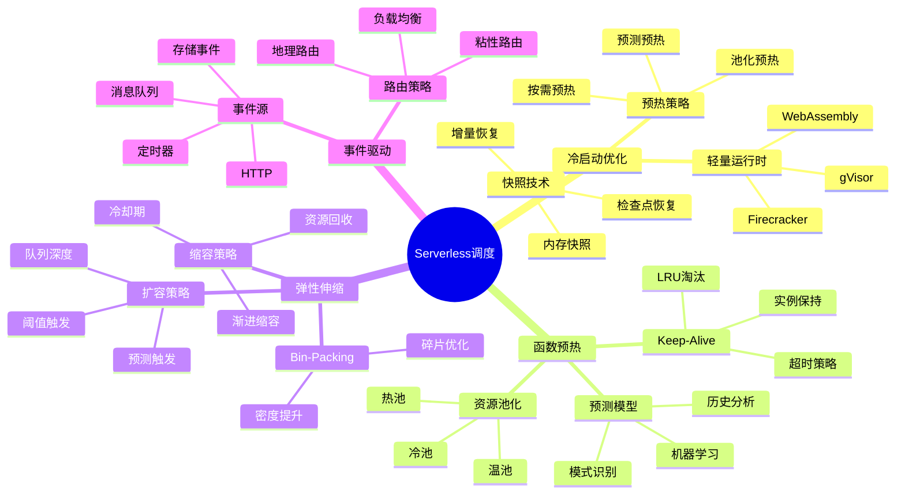
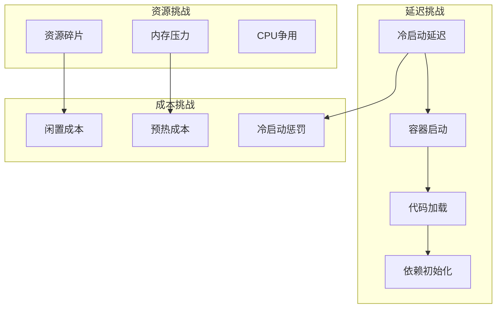
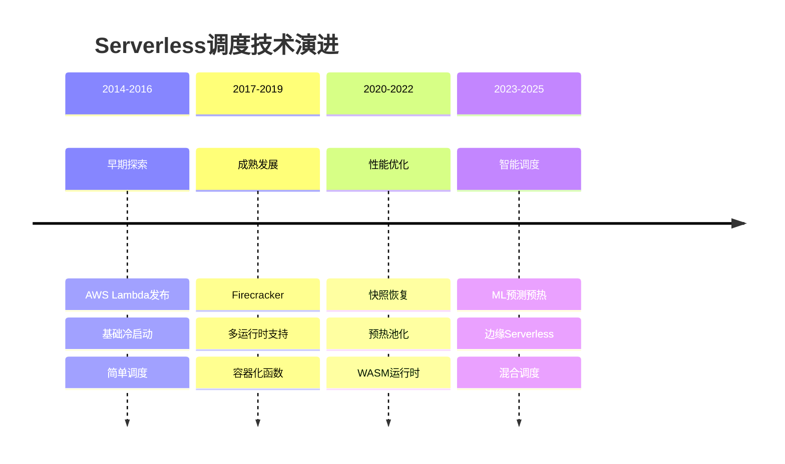

# 26 Serverless调度

> **主题编号**: 26
> **主题**: Serverless函数计算调度
> **最后更新**: 2025-12-02
> **文档状态**: ✅ 完成

---

## 📋 目录

- [1 概述](#1-概述)
- [2 子主题索引](#2-子主题索引)
- [3 思维导图](#3-思维导图)
- [4 核心挑战](#4-核心挑战)
- [5 技术演进](#5-技术演进)
- [6 跨视角链接](#6-跨视角链接)

---

## 1 概述

### 1.1 核心洞察

Serverless计算代表了云计算的重要演进方向，其调度系统面临独特挑战：**极短生命周期函数**、**冷启动延迟**、**弹性伸缩**和**资源碎片化**。

| 特性 | 描述 | 调度挑战 |
|------|------|---------|
| **事件驱动** | 按需触发执行 | 快速响应 |
| **短生命周期** | 毫秒到分钟级 | 资源复用 |
| **冷启动** | 首次调用延迟 | 预热策略 |
| **按用计费** | 精确计量 | 资源优化 |
| **无状态** | 每次独立执行 | 状态管理 |

### 1.2 形式化定义

```text
Serverless调度系统 S = (F, E, R, P, σ)

其中：
  F: 函数集合 {f₁, f₂, ..., fₙ}
  E: 事件流 (触发器)
  R: 资源池 (容器/微VM实例)
  P: 策略集 (预热、伸缩、放置)
  σ: 调度策略函数 σ: E × F × R → Schedule

优化目标：
  minimize: Cold_Start_Latency, Cost
  maximize: Throughput, Resource_Utilization
  subject to: SLA_Constraints
```

---

## 2 子主题索引

| 编号 | 子主题 | 核心内容 | 状态 |
|------|--------|---------|------|
| [26.1](./26.1_冷启动优化调度.md) | 冷启动优化调度 | 预热策略、快照恢复、轻量运行时 | ✅ |
| [26.2](./26.2_函数预热策略.md) | 函数预热策略 | 预测预热、池化、keep-alive | ✅ |
| [26.3](./26.3_资源弹性调度.md) | 资源弹性调度 | 自动伸缩、资源bin-packing | ✅ |
| [26.4](./26.4_事件驱动调度.md) | 事件驱动调度 | 事件路由、负载均衡、流处理 | ✅ |

---

## 3 思维导图



---

## 4 核心挑战

### 4.1 挑战矩阵



### 4.2 平台对比

| 平台 | 冷启动时间 | 最大执行时间 | 并发限制 | 特点 |
|------|-----------|------------|---------|------|
| **AWS Lambda** | 100ms-1s | 15分钟 | 1000 | 最成熟 |
| **Azure Functions** | 100ms-2s | 无限(专用) | 200 | .NET优化 |
| **Google Cloud Functions** | 100ms-500ms | 9分钟 | 1000 | GCP集成 |
| **Cloudflare Workers** | <5ms | 30s/50ms | 无限制 | 边缘部署 |
| **Knative** | 变化大 | 可配置 | 可配置 | 开源K8s |

---

## 5 技术演进



---

## 6 跨视角链接

### 6.1 调度视角关联

| 相关主题 | 关联内容 | 链接 |
|---------|---------|------|
| 容器化技术 | 容器调度基础 | [05_虚拟化容器化沙盒化](../05_虚拟化容器化沙盒化/) |
| 边缘计算 | 边缘Serverless | [20_边缘与移动调度](../20_边缘与移动调度/) |
| 分布式调度 | 集群调度策略 | [06_调度模型](../06_调度模型/) |
| LLM推理 | 推理函数调度 | [25_LLM推理调度](../25_LLM推理调度/) |

### 6.2 形式语言视角关联

| 概念映射 | 形式语言 | Serverless调度 |
|---------|---------|---------------|
| **函数类型** | λ表达式 | 函数定义 |
| **惰性求值** | 延迟计算 | 按需执行 |
| **效应系统** | 副作用跟踪 | 状态管理 |

---

## 参考资源

1. AWS Lambda Documentation
2. Firecracker: Lightweight Virtualization for Serverless Applications (NSDI 2020)
3. Catalyzer: Sub-millisecond Startup for Serverless Computing (ASPLOS 2020)
4. SOCK: Rapid Task Provisioning with Serverless-Optimized Containers (USENIX ATC 2018)

---

**返回**: [调度视角主索引](../README.md)
