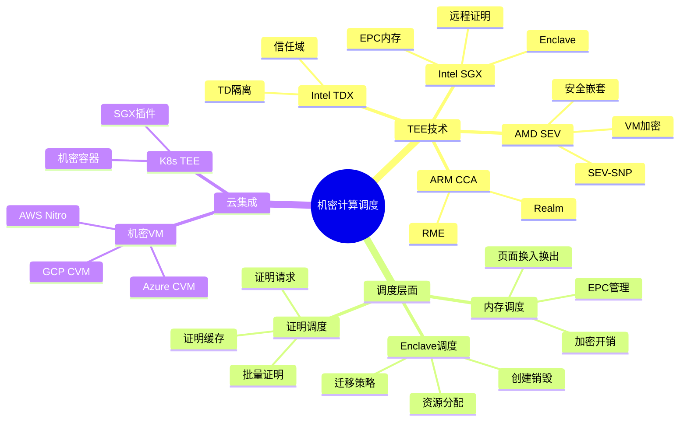
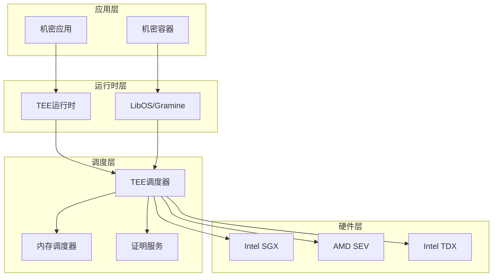
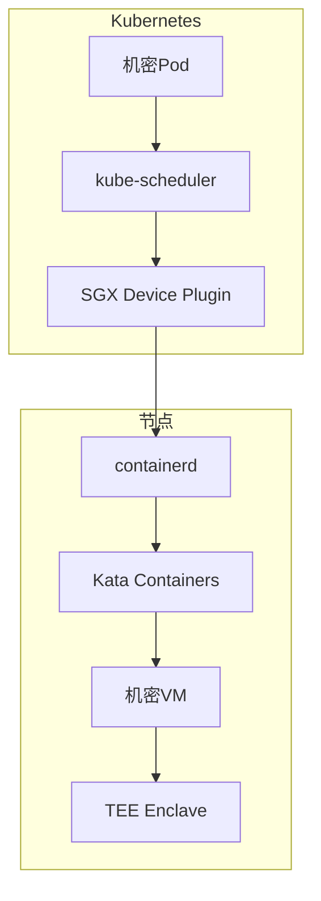

# 27 机密计算调度

> **主题编号**: 27
> **主题**: 机密计算（Confidential Computing）调度
> **最后更新**: 2025-12-02
> **文档状态**: ✅ 完成

---

## 📋 目录

- [1 概述](#1-概述)
- [2 思维导图](#2-思维导图)
- [3 TEE调度架构](#3-tee调度架构)
- [4 内存调度](#4-内存调度)
- [5 K8s集成](#5-k8s集成)
- [6 知识矩阵](#6-知识矩阵)
- [7 跨视角链接](#7-跨视角链接)

---

## 1 概述

### 1.1 核心洞察

机密计算（Confidential Computing）通过硬件隔离技术（TEE）保护计算过程中的数据。调度机密计算工作负载面临独特挑战：**在保证安全隔离的同时实现高效资源利用**。

### 1.2 机密计算特性

| 特性 | 描述 | 调度挑战 |
|------|------|---------|
| **TEE隔离** | 硬件级内存加密 | Enclave资源分配 |
| **远程证明** | 可验证计算环境 | 证明开销管理 |
| **加密内存** | 运行时数据保护 | 内存带宽瓶颈 |
| **受限API** | 有限系统调用 | 功能约束适配 |
| **启动开销** | TEE初始化成本 | 冷启动优化 |

### 1.3 形式化定义

```text
机密计算调度系统 CC = (E, M, A, P, σ)

其中：
  E: TEE Enclave集合 {e₁, e₂, ..., eₙ}
  M: 加密内存管理器
  A: 远程证明服务
  P: 策略引擎
  σ: 调度函数 σ: Workload × E × M → Schedule

安全约束：
  ∀w ∈ Workload. Confidential(w) ⟹ TEE_Protected(σ(w))
  ∀e ∈ E. Verified(Attestation(e))
```

---

## 2 思维导图



---

## 3 TEE调度架构

### 3.1 整体架构



### 3.2 Enclave生命周期调度

```text
Enclave生命周期:

  ┌─────────┐     ┌─────────┐     ┌─────────┐     ┌─────────┐
  │ 创建     │────▶│ 初始化   │────▶│ 运行     │────▶│ 销毁     │
  │ ECREATE │     │ EINIT   │     │ EENTER  │     │ EREMOVE │
  └─────────┘     └─────────┘     └─────────┘     └─────────┘
       │               │               │               │
       ▼               ▼               ▼               ▼
  ┌─────────┐     ┌─────────┐     ┌─────────┐     ┌─────────┐
  │分配EPC   │     │加载代码  │     │处理请求  │     │释放资源  │
  │页面      │     │验证测量  │     │调度切换  │     │清理内存  │
  └─────────┘     └─────────┘     └─────────┘     └─────────┘

调度决策点:
1. 创建时：选择EPC资源池
2. 初始化：安排证明流程
3. 运行时：处理AEX中断
4. 销毁时：安全清理调度
```

### 3.3 SGX调度器实现

```c
/* SGX Enclave调度器 */
struct sgx_scheduler {
    struct list_head ready_queue;      /* 就绪队列 */
    struct list_head blocked_queue;    /* 阻塞队列 */
    struct sgx_epc_manager *epc_mgr;   /* EPC管理器 */
    spinlock_t lock;
};

/* Enclave调度单元 */
struct sgx_task {
    struct sgx_encl *encl;             /* Enclave实例 */
    enum sgx_task_state state;         /* 状态 */
    u64 vruntime;                      /* 虚拟运行时间 */
    struct list_head list;

    /* 统计信息 */
    u64 epc_usage;                     /* EPC使用量 */
    u64 aex_count;                     /* AEX次数 */
    u64 eexit_count;                   /* EEXIT次数 */
};

/* 调度策略 */
static struct sgx_task *sgx_pick_next(struct sgx_scheduler *sched)
{
    struct sgx_task *task, *next = NULL;
    u64 min_vruntime = U64_MAX;

    /* CFS风格：选择vruntime最小的 */
    list_for_each_entry(task, &sched->ready_queue, list) {
        if (task->vruntime < min_vruntime) {
            min_vruntime = task->vruntime;
            next = task;
        }
    }

    return next;
}

/* EPC资源调度 */
static int sgx_schedule_epc(struct sgx_task *task, size_t pages)
{
    struct sgx_epc_page *epc_page;

    /* 优先从本地NUMA节点分配 */
    epc_page = sgx_alloc_epc_page_local(task->encl);
    if (!epc_page) {
        /* 触发EPC换页 */
        sgx_reclaim_pages();
        epc_page = sgx_alloc_epc_page_any(task->encl);
    }

    return epc_page ? 0 : -ENOMEM;
}
```

---

## 4 内存调度

### 4.1 EPC内存管理

```text
EPC (Enclave Page Cache) 调度:

物理EPC空间 (典型: 128MB-512MB):
┌────────────────────────────────────────────────────┐
│ Enclave A │ Enclave B │ ... │ Enclave N │ 空闲页   │
│   32MB    │   64MB    │     │   16MB    │  16MB   │
└────────────────────────────────────────────────────┘

EPC换页策略:
1. LRU换出：最近最少使用页面换出到普通内存
2. 加密换出：换出时加密，换入时解密
3. 优先级换出：低优先级Enclave优先换出

换页开销:
- 换出: ~10μs/页 (加密 + 写入)
- 换入: ~10μs/页 (读取 + 解密 + 验证)
```

### 4.2 EPC调度算法

```c
/* EPC页面调度 */
struct epc_scheduler {
    struct list_head active_list;      /* 活跃页面 */
    struct list_head inactive_list;    /* 非活跃页面 */
    atomic64_t nr_active;
    atomic64_t nr_inactive;
    u64 target_ratio;                  /* 目标活跃比例 */
};

/* 页面回收 */
static int epc_reclaim_pages(struct epc_scheduler *sched, int nr_pages)
{
    struct sgx_epc_page *page;
    int reclaimed = 0;

    while (reclaimed < nr_pages) {
        /* 从非活跃列表获取 */
        page = list_first_entry_or_null(&sched->inactive_list,
                                        struct sgx_epc_page, list);
        if (!page)
            break;

        /* 换出页面 */
        if (sgx_ewb(page) == 0) {
            list_del(&page->list);
            sgx_free_epc_page(page);
            reclaimed++;
        }
    }

    return reclaimed;
}

/* 页面激活/去激活 */
static void epc_activate_page(struct epc_scheduler *sched,
                              struct sgx_epc_page *page)
{
    list_move(&page->list, &sched->active_list);
    atomic64_inc(&sched->nr_active);
    atomic64_dec(&sched->nr_inactive);
}
```

---

## 5 K8s集成

### 5.1 SGX设备插件

```yaml
# SGX Device Plugin DaemonSet
apiVersion: apps/v1
kind: DaemonSet
metadata:
  name: sgx-device-plugin
  namespace: kube-system
spec:
  selector:
    matchLabels:
      name: sgx-device-plugin
  template:
    metadata:
      labels:
        name: sgx-device-plugin
    spec:
      containers:
      - name: sgx-plugin
        image: intel/sgx-device-plugin:latest
        securityContext:
          privileged: true
        volumeMounts:
        - name: device-plugin
          mountPath: /var/lib/kubelet/device-plugins
        - name: sgx-provision
          mountPath: /dev/sgx_provision
        - name: sgx-enclave
          mountPath: /dev/sgx_enclave
      volumes:
      - name: device-plugin
        hostPath:
          path: /var/lib/kubelet/device-plugins
      - name: sgx-provision
        hostPath:
          path: /dev/sgx_provision
      - name: sgx-enclave
        hostPath:
          path: /dev/sgx_enclave
```

### 5.2 机密Pod调度

```yaml
# 机密计算Pod示例
apiVersion: v1
kind: Pod
metadata:
  name: confidential-workload
spec:
  runtimeClassName: kata-cc  # 机密容器运行时
  containers:
  - name: sgx-app
    image: myregistry/sgx-app:latest
    resources:
      limits:
        sgx.intel.com/epc: 64Mi       # EPC内存限制
        sgx.intel.com/enclave: 1      # Enclave数量
        sgx.intel.com/provision: 1    # 证明能力
      requests:
        sgx.intel.com/epc: 32Mi
        sgx.intel.com/enclave: 1
    securityContext:
      runAsNonRoot: true
      seccompProfile:
        type: RuntimeDefault
  nodeSelector:
    feature.node.kubernetes.io/cpu-sgx.enabled: "true"
  tolerations:
  - key: sgx.intel.com/epc
    operator: Exists
    effect: NoSchedule
```

### 5.3 机密容器架构



---

## 6 知识矩阵

### 6.1 TEE技术对比

| 技术 | 隔离粒度 | EPC大小 | 远程证明 | 性能开销 |
|------|---------|--------|---------|---------|
| **Intel SGX** | 进程级 | 128MB-512MB | DCAP/EPID | 中 |
| **Intel TDX** | VM级 | 无限制 | TDX Quote | 低 |
| **AMD SEV** | VM级 | 无限制 | SEV-SNP | 低 |
| **ARM CCA** | Realm级 | 配置 | CCA证明 | 低 |

### 6.2 调度策略对比

| 策略 | 适用场景 | 优点 | 缺点 |
|------|---------|------|------|
| **独占调度** | 高安全需求 | 最强隔离 | 资源浪费 |
| **共享调度** | 一般工作负载 | 高利用率 | 侧信道风险 |
| **亲和调度** | NUMA系统 | 性能优化 | 调度复杂 |
| **抢占调度** | 混合负载 | 响应快 | 上下文开销 |

---

## 7 跨视角链接

### 7.1 调度视角关联

| 相关主题 | 关联内容 | 链接 |
|---------|---------|------|
| OS调度 | 进程/内存调度 | [03_OS抽象层](../03_OS抽象层/) |
| 虚拟化 | VM调度 | [05_虚拟化容器化沙盒化](../05_虚拟化容器化沙盒化/) |
| K8s调度 | 设备插件 | [06_调度模型](../06_调度模型/) |
| 安全调度 | 隔离策略 | [24_安全调度](../24_安全调度/) |

### 7.2 形式语言视角关联

| 形式语言概念 | 机密计算对应 | 映射说明 |
|------------|-------------|---------|
| **线性类型** | Enclave资源 | 独占访问保证 |
| **存在类型** | 远程证明 | 封装实现细节 |
| **效应系统** | 安全边界 | 跨边界效应追踪 |
| **依赖类型** | 安全属性 | 类型级安全证明 |

---

**返回**: [调度视角主索引](../README.md)
