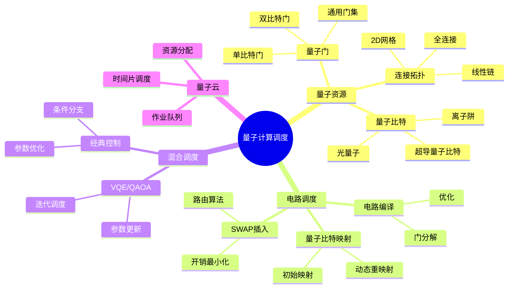
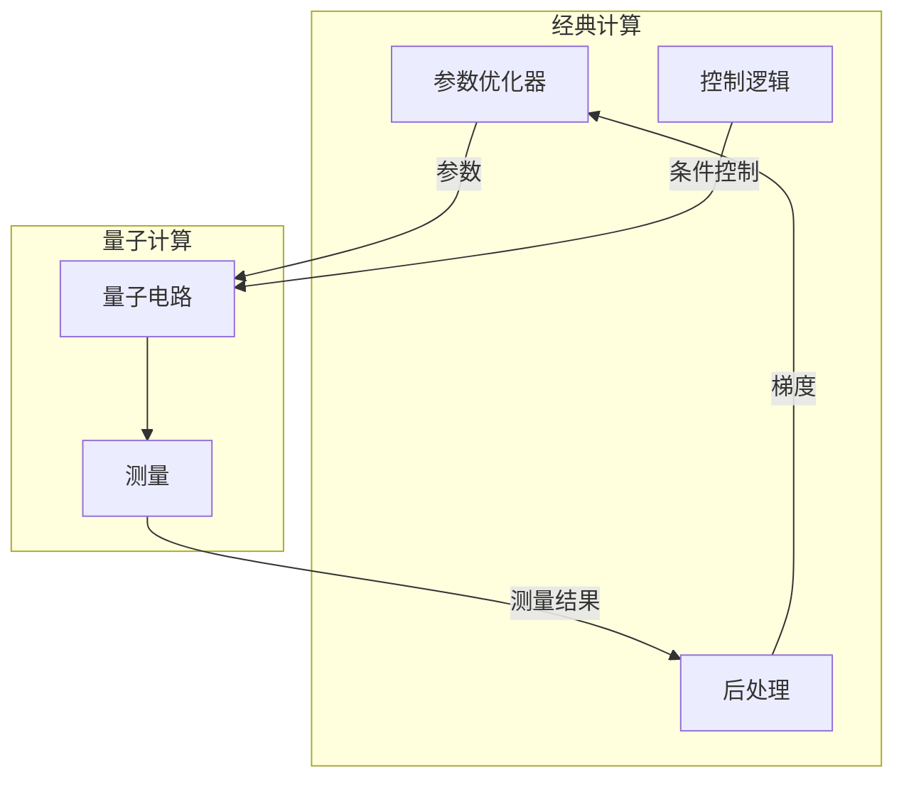

# 28 量子计算调度

> **主题编号**: 28
> **主题**: 量子计算调度
> **最后更新**: 2025-12-02
> **文档状态**: ✅ 完成

---

## 📋 目录

- [28 量子计算调度](#28-量子计算调度)
  - [📋 目录](#-目录)
  - [1 概述](#1-概述)
    - [1.1 核心洞察](#11-核心洞察)
    - [1.2 量子调度特性](#12-量子调度特性)
    - [1.3 形式化定义](#13-形式化定义)
  - [2 思维导图](#2-思维导图)
  - [3 量子资源模型](#3-量子资源模型)
    - [3.1 量子比特资源](#31-量子比特资源)
    - [3.2 连接拓扑](#32-连接拓扑)
    - [3.3 错误模型](#33-错误模型)
  - [4 量子电路调度](#4-量子电路调度)
    - [4.1 电路编译流程](#41-电路编译流程)
    - [4.2 量子比特映射算法](#42-量子比特映射算法)
    - [4.3 调度优化](#43-调度优化)
  - [5 混合调度架构](#5-混合调度架构)
    - [5.1 经典-量子协同](#51-经典-量子协同)
    - [5.2 VQE调度示例](#52-vqe调度示例)
  - [6 量子云调度](#6-量子云调度)
    - [6.1 多租户调度](#61-多租户调度)
    - [6.2 公平调度](#62-公平调度)
  - [7 知识矩阵](#7-知识矩阵)
    - [7.1 量子计算平台对比](#71-量子计算平台对比)
    - [7.2 调度算法对比](#72-调度算法对比)
  - [8 跨视角链接](#8-跨视角链接)
    - [8.1 调度视角关联](#81-调度视角关联)
    - [8.2 形式语言视角关联](#82-形式语言视角关联)
  - [参考资源](#参考资源)

---

## 1 概述

### 1.1 核心洞察

量子计算调度面临独特挑战：**量子比特的相干时间有限、量子门操作需要精确校准、量子纠错开销巨大**。
调度策略必须在这些约束下最大化量子资源利用率。

### 1.2 量子调度特性

| 特性 | 描述 | 调度挑战 |
|------|------|---------|
| **相干时间** | 量子态维持时间有限 | 时间约束调度 |
| **门保真度** | 量子门操作精度 | 噪声感知调度 |
| **连接性** | 量子比特拓扑连接 | 路由优化 |
| **纠错开销** | 逻辑比特需多物理比特 | 资源放大 |
| **经典-量子混合** | 混合计算模型 | 协同调度 |

### 1.3 形式化定义

```text
量子计算调度系统 Q = (C, G, T, E, σ)

其中：
  C: 量子电路集合 {c₁, c₂, ..., cₙ}
  G: 量子门集合（单比特门、双比特门）
  T: 拓扑约束（量子比特连接图）
  E: 错误模型（去相干、门误差）
  σ: 调度函数 σ: C × T × E → Schedule

优化目标：
  minimize: Total_Time, Error_Rate
  maximize: Fidelity, Throughput
  subject to: Coherence_Time, Connectivity
```

---

## 2 思维导图



---

## 3 量子资源模型

### 3.1 量子比特资源

```text
量子比特资源模型:

物理量子比特:
  - T1: 弛豫时间 (~100μs for superconducting)
  - T2: 退相干时间 (~50-100μs)
  - 门时间: 单比特 ~20ns, 双比特 ~200ns
  - 读出时间: ~1μs
  - 门保真度: 单比特 >99.9%, 双比特 ~99%

逻辑量子比特 (纠错后):
  - 需要: 数十到数千物理比特
  - 表面码: ~1000物理比特/逻辑比特
  - 纠错周期: ~1μs

资源约束:
  ∀ circuit c:
    depth(c) × gate_time < coherence_time
    qubits(c) ≤ available_qubits
```

### 3.2 连接拓扑

```text
量子处理器拓扑示例:

IBM Heavy-Hex (127 qubits):
    ●─●─●─●─●
    │   │   │
    ●─●─●─●─●
      │   │
    ●─●─●─●─●
    │   │   │
    ●─●─●─●─●

Google Sycamore (72 qubits):
    ●─●─●─●─●─●─●─●─●
    │╲│╱│╲│╱│╲│╱│╲│╱│
    ●─●─●─●─●─●─●─●─●
    │╱│╲│╱│╲│╱│╲│╱│╲│
    ●─●─●─●─●─●─●─●─●
    ...

拓扑约束:
  CNOT(q1, q2) 仅当 edge(q1, q2) ∈ Topology
  否则需要 SWAP 路由
```

### 3.3 错误模型

```python
# 量子错误模型
class QuantumErrorModel:
    def __init__(self, device_params):
        self.t1 = device_params['t1']  # 弛豫时间
        self.t2 = device_params['t2']  # 退相干时间
        self.gate_errors = device_params['gate_errors']
        self.readout_errors = device_params['readout_errors']

    def circuit_fidelity(self, circuit, mapping):
        """计算电路保真度"""
        fidelity = 1.0

        for gate in circuit.gates:
            # 门误差
            gate_fidelity = 1 - self.gate_errors[gate.name]
            fidelity *= gate_fidelity

            # 退相干误差
            time_in_circuit = self.gate_time(gate)
            decoherence = exp(-time_in_circuit / self.t2)
            fidelity *= decoherence

        # 读出误差
        for qubit in circuit.measured_qubits:
            fidelity *= (1 - self.readout_errors[mapping[qubit]])

        return fidelity
```

---

## 4 量子电路调度

### 4.1 电路编译流程


### 4.2 量子比特映射算法

```python
# 量子比特映射 - SABRE算法简化版
class SABREMapper:
    def __init__(self, coupling_map):
        self.coupling_map = coupling_map
        self.distance_matrix = self._compute_distances()

    def map_circuit(self, circuit):
        """映射电路到物理量子比特"""
        # 初始映射 (贪心)
        mapping = self._initial_mapping(circuit)

        # 处理每个门
        mapped_circuit = []
        front_layer = circuit.get_front_layer()

        while front_layer:
            # 找可直接执行的门
            executable = self._get_executable(front_layer, mapping)

            if executable:
                for gate in executable:
                    mapped_circuit.append(
                        self._apply_mapping(gate, mapping)
                    )
                    front_layer.remove(gate)
            else:
                # 需要SWAP
                swap = self._select_swap(front_layer, mapping)
                mapped_circuit.append(swap)
                mapping = self._apply_swap(mapping, swap)

            # 更新前沿层
            front_layer = circuit.get_front_layer()

        return mapped_circuit

    def _select_swap(self, front_layer, mapping):
        """选择最优SWAP"""
        best_swap = None
        best_cost = float('inf')

        for edge in self.coupling_map.edges:
            # 计算SWAP后的前瞻成本
            new_mapping = self._apply_swap(mapping.copy(), edge)
            cost = self._heuristic_cost(front_layer, new_mapping)

            if cost < best_cost:
                best_cost = cost
                best_swap = ('SWAP', edge)

        return best_swap

    def _heuristic_cost(self, front_layer, mapping):
        """启发式成本函数"""
        cost = 0
        for gate in front_layer:
            if len(gate.qubits) == 2:
                q1, q2 = gate.qubits
                p1, p2 = mapping[q1], mapping[q2]
                cost += self.distance_matrix[p1][p2]
        return cost
```

### 4.3 调度优化

```python
# 量子电路调度优化
class QuantumScheduler:
    def __init__(self, device):
        self.device = device
        self.gate_durations = device.gate_durations

    def schedule(self, circuit):
        """ALAP (As Late As Possible) 调度"""
        # 反向拓扑排序
        layers = self._topological_layers(circuit)

        schedule = {}
        current_time = 0

        # 从最后一层开始
        for layer in reversed(layers):
            layer_end = current_time

            for gate in layer:
                # 计算最晚开始时间
                duration = self.gate_durations[gate.name]

                # 检查依赖
                deps_end = max(
                    (schedule[dep]['end'] for dep in gate.dependencies),
                    default=0
                )

                start = max(deps_end, layer_end - duration)
                schedule[gate] = {
                    'start': start,
                    'end': start + duration,
                    'qubits': gate.qubits
                }

            current_time = max(s['end'] for s in schedule.values())

        return schedule

    def optimize_for_fidelity(self, circuit, error_model):
        """保真度优化调度"""
        # 考虑退相干，最小化总执行时间
        schedule = self.schedule(circuit)

        # 迭代优化
        for _ in range(100):
            # 尝试门重排序
            new_schedule = self._perturb(schedule)

            if error_model.circuit_fidelity(circuit, new_schedule) > \
               error_model.circuit_fidelity(circuit, schedule):
                schedule = new_schedule

        return schedule
```

---

## 5 混合调度架构

### 5.1 经典-量子协同



### 5.2 VQE调度示例

```python
# VQE (Variational Quantum Eigensolver) 调度
class VQEScheduler:
    def __init__(self, quantum_device, classical_optimizer):
        self.qdevice = quantum_device
        self.optimizer = classical_optimizer

    def run_vqe(self, hamiltonian, ansatz, max_iterations=100):
        """运行VQE算法"""
        # 初始参数
        params = self._init_params(ansatz)

        for iteration in range(max_iterations):
            # 1. 经典->量子: 准备参数化电路
            circuit = ansatz.bind_parameters(params)

            # 2. 调度量子执行
            job = self._schedule_quantum_job(circuit, hamiltonian)

            # 3. 等待结果
            energy = self._await_result(job)

            # 4. 量子->经典: 参数更新
            gradient = self._estimate_gradient(params, ansatz, hamiltonian)
            params = self.optimizer.step(params, gradient)

            if self._converged(energy):
                break

        return energy, params

    def _schedule_quantum_job(self, circuit, hamiltonian):
        """调度量子作业"""
        # 分解Hamiltonian测量
        measurements = self._pauli_decomposition(hamiltonian)

        # 批处理多个测量电路
        circuits = []
        for pauli_term in measurements:
            meas_circuit = circuit.copy()
            meas_circuit.append(pauli_term.measurement_basis())
            circuits.append(meas_circuit)

        # 提交批量作业
        return self.qdevice.submit_batch(circuits)
```

---

## 6 量子云调度

### 6.1 多租户调度

```python
# 量子云作业调度器
class QuantumCloudScheduler:
    def __init__(self, quantum_backends):
        self.backends = quantum_backends
        self.job_queue = PriorityQueue()
        self.running_jobs = {}

    def submit_job(self, job, priority='normal'):
        """提交量子作业"""
        job.id = generate_job_id()
        job.priority = self._compute_priority(job, priority)
        job.status = 'queued'

        self.job_queue.put((job.priority, job))

        return job.id

    def schedule(self):
        """主调度循环"""
        while True:
            # 检查完成的作业
            self._check_completed_jobs()

            # 获取下一个作业
            if self.job_queue.empty():
                time.sleep(0.1)
                continue

            _, job = self.job_queue.get()

            # 选择最佳后端
            backend = self._select_backend(job)

            if backend:
                # 执行作业
                self._execute_job(job, backend)
            else:
                # 重新入队等待
                self.job_queue.put((job.priority, job))

    def _select_backend(self, job):
        """选择最佳量子后端"""
        compatible_backends = []

        for backend in self.backends:
            if self._is_compatible(job, backend):
                score = self._score_backend(job, backend)
                compatible_backends.append((score, backend))

        if not compatible_backends:
            return None

        # 选择得分最高的
        compatible_backends.sort(reverse=True)
        return compatible_backends[0][1]

    def _score_backend(self, job, backend):
        """后端评分"""
        score = 0

        # 量子比特数匹配
        if backend.num_qubits >= job.required_qubits:
            score += 10

        # 门保真度
        score += backend.avg_gate_fidelity * 50

        # 队列长度
        score -= backend.queue_length * 2

        # 校准新鲜度
        hours_since_calibration = (
            datetime.now() - backend.last_calibration
        ).total_seconds() / 3600
        score -= hours_since_calibration

        return score
```

### 6.2 公平调度

```python
# 公平份额调度
class FairShareScheduler:
    def __init__(self, quantum_resources):
        self.resources = quantum_resources
        self.user_usage = defaultdict(float)
        self.user_allocations = {}

    def compute_fair_share(self, user):
        """计算用户公平份额"""
        total_allocation = sum(self.user_allocations.values())
        user_allocation = self.user_allocations.get(user, 1.0)

        return user_allocation / total_allocation

    def schedule_job(self, job):
        """公平调度作业"""
        user = job.user

        # 计算优先级
        fair_share = self.compute_fair_share(user)
        actual_usage = self.user_usage[user]

        # 使用率低于份额的用户获得更高优先级
        priority = fair_share / (actual_usage + 0.01)

        # 考虑作业特性
        priority *= self._job_priority_factor(job)

        return priority
```

---

## 7 知识矩阵

### 7.1 量子计算平台对比

| 平台 | 量子比特数 | 拓扑 | 云服务 | 调度特点 |
|------|-----------|------|-------|---------|
| **IBM Quantum** | 127-1000+ | Heavy-Hex | ✅ | 公平份额 |
| **Google Quantum AI** | 72 | 2D网格 | ❌ | 内部使用 |
| **IonQ** | 32 | 全连接 | ✅ | 按需调度 |
| **Rigetti** | 80+ | 可调 | ✅ | 混合调度 |
| **Amazon Braket** | 多后端 | 多种 | ✅ | 统一接口 |

### 7.2 调度算法对比

| 算法 | 目标 | 复杂度 | 适用场景 |
|------|------|-------|---------|
| **SABRE** | SWAP最小化 | O(n²) | 一般电路 |
| **Qiskit Transpiler** | 多目标 | O(n²) | 生产环境 |
| **TOQM** | 时间优化 | O(n³) | 深电路 |
| **Noise-Aware** | 保真度 | O(n²) | 噪声敏感 |

---

## 8 跨视角链接

### 8.1 调度视角关联

| 相关主题 | 关联内容 | 链接 |
|---------|---------|------|
| GPU调度 | 异构计算 | [16_GPU与加速器调度](../16_GPU与加速器调度/) |
| 云调度 | 资源分配 | [06_调度模型](../06_调度模型/) |
| 混合计算 | 协同调度 | [10_AI驱动调度](../10_AI驱动调度/) |

### 8.2 形式语言视角关联

| 形式语言概念 | 量子调度对应 | 映射说明 |
|------------|-------------|---------|
| **线性类型** | 量子比特 | No-Cloning |
| **效应系统** | 测量 | 不可逆操作 |
| **依赖类型** | 电路深度 | 时间约束 |

---

## 参考资源

1. [Qiskit Transpiler](https://qiskit.org/documentation/apidoc/transpiler.html)
2. [SABRE Algorithm Paper](https://arxiv.org/abs/1809.02573)
3. [IBM Quantum Network](https://quantum-computing.ibm.com/)
4. [Cirq Documentation](https://quantumai.google/cirq)

---

**返回**: [调度视角主索引](../README.md)
