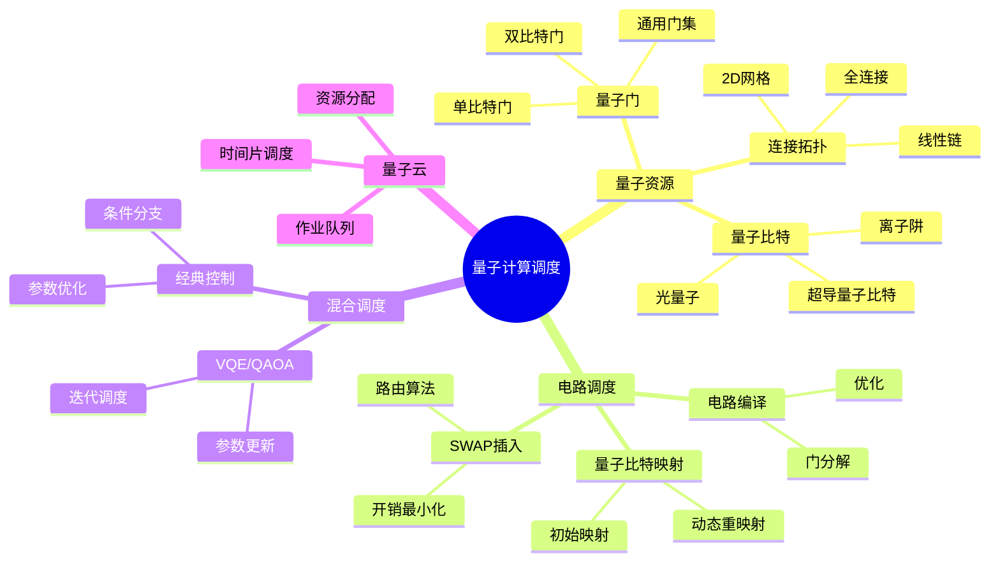
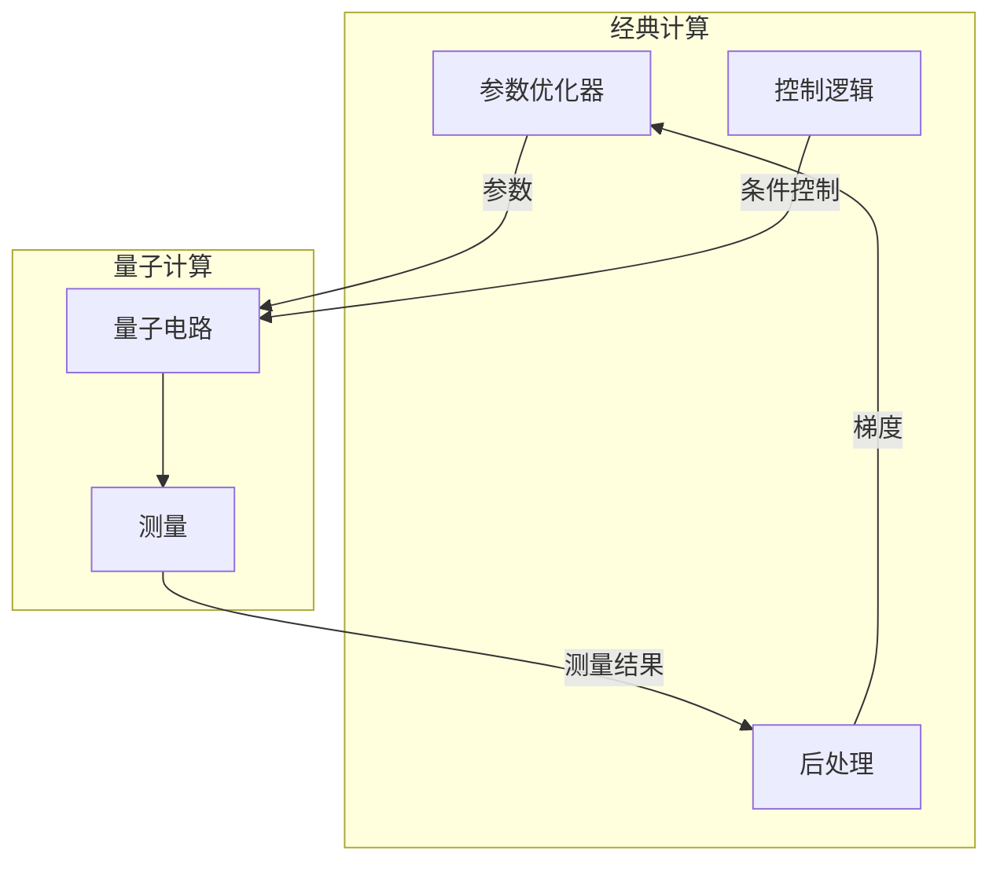
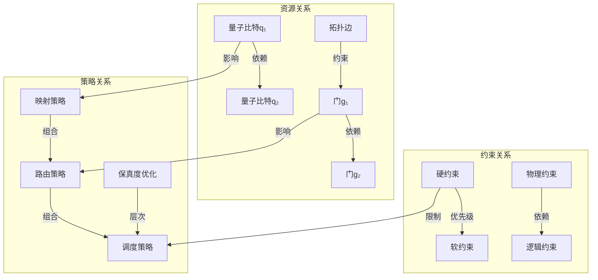

# 28 量子计算调度

> **主题编号**: 28
> **主题**: 量子计算调度
> **最后更新**: 2025-12-02
> **文档状态**: ✅ 完成

---

## 📋 目录

- [28 量子计算调度](#28-量子计算调度)
  - [📋 目录](#-目录)
  - [1 概述](#1-概述)
    - [1.1 核心洞察](#11-核心洞察)
    - [1.2 量子调度特性](#12-量子调度特性)
    - [1.3 形式化定义](#13-形式化定义)
    - [1.4 核心概念精确定义](#14-核心概念精确定义)
      - [1.4.1 量子调度问题（Quantum Scheduling Problem）](#141-量子调度问题quantum-scheduling-problem)
      - [1.4.2 量子资源（Quantum Resource）](#142-量子资源quantum-resource)
      - [1.4.3 量子调度约束（Quantum Scheduling Constraints）](#143-量子调度约束quantum-scheduling-constraints)
    - [1.5 设计原理与动机](#15-设计原理与动机)
      - [1.5.1 为什么量子调度不同于经典调度？](#151-为什么量子调度不同于经典调度)
      - [1.5.2 量子调度的优化目标](#152-量子调度的优化目标)
    - [1.6 量子调度复杂性分析](#16-量子调度复杂性分析)
      - [1.6.1 计算复杂度](#161-计算复杂度)
      - [1.6.2 空间复杂度](#162-空间复杂度)
  - [2 思维导图](#2-思维导图)
  - [3 量子资源模型](#3-量子资源模型)
    - [3.1 量子比特资源](#31-量子比特资源)
    - [3.2 连接拓扑](#32-连接拓扑)
    - [3.3 错误模型](#33-错误模型)
      - [3.3.1 错误模型的数学基础](#331-错误模型的数学基础)
      - [3.3.2 保真度计算定理](#332-保真度计算定理)
      - [3.3.3 错误传播分析](#333-错误传播分析)
  - [4 量子电路调度](#4-量子电路调度)
    - [4.1 电路编译流程](#41-电路编译流程)
    - [4.2 量子比特映射算法](#42-量子比特映射算法)
    - [4.3 调度优化](#43-调度优化)
  - [5 混合调度架构](#5-混合调度架构)
    - [5.1 经典-量子协同](#51-经典-量子协同)
    - [5.2 VQE调度示例](#52-vqe调度示例)
  - [6 量子云调度](#6-量子云调度)
    - [6.1 多租户调度](#61-多租户调度)
    - [6.2 公平调度](#62-公平调度)
  - [7 知识矩阵](#7-知识矩阵)
    - [7.1 量子计算平台对比](#71-量子计算平台对比)
    - [7.2 调度算法对比](#72-调度算法对比)
  - [8 关系属性与依赖分析](#8-关系属性与依赖分析)
    - [8.1 量子资源之间的关系](#81-量子资源之间的关系)
      - [8.1.1 量子比特依赖关系](#811-量子比特依赖关系)
      - [8.1.2 量子门之间的关系](#812-量子门之间的关系)
      - [8.1.3 拓扑约束关系](#813-拓扑约束关系)
    - [8.2 调度策略之间的关系](#82-调度策略之间的关系)
      - [8.2.1 调度策略组合](#821-调度策略组合)
      - [8.2.2 调度策略层次](#822-调度策略层次)
    - [8.3 约束关系](#83-约束关系)
      - [8.3.1 约束之间的依赖](#831-约束之间的依赖)
      - [8.3.2 约束冲突与解决](#832-约束冲突与解决)
    - [8.4 形式化关系图](#84-形式化关系图)
  - [9 跨视角链接](#9-跨视角链接)
    - [9.1 调度视角关联](#91-调度视角关联)
    - [9.2 形式语言视角关联](#92-形式语言视角关联)
    - [9.3 关系属性映射](#93-关系属性映射)
  - [参考资源](#参考资源)

---

## 1 概述

### 1.1 核心洞察

量子计算调度面临独特挑战：**量子比特的相干时间有限、量子门操作需要精确校准、量子纠错开销巨大**。
调度策略必须在这些约束下最大化量子资源利用率。

### 1.2 量子调度特性

| 特性 | 描述 | 调度挑战 |
|------|------|---------|
| **相干时间** | 量子态维持时间有限 | 时间约束调度 |
| **门保真度** | 量子门操作精度 | 噪声感知调度 |
| **连接性** | 量子比特拓扑连接 | 路由优化 |
| **纠错开销** | 逻辑比特需多物理比特 | 资源放大 |
| **经典-量子混合** | 混合计算模型 | 协同调度 |

### 1.3 形式化定义

```text
量子计算调度系统 Q = (C, G, T, E, σ)

其中：
  C: 量子电路集合 {c₁, c₂, ..., cₙ}
  G: 量子门集合（单比特门、双比特门）
  T: 拓扑约束（量子比特连接图）
  E: 错误模型（去相干、门误差）
  σ: 调度函数 σ: C × T × E → Schedule

优化目标：
  minimize: Total_Time, Error_Rate
  maximize: Fidelity, Throughput
  subject to: Coherence_Time, Connectivity
```

### 1.4 核心概念精确定义

#### 1.4.1 量子调度问题（Quantum Scheduling Problem）

**定义 1.1**：量子调度问题是在给定约束下，为量子电路找到最优的执行顺序和资源分配。

**形式化表述**：

```text
给定：
  - 量子电路 c ∈ C
  - 硬件拓扑 T = (Q, E)，其中Q是量子比特集合，E是连接边集合
  - 错误模型 E: Gate × Time → ErrorRate
  - 资源约束 R: ResourceSpec

求解：
  - 映射函数 m: LogicalQubit → PhysicalQubit
  - 调度函数 s: Gate → Time
  - 路由序列 r: List<SWAP>

优化目标：
  minimize: f(m, s, r) = α·Time + β·ErrorRate + γ·SWAPCount
```

**关键约束**：

1. **拓扑约束**：CNOT(q₁, q₂)仅当edge(m(q₁), m(q₂)) ∈ E
2. **时间约束**：所有门的执行时间必须满足依赖关系
3. **相干时间约束**：circuit_depth × gate_time ≤ coherence_time
4. **资源约束**：使用的量子比特数 ≤ available_qubits

#### 1.4.2 量子资源（Quantum Resource）

**定义 1.2**：量子资源是执行量子计算所需的物理或逻辑实体。

**资源类型**：

1. **物理量子比特（Physical Qubit）**：

   ```text
   PhysicalQubit = {
     id: QubitId,
     t1: RelaxationTime,      -- 弛豫时间
     t2: DecoherenceTime,      -- 退相干时间
     gate_fidelity: Fidelity,  -- 门保真度
     readout_fidelity: Fidelity -- 读出保真度
   }
   ```

2. **逻辑量子比特（Logical Qubit）**：

   ```text
   LogicalQubit = {
     id: LogicalQubitId,
     physical_qubits: List<PhysicalQubit>,  -- 纠错码编码
     error_rate: ErrorRate,                  -- 逻辑错误率
     error_correction: ErrorCorrectionCode    -- 纠错码类型
   }
   ```

3. **量子门（Quantum Gate）**：

   ```text
   QuantumGate = {
     type: GateType,           -- 单比特/双比特
     qubits: List<QubitId>,   -- 操作的量子比特
     duration: Time,          -- 执行时间
     fidelity: Fidelity        -- 门保真度
   }
   ```

#### 1.4.3 量子调度约束（Quantum Scheduling Constraints）

**定义 1.3**：量子调度约束是限制调度可行性的条件。

**约束分类**：

1. **物理约束（Physical Constraints）**：
   - **相干时间约束**：T₂ ≥ circuit_execution_time
   - **连接性约束**：CNOT门只能在相邻量子比特间执行
   - **校准约束**：门操作需要硬件校准

2. **逻辑约束（Logical Constraints）**：
   - **依赖约束**：门之间的数据依赖关系
   - **并行性约束**：可以并行执行的门集合
   - **测量约束**：测量操作必须在所有相关门之后

3. **优化约束（Optimization Constraints）**：
   - **保真度约束**：Fidelity ≥ F_min
   - **时间约束**：Total_Time ≤ T_max
   - **资源约束**：Qubit_Count ≤ Q_max

### 1.5 设计原理与动机

#### 1.5.1 为什么量子调度不同于经典调度？

**核心差异**：

1. **不可克隆性（No-Cloning）**：

   ```text
   经典计算：可以复制数据，调度灵活
   量子计算：无法复制量子态，调度受限

   影响：量子比特一旦分配，不能简单迁移
   ```

2. **退相干（Decoherence）**：

   ```text
   经典计算：状态稳定，无时间衰减
   量子计算：量子态随时间衰减，有紧迫性

   影响：调度必须最小化执行时间
   ```

3. **测量坍缩（Measurement Collapse）**：

   ```text
   经典计算：可以随时读取状态
   量子计算：测量会破坏叠加态

   影响：测量操作必须谨慎调度
   ```

**形式化表述**：

```text
量子调度的特殊性：
  ∀ gate g, qubit q:
    - 如果g使用q，则q在g执行期间被"锁定"
    - 不能像经典计算那样简单地暂停和恢复
    - 必须考虑量子态的连续演化
```

#### 1.5.2 量子调度的优化目标

**多目标优化问题**：

**目标1：最小化执行时间**

```text
minimize: T_total = max{gate.end_time | gate ∈ circuit}

约束：满足所有依赖关系和拓扑约束
```

**目标2：最大化保真度**

```text
maximize: F_total = ∏{gate.fidelity | gate ∈ circuit} × decoherence_factor

其中：
  decoherence_factor = exp(-T_total / T₂)
```

**目标3：最小化SWAP操作**

```text
minimize: SWAP_count = |{swap ∈ routing_sequence}|

原因：SWAP操作增加时间和错误率
```

**帕累托最优解**：

```text
不存在调度方案s'，使得：
  (T(s') < T(s) ∧ F(s') ≥ F(s) ∧ SWAP(s') ≤ SWAP(s)) 或
  (T(s') ≤ T(s) ∧ F(s') > F(s) ∧ SWAP(s') ≤ SWAP(s)) 或
  (T(s') ≤ T(s) ∧ F(s') ≥ F(s) ∧ SWAP(s') < SWAP(s))
```

### 1.6 量子调度复杂性分析

#### 1.6.1 计算复杂度

**定理 1.1**（量子调度复杂度）：

```text
量子调度问题是NP-hard问题。

证明思路：
  1. 将经典的作业调度问题（Job Scheduling）归约到量子调度
  2. 经典作业调度是NP-hard
  3. 量子调度包含经典调度作为特例（当所有门都是单比特门时）
```

**近似算法**：

- **贪心算法**：O(n²)，近似比2-1/m（m是量子比特数）
- **启发式算法**：O(n³)，实际性能更好但无理论保证
- **精确算法**：O(2ⁿ)，仅适用于小规模问题

#### 1.6.2 空间复杂度

**定理 1.2**（状态空间大小）：

```text
量子调度的状态空间大小为：
  |State| = O(n! × m^n × 2^e)

其中：
  n: 逻辑量子比特数
  m: 物理量子比特数
  e: 电路中的边数（门依赖关系）
```

**解释**：

- n!：逻辑到物理的映射排列数
- m^n：每个逻辑比特可能的物理位置
- 2^e：每个依赖关系的执行顺序选择

---

## 2 思维导图



---

## 3 量子资源模型

### 3.1 量子比特资源

```text
量子比特资源模型:

物理量子比特:
  - T1: 弛豫时间 (~100μs for superconducting)
  - T2: 退相干时间 (~50-100μs)
  - 门时间: 单比特 ~20ns, 双比特 ~200ns
  - 读出时间: ~1μs
  - 门保真度: 单比特 >99.9%, 双比特 ~99%

逻辑量子比特 (纠错后):
  - 需要: 数十到数千物理比特
  - 表面码: ~1000物理比特/逻辑比特
  - 纠错周期: ~1μs

资源约束:
  ∀ circuit c:
    depth(c) × gate_time < coherence_time
    qubits(c) ≤ available_qubits
```

### 3.2 连接拓扑

```text
量子处理器拓扑示例:

IBM Heavy-Hex (127 qubits):
    ●─●─●─●─●
    │   │   │
    ●─●─●─●─●
      │   │
    ●─●─●─●─●
    │   │   │
    ●─●─●─●─●

Google Sycamore (72 qubits):
    ●─●─●─●─●─●─●─●─●
    │╲│╱│╲│╱│╲│╱│╲│╱│
    ●─●─●─●─●─●─●─●─●
    │╱│╲│╱│╲│╱│╲│╱│╲│
    ●─●─●─●─●─●─●─●─●
    ...

拓扑约束:
  CNOT(q1, q2) 仅当 edge(q1, q2) ∈ Topology
  否则需要 SWAP 路由
```

### 3.3 错误模型

```python
# 量子错误模型
class QuantumErrorModel:
    def __init__(self, device_params):
        self.t1 = device_params['t1']  # 弛豫时间
        self.t2 = device_params['t2']  # 退相干时间
        self.gate_errors = device_params['gate_errors']
        self.readout_errors = device_params['readout_errors']

    def circuit_fidelity(self, circuit, mapping):
        """计算电路保真度"""
        fidelity = 1.0

        for gate in circuit.gates:
            # 门误差
            gate_fidelity = 1 - self.gate_errors[gate.name]
            fidelity *= gate_fidelity

            # 退相干误差
            time_in_circuit = self.gate_time(gate)
            decoherence = exp(-time_in_circuit / self.t2)
            fidelity *= decoherence

        # 读出误差
        for qubit in circuit.measured_qubits:
            fidelity *= (1 - self.readout_errors[mapping[qubit]])

        return fidelity
```

#### 3.3.1 错误模型的数学基础

**定义 3.1**（量子错误模型）：

```text
量子错误模型E是一个函数：
  E: Gate × Time × QubitState → ErrorRate

描述量子门操作在不同时间和状态下的错误率。
```

**错误类型**：

1. **门误差（Gate Error）**：

   ```text
   ε_gate = 1 - F_gate

   其中F_gate是门的保真度，定义为：
   F_gate = |Tr(U_ideal^† · U_actual)|² / d

   d是希尔伯特空间维度
   ```

2. **退相干误差（Decoherence Error）**：

   ```text
   ε_decoherence(t) = 1 - exp(-t / T₂)

   其中：
   - t是量子态保持时间
   - T₂是退相干时间
   ```

3. **读出误差（Readout Error）**：

   ```text
   ε_readout = P(测量0|实际1) + P(测量1|实际0)

   描述测量过程的错误概率
   ```

#### 3.3.2 保真度计算定理

**定理 3.1**（电路保真度）：

```text
对于量子电路c，其总保真度为：
  F_total = F_gates × F_decoherence × F_readout

其中：
  F_gates = ∏{F_gate(g) | g ∈ c.gates}
  F_decoherence = exp(-T_total / T₂)
  F_readout = ∏{1 - ε_readout(q) | q ∈ c.measured_qubits}
```

**证明**：基于量子误差的独立性假设和马尔可夫性质。

**推论 3.1**：为了最大化保真度，必须：

1. 最小化电路深度（减少退相干时间）
2. 使用高保真度门
3. 优化测量顺序

#### 3.3.3 错误传播分析

**定义 3.2**（错误传播）：

```text
错误传播函数Propagate描述错误如何在电路中传播：
  Propagate: Error × Gate → Error

关键性质：
  - 单比特错误：传播到后续门
  - 双比特错误：可能传播到两个分支
  - 测量错误：终止传播但影响结果
```

**定理 3.2**（错误传播上界）：

```text
对于深度为d的电路，错误率的上界为：
  ε_total ≤ d × ε_max

其中ε_max是单个门的最大错误率。
```

**证明**：通过归纳法，每个门最多引入ε_max的错误。

---

## 4 量子电路调度

### 4.1 电路编译流程


### 4.2 量子比特映射算法

```python
# 量子比特映射 - SABRE算法简化版
class SABREMapper:
    def __init__(self, coupling_map):
        self.coupling_map = coupling_map
        self.distance_matrix = self._compute_distances()

    def map_circuit(self, circuit):
        """映射电路到物理量子比特"""
        # 初始映射 (贪心)
        mapping = self._initial_mapping(circuit)

        # 处理每个门
        mapped_circuit = []
        front_layer = circuit.get_front_layer()

        while front_layer:
            # 找可直接执行的门
            executable = self._get_executable(front_layer, mapping)

            if executable:
                for gate in executable:
                    mapped_circuit.append(
                        self._apply_mapping(gate, mapping)
                    )
                    front_layer.remove(gate)
            else:
                # 需要SWAP
                swap = self._select_swap(front_layer, mapping)
                mapped_circuit.append(swap)
                mapping = self._apply_swap(mapping, swap)

            # 更新前沿层
            front_layer = circuit.get_front_layer()

        return mapped_circuit

    def _select_swap(self, front_layer, mapping):
        """选择最优SWAP"""
        best_swap = None
        best_cost = float('inf')

        for edge in self.coupling_map.edges:
            # 计算SWAP后的前瞻成本
            new_mapping = self._apply_swap(mapping.copy(), edge)
            cost = self._heuristic_cost(front_layer, new_mapping)

            if cost < best_cost:
                best_cost = cost
                best_swap = ('SWAP', edge)

        return best_swap

    def _heuristic_cost(self, front_layer, mapping):
        """启发式成本函数"""
        cost = 0
        for gate in front_layer:
            if len(gate.qubits) == 2:
                q1, q2 = gate.qubits
                p1, p2 = mapping[q1], mapping[q2]
                cost += self.distance_matrix[p1][p2]
        return cost
```

### 4.3 调度优化

```python
# 量子电路调度优化
class QuantumScheduler:
    def __init__(self, device):
        self.device = device
        self.gate_durations = device.gate_durations

    def schedule(self, circuit):
        """ALAP (As Late As Possible) 调度"""
        # 反向拓扑排序
        layers = self._topological_layers(circuit)

        schedule = {}
        current_time = 0

        # 从最后一层开始
        for layer in reversed(layers):
            layer_end = current_time

            for gate in layer:
                # 计算最晚开始时间
                duration = self.gate_durations[gate.name]

                # 检查依赖
                deps_end = max(
                    (schedule[dep]['end'] for dep in gate.dependencies),
                    default=0
                )

                start = max(deps_end, layer_end - duration)
                schedule[gate] = {
                    'start': start,
                    'end': start + duration,
                    'qubits': gate.qubits
                }

            current_time = max(s['end'] for s in schedule.values())

        return schedule

    def optimize_for_fidelity(self, circuit, error_model):
        """保真度优化调度"""
        # 考虑退相干，最小化总执行时间
        schedule = self.schedule(circuit)

        # 迭代优化
        for _ in range(100):
            # 尝试门重排序
            new_schedule = self._perturb(schedule)

            if error_model.circuit_fidelity(circuit, new_schedule) > \
               error_model.circuit_fidelity(circuit, schedule):
                schedule = new_schedule

        return schedule
```

---

## 5 混合调度架构

### 5.1 经典-量子协同



### 5.2 VQE调度示例

```python
# VQE (Variational Quantum Eigensolver) 调度
class VQEScheduler:
    def __init__(self, quantum_device, classical_optimizer):
        self.qdevice = quantum_device
        self.optimizer = classical_optimizer

    def run_vqe(self, hamiltonian, ansatz, max_iterations=100):
        """运行VQE算法"""
        # 初始参数
        params = self._init_params(ansatz)

        for iteration in range(max_iterations):
            # 1. 经典->量子: 准备参数化电路
            circuit = ansatz.bind_parameters(params)

            # 2. 调度量子执行
            job = self._schedule_quantum_job(circuit, hamiltonian)

            # 3. 等待结果
            energy = self._await_result(job)

            # 4. 量子->经典: 参数更新
            gradient = self._estimate_gradient(params, ansatz, hamiltonian)
            params = self.optimizer.step(params, gradient)

            if self._converged(energy):
                break

        return energy, params

    def _schedule_quantum_job(self, circuit, hamiltonian):
        """调度量子作业"""
        # 分解Hamiltonian测量
        measurements = self._pauli_decomposition(hamiltonian)

        # 批处理多个测量电路
        circuits = []
        for pauli_term in measurements:
            meas_circuit = circuit.copy()
            meas_circuit.append(pauli_term.measurement_basis())
            circuits.append(meas_circuit)

        # 提交批量作业
        return self.qdevice.submit_batch(circuits)
```

---

## 6 量子云调度

### 6.1 多租户调度

```python
# 量子云作业调度器
class QuantumCloudScheduler:
    def __init__(self, quantum_backends):
        self.backends = quantum_backends
        self.job_queue = PriorityQueue()
        self.running_jobs = {}

    def submit_job(self, job, priority='normal'):
        """提交量子作业"""
        job.id = generate_job_id()
        job.priority = self._compute_priority(job, priority)
        job.status = 'queued'

        self.job_queue.put((job.priority, job))

        return job.id

    def schedule(self):
        """主调度循环"""
        while True:
            # 检查完成的作业
            self._check_completed_jobs()

            # 获取下一个作业
            if self.job_queue.empty():
                time.sleep(0.1)
                continue

            _, job = self.job_queue.get()

            # 选择最佳后端
            backend = self._select_backend(job)

            if backend:
                # 执行作业
                self._execute_job(job, backend)
            else:
                # 重新入队等待
                self.job_queue.put((job.priority, job))

    def _select_backend(self, job):
        """选择最佳量子后端"""
        compatible_backends = []

        for backend in self.backends:
            if self._is_compatible(job, backend):
                score = self._score_backend(job, backend)
                compatible_backends.append((score, backend))

        if not compatible_backends:
            return None

        # 选择得分最高的
        compatible_backends.sort(reverse=True)
        return compatible_backends[0][1]

    def _score_backend(self, job, backend):
        """后端评分"""
        score = 0

        # 量子比特数匹配
        if backend.num_qubits >= job.required_qubits:
            score += 10

        # 门保真度
        score += backend.avg_gate_fidelity * 50

        # 队列长度
        score -= backend.queue_length * 2

        # 校准新鲜度
        hours_since_calibration = (
            datetime.now() - backend.last_calibration
        ).total_seconds() / 3600
        score -= hours_since_calibration

        return score
```

### 6.2 公平调度

```python
# 公平份额调度
class FairShareScheduler:
    def __init__(self, quantum_resources):
        self.resources = quantum_resources
        self.user_usage = defaultdict(float)
        self.user_allocations = {}

    def compute_fair_share(self, user):
        """计算用户公平份额"""
        total_allocation = sum(self.user_allocations.values())
        user_allocation = self.user_allocations.get(user, 1.0)

        return user_allocation / total_allocation

    def schedule_job(self, job):
        """公平调度作业"""
        user = job.user

        # 计算优先级
        fair_share = self.compute_fair_share(user)
        actual_usage = self.user_usage[user]

        # 使用率低于份额的用户获得更高优先级
        priority = fair_share / (actual_usage + 0.01)

        # 考虑作业特性
        priority *= self._job_priority_factor(job)

        return priority
```

---

## 7 知识矩阵

### 7.1 量子计算平台对比

| 平台 | 量子比特数 | 拓扑 | 云服务 | 调度特点 |
|------|-----------|------|-------|---------|
| **IBM Quantum** | 127-1000+ | Heavy-Hex | ✅ | 公平份额 |
| **Google Quantum AI** | 72 | 2D网格 | ❌ | 内部使用 |
| **IonQ** | 32 | 全连接 | ✅ | 按需调度 |
| **Rigetti** | 80+ | 可调 | ✅ | 混合调度 |
| **Amazon Braket** | 多后端 | 多种 | ✅ | 统一接口 |

### 7.2 调度算法对比

| 算法 | 目标 | 复杂度 | 适用场景 |
|------|------|-------|---------|
| **SABRE** | SWAP最小化 | O(n²) | 一般电路 |
| **Qiskit Transpiler** | 多目标 | O(n²) | 生产环境 |
| **TOQM** | 时间优化 | O(n³) | 深电路 |
| **Noise-Aware** | 保真度 | O(n²) | 噪声敏感 |

---

## 8 关系属性与依赖分析

### 8.1 量子资源之间的关系

#### 8.1.1 量子比特依赖关系

**定义 8.1**（量子比特依赖）：

```text
量子比特q₁依赖于q₂，记作q₁ ⪯ q₂，当且仅当：
  存在门g，使得g使用q₁和q₂，且q₂的值影响q₁的结果
```

**依赖类型**：

1. **数据依赖**：

   ```text
   q₁ ⪯_data q₂：q₁的值直接依赖于q₂的值
   例如：CNOT(q₂, q₁)使得q₁ = q₁ ⊕ q₂
   ```

2. **控制依赖**：

   ```text
   q₁ ⪯_control q₂：q₁作为控制比特，q₂作为目标比特
   例如：CNOT(q₁, q₂)中q₁控制q₂的操作
   ```

3. **时序依赖**：

   ```text
   q₁ ⪯_time q₂：q₁的操作必须在q₂之后
   例如：测量q₂后，q₁的状态可能改变
   ```

#### 8.1.2 量子门之间的关系

**定义 8.2**（门依赖关系）：

```text
门g₁依赖于门g₂，记作g₁ ⪯ g₂，当且仅当：
  g₁使用的量子比特的状态依赖于g₂的结果
```

**依赖图性质**：

**定理 8.1**（依赖图无环性）：

```text
有效的量子电路的依赖图必须是无环有向图（DAG）。

证明：如果存在环，则存在量子比特依赖于自身，违反因果性。
```

**定理 8.2**（并行门集合）：

```text
两个门g₁和g₂可以并行执行，当且仅当：
  1. 它们不共享量子比特
  2. 它们之间没有依赖关系
  3. 它们在硬件拓扑上不冲突
```

#### 8.1.3 拓扑约束关系

**定义 8.3**（拓扑约束）：

```text
拓扑约束T定义哪些量子比特对可以执行双比特门：
  T ⊆ Q × Q

  CNOT(q₁, q₂)可行 ⟺ (q₁, q₂) ∈ T 或 (q₂, q₁) ∈ T
```

**拓扑性质**：

1. **连通性**：

   ```text
   拓扑T是连通的，当且仅当：
     ∀q₁, q₂ ∈ Q, ∃路径path: q₁ →* q₂

   性质：连通拓扑可以执行任意双比特门（通过SWAP路由）
   ```

2. **度分布**：

   ```text
   量子比特q的度deg(q) = |{q' | (q, q') ∈ T}|

   影响：高度量子比特更容易路由，但可能成为瓶颈
   ```

3. **直径**：

   ```text
   拓扑直径d = max{shortest_path(q₁, q₂) | q₁, q₂ ∈ Q}

   影响：直径越大，路由开销越大
   ```

### 8.2 调度策略之间的关系

#### 8.2.1 调度策略组合

**定义 8.4**（调度策略组合）：

```text
两个调度策略σ₁和σ₂可以组合，当且仅当：
  它们优化的目标不冲突，或可以统一优化
```

**组合类型**：

1. **顺序组合**：

   ```text
   σ₁ ∘ σ₂：先应用σ₁，再应用σ₂优化结果
   例如：先映射，再调度
   ```

2. **并行组合**：

   ```text
   σ₁ || σ₂：同时应用两个策略，取最优结果
   例如：同时尝试多种映射策略
   ```

3. **加权组合**：

   ```text
   α·σ₁ + β·σ₂：加权组合两个策略
   例如：平衡时间和保真度
   ```

#### 8.2.2 调度策略层次

**定义 8.5**（策略层次）：

```text
策略层次是一个偏序集 (Σ, ≤)，其中：
  σ₁ ≤ σ₂ 表示 σ₂是σ₁的细化或扩展
```

**层次结构**：

```text
基础调度策略
  ├─ 映射策略（Mapping）
  │   ├─ 初始映射
  │   └─ 动态重映射
  ├─ 路由策略（Routing）
  │   ├─ 最短路径
  │   └─ 最小SWAP
  └─ 调度策略（Scheduling）
      ├─ ASAP（As Soon As Possible）
      └─ ALAP（As Late As Possible）

高级调度策略
  ├─ 保真度优化
  ├─ 时间优化
  └─ 多目标优化
```

### 8.3 约束关系

#### 8.3.1 约束之间的依赖

**定义 8.6**（约束依赖）：

```text
约束C₁依赖于约束C₂，记作C₁ ⪯ C₂，当且仅当：
  满足C₂是满足C₁的必要条件
```

**约束层次**：

```text
硬约束（Hard Constraints）
  ├─ 物理约束（必须满足）
  │   ├─ 拓扑约束
  │   ├─ 相干时间约束
  │   └─ 校准约束
  └─ 逻辑约束（必须满足）
      ├─ 依赖约束
      └─ 测量约束

软约束（Soft Constraints）
  ├─ 优化目标（尽量满足）
  │   ├─ 时间最小化
  │   ├─ 保真度最大化
  │   └─ SWAP最小化
  └─ 偏好设置（可选）
      ├─ 资源偏好
      └─ 策略偏好
```

#### 8.3.2 约束冲突与解决

**定义 8.7**（约束冲突）：

```text
两个约束C₁和C₂冲突，当且仅当：
  不存在调度方案同时满足C₁和C₂
```

**冲突解决策略**：

1. **优先级策略**：

   ```text
   如果C₁和C₂冲突，且priority(C₁) > priority(C₂)，
   则优先满足C₁，放松C₂
   ```

2. **折中策略**：

   ```text
   如果C₁和C₂冲突，寻找部分满足两个约束的方案
   ```

3. **重规划策略**：

   ```text
   如果约束冲突无法解决，重新规划电路或硬件配置
   ```

### 8.4 形式化关系图



## 9 跨视角链接

### 9.1 调度视角关联

| 相关主题 | 关联内容 | 链接 |
|---------|---------|------|
| GPU调度 | 异构计算 | [16_GPU与加速器调度](../16_GPU与加速器调度/) |
| 云调度 | 资源分配 | [06_调度模型](../06_调度模型/) |
| 混合计算 | 协同调度 | [10_AI驱动调度](../10_AI驱动调度/) |

### 9.2 形式语言视角关联

| 形式语言概念 | 量子调度对应 | 映射说明 |
|------------|-------------|---------|
| **线性类型** | 量子比特 | No-Cloning |
| **效应系统** | 测量 | 不可逆操作 |
| **依赖类型** | 电路深度 | 时间约束 |

### 9.3 关系属性映射

| 量子调度关系 | 经典调度关系 | 映射说明 |
|------------|------------|---------|
| **量子比特依赖** | 任务依赖 | 数据依赖关系 |
| **门依赖** | 作业依赖 | 执行顺序约束 |
| **拓扑约束** | 资源约束 | 物理资源限制 |
| **保真度优化** | 质量优化 | 结果正确性 |
| **相干时间约束** | 截止时间 | 时间窗口限制 |

---

## 参考资源

1. [Qiskit Transpiler](https://qiskit.org/documentation/apidoc/transpiler.html)
2. [SABRE Algorithm Paper](https://arxiv.org/abs/1809.02573)
3. [IBM Quantum Network](https://quantum-computing.ibm.com/)
4. [Cirq Documentation](https://quantumai.google/cirq)

---

**返回**: [调度视角主索引](../README.md)
