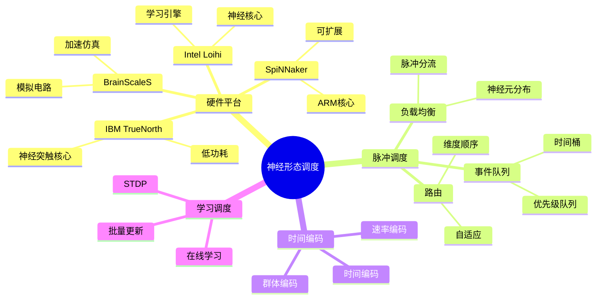

# 29 神经形态计算调度

> **主题编号**: 29
> **主题**: 神经形态计算调度
> **最后更新**: 2025-12-02
> **文档状态**: ✅ 完成

---

## 📋 目录

- [29 神经形态计算调度](#29-神经形态计算调度)
  - [📋 目录](#-目录)
  - [1 概述](#1-概述)
    - [1.1 核心洞察](#11-核心洞察)
    - [1.2 神经形态调度特性](#12-神经形态调度特性)
    - [1.3 形式化定义](#13-形式化定义)
  - [2 思维导图](#2-思维导图)
  - [3 神经形态硬件](#3-神经形态硬件)
    - [3.1 Intel Loihi架构](#31-intel-loihi架构)
    - [3.2 神经核心资源模型](#32-神经核心资源模型)
  - [4 脉冲神经网络调度](#4-脉冲神经网络调度)
    - [4.1 事件驱动调度器](#41-事件驱动调度器)
    - [4.2 神经元分配策略](#42-神经元分配策略)
    - [4.3 脉冲路由](#43-脉冲路由)
  - [5 时间编码调度](#5-时间编码调度)
    - [5.1 时间编码策略](#51-时间编码策略)
    - [5.2 STDP学习调度](#52-stdp学习调度)
  - [6 知识矩阵](#6-知识矩阵)
    - [6.1 神经形态硬件对比](#61-神经形态硬件对比)
    - [6.2 调度策略对比](#62-调度策略对比)
  - [7 跨视角链接](#7-跨视角链接)
    - [7.1 调度视角关联](#71-调度视角关联)
    - [7.2 形式语言视角关联](#72-形式语言视角关联)
  - [参考资源](#参考资源)

---

## 1 概述

### 1.1 核心洞察

神经形态计算（Neuromorphic Computing）模拟生物神经系统，采用**事件驱动**的脉冲神经网络（SNN）。调度策略必须适应**时间编码**、**异步通信**和**稀疏激活**的特性。

### 1.2 神经形态调度特性

| 特性 | 描述 | 调度挑战 |
|------|------|---------|
| **事件驱动** | 脉冲触发计算 | 异步调度 |
| **时间编码** | 信息在脉冲时间中 | 时序保持 |
| **稀疏激活** | 低活动率 | 动态资源分配 |
| **本地学习** | STDP等规则 | 在线更新 |
| **低功耗** | 类脑效率 | 能效优化 |

### 1.3 形式化定义

```text
神经形态调度系统 N = (S, C, T, L, σ)

其中：
  S: 脉冲事件集合 {(neuron_id, time, weight)}
  C: 神经核心集合 {core₁, core₂, ..., coreₙ}
  T: 路由拓扑
  L: 学习规则（STDP, Reward-modulated）
  σ: 调度函数 σ: S × C × T → Schedule

约束：
  ∀ spike s: latency(s) ≤ time_constant
  ∀ core c: spikes_per_tick(c) ≤ bandwidth_limit
```

---

## 2 思维导图



---

## 3 神经形态硬件

### 3.1 Intel Loihi架构

```text
Loihi 2 架构:

┌─────────────────────────────────────────────────────┐
│                    Loihi 2 芯片                      │
├─────────────────────────────────────────────────────┤
│  ┌─────────┐  ┌─────────┐  ┌─────────┐             │
│  │ 神经核心 │  │ 神经核心 │  │ 神经核心 │  ...        │
│  │ (128个) │  │         │  │         │             │
│  └────┬────┘  └────┬────┘  └────┬────┘             │
│       │            │            │                   │
│  ┌────┴────────────┴────────────┴────┐             │
│  │           网格路由网络              │             │
│  └────────────────┬──────────────────┘             │
│                   │                                 │
│  ┌────────────────┴──────────────────┐             │
│  │           学习引擎 (Lakemont)       │             │
│  └───────────────────────────────────┘             │
└─────────────────────────────────────────────────────┘

每个神经核心:
  - 最多1024个神经元
  - 本地SRAM存储突触权重
  - 可编程神经元模型
  - 片上学习（STDP）
```

### 3.2 神经核心资源模型

```python
# 神经核心资源模型
class NeuromorphicCore:
    def __init__(self, core_id, capacity):
        self.core_id = core_id
        self.max_neurons = capacity['neurons']  # 1024
        self.max_synapses = capacity['synapses']  # 128K
        self.max_axons = capacity['axons']  # 4096

        self.neurons = []
        self.synapses = []
        self.spike_queue = PriorityQueue()

    def allocate_neuron(self, neuron_config):
        """分配神经元资源"""
        if len(self.neurons) >= self.max_neurons:
            return None

        neuron_id = len(self.neurons)
        self.neurons.append(Neuron(neuron_id, neuron_config))
        return neuron_id

    def process_tick(self, current_time):
        """处理一个时间片"""
        # 收集到达的脉冲
        incoming_spikes = []
        while not self.spike_queue.empty():
            spike_time, spike = self.spike_queue.peek()
            if spike_time <= current_time:
                self.spike_queue.get()
                incoming_spikes.append(spike)
            else:
                break

        # 更新神经元状态
        output_spikes = []
        for neuron in self.neurons:
            # 累积输入
            neuron.integrate(incoming_spikes)

            # 检查是否发放脉冲
            if neuron.should_fire():
                output_spikes.append(Spike(
                    source=neuron.id,
                    time=current_time,
                    targets=neuron.axon_targets
                ))
                neuron.reset()

            # 泄漏
            neuron.leak()

        return output_spikes
```

---

## 4 脉冲神经网络调度

### 4.1 事件驱动调度器

```python
# SNN事件驱动调度器
class SNNScheduler:
    def __init__(self, network, hardware):
        self.network = network
        self.hardware = hardware
        self.event_queue = PriorityQueue()  # (time, event)
        self.current_time = 0

    def run(self, duration, input_spikes):
        """运行SNN仿真"""
        # 初始化输入脉冲
        for spike in input_spikes:
            self.event_queue.put((spike.time, spike))

        # 事件驱动主循环
        while self.current_time < duration:
            if self.event_queue.empty():
                self.current_time += 1
                continue

            # 获取下一个事件时间
            next_time, _ = self.event_queue.peek()

            # 处理当前时间片的所有事件
            if next_time <= self.current_time:
                events = self._collect_events(self.current_time)
                output_spikes = self._process_events(events)

                # 调度输出脉冲
                for spike in output_spikes:
                    self._route_spike(spike)

            self.current_time += 1

    def _process_events(self, events):
        """处理一批事件"""
        output_spikes = []

        # 按目标核心分组
        core_events = defaultdict(list)
        for event in events:
            core_id = self._get_core(event.target)
            core_events[core_id].append(event)

        # 并行处理各核心
        for core_id, spikes in core_events.items():
            core = self.hardware.cores[core_id]
            output = core.process_spikes(spikes, self.current_time)
            output_spikes.extend(output)

        return output_spikes

    def _route_spike(self, spike):
        """路由脉冲到目标"""
        for target in spike.targets:
            # 计算传播延迟
            source_core = self._get_core(spike.source)
            target_core = self._get_core(target)
            delay = self._routing_delay(source_core, target_core)

            # 创建到达事件
            arrival_time = self.current_time + delay
            arrival_event = SpikeArrival(
                source=spike.source,
                target=target,
                time=arrival_time,
                weight=self._get_weight(spike.source, target)
            )

            self.event_queue.put((arrival_time, arrival_event))
```

### 4.2 神经元分配策略

```python
# 神经元到核心的映射策略
class NeuronMapper:
    def __init__(self, hardware_topology):
        self.topology = hardware_topology
        self.core_assignments = {}

    def map_network(self, snn_network):
        """映射SNN到硬件"""
        # 策略1: 最小化通信
        self._locality_aware_mapping(snn_network)

        # 策略2: 负载均衡
        self._balance_load()

        return self.core_assignments

    def _locality_aware_mapping(self, network):
        """局部性感知映射"""
        # 构建神经元连接图
        connectivity = self._build_connectivity_graph(network)

        # 使用图分区算法
        partitions = self._partition_graph(
            connectivity,
            num_parts=len(self.topology.cores)
        )

        # 分配到核心
        for partition_id, neurons in enumerate(partitions):
            core = self.topology.cores[partition_id]
            for neuron in neurons:
                if core.has_capacity():
                    self.core_assignments[neuron] = core.id
                else:
                    # 溢出到邻近核心
                    neighbor = self._find_neighbor_with_capacity(core)
                    self.core_assignments[neuron] = neighbor.id

    def _balance_load(self):
        """负载均衡调整"""
        core_loads = defaultdict(int)
        for neuron, core_id in self.core_assignments.items():
            core_loads[core_id] += 1

        avg_load = len(self.core_assignments) / len(self.topology.cores)

        # 从过载核心迁移神经元
        for core_id, load in core_loads.items():
            if load > avg_load * 1.2:  # 超载20%
                excess = int(load - avg_load)
                self._migrate_neurons(core_id, excess)
```

### 4.3 脉冲路由

```python
# 神经形态芯片脉冲路由
class SpikeRouter:
    def __init__(self, mesh_topology):
        self.topology = mesh_topology
        self.routing_tables = self._build_routing_tables()

    def route_spike(self, spike, source_core, target_cores):
        """路由脉冲到多个目标"""
        # 多播路由
        routing_tree = self._build_multicast_tree(
            source_core, target_cores
        )

        # 生成路由包
        packets = []
        for path in routing_tree:
            packet = SpikePacket(
                spike=spike,
                path=path,
                hops=len(path) - 1
            )
            packets.append(packet)

        return packets

    def _build_multicast_tree(self, source, targets):
        """构建多播路由树"""
        # 使用维度顺序路由 (DOR)
        paths = []
        for target in targets:
            path = self._dimension_order_route(source, target)
            paths.append(path)

        # 合并共同前缀
        return self._merge_paths(paths)

    def _dimension_order_route(self, source, target):
        """XY维度顺序路由"""
        path = [source]
        current = source

        # 先X方向
        while current.x != target.x:
            if current.x < target.x:
                current = self.topology.get_neighbor(current, 'east')
            else:
                current = self.topology.get_neighbor(current, 'west')
            path.append(current)

        # 再Y方向
        while current.y != target.y:
            if current.y < target.y:
                current = self.topology.get_neighbor(current, 'north')
            else:
                current = self.topology.get_neighbor(current, 'south')
            path.append(current)

        return path
```

---

## 5 时间编码调度

### 5.1 时间编码策略

```text
时间编码方式:

1. 速率编码 (Rate Coding):
   信息 ∝ 脉冲频率
   简单但效率低

2. 时间编码 (Temporal Coding):
   信息在脉冲精确时间
   高效但对噪声敏感

3. 时间到首脉冲 (Time-to-First-Spike):
   信息在首个脉冲时间
   快速响应

4. 群体编码 (Population Coding):
   信息在神经元群体活动模式
   鲁棒性高

调度影响:
- 速率编码: 需要较长时间窗口
- 时间编码: 需要精确时间同步
- 群体编码: 需要并行处理能力
```

### 5.2 STDP学习调度

```python
# STDP (Spike-Timing-Dependent Plasticity) 调度
class STDPScheduler:
    def __init__(self, tau_plus=20, tau_minus=20, a_plus=0.1, a_minus=0.12):
        self.tau_plus = tau_plus    # LTP时间常数
        self.tau_minus = tau_minus  # LTD时间常数
        self.a_plus = a_plus        # LTP幅度
        self.a_minus = a_minus      # LTD幅度

        self.spike_history = defaultdict(list)  # 神经元脉冲历史

    def record_spike(self, neuron_id, time):
        """记录脉冲"""
        self.spike_history[neuron_id].append(time)

        # 保持历史窗口
        window = max(self.tau_plus, self.tau_minus) * 5
        self.spike_history[neuron_id] = [
            t for t in self.spike_history[neuron_id]
            if time - t < window
        ]

    def compute_weight_update(self, pre_id, post_id, synapse):
        """计算权重更新"""
        pre_spikes = self.spike_history[pre_id]
        post_spikes = self.spike_history[post_id]

        delta_w = 0.0

        for t_pre in pre_spikes:
            for t_post in post_spikes:
                dt = t_post - t_pre

                if dt > 0:
                    # LTP: 前脉冲先于后脉冲
                    delta_w += self.a_plus * exp(-dt / self.tau_plus)
                elif dt < 0:
                    # LTD: 后脉冲先于前脉冲
                    delta_w -= self.a_minus * exp(dt / self.tau_minus)

        return delta_w

    def batch_update(self, network, batch_size=1000):
        """批量权重更新"""
        updates = []

        for synapse in network.synapses:
            delta_w = self.compute_weight_update(
                synapse.pre, synapse.post, synapse
            )
            if abs(delta_w) > 1e-6:
                updates.append((synapse, delta_w))

        # 批量应用更新
        for synapse, delta_w in updates[:batch_size]:
            synapse.weight = clip(
                synapse.weight + delta_w,
                synapse.w_min, synapse.w_max
            )
```

---

## 6 知识矩阵

### 6.1 神经形态硬件对比

| 平台 | 神经元数 | 突触数 | 功耗 | 特点 |
|------|---------|-------|------|------|
| **Loihi 2** | 1M | 120M | <1W | 可编程学习 |
| **TrueNorth** | 1M | 256M | 70mW | 超低功耗 |
| **SpiNNaker 2** | 可扩展 | 可扩展 | 变化 | 大规模 |
| **BrainScaleS 2** | 512 | 130K | ~W | 模拟加速 |

### 6.2 调度策略对比

| 策略 | 目标 | 适用场景 | 复杂度 |
|------|------|---------|-------|
| **事件驱动** | 延迟 | 稀疏网络 | O(events) |
| **时钟驱动** | 吞吐 | 密集网络 | O(neurons) |
| **混合** | 平衡 | 一般应用 | O(n log n) |

---

## 7 跨视角链接

### 7.1 调度视角关联

| 相关主题 | 关联内容 | 链接 |
|---------|---------|------|
| GPU调度 | 异构计算 | [16_GPU与加速器调度](../16_GPU与加速器调度/) |
| AI调度 | 神经网络 | [10_AI驱动调度](../10_AI驱动调度/) |
| 量子调度 | 新型计算 | [28_量子计算调度](../28_量子计算调度/) |

### 7.2 形式语言视角关联

| 形式语言概念 | 神经形态对应 | 映射说明 |
|------------|-------------|---------|
| **事件类型** | 脉冲事件 | 异步通信 |
| **时序类型** | 时间编码 | 时间约束 |
| **概率类型** | 随机脉冲 | 不确定性 |

---

## 参考资源

1. [Intel Loihi](https://www.intel.com/content/www/us/en/research/neuromorphic-computing.html)
2. [SpiNNaker Project](http://apt.cs.manchester.ac.uk/projects/SpiNNaker/)
3. [Nengo Framework](https://www.nengo.ai/)
4. [Brian2 Simulator](https://brian2.readthedocs.io/)

---

**返回**: [调度视角主索引](../README.md)
