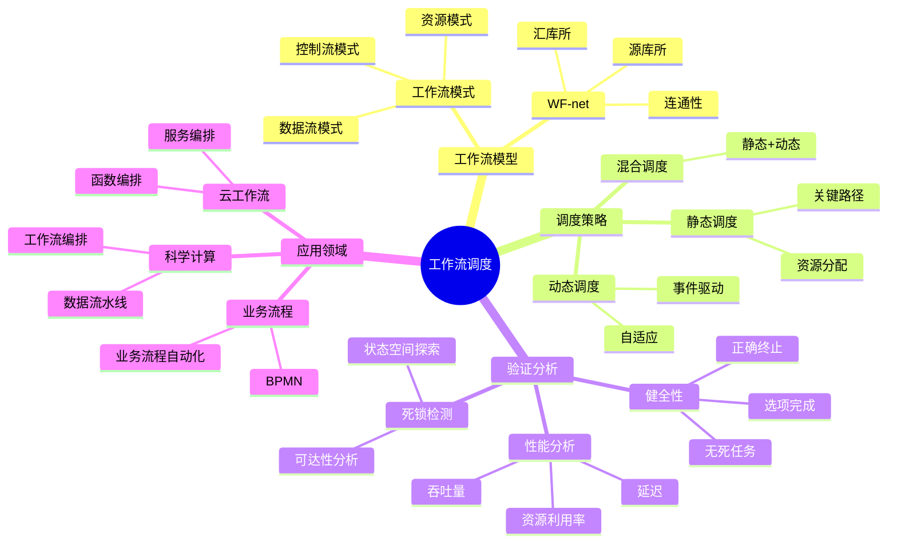

# 30 工作流调度

> **主题编号**: 30
> **主题**: 工作流调度
> **最后更新**: 2025-12-02
> **文档状态**: ✅ 完成

---

## 📋 目录

- [30 工作流调度](#30-工作流调度)
  - [📋 目录](#-目录)
  - [1 概述](#1-概述)
    - [1.1 核心洞察](#11-核心洞察)
    - [1.2 工作流调度特性](#12-工作流调度特性)
    - [1.3 形式化定义](#13-形式化定义)
    - [1.4 核心概念精确定义](#14-核心概念精确定义)
      - [1.4.1 工作流（Workflow）](#141-工作流workflow)
      - [1.4.2 工作流网（Workflow Net, WF-net）](#142-工作流网workflow-net-wf-net)
      - [1.4.3 工作流健全性（Soundness）](#143-工作流健全性soundness)
    - [1.5 设计原理与动机](#15-设计原理与动机)
      - [1.5.1 为什么使用Petri网建模工作流？](#151-为什么使用petri网建模工作流)
      - [1.5.2 工作流调度的优化目标](#152-工作流调度的优化目标)
  - [2 子主题导航](#2-子主题导航)
    - [2.1 30.1 工作流Petri网模型](#21-301-工作流petri网模型)
    - [2.2 30.2 工作流模式](#22-302-工作流模式)
    - [2.3 30.3 Petri网调度模型](#23-303-petri网调度模型)
    - [2.4 30.4 工作流验证](#24-304-工作流验证)
    - [2.5 30.5 工作流优化](#25-305-工作流优化)
  - [3 思维导图](#3-思维导图)
  - [4 Petri网工作流模型](#4-petri网工作流模型)
    - [3.1 WF-net定义](#31-wf-net定义)
    - [3.2 工作流模式](#32-工作流模式)
      - [3.2.1 基本控制流模式](#321-基本控制流模式)
      - [3.2.2 高级控制流模式](#322-高级控制流模式)
    - [3.3 工作流性质](#33-工作流性质)
      - [3.3.1 健全性（Soundness）](#331-健全性soundness)
      - [3.3.2 弱健全性（Weak Soundness）](#332-弱健全性weak-soundness)
      - [3.3.3 松弛健全性（Relaxed Soundness）](#333-松弛健全性relaxed-soundness)
  - [5 工作流调度算法](#5-工作流调度算法)
    - [4.1 静态调度](#41-静态调度)
    - [4.2 动态调度](#42-动态调度)
    - [4.3 混合调度](#43-混合调度)
  - [6 工作流验证](#6-工作流验证)
    - [5.1 健全性验证](#51-健全性验证)
    - [5.2 死锁检测](#52-死锁检测)
    - [5.3 性能分析](#53-性能分析)
  - [7 关系属性与依赖分析](#7-关系属性与依赖分析)
    - [6.1 工作流之间的关系](#61-工作流之间的关系)
      - [6.1.1 工作流组合](#611-工作流组合)
      - [6.1.2 工作流层次](#612-工作流层次)
    - [6.2 任务依赖关系](#62-任务依赖关系)
      - [6.2.1 依赖类型](#621-依赖类型)
      - [6.2.2 依赖图](#622-依赖图)
    - [6.3 资源约束关系](#63-资源约束关系)
      - [6.3.1 资源类型](#631-资源类型)
      - [6.3.2 资源分配策略](#632-资源分配策略)
  - [8 跨视角链接](#8-跨视角链接)
    - [7.1 调度视角关联](#71-调度视角关联)
    - [7.2 形式语言视角关联](#72-形式语言视角关联)
  - [参考资源](#参考资源)

---

## 1 概述

### 1.1 核心洞察

工作流调度是在**业务流程**中协调多个任务的执行顺序和资源分配。Petri网作为工作流的形式化模型，提供了**可达性分析**、**死锁检测**和**性能评估**的数学基础。工作流调度必须平衡**正确性**、**效率**和**灵活性**。

### 1.2 工作流调度特性

| 特性 | 描述 | 调度挑战 |
|------|------|---------|
| **任务依赖** | 任务间存在执行顺序约束 | 依赖图调度 |
| **并发执行** | 多个任务可以并行执行 | 资源竞争 |
| **条件分支** | 根据条件选择执行路径 | 动态调度 |
| **循环结构** | 任务可能重复执行 | 终止性保证 |
| **资源约束** | 任务需要特定资源 | 资源分配 |

### 1.3 形式化定义

```text
工作流调度系统 W = (WF, R, σ, C)

其中：
  WF: 工作流网（Workflow Net）
  R: 资源集合 {r₁, r₂, ..., rₙ}
  σ: 调度函数 σ: Task × Resource → Schedule
  C: 约束集合（时间、资源、依赖）

工作流网WF = (P, T, F, W, M₀)：
  - 存在唯一源库所i：•i = ∅
  - 存在唯一汇库所o：o• = ∅
  - 所有节点在从i到o的路径上
```

### 1.4 核心概念精确定义

#### 1.4.1 工作流（Workflow）

**定义 1.1**：工作流是一个**业务流程的形式化表示**，由一系列任务和它们之间的依赖关系组成。

**形式化表述**：

```text
工作流W = (Tasks, Dependencies, Resources, Constraints)

其中：
  Tasks: 任务集合
  Dependencies: 依赖关系集合，Dependencies ⊆ Tasks × Tasks
  Resources: 资源集合
  Constraints: 约束集合（时间、资源、优先级）
```

**Petri网表示**：

```text
工作流W对应Petri网N = (P, T, F)：
  - 任务 ↔ 变迁
  - 状态 ↔ 库所
  - 依赖关系 ↔ 流关系
```

#### 1.4.2 工作流网（Workflow Net, WF-net）

**定义 1.2**：工作流网是满足特定条件的Petri网。

**WF-net条件**：

```text
1. 存在唯一源库所i：•i = ∅（没有输入变迁）
2. 存在唯一汇库所o：o• = ∅（没有输出变迁）
3. 每个节点都在从i到o的路径上（连通性）
```

**形式化表述**：

```text
Petri网N = (P, T, F)是WF-net，当且仅当：

  1. ∃!i ∈ P: •i = ∅
  2. ∃!o ∈ P: o• = ∅
  3. ∀x ∈ P ∪ T: i →* x →* o

其中→*表示可达关系。
```

#### 1.4.3 工作流健全性（Soundness）

**定义 1.3**：工作流是健全的，当且仅当满足以下条件：

```text
1. 选项完成（Option to Complete）：
   从初始标记[i]，可以到达最终标记[o]

2. 正确终止（Proper Completion）：
   如果到达标记M使得M(o) > 0，则M = [o]（只有o有标记）

3. 无死任务（No Dead Tasks）：
   所有变迁最终都可以点火
```

**形式化表述**：

```text
WF-net N是健全的，当且仅当：

  1. [i] →* [o]（可达性）
  2. ∀M: ([i] →* M ∧ M(o) > 0) ⟹ M = [o]（正确终止）
  3. ∀t ∈ T: ∃M, M': [i] →* M[t⟩M'（无死任务）
```

### 1.5 设计原理与动机

#### 1.5.1 为什么使用Petri网建模工作流？

**核心优势**：

1. **形式化基础**：

   ```text
   Petri网提供严格的数学基础：
     - 可达性分析：判断工作流是否可完成
     - 死锁检测：自动检测死锁和活锁
     - 性质验证：形式化验证工作流性质
   ```

2. **并发自然表示**：

   ```text
   传统方法：需要显式枚举所有并发状态
   Petri网：通过多个库所和变迁自然表示并发

   优势：状态空间从O(2^n)降低到O(n)
   ```

3. **工具支持**：

   ```text
   现有工具：
     - ProM：过程挖掘和分析
     - WOFLAN：健全性检查
     - CPN Tools：着色Petri网建模
   ```

#### 1.5.2 工作流调度的优化目标

**多目标优化**：

1. **最小化完成时间**：

   ```text
   minimize: T_completion = max{task.end_time | task ∈ W}
   ```

2. **最大化资源利用率**：

   ```text
   maximize: Utilization = Σ{task.duration | task ∈ W} / (|R| × T_completion)
   ```

3. **最小化成本**：

   ```text
   minimize: Cost = Σ{task.cost × resource.price | task ∈ W}
   ```

4. **满足约束**：

   ```text
   subject to:
     - 依赖约束：task₁.end ≤ task₂.start（如果task₁ → task₂）
     - 资源约束：Σ{task.resource | task running at t} ≤ resource.capacity
     - 时间约束：task.start ≥ task.earliest_start
     - 截止时间：task.end ≤ task.deadline
   ```

---

## 2 子主题导航

### 2.1 [30.1 工作流Petri网模型](30.1_工作流Petri网模型.md)

- WF-net精确定义
- 扩展WF-net
- 工作流Petri网表示

### 2.2 [30.2 工作流模式](30.2_工作流模式.md)

- WfMC 43种工作流模式
- 控制流模式详解
- 数据流模式
- 资源模式

### 2.3 [30.3 Petri网调度模型](30.3_Petri网调度模型.md)

- 调度Petri网定义
- 调度策略Petri网表示
- 资源调度Petri网

### 2.4 [30.4 工作流验证](30.4_工作流验证.md)

- 健全性验证
- 死锁检测
- 性能验证

### 2.5 [30.5 工作流优化](30.5_工作流优化.md)

- 时间优化
- 资源优化
- 成本优化

---

## 3 思维导图



---

## 4 Petri网工作流模型

### 3.1 WF-net定义

**定义 3.1**（WF-net）：

```text
Petri网N = (P, T, F)是工作流网（WF-net），当且仅当：

1. 存在唯一源库所i ∈ P：
   •i = ∅（没有输入变迁）

2. 存在唯一汇库所o ∈ P：
   o• = ∅（没有输出变迁）

3. 每个节点都在从i到o的路径上：
   ∀x ∈ P ∪ T: i →* x →* o

   其中→*表示通过流关系的可达关系
```

**扩展WF-net**：

```text
扩展工作流网（Extended WF-net）添加了：
  - 输入库所集合I（外部输入）
  - 输出库所集合O（外部输出）

形式化：EWF-net = (P, T, F, I, O)
```

### 3.2 工作流模式

#### 3.2.1 基本控制流模式

**WfMC定义的43种工作流模式**，主要包括：

1. **顺序（Sequence）**：

   ```text
   任务按顺序执行：A → B → C

   Petri网表示：
     p₁ →[A]→ p₂ →[B]→ p₃ →[C]→ p₄
   ```

2. **并行分支（Parallel Split）**：

   ```text
   任务A后并行执行B和C：A → (B || C)

   Petri网表示：
     p₁ →[A]→ p₂
     p₂ →[B]→ p₃
     p₂ →[C]→ p₄
   ```

3. **同步合并（Synchronization）**：

   ```text
   等待B和C都完成后执行D：(B || C) → D

   Petri网表示：
     p₃ →[D]→ p₅
     p₄ →[D]→ p₅
   ```

4. **排他选择（Exclusive Choice）**：

   ```text
   根据条件选择执行B或C：A → (B ⊕ C)

   Petri网表示：
     p₁ →[A]→ p₂
     p₂ →[B]→ p₃
     p₂ →[C]→ p₄
   ```

5. **简单合并（Simple Merge）**：

   ```text
   B或C完成后执行D：(B ⊕ C) → D

   Petri网表示：
     p₃ →[D]→ p₅
     p₄ →[D]→ p₅
   ```

#### 3.2.2 高级控制流模式

**多选择（Multi-Choice）**：

```text
根据多个条件选择执行路径：A → (B | C | D)

Petri网表示：使用守卫函数控制变迁使能
```

**延迟选择（Deferred Choice）**：

```text
延迟到运行时选择执行路径

Petri网表示：使用时间Petri网或随机Petri网
```

**取消活动（Cancel Activity）**：

```text
可以取消正在执行的活动

Petri网表示：添加取消变迁
```

### 3.3 工作流性质

#### 3.3.1 健全性（Soundness）

**定义 3.2**（健全性）：

```text
WF-net N是健全的，当且仅当：

1. 选项完成：从[i]可以到达[o]
2. 正确终止：如果M(o) > 0，则M = [o]
3. 无死任务：所有变迁都可以点火
```

**验证算法**：

```text
1. 构造可达图（Reachability Graph）
2. 检查是否存在从[i]到[o]的路径
3. 检查所有可达标记是否满足正确终止
4. 检查所有变迁是否在可达图中出现
```

#### 3.3.2 弱健全性（Weak Soundness）

**定义 3.3**（弱健全性）：

```text
WF-net N是弱健全的，当且仅当：

1. 从[i]可以到达[o]
2. 从[o]可以回到[i]（通过重置）

弱健全性允许工作流重复执行。
```

#### 3.3.3 松弛健全性（Relaxed Soundness）

**定义 3.4**（松弛健全性）：

```text
WF-net N是松弛健全的，当且仅当：

对于每个变迁t，存在执行序列：
  [i] →* M[t⟩M' →* [o]

允许某些执行路径不完整。
```

---

## 5 工作流调度算法

### 4.1 静态调度

**定义 4.1**（静态调度）：

```text
静态调度在编译时或部署时确定所有任务的执行顺序和资源分配。

特点：
  - 调度决策提前做出
  - 不需要运行时决策
  - 适合确定性工作流
```

**关键路径算法（CPM）**：

```text
1. 构建任务依赖图
2. 计算最早开始时间（EST）和最晚开始时间（LST）
3. 识别关键路径（EST = LST的路径）
4. 优先调度关键路径上的任务
```

**算法复杂度**：O(V + E)，其中V是任务数，E是依赖边数。

### 4.2 动态调度

**定义 4.2**（动态调度）：

```text
动态调度在运行时根据当前状态做出调度决策。

特点：
  - 调度决策在运行时做出
  - 可以适应动态变化
  - 适合不确定性工作流
```

**事件驱动调度**：

```text
1. 监听工作流事件（任务完成、资源释放等）
2. 当事件发生时，重新评估可调度任务
3. 根据调度策略选择任务执行
```

### 4.3 混合调度

**定义 4.3**（混合调度）：

```text
混合调度结合静态和动态调度的优点：
  - 静态部分：关键路径任务提前调度
  - 动态部分：非关键任务运行时调度
```

---

## 6 工作流验证

### 5.1 健全性验证

**验证方法**：

1. **可达性分析**：

   ```text
   构造可达图，检查是否存在从[i]到[o]的路径
   ```

2. **不变性分析**：

   ```text
   使用P-不变量和T-不变量验证性质
   ```

3. **模型检查**：

   ```text
   使用CTL/LTL公式验证性质：
     - AG([i] → EF([o]))：选项完成
     - AG(M(o) > 0 → M = [o])：正确终止
   ```

### 5.2 死锁检测

**死锁定义**：

```text
工作流死锁：存在可达标记M，使得：
  1. M ≠ [o]（未完成）
  2. 不存在使能的变迁（无法继续）
```

**检测算法**：

```text
1. 构造可达图
2. 检查是否存在死锁标记
3. 如果存在，分析死锁原因
```

### 5.3 性能分析

**性能指标**：

1. **吞吐量（Throughput）**：

   ```text
   Throughput = 完成的工作流实例数 / 时间
   ```

2. **平均延迟（Average Latency）**：

   ```text
   Latency = 平均完成时间 - 平均开始时间
   ```

3. **资源利用率（Resource Utilization）**：

   ```text
   Utilization = 实际使用时间 / 总可用时间
   ```

---

## 7 关系属性与依赖分析

### 6.1 工作流之间的关系

#### 6.1.1 工作流组合

**定义 6.1**（工作流组合）：

```text
两个工作流W₁和W₂可以组合：

1. 顺序组合：W₁; W₂
   - W₁的汇库所连接到W₂的源库所

2. 并行组合：W₁ || W₂
   - 共享源库所和汇库所

3. 选择组合：W₁ ⊕ W₂
   - 通过选择变迁连接
```

#### 6.1.2 工作流层次

**定义 6.2**（工作流层次）：

```text
工作流可以嵌套，形成层次结构：

顶层工作流：W_top
  ├─ 子工作流：W_sub₁
  │   ├─ 任务：T₁, T₂
  │   └─ 子工作流：W_sub₁₁
  └─ 子工作流：W_sub₂
```

### 6.2 任务依赖关系

#### 6.2.1 依赖类型

**定义 6.3**（任务依赖）：

```text
任务依赖关系：

1. 数据依赖：task₂需要task₁的输出数据
2. 控制依赖：task₂的执行依赖于task₁的结果
3. 资源依赖：task₂需要task₁释放的资源
4. 时间依赖：task₂必须在task₁之后执行
```

#### 6.2.2 依赖图

**定义 6.4**（依赖图）：

```text
任务依赖图D = (Tasks, Edges)：

  - 节点：任务
  - 边：依赖关系
  - 边权重：依赖强度或延迟
```

**关键路径**：

```text
关键路径是依赖图中最长的路径，决定了工作流的最短完成时间。
```

### 6.3 资源约束关系

#### 6.3.1 资源类型

**定义 6.5**（资源类型）：

```text
资源类型：

1. 可重用资源：可以多次使用（CPU、内存）
2. 消耗性资源：使用后消耗（材料、能量）
3. 独占资源：同时只能一个任务使用（打印机）
4. 共享资源：可以多个任务共享（数据库连接池）
```

#### 6.3.2 资源分配策略

**定义 6.6**（资源分配）：

```text
资源分配策略：

1. 先来先服务（FCFS）
2. 优先级调度
3. 公平份额调度
4. 最短作业优先（SJF）
5. 最早截止时间优先（EDF）
```

---

## 8 跨视角链接

### 7.1 调度视角关联

| 相关主题 | 关联内容 | 链接 |
|---------|---------|------|
| 调度模型 | 基础调度理论 | [06_调度模型](../06_调度模型/) |
| Petri网理论 | 形式化基础 | [09.5_Petri网理论](../../formal_lang_view/09_形式化理论/09.5_Petri网理论.md) |
| 分布式调度 | 分布式工作流 | [06.4_分布式系统调度](../06_调度模型/06.4_分布式系统调度.md) |

### 7.2 形式语言视角关联

| 形式语言概念 | 工作流对应 | 映射说明 |
|------------|----------|---------|
| **类型系统** | 工作流模式 | 模式即类型 |
| **函数组合** | 工作流组合 | 顺序/并行组合 |
| **状态机** | 工作流状态 | 状态转换 |
| **Petri网** | 工作流模型 | 直接对应 |

---

## 参考资源

1. [Workflow Patterns](http://www.workflowpatterns.com/) - WfMC 43种模式
2. [ProM Framework](https://www.promtools.org/) - 过程挖掘工具
3. [WOFLAN](http://woflan.org/) - 工作流分析工具
4. [CPN Tools](https://cpntools.org/) - 着色Petri网工具

---

**返回**: [调度视角主索引](../README.md)
