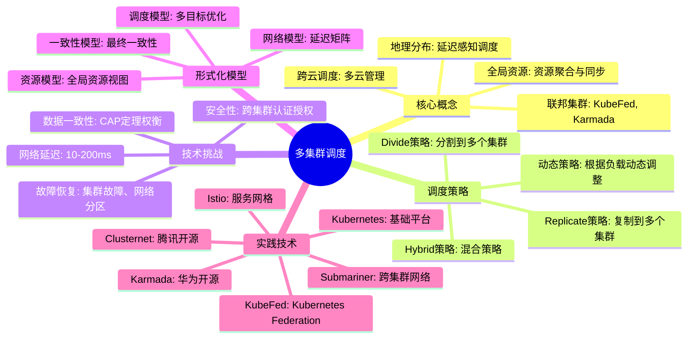

# 31 多集群调度（Multi-Cluster Scheduling）

> **主题**: 31. 多集群调度
> **覆盖**: 联邦集群、跨云调度、多云管理、全局资源调度、地理分布式调度

---

## 📋 目录

- [31 多集群调度（Multi-Cluster Scheduling）](#31-多集群调度multi-cluster-scheduling)
  - [📋 目录](#-目录)
  - [1 概述](#1-概述)
    - [1.1 多集群调度的特征](#11-多集群调度的特征)
    - [1.2 核心挑战](#12-核心挑战)
  - [2 子主题导航](#2-子主题导航)
  - [3 形式化模型](#3-形式化模型)
    - [3.1 多集群调度问题定义](#31-多集群调度问题定义)
    - [3.2 核心概念矩阵](#32-核心概念矩阵)
  - [4 调度层级](#4-调度层级)
  - [5 跨集群资源视图](#5-跨集群资源视图)
  - [6 调度策略分类](#6-调度策略分类)
    - [6.1 Replicate策略（复制策略）](#61-replicate策略复制策略)
    - [6.2 Divide策略（分割策略）](#62-divide策略分割策略)
    - [6.3 Hybrid策略（混合策略）](#63-hybrid策略混合策略)
  - [7 关系属性与依赖分析](#7-关系属性与依赖分析)
    - [7.1 与其他调度模型的关系](#71-与其他调度模型的关系)
    - [7.2 技术依赖](#72-技术依赖)
    - [7.3 形式化对应](#73-形式化对应)
  - [8 跨视角链接](#8-跨视角链接)
    - [8.1 形式语言视角](#81-形式语言视角)
    - [8.2 调度视角](#82-调度视角)
    - [8.3 Petri网视角](#83-petri网视角)
  - [9 思维导图](#9-思维导图)
  - [10 2025年最新技术](#10-2025年最新技术)
  - [11 相关主题](#11-相关主题)

---

## 1 概述

### 1.1 多集群调度的特征

**多集群调度（Multi-Cluster Scheduling）** 是指在多个Kubernetes集群或云平台之间进行资源调度和工作负载分发的过程。

**核心特征**：

- **地理分布**：集群分布在不同地理位置（区域、国家、大洲）
- **异构性**：不同集群可能有不同的资源类型、配置和性能
- **网络延迟**：跨集群通信存在显著的网络延迟（10-200ms）
- **自治性**：每个集群独立运行，具有自己的调度器和控制平面
- **容错性**：单个集群故障不影响其他集群

### 1.2 核心挑战

多集群调度面临以下核心挑战：

1. **全局资源视图**：如何聚合和管理多个集群的资源
2. **调度决策**：如何决定工作负载分配到哪些集群
3. **网络延迟**：如何处理跨集群的高网络延迟
4. **数据一致性**：如何保证跨集群的数据一致性（CAP定理）
5. **故障恢复**：如何处理集群故障和网络分区

---

## 2 子主题导航

| 编号 | 主题 | 说明 |
|------|------|------|
| 31.1 | [联邦集群架构](31.1_联邦集群架构.md) | Kubernetes Federation、KubeFed架构 |
| 31.2 | [跨云调度策略](31.2_跨云调度策略.md) | Karmada、Clusternet调度策略 |
| 31.3 | [全局资源管理](31.3_全局资源管理.md) | 资源聚合、资源视图、资源同步 |
| 31.4 | [地理分布式调度](31.4_地理分布式调度.md) | 延迟感知调度、数据本地性、边缘-云协同 |
| 31.5 | [多集群网络与服务网格](31.5_多集群网络与服务网格.md) | 跨集群通信、服务发现、流量管理 |

---

## 3 形式化模型

### 3.1 多集群调度问题定义

**定义31.1（多集群调度问题）**：

$$
\text{MultiClusterScheduling} = (C, W, N, S, O)
$$

其中：

- $C = \{c_1, c_2, \ldots, c_n\}$：集群集合
- $W = \{w_1, w_2, \ldots, w_m\}$：工作负载集合
- $N$：网络拓扑和延迟矩阵 $N_{ij}$ 表示集群 $i$ 到集群 $j$ 的网络延迟
- $S$：调度策略（Replicate、Divide、Hybrid）
- $O$：优化目标（最小化延迟、最大化可用性、成本优化）

**定义31.2（集群资源模型）**：

每个集群 $c_i$ 具有以下资源属性：

$$
c_i = (\text{CPU}_i, \text{Memory}_i, \text{Storage}_i, \text{GPU}_i, \text{Location}_i, \text{Cost}_i)
$$

**定义31.3（工作负载模型）**：

每个工作负载 $w_j$ 具有以下属性：

$$
w_j = (\text{CPU\_req}_j, \text{Memory\_req}_j, \text{Replicas}_j, \text{Affinity}_j, \text{SLO}_j)
$$

### 3.2 核心概念矩阵

| **调度类型** | **调度单元** | **延迟范围** | **优化目标** | **主要约束** |
|------------|------------|------------|------------|------------|
| **单集群调度** | Pod | 微秒-毫秒 | 资源利用率 | 单集群资源 |
| **跨区域调度** | Deployment | 10-50ms | 延迟+可用性 | 区域资源 |
| **跨云调度** | Application | 50-200ms | 成本+性能 | 多云资源 |
| **全球调度** | Service | 100-500ms | 高可用+合规 | 地理分布 |

---

## 4 调度层级

```text
全局调度器（Global Scheduler）
  ↓ [集群选择] ~1-10ms
多个集群（Cluster 1, 2, ..., n）
  ↓ [本地调度] ~1-5ms
节点调度（Node Scheduling）
  ↓ [Pod启动] ~100ms-1s
工作负载运行（Workload Running）
```

**关键洞察**：多集群调度的延迟主要由网络延迟决定，而不是调度算法本身的计算时间。

---

## 5 跨集群资源视图

**定理31.1（全局资源聚合）**：

给定 $n$ 个集群 $C = \{c_1, \ldots, c_n\}$，全局资源视图 $R_{global}$ 定义为：

$$
R_{global} = \bigcup_{i=1}^{n} R_{c_i}
$$

其中 $R_{c_i}$ 是集群 $c_i$ 的资源视图。

**定理31.2（资源可用性）**：

集群 $c_i$ 的资源可用性 $A_{c_i}$ 定义为：

$$
A_{c_i} = \frac{R_{available}}{R_{total}}
$$

全局资源可用性 $A_{global}$ 定义为：

$$
A_{global} = \frac{\sum_{i=1}^{n} R_{available,i}}{\sum_{i=1}^{n} R_{total,i}}
$$

---

## 6 调度策略分类

### 6.1 Replicate策略（复制策略）

**定义**：将工作负载复制到多个集群。

$$
\forall c_i \in \text{SelectedClusters}, \text{schedule}(w, c_i)
$$

**优势**：

- 高可用性：多集群部署，单集群故障不影响服务
- 负载分散：分散到多个集群，降低单点压力
- 地理分布：支持地理分布，降低用户访问延迟

**适用场景**：

- 关键业务应用（高可用性需求）
- 全球服务（低延迟需求）
- 灾难恢复（容错需求）

### 6.2 Divide策略（分割策略）

**定义**：将工作负载分割到多个集群。

$$
\sum_{c_i \in C} f_{c_i}(w) = 1, \quad f_{c_i}(w) \in [0, 1]
$$

其中 $f_{c_i}(w)$ 是工作负载 $w$ 在集群 $c_i$ 中的比例。

**优势**：

- 资源优化：充分利用各集群资源
- 成本优化：选择成本最低的集群
- 性能优化：选择性能最好的集群

**适用场景**：

- 批量计算（资源密集型）
- 成本敏感应用
- 资源受限环境

### 6.3 Hybrid策略（混合策略）

**定义**：结合Replicate和Divide策略。

$$
\text{Hybrid}(w) = \alpha \cdot \text{Replicate}(w) + (1 - \alpha) \cdot \text{Divide}(w)
$$

其中 $\alpha \in [0, 1]$ 是权重参数。

**优势**：

- 灵活性高：根据需求调整策略
- 平衡性好：平衡可用性和成本

**适用场景**：

- 复杂应用（多种需求）
- 动态环境（负载变化）

---

## 7 关系属性与依赖分析

### 7.1 与其他调度模型的关系

| 调度模型 | 关系 | 说明 |
|---------|------|------|
| **Kubernetes Pod调度** | 基础 | 多集群调度建立在单集群Pod调度之上 |
| **分布式系统调度** | 扩展 | 多集群调度是分布式系统调度的特殊形式 |
| **边缘计算调度** | 协同 | 边缘-云多集群调度协同 |
| **Serverless调度** | 互补 | Serverless可跨多集群调度 |

### 7.2 技术依赖

```text
多集群调度
├── Kubernetes
│   ├── kube-apiserver（API服务器）
│   ├── kube-scheduler（调度器）
│   └── kube-controller-manager（控制器）
├── 联邦技术
│   ├── KubeFed（Kubernetes Federation）
│   ├── Karmada（华为开源）
│   └── Clusternet（腾讯开源）
├── 服务网格
│   ├── Istio（跨集群服务通信）
│   └── Linkerd（轻量级服务网格）
└── 网络技术
    ├── Submariner（跨集群网络）
    ├── Cilium Cluster Mesh（eBPF网络）
    └── Skupper（服务互联）
```

### 7.3 形式化对应

| 多集群概念 | 形式语言概念 | Petri网概念 |
|-----------|-------------|------------|
| 集群 | 类型上下文 | 子网 |
| 工作负载 | 类型实例 | Token |
| 调度策略 | 类型推导规则 | 变迁规则 |
| 资源约束 | 类型约束 | 库所容量 |
| 网络延迟 | 计算复杂度 | 变迁延迟 |

---

## 8 跨视角链接

### 8.1 形式语言视角

- [05.3 依赖类型](../../formal_lang_view/05_高级类型特性/05.3_依赖类型.md) - 资源依赖的形式化
- [09.4 应用范畴论](../../formal_lang_view/09_形式化理论/09.4_应用范畴论.md) - 集群间的函子映射
- [03.1 控制流映射](../../formal_lang_view/03_程序控制/03.1_控制流映射.md) - 跨集群控制流

### 8.2 调度视角

- [06.4 分布式系统调度](../06_调度模型/06.4_分布式系统调度.md) - 分布式调度基础
- [11.4 技术架构层调度](../11_企业架构调度/11.4_技术架构层调度.md) - 跨云调度实践
- [15.1 网络包调度](../15_网络调度系统/15.1_网络包调度.md) - 跨集群网络调度
- [20.1 边缘计算调度](../20_边缘与移动调度/20.1_边缘计算调度.md) - 边缘-云多集群调度

### 8.3 Petri网视角

- [PetriNetView/02 并发调度](../PetriNetView/02_并发调度的Petri网建模/README.md) - 跨集群并发的Petri网建模
- [PetriNetView/03 资源调度](../PetriNetView/03_资源调度的Petri网模型/README.md) - 跨集群资源的Petri网建模

---

## 9 思维导图



---

## 10 2025年最新技术

**最新进展（更新至2025年12月）**：

1. **Karmada 1.11**（2025年11月）
   - 增强的全局调度算法
   - 支持GPU等异构资源的跨集群调度
   - 改进的故障恢复机制

2. **Istio 1.23 多集群增强**（2025年10月）
   - 跨集群服务发现优化
   - 多集群流量镜像
   - 跨集群金丝雀发布

3. **Cilium 1.16 Cluster Mesh**（2025年9月）
   - eBPF驱动的跨集群网络
   - 零网络代理的服务通信
   - 增强的安全策略

4. **Submariner 0.18**（2025年8月）
   - 支持IPv6跨集群通信
   - 改进的NAT穿透
   - 增强的服务导出/导入

---

## 11 相关主题

- [06.4 分布式系统调度](../06_调度模型/06.4_分布式系统调度.md) - 分布式调度基础
- [11.4 技术架构层调度](../11_企业架构调度/11.4_技术架构层调度.md) - 跨云调度实践
- [20.1 边缘计算调度](../20_边缘与移动调度/20.1_边缘计算调度.md) - 边缘-云协同
- [15 网络调度系统](../15_网络调度系统/README.md) - 跨集群网络
- [26 Serverless调度](../26_Serverless调度/README.md) - Serverless跨集群

---

**最后更新**: 2025-12-02
**文档状态**: ✅ 已完成
