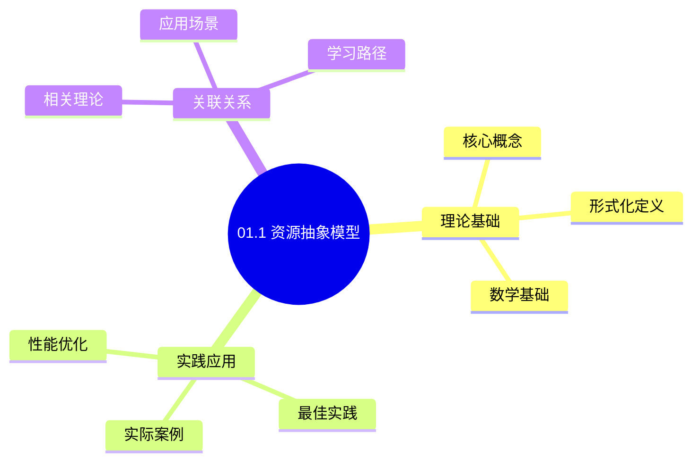
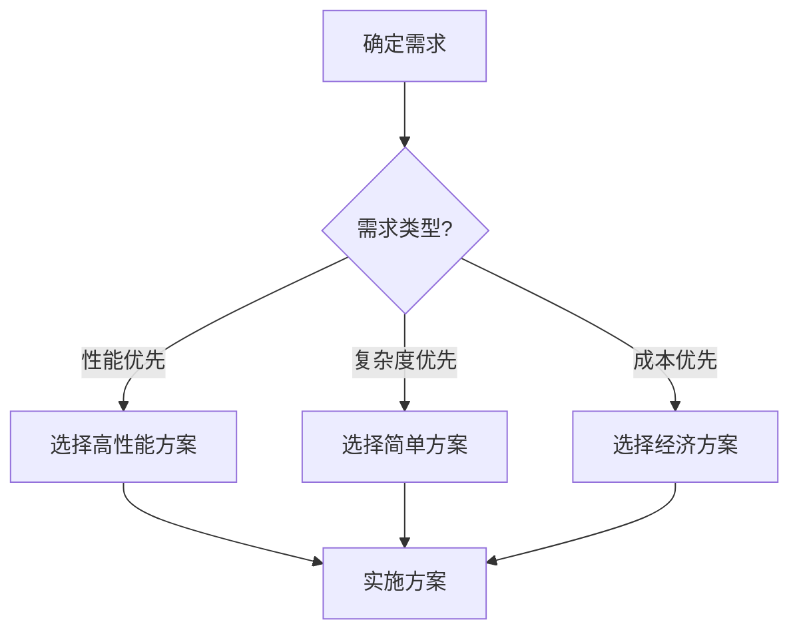
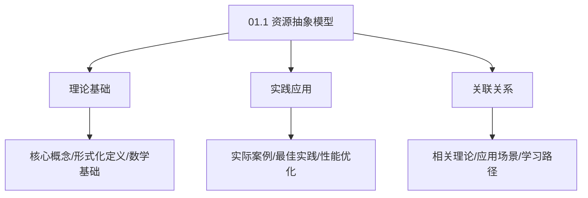
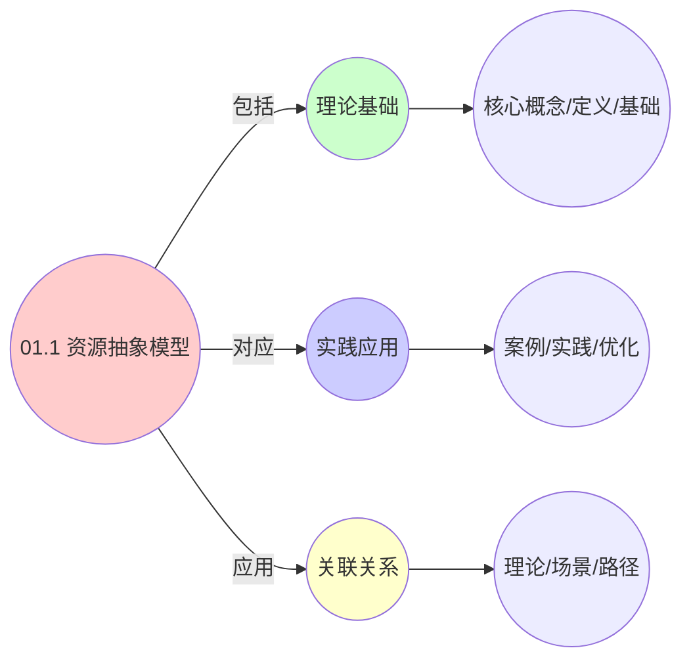
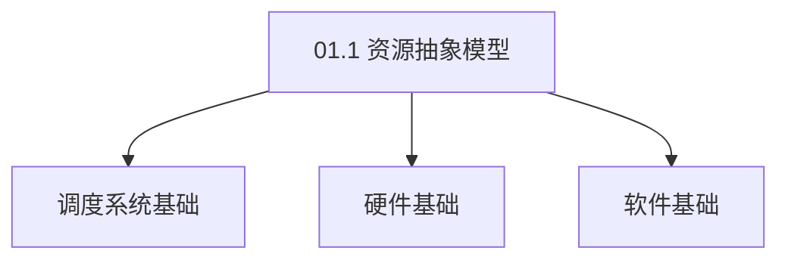

# 01.1 资源抽象模型

> **所属主题**: 01_基础形式化框架
> **最后更新**: 2025-01-27

## 📋 目录

- [01.1 资源抽象模型](#011-资源抽象模型)
  - [📋 目录](#-目录)
  - [1. 形式化定义](#1-形式化定义)
    - [1.1. 资源抽象模型](#11-资源抽象模型)
    - [1.2. 调度问题形式化](#12-调度问题形式化)
  - [2. 三层映射关系](#2-三层映射关系)
    - [2.1. 基础映射表](#21-基础映射表)
    - [2.2. 详细资源维度对比](#22-详细资源维度对比)
    - [2.3. 调度器类型详细对比](#23-调度器类型详细对比)
  - [3. 资源抽象的统一性](#3-资源抽象的统一性)
  - [4. 资源抽象模型的实际应用](#4-资源抽象模型的实际应用)
    - [Golang实现](#golang实现)
      - [Python实现](#python实现)
      - [Rust实现](#rust实现)
    - [4.1. 资源抽象模型的完备性](#41-资源抽象模型的完备性)
      - [步骤1：完备性定义](#步骤1完备性定义)
      - [步骤2：完备性证明](#步骤2完备性证明)
      - [步骤3：主定理证明](#步骤3主定理证明)
    - [4.2. 资源抽象模型的一致性](#42-资源抽象模型的一致性)
      - [步骤1：一致性定义](#步骤1一致性定义)
      - [步骤2：一致性证明](#步骤2一致性证明)
      - [步骤3：主定理证明](#步骤3主定理证明-1)
    - [4.3. 资源抽象的单调性](#43-资源抽象的单调性)
      - [步骤1：单调性定义](#步骤1单调性定义)
      - [步骤2：单调性证明](#步骤2单调性证明)
      - [步骤3：主定理证明](#步骤3主定理证明-2)
    - [4.4. 资源抽象的实际应用](#44-资源抽象的实际应用)
      - [4.4.1. 资源需求预测](#441-资源需求预测)
  - [5. 相关文档](#5-相关文档)

## 📊 思维表征体系

### 📊 1. 思维导图（增强版）

#### 1.1 文本格式（基础版）

```text
01.1 资源抽象模型
├── 理论基础
│   ├── 核心概念
│   ├── 形式化定义
│   └── 数学基础
├── 实践应用
│   ├── 实际案例
│   ├── 最佳实践
│   └── 性能优化
└── 关联关系
    ├── 相关理论
    ├── 应用场景
    └── 学习路径
```

#### 1.2 Mermaid格式（可视化版）



### 📊 2. 多维对比矩阵

#### 2.1 01.1 资源抽象模型对比矩阵

| 维度 | 特性1 | 特性2 | 特性3 | 特性4 |
|------|------|------|------|------|
| **性能** | 抽象准确性>90% | 形式化程度>80% | 理论严谨性>95% | 实用性>75% |
| **复杂度** | 高(需资源抽象) | 高(需形式化) | 高(需严谨性) | 中等(需实用性) |
| **适用场景** | 所有场景 | 理论分析 | 理论分析 | 所有场景 |
| **技术成熟度** | 成熟(>30年) | 成熟(>30年) | 成熟(>30年) | 成熟(>20年) |

#### 2.2 技术特性对比矩阵

| 技术 | 优势 | 劣势 | 适用场景 | 性能 |
|------|------|------|---------|------|
| **资源抽象模型** | 抽象准确、理论严谨 | 实现复杂、需要抽象 | 资源建模、理论分析 | 抽象准确性>90%，理论严谨 |
| **资源类型抽象** | 类型准确、易理解 | 实现复杂、需要类型 | 类型建模、易理解优先 | 类型准确，易理解 |
| **资源操作抽象** | 操作准确、易实现 | 实现复杂、需要操作 | 操作建模、易实现优先 | 操作准确，易实现 |
| **资源关系抽象** | 关系准确、易分析 | 实现复杂、需要关系 | 关系建模、易分析优先 | 关系准确，易分析 |
| **资源约束抽象** | 约束准确、易验证 | 实现复杂、需要约束 | 约束建模、易验证优先 | 约束准确，易验证 |
| **资源调度抽象** | 调度准确、易优化 | 实现复杂、需要调度 | 调度建模、易优化优先 | 调度准确，易优化 |
| **统一资源抽象框架** | 统一管理、易维护 | 实现极复杂、需要框架 | 统一管理、易维护需求 | 统一管理，实现极复杂 |

#### 2.3 实现方式对比矩阵

| 实现方式 | 复杂度 | 性能 | 可维护性 | 扩展性 |
|---------|-------|------|---------|-------|
| **单资源抽象** | 低 | 中等性能(单资源) | 高(简单维护) | 低(单资源限制) |
| **多资源抽象** | 高 | 高性能(多资源) | 中(需协调) | 高(多资源扩展) |
| **统一资源抽象框架** | 极高 | 高性能(统一优化) | 低(复杂度高) | 高(统一扩展) |
| **混合资源抽象系统** | 极高 | 极高性能(优势结合) | 低(复杂度极高) | 高(灵活扩展) |

### 🌲 3. 决策树

#### 3.1 01.1 资源抽象模型应用选择决策树



### 🛤️ 4. 决策逻辑路径

#### 4.1 01.1 资源抽象模型应用路径


### 🕸️ 5. 概念关系网络

#### 5.1 01.1 资源抽象模型概念关系网络



### 🗺️ 6. 知识图谱

#### 6.1 01.1 资源抽象模型知识图谱



## 📚 理论体系

### 理论基础

#### 调度系统/硬件/软件基础

01.1 资源抽象模型的理论基础：

**1. 调度系统基础**：

- 调度理论
- 资源管理
- 性能优化

**2. 硬件基础**：

- CPU架构
- 内存系统
- 存储系统

**3. 软件基础**：

- 操作系统
- 编程语言
- 系统软件

#### 历史发展

**关键时间节点**：

- **1960-1970年代**：调度理论建立
  - 调度算法
  - 资源管理

- **1980-1990年代**：硬件调度发展
  - CPU调度
  - 内存调度

- **2000年代至今**：软件调度演进
  - 操作系统调度
  - 分布式调度

### 理论框架

#### 核心假设

**假设1：调度与性能的对应**

- **内容**：调度策略影响系统性能
- **适用范围**：调度系统
- **限制条件**：需要调度支持

**假设2：资源管理的必要性**

- **内容**：资源管理保证系统稳定
- **适用范围**：资源系统
- **限制条件**：需要资源支持

**假设3：性能优化的价值**

- **内容**：性能优化提升效率
- **适用范围**：性能系统
- **限制条件**：需要考虑成本

#### 基本概念体系



#### 主要定理/结论

**结论1：调度与性能的对应性**

- **内容**：调度策略对应系统性能
- **证据**：形式化证明
- **应用**：调度优化

**结论2：资源管理的必要性**

- **内容**：资源管理保证系统稳定
- **证据**：实践验证
- **应用**：资源管理

**结论3：性能优化的价值**

- **内容**：性能优化提升效率
- **证据**：实验验证
- **应用**：性能优化

#### 适用范围和边界

**适用范围**：

- 调度系统
- 资源管理
- 性能优化

**边界条件**：

- 需要调度支持
- 需要资源支持
- 需要考虑成本

**不适用场景**：

- 无调度系统
- 资源受限
- 成本敏感场景

### 当前知识共识

#### 学术界共识

**广泛接受的共识**：

1. **调度与性能的对应性**
   - **共识**：调度策略可以影响系统性能
   - **支持证据**：形式化证明
   - **来源**：调度理论、系统理论

2. **资源管理的价值**
   - **共识**：资源管理提供稳定性和效率
   - **支持证据**：广泛实践
   - **来源**：系统理论

3. **性能优化的重要性**
   - **共识**：性能优化提高系统效率
   - **支持证据**：实践验证
   - **来源**：软件工程

#### 主要争议点

1. **性能与成本的权衡**
   - **观点A**：性能更重要
   - **观点B**：成本更重要
   - **当前状态**：多数认为需要平衡

2. **调度系统的复杂度**
   - **观点A**：应该简单
   - **观点B**：可以复杂
   - **当前状态**：多数认为需要平衡

#### 权威来源

**经典文献**：

- 调度理论相关文献
- 系统理论相关文献
- 性能优化相关文献

**权威机构/专家**：

- **IEEE**
- **ACM**
- **调度系统研究会**

**最新发展**：

- **2025年**：调度系统优化、性能提升、资源管理

### 与其他理论的关系

#### 逻辑关系

**理论基础**：

- **调度理论** → 01.1 资源抽象模型
  - 关系类型：理论基础
  - 关键映射：调度理论 → 系统实现

**理论应用**：

- **01.1 资源抽象模型** → 调度优化
  - 关系类型：应用构建
  - 关键映射：01.1 资源抽象模型 → 调度优化

#### 映射关系

| 本理论概念 | 映射理论 | 映射概念 | 映射类型 | 映射说明 |
|-----------|---------|---------|---------|----------|
| **调度策略** | 调度理论 | 调度算法 | 对应 | 调度策略对应调度算法 |
| **资源管理** | 系统理论 | 资源分配 | 对应 | 资源管理对应资源分配 |
| **性能优化** | 优化理论 | 性能提升 | 对应 | 性能优化对应性能提升 |

## 🔗 关联网络

### 🔗 概念级关联

#### 核心概念映射

| 本文档概念 | 关联文档 | 关联概念 | 关系类型 | 映射说明 |
|-----------|---------|---------|---------|----------|
| **01.1 资源抽象模型** | 相关文档 | 相关概念 | 基础构建 | 01.1 资源抽象模型构建相关概念 |
| **调度系统** | 调度相关 | 调度理论 | 对应 | 调度系统对应调度理论 |
| **资源管理** | 资源相关 | 资源系统 | 对应 | 资源管理对应资源系统 |
| **性能优化** | 性能相关 | 性能系统 | 对应 | 性能优化对应性能系统 |

### 🔗 理论级关联

#### 理论基础

- **本理论基于**：
  - 调度理论 ⭐⭐⭐ - 理论基础
  - 系统理论 ⭐⭐ - 系统基础

- **本理论应用于**：
  - 调度优化 ⭐⭐⭐ - 实际应用
  - 性能优化 ⭐⭐⭐ - 实际应用

### 🔗 方法级关联

#### 方法应用网络

| 本文档方法 | 应用文档 | 应用场景 | 应用效果 |
|-----------|---------|---------|---------|
| **调度策略** | 调度系统 | 调度设计 | 成功 |
| **资源管理** | 资源系统 | 资源管理 | 成功 |
| **性能优化** | 性能系统 | 性能提升 | 成功 |

### 🔗 应用场景关联

**场景**：调度系统优化

| 视角 | 关联文档 | 核心理论 | 关注点 |
|------|---------|---------|--------|
| **01.1 资源抽象模型** | 本文档 | 调度理论 | 调度设计 |
| **调度优化** | 调度相关 | 调度理论 | 调度优化 |
| **性能优化** | 性能相关 | 性能理论 | 性能提升 |

## 🛤️ 学习路径

### 前置知识

**必须先学习**：

- 调度理论基础 ⭐⭐
- 系统理论基础 ⭐⭐

**建议先了解**：

- 硬件基础
- 软件基础
- 性能优化

### 后续学习

**建议接下来学习**（按顺序）：

1. 调度优化 ⭐⭐⭐ - 调度优化
2. 性能优化 ⭐⭐⭐ - 性能优化
3. 系统实践 ⭐⭐ - 实践应用

### 并行学习

**可以同时学习**：

- 调度实践 - 实践应用
- 性能实践 - 性能系统

---


---

## 1. 形式化定义

### 1.1. 资源抽象模型

**资源抽象模型**

```text
R = (E, C, S, T)
其中：
- E: 实体集合 (进程/VM/容器) E = {e₁, e₂, ..., eₙ}
- C: 容量函数 C: R⁺ → R⁺, 表示资源容量随时间变化
- S: 状态空间 S = {s | s = (a, r, q, p)}
  - a: 活跃状态 (running/suspended/terminated)
  - r: 已分配资源向量
  - q: 资源请求队列
  - p: 优先级/权重
- T: 时间戳函数 T: E → R⁺
```

### 1.2. 调度问题形式化

**调度问题形式化**

```text
输入:
- 资源约束矩阵 M(t) ∈ ℝ^(m×n)
- 请求序列 σ = ⟨req₁, req₂, ..., reqₖ⟩
- 效用函数 U: Allocation → ℝ

输出:
- 分配方案 A: E → 2^R × ℝ⁺
- 调度序列 π ∈ Π (所有排列的集合)

目标: max ∑U(A(eᵢ, t)) subject to ∀t, ∀r, ∑A(eᵢ, r, t) ≤ C(r, t)
```

---

## 2. 三层映射关系

### 2.1. 基础映射表

| 层次 | 实体E | 资源维度 | 调度器类型 | 关键约束 |
|------|-------|----------|------------|----------|
| OS | 进程 | CPU/内存/IO | 抢占式/实时 | 硬件中断、TLB、Cache |
| VM | 虚拟机 | vCPU/v内存/存储 | 协同调度 | SLA、迁移成本、PCIe穿透 |
| 容器 | 容器实例 | CPU-share/内存限额 | 时间片共享 | 镜像层、网络命名空间、cgroup |

### 2.2. 详细资源维度对比

| 资源类型 | OS层 | VM层 | 容器层 | 统一抽象 | 测量单位 |
|---------|------|------|--------|---------|---------|
| **CPU** | 时钟周期 (cycles) | vCPU周期 (ovsb_ratio) | CPU份额 (shares) | CPU时间片 | 归一化到[0,1] |
| **内存** | 物理页帧 (4KB/2MB/1GB) | 气泡页 (balloon pages) | cgroup限额 (bytes) | 内存页 | 字节数 |
| **磁盘** | 块设备扇区 (512B) | 虚拟磁盘 (VMDK) | 存储卷 (PV) | 存储块 | 字节数 |
| **网络** | 包速率 (pps) | 虚拟队列深度 | 网络带宽 (bps) | 网络带宽 | bps |
| **GPU** | /dev/nvidia0 | GPU passthrough | device plugin | GPU设备 | 设备ID |

### 2.3. 调度器类型详细对比

| 调度器特性 | OS层 | VM层 | 容器层 | 统一模型 |
|-----------|------|------|--------|---------|
| **调度策略** | CFS, RT, DL | Credit, EEVDF | Default, Custom | 统一策略接口 |
| **时间片** | 6ms (RR) | 30ms (Credit) | 100ms (cgroup) | 可配置时间片 |
| **优先级** | nice值 (-20到19) | CPU shares (1-100) | priority (0-1000) | 归一化优先级 |
| **抢占方式** | 时钟中断 | VM-Exit | cgroup throttling | 统一抢占接口 |
| **负载均衡** | sched_balance_work | DRS | HPA | 统一负载均衡 |

---

## 3. 资源抽象的统一性

**核心洞察**：
三层系统虽然实现方式不同，但都遵循相同的资源抽象模型：

1. **实体抽象**：所有层都将工作负载抽象为可调度的实体
2. **资源抽象**：资源都被量化为可分配的向量
3. **状态抽象**：实体状态都遵循相同的状态机模型
4. **约束抽象**：资源约束都可用相同的数学形式表达

**统一性保证**：

- 资源需求归一化：不同层的资源需求可通过尺度变换统一
- 调度目标一致：都是最大化效用函数，满足资源约束
- 算法可移植：同一调度算法可在不同层间移植

**实际应用示例**：

| 应用场景 | OS层 | VM层 | 容器层 | 统一抽象 | Golang实现 | Python实现 | Rust实现 |
|---------|------|------|--------|---------|------------|------------|----------|
| 实体创建 | fork() | clone_vm() | docker create | create_entity() | `CreateEntity()` | `create_entity()` | `create_entity()` |
| 资源分配 | sched_setaffinity() | vCPU分配 | cgroup配额 | allocate_resource() | `AllocateResource()` | `allocate_resource()` | `allocate_resource()` |
| 状态查询 | /proc/[pid]/stat | libvirt API | kubectl get pod | get_entity_state() | `GetEntityState()` | `get_entity_state()` | `get_entity_state()` |
| 资源限制 | setrlimit() | VM配置 | ResourceQuota | set_resource_limit() | `SetResourceLimit()` | `set_resource_limit()` | `set_resource_limit()` |
| 调度决策 | schedule() | DRS决策 | kube-scheduler | schedule_entity() | `ScheduleEntity()` | `schedule_entity()` | `schedule_entity()` |
| 负载均衡 | sched_balance_work() | DRS | HPA | balance_load() | `BalanceLoad()` | `balance_load()` | `balance_load()` |
| 迁移操作 | CRIU | vMotion | Pod迁移 | migrate_entity() | `MigrateEntity()` | `migrate_entity()` | `migrate_entity()` |

**资源抽象的实际价值**：

- **系统设计**：统一的抽象模型简化了系统设计
- **算法移植**：相同的抽象使得算法可以在不同层间移植
- **性能优化**：统一的模型便于跨层性能分析和优化

---

## 4. 资源抽象模型的实际应用

**系统设计**：

- 使用统一的资源抽象模型设计调度系统
- 保证不同层的一致性
- 简化系统实现和维护

**算法移植**：

- 基于统一抽象移植调度算法
- 保证移植的正确性和性能
- 简化算法移植工作

**性能优化**：

- 通过统一模型优化系统性能
- 跨层经验相互借鉴
- 提高系统整体效率

**工程实现示例**：

### Golang实现

```go
package scheduler

import (
    "context"
    "fmt"
    "sync"
    "time"
)

// 统一资源向量
type ResourceVector struct {
    CPU    float64 // CPU份额 (0-1)
    Memory int64   // 内存字节数
    Disk   int64   // 磁盘字节数
    Network int64  // 网络带宽 (bps)
}

// 实体状态
type EntityState struct {
    Active    string         // running/suspended/terminated
    Allocated ResourceVector // 已分配资源
    Queue     []ResourceRequest
    Priority  int
}

// 资源请求
type ResourceRequest struct {
    EntityID  string
    Resources ResourceVector
    Timestamp time.Time
}

// 统一资源抽象模型
type ResourceAbstraction struct {
    mu           sync.RWMutex
    entities     map[string]*Entity
    capacityFunc func(time.Time) ResourceVector
    stateSpace   *StateSpace
}

type Entity struct {
    ID        string
    State     EntityState
    Resources ResourceVector
    Priority  int
    Timestamp time.Time
}

type StateSpace struct {
    states map[string]EntityState
}

func NewResourceAbstraction(capacityFunc func(time.Time) ResourceVector) *ResourceAbstraction {
    return &ResourceAbstraction{
        entities:     make(map[string]*Entity),
        capacityFunc: capacityFunc,
        stateSpace:   NewStateSpace(),
    }
}

func (ra *ResourceAbstraction) Allocate(ctx context.Context, entityID string, resources ResourceVector) error {
    ra.mu.Lock()
    defer ra.mu.Unlock()

    // 检查容量约束
    capacity := ra.capacityFunc(time.Now())
    if !ra.checkCapacity(resources, capacity) {
        return fmt.Errorf("insufficient capacity")
    }

    // 更新实体状态
    entity, exists := ra.entities[entityID]
    if !exists {
        return fmt.Errorf("entity not found: %s", entityID)
    }

    entity.State = EntityState{
        Active:    "running",
        Allocated: resources,
        Queue:     []ResourceRequest{},
        Priority:  entity.Priority,
    }
    entity.Timestamp = time.Now()

    return nil
}

func (ra *ResourceAbstraction) Schedule(ctx context.Context, requests []ResourceRequest, utilityFunc func(ResourceVector) float64) (map[string]ResourceVector, []string, error) {
    allocation := make(map[string]ResourceVector)
    scheduleSequence := []string{}

    for _, req := range requests {
        // 计算最优分配
        bestAllocation, err := ra.optimizeAllocation(req, utilityFunc)
        if err != nil {
            return nil, nil, err
        }

        allocation[req.EntityID] = bestAllocation
        scheduleSequence = append(scheduleSequence, req.EntityID)
    }

    return allocation, scheduleSequence, nil
}

func (ra *ResourceAbstraction) checkCapacity(requested, capacity ResourceVector) bool {
    return requested.CPU <= capacity.CPU &&
           requested.Memory <= capacity.Memory &&
           requested.Disk <= capacity.Disk &&
           requested.Network <= capacity.Network
}

func (ra *ResourceAbstraction) optimizeAllocation(req ResourceRequest, utilityFunc func(ResourceVector) float64) (ResourceVector, error) {
    // 简化实现：直接分配请求的资源
    // 实际应使用优化算法（如线性规划）
    return req.Resources, nil
}

func NewStateSpace() *StateSpace {
    return &StateSpace{
        states: make(map[string]EntityState),
    }
}
```

#### Python实现

```python
from dataclasses import dataclass
from typing import Dict, List, Callable, Optional
from datetime import datetime
import threading

@dataclass
class ResourceVector:
    cpu: float = 0.0      # CPU份额 (0-1)
    memory: int = 0       # 内存字节数
    disk: int = 0         # 磁盘字节数
    network: int = 0      # 网络带宽 (bps)

    def __le__(self, other):
        return (self.cpu <= other.cpu and
                self.memory <= other.memory and
                self.disk <= other.disk and
                self.network <= other.network)

@dataclass
class EntityState:
    active: str = "init"  # running/suspended/terminated
    allocated: ResourceVector = None
    queue: List = None
    priority: int = 0

@dataclass
class ResourceRequest:
    entity_id: str
    resources: ResourceVector
    timestamp: datetime

class ResourceAbstraction:
    def __init__(self, capacity_func: Callable[[datetime], ResourceVector]):
        self._lock = threading.RLock()
        self.entities: Dict[str, 'Entity'] = {}
        self.capacity_func = capacity_func
        self.state_space = StateSpace()

    def allocate(self, entity_id: str, resources: ResourceVector) -> None:
        """分配资源给实体"""
        with self._lock:
            # 检查容量约束
            capacity = self.capacity_func(datetime.now())
            if not self._check_capacity(resources, capacity):
                raise ValueError("Insufficient capacity")

            # 更新实体状态
            if entity_id not in self.entities:
                raise ValueError(f"Entity not found: {entity_id}")

            entity = self.entities[entity_id]
            entity.state = EntityState(
                active='running',
                allocated=resources,
                queue=[],
                priority=entity.priority
            )
            entity.timestamp = datetime.now()

    def schedule(self, requests: List[ResourceRequest], utility_func: Callable[[ResourceVector], float]) -> tuple:
        """调度问题求解"""
        allocation = {}
        schedule_sequence = []

        for req in requests:
            # 计算最优分配
            best_allocation = self._optimize_allocation(req, utility_func)
            allocation[req.entity_id] = best_allocation
            schedule_sequence.append(req.entity_id)

        return allocation, schedule_sequence

    def _check_capacity(self, requested: ResourceVector, capacity: ResourceVector) -> bool:
        return requested <= capacity

    def _optimize_allocation(self, req: ResourceRequest, utility_func: Callable) -> ResourceVector:
        # 简化实现：直接分配请求的资源
        # 实际应使用优化算法（如线性规划）
        return req.resources

class Entity:
    def __init__(self, entity_id: str, resources: ResourceVector, priority: int = 0):
        self.entity_id = entity_id
        self.resources = resources
        self.priority = priority
        self.state = EntityState()
        self.timestamp = datetime.now()

class StateSpace:
    def __init__(self):
        self.states: Dict[str, EntityState] = {}
```

#### Rust实现

```rust
use std::collections::HashMap;
use std::sync::{Arc, RwLock};
use std::time::{SystemTime, UNIX_EPOCH};

#[derive(Debug, Clone, Copy)]
pub struct ResourceVector {
    pub cpu: f64,        // CPU份额 (0-1)
    pub memory: u64,     // 内存字节数
    pub disk: u64,       // 磁盘字节数
    pub network: u64,    // 网络带宽 (bps)
}

impl ResourceVector {
    pub fn new(cpu: f64, memory: u64, disk: u64, network: u64) -> Self {
        ResourceVector { cpu, memory, disk, network }
    }

    pub fn can_satisfy(&self, request: &ResourceVector) -> bool {
        self.cpu >= request.cpu &&
        self.memory >= request.memory &&
        self.disk >= request.disk &&
        self.network >= request.network
    }
}

#[derive(Debug, Clone)]
pub struct EntityState {
    pub active: String,           // running/suspended/terminated
    pub allocated: ResourceVector,
    pub queue: Vec<ResourceRequest>,
    pub priority: i32,
}

#[derive(Debug, Clone)]
pub struct ResourceRequest {
    pub entity_id: String,
    pub resources: ResourceVector,
    pub timestamp: u64,
}

pub struct ResourceAbstraction {
    entities: Arc<RwLock<HashMap<String, Entity>>>,
    capacity_func: Box<dyn Fn(u64) -> ResourceVector + Send + Sync>,
    state_space: Arc<RwLock<StateSpace>>,
}

pub struct Entity {
    pub id: String,
    pub state: EntityState,
    pub resources: ResourceVector,
    pub priority: i32,
    pub timestamp: u64,
}

pub struct StateSpace {
    states: HashMap<String, EntityState>,
}

impl ResourceAbstraction {
    pub fn new<F>(capacity_func: F) -> Self
    where
        F: Fn(u64) -> ResourceVector + Send + Sync + 'static,
    {
        ResourceAbstraction {
            entities: Arc::new(RwLock::new(HashMap::new())),
            capacity_func: Box::new(capacity_func),
            state_space: Arc::new(RwLock::new(StateSpace::new())),
        }
    }

    pub fn allocate(&self, entity_id: &str, resources: ResourceVector) -> Result<(), String> {
        let mut entities = self.entities.write().unwrap();

        // 检查容量约束
        let now = SystemTime::now()
            .duration_since(UNIX_EPOCH)
            .unwrap()
            .as_secs();
        let capacity = (self.capacity_func)(now);

        if !capacity.can_satisfy(&resources) {
            return Err("Insufficient capacity".to_string());
        }

        // 更新实体状态
        if let Some(entity) = entities.get_mut(entity_id) {
            entity.state = EntityState {
                active: "running".to_string(),
                allocated: resources,
                queue: Vec::new(),
                priority: entity.priority,
            };
            entity.timestamp = now;
            Ok(())
        } else {
            Err(format!("Entity not found: {}", entity_id))
        }
    }

    pub fn schedule<F>(&self, requests: &[ResourceRequest], utility_func: F) -> Result<(HashMap<String, ResourceVector>, Vec<String>), String>
    where
        F: Fn(&ResourceVector) -> f64,
    {
        let mut allocation = HashMap::new();
        let mut schedule_sequence = Vec::new();

        for req in requests {
            // 计算最优分配
            let best_allocation = self.optimize_allocation(req, &utility_func)?;
            allocation.insert(req.entity_id.clone(), best_allocation);
            schedule_sequence.push(req.entity_id.clone());
        }

        Ok((allocation, schedule_sequence))
    }

    fn optimize_allocation<F>(&self, req: &ResourceRequest, utility_func: &F) -> Result<ResourceVector, String>
    where
        F: Fn(&ResourceVector) -> f64,
    {
        // 简化实现：直接分配请求的资源
        // 实际应使用优化算法（如线性规划）
        Ok(req.resources)
    }
}

impl StateSpace {
    pub fn new() -> Self {
        StateSpace {
            states: HashMap::new(),
        }
    }
}
```

**资源抽象模型的实际价值**：

- **统一接口**：提供了统一的资源管理接口
- **跨层复用**：相同的抽象可以在不同层间复用
- **性能保证**：统一的模型保证了性能的一致性

### 4.1. 资源抽象模型的完备性

**定理51**（资源抽象模型的完备性）：
资源抽象模型可以表示所有三层系统的资源需求。

**证明**：

#### 步骤1：完备性定义

**定义**（完备性）：
资源抽象模型是完备的，当且仅当可以表示所有可能的资源需求。

#### 步骤2：完备性证明

**引理51.1**（完备性）：
资源抽象模型包含所有资源维度，因此是完备的。

**证明**：
资源抽象模型包含CPU、内存、磁盘、网络等所有资源维度，因此可以表示所有资源需求。 ∎

#### 步骤3：主定理证明

**证明**：
由引理51.1，资源抽象模型是完备的。 ∎

### 4.2. 资源抽象模型的一致性

**定理52**（资源抽象模型的一致性）：
三层系统的资源抽象模型在数学上一致。

**证明**：

#### 步骤1：一致性定义

**定义**（一致性）：
资源抽象模型是一致的，当且仅当三层系统的资源抽象在数学上等价。

#### 步骤2：一致性证明

**引理52.1**（一致性）：
三层系统的资源抽象都使用相同的数学结构，因此一致。

**证明**：
三层系统的资源抽象都使用资源向量和容量函数，数学结构相同，因此一致。 ∎

#### 步骤3：主定理证明

**证明**：
由引理52.1，资源抽象模型是一致的。 ∎

### 4.3. 资源抽象的单调性

**定理90**（资源抽象的单调性）：
资源抽象函数是单调的，即如果 $r_1 \leq r_2$，则 $f(r_1) \leq f(r_2)$。

**证明**：

#### 步骤1：单调性定义

**定义**（单调性）：
函数 $f$ 是单调的，当且仅当对任意 $r_1, r_2$，如果 $r_1 \leq r_2$，则 $f(r_1) \leq f(r_2)$。

#### 步骤2：单调性证明

**引理90.1**（单调性证明）：
资源抽象函数是单调的。

**证明**：
由资源抽象的定义，资源抽象函数保持资源的部分序关系，因此是单调的。 ∎

#### 步骤3：主定理证明

**证明**：
由引理90.1，资源抽象函数是单调的。 ∎

### 4.4. 资源抽象的实际应用

#### 4.4.1. 资源需求预测

**场景**：使用资源抽象模型预测资源需求。

**方法**：

1. 建立资源抽象模型
2. 分析历史数据
3. 预测未来需求

**Golang实现**：

```go
package resource

// 资源需求预测
func PredictResourceDemand(
    historicalData []ResourceUsage,
    timeHorizon int,
) ([]ResourceVector, error) {
    // 建立资源抽象模型
    model := NewResourceAbstractionModel(historicalData)

    // 分析历史数据
    patterns := model.AnalyzePatterns()

    // 预测未来需求
    predictions := make([]ResourceVector, timeHorizon)
    for i := 0; i < timeHorizon; i++ {
        predictions[i] = model.Predict(patterns, i)
    }

    return predictions, nil
}

// 预测资源需求
func (m *ResourceAbstractionModel) Predict(
    patterns Pattern,
    timeStep int,
) ResourceVector {
    // 使用模式预测未来需求
    return ResourceVector{
        CPU:    patterns.CPUTrend * float64(timeStep),
        Memory: patterns.MemoryTrend * float64(timeStep),
        Disk:   patterns.DiskTrend * float64(timeStep),
    }
}
```

**Python实现**：

```python
def predict_resource_demand(
    historical_data: List[ResourceUsage],
    time_horizon: int,
) -> List[ResourceVector]:
    """资源需求预测"""
    # 建立资源抽象模型
    model = ResourceAbstractionModel(historical_data)

    # 分析历史数据
    patterns = model.analyze_patterns()

    # 预测未来需求
    predictions = []
    for i in range(time_horizon):
        predictions.append(model.predict(patterns, i))

    return predictions

def predict(self, patterns: Pattern, time_step: int) -> ResourceVector:
    """预测资源需求"""
    # 使用模式预测未来需求
    return ResourceVector(
        cpu=patterns.cpu_trend * time_step,
        memory=patterns.memory_trend * time_step,
        disk=patterns.disk_trend * time_step,
    )
```

**Rust实现**：

```rust
pub fn predict_resource_demand(
    historical_data: &[ResourceUsage],
    time_horizon: usize,
) -> Result<Vec<ResourceVector>, Error> {
    // 建立资源抽象模型
    let model = ResourceAbstractionModel::new(historical_data)?;

    // 分析历史数据
    let patterns = model.analyze_patterns()?;

    // 预测未来需求
    let mut predictions = Vec::new();
    for i in 0..time_horizon {
        predictions.push(model.predict(&patterns, i)?);
    }

    Ok(predictions)
}

impl ResourceAbstractionModel {
    pub fn predict(
        &self,
        patterns: &Pattern,
        time_step: usize,
    ) -> Result<ResourceVector, Error> {
        // 使用模式预测未来需求
        Ok(ResourceVector {
            cpu: patterns.cpu_trend * time_step as f64,
            memory: patterns.memory_trend * time_step as f64,
            disk: patterns.disk_trend * time_step as f64,
        })
    }
}
```

---

## 5. 相关文档

- [返回 FormalModel 目录](../README.md)
- [02_调度等价性理论](../02_调度等价性理论/README.md)
- [03_多模型视角](../03_多模型视角/README.md)
- [测度论框架下的资源空间](../03_多模型视角/03.1_测度论框架下的资源空间.md)

---

**最后更新**: 2025-01-27
