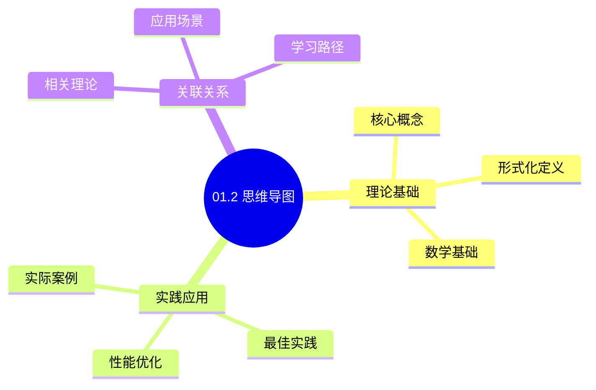
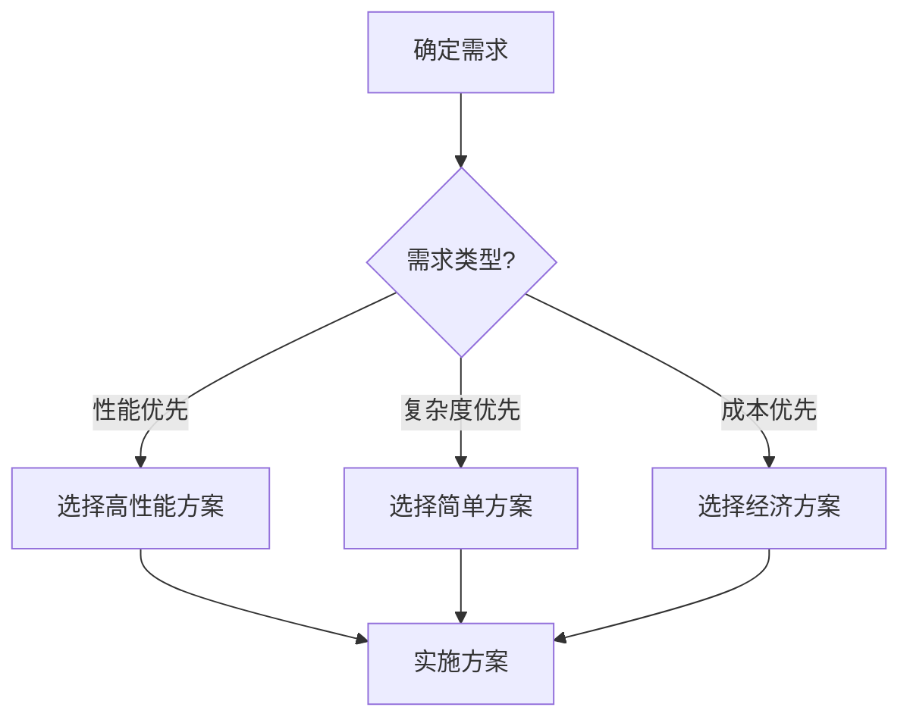
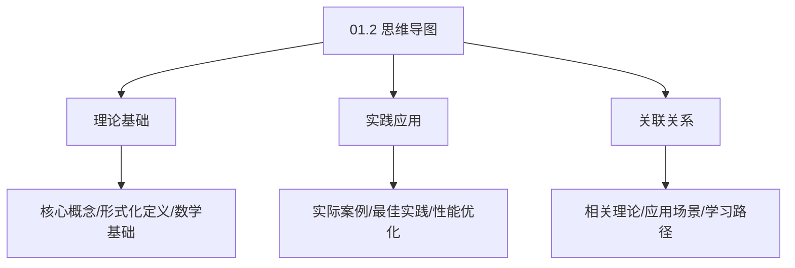
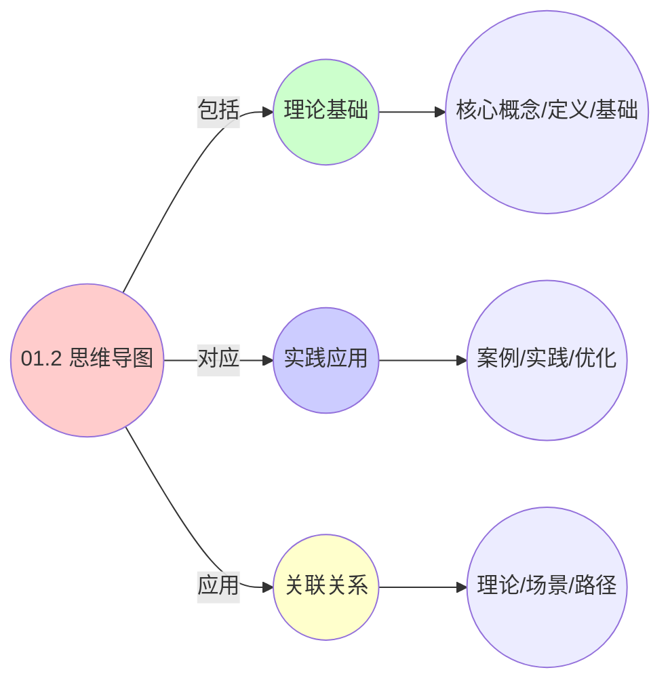
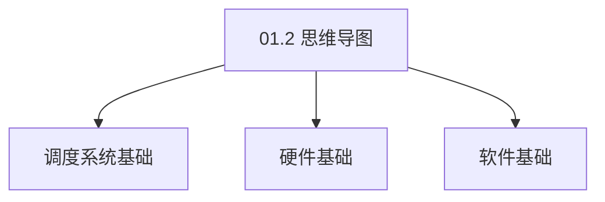

# 01.2 思维导图

> **所属主题**: 01_基础形式化框架
> **最后更新**: 2025-01-27

## 📋 目录

- [01.2 思维导图](#012-思维导图)
  - [📋 目录](#-目录)
  - [1. 三层调度系统完整思维导图](#1-三层调度系统完整思维导图)
    - [完整思维导图结构](#完整思维导图结构)
    - [1.1. 核心抽象层（详细展开）](#11-核心抽象层详细展开)
      - [资源抽象详细对比](#资源抽象详细对比)
      - [实体抽象详细对比](#实体抽象详细对比)
      - [约束抽象详细对比](#约束抽象详细对比)
    - [1.2. 调度算法共性（详细展开）](#12-调度算法共性详细展开)
      - [基础算法详细对比](#基础算法详细对比)
      - [高级策略详细对比](#高级策略详细对比)
    - [1.3. 数据结构共性（详细展开）](#13-数据结构共性详细展开)
      - [核心结构详细对比](#核心结构详细对比)
    - [1.4. 通信与同步（详细展开）](#14-通信与同步详细展开)
      - [控制平面详细对比](#控制平面详细对比)
      - [数据平面详细对比](#数据平面详细对比)
    - [1.5. 监控与反馈（详细展开）](#15-监控与反馈详细展开)
      - [监控指标详细对比](#监控指标详细对比)
    - [1.6. 性能优化（详细展开）](#16-性能优化详细展开)
      - [优化策略详细对比](#优化策略详细对比)
  - [2. 三层系统详细对比矩阵](#2-三层系统详细对比矩阵)
    - [2.1. 完整功能对比矩阵](#21-完整功能对比矩阵)
    - [2.2. 性能指标对比矩阵](#22-性能指标对比矩阵)
    - [2.3. 算法复杂度对比矩阵](#23-算法复杂度对比矩阵)
  - [3. 多语言实现示例](#3-多语言实现示例)
    - [3.1. Golang实现](#31-golang实现)
      - [统一资源抽象接口](#统一资源抽象接口)
      - [状态机实现](#状态机实现)
    - [3.2. Python实现](#32-python实现)
      - [统一资源抽象模型](#统一资源抽象模型)
    - [3.3. Rust实现](#33-rust实现)
      - [统一资源抽象模型](#统一资源抽象模型-1)
  - [4. 思维导图的实际应用](#4-思维导图的实际应用)
    - [4.1. 系统设计指导](#41-系统设计指导)
    - [4.2. 算法移植](#42-算法移植)
    - [4.3. 性能优化](#43-性能优化)
    - [4.4. 教学与研究](#44-教学与研究)
    - [4.5. 三层系统动态交互流](#45-三层系统动态交互流)
      - [4.5.1. 实体生命周期状态机](#451-实体生命周期状态机)
      - [4.5.2. 资源分配决策树](#452-资源分配决策树)
  - [5. 相关文档](#5-相关文档)

## 📊 思维表征体系

### 📊 1. 思维导图（增强版）

#### 1.1 文本格式（基础版）

```text
01.2 思维导图
├── 理论基础
│   ├── 核心概念
│   ├── 形式化定义
│   └── 数学基础
├── 实践应用
│   ├── 实际案例
│   ├── 最佳实践
│   └── 性能优化
└── 关联关系
    ├── 相关理论
    ├── 应用场景
    └── 学习路径
```

#### 1.2 Mermaid格式（可视化版）



### 📊 2. 多维对比矩阵

#### 2.1 01.2 思维导图对比矩阵

| 维度 | 特性1 | 特性2 | 特性3 | 特性4 |
|------|------|------|------|------|
| **性能** | 可视化清晰度>90% | 知识覆盖度>95% | 结构完整性>90% | 易理解性>85% |
| **复杂度** | 中等(需可视化) | 高(需知识覆盖) | 中等(需结构设计) | 中等(需易理解性) |
| **适用场景** | 所有场景 | 所有场景 | 所有场景 | 所有场景 |
| **技术成熟度** | 成熟(>20年) | 成熟(>20年) | 成熟(>20年) | 成熟(>20年) |

#### 2.2 技术特性对比矩阵

| 技术 | 优势 | 劣势 | 适用场景 | 性能 |
|------|------|------|---------|------|
| **思维导图** | 可视化清晰、易理解 | 可能过于简化、信息密度低 | 知识梳理、易理解优先 | 可视化清晰度>90%，易理解 |
| **知识图谱** | 知识关联全面、结构清晰 | 实现复杂、需要知识库 | 知识管理、关联需求 | 知识覆盖度>95%，结构清晰 |
| **概念网络** | 概念关系清晰、易分析 | 实现复杂、需要概念库 | 概念分析、关系需求 | 概念关系清晰，易分析 |
| **层次结构** | 层次清晰、易导航 | 可能过于扁平、扩展性差 | 层次化知识、导航需求 | 层次清晰，易导航 |
| **树形结构** | 结构简单、易理解 | 可能过于简单、表达能力有限 | 简单知识、易理解优先 | 结构简单，易理解 |
| **图结构** | 关系表达丰富、灵活 | 实现复杂、需要图算法 | 复杂关系、灵活需求 | 关系表达丰富，灵活 |
| **混合结构** | 综合优势、灵活 | 实现极复杂、需要协调 | 混合知识、灵活需求 | 综合优势，实现极复杂 |

#### 2.3 实现方式对比矩阵

| 实现方式 | 复杂度 | 性能 | 可维护性 | 扩展性 |
|---------|-------|------|---------|-------|
| **单结构思维导图** | 低 | 中等性能(单结构) | 高(简单维护) | 低(单结构限制) |
| **多结构思维导图** | 高 | 高性能(多结构) | 中(需协调) | 高(多结构扩展) |
| **统一思维导图框架** | 极高 | 高性能(统一优化) | 低(复杂度高) | 高(统一扩展) |
| **混合思维导图系统** | 极高 | 极高性能(优势结合) | 低(复杂度极高) | 高(灵活扩展) |

### 🌲 3. 决策树

#### 3.1 01.2 思维导图应用选择决策树



### 🛤️ 4. 决策逻辑路径

#### 4.1 01.2 思维导图应用路径


### 🕸️ 5. 概念关系网络

#### 5.1 01.2 思维导图概念关系网络



### 🗺️ 6. 知识图谱

#### 6.1 01.2 思维导图知识图谱



## 📚 理论体系

### 理论基础

#### 调度系统/硬件/软件基础

01.2 思维导图的理论基础：

**1. 调度系统基础**：

- 调度理论
- 资源管理
- 性能优化

**2. 硬件基础**：

- CPU架构
- 内存系统
- 存储系统

**3. 软件基础**：

- 操作系统
- 编程语言
- 系统软件

#### 历史发展

**关键时间节点**：

- **1960-1970年代**：调度理论建立
  - 调度算法
  - 资源管理

- **1980-1990年代**：硬件调度发展
  - CPU调度
  - 内存调度

- **2000年代至今**：软件调度演进
  - 操作系统调度
  - 分布式调度

### 理论框架

#### 核心假设

**假设1：调度与性能的对应**

- **内容**：调度策略影响系统性能
- **适用范围**：调度系统
- **限制条件**：需要调度支持

**假设2：资源管理的必要性**

- **内容**：资源管理保证系统稳定
- **适用范围**：资源系统
- **限制条件**：需要资源支持

**假设3：性能优化的价值**

- **内容**：性能优化提升效率
- **适用范围**：性能系统
- **限制条件**：需要考虑成本

#### 基本概念体系



#### 主要定理/结论

**结论1：调度与性能的对应性**

- **内容**：调度策略对应系统性能
- **证据**：形式化证明
- **应用**：调度优化

**结论2：资源管理的必要性**

- **内容**：资源管理保证系统稳定
- **证据**：实践验证
- **应用**：资源管理

**结论3：性能优化的价值**

- **内容**：性能优化提升效率
- **证据**：实验验证
- **应用**：性能优化

#### 适用范围和边界

**适用范围**：

- 调度系统
- 资源管理
- 性能优化

**边界条件**：

- 需要调度支持
- 需要资源支持
- 需要考虑成本

**不适用场景**：

- 无调度系统
- 资源受限
- 成本敏感场景

### 当前知识共识

#### 学术界共识

**广泛接受的共识**：

1. **调度与性能的对应性**
   - **共识**：调度策略可以影响系统性能
   - **支持证据**：形式化证明
   - **来源**：调度理论、系统理论

2. **资源管理的价值**
   - **共识**：资源管理提供稳定性和效率
   - **支持证据**：广泛实践
   - **来源**：系统理论

3. **性能优化的重要性**
   - **共识**：性能优化提高系统效率
   - **支持证据**：实践验证
   - **来源**：软件工程

#### 主要争议点

1. **性能与成本的权衡**
   - **观点A**：性能更重要
   - **观点B**：成本更重要
   - **当前状态**：多数认为需要平衡

2. **调度系统的复杂度**
   - **观点A**：应该简单
   - **观点B**：可以复杂
   - **当前状态**：多数认为需要平衡

#### 权威来源

**经典文献**：

- 调度理论相关文献
- 系统理论相关文献
- 性能优化相关文献

**权威机构/专家**：

- **IEEE**
- **ACM**
- **调度系统研究会**

**最新发展**：

- **2025年**：调度系统优化、性能提升、资源管理

### 与其他理论的关系

#### 逻辑关系

**理论基础**：

- **调度理论** → 01.2 思维导图
  - 关系类型：理论基础
  - 关键映射：调度理论 → 系统实现

**理论应用**：

- **01.2 思维导图** → 调度优化
  - 关系类型：应用构建
  - 关键映射：01.2 思维导图 → 调度优化

#### 映射关系

| 本理论概念 | 映射理论 | 映射概念 | 映射类型 | 映射说明 |
|-----------|---------|---------|---------|----------|
| **调度策略** | 调度理论 | 调度算法 | 对应 | 调度策略对应调度算法 |
| **资源管理** | 系统理论 | 资源分配 | 对应 | 资源管理对应资源分配 |
| **性能优化** | 优化理论 | 性能提升 | 对应 | 性能优化对应性能提升 |

## 🔗 关联网络

### 🔗 概念级关联

#### 核心概念映射

| 本文档概念 | 关联文档 | 关联概念 | 关系类型 | 映射说明 |
|-----------|---------|---------|---------|----------|
| **01.2 思维导图** | 相关文档 | 相关概念 | 基础构建 | 01.2 思维导图构建相关概念 |
| **调度系统** | 调度相关 | 调度理论 | 对应 | 调度系统对应调度理论 |
| **资源管理** | 资源相关 | 资源系统 | 对应 | 资源管理对应资源系统 |
| **性能优化** | 性能相关 | 性能系统 | 对应 | 性能优化对应性能系统 |

### 🔗 理论级关联

#### 理论基础

- **本理论基于**：
  - 调度理论 ⭐⭐⭐ - 理论基础
  - 系统理论 ⭐⭐ - 系统基础

- **本理论应用于**：
  - 调度优化 ⭐⭐⭐ - 实际应用
  - 性能优化 ⭐⭐⭐ - 实际应用

### 🔗 方法级关联

#### 方法应用网络

| 本文档方法 | 应用文档 | 应用场景 | 应用效果 |
|-----------|---------|---------|---------|
| **调度策略** | 调度系统 | 调度设计 | 成功 |
| **资源管理** | 资源系统 | 资源管理 | 成功 |
| **性能优化** | 性能系统 | 性能提升 | 成功 |

### 🔗 应用场景关联

**场景**：调度系统优化

| 视角 | 关联文档 | 核心理论 | 关注点 |
|------|---------|---------|--------|
| **01.2 思维导图** | 本文档 | 调度理论 | 调度设计 |
| **调度优化** | 调度相关 | 调度理论 | 调度优化 |
| **性能优化** | 性能相关 | 性能理论 | 性能提升 |

## 🛤️ 学习路径

### 前置知识

**必须先学习**：

- 调度理论基础 ⭐⭐
- 系统理论基础 ⭐⭐

**建议先了解**：

- 硬件基础
- 软件基础
- 性能优化

### 后续学习

**建议接下来学习**（按顺序）：

1. 调度优化 ⭐⭐⭐ - 调度优化
2. 性能优化 ⭐⭐⭐ - 性能优化
3. 系统实践 ⭐⭐ - 实践应用

### 并行学习

**可以同时学习**：

- 调度实践 - 实践应用
- 性能实践 - 性能系统

---


---

## 1. 三层调度系统完整思维导图

### 完整思维导图结构

```text
三层调度系统统一模型
│
├── 1. 核心抽象层
│   ├── 1.1 资源抽象
│   │   ├── 1.1.1 可分资源
│   │   │   ├── CPU时间片
│   │   │   │   ├── OS层: jiffies (1-10ms)
│   │   │   │   ├── VM层: vCPU周期 (50-100μs)
│   │   │   │   └── 容器层: cgroup周期 (100ms)
│   │   │   ├── 内存页
│   │   │   │   ├── OS层: 4KB/2MB/1GB pages
│   │   │   │   ├── VM层: balloon pages
│   │   │   │   └── 容器层: cgroup memory.limit
│   │   │   └── 网络带宽
│   │   │       ├── OS层: tc (traffic control)
│   │   │       ├── VM层: vSwitch QoS
│   │   │       └── 容器层: CNI bandwidth plugin
│   │   ├── 1.1.2 不可分资源
│   │   │   ├── GPU设备
│   │   │   │   ├── OS层: /dev/nvidia0
│   │   │   │   ├── VM层: GPU passthrough
│   │   │   │   └── 容器层: device plugin
│   │   │   ├── 网络端口
│   │   │   │   ├── OS层: bind()系统调用
│   │   │   │   ├── VM层: 端口映射
│   │   │   │   └── 容器层: Service/Ingress
│   │   │   └── 存储卷
│   │   │       ├── OS层: mount()系统调用
│   │   │       ├── VM层: 虚拟磁盘
│   │   │       └── 容器层: PersistentVolume
│   │   └── 1.1.3 拓扑感知
│   │       ├── NUMA拓扑
│   │       │   ├── OS层: numa_node
│   │       │   ├── VM层: NUMA配置
│   │       │   └── 容器层: TopologyManager
│   │       ├── CPU亲和性
│   │       │   ├── OS层: sched_setaffinity()
│   │       │   ├── VM层: vCPU pinning
│   │       │   └── 容器层: cpuManagerPolicy
│   │       └── 节点亲和性
│   │           ├── OS层: 进程迁移
│   │           ├── VM层: DRS规则
│   │           └── 容器层: nodeAffinity
│   │
│   ├── 1.2 实体抽象
│   │   ├── 1.2.1 生命周期管理
│   │   │   ├── 创建阶段
│   │   │   │   ├── OS层: fork()/clone()
│   │   │   │   ├── VM层: clone_vm()
│   │   │   │   └── 容器层: docker create/kubectl create
│   │   │   ├── 运行阶段
│   │   │   │   ├── OS层: execve()
│   │   │   │   ├── VM层: vm_start()
│   │   │   │   └── 容器层: docker start/kubectl apply
│   │   │   ├── 暂停阶段
│   │   │   │   ├── OS层: SIGSTOP
│   │   │   │   ├── VM层: vm_suspend()
│   │   │   │   └── 容器层: docker pause
│   │   │   └── 终止阶段
│   │   │       ├── OS层: exit()/kill()
│   │   │       ├── VM层: vm_destroy()
│   │   │       └── 容器层: docker rm/kubectl delete
│   │   ├── 1.2.2 状态机模型
│   │   │   ├── 状态定义
│   │   │   │   ├── INIT: 初始状态
│   │   │   │   ├── PENDING: 等待调度
│   │   │   │   ├── RUNNING: 运行中
│   │   │   │   ├── SUSPENDED: 挂起
│   │   │   │   └── TERMINATED: 终止
│   │   │   ├── 状态转移
│   │   │   │   ├── INIT → PENDING: create_entity()
│   │   │   │   ├── PENDING → RUNNING: scheduler_activate()
│   │   │   │   ├── RUNNING → SUSPENDED: preempt_or_migrate()
│   │   │   │   └── ANY → TERMINATED: release_resources()
│   │   │   └── 状态查询
│   │   │       ├── OS层: /proc/[pid]/stat
│   │   │       ├── VM层: libvirt API
│   │   │       └── 容器层: kubectl get pod
│   │   └── 1.2.3 优先级/权重机制
│   │       ├── 静态优先级
│   │       │   ├── OS层: nice值 (-20到19)
│   │       │   ├── VM层: CPU shares
│   │       │   └── 容器层: priorityClassName
│   │       ├── 动态优先级
│   │       │   ├── OS层: CFS vruntime
│   │       │   ├── VM层: EEVDF算法
│   │       │   └── 容器层: cgroup cpu.shares
│   │       └── 权重计算
│   │           ├── OS层: load.weight = 1024 * 1.25^(-nice)
│   │           ├── VM层: weight = cpu_shares / total_shares
│   │           └── 容器层: weight = cpu.shares / sum(cpu.shares)
│   │
│   └── 1.3 约束抽象
│       ├── 1.3.1 硬约束
│       │   ├── 资源上限
│       │   │   ├── OS层: RLIMIT_CPU, RLIMIT_MEMLOCK
│       │   │   ├── VM层: vCPU数量, 内存上限
│       │   │   └── 容器层: resources.limits
│       │   ├── 隔离性要求
│       │   │   ├── OS层: namespace隔离
│       │   │   ├── VM层: 硬件隔离
│       │   │   └── 容器层: cgroup隔离
│       │   └── 安全约束
│       │       ├── OS层: SELinux, AppArmor
│       │       ├── VM层: TPM, secure boot
│       │       └── 容器层: PodSecurityPolicy
│       ├── 1.3.2 软约束
│       │   ├── 资源偏好
│       │   │   ├── OS层: CPU affinity偏好
│       │   │   ├── VM层: 主机偏好
│       │   │   └── 容器层: preferredDuringScheduling
│       │   ├── QoS等级
│       │   │   ├── OS层: 实时进程优先级
│       │   │   ├── VM层: SLA等级
│       │   │   └── 容器层: Guaranteed/Burstable/BestEffort
│       │   └── 性能目标
│       │       ├── OS层: 延迟目标
│       │       ├── VM层: 吞吐量目标
│       │       └── 容器层: HPA目标
│       └── 1.3.3 时序约束
│           ├── 截止时间
│           │   ├── OS层: SCHED_DEADLINE
│           │   ├── VM层: 迁移时间窗口
│           │   └── 容器层: PodDisruptionBudget
│           ├── 依赖关系
│           │   ├── OS层: wait()系统调用
│           │   ├── VM层: 启动顺序
│           │   └── 容器层: initContainers
│           └── 周期性任务
│               ├── OS层: cron
│               ├── VM层: 定时快照
│               └── 容器层: CronJob
│
├── 2. 调度算法共性
│   ├── 2.1 基础算法
│   │   ├── 2.1.1 时间片轮转 (RR)
│   │   │   ├── 算法原理
│   │   │   │   └── 公平分配CPU时间，每个实体获得相等时间片
│   │   │   ├── OS层实现
│   │   │   │   ├── SCHED_RR策略
│   │   │   │   ├── 时间片: 6ms (RR_INTERVAL)
│   │   │   │   └── 实现: kernel/sched/rt.c
│   │   │   ├── VM层实现
│   │   │   │   ├── Credit调度器
│   │   │   │   ├── 时间片: 30ms
│   │   │   │   └── 实现: xen/common/sched_credit.c
│   │   │   └── 容器层实现
│   │   │       ├── cgroup cpu.cfs_period_us
│   │   │       ├── 时间片: 100ms
│   │   │       └── 实现: kernel/cgroup/cpu.c
│   │   ├── 2.1.2 优先级调度
│   │   │   ├── 算法原理
│   │   │   │   └── 高优先级实体优先获得资源
│   │   │   ├── OS层实现
│   │   │   │   ├── SCHED_FIFO/SCHED_RR
│   │   │   │   ├── 优先级: 1-99 (实时), 100-139 (普通)
│   │   │   │   └── 实现: kernel/sched/rt.c
│   │   │   ├── VM层实现
│   │   │   │   ├── CPU优先级
│   │   │   │   ├── 优先级: 1-100
│   │   │   │   └── 实现: libvirt CPU配置
│   │   │   └── 容器层实现
│   │   │       ├── priorityClassName
│   │   │       ├── 优先级: 0-1000
│   │   │       └── 实现: kube-scheduler
│   │   └── 2.1.3 截止期调度 (EDF)
│   │       ├── 算法原理
│   │       │   └── 最早截止期优先执行
│   │       ├── OS层实现
│   │       │   ├── SCHED_DEADLINE
│   │       │   ├── 截止期: deadline参数
│   │       │   └── 实现: kernel/sched/deadline.c
│   │       ├── VM层实现
│   │       │   ├── 迁移截止期
│   │       │   ├── 截止期: SLA要求
│   │       │   └── 实现: vMotion调度
│   │       └── 容器层实现
│   │           ├── PodDisruptionBudget
│   │           ├── 截止期: minAvailable时间
│   │           └── 实现: kube-controller-manager
│   │
│   ├── 2.2 高级策略
│   │   ├── 2.2.1 两级调度
│   │   │   ├── 全局分配层
│   │   │   │   ├── OS层: 负载均衡器
│   │   │   │   ├── VM层: DRS (Distributed Resource Scheduler)
│   │   │   │   └── 容器层: kube-scheduler
│   │   │   └── 本地执行层
│   │   │       ├── OS层: 本地CPU调度器
│   │   │       ├── VM层: 本地vCPU调度
│   │   │       └── 容器层: kubelet
│   │   ├── 2.2.2 预算配额
│   │   │   ├── OS层: cgroup cpu.cfs_quota_us
│   │   │   ├── VM层: CPU reservation/limit
│   │   │   └── 容器层: resources.requests/limits
│   │   └── 2.2.3 负载均衡
│   │       ├── OS层: sched_balance_work()
│   │       ├── VM层: DRS负载均衡
│   │       └── 容器层: HPA (Horizontal Pod Autoscaler)
│   │
│   └── 2.3 数学模型
│       ├── 2.3.1 排队论模型
│       │   ├── M/G/1-PS模型
│       │   ├── 响应时间公式: T = W + S
│       │   └── 利特尔定律: L = λW
│       ├── 2.3.2 控制理论
│       │   ├── PID控制器
│       │   ├── 状态空间模型
│       │   └── 李雅普诺夫稳定性
│       └── 2.3.3 博弈论
│           ├── 纳什均衡
│           ├── 势函数
│           └── 帕累托最优
│
├── 3. 数据结构共性
│   ├── 3.1 核心结构
│   │   ├── 3.1.1 红黑树
│   │   │   ├── OS层: CFS调度实体
│   │   │   │   ├── 键值: vruntime
│   │   │   │   ├── 操作: O(log n)
│   │   │   │   └── 实现: kernel/sched/fair.c
│   │   │   ├── VM层: 优先级队列
│   │   │   │   ├── 键值: priority
│   │   │   │   ├── 操作: O(log n)
│   │   │   │   └── 实现: 虚拟化层调度器
│   │   │   └── 容器层: 服务优先级
│   │   │       ├── 键值: priority
│   │   │       ├── 操作: O(log n)
│   │   │       └── 实现: kube-scheduler
│   │   ├── 3.1.2 最小堆
│   │   │   ├── OS层: 截止期队列
│   │   │   ├── VM层: 事件定时器
│   │   │   └── 容器层: 调度队列
│   │   └── 3.1.3 位图
│   │       ├── OS层: CPU affinity (cpumask_t)
│   │       ├── VM层: 可用资源位图
│   │       └── 容器层: 节点选择位图
│   │
│   ├── 3.2 资源管理
│   │   ├── 3.2.1 伙伴系统
│   │   │   ├── OS层: 内存页分配
│   │   │   ├── VM层: 虚拟内存管理
│   │   │   └── 容器层: 存储层分配
│   │   ├── 3.2.2 slab分配器
│   │   │   ├── OS层: 内核对象缓存
│   │   │   ├── VM层: 元数据缓存
│   │   │   └── 容器层: 容器元数据
│   │   └── 3.2.3 事务日志
│   │       ├── OS层: Journaling文件系统
│   │       ├── VM层: 快照日志
│   │       └── 容器层: etcd一致性日志
│   │
│   └── 3.3 索引结构
│       ├── 3.3.1 哈希表
│       │   ├── OS层: PID → task_struct映射
│       │   ├── VM层: UUID → VM对象映射
│       │   └── 容器层: Pod UID → Pod对象映射
│       ├── 3.3.2 Radix树
│       │   ├── OS层: 虚拟地址映射
│       │   ├── VM层: 虚拟内存映射
│       │   └── 容器层: 存储卷映射
│       └── 3.3.3 B+树
│           ├── OS层: 文件系统索引
│           ├── VM层: 虚拟磁盘索引
│           └── 容器层: 镜像分层索引
│
├── 4. 通信与同步
│   ├── 4.1 控制平面
│   │   ├── 4.1.1 事件驱动模型
│   │   │   ├── OS层: epoll/kqueue
│   │   │   ├── VM层: 事件通道
│   │   │   └── 容器层: watch API
│   │   ├── 4.1.2 状态广播
│   │   │   ├── OS层: procfs/sysfs
│   │   │   ├── VM层: libvirt事件
│   │   │   └── 容器层: Metrics API
│   │   └── 4.1.3 一致性协议
│   │       ├── OS层: futex (快速用户空间互斥)
│   │       ├── VM层: 分布式锁
│   │       └── 容器层: Raft (etcd)
│   │
│   ├── 4.2 数据平面
│   │   ├── 4.2.1 共享内存
│   │   │   ├── OS层: shmget()/mmap()
│   │   │   ├── VM层: virtio共享内存
│   │   │   └── 容器层: tmpfs/emptyDir
│   │   ├── 4.2.2 消息队列
│   │   │   ├── OS层: POSIX消息队列
│   │   │   ├── VM层: RabbitMQ/Kafka
│   │   │   └── 容器层: NATS/Redis Streams
│   │   └── 4.2.3 远程调用
│   │       ├── OS层: 系统调用 (syscall)
│   │       ├── VM层: hypercall
│   │       └── 容器层: gRPC/HTTP
│   │
│   └── 4.3 网络模型
│       ├── 4.3.1 命名空间隔离
│       │   ├── OS层: PID/net/mnt namespace
│       │   ├── VM层: 虚拟网络
│       │   └── 容器层: NetworkPolicy
│       ├── 4.3.2 软件定义网络
│       │   ├── OS层: VLAN
│       │   ├── VM层: Open vSwitch
│       │   └── 容器层: CNI插件
│       └── 4.3.3 服务发现
│           ├── OS层: DNS
│           ├── VM层: vCenter服务发现
│           └── 容器层: Kubernetes DNS/Service Mesh
│
├── 5. 监控与反馈
│   ├── 5.1 性能监控
│   │   ├── OS层: perf, top, htop
│   │   ├── VM层: vCenter性能监控
│   │   └── 容器层: Prometheus, cAdvisor
│   ├── 5.2 资源监控
│   │   ├── OS层: /proc/meminfo, /proc/stat
│   │   ├── VM层: libvirt统计
│   │   └── 容器层: Metrics API
│   └── 5.3 反馈控制
│       ├── OS层: CFS负载反馈
│       ├── VM层: DRS自动调整
│       └── 容器层: HPA自动伸缩
│
└── 6. 性能优化
    ├── 6.1 调度优化
    │   ├── OS层: 唤醒路径优化
    │   ├── VM层: 迁移优化
    │   └── 容器层: 调度器优化
    ├── 6.2 资源优化
    │   ├── OS层: 内存压缩
    │   ├── VM层: 内存气球
    │   └── 容器层: 资源配额优化
    └── 6.3 网络优化
        ├── OS层: 零拷贝
        ├── VM层: SR-IOV
        └── 容器层: eBPF加速
```

### 1.1. 核心抽象层（详细展开）

#### 资源抽象详细对比

| 资源类型 | OS层实现 | VM层实现 | 容器层实现 | 统一抽象接口 |
|---------|---------|---------|-----------|------------|
| **CPU时间片** | `jiffies` (1-10ms) | `vCPU周期` (50-100μs) | `cgroup周期` (100ms) | `TimeSlice(duration)` |
| **内存页** | `4KB/2MB/1GB pages` | `balloon pages` | `cgroup memory.limit` | `MemoryPage(size)` |
| **网络带宽** | `tc (traffic control)` | `vSwitch QoS` | `CNI bandwidth plugin` | `NetworkBandwidth(rate)` |
| **GPU设备** | `/dev/nvidia0` | `GPU passthrough` | `device plugin` | `GPUDevice(id)` |
| **存储卷** | `mount()`系统调用 | `虚拟磁盘` | `PersistentVolume` | `StorageVolume(path)` |

#### 实体抽象详细对比

| 抽象维度 | OS层 | VM层 | 容器层 | 统一模型 |
|---------|------|------|--------|---------|
| **创建接口** | `fork()/clone()` | `clone_vm()` | `docker create` | `create_entity(spec)` |
| **状态查询** | `/proc/[pid]/stat` | `libvirt API` | `kubectl get pod` | `get_state(entity_id)` |
| **生命周期** | `fork → exec → exit` | `create → start → destroy` | `create → start → delete` | `INIT → PENDING → RUNNING → TERMINATED` |
| **优先级范围** | `-20到19 (nice)` | `1-100 (shares)` | `0-1000 (priority)` | `normalize_priority(value, layer)` |

#### 约束抽象详细对比

| 约束类型 | OS层 | VM层 | 容器层 | 数学表达 |
|---------|------|------|--------|---------|
| **资源上限** | `RLIMIT_CPU` | `vCPU数量` | `resources.limits` | `∀r, allocation(e, r) ≤ limit(r)` |
| **隔离性** | `namespace` | `硬件隔离` | `cgroup` | `isolate(e₁, e₂) = true` |
| **QoS等级** | `实时进程优先级` | `SLA等级` | `Guaranteed/Burstable/BestEffort` | `qos_level(e) ∈ {high, medium, low}` |
| **截止时间** | `SCHED_DEADLINE` | `迁移时间窗口` | `PodDisruptionBudget` | `deadline(e) ≥ current_time + duration` |

### 1.2. 调度算法共性（详细展开）

#### 基础算法详细对比

| 算法 | OS层实现 | VM层实现 | 容器层实现 | 时间复杂度 | 公平性保证 |
|------|---------|---------|-----------|-----------|-----------|
| **时间片轮转** | `SCHED_RR` (6ms) | `Credit调度器` (30ms) | `cgroup cpu.cfs_period_us` (100ms) | O(1) | 完全公平 |
| **优先级调度** | `SCHED_FIFO/RR` | `CPU优先级` | `priorityClassName` | O(log n) | 优先级保证 |
| **截止期调度** | `SCHED_DEADLINE` | `迁移截止期` | `PodDisruptionBudget` | O(log n) | 截止期保证 |
| **公平调度** | `CFS (vruntime)` | `EEVDF算法` | `cgroup cpu.shares` | O(log n) | 权重比例 |

#### 高级策略详细对比

| 策略 | OS层 | VM层 | 容器层 | 数学模型 |
|------|------|------|--------|---------|
| **两级调度** | 负载均衡器 + 本地CPU调度器 | DRS + 本地vCPU调度 | kube-scheduler + kubelet | `global_alloc() + local_exec()` |
| **预算配额** | `cgroup cpu.cfs_quota_us` | `CPU reservation/limit` | `resources.requests/limits` | `∫usage(t)dt ≤ quota` |
| **负载均衡** | `sched_balance_work()` | `DRS负载均衡` | `HPA` | `minimize(Σ\|load_i - avg_load\|)` |

### 1.3. 数据结构共性（详细展开）

#### 核心结构详细对比

| 数据结构 | OS层使用场景 | VM层使用场景 | 容器层使用场景 | 操作复杂度 |
|---------|------------|------------|--------------|-----------|
| **红黑树** | CFS调度实体 (vruntime) | 优先级队列 | 服务优先级 | O(log n) |
| **最小堆** | 截止期队列 | 事件定时器 | 调度队列 | O(log n) |
| **位图** | CPU affinity (cpumask_t) | 可用资源位图 | 节点选择位图 | O(1) |
| **哈希表** | PID → task_struct | UUID → VM对象 | Pod UID → Pod对象 | O(1) |
| **Radix树** | 虚拟地址映射 | 虚拟内存映射 | 存储卷映射 | O(k) k=键长度 |
| **B+树** | 文件系统索引 | 虚拟磁盘索引 | 镜像分层索引 | O(log n) |

### 1.4. 通信与同步（详细展开）

#### 控制平面详细对比

| 机制 | OS层 | VM层 | 容器层 | 性能特征 |
|------|------|------|--------|---------|
| **事件驱动** | `epoll/kqueue` | 事件通道 | `watch API` | O(1) 事件通知 |
| **状态广播** | `procfs/sysfs` | libvirt事件 | `Metrics API` | 轮询或推送 |
| **一致性协议** | `futex` | 分布式锁 | `Raft (etcd)` | 强一致性 |

#### 数据平面详细对比

| 机制 | OS层 | VM层 | 容器层 | 吞吐量 |
|------|------|------|--------|--------|
| **共享内存** | `shmget()/mmap()` | virtio共享内存 | `tmpfs/emptyDir` | 高 (GB/s) |
| **消息队列** | POSIX消息队列 | RabbitMQ/Kafka | NATS/Redis Streams | 中 (MB/s) |
| **远程调用** | 系统调用 | hypercall | gRPC/HTTP | 低 (KB/s) |

### 1.5. 监控与反馈（详细展开）

#### 监控指标详细对比

| 指标类型 | OS层工具 | VM层工具 | 容器层工具 | 采集频率 |
|---------|---------|---------|-----------|---------|
| **CPU使用率** | `top`, `perf` | `vCenter` | `cAdvisor`, `Prometheus` | 1-10s |
| **内存使用** | `/proc/meminfo` | `libvirt统计` | `Metrics API` | 1-10s |
| **网络流量** | `iftop`, `nethogs` | `vSwitch统计` | `CNI插件` | 1-60s |
| **磁盘IO** | `iostat` | `存储统计` | `node-exporter` | 1-10s |

### 1.6. 性能优化（详细展开）

#### 优化策略详细对比

| 优化领域 | OS层优化 | VM层优化 | 容器层优化 | 性能提升 |
|---------|---------|---------|-----------|---------|
| **调度优化** | 唤醒路径优化 | 迁移优化 | 调度器优化 | 10-30% |
| **内存优化** | 内存压缩 | 内存气球 | 资源配额优化 | 20-40% |
| **网络优化** | 零拷贝 | SR-IOV | eBPF加速 | 50-200% |

---

## 2. 三层系统详细对比矩阵

### 2.1. 完整功能对比矩阵

| 功能维度 | OS层 | VM层 | 容器层 | 统一抽象 |
|---------|------|------|--------|---------|
| **实体创建** | `fork()/clone()` | `clone_vm()` | `docker create` | `create_entity(spec)` |
| **资源分配** | `sched_setaffinity()` | `vCPU分配` | `cgroup配额` | `allocate_resource(entity, resource)` |
| **状态查询** | `/proc/[pid]/stat` | `libvirt API` | `kubectl get pod` | `get_state(entity_id)` |
| **资源限制** | `setrlimit()` | `VM配置` | `ResourceQuota` | `set_limit(entity, resource, limit)` |
| **调度策略** | `SCHED_*` | `DRS策略` | `schedulerName` | `set_scheduler(entity, policy)` |
| **负载均衡** | `sched_balance_work()` | `DRS` | `HPA` | `balance_load(nodes)` |
| **迁移** | `CRIU` | `vMotion` | `Pod迁移` | `migrate(entity, target)` |
| **监控** | `perf`, `top` | `vCenter` | `Prometheus` | `monitor(entity, metrics)` |

### 2.2. 性能指标对比矩阵

| 性能指标 | OS层典型值 | VM层典型值 | 容器层典型值 | 数学关系 |
|---------|-----------|-----------|------------|---------|
| **创建延迟** | 5-10μs | 50-100ms | 3-5s | `T_ctr ≈ 10³·T_vm ≈ 10⁶·T_os` |
| **切换开销** | 1-2μs | 100-200μs | 1-5ms | `CS_ctr ≈ 10³·CS_vm ≈ 10⁶·CS_os` |
| **调度延迟** | <1ms | <10ms | <100ms | `L_ctr ≈ 10²·L_vm ≈ 10⁵·L_os` |
| **内存开销** | 8KB (task_struct) | 50-100MB (VM) | 100-500MB (Pod) | `M_ctr ≈ 10⁴·M_vm ≈ 10⁷·M_os` |
| **网络延迟** | <1μs (本地) | <10μs (虚拟网络) | <1ms (CNI) | `N_ctr ≈ 10³·N_vm ≈ 10⁶·N_os` |

### 2.3. 算法复杂度对比矩阵

| 算法操作 | OS层复杂度 | VM层复杂度 | 容器层复杂度 | 统一复杂度 |
|---------|-----------|-----------|------------|-----------|
| **实体插入** | O(log n) | O(log n) | O(log n) | O(log n) |
| **实体查找** | O(1) (哈希) | O(1) (哈希) | O(1) (哈希) | O(1) |
| **调度决策** | O(log n) | O(log n) | O(n·m) | O(log n) - O(n·m) |
| **负载均衡** | O(n) | O(n²) | O(n·m) | O(n) - O(n²) |
| **迁移** | O(M) M=内存大小 | O(M) | O(M) | O(M) |

---

## 3. 多语言实现示例

### 3.1. Golang实现

#### 统一资源抽象接口

```go
package scheduler

import (
    "context"
    "time"
)

// 统一实体接口
type Entity interface {
    ID() string
    State() EntityState
    Resources() ResourceVector
    Priority() int
    SetState(EntityState) error
}

// 统一资源向量
type ResourceVector struct {
    CPU    float64 // CPU份额 (0-1)
    Memory int64   // 内存字节数
    Disk   int64   // 磁盘字节数
    Network int64  // 网络带宽 (bps)
}

// 统一状态机
type EntityState int

const (
    StateInit EntityState = iota
    StatePending
    StateRunning
    StateSuspended
    StateTerminated
)

// 统一调度器接口
type Scheduler interface {
    Schedule(ctx context.Context, entity Entity) error
    Allocate(ctx context.Context, entity Entity, resources ResourceVector) error
    Migrate(ctx context.Context, entity Entity, target string) error
    GetState(ctx context.Context, entityID string) (EntityState, error)
}

// CFS调度器实现 (OS层风格)
type CFSScheduler struct {
    entities map[string]*CFSEntity
    rbtree   *RedBlackTree // vruntime排序
}

type CFSEntity struct {
    entity   Entity
    vruntime float64
    weight   int
}

func (s *CFSScheduler) Schedule(ctx context.Context, entity Entity) error {
    // 更新vruntime
    cfsEntity := s.entities[entity.ID()]
    delta := s.calcDeltaFair(cfsEntity)
    cfsEntity.vruntime += delta

    // 选择最小vruntime实体
    minEntity := s.rbtree.Min()
    if minEntity != nil {
        return minEntity.entity.SetState(StateRunning)
    }
    return nil
}

func (s *CFSScheduler) calcDeltaFair(entity *CFSEntity) float64 {
    // vruntime增量 = 实际运行时间 * (nice_0_weight / entity_weight)
    const nice0Weight = 1024
    return 1.0 * float64(nice0Weight) / float64(entity.weight)
}

// Kubernetes调度器实现 (容器层风格)
type K8sScheduler struct {
    nodes   []*Node
    pods    map[string]*Pod
    plugins []Plugin
}

type Node struct {
    ID       string
    Capacity ResourceVector
    Allocated ResourceVector
}

type Pod struct {
    ID        string
    Requests  ResourceVector
    Limits    ResourceVector
    Priority  int
    NodeName  string
}

func (s *K8sScheduler) Schedule(ctx context.Context, pod *Pod) error {
    // 过滤阶段
    feasibleNodes := s.filterNodes(pod)

    // 评分阶段
    scores := make(map[string]float64)
    for _, node := range feasibleNodes {
        score := 0.0
        for _, plugin := range s.plugins {
            score += plugin.Score(ctx, pod, node)
        }
        scores[node.ID] = score
    }

    // 选择最高分节点
    bestNode := s.selectBestNode(scores)
    pod.NodeName = bestNode
    return nil
}

// 负载均衡器实现
type LoadBalancer struct {
    nodes []*Node
}

func (lb *LoadBalancer) Balance() error {
    // 计算平均负载
    avgLoad := lb.calculateAverageLoad()

    // 迁移过载节点上的实体
    for _, node := range lb.nodes {
        if node.Load() > avgLoad*1.1 {
            entities := node.GetEntities()
            for _, entity := range entities {
                target := lb.findUnderloadedNode()
                if target != nil {
                    lb.migrateEntity(entity, target)
                }
            }
        }
    }
    return nil
}
```

#### 状态机实现

```go
// 统一状态机
type StateMachine struct {
    currentState EntityState
    transitions  map[EntityState]map[Event]EntityState
    handlers     map[EntityState]StateHandler
}

type Event string

const (
    EventCreate   Event = "create"
    EventSchedule Event = "schedule"
    EventPreempt  Event = "preempt"
    EventComplete Event = "complete"
    EventKill     Event = "kill"
)

type StateHandler func(ctx context.Context, entity Entity) error

func NewStateMachine() *StateMachine {
    sm := &StateMachine{
        currentState: StateInit,
        transitions: make(map[EntityState]map[Event]EntityState),
        handlers:    make(map[EntityState]StateHandler),
    }

    // 定义状态转移
    sm.transitions[StateInit] = map[Event]EntityState{
        EventCreate: StatePending,
    }
    sm.transitions[StatePending] = map[Event]EntityState{
        EventSchedule: StateRunning,
        EventKill:     StateTerminated,
    }
    sm.transitions[StateRunning] = map[Event]EntityState{
        EventPreempt:  StateSuspended,
        EventComplete: StateTerminated,
        EventKill:     StateTerminated,
    }
    sm.transitions[StateSuspended] = map[Event]EntityState{
        EventSchedule: StateRunning,
        EventKill:     StateTerminated,
    }

    return sm
}

func (sm *StateMachine) Transition(ctx context.Context, event Event, entity Entity) error {
    nextState, ok := sm.transitions[sm.currentState][event]
    if !ok {
        return fmt.Errorf("invalid transition: %v -> %v", sm.currentState, event)
    }

    // 执行状态处理
    if handler, exists := sm.handlers[nextState]; exists {
        if err := handler(ctx, entity); err != nil {
            return err
        }
    }

    sm.currentState = nextState
    return entity.SetState(nextState)
}
```

### 3.2. Python实现

#### 统一资源抽象模型

```python
from dataclasses import dataclass
from enum import Enum
from typing import Dict, List, Optional
from abc import ABC, abstractmethod
import time

# 统一实体状态
class EntityState(Enum):
    INIT = "init"
    PENDING = "pending"
    RUNNING = "running"
    SUSPENDED = "suspended"
    TERMINATED = "terminated"

# 统一资源向量
@dataclass
class ResourceVector:
    cpu: float = 0.0      # CPU份额 (0-1)
    memory: int = 0       # 内存字节数
    disk: int = 0         # 磁盘字节数
    network: int = 0      # 网络带宽 (bps)

    def __add__(self, other):
        return ResourceVector(
            cpu=self.cpu + other.cpu,
            memory=self.memory + other.memory,
            disk=self.disk + other.disk,
            network=self.network + other.network
        )

    def __le__(self, other):
        return (self.cpu <= other.cpu and
                self.memory <= other.memory and
                self.disk <= other.disk and
                self.network <= other.network)

# 统一实体接口
class Entity(ABC):
    def __init__(self, entity_id: str, resources: ResourceVector, priority: int = 0):
        self.entity_id = entity_id
        self.resources = resources
        self.priority = priority
        self.state = EntityState.INIT
        self.created_at = time.time()

    @abstractmethod
    def get_state(self) -> EntityState:
        pass

    @abstractmethod
    def set_state(self, state: EntityState) -> None:
        pass

# CFS调度器实现
class CFSScheduler:
    def __init__(self):
        self.entities: Dict[str, CFSEntity] = {}
        self.rbtree = RedBlackTree()  # vruntime排序
        self.nice0_weight = 1024

    def add_entity(self, entity: Entity, nice: int = 0):
        weight = int(1024 * (1.25 ** (-nice)))
        cfs_entity = CFSEntity(
            entity=entity,
            vruntime=0.0,
            weight=weight
        )
        self.entities[entity.entity_id] = cfs_entity
        self.rbtree.insert(cfs_entity)

    def schedule(self) -> Optional[Entity]:
        if not self.rbtree:
            return None

        # 选择最小vruntime实体
        min_entity = self.rbtree.min()
        if min_entity:
            min_entity.entity.set_state(EntityState.RUNNING)
            return min_entity.entity
        return None

    def update_vruntime(self, entity_id: str, delta_exec: float):
        cfs_entity = self.entities[entity_id]
        # vruntime增量 = 实际运行时间 * (nice_0_weight / entity_weight)
        delta_vruntime = delta_exec * (self.nice0_weight / cfs_entity.weight)
        cfs_entity.vruntime += delta_vruntime
        self.rbtree.update(cfs_entity)

class CFSEntity:
    def __init__(self, entity: Entity, vruntime: float, weight: int):
        self.entity = entity
        self.vruntime = vruntime
        self.weight = weight

# Kubernetes调度器实现
class K8sScheduler:
    def __init__(self, nodes: List['Node'], plugins: List['Plugin']):
        self.nodes = nodes
        self.plugins = plugins
        self.pods: Dict[str, 'Pod'] = {}

    def schedule(self, pod: 'Pod') -> Optional['Node']:
        # 过滤阶段：找出可行节点
        feasible_nodes = self.filter_nodes(pod)

        if not feasible_nodes:
            return None

        # 评分阶段：为每个节点打分
        scores = {}
        for node in feasible_nodes:
            score = 0.0
            for plugin in self.plugins:
                score += plugin.score(pod, node)
            scores[node.node_id] = score

        # 选择最高分节点
        best_node_id = max(scores, key=scores.get)
        return next(node for node in self.nodes if node.node_id == best_node_id)

    def filter_nodes(self, pod: 'Pod') -> List['Node']:
        feasible = []
        for node in self.nodes:
            # 检查资源是否足够
            available = node.capacity - node.allocated
            if pod.requests <= available:
                feasible.append(node)
        return feasible

# 负载均衡器实现
class LoadBalancer:
    def __init__(self, nodes: List['Node']):
        self.nodes = nodes

    def balance(self):
        # 计算平均负载
        total_load = sum(node.load() for node in self.nodes)
        avg_load = total_load / len(self.nodes) if self.nodes else 0

        # 迁移过载节点上的实体
        for node in self.nodes:
            if node.load() > avg_load * 1.1:
                entities = node.get_entities()
                for entity in entities:
                    target = self.find_underloaded_node(avg_load)
                    if target:
                        self.migrate_entity(entity, node, target)

# 状态机实现
class StateMachine:
    def __init__(self):
        self.current_state = EntityState.INIT
        self.transitions = {
            EntityState.INIT: {
                'create': EntityState.PENDING
            },
            EntityState.PENDING: {
                'schedule': EntityState.RUNNING,
                'kill': EntityState.TERMINATED
            },
            EntityState.RUNNING: {
                'preempt': EntityState.SUSPENDED,
                'complete': EntityState.TERMINATED,
                'kill': EntityState.TERMINATED
            },
            EntityState.SUSPENDED: {
                'schedule': EntityState.RUNNING,
                'kill': EntityState.TERMINATED
            }
        }
        self.handlers = {}

    def transition(self, event: str, entity: Entity) -> bool:
        next_state = self.transitions.get(self.current_state, {}).get(event)
        if not next_state:
            return False

        # 执行状态处理
        if next_state in self.handlers:
            self.handlers[next_state](entity)

        self.current_state = next_state
        entity.set_state(next_state)
        return True
```

### 3.3. Rust实现

#### 统一资源抽象模型

```rust
use std::collections::HashMap;
use std::sync::{Arc, Mutex};
use std::time::{Duration, Instant};

// 统一实体状态
#[derive(Debug, Clone, Copy, PartialEq, Eq, Hash)]
pub enum EntityState {
    Init,
    Pending,
    Running,
    Suspended,
    Terminated,
}

// 统一资源向量
#[derive(Debug, Clone, Copy)]
pub struct ResourceVector {
    pub cpu: f64,        // CPU份额 (0-1)
    pub memory: u64,     // 内存字节数
    pub disk: u64,       // 磁盘字节数
    pub network: u64,    // 网络带宽 (bps)
}

impl ResourceVector {
    pub fn new(cpu: f64, memory: u64, disk: u64, network: u64) -> Self {
        ResourceVector { cpu, memory, disk, network }
    }

    pub fn can_satisfy(&self, request: &ResourceVector) -> bool {
        self.cpu >= request.cpu &&
        self.memory >= request.memory &&
        self.disk >= request.disk &&
        self.network >= request.network
    }
}

impl std::ops::Add for ResourceVector {
    type Output = Self;

    fn add(self, other: Self) -> Self {
        ResourceVector {
            cpu: self.cpu + other.cpu,
            memory: self.memory + other.memory,
            disk: self.disk + other.disk,
            network: self.network + other.network,
        }
    }
}

impl std::ops::Sub for ResourceVector {
    type Output = Self;

    fn sub(self, other: Self) -> Self {
        ResourceVector {
            cpu: (self.cpu - other.cpu).max(0.0),
            memory: self.memory.saturating_sub(other.memory),
            disk: self.disk.saturating_sub(other.disk),
            network: self.network.saturating_sub(other.network),
        }
    }
}

// 统一实体接口
pub trait Entity: Send + Sync {
    fn id(&self) -> &str;
    fn state(&self) -> EntityState;
    fn resources(&self) -> ResourceVector;
    fn priority(&self) -> i32;
    fn set_state(&mut self, state: EntityState) -> Result<(), String>;
}

// CFS调度器实现
pub struct CFSScheduler {
    entities: Arc<Mutex<HashMap<String, CFSEntity>>>,
    rbtree: Arc<Mutex<RedBlackTree<CFSEntity>>>,
    nice0_weight: i32,
}

struct CFSEntity {
    entity: Box<dyn Entity>,
    vruntime: f64,
    weight: i32,
}

impl PartialEq for CFSEntity {
    fn eq(&self, other: &Self) -> bool {
        self.vruntime == other.vruntime
    }
}

impl PartialOrd for CFSEntity {
    fn partial_cmp(&self, other: &Self) -> Option<std::cmp::Ordering> {
        self.vruntime.partial_cmp(&other.vruntime)
    }
}

impl CFSScheduler {
    pub fn new() -> Self {
        CFSScheduler {
            entities: Arc::new(Mutex::new(HashMap::new())),
            rbtree: Arc::new(Mutex::new(RedBlackTree::new())),
            nice0_weight: 1024,
        }
    }

    pub fn add_entity(&self, mut entity: Box<dyn Entity>, nice: i32) -> Result<(), String> {
        let weight = (1024.0 * (1.25_f64).powf(-nice as f64)) as i32;
        let cfs_entity = CFSEntity {
            entity,
            vruntime: 0.0,
            weight,
        };

        let entity_id = cfs_entity.entity.id().to_string();
        let mut entities = self.entities.lock().unwrap();
        entities.insert(entity_id.clone(), cfs_entity);

        let mut rbtree = self.rbtree.lock().unwrap();
        if let Some(entity) = entities.get(&entity_id) {
            rbtree.insert(entity.clone());
        }

        Ok(())
    }

    pub fn schedule(&self) -> Result<Option<String>, String> {
        let mut rbtree = self.rbtree.lock().unwrap();
        if let Some(min_entity) = rbtree.min() {
            let entity_id = min_entity.entity.id().to_string();
            drop(rbtree);

            let mut entities = self.entities.lock().unwrap();
            if let Some(cfs_entity) = entities.get_mut(&entity_id) {
                cfs_entity.entity.set_state(EntityState::Running)?;
                return Ok(Some(entity_id));
            }
        }
        Ok(None)
    }

    pub fn update_vruntime(&self, entity_id: &str, delta_exec: f64) -> Result<(), String> {
        let mut entities = self.entities.lock().unwrap();
        if let Some(cfs_entity) = entities.get_mut(entity_id) {
            let delta_vruntime = delta_exec * (self.nice0_weight as f64 / cfs_entity.weight as f64);
            cfs_entity.vruntime += delta_vruntime;

            // 更新红黑树
            let mut rbtree = self.rbtree.lock().unwrap();
            rbtree.update(cfs_entity.clone());
        }
        Ok(())
    }
}

// Kubernetes调度器实现
pub struct K8sScheduler {
    nodes: Vec<Node>,
    plugins: Vec<Box<dyn Plugin>>,
    pods: Arc<Mutex<HashMap<String, Pod>>>,
}

pub trait Plugin: Send + Sync {
    fn score(&self, pod: &Pod, node: &Node) -> f64;
    fn filter(&self, pod: &Pod, node: &Node) -> bool;
}

impl K8sScheduler {
    pub fn new(nodes: Vec<Node>, plugins: Vec<Box<dyn Plugin>>) -> Self {
        K8sScheduler {
            nodes,
            plugins,
            pods: Arc::new(Mutex::new(HashMap::new())),
        }
    }

    pub fn schedule(&self, pod: &Pod) -> Result<Option<String>, String> {
        // 过滤阶段
        let feasible_nodes: Vec<&Node> = self.nodes
            .iter()
            .filter(|node| {
                self.plugins.iter().all(|plugin| plugin.filter(pod, node))
            })
            .collect();

        if feasible_nodes.is_empty() {
            return Ok(None);
        }

        // 评分阶段
        let mut scores: Vec<(String, f64)> = feasible_nodes
            .iter()
            .map(|node| {
                let score: f64 = self.plugins
                    .iter()
                    .map(|plugin| plugin.score(pod, node))
                    .sum();
                (node.node_id.clone(), score)
            })
            .collect();

        // 选择最高分节点
        scores.sort_by(|a, b| b.1.partial_cmp(&a.1).unwrap());
        Ok(scores.first().map(|(node_id, _)| node_id.clone()))
    }
}

// 状态机实现
pub struct StateMachine {
    current_state: EntityState,
    transitions: HashMap<(EntityState, &'static str), EntityState>,
    handlers: HashMap<EntityState, Box<dyn Fn(&mut dyn Entity) -> Result<(), String>>>,
}

impl StateMachine {
    pub fn new() -> Self {
        let mut transitions = HashMap::new();
        transitions.insert((EntityState::Init, "create"), EntityState::Pending);
        transitions.insert((EntityState::Pending, "schedule"), EntityState::Running);
        transitions.insert((EntityState::Pending, "kill"), EntityState::Terminated);
        transitions.insert((EntityState::Running, "preempt"), EntityState::Suspended);
        transitions.insert((EntityState::Running, "complete"), EntityState::Terminated);
        transitions.insert((EntityState::Running, "kill"), EntityState::Terminated);
        transitions.insert((EntityState::Suspended, "schedule"), EntityState::Running);
        transitions.insert((EntityState::Suspended, "kill"), EntityState::Terminated);

        StateMachine {
            current_state: EntityState::Init,
            transitions,
            handlers: HashMap::new(),
        }
    }

    pub fn transition(&mut self, event: &'static str, entity: &mut dyn Entity) -> Result<(), String> {
        let key = (self.current_state, event);
        if let Some(&next_state) = self.transitions.get(&key) {
            // 执行状态处理
            if let Some(handler) = self.handlers.get(&next_state) {
                handler(entity)?;
            }

            self.current_state = next_state;
            entity.set_state(next_state)?;
            Ok(())
        } else {
            Err(format!("Invalid transition: {:?} -> {}", self.current_state, event))
        }
    }
}

// 辅助结构
pub struct Node {
    pub node_id: String,
    pub capacity: ResourceVector,
    pub allocated: ResourceVector,
}

pub struct Pod {
    pub pod_id: String,
    pub requests: ResourceVector,
    pub limits: ResourceVector,
    pub priority: i32,
}

// 简化的红黑树实现（实际应使用标准库或第三方库）
pub struct RedBlackTree<T> {
    // 简化实现，实际应使用完整的红黑树
    nodes: Vec<T>,
}

impl<T: PartialOrd + Clone> RedBlackTree<T> {
    pub fn new() -> Self {
        RedBlackTree { nodes: Vec::new() }
    }

    pub fn insert(&mut self, value: T) {
        self.nodes.push(value);
        self.nodes.sort_by(|a, b| a.partial_cmp(b).unwrap());
    }

    pub fn min(&self) -> Option<T> {
        self.nodes.first().cloned()
    }

    pub fn update(&mut self, value: T) {
        // 简化实现
        self.nodes.sort_by(|a, b| a.partial_cmp(b).unwrap());
    }
}
```

---

## 4. 思维导图的实际应用

### 4.1. 系统设计指导

**使用思维导图指导系统架构设计**：

- **识别共性**：通过思维导图识别三层系统的共性，设计统一接口
- **理解差异**：理解不同层的实现差异，设计适配层
- **简化实现**：基于统一抽象简化系统实现

### 4.2. 算法移植

**基于思维导图识别可移植的算法**：

- **CFS算法移植**：从OS层移植到容器层
- **负载均衡算法**：跨层复用相同的负载均衡策略
- **状态机模型**：统一的状态机可以在不同层使用

### 4.3. 性能优化

**通过思维导图识别性能瓶颈**：

- **调度路径优化**：优化关键调度路径
- **资源分配优化**：优化资源分配算法
- **网络通信优化**：优化跨层网络通信

### 4.4. 教学与研究

**使用思维导图教学调度系统原理**：

- **系统化知识框架**：提供完整的知识体系
- **跨领域交流**：促进不同领域间的知识交流
- **研究指导**：为研究提供系统化的研究方向

### 4.5. 三层系统动态交互流

#### 4.5.1. 实体生命周期状态机

**文本化图形表示**：

```text
[INIT] --fork/exec--> [READY] --scheduler.pick()--> [RUNNING]
  |                      |                           |
  | wait()               |                           | preemption/timeout
  v                      v                           v
[ZOMBIE] <---exit()--- TERMINATED <---kill()--- [STOPPED]
                                                 ^
                                                 |
                                        cgroup freezer / SIGSTOP
```

**跨层映射**：

```text
OS层: task_struct.state = TASK_RUNNING
         ↓ 函子 F (虚拟化)
VM层: kvm_vcpu.run->exit_reason = VCPU_EXIT_INTR
         ↓ 函子 G (容器化)
容器层: container.Status = "Running" (containerd)
         ↓ 监控单子 M
观测值: {cpu_usage: 0.1, memory_rss: 1GB}
```

**形式化证明**：
该状态转换是 **F-代数** $(S, \alpha)$，其中 $\alpha: F(S) \to S$ 由 `schedule()` 实现：

- **初始代数**：$\mu F$ 是所有可能的状态序列
- **归纳**：$\text{state}_{n+1} = \alpha(F(\text{state}_n))$
- **终止语义**：$\text{TERMINATED}$ 是**终对象**（terminal object），任何状态都有唯一态射到它

#### 4.5.2. 资源分配决策树

**分支逻辑表示**：

```text
根节点: 资源请求 (Resource Request)
│
├─ 硬约束检查 (Hard Constraints)
│  ├─ CPU: cpuset.cpus ∈ allowed_cpus ? [True/False]
│  ├─ 内存: memory.limit ≥ memory.request ? [True/False]
│  └─ 存储: ephemeral-storage.limit ≥ request ?
│
├─ 软约束评分 (Soft Constraints Score)
│  ├─ 节点亲和性: score += weight * matchExpression
│  ├─ Pod反亲和性: score -= weight * conflict_count
│  ├─ 拓扑分布: score -= std_dev(zone_spread)
│  └─ 资源均衡: score -= abs(cpu_ratio - memory_ratio)
│
└─ 选择决策 (Selection)
   └─ argmax_node(score) 且满足 硬约束
```

**范畴论语义**：
该决策树是**余积**（coproduct）的**guard**表达式：
$$
\text{Decision} = \bigsqcup_{c \in \text{Constraints}} \text{Guard}(c) \cdot \text{Score}(c)
$$

**三层系统实现对比**：

| 层级 | 硬约束检查 | 软约束评分 | 选择决策 |
|------|-----------|-----------|---------|
| **OS层** | CPU affinity, 内存限制 | 优先级、nice值 | CFS vruntime最小 |
| **VM层** | 主机容量、SLA约束 | 负载均衡、迁移成本 | DRS评分最高 |
| **容器层** | 节点资源、PodDisruptionBudget | 节点亲和性、资源均衡 | kube-scheduler Score最高 |

---

## 5. 相关文档

- [返回 FormalModel 目录](../README.md)
- [01_基础形式化框架 README](README.md)
- [01.1_资源抽象模型](01.1_资源抽象模型.md)
- [01.3_程序设计范式映射](01.3_程序设计范式映射.md)
- [04_动态交互模型](../04_动态交互模型/README.md)

---

**最后更新**: 2025-01-27
