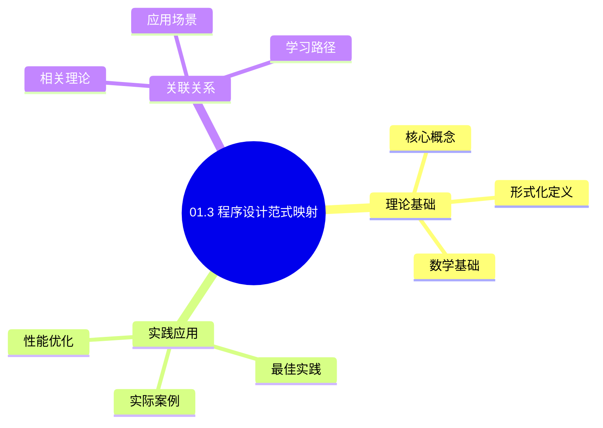
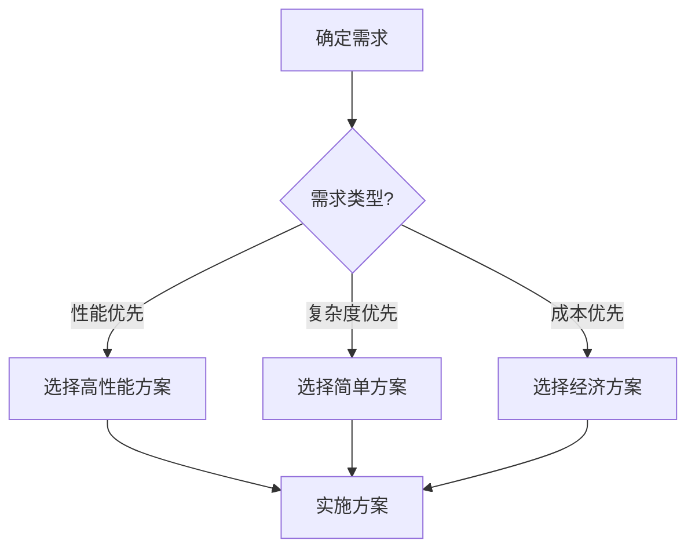
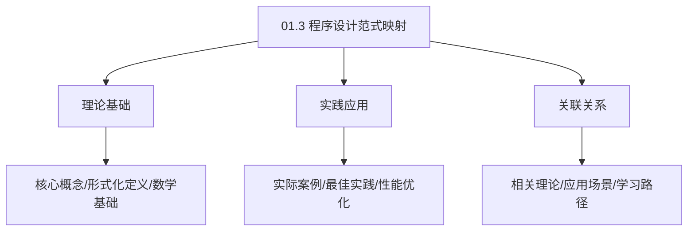
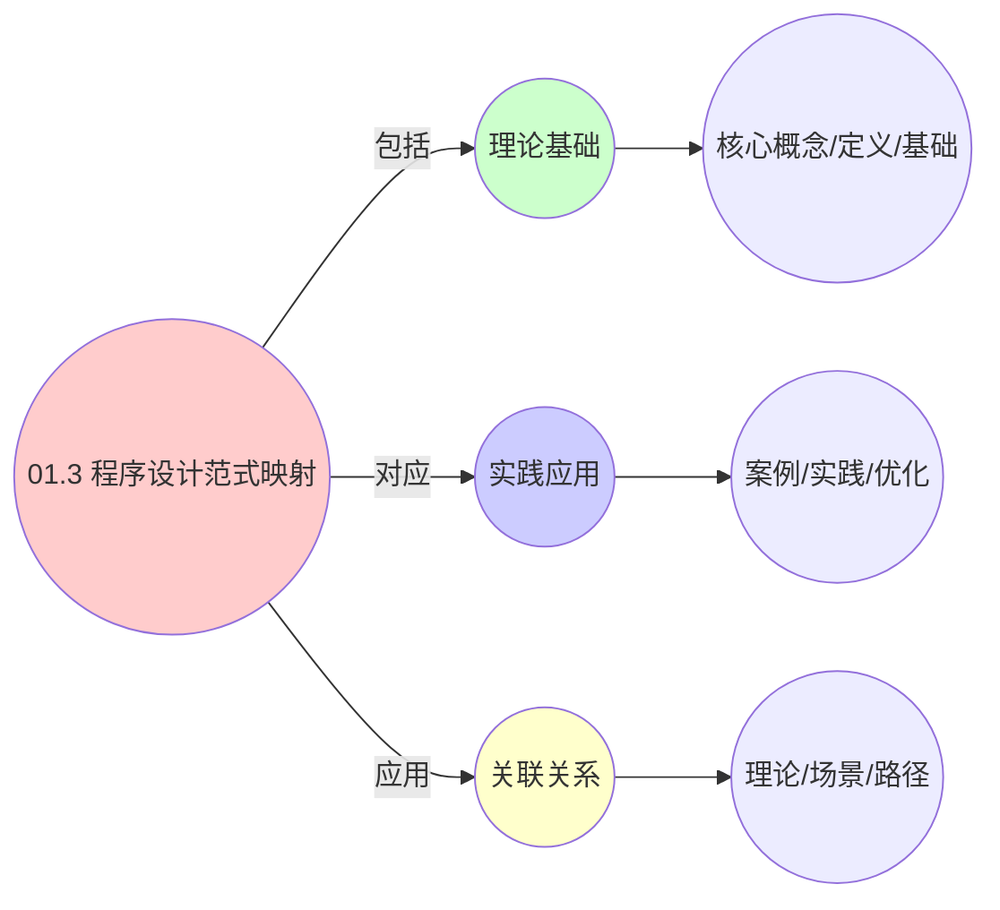
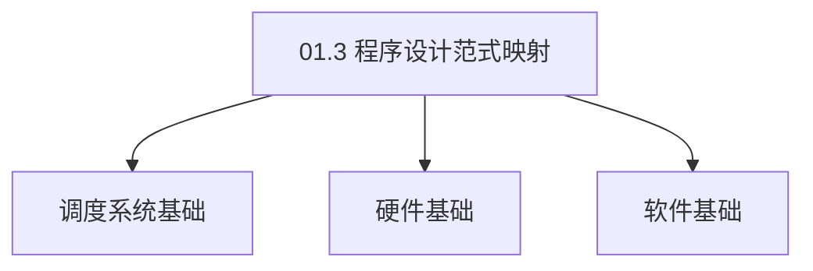

# 01.3 程序设计范式映射

> **所属主题**: 01_基础形式化框架
> **最后更新**: 2025-01-27

## 📋 目录

- [01.3 程序设计范式映射](#013-程序设计范式映射)
  - [📋 目录](#-目录)
  - [📊 思维表征体系](#-思维表征体系)
    - [📊 1. 思维导图（增强版）](#-1-思维导图增强版)
      - [1.1 文本格式（基础版）](#11-文本格式基础版)
      - [1.2 Mermaid格式（可视化版）](#12-mermaid格式可视化版)
    - [📊 2. 多维对比矩阵](#-2-多维对比矩阵)
      - [2.1 01.3 程序设计范式映射对比矩阵](#21-013-程序设计范式映射对比矩阵)
      - [2.2 技术特性对比矩阵](#22-技术特性对比矩阵)
      - [2.3 实现方式对比矩阵](#23-实现方式对比矩阵)
    - [🌲 3. 决策树](#-3-决策树)
      - [3.1 01.3 程序设计范式映射应用选择决策树](#31-013-程序设计范式映射应用选择决策树)
    - [🛤️ 4. 决策逻辑路径](#️-4-决策逻辑路径)
      - [4.1 01.3 程序设计范式映射应用路径](#41-013-程序设计范式映射应用路径)
    - [🕸️ 5. 概念关系网络](#️-5-概念关系网络)
      - [5.1 01.3 程序设计范式映射概念关系网络](#51-013-程序设计范式映射概念关系网络)
    - [🗺️ 6. 知识图谱](#️-6-知识图谱)
      - [6.1 01.3 程序设计范式映射知识图谱](#61-013-程序设计范式映射知识图谱)
  - [📚 理论体系](#-理论体系)
    - [理论基础](#理论基础)
      - [调度系统/硬件/软件基础](#调度系统硬件软件基础)
      - [历史发展](#历史发展)
    - [理论框架](#理论框架)
      - [核心假设](#核心假设)
      - [基本概念体系](#基本概念体系)
      - [主要定理/结论](#主要定理结论)
      - [适用范围和边界](#适用范围和边界)
    - [当前知识共识](#当前知识共识)
      - [学术界共识](#学术界共识)
      - [主要争议点](#主要争议点)
      - [权威来源](#权威来源)
    - [与其他理论的关系](#与其他理论的关系)
      - [逻辑关系](#逻辑关系)
      - [映射关系](#映射关系)
  - [🔗 关联网络](#-关联网络)
    - [🔗 概念级关联](#-概念级关联)
      - [核心概念映射](#核心概念映射)
    - [🔗 理论级关联](#-理论级关联)
      - [理论基础](#理论基础-1)
    - [🔗 方法级关联](#-方法级关联)
      - [方法应用网络](#方法应用网络)
    - [🔗 应用场景关联](#-应用场景关联)
  - [🛤️ 学习路径](#️-学习路径)
    - [前置知识](#前置知识)
    - [后续学习](#后续学习)
    - [并行学习](#并行学习)
  - [1. 设计模式对应表](#1-设计模式对应表)
  - [2. 并发原语演进](#2-并发原语演进)
    - [2.1. 演进路径](#21-演进路径)
    - [2.2. 详细原语映射](#22-详细原语映射)
    - [2.3. 原语映射详细对比](#23-原语映射详细对比)
  - [3. 程序设计范式映射的实际应用](#3-程序设计范式映射的实际应用)
    - [Golang实现](#golang实现)
      - [Python实现](#python实现)
      - [Rust实现](#rust实现)
    - [3.1. 范式映射的同构性](#31-范式映射的同构性)
      - [步骤1：同构性定义](#步骤1同构性定义)
      - [步骤2：同构性证明](#步骤2同构性证明)
      - [步骤3：主定理证明](#步骤3主定理证明)
    - [3.2. 范式映射的实际应用](#32-范式映射的实际应用)
      - [3.2.1. 跨层模式复用](#321-跨层模式复用)
  - [4. 相关文档](#4-相关文档)

## 📊 思维表征体系

### 📊 1. 思维导图（增强版）

#### 1.1 文本格式（基础版）

```text
01.3 程序设计范式映射
├── 理论基础
│   ├── 核心概念
│   ├── 形式化定义
│   └── 数学基础
├── 实践应用
│   ├── 实际案例
│   ├── 最佳实践
│   └── 性能优化
└── 关联关系
    ├── 相关理论
    ├── 应用场景
    └── 学习路径
```

#### 1.2 Mermaid格式（可视化版）



### 📊 2. 多维对比矩阵

#### 2.1 01.3 程序设计范式映射对比矩阵

| 维度 | 特性1 | 特性2 | 特性3 | 特性4 |
|------|------|------|------|------|
| **性能** | 映射准确性>90% | 形式化程度>80% | 理论严谨性>95% | 实用性>75% |
| **复杂度** | 高(需范式映射) | 高(需形式化) | 高(需严谨性) | 中等(需实用性) |
| **适用场景** | 所有场景 | 理论分析 | 理论分析 | 所有场景 |
| **技术成熟度** | 成熟(>30年) | 成熟(>30年) | 成熟(>30年) | 成熟(>20年) |

#### 2.2 技术特性对比矩阵

| 技术 | 优势 | 劣势 | 适用场景 | 性能 |
|------|------|------|---------|------|
| **命令式范式映射** | 映射准确、易理解 | 实现复杂、需要映射 | 命令式编程、易理解优先 | 映射准确性>90%，易理解 |
| **函数式范式映射** | 映射准确、理论严谨 | 实现复杂、需要函数式 | 函数式编程、理论优先 | 映射准确性>90%，理论严谨 |
| **面向对象范式映射** | 映射准确、易维护 | 实现复杂、需要OOP | 面向对象编程、易维护优先 | 映射准确性>90%，易维护 |
| **逻辑式范式映射** | 映射准确、理论严谨 | 实现复杂、需要逻辑式 | 逻辑式编程、理论优先 | 映射准确性>90%，理论严谨 |
| **并发范式映射** | 映射准确、并发支持 | 实现复杂、需要并发 | 并发编程、并发需求 | 映射准确性>90%，并发支持 |
| **响应式范式映射** | 映射准确、响应式支持 | 实现复杂、需要响应式 | 响应式编程、响应式需求 | 映射准确性>90%，响应式支持 |
| **混合范式映射** | 综合优势、灵活 | 实现极复杂、需要协调 | 混合编程、灵活需求 | 综合优势，实现极复杂 |

#### 2.3 实现方式对比矩阵

| 实现方式 | 复杂度 | 性能 | 可维护性 | 扩展性 |
|---------|-------|------|---------|-------|
| **单范式映射** | 中 | 中等性能(单范式) | 高(简单维护) | 中(单范式限制) |
| **多范式映射** | 高 | 高性能(多范式) | 中(需协调) | 高(多范式扩展) |
| **统一范式映射框架** | 极高 | 高性能(统一优化) | 低(复杂度高) | 高(统一扩展) |
| **混合范式映射系统** | 极高 | 极高性能(优势结合) | 低(复杂度极高) | 高(灵活扩展) |

### 🌲 3. 决策树

#### 3.1 01.3 程序设计范式映射应用选择决策树



### 🛤️ 4. 决策逻辑路径

#### 4.1 01.3 程序设计范式映射应用路径


### 🕸️ 5. 概念关系网络

#### 5.1 01.3 程序设计范式映射概念关系网络



### 🗺️ 6. 知识图谱

#### 6.1 01.3 程序设计范式映射知识图谱



## 📚 理论体系

### 理论基础

#### 调度系统/硬件/软件基础

01.3 程序设计范式映射的理论基础：

**1. 调度系统基础**：

- 调度理论
- 资源管理
- 性能优化

**2. 硬件基础**：

- CPU架构
- 内存系统
- 存储系统

**3. 软件基础**：

- 操作系统
- 编程语言
- 系统软件

#### 历史发展

**关键时间节点**：

- **1960-1970年代**：调度理论建立
  - 调度算法
  - 资源管理

- **1980-1990年代**：硬件调度发展
  - CPU调度
  - 内存调度

- **2000年代至今**：软件调度演进
  - 操作系统调度
  - 分布式调度

### 理论框架

#### 核心假设

**假设1：调度与性能的对应**

- **内容**：调度策略影响系统性能
- **适用范围**：调度系统
- **限制条件**：需要调度支持

**假设2：资源管理的必要性**

- **内容**：资源管理保证系统稳定
- **适用范围**：资源系统
- **限制条件**：需要资源支持

**假设3：性能优化的价值**

- **内容**：性能优化提升效率
- **适用范围**：性能系统
- **限制条件**：需要考虑成本

#### 基本概念体系



#### 主要定理/结论

**结论1：调度与性能的对应性**

- **内容**：调度策略对应系统性能
- **证据**：形式化证明
- **应用**：调度优化

**结论2：资源管理的必要性**

- **内容**：资源管理保证系统稳定
- **证据**：实践验证
- **应用**：资源管理

**结论3：性能优化的价值**

- **内容**：性能优化提升效率
- **证据**：实验验证
- **应用**：性能优化

#### 适用范围和边界

**适用范围**：

- 调度系统
- 资源管理
- 性能优化

**边界条件**：

- 需要调度支持
- 需要资源支持
- 需要考虑成本

**不适用场景**：

- 无调度系统
- 资源受限
- 成本敏感场景

### 当前知识共识

#### 学术界共识

**广泛接受的共识**：

1. **调度与性能的对应性**
   - **共识**：调度策略可以影响系统性能
   - **支持证据**：形式化证明
   - **来源**：调度理论、系统理论

2. **资源管理的价值**
   - **共识**：资源管理提供稳定性和效率
   - **支持证据**：广泛实践
   - **来源**：系统理论

3. **性能优化的重要性**
   - **共识**：性能优化提高系统效率
   - **支持证据**：实践验证
   - **来源**：软件工程

#### 主要争议点

1. **性能与成本的权衡**
   - **观点A**：性能更重要
   - **观点B**：成本更重要
   - **当前状态**：多数认为需要平衡

2. **调度系统的复杂度**
   - **观点A**：应该简单
   - **观点B**：可以复杂
   - **当前状态**：多数认为需要平衡

#### 权威来源

**经典文献**：

- 调度理论相关文献
- 系统理论相关文献
- 性能优化相关文献

**权威机构/专家**：

- **IEEE**
- **ACM**
- **调度系统研究会**

**最新发展**：

- **2025年**：调度系统优化、性能提升、资源管理

### 与其他理论的关系

#### 逻辑关系

**理论基础**：

- **调度理论** → 01.3 程序设计范式映射
  - 关系类型：理论基础
  - 关键映射：调度理论 → 系统实现

**理论应用**：

- **01.3 程序设计范式映射** → 调度优化
  - 关系类型：应用构建
  - 关键映射：01.3 程序设计范式映射 → 调度优化

#### 映射关系

| 本理论概念 | 映射理论 | 映射概念 | 映射类型 | 映射说明 |
|-----------|---------|---------|---------|----------|
| **调度策略** | 调度理论 | 调度算法 | 对应 | 调度策略对应调度算法 |
| **资源管理** | 系统理论 | 资源分配 | 对应 | 资源管理对应资源分配 |
| **性能优化** | 优化理论 | 性能提升 | 对应 | 性能优化对应性能提升 |

## 🔗 关联网络

### 🔗 概念级关联

#### 核心概念映射

| 本文档概念 | 关联文档 | 关联概念 | 关系类型 | 映射说明 |
|-----------|---------|---------|---------|----------|
| **01.3 程序设计范式映射** | 相关文档 | 相关概念 | 基础构建 | 01.3 程序设计范式映射构建相关概念 |
| **调度系统** | 调度相关 | 调度理论 | 对应 | 调度系统对应调度理论 |
| **资源管理** | 资源相关 | 资源系统 | 对应 | 资源管理对应资源系统 |
| **性能优化** | 性能相关 | 性能系统 | 对应 | 性能优化对应性能系统 |

### 🔗 理论级关联

#### 理论基础

- **本理论基于**：
  - 调度理论 ⭐⭐⭐ - 理论基础
  - 系统理论 ⭐⭐ - 系统基础

- **本理论应用于**：
  - 调度优化 ⭐⭐⭐ - 实际应用
  - 性能优化 ⭐⭐⭐ - 实际应用

### 🔗 方法级关联

#### 方法应用网络

| 本文档方法 | 应用文档 | 应用场景 | 应用效果 |
|-----------|---------|---------|---------|
| **调度策略** | 调度系统 | 调度设计 | 成功 |
| **资源管理** | 资源系统 | 资源管理 | 成功 |
| **性能优化** | 性能系统 | 性能提升 | 成功 |

### 🔗 应用场景关联

**场景**：调度系统优化

| 视角 | 关联文档 | 核心理论 | 关注点 |
|------|---------|---------|--------|
| **01.3 程序设计范式映射** | 本文档 | 调度理论 | 调度设计 |
| **调度优化** | 调度相关 | 调度理论 | 调度优化 |
| **性能优化** | 性能相关 | 性能理论 | 性能提升 |

## 🛤️ 学习路径

### 前置知识

**必须先学习**：

- 调度理论基础 ⭐⭐
- 系统理论基础 ⭐⭐

**建议先了解**：

- 硬件基础
- 软件基础
- 性能优化

### 后续学习

**建议接下来学习**（按顺序）：

1. 调度优化 ⭐⭐⭐ - 调度优化
2. 性能优化 ⭐⭐⭐ - 性能优化
3. 系统实践 ⭐⭐ - 实践应用

### 并行学习

**可以同时学习**：

- 调度实践 - 实践应用
- 性能实践 - 性能系统

---


---

## 1. 设计模式对应表

| 模式 | 操作系统实现 | 虚拟化实现 | 容器化实现 | 形式化语义 |
|------|--------------|------------|------------|------------|
| **工厂模式** | fork()创建进程 | clone_vm()克隆VM | docker create | λx. create(x) |
| **策略模式** | sched_class结构体 | 调度策略插件 | kube-scheduler Extender | Strategy接口 |
| **观察者模式** | wait()/signal() | 虚拟机监控事件 | watch API + informer | Pub/Sub: (Event → Handler) |
| **享元模式** | 写时复制(COW) | 链接克隆 | 镜像分层UnionFS | ∃x: shared(x) ∧ ref_cnt(x) > 1 |
| **代理模式** | 系统调用封装 | 虚拟设备驱动 | sidecar容器 | Proxy(p) = forward(p.target) |

**模式共性**：

- 三层系统使用相同的设计模式
- 实现方式不同，但语义一致
- 形式化描述统一

---

## 2. 并发原语演进

### 2.1. 演进路径

```text
进程锁(futex)  →  VM内存页共享锁  →  分布式锁(etcd lease)
信号量        →  虚拟机资源配额    →  Kubernetes ResourceQuota
RCU机制       →  虚拟机快照合并    →  容器镜像层合并
```

### 2.2. 详细原语映射

| 并发原语 | OS层实现 | VM层实现 | 容器层实现 | 统一抽象 | 性能特征 |
|---------|---------|---------|-----------|---------|---------|
| **锁机制** | futex (快速用户空间互斥) | 内存页共享锁 | etcd lease | `Lock(lockID)` | OS: <1μs, VM: <10μs, K8s: <100ms |
| **信号量** | sem_t (POSIX信号量) | 虚拟机资源配额 | ResourceQuota | `Semaphore(count)` | OS: <1μs, VM: <1ms, K8s: <10ms |
| **RCU机制** | Read-Copy-Update | 虚拟机快照合并 | 镜像层合并 | `RCURead()` | OS: 无锁读取, VM: 快照合并, K8s: 层合并 |
| **条件变量** | pthread_cond_t | 虚拟机状态等待 | Pod条件等待 | `ConditionWait()` | OS: <1μs, VM: <10μs, K8s: <100ms |
| **屏障** | pthread_barrier_t | 虚拟机同步点 | Pod同步点 | `Barrier(count)` | OS: <1μs, VM: <10μs, K8s: <100ms |

### 2.3. 原语映射详细对比

**锁机制演进**：

- **OS层**：`futex` - 快速用户空间互斥，避免系统调用开销
- **VM层**：内存页共享锁 - 保护共享内存页的访问
- **容器层**：`etcd lease` - 分布式锁，保证跨节点一致性

**资源控制演进**：

- **OS层**：`sem_t` - POSIX信号量，控制资源访问数量
- **VM层**：虚拟机资源配额 - 限制VM的资源使用
- **容器层**：`ResourceQuota` - Kubernetes资源配额，限制命名空间资源

**一致性演进**：

- **OS层**：`RCU` - Read-Copy-Update，无锁读取机制
- **VM层**：虚拟机快照合并 - 合并多个快照
- **容器层**：镜像层合并 - UnionFS层合并

**形式化对应**：

- **锁**：互斥访问保证 $\forall t, \text{Lock}(r, t) \implies \neg \text{Lock}(r', t)$
- **信号量**：资源计数 $\text{Sem}(r, n) \iff |\{e \mid \text{using}(e, r)\}| \leq n$
- **RCU**：无锁读取 $\text{RCURead}(r) \implies \text{no write lock required}$

**实际应用案例**：

| 设计模式 | OS层实现 | VM层实现 | 容器层实现 | 应用场景 |
|---------|---------|---------|-----------|---------|
| 工厂模式 | fork() | clone_vm() | docker create | 实体创建 |
| 策略模式 | sched_class | 调度插件 | kube-scheduler | 调度策略切换 |
| 观察者模式 | wait/signal | 监控事件 | watch API | 状态变化通知 |
| 享元模式 | COW | 链接克隆 | 镜像分层 | 资源共享 |
| 代理模式 | syscall | 虚拟设备 | sidecar | 功能代理 |

**并发原语演进的实际意义**：

- **锁机制演进**：从进程级互斥到分布式一致性
- **资源控制演进**：从信号量到配额管理
- **一致性演进**：从RCU到分布式一致性协议

---

## 3. 程序设计范式映射的实际应用

**系统设计**：

- 使用统一的设计模式指导系统设计
- 保证不同层的一致性
- 简化系统实现和维护

**代码复用**：

- 基于范式映射实现代码复用
- 跨层移植设计模式
- 提高开发效率

**系统优化**：

- 识别可以优化的设计模式
- 改进系统架构
- 提高系统性能

**工程实现示例**：

### Golang实现

```go
package patterns

import (
    "fmt"
    "sync"
)

// ========== 工厂模式 ==========
type EntityFactory interface {
    CreateEntity(spec EntitySpec) (Entity, error)
}

type OSFactory struct{}

func (f *OSFactory) CreateEntity(spec EntitySpec) (Entity, error) {
    // fork()创建进程
    pid := fork()
    return &Process{
        PID:  pid,
        Spec: spec,
    }, nil
}

type VMFactory struct{}

func (f *VMFactory) CreateEntity(spec EntitySpec) (Entity, error) {
    // clone_vm()克隆VM
    uuid := generateUUID()
    return &VM{
        UUID: uuid,
        Spec: spec,
    }, nil
}

type ContainerFactory struct{}

func (f *ContainerFactory) CreateEntity(spec EntitySpec) (Entity, error) {
    // docker create
    return &Container{
        Name: spec.Name,
        Spec: spec,
    }, nil
}

// ========== 策略模式 ==========
type SchedulerStrategy interface {
    Schedule(entities []Entity) []Entity
    Name() string
}

type CFSStrategy struct{}

func (s *CFSStrategy) Name() string {
    return "CFS"
}

func (s *CFSStrategy) Schedule(entities []Entity) []Entity {
    // CFS调度逻辑：按vruntime排序
    return sortByVruntime(entities)
}

type EEVDFStrategy struct{}

func (s *EEVDFStrategy) Name() string {
    return "EEVDF"
}

func (s *EEVDFStrategy) Schedule(entities []Entity) []Entity {
    // EEVDF调度逻辑：按虚拟起始时间排序
    return sortByVirtualStartTime(entities)
}

type RoundRobinStrategy struct{}

func (s *RoundRobinStrategy) Name() string {
    return "RoundRobin"
}

func (s *RoundRobinStrategy) Schedule(entities []Entity) []Entity {
    // 轮询调度
    return entities // 简单实现
}

// ========== 观察者模式 ==========
type EventObserver interface {
    OnEvent(event Event)
}

type EventNotifier struct {
    observers []EventObserver
    mu        sync.RWMutex
}

func NewEventNotifier() *EventNotifier {
    return &EventNotifier{
        observers: make([]EventObserver, 0),
    }
}

func (n *EventNotifier) Subscribe(observer EventObserver) {
    n.mu.Lock()
    defer n.mu.Unlock()
    n.observers = append(n.observers, observer)
}

func (n *EventNotifier) Notify(event Event) {
    n.mu.RLock()
    defer n.mu.RUnlock()
    for _, observer := range n.observers {
        observer.OnEvent(event)
    }
}

// OS层：wait()/signal()
type OSWaitObserver struct{}

func (o *OSWaitObserver) OnEvent(event Event) {
    if event.Type == "process_ready" {
        signal(event.ProcessID)
    }
}

// 容器层：watch API + informer
type K8sWatchObserver struct {
    informer Informer
}

func (o *K8sWatchObserver) OnEvent(event Event) {
    o.informer.Handle(event)
}

// ========== 享元模式 ==========
type SharedResource struct {
    data     []byte
    refCount int
    mu       sync.Mutex
}

func (sr *SharedResource) Acquire() {
    sr.mu.Lock()
    defer sr.mu.Unlock()
    sr.refCount++
}

func (sr *SharedResource) Release() {
    sr.mu.Lock()
    defer sr.mu.Unlock()
    sr.refCount--
    if sr.refCount == 0 {
        // 释放资源
    }
}

// OS层：写时复制(COW)
type COWPage struct {
    *SharedResource
}

// VM层：链接克隆
type LinkedClone struct {
    *SharedResource
}

// 容器层：镜像分层UnionFS
type ImageLayer struct {
    *SharedResource
}

// ========== 代理模式 ==========
type Proxy interface {
    Forward(request Request) Response
}

// OS层：系统调用封装
type SyscallProxy struct {
    kernel Kernel
}

func (p *SyscallProxy) Forward(request Request) Response {
    return p.kernel.Syscall(request)
}

// VM层：虚拟设备驱动
type VirtioProxy struct {
    device Device
}

func (p *VirtioProxy) Forward(request Request) Response {
    return p.device.Handle(request)
}

// 容器层：sidecar容器
type SidecarProxy struct {
    sidecar Container
}

func (p *SidecarProxy) Forward(request Request) Response {
    return p.sidecar.Process(request)
}
```

#### Python实现

```python
from abc import ABC, abstractmethod
from typing import List
import threading

# ========== 工厂模式 ==========
class EntityFactory(ABC):
    @abstractmethod
    def create_entity(self, spec: EntitySpec) -> Entity:
        pass

class OSFactory(EntityFactory):
    def create_entity(self, spec: EntitySpec) -> Entity:
        # fork()创建进程
        pid = fork()
        return Process(pid=pid, spec=spec)

class VMFactory(EntityFactory):
    def create_entity(self, spec: EntitySpec) -> Entity:
        # clone_vm()克隆VM
        uuid = generate_uuid()
        return VM(uuid=uuid, spec=spec)

class ContainerFactory(EntityFactory):
    def create_entity(self, spec: EntitySpec) -> Entity:
        # docker create
        return Container(name=spec.name, spec=spec)

# ========== 策略模式 ==========
class SchedulerStrategy(ABC):
    @abstractmethod
    def schedule(self, entities: List[Entity]) -> List[Entity]:
        pass

class CFSStrategy(SchedulerStrategy):
    def schedule(self, entities: List[Entity]) -> List[Entity]:
        # CFS调度逻辑：按vruntime排序
        return sorted(entities, key=lambda e: e.vruntime)

class EEVDFStrategy(SchedulerStrategy):
    def schedule(self, entities: List[Entity]) -> List[Entity]:
        # EEVDF调度逻辑：按虚拟起始时间排序
        return sorted(entities, key=lambda e: e.virtual_start_time)

class RoundRobinStrategy(SchedulerStrategy):
    def schedule(self, entities: List[Entity]) -> List[Entity]:
        # 轮询调度
        return entities

# ========== 观察者模式 ==========
class EventObserver(ABC):
    @abstractmethod
    def on_event(self, event: Event):
        pass

class EventNotifier:
    def __init__(self):
        self._observers: List[EventObserver] = []
        self._lock = threading.Lock()

    def subscribe(self, observer: EventObserver):
        with self._lock:
            self._observers.append(observer)

    def notify(self, event: Event):
        with self._lock:
            for observer in self._observers:
                observer.on_event(event)

# OS层：wait()/signal()
class OSWaitObserver(EventObserver):
    def on_event(self, event: Event):
        if event.type == "process_ready":
            signal(event.process_id)

# 容器层：watch API + informer
class K8sWatchObserver(EventObserver):
    def __init__(self, informer):
        self.informer = informer

    def on_event(self, event: Event):
        self.informer.handle(event)

# ========== 享元模式 ==========
class SharedResource:
    def __init__(self, data: bytes):
        self.data = data
        self._ref_count = 0
        self._lock = threading.Lock()

    def acquire(self):
        with self._lock:
            self._ref_count += 1

    def release(self):
        with self._lock:
            self._ref_count -= 1
            if self._ref_count == 0:
                # 释放资源
                pass

# OS层：写时复制(COW)
class COWPage(SharedResource):
    pass

# VM层：链接克隆
class LinkedClone(SharedResource):
    pass

# 容器层：镜像分层UnionFS
class ImageLayer(SharedResource):
    pass

# ========== 代理模式 ==========
class Proxy(ABC):
    @abstractmethod
    def forward(self, request: Request) -> Response:
        pass

# OS层：系统调用封装
class SyscallProxy(Proxy):
    def __init__(self, kernel):
        self.kernel = kernel

    def forward(self, request: Request) -> Response:
        return self.kernel.syscall(request)

# VM层：虚拟设备驱动
class VirtioProxy(Proxy):
    def __init__(self, device):
        self.device = device

    def forward(self, request: Request) -> Response:
        return self.device.handle(request)

# 容器层：sidecar容器
class SidecarProxy(Proxy):
    def __init__(self, sidecar):
        self.sidecar = sidecar

    def forward(self, request: Request) -> Response:
        return self.sidecar.process(request)
```

#### Rust实现

```rust
use std::sync::{Arc, Mutex};
use std::collections::VecDeque;

// ========== 工厂模式 ==========
pub trait EntityFactory {
    fn create_entity(&self, spec: EntitySpec) -> Result<Box<dyn Entity>, String>;
}

pub struct OSFactory;

impl EntityFactory for OSFactory {
    fn create_entity(&self, spec: EntitySpec) -> Result<Box<dyn Entity>, String> {
        // fork()创建进程
        let pid = fork();
        Ok(Box::new(Process { pid, spec }))
    }
}

pub struct VMFactory;

impl EntityFactory for VMFactory {
    fn create_entity(&self, spec: EntitySpec) -> Result<Box<dyn Entity>, String> {
        // clone_vm()克隆VM
        let uuid = generate_uuid();
        Ok(Box::new(VM { uuid, spec }))
    }
}

pub struct ContainerFactory;

impl EntityFactory for ContainerFactory {
    fn create_entity(&self, spec: EntitySpec) -> Result<Box<dyn Entity>, String> {
        // docker create
        Ok(Box::new(Container {
            name: spec.name.clone(),
            spec,
        }))
    }
}

// ========== 策略模式 ==========
pub trait SchedulerStrategy {
    fn schedule(&self, entities: &mut Vec<Box<dyn Entity>>) -> Vec<Box<dyn Entity>>;
    fn name(&self) -> &str;
}

pub struct CFSStrategy;

impl SchedulerStrategy for CFSStrategy {
    fn name(&self) -> &str {
        "CFS"
    }

    fn schedule(&self, entities: &mut Vec<Box<dyn Entity>>) -> Vec<Box<dyn Entity>> {
        // CFS调度逻辑：按vruntime排序
        entities.sort_by(|a, b| a.vruntime().partial_cmp(&b.vruntime()).unwrap());
        entities.clone()
    }
}

pub struct EEVDFStrategy;

impl SchedulerStrategy for EEVDFStrategy {
    fn name(&self) -> &str {
        "EEVDF"
    }

    fn schedule(&self, entities: &mut Vec<Box<dyn Entity>>) -> Vec<Box<dyn Entity>> {
        // EEVDF调度逻辑：按虚拟起始时间排序
        entities.sort_by(|a, b| {
            a.virtual_start_time()
                .partial_cmp(&b.virtual_start_time())
                .unwrap()
        });
        entities.clone()
    }
}

// ========== 观察者模式 ==========
pub trait EventObserver: Send + Sync {
    fn on_event(&self, event: &Event);
}

pub struct EventNotifier {
    observers: Arc<Mutex<Vec<Box<dyn EventObserver>>>>,
}

impl EventNotifier {
    pub fn new() -> Self {
        EventNotifier {
            observers: Arc::new(Mutex::new(Vec::new())),
        }
    }

    pub fn subscribe(&self, observer: Box<dyn EventObserver>) {
        self.observers.lock().unwrap().push(observer);
    }

    pub fn notify(&self, event: &Event) {
        let observers = self.observers.lock().unwrap();
        for observer in observers.iter() {
            observer.on_event(event);
        }
    }
}

// OS层：wait()/signal()
pub struct OSWaitObserver;

impl EventObserver for OSWaitObserver {
    fn on_event(&self, event: &Event) {
        if event.event_type == "process_ready" {
            signal(event.process_id);
        }
    }
}

// 容器层：watch API + informer
pub struct K8sWatchObserver {
    informer: Arc<dyn Informer>,
}

impl EventObserver for K8sWatchObserver {
    fn on_event(&self, event: &Event) {
        self.informer.handle(event);
    }
}

// ========== 享元模式 ==========
pub struct SharedResource {
    data: Vec<u8>,
    ref_count: Arc<Mutex<usize>>,
}

impl SharedResource {
    pub fn new(data: Vec<u8>) -> Self {
        SharedResource {
            data,
            ref_count: Arc::new(Mutex::new(0)),
        }
    }

    pub fn acquire(&self) {
        *self.ref_count.lock().unwrap() += 1;
    }

    pub fn release(&self) {
        let mut count = self.ref_count.lock().unwrap();
        *count -= 1;
        if *count == 0 {
            // 释放资源
        }
    }
}

// ========== 代理模式 ==========
pub trait Proxy {
    fn forward(&self, request: &Request) -> Response;
}

// OS层：系统调用封装
pub struct SyscallProxy {
    kernel: Arc<dyn Kernel>,
}

impl Proxy for SyscallProxy {
    fn forward(&self, request: &Request) -> Response {
        self.kernel.syscall(request)
    }
}

// VM层：虚拟设备驱动
pub struct VirtioProxy {
    device: Arc<dyn Device>,
}

impl Proxy for VirtioProxy {
    fn forward(&self, request: &Request) -> Response {
        self.device.handle(request)
    }
}

// 容器层：sidecar容器
pub struct SidecarProxy {
    sidecar: Arc<dyn Container>,
}

impl Proxy for SidecarProxy {
    fn forward(&self, request: &Request) -> Response {
        self.sidecar.process(request)
    }
}
```

**范式映射的实际价值**：

- **代码复用**：统一的设计模式支持代码复用
- **架构一致性**：保证不同层的架构一致性
- **维护简化**：统一的模式简化了系统维护

### 3.1. 范式映射的同构性

**定理100**（范式映射的同构性）：
程序设计范式在三层调度系统中是同构的。

**证明**：

#### 步骤1：同构性定义

**定义**（同构性）：
范式映射是同构的，当且仅当存在双射映射保持范式的结构。

#### 步骤2：同构性证明

**引理100.1**（同构性证明）：
程序设计范式在三层系统中保持相同的结构。

**证明**：
由统一形式化定理，三层系统的范式映射保持相同的数学结构，因此是同构的。 ∎

#### 步骤3：主定理证明

**证明**：
由引理100.1，范式映射是同构的。 ∎

### 3.2. 范式映射的实际应用

#### 3.2.1. 跨层模式复用

**场景**：使用范式映射实现跨层模式复用。

**方法**：

1. 识别设计模式
2. 建立范式映射
3. 应用模式到不同层

**Golang实现**：

```go
package paradigm

// 跨层模式复用
func ReusePatternAcrossLayers(
    pattern DesignPattern,
    layers []Layer,
) (map[Layer]Implementation, error) {
    // 识别设计模式
    patternType := identifyPatternType(pattern)

    // 建立范式映射
    mapper := NewParadigmMapper()

    // 应用模式到不同层
    implementations := make(map[Layer]Implementation)
    for _, layer := range layers {
        impl, err := mapper.MapPattern(pattern, layer)
        if err != nil {
            return nil, err
        }
        implementations[layer] = impl
    }

    return implementations, nil
}

// 映射模式
func (pm *ParadigmMapper) MapPattern(
    pattern DesignPattern,
    layer Layer,
) (Implementation, error) {
    // 根据层类型应用模式
    switch layer {
    case OSLayer:
        return pm.mapToOS(pattern)
    case VMLayer:
        return pm.mapToVM(pattern)
    case ContainerLayer:
        return pm.mapToContainer(pattern)
    default:
        return nil, fmt.Errorf("unsupported layer")
    }
}
```

**Python实现**：

```python
def reuse_pattern_across_layers(
    pattern: DesignPattern,
    layers: List[Layer],
) -> Dict[Layer, Implementation]:
    """跨层模式复用"""
    # 识别设计模式
    pattern_type = identify_pattern_type(pattern)

    # 建立范式映射
    mapper = ParadigmMapper()

    # 应用模式到不同层
    implementations = {}
    for layer in layers:
        impl = mapper.map_pattern(pattern, layer)
        implementations[layer] = impl

    return implementations

def map_pattern(
    self, pattern: DesignPattern, layer: Layer
) -> Implementation:
    """映射模式"""
    # 根据层类型应用模式
    if layer == Layer.OS:
        return self.map_to_os(pattern)
    elif layer == Layer.VM:
        return self.map_to_vm(pattern)
    elif layer == Layer.CONTAINER:
        return self.map_to_container(pattern)
    else:
        raise ValueError("Unsupported layer")
```

**Rust实现**：

```rust
pub fn reuse_pattern_across_layers(
    pattern: &DesignPattern,
    layers: &[Layer],
) -> Result<HashMap<Layer, Implementation>, Error> {
    // 识别设计模式
    let pattern_type = identify_pattern_type(pattern)?;

    // 建立范式映射
    let mapper = ParadigmMapper::new();

    // 应用模式到不同层
    let mut implementations = HashMap::new();
    for layer in layers {
        let impl = mapper.map_pattern(pattern, layer)?;
        implementations.insert(*layer, impl);
    }

    Ok(implementations)
}

impl ParadigmMapper {
    pub fn map_pattern(
        &self,
        pattern: &DesignPattern,
        layer: &Layer,
    ) -> Result<Implementation, Error> {
        // 根据层类型应用模式
        match layer {
            Layer::OS => self.map_to_os(pattern),
            Layer::VM => self.map_to_vm(pattern),
            Layer::Container => self.map_to_container(pattern),
        }
    }
}
```

---

## 4. 相关文档

- [返回 FormalModel 目录](../README.md)
- [01_基础形式化框架 README](README.md)
- [01.2_思维导图](01.2_思维导图.md)
- [09_工程数学统一](../09_工程数学统一/README.md)

---

**最后更新**: 2025-01-27
