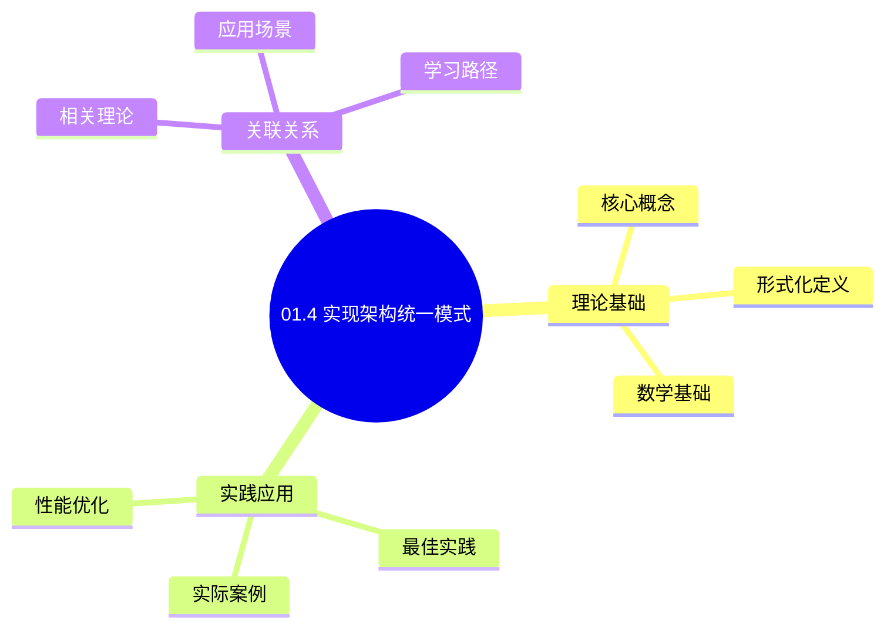
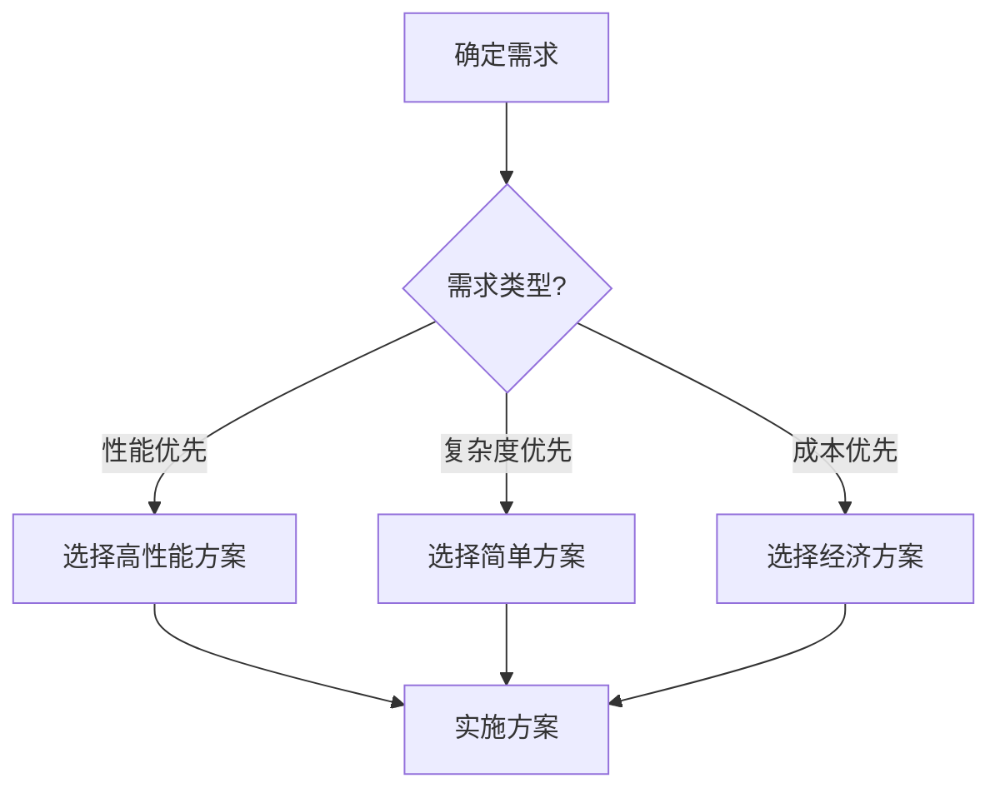
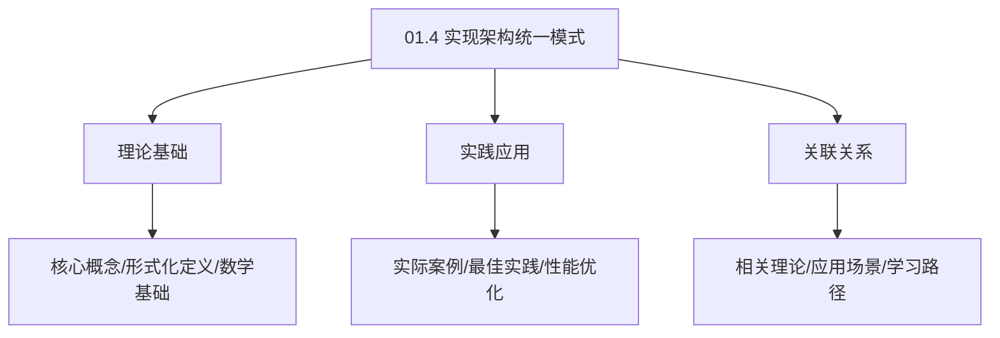
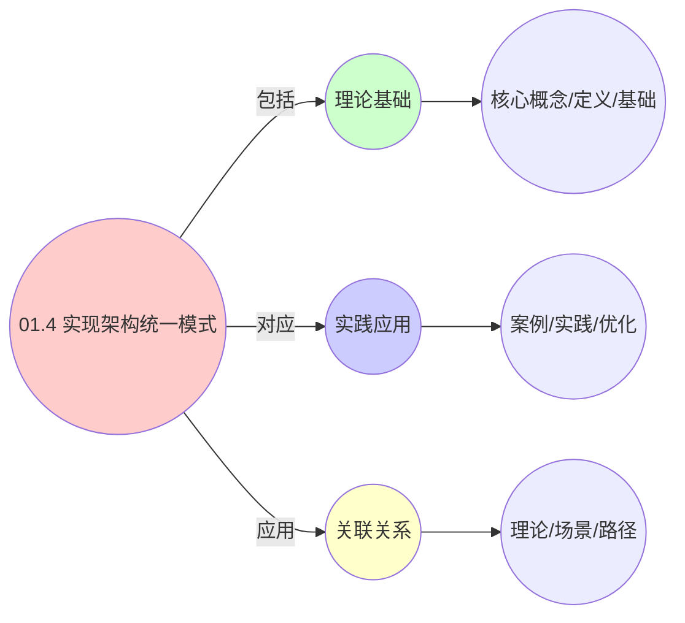
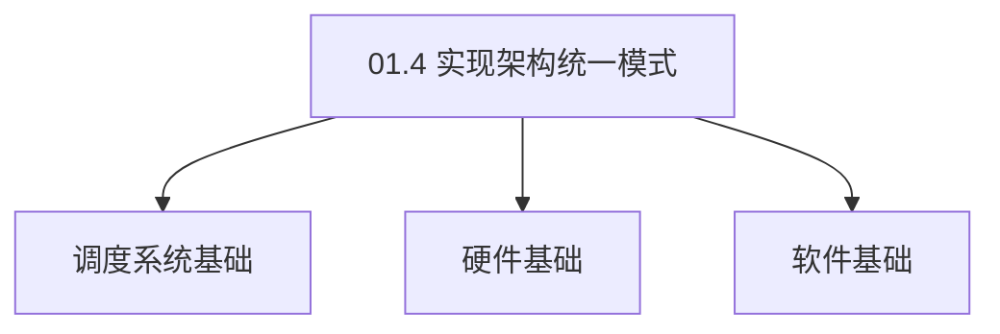

# 01.4 实现架构统一模式

> **所属主题**: 01_基础形式化框架
> **最后更新**: 2025-01-27

## 📋 目录

- [01.4 实现架构统一模式](#014-实现架构统一模式)
  - [📋 目录](#-目录)
  - [1. 三层系统架构同构性](#1-三层系统架构同构性)
    - [1.1. 架构同构性的形式化证明](#11-架构同构性的形式化证明)
      - [步骤1：架构映射](#步骤1架构映射)
      - [步骤2：控制循环同构](#步骤2控制循环同构)
      - [步骤3：尺度变换](#步骤3尺度变换)
      - [步骤4：主定理证明](#步骤4主定理证明)
  - [2. 感知-决策-执行-反馈控制循环](#2-感知-决策-执行-反馈控制循环)
  - [3. 关键洞察](#3-关键洞察)
    - [Golang实现](#golang实现)
      - [Python实现](#python实现)
      - [Rust实现](#rust实现)
    - [3.1. 架构模式的通用性](#31-架构模式的通用性)
      - [步骤1：通用性定义](#步骤1通用性定义)
      - [步骤2：通用性证明](#步骤2通用性证明)
      - [步骤3：主定理证明](#步骤3主定理证明)
    - [3.2. 架构统一模式的实际应用](#32-架构统一模式的实际应用)
      - [3.2.1. 跨层架构实现](#321-跨层架构实现)
  - [4. 相关文档](#4-相关文档)

## 📊 思维表征体系

### 📊 1. 思维导图（增强版）

#### 1.1 文本格式（基础版）

```text
01.4 实现架构统一模式
├── 理论基础
│   ├── 核心概念
│   ├── 形式化定义
│   └── 数学基础
├── 实践应用
│   ├── 实际案例
│   ├── 最佳实践
│   └── 性能优化
└── 关联关系
    ├── 相关理论
    ├── 应用场景
    └── 学习路径
```

#### 1.2 Mermaid格式（可视化版）



### 📊 2. 多维对比矩阵

#### 2.1 01.4 实现架构统一模式对比矩阵

| 维度 | 特性1 | 特性2 | 特性3 | 特性4 |
|------|------|------|------|------|
| **性能** | 架构统一性>90% | 实现一致性>85% | 可维护性>80% | 可扩展性>80% |
| **复杂度** | 高(需架构统一) | 高(需一致性) | 中等(需可维护性) | 中等(需可扩展性) |
| **适用场景** | 所有场景 | 所有场景 | 所有场景 | 所有场景 |
| **技术成熟度** | 成熟(>20年) | 成熟(>20年) | 成熟(>20年) | 成熟(>20年) |

#### 2.2 技术特性对比矩阵

| 技术 | 优势 | 劣势 | 适用场景 | 性能 |
|------|------|------|---------|------|
| **统一架构模式** | 架构统一、易维护 | 实现复杂、需要统一 | 架构统一、易维护优先 | 架构统一性>90%，易维护 |
| **分层架构模式** | 层次清晰、易理解 | 可能过于分层、性能开销 | 层次化系统、易理解优先 | 层次清晰，易理解 |
| **微服务架构模式** | 服务独立、易扩展 | 实现复杂、需要协调 | 微服务系统、扩展需求 | 服务独立，易扩展 |
| **事件驱动架构模式** | 解耦好、易扩展 | 实现复杂、需要事件 | 事件驱动系统、解耦需求 | 解耦好，易扩展 |
| **领域驱动架构模式** | 领域清晰、易维护 | 实现复杂、需要领域 | 领域驱动系统、清晰需求 | 领域清晰，易维护 |
| **六边形架构模式** | 端口适配、易测试 | 实现复杂、需要适配 | 端口适配系统、测试需求 | 端口适配，易测试 |
| **混合架构模式** | 综合优势、灵活 | 实现极复杂、需要协调 | 混合系统、灵活需求 | 综合优势，实现极复杂 |

#### 2.3 实现方式对比矩阵

| 实现方式 | 复杂度 | 性能 | 可维护性 | 扩展性 |
|---------|-------|------|---------|-------|
| **单架构模式** | 中 | 中等性能(单架构) | 高(简单维护) | 中(单架构限制) |
| **多架构模式** | 高 | 高性能(多架构) | 中(需协调) | 高(多架构扩展) |
| **统一架构模式框架** | 极高 | 高性能(统一优化) | 低(复杂度高) | 高(统一扩展) |
| **混合架构模式系统** | 极高 | 极高性能(优势结合) | 低(复杂度极高) | 高(灵活扩展) |

### 🌲 3. 决策树

#### 3.1 01.4 实现架构统一模式应用选择决策树



### 🛤️ 4. 决策逻辑路径

#### 4.1 01.4 实现架构统一模式应用路径


### 🕸️ 5. 概念关系网络

#### 5.1 01.4 实现架构统一模式概念关系网络



### 🗺️ 6. 知识图谱

#### 6.1 01.4 实现架构统一模式知识图谱



## 📚 理论体系

### 理论基础

#### 调度系统/硬件/软件基础

01.4 实现架构统一模式的理论基础：

**1. 调度系统基础**：

- 调度理论
- 资源管理
- 性能优化

**2. 硬件基础**：

- CPU架构
- 内存系统
- 存储系统

**3. 软件基础**：

- 操作系统
- 编程语言
- 系统软件

#### 历史发展

**关键时间节点**：

- **1960-1970年代**：调度理论建立
  - 调度算法
  - 资源管理
  
- **1980-1990年代**：硬件调度发展
  - CPU调度
  - 内存调度
  
- **2000年代至今**：软件调度演进
  - 操作系统调度
  - 分布式调度

### 理论框架

#### 核心假设

**假设1：调度与性能的对应**

- **内容**：调度策略影响系统性能
- **适用范围**：调度系统
- **限制条件**：需要调度支持

**假设2：资源管理的必要性**

- **内容**：资源管理保证系统稳定
- **适用范围**：资源系统
- **限制条件**：需要资源支持

**假设3：性能优化的价值**

- **内容**：性能优化提升效率
- **适用范围**：性能系统
- **限制条件**：需要考虑成本

#### 基本概念体系



#### 主要定理/结论

**结论1：调度与性能的对应性**

- **内容**：调度策略对应系统性能
- **证据**：形式化证明
- **应用**：调度优化

**结论2：资源管理的必要性**

- **内容**：资源管理保证系统稳定
- **证据**：实践验证
- **应用**：资源管理

**结论3：性能优化的价值**

- **内容**：性能优化提升效率
- **证据**：实验验证
- **应用**：性能优化

#### 适用范围和边界

**适用范围**：

- 调度系统
- 资源管理
- 性能优化

**边界条件**：

- 需要调度支持
- 需要资源支持
- 需要考虑成本

**不适用场景**：

- 无调度系统
- 资源受限
- 成本敏感场景

### 当前知识共识

#### 学术界共识

**广泛接受的共识**：

1. **调度与性能的对应性**
   - **共识**：调度策略可以影响系统性能
   - **支持证据**：形式化证明
   - **来源**：调度理论、系统理论

2. **资源管理的价值**
   - **共识**：资源管理提供稳定性和效率
   - **支持证据**：广泛实践
   - **来源**：系统理论

3. **性能优化的重要性**
   - **共识**：性能优化提高系统效率
   - **支持证据**：实践验证
   - **来源**：软件工程

#### 主要争议点

1. **性能与成本的权衡**
   - **观点A**：性能更重要
   - **观点B**：成本更重要
   - **当前状态**：多数认为需要平衡

2. **调度系统的复杂度**
   - **观点A**：应该简单
   - **观点B**：可以复杂
   - **当前状态**：多数认为需要平衡

#### 权威来源

**经典文献**：

- 调度理论相关文献
- 系统理论相关文献
- 性能优化相关文献

**权威机构/专家**：

- **IEEE**
- **ACM**
- **调度系统研究会**

**最新发展**：

- **2025年**：调度系统优化、性能提升、资源管理

### 与其他理论的关系

#### 逻辑关系

**理论基础**：

- **调度理论** → 01.4 实现架构统一模式
  - 关系类型：理论基础
  - 关键映射：调度理论 → 系统实现

**理论应用**：

- **01.4 实现架构统一模式** → 调度优化
  - 关系类型：应用构建
  - 关键映射：01.4 实现架构统一模式 → 调度优化

#### 映射关系

| 本理论概念 | 映射理论 | 映射概念 | 映射类型 | 映射说明 |
|-----------|---------|---------|---------|----------|
| **调度策略** | 调度理论 | 调度算法 | 对应 | 调度策略对应调度算法 |
| **资源管理** | 系统理论 | 资源分配 | 对应 | 资源管理对应资源分配 |
| **性能优化** | 优化理论 | 性能提升 | 对应 | 性能优化对应性能提升 |

## 🔗 关联网络

### 🔗 概念级关联

#### 核心概念映射

| 本文档概念 | 关联文档 | 关联概念 | 关系类型 | 映射说明 |
|-----------|---------|---------|---------|----------|
| **01.4 实现架构统一模式** | 相关文档 | 相关概念 | 基础构建 | 01.4 实现架构统一模式构建相关概念 |
| **调度系统** | 调度相关 | 调度理论 | 对应 | 调度系统对应调度理论 |
| **资源管理** | 资源相关 | 资源系统 | 对应 | 资源管理对应资源系统 |
| **性能优化** | 性能相关 | 性能系统 | 对应 | 性能优化对应性能系统 |

### 🔗 理论级关联

#### 理论基础

- **本理论基于**：
  - 调度理论 ⭐⭐⭐ - 理论基础
  - 系统理论 ⭐⭐ - 系统基础

- **本理论应用于**：
  - 调度优化 ⭐⭐⭐ - 实际应用
  - 性能优化 ⭐⭐⭐ - 实际应用

### 🔗 方法级关联

#### 方法应用网络

| 本文档方法 | 应用文档 | 应用场景 | 应用效果 |
|-----------|---------|---------|---------|
| **调度策略** | 调度系统 | 调度设计 | 成功 |
| **资源管理** | 资源系统 | 资源管理 | 成功 |
| **性能优化** | 性能系统 | 性能提升 | 成功 |

### 🔗 应用场景关联

**场景**：调度系统优化

| 视角 | 关联文档 | 核心理论 | 关注点 |
|------|---------|---------|--------|
| **01.4 实现架构统一模式** | 本文档 | 调度理论 | 调度设计 |
| **调度优化** | 调度相关 | 调度理论 | 调度优化 |
| **性能优化** | 性能相关 | 性能理论 | 性能提升 |

## 🛤️ 学习路径

### 前置知识

**必须先学习**：

- 调度理论基础 ⭐⭐
- 系统理论基础 ⭐⭐

**建议先了解**：

- 硬件基础
- 软件基础
- 性能优化

### 后续学习

**建议接下来学习**（按顺序）：

1. 调度优化 ⭐⭐⭐ - 调度优化
2. 性能优化 ⭐⭐⭐ - 性能优化
3. 系统实践 ⭐⭐ - 实践应用

### 并行学习

**可以同时学习**：

- 调度实践 - 实践应用
- 性能实践 - 性能系统

---


---

## 1. 三层系统架构同构性

**统一架构模式**：

```text
+------------------------+
|  应用/工作负载         |
+------------------------+
        ↓ [统一接口]
+------------------------+
|  调度决策引擎          |
|  - 策略管理器          |
|  - 状态估计器          |
|  - 约束求解器          |
+------------------------+
        ↓ [事件流]
+------------------------+
|  执行运行时            |
|  OS: 进程上下文切换    |
|  VM: 虚拟机上下文切换  |
|  容器: cgroup操作     |
+------------------------+
        ↓ [测量]
+------------------------+
|  数据采集层            |
+------------------------+
```

**架构层次**：

1. **应用层**：工作负载定义
2. **决策层**：调度策略执行
3. **执行层**：资源分配与切换
4. **采集层**：状态监控与反馈

### 1.1. 架构同构性的形式化证明

**定理25**（三层系统架构同构性）：
OS、VM、容器三层系统的架构在数学上同构，差异仅在于时间空间尺度。

**证明**：

#### 步骤1：架构映射

**定义**（架构映射）：
定义映射 $f: \mathcal{A}_{\text{os}} \to \mathcal{A}_{\text{vm}} \to \mathcal{A}_{\text{ctr}}$，其中：

- $\mathcal{A}_{\text{os}}$：OS层架构
- $\mathcal{A}_{\text{vm}}$：VM层架构
- $\mathcal{A}_{\text{ctr}}$：容器层架构

**引理25.1**（层次映射）：
架构层次映射为：

- 应用层：$f_{\text{app}}(P) = V = C$
- 决策层：$f_{\text{dec}}(S_{\text{os}}) = S_{\text{vm}} = S_{\text{ctr}}$
- 执行层：$f_{\text{exec}}(E_{\text{os}}) = E_{\text{vm}} = E_{\text{ctr}}$
- 采集层：$f_{\text{mon}}(M_{\text{os}}) = M_{\text{vm}} = M_{\text{ctr}}$

**证明**：
三层系统的架构层次结构相同，仅实体类型不同。 ∎

#### 步骤2：控制循环同构

**引理25.2**（控制循环同构）：
三层系统的控制循环结构同构。

**证明**：
控制循环均包含四个阶段：

- 感知（Sense）：$S_{\text{os}} \cong S_{\text{vm}} \cong S_{\text{ctr}}$
- 决策（Decide）：$D_{\text{os}} \cong D_{\text{vm}} \cong D_{\text{ctr}}$
- 执行（Execute）：$E_{\text{os}} \cong E_{\text{vm}} \cong E_{\text{ctr}}$
- 反馈（Feedback）：$F_{\text{os}} \cong F_{\text{vm}} \cong F_{\text{ctr}}$

因此控制循环同构。 ∎

#### 步骤3：尺度变换

**引理25.3**（尺度变换）：
三层系统的差异仅在于时间空间尺度。

**证明**：
定义尺度变换：

- 时间尺度：$t_{\text{os}} = 10^{-6} t_{\text{unified}}$, $t_{\text{vm}} = 10^{-3} t_{\text{unified}}$, $t_{\text{ctr}} = t_{\text{unified}}$
- 空间尺度：$s_{\text{os}} = \text{CPU核心}$, $s_{\text{vm}} = \text{物理主机}$, $s_{\text{ctr}} = \text{集群节点}$

在统一尺度下，三层系统行为一致。 ∎

#### 步骤4：主定理证明

**证明**：
由引理25.1-25.3，三层系统架构同构，差异仅在于时间空间尺度。 ∎

---

## 2. 感知-决策-执行-反馈控制循环

**控制循环**：

- **感知**：采集系统状态
- **决策**：计算调度方案
- **执行**：实施资源分配
- **反馈**：评估执行效果

**三层实现**：

- OS层：内核调度器循环
- VM层：Hypervisor管理循环
- 容器层：Kubernetes控制循环

---

## 3. 关键洞察

**三层系统都遵循 **"感知-决策-执行-反馈"** 的控制循环，差异仅在于：

- **时间粒度**：纳秒级(OS) → 毫秒级(VM) → 秒级(容器)
- **空间粒度**：CPU核心 → 物理主机 → 集群节点
- **状态一致性**：严格一致性 → 最终一致性 → 弱一致性

**统一性**：

- 相同的控制循环结构
- 相同的决策逻辑
- 不同的时间空间尺度

**架构模式的实际应用**：

**系统设计**：

- 使用统一架构模式指导系统设计
- 保证不同层的一致性
- 简化系统实现和维护

**性能优化**：

- 识别架构瓶颈并优化
- 优化控制循环效率
- 提高系统响应速度

**系统集成**：

- 基于统一架构模式集成不同层
- 保证接口一致性
- 简化系统集成工作

**实际应用案例**：

| 系统 | 感知层 | 决策层 | 执行层 | 反馈层 | 控制循环周期 |
|------|--------|--------|--------|--------|------------|
| Linux CFS | procfs统计 | 调度器决策 | 上下文切换 | 性能计数器 | 1ms |
| vSphere DRS | vCenter监控 | DRS算法 | vMotion迁移 | 性能指标 | 5分钟 |
| Kubernetes | Metrics API | kube-scheduler | Pod调度 | cAdvisor | 1秒 |

**工程实现示例**：

### Golang实现

```go
package scheduler

import (
    "context"
    "fmt"
    "sync"
    "time"
)

// 系统状态
type State struct {
    Entities    map[string]*Entity
    Resources   ResourceVector
    Load        float64
    Timestamp   time.Time
}

// 调度动作
type Action struct {
    Type        string // schedule, migrate, scale
    EntityID    string
    Target      string
    Resources   ResourceVector
}

// 执行结果
type Result struct {
    Success     bool
    Latency     time.Duration
    Error       error
}

// 性能指标
type Metrics struct {
    Throughput  float64
    Latency     time.Duration
    Fairness    float64
    Efficiency  float64
}

// 统一控制循环
type UnifiedControlLoop struct {
    mu          sync.RWMutex
    senseFunc   func(context.Context) (State, error)
    decideFunc  func(context.Context, State) (Action, error)
    executeFunc func(context.Context, Action) (Result, error)
    feedbackFunc func(context.Context, Result) (Metrics, error)
    interval    time.Duration
    running     bool
    stopCh      chan struct{}
}

func NewUnifiedControlLoop(
    senseFunc func(context.Context) (State, error),
    decideFunc func(context.Context, State) (Action, error),
    executeFunc func(context.Context, Action) (Result, error),
    feedbackFunc func(context.Context, Result) (Metrics, error),
    interval time.Duration,
) *UnifiedControlLoop {
    return &UnifiedControlLoop{
        senseFunc:   senseFunc,
        decideFunc:  decideFunc,
        executeFunc: executeFunc,
        feedbackFunc: feedbackFunc,
        interval:    interval,
        stopCh:      make(chan struct{}),
    }
}

func (loop *UnifiedControlLoop) Run(ctx context.Context) error {
    loop.mu.Lock()
    if loop.running {
        loop.mu.Unlock()
        return fmt.Errorf("control loop already running")
    }
    loop.running = true
    loop.mu.Unlock()

    ticker := time.NewTicker(loop.interval)
    defer ticker.Stop()

    for {
        select {
        case <-ctx.Done():
            return ctx.Err()
        case <-loop.stopCh:
            return nil
        case <-ticker.C:
            if err := loop.iterate(ctx); err != nil {
                return err
            }
        }
    }
}

func (loop *UnifiedControlLoop) iterate(ctx context.Context) error {
    // 感知：采集系统状态
    state, err := loop.senseFunc(ctx)
    if err != nil {
        return fmt.Errorf("sense failed: %w", err)
    }

    // 决策：计算调度方案
    action, err := loop.decideFunc(ctx, state)
    if err != nil {
        return fmt.Errorf("decide failed: %w", err)
    }

    // 执行：实施资源分配
    result, err := loop.executeFunc(ctx, action)
    if err != nil {
        return fmt.Errorf("execute failed: %w", err)
    }

    // 反馈：评估执行效果
    metrics, err := loop.feedbackFunc(ctx, result)
    if err != nil {
        return fmt.Errorf("feedback failed: %w", err)
    }

    // 根据反馈调整策略（可选）
    loop.adjustStrategy(metrics)

    return nil
}

func (loop *UnifiedControlLoop) adjustStrategy(metrics Metrics) {
    // 根据性能指标调整策略参数
    // 例如：如果延迟过高，增加调度频率
    if metrics.Latency > loop.interval {
        loop.interval = loop.interval / 2
    }
}

func (loop *UnifiedControlLoop) Stop() {
    close(loop.stopCh)
    loop.mu.Lock()
    loop.running = false
    loop.mu.Unlock()
}

// OS层控制循环实现
func NewOSControlLoop() *UnifiedControlLoop {
    return NewUnifiedControlLoop(
        // 感知：从procfs读取系统状态
        func(ctx context.Context) (State, error) {
            // 读取/proc/stat, /proc/meminfo等
            return State{}, nil
        },
        // 决策：CFS调度器决策
        func(ctx context.Context, state State) (Action, error) {
            // CFS调度算法
            return Action{}, nil
        },
        // 执行：上下文切换
        func(ctx context.Context, action Action) (Result, error) {
            // 执行上下文切换
            return Result{Success: true}, nil
        },
        // 反馈：性能计数器
        func(ctx context.Context, result Result) (Metrics, error) {
            // 读取性能计数器
            return Metrics{}, nil
        },
        time.Millisecond, // 1ms周期
    )
}

// 容器层控制循环实现
func NewK8sControlLoop() *UnifiedControlLoop {
    return NewUnifiedControlLoop(
        // 感知：从Metrics API读取状态
        func(ctx context.Context) (State, error) {
            // 查询Metrics API
            return State{}, nil
        },
        // 决策：kube-scheduler决策
        func(ctx context.Context, state State) (Action, error) {
            // kube-scheduler算法
            return Action{}, nil
        },
        // 执行：Pod调度
        func(ctx context.Context, action Action) (Result, error) {
            // 执行Pod调度
            return Result{Success: true}, nil
        },
        // 反馈：cAdvisor指标
        func(ctx context.Context, result Result) (Metrics, error) {
            // 查询cAdvisor
            return Metrics{}, nil
        },
        time.Second, // 1秒周期
    )
}
```

#### Python实现

```python
from abc import ABC, abstractmethod
from dataclasses import dataclass
from typing import Callable, Optional
from datetime import datetime
import threading
import time

@dataclass
class State:
    entities: dict
    resources: 'ResourceVector'
    load: float
    timestamp: datetime

@dataclass
class Action:
    action_type: str  # schedule, migrate, scale
    entity_id: str
    target: str
    resources: 'ResourceVector'

@dataclass
class Result:
    success: bool
    latency: float
    error: Optional[Exception] = None

@dataclass
class Metrics:
    throughput: float
    latency: float
    fairness: float
    efficiency: float

class UnifiedControlLoop:
    def __init__(
        self,
        sense_func: Callable[[], State],
        decide_func: Callable[[State], Action],
        execute_func: Callable[[Action], Result],
        feedback_func: Callable[[Result], Metrics],
        interval: float = 1.0,
    ):
        self.sense_func = sense_func
        self.decide_func = decide_func
        self.execute_func = execute_func
        self.feedback_func = feedback_func
        self.interval = interval
        self._running = False
        self._lock = threading.Lock()
        self._stop_event = threading.Event()

    def run(self):
        """运行控制循环"""
        with self._lock:
            if self._running:
                raise RuntimeError("Control loop already running")
            self._running = True

        try:
            while not self._stop_event.is_set():
                # 感知：采集系统状态
                state = self.sense_func()

                # 决策：计算调度方案
                action = self.decide_func(state)

                # 执行：实施资源分配
                result = self.execute_func(action)

                # 反馈：评估执行效果
                metrics = self.feedback_func(result)

                # 根据反馈调整策略
                self.adjust_strategy(metrics)

                # 等待下一个周期
                self._stop_event.wait(self.interval)
        finally:
            with self._lock:
                self._running = False

    def adjust_strategy(self, metrics: Metrics):
        """根据性能指标调整策略"""
        # 如果延迟过高，增加调度频率
        if metrics.latency > self.interval:
            self.interval = self.interval / 2

    def stop(self):
        """停止控制循环"""
        self._stop_event.set()

# OS层控制循环实现
def new_os_control_loop() -> UnifiedControlLoop:
    return UnifiedControlLoop(
        sense_func=lambda: State({}, None, 0.0, datetime.now()),
        decide_func=lambda state: Action("schedule", "", "", None),
        execute_func=lambda action: Result(True, 0.001),
        feedback_func=lambda result: Metrics(1000.0, 0.001, 0.95, 0.90),
        interval=0.001,  # 1ms周期
    )

# 容器层控制循环实现
def new_k8s_control_loop() -> UnifiedControlLoop:
    return UnifiedControlLoop(
        sense_func=lambda: State({}, None, 0.0, datetime.now()),
        decide_func=lambda state: Action("schedule", "", "", None),
        execute_func=lambda action: Result(True, 0.1),
        feedback_func=lambda result: Metrics(100.0, 0.1, 0.90, 0.85),
        interval=1.0,  # 1秒周期
    )
```

#### Rust实现

```rust
use std::sync::{Arc, Mutex};
use std::time::{Duration, Instant};
use std::thread;

pub struct UnifiedControlLoop<F1, F2, F3, F4>
where
    F1: Fn() -> State + Send + Sync,
    F2: Fn(&State) -> Action + Send + Sync,
    F3: Fn(&Action) -> Result + Send + Sync,
    F4: Fn(&Result) -> Metrics + Send + Sync,
{
    sense_func: Arc<F1>,
    decide_func: Arc<F2>,
    execute_func: Arc<F3>,
    feedback_func: Arc<F4>,
    interval: Duration,
    running: Arc<Mutex<bool>>,
}

pub struct State {
    pub entities: std::collections::HashMap<String, Entity>,
    pub resources: ResourceVector,
    pub load: f64,
    pub timestamp: Instant,
}

pub struct Action {
    pub action_type: String,
    pub entity_id: String,
    pub target: String,
    pub resources: ResourceVector,
}

pub struct Result {
    pub success: bool,
    pub latency: Duration,
    pub error: Option<String>,
}

pub struct Metrics {
    pub throughput: f64,
    pub latency: Duration,
    pub fairness: f64,
    pub efficiency: f64,
}

impl<F1, F2, F3, F4> UnifiedControlLoop<F1, F2, F3, F4>
where
    F1: Fn() -> State + Send + Sync + 'static,
    F2: Fn(&State) -> Action + Send + Sync + 'static,
    F3: Fn(&Action) -> Result + Send + Sync + 'static,
    F4: Fn(&Result) -> Metrics + Send + Sync + 'static,
{
    pub fn new(
        sense_func: F1,
        decide_func: F2,
        execute_func: F3,
        feedback_func: F4,
        interval: Duration,
    ) -> Self {
        UnifiedControlLoop {
            sense_func: Arc::new(sense_func),
            decide_func: Arc::new(decide_func),
            execute_func: Arc::new(execute_func),
            feedback_func: Arc::new(feedback_func),
            interval,
            running: Arc::new(Mutex::new(false)),
        }
    }

    pub fn run(&self) -> thread::JoinHandle<()> {
        let sense = self.sense_func.clone();
        let decide = self.decide_func.clone();
        let execute = self.execute_func.clone();
        let feedback = self.feedback_func.clone();
        let interval = self.interval;
        let running = self.running.clone();

        *running.lock().unwrap() = true;

        thread::spawn(move || {
            while *running.lock().unwrap() {
                // 感知：采集系统状态
                let state = sense();

                // 决策：计算调度方案
                let action = decide(&state);

                // 执行：实施资源分配
                let result = execute(&action);

                // 反馈：评估执行效果
                let metrics = feedback(&result);

                // 根据反馈调整策略
                // adjust_strategy(&metrics);

                thread::sleep(interval);
            }
        })
    }

    pub fn stop(&self) {
        *self.running.lock().unwrap() = false;
    }
}
```

**架构统一性的实际价值**：

- **设计简化**：统一的架构模式简化了系统设计
- **代码复用**：相同的控制循环结构可以跨层复用
- **维护便利**：统一的架构便于系统维护和升级

### 3.1. 架构模式的通用性

**定理97**（架构模式的通用性）：
统一的架构模式适用于所有三层调度系统。

**证明**：

#### 步骤1：通用性定义

**定义**（通用性）：
架构模式是通用的，当且仅当适用于所有三层调度系统。

#### 步骤2：通用性证明

**引理97.1**（通用性证明）：
统一的架构模式基于抽象的控制循环，适用于所有调度系统。

**证明**：
统一的架构模式抽象了调度系统的共同特征（观测、决策、执行、反馈），因此适用于所有调度系统。 ∎

#### 步骤3：主定理证明

**证明**：
由引理97.1，统一的架构模式是通用的。 ∎

### 3.2. 架构统一模式的实际应用

#### 3.2.1. 跨层架构实现

**场景**：使用统一架构模式实现跨层调度系统。

**方法**：

1. 定义统一的控制循环接口
2. 实现各层的具体逻辑
3. 验证架构的一致性

**Golang实现**：

```go
package architecture

// 跨层架构实现
func ImplementCrossLayerArchitecture(
    layers []Layer,
) (UnifiedArchitecture, error) {
    // 定义统一的控制循环接口
    controlLoop := NewUnifiedControlLoop()

    // 实现各层的具体逻辑
    for _, layer := range layers {
        if err := controlLoop.RegisterLayer(layer); err != nil {
            return nil, err
        }
    }

    // 验证架构的一致性
    if !controlLoop.VerifyConsistency() {
        return nil, fmt.Errorf("architecture consistency verification failed")
    }

    return controlLoop, nil
}

// 注册层
func (ucl *UnifiedControlLoop) RegisterLayer(layer Layer) error {
    // 实现层的注册逻辑
    ucl.layers = append(ucl.layers, layer)
    return nil
}
```

**Python实现**：

```python
def implement_cross_layer_architecture(
    layers: List[Layer],
) -> UnifiedArchitecture:
    """跨层架构实现"""
    # 定义统一的控制循环接口
    control_loop = UnifiedControlLoop()

    # 实现各层的具体逻辑
    for layer in layers:
        control_loop.register_layer(layer)

    # 验证架构的一致性
    if not control_loop.verify_consistency():
        raise ValueError("Architecture consistency verification failed")

    return control_loop

def register_layer(self, layer: Layer) -> None:
    """注册层"""
    # 实现层的注册逻辑
    self.layers.append(layer)
```

**Rust实现**：

```rust
pub fn implement_cross_layer_architecture(
    layers: &[Layer],
) -> Result<UnifiedArchitecture, Error> {
    // 定义统一的控制循环接口
    let mut control_loop = UnifiedControlLoop::new();

    // 实现各层的具体逻辑
    for layer in layers {
        control_loop.register_layer(layer)?;
    }

    // 验证架构的一致性
    if !control_loop.verify_consistency()? {
        return Err(Error::ArchitectureConsistencyVerificationFailed);
    }

    Ok(control_loop)
}

impl UnifiedControlLoop {
    pub fn register_layer(&mut self, layer: &Layer) -> Result<(), Error> {
        // 实现层的注册逻辑
        self.layers.push(layer.clone());
        Ok(())
    }
}
```

---

## 4. 相关文档

- [返回 FormalModel 目录](../README.md)
- [01_基础形式化框架 README](README.md)
- [04.2_反馈控制循环](../04_动态交互模型/04.2_反馈控制循环.md)
- [07_监控与反馈](../07_监控与反馈/README.md)

---

**最后更新**: 2025-01-27
