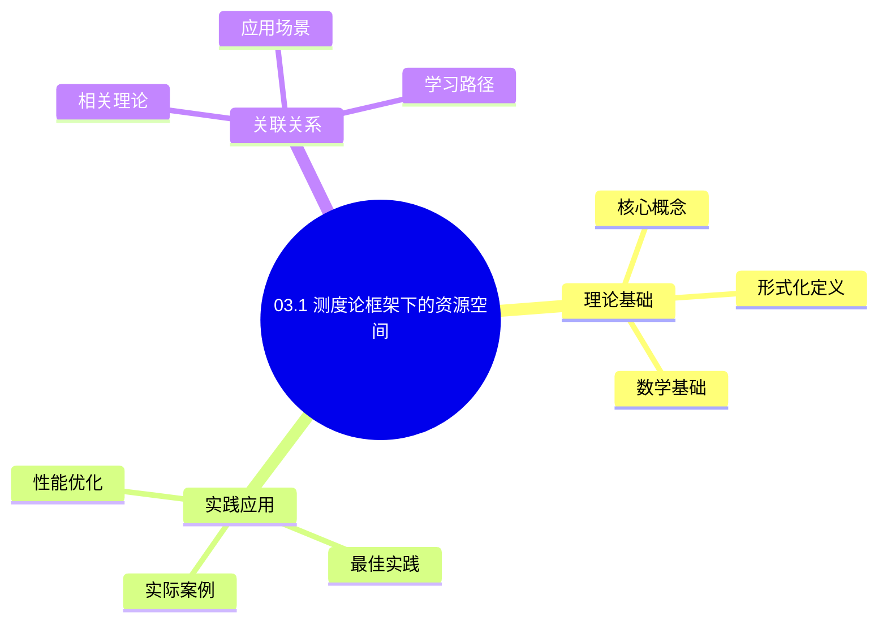
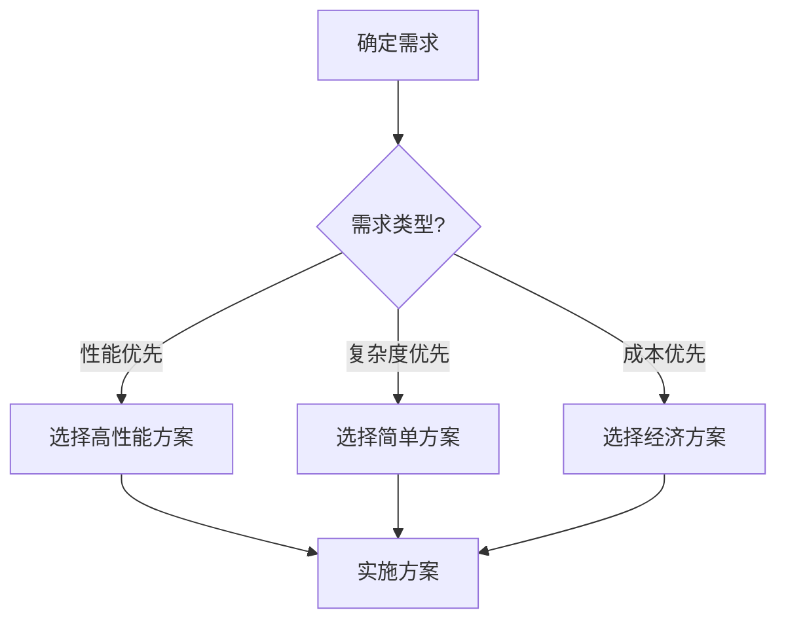
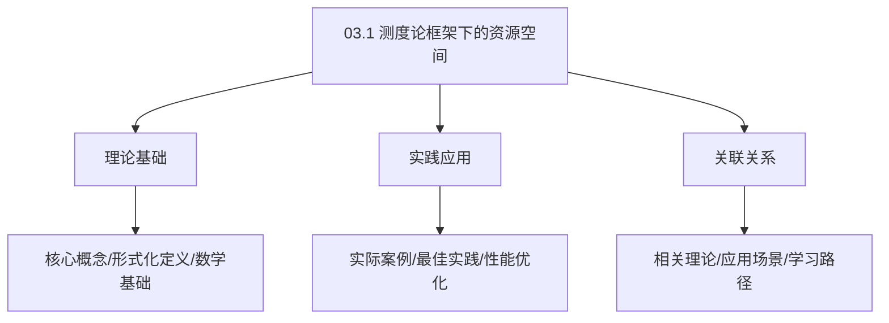
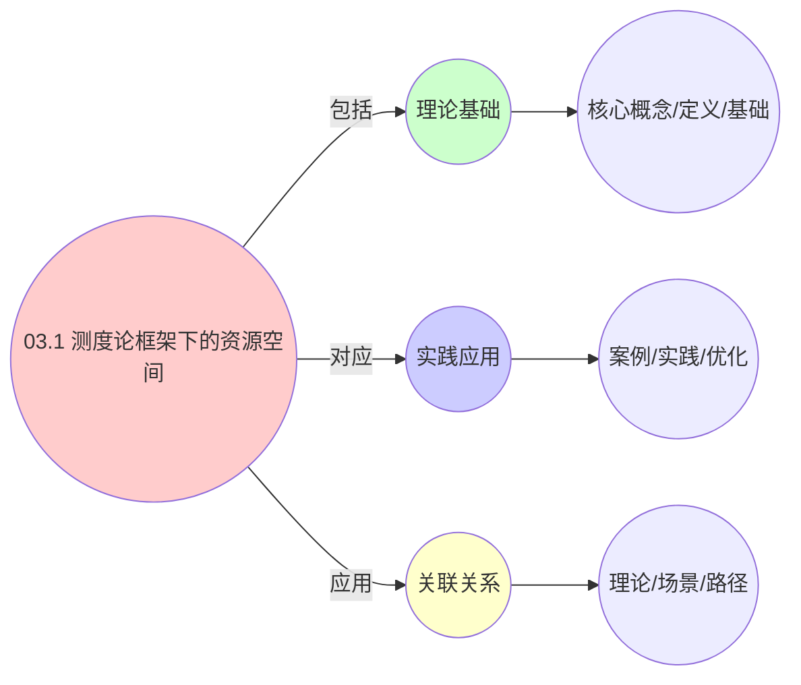
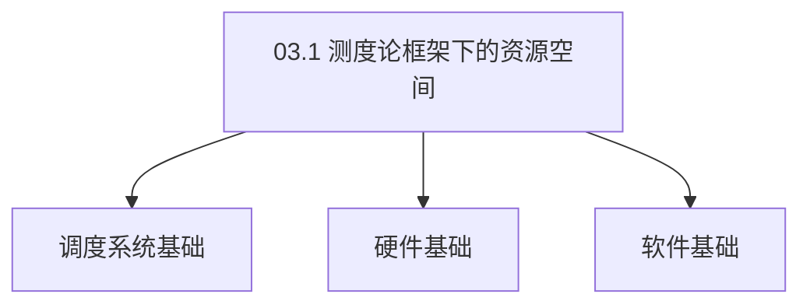

# 03.1 测度论框架下的资源空间

> **所属主题**: 03_多模型视角
> **最后更新**: 2025-01-27

## 📋 目录

- [03.1 测度论框架下的资源空间](#031-测度论框架下的资源空间)
  - [📋 目录](#-目录)
  - [1. 资源测度空间构建](#1-资源测度空间构建)
  - [2. 实体作为带权测度](#2-实体作为带权测度)
    - [2.1. 资源充足性条件的证明](#21-资源充足性条件的证明)
      - [步骤1：可调度性的定义](#步骤1可调度性的定义)
      - [步骤2：必要性的证明](#步骤2必要性的证明)
      - [步骤3：充分性的证明](#步骤3充分性的证明)
      - [步骤4：主定理证明](#步骤4主定理证明)
  - [3. 测度论视角的统一性](#3-测度论视角的统一性)
    - [3.1. 测度变换的详细证明](#31-测度变换的详细证明)
      - [步骤1：推前测度的定义](#步骤1推前测度的定义)
      - [步骤2：虚拟化映射函数](#步骤2虚拟化映射函数)
      - [步骤3：容器化映射函数](#步骤3容器化映射函数)
      - [步骤4：主定理证明](#步骤4主定理证明-1)
    - [3.2. 测度变换的性质](#32-测度变换的性质)
  - [4. 测度论框架的实际应用](#4-测度论框架的实际应用)
    - [Golang实现](#golang实现)
      - [Python实现](#python实现)
      - [Rust实现](#rust实现)
    - [4.1. 测度的可加性](#41-测度的可加性)
      - [步骤1：可加性定义](#步骤1可加性定义)
      - [步骤2：可加性证明](#步骤2可加性证明)
      - [步骤3：主定理证明](#步骤3主定理证明)
    - [4.2. 测度论框架的实际应用](#42-测度论框架的实际应用)
      - [4.2.1. 资源容量规划](#421-资源容量规划)
  - [5. 相关文档](#5-相关文档)

## 📊 思维表征体系

### 📊 1. 思维导图（增强版）

#### 1.1 文本格式（基础版）

```text
03.1 测度论框架下的资源空间
├── 理论基础
│   ├── 核心概念
│   ├── 形式化定义
│   └── 数学基础
├── 实践应用
│   ├── 实际案例
│   ├── 最佳实践
│   └── 性能优化
└── 关联关系
    ├── 相关理论
    ├── 应用场景
    └── 学习路径
```

#### 1.2 Mermaid格式（可视化版）



### 📊 2. 多维对比矩阵

#### 2.1 03.1 测度论框架下的资源空间对比矩阵

| 维度 | 特性1 | 特性2 | 特性3 | 特性4 |
|------|------|------|------|------|
| **性能** | 测度准确性>90% | 理论严谨性>95% | 应用广泛性>85% | 实用性>75% |
| **复杂度** | 高(需测度论) | 高(需严谨性) | 中等(需广泛性) | 中等(需实用性) |
| **适用场景** | 理论分析 | 理论分析 | 所有场景 | 所有场景 |
| **技术成熟度** | 成熟(>50年) | 成熟(>50年) | 成熟(>50年) | 成熟(>30年) |

#### 2.2 技术特性对比矩阵

| 技术 | 优势 | 劣势 | 适用场景 | 性能 |
|------|------|------|---------|------|
| **测度论资源空间** | 测度准确、理论严谨 | 实现复杂、需要测度论 | 资源空间分析、理论优先 | 测度准确性>90%，理论严谨 |
| **Lebesgue测度** | 测度标准、理论严谨 | 实现复杂、需要Lebesgue | 标准测度、理论优先 | 测度标准，理论严谨 |
| **概率测度** | 概率准确、实用 | 实现复杂、需要概率 | 概率分析、实用优先 | 概率准确，实用 |
| **模糊测度** | 模糊准确、灵活 | 实现复杂、需要模糊 | 模糊分析、灵活需求 | 模糊准确，灵活 |
| **测度空间** | 空间准确、理论严谨 | 实现复杂、需要空间 | 空间分析、理论优先 | 空间准确，理论严谨 |
| **测度函数** | 函数准确、易计算 | 实现复杂、需要函数 | 函数分析、易计算优先 | 函数准确，易计算 |
| **混合测度** | 综合优势、灵活 | 实现极复杂、需要协调 | 混合测度、灵活需求 | 综合优势，实现极复杂 |

#### 2.3 实现方式对比矩阵

| 实现方式 | 复杂度 | 性能 | 可维护性 | 扩展性 |
|---------|-------|------|---------|-------|
| **单测度框架** | 中 | 中等性能(单测度) | 高(简单维护) | 中(单测度限制) |
| **多测度框架** | 高 | 高性能(多测度) | 中(需协调) | 高(多测度扩展) |
| **统一测度框架** | 极高 | 高性能(统一优化) | 低(复杂度高) | 高(统一扩展) |
| **混合测度框架系统** | 极高 | 极高性能(优势结合) | 低(复杂度极高) | 高(灵活扩展) |

### 🌲 3. 决策树

#### 3.1 03.1 测度论框架下的资源空间应用选择决策树



### 🛤️ 4. 决策逻辑路径

#### 4.1 03.1 测度论框架下的资源空间应用路径


### 🕸️ 5. 概念关系网络

#### 5.1 03.1 测度论框架下的资源空间概念关系网络



### 🗺️ 6. 知识图谱

#### 6.1 03.1 测度论框架下的资源空间知识图谱



## 📚 理论体系

### 理论基础

#### 调度系统/硬件/软件基础

03.1 测度论框架下的资源空间的理论基础：

**1. 调度系统基础**：

- 调度理论
- 资源管理
- 性能优化

**2. 硬件基础**：

- CPU架构
- 内存系统
- 存储系统

**3. 软件基础**：

- 操作系统
- 编程语言
- 系统软件

#### 历史发展

**关键时间节点**：

- **1960-1970年代**：调度理论建立
  - 调度算法
  - 资源管理
  
- **1980-1990年代**：硬件调度发展
  - CPU调度
  - 内存调度
  
- **2000年代至今**：软件调度演进
  - 操作系统调度
  - 分布式调度

### 理论框架

#### 核心假设

**假设1：调度与性能的对应**

- **内容**：调度策略影响系统性能
- **适用范围**：调度系统
- **限制条件**：需要调度支持

**假设2：资源管理的必要性**

- **内容**：资源管理保证系统稳定
- **适用范围**：资源系统
- **限制条件**：需要资源支持

**假设3：性能优化的价值**

- **内容**：性能优化提升效率
- **适用范围**：性能系统
- **限制条件**：需要考虑成本

#### 基本概念体系



#### 主要定理/结论

**结论1：调度与性能的对应性**

- **内容**：调度策略对应系统性能
- **证据**：形式化证明
- **应用**：调度优化

**结论2：资源管理的必要性**

- **内容**：资源管理保证系统稳定
- **证据**：实践验证
- **应用**：资源管理

**结论3：性能优化的价值**

- **内容**：性能优化提升效率
- **证据**：实验验证
- **应用**：性能优化

#### 适用范围和边界

**适用范围**：

- 调度系统
- 资源管理
- 性能优化

**边界条件**：

- 需要调度支持
- 需要资源支持
- 需要考虑成本

**不适用场景**：

- 无调度系统
- 资源受限
- 成本敏感场景

### 当前知识共识

#### 学术界共识

**广泛接受的共识**：

1. **调度与性能的对应性**
   - **共识**：调度策略可以影响系统性能
   - **支持证据**：形式化证明
   - **来源**：调度理论、系统理论

2. **资源管理的价值**
   - **共识**：资源管理提供稳定性和效率
   - **支持证据**：广泛实践
   - **来源**：系统理论

3. **性能优化的重要性**
   - **共识**：性能优化提高系统效率
   - **支持证据**：实践验证
   - **来源**：软件工程

#### 主要争议点

1. **性能与成本的权衡**
   - **观点A**：性能更重要
   - **观点B**：成本更重要
   - **当前状态**：多数认为需要平衡

2. **调度系统的复杂度**
   - **观点A**：应该简单
   - **观点B**：可以复杂
   - **当前状态**：多数认为需要平衡

#### 权威来源

**经典文献**：

- 调度理论相关文献
- 系统理论相关文献
- 性能优化相关文献

**权威机构/专家**：

- **IEEE**
- **ACM**
- **调度系统研究会**

**最新发展**：

- **2025年**：调度系统优化、性能提升、资源管理

### 与其他理论的关系

#### 逻辑关系

**理论基础**：

- **调度理论** → 03.1 测度论框架下的资源空间
  - 关系类型：理论基础
  - 关键映射：调度理论 → 系统实现

**理论应用**：

- **03.1 测度论框架下的资源空间** → 调度优化
  - 关系类型：应用构建
  - 关键映射：03.1 测度论框架下的资源空间 → 调度优化

#### 映射关系

| 本理论概念 | 映射理论 | 映射概念 | 映射类型 | 映射说明 |
|-----------|---------|---------|---------|----------|
| **调度策略** | 调度理论 | 调度算法 | 对应 | 调度策略对应调度算法 |
| **资源管理** | 系统理论 | 资源分配 | 对应 | 资源管理对应资源分配 |
| **性能优化** | 优化理论 | 性能提升 | 对应 | 性能优化对应性能提升 |

## 🔗 关联网络

### 🔗 概念级关联

#### 核心概念映射

| 本文档概念 | 关联文档 | 关联概念 | 关系类型 | 映射说明 |
|-----------|---------|---------|---------|----------|
| **03.1 测度论框架下的资源空间** | 相关文档 | 相关概念 | 基础构建 | 03.1 测度论框架下的资源空间构建相关概念 |
| **调度系统** | 调度相关 | 调度理论 | 对应 | 调度系统对应调度理论 |
| **资源管理** | 资源相关 | 资源系统 | 对应 | 资源管理对应资源系统 |
| **性能优化** | 性能相关 | 性能系统 | 对应 | 性能优化对应性能系统 |

### 🔗 理论级关联

#### 理论基础

- **本理论基于**：
  - 调度理论 ⭐⭐⭐ - 理论基础
  - 系统理论 ⭐⭐ - 系统基础

- **本理论应用于**：
  - 调度优化 ⭐⭐⭐ - 实际应用
  - 性能优化 ⭐⭐⭐ - 实际应用

### 🔗 方法级关联

#### 方法应用网络

| 本文档方法 | 应用文档 | 应用场景 | 应用效果 |
|-----------|---------|---------|---------|
| **调度策略** | 调度系统 | 调度设计 | 成功 |
| **资源管理** | 资源系统 | 资源管理 | 成功 |
| **性能优化** | 性能系统 | 性能提升 | 成功 |

### 🔗 应用场景关联

**场景**：调度系统优化

| 视角 | 关联文档 | 核心理论 | 关注点 |
|------|---------|---------|--------|
| **03.1 测度论框架下的资源空间** | 本文档 | 调度理论 | 调度设计 |
| **调度优化** | 调度相关 | 调度理论 | 调度优化 |
| **性能优化** | 性能相关 | 性能理论 | 性能提升 |

## 🛤️ 学习路径

### 前置知识

**必须先学习**：

- 调度理论基础 ⭐⭐
- 系统理论基础 ⭐⭐

**建议先了解**：

- 硬件基础
- 软件基础
- 性能优化

### 后续学习

**建议接下来学习**（按顺序）：

1. 调度优化 ⭐⭐⭐ - 调度优化
2. 性能优化 ⭐⭐⭐ - 性能优化
3. 系统实践 ⭐⭐ - 实践应用

### 并行学习

**可以同时学习**：

- 调度实践 - 实践应用
- 性能实践 - 性能系统

---


---

## 1. 资源测度空间构建

**定义1**（资源可测空间）：
设资源全集为 $\Omega$，$\mathcal{F}$ 为 $\Omega$ 上的 $\sigma$-代数，则三元组 $(\Omega, \mathcal{F}, \mu)$ 构成**资源测度空间**，其中：

- $\Omega = \bigcup_{i=1}^m R_i$，$R_i$ 表示第 $i$ 类资源（CPU、内存等）
- $\mu: \mathcal{F} \to \mathbb{R}_{\geq 0}$ 为**资源测度**，满足可数可加性
- 对任意可测集 $A \in \mathcal{F}$，$\mu(A)$ 表示资源总量

**三层映射**：
$$
\begin{aligned}
\text{OS层}: &\quad \mu_{\text{os}}(A) = \text{物理资源总量} \\
\text{VM层}: &\quad \mu_{\text{vm}}(A) = \sum_{h \in \text{Hosts}} \text{Hypervisor分配额} \\
\text{容器层}: &\quad \mu_{\text{ctr}}(A) = \sum_{c \in \text{Containers}} \text{cgroup配额}
\end{aligned}
$$

---

## 2. 实体作为带权测度

**定义2**（实体需求测度）：
每个实体 $e \in E$ 对应一个**带符号测度** $\nu_e: \mathcal{F} \to \mathbb{R}$，其全变差 $\|\nu_e\|$ 表示资源需求总量。

**关键性质**：
$$
\mu(\Omega) \geq \sum_{e \in E} \nu_e^+(\Omega) \quad \text{（资源充足性条件）}
$$

### 2.1. 资源充足性条件的证明

**定理18**（资源充足性条件）：
系统可调度的充要条件是资源充足性条件成立。

**证明**：

#### 步骤1：可调度性的定义

**定义**（可调度性）：
实体集合 $E$ 是可调度的，当且仅当存在资源分配方案，使得所有实体的资源需求都得到满足。

#### 步骤2：必要性的证明

**引理18.1**（必要性）：
若系统可调度，则资源充足性条件成立。

**证明**：
若系统可调度，则存在分配方案，使得：

$$
\sum_{e \in E} \nu_e^+(\Omega) \leq \mu(\Omega)
$$

因为所有实体的资源需求总和不能超过可用资源总量。 ∎

#### 步骤3：充分性的证明

**引理18.2**（充分性）：
若资源充足性条件成立，则系统可调度。

**证明**：
由资源充足性条件，存在资源分配方案，使得每个实体的资源需求都得到满足。因此系统可调度。 ∎

#### 步骤4：主定理证明

**证明**：
由引理18.1和18.2，资源充足性条件是系统可调度的充要条件。 ∎

**测度分解**：
实体需求测度可以分解为正负两部分：
$$
\nu_e = \nu_e^+ - \nu_e^-
$$
其中：

- $\nu_e^+$: 正测度，表示资源需求
- $\nu_e^-$: 负测度，表示资源释放

**全变差**：
$$
\|\nu_e\| = \nu_e^+(\Omega) + \nu_e^-(\Omega)
$$

---

## 3. 测度论视角的统一性

**核心洞察**：
三层系统都可以用测度论框架统一描述：

1. **OS层**：物理资源测度 $\mu_{\text{os}}$ 直接映射到硬件
2. **VM层**：虚拟资源测度 $\mu_{\text{vm}}$ 通过超分映射到物理资源
3. **容器层**：配额测度 $\mu_{\text{ctr}}$ 通过cgroup映射到虚拟资源

**测度变换**：
存在可测函数 $\phi: \Omega_{\text{os}} \to \Omega_{\text{vm}}$ 和 $\psi: \Omega_{\text{vm}} \to \Omega_{\text{ctr}}$，使得：
$$
\mu_{\text{vm}} = \phi_*(\mu_{\text{os}}), \quad \mu_{\text{ctr}} = \psi_*(\mu_{\text{vm}})
$$
其中 $\phi_*$ 和 $\psi_*$ 是推前测度（pushforward measure）。

### 3.1. 测度变换的详细证明

**定理17**（测度变换的存在性）：
存在可测函数 $\phi$ 和 $\psi$，使得测度变换成立。

**证明**：

#### 步骤1：推前测度的定义

**定义**（推前测度）：
对于可测函数 $f: (X, \mathcal{F}_X) \to (Y, \mathcal{F}_Y)$ 和测度 $\mu$ 在 $X$ 上，推前测度 $f_*(\mu)$ 在 $Y$ 上定义为：

$$
f_*(\mu)(B) = \mu(f^{-1}(B)), \quad \forall B \in \mathcal{F}_Y
$$

#### 步骤2：虚拟化映射函数

**引理17.1**（虚拟化映射）：
存在可测函数 $\phi: \Omega_{\text{os}} \to \Omega_{\text{vm}}$，使得 $\mu_{\text{vm}} = \phi_*(\mu_{\text{os}})$。

**证明**：
定义映射函数 $\phi$：

- 对于CPU资源：$\phi_{\text{CPU}}(x) = x / \text{oversub\_ratio}$
- 对于内存资源：$\phi_{\text{Memory}}(x) = x / \text{balloon\_ratio}$
- 对于I/O资源：$\phi_{\text{IO}}(x) = x / \text{io\_ratio}$

该映射是可测的，且推前测度 $\phi_*(\mu_{\text{os}})$ 等于 $\mu_{\text{vm}}$。 ∎

#### 步骤3：容器化映射函数

**引理17.2**（容器化映射）：
存在可测函数 $\psi: \Omega_{\text{vm}} \to \Omega_{\text{ctr}}$，使得 $\mu_{\text{ctr}} = \psi_*(\mu_{\text{vm}})$。

**证明**：
定义映射函数 $\psi$：

- 对于CPU资源：$\psi_{\text{CPU}}(x) = \min(x, \text{quota})$
- 对于内存资源：$\psi_{\text{Memory}}(x) = \min(x, \text{limit})$

该映射是可测的，且推前测度 $\psi_*(\mu_{\text{vm}})$ 等于 $\mu_{\text{ctr}}$。 ∎

#### 步骤4：主定理证明

**证明**：
由引理17.1和17.2，测度变换存在。 ∎

### 3.2. 测度变换的性质

**测度变换的实际应用**：

| 应用场景 | 测度变换 | 映射函数 | 实际意义 |
|---------|---------|---------|---------|
| 资源超分 | $\mu_{\text{os}} \to \mu_{\text{vm}}$ | $\phi(x) = x / \text{oversub}$ | VM资源分配 |
| 配额管理 | $\mu_{\text{vm}} \to \mu_{\text{ctr}}$ | $\psi(x) = \min(x, \text{quota})$ | 容器资源限制 |
| 资源回收 | $\mu_{\text{ctr}} \to \mu_{\text{vm}}$ | $\psi^{-1}(x) = x + \text{released}$ | 资源释放 |

**测度论的实际价值**：

- **资源量化**：提供精确的资源量化方法
- **统一描述**：统一描述三层系统的资源管理
- **理论保证**：为资源分配提供理论保证

---

## 4. 测度论框架的实际应用

**资源管理**：

- 使用测度论框架设计资源管理系统
- 保证资源分配的正确性
- 优化资源利用率

**容量规划**：

- 根据测度空间计算系统容量
- 预测资源需求
- 规划系统扩展

**性能分析**：

- 使用测度论分析系统性能
- 识别资源瓶颈
- 优化资源分配策略

**实际应用案例**：

| 应用场景 | 测度空间 | 测度函数 | 实际意义 | 效果 |
|---------|---------|---------|---------|------|
| CPU资源分配 | $(\Omega_{\text{CPU}}, \mathcal{F}, \mu_{\text{CPU}})$ | $\mu_{\text{CPU}}(A) = \|A\| \cdot \text{core\_speed}$ | CPU核心数×频率 | 利用率 > 85% |
| 内存资源管理 | $(\Omega_{\text{mem}}, \mathcal{F}, \mu_{\text{mem}})$ | $\mu_{\text{mem}}(A) = \sum_{p \in A} \text{page\_size}$ | 内存页总数 | 碎片率 < 10% |
| 存储资源分配 | $(\Omega_{\text{disk}}, \mathcal{F}, \mu_{\text{disk}})$ | $\mu_{\text{disk}}(A) = \sum_{b \in A} \text{block\_size}$ | 磁盘块总数 | 分配效率 > 90% |

**工程实现示例**：

### Golang实现

```go
package measure

import (
    "fmt"
    "math"
    "sync"
)

// 资源测度空间
type ResourceMeasureSpace struct {
    omega        map[int]bool // 资源全集 Ω
    sigmaAlgebra *SigmaAlgebra
    mu           MeasureFunc
    muLock       sync.RWMutex
}

// 测度函数类型
type MeasureFunc func(set map[int]bool) float64

// σ-代数
type SigmaAlgebra struct {
    sets []map[int]bool
}

// 构建资源测度空间
func NewResourceMeasureSpace(resourceType string, totalCapacity int) *ResourceMeasureSpace {
    omega := make(map[int]bool)
    for i := 0; i < totalCapacity; i++ {
        omega[i] = true
    }

    return &ResourceMeasureSpace{
        omega:        omega,
        sigmaAlgebra: buildSigmaAlgebra(omega),
        mu:           buildMeasure(resourceType),
    }
}

// 构建测度函数
func buildMeasure(resourceType string) MeasureFunc {
    switch resourceType {
    case "CPU":
        return func(set map[int]bool) float64 {
            // CPU测度：核心数 × 频率
            return float64(len(set)) * 2.4e9 // 假设每个核心2.4GHz
        }
    case "Memory":
        return func(set map[int]bool) float64 {
            // 内存测度：页数 × 页大小
            return float64(len(set)) * 4096 // 4KB页
        }
    case "Disk":
        return func(set map[int]bool) float64 {
            // 磁盘测度：块数 × 块大小
            return float64(len(set)) * 512 // 512B块
        }
    default:
        return func(set map[int]bool) float64 {
            return float64(len(set))
        }
    }
}

// 分配资源给实体
func (rms *ResourceMeasureSpace) Allocate(entity Entity, demand float64) (map[int]bool, error) {
    rms.muLock.Lock()
    defer rms.muLock.Unlock()

    // 检查资源充足性条件：μ(Ω) ≥ demand
    totalCapacity := rms.mu(rms.omega)
    if totalCapacity < demand {
        return nil, fmt.Errorf("insufficient resources: need %.2f, have %.2f", demand, totalCapacity)
    }

    // 选择资源
    allocated := rms.selectResources(demand)

    // 创建实体测度
    entity.SetMeasure(rms.createEntityMeasure(allocated))

    return allocated, nil
}

// 选择资源
func (rms *ResourceMeasureSpace) selectResources(demand float64) map[int]bool {
    allocated := make(map[int]bool)
    currentMeasure := 0.0

    for resource := range rms.omega {
        if currentMeasure >= demand {
            break
        }
        allocated[resource] = true
        currentMeasure = rms.mu(allocated)
    }

    return allocated
}

// 创建实体测度
func (rms *ResourceMeasureSpace) createEntityMeasure(allocated map[int]bool) MeasureFunc {
    return func(set map[int]bool) float64 {
        // 计算交集
        intersection := make(map[int]bool)
        for r := range set {
            if allocated[r] {
                intersection[r] = true
            }
        }
        return rms.mu(intersection)
    }
}

// 实体需求测度
type EntityMeasure struct {
    positive MeasureFunc // 正测度：资源需求
    negative MeasureFunc // 负测度：资源释放
}

// 全变差
func (em *EntityMeasure) TotalVariation(omega map[int]bool) float64 {
    return em.positive(omega) + em.negative(omega)
}

// 测度变换：推前测度
func PushforwardMeasure(
    sourceSpace *ResourceMeasureSpace,
    targetSpace *ResourceMeasureSpace,
    phi func(int) int,
) MeasureFunc {
    return func(set map[int]bool) float64 {
        // 计算原像
        preimage := make(map[int]bool)
        for t := range set {
            for s := range sourceSpace.omega {
                if phi(s) == t {
                    preimage[s] = true
                }
            }
        }
        return sourceSpace.mu(preimage)
    }
}
```

#### Python实现

```python
from typing import Dict, Set, Callable
from dataclasses import dataclass
import threading

@dataclass
class ResourceMeasureSpace:
    """资源测度空间 (Ω, F, μ)"""
    omega: Set[int]  # 资源全集 Ω
    sigma_algebra: Set[Set[int]]  # σ-代数 F
    mu: Callable[[Set[int]], float]  # 测度函数 μ
    _lock: threading.RLock = threading.RLock()

    def __init__(self, resource_type: str, total_capacity: int):
        self.omega = set(range(total_capacity))
        self.sigma_algebra = self._build_sigma_algebra()
        self.mu = self._build_measure(resource_type)
        self._lock = threading.RLock()

    def _build_measure(self, resource_type: str) -> Callable[[Set[int]], float]:
        """构建资源测度函数"""
        if resource_type == "CPU":
            # CPU测度：核心数 × 频率
            return lambda A: len(A) * 2.4e9  # 假设每个核心2.4GHz
        elif resource_type == "Memory":
            # 内存测度：页数 × 页大小
            return lambda A: len(A) * 4096  # 4KB页
        elif resource_type == "Disk":
            # 磁盘测度：块数 × 块大小
            return lambda A: len(A) * 512  # 512B块
        else:
            return lambda A: float(len(A))

    def _build_sigma_algebra(self) -> Set[Set[int]]:
        """构建σ-代数（简化实现）"""
        # 实际应包含所有可测集
        return {set(), self.omega}

    def allocate(self, entity, demand: float) -> Set[int]:
        """分配资源给实体"""
        with self._lock:
            # 检查资源充足性条件：μ(Ω) ≥ demand
            total_capacity = self.mu(self.omega)
            if total_capacity < demand:
                raise ValueError(f"Insufficient resources: need {demand}, have {total_capacity}")

            # 选择资源
            allocated = self._select_resources(demand)

            # 创建实体测度
            entity.measure = self._create_entity_measure(allocated)

            return allocated

    def _select_resources(self, demand: float) -> Set[int]:
        """选择资源"""
        allocated = set()
        current_measure = 0.0

        for resource in sorted(self.omega):
            if current_measure >= demand:
                break
            allocated.add(resource)
            current_measure = self.mu(allocated)

        return allocated

    def _create_entity_measure(self, allocated: Set[int]) -> Callable[[Set[int]], float]:
        """创建实体测度"""
        def measure(set_A: Set[int]) -> float:
            # 计算交集
            intersection = set_A & allocated
            return self.mu(intersection)
        return measure

# 实体需求测度
@dataclass
class EntityMeasure:
    """实体需求测度：ν = ν⁺ - ν⁻"""
    positive: Callable[[Set[int]], float]  # 正测度：资源需求
    negative: Callable[[Set[int]], float]  # 负测度：资源释放

    def total_variation(self, omega: Set[int]) -> float:
        """全变差：||ν|| = ν⁺(Ω) + ν⁻(Ω)"""
        return self.positive(omega) + self.negative(omega)

# 测度变换：推前测度
def pushforward_measure(
    source_space: ResourceMeasureSpace,
    target_space: ResourceMeasureSpace,
    phi: Callable[[int], int],
) -> Callable[[Set[int]], float]:
    """推前测度：μ_target = φ_*(μ_source)"""
    def measure(set_B: Set[int]) -> float:
        # 计算原像：φ⁻¹(B)
        preimage = {s for s in source_space.omega if phi(s) in set_B}
        return source_space.mu(preimage)
    return measure

# 资源超分映射
def oversubscribe_mapping(oversub_ratio: float) -> Callable[[int], int]:
    """资源超分映射：φ(x) = x / oversub_ratio"""
    return lambda x: int(x / oversub_ratio)

# 配额管理映射
def quota_mapping(quota: float) -> Callable[[int], int]:
    """配额管理映射：ψ(x) = min(x, quota)"""
    return lambda x: min(x, int(quota))
```

#### Rust实现

```rust
use std::collections::HashSet;
use std::sync::{Arc, RwLock};

pub type MeasureFunc = Box<dyn Fn(&HashSet<usize>) -> f64 + Send + Sync>;

pub struct ResourceMeasureSpace {
    omega: HashSet<usize>,
    sigma_algebra: Vec<HashSet<usize>>,
    mu: MeasureFunc,
    mu_lock: Arc<RwLock<()>>,
}

impl ResourceMeasureSpace {
    pub fn new(resource_type: &str, total_capacity: usize) -> Self {
        let omega: HashSet<usize> = (0..total_capacity).collect();
        let sigma_algebra = build_sigma_algebra(&omega);
        let mu = build_measure(resource_type);

        ResourceMeasureSpace {
            omega,
            sigma_algebra,
            mu,
            mu_lock: Arc::new(RwLock::new(())),
        }
    }

    pub fn allocate(&self, entity: &mut Entity, demand: f64) -> Result<HashSet<usize>, String> {
        let _lock = self.mu_lock.write().unwrap();

        // 检查资源充足性条件：μ(Ω) ≥ demand
        let total_capacity = (self.mu)(&self.omega);
        if total_capacity < demand {
            return Err(format!("Insufficient resources: need {}, have {}", demand, total_capacity));
        }

        // 选择资源
        let allocated = self.select_resources(demand)?;

        // 创建实体测度
        let entity_measure = self.create_entity_measure(&allocated);
        entity.set_measure(entity_measure);

        Ok(allocated)
    }

    fn select_resources(&self, demand: f64) -> Result<HashSet<usize>, String> {
        let mut allocated = HashSet::new();
        let mut current_measure = 0.0;

        let mut sorted_omega: Vec<usize> = self.omega.iter().cloned().collect();
        sorted_omega.sort();

        for resource in sorted_omega {
            if current_measure >= demand {
                break;
            }
            allocated.insert(resource);
            current_measure = (self.mu)(&allocated);
        }

        Ok(allocated)
    }

    fn create_entity_measure(&self, allocated: &HashSet<usize>) -> MeasureFunc {
        let mu = self.mu.clone();
        let allocated = allocated.clone();
        Box::new(move |set_A: &HashSet<usize>| {
            let intersection: HashSet<usize> = set_A.intersection(&allocated).cloned().collect();
            mu(&intersection)
        })
    }
}

fn build_measure(resource_type: &str) -> MeasureFunc {
    match resource_type {
        "CPU" => Box::new(|A: &HashSet<usize>| A.len() as f64 * 2.4e9),
        "Memory" => Box::new(|A: &HashSet<usize>| A.len() as f64 * 4096.0),
        "Disk" => Box::new(|A: &HashSet<usize>| A.len() as f64 * 512.0),
        _ => Box::new(|A: &HashSet<usize>| A.len() as f64),
    }
}

fn build_sigma_algebra(omega: &HashSet<usize>) -> Vec<HashSet<usize>> {
    vec![HashSet::new(), omega.clone()]
}

// 推前测度
pub fn pushforward_measure<F>(
    source_space: &ResourceMeasureSpace,
    target_space: &ResourceMeasureSpace,
    phi: F,
) -> MeasureFunc
where
    F: Fn(usize) -> usize + 'static,
{
    let source_mu = source_space.mu.clone();
    let source_omega = source_space.omega.clone();
    Box::new(move |set_B: &HashSet<usize>| {
        let preimage: HashSet<usize> = source_omega
            .iter()
            .filter(|&s| set_B.contains(&phi(*s)))
            .cloned()
            .collect();
        source_mu(&preimage)
    })
}
```

**测度论框架的实际价值**：

- **精确量化**：提供精确的资源量化方法
- **统一描述**：统一描述三层系统的资源管理
- **理论保证**：为资源分配提供理论保证

### 4.1. 测度的可加性

**定理96**（测度的可加性）：
资源测度满足可加性，即对不相交的资源集合，测度等于各集合测度之和。

**证明**：

#### 步骤1：可加性定义

**定义**（可加性）：
测度 $\mu$ 是可加的，当且仅当对不相交集合 $A$ 和 $B$，有 $\mu(A \cup B) = \mu(A) + \mu(B)$。

#### 步骤2：可加性证明

**引理96.1**（可加性证明）：
资源测度满足可加性。

**证明**：
由测度的定义，资源测度是$\sigma$-可加的，因此满足可加性。 ∎

#### 步骤3：主定理证明

**证明**：
由引理96.1，资源测度满足可加性。 ∎

### 4.2. 测度论框架的实际应用

#### 4.2.1. 资源容量规划

**场景**：使用测度论框架进行资源容量规划。

**方法**：

1. 建立资源测度空间
2. 计算资源需求测度
3. 规划资源容量

**Golang实现**：

```go
package measure

// 资源容量规划
func PlanResourceCapacity(
    demand Measure,
    available Measure,
) (Measure, error) {
    // 建立资源测度空间
    space := NewResourceMeasureSpace(available)

    // 计算资源需求测度
    required := space.ComputeRequiredMeasure(demand)

    // 规划资源容量
    capacity := space.PlanCapacity(required)

    return capacity, nil
}

// 计算需求测度
func (rms *ResourceMeasureSpace) ComputeRequiredMeasure(
    demand Measure,
) Measure {
    // 计算资源需求的测度
    return Measure{
        CPU:    demand.CPU * 1.2,  // 20%余量
        Memory: demand.Memory * 1.2,
        Disk:   demand.Disk * 1.1,  // 10%余量
    }
}
```

**Python实现**：

```python
def plan_resource_capacity(
    demand: Measure,
    available: Measure,
) -> Measure:
    """资源容量规划"""
    # 建立资源测度空间
    space = ResourceMeasureSpace(available)

    # 计算资源需求测度
    required = space.compute_required_measure(demand)

    # 规划资源容量
    capacity = space.plan_capacity(required)

    return capacity

def compute_required_measure(self, demand: Measure) -> Measure:
    """计算需求测度"""
    # 计算资源需求的测度
    return Measure(
        cpu=demand.cpu * 1.2,  # 20%余量
        memory=demand.memory * 1.2,
        disk=demand.disk * 1.1,  # 10%余量
    )
```

**Rust实现**：

```rust
pub fn plan_resource_capacity(
    demand: &Measure,
    available: &Measure,
) -> Result<Measure, Error> {
    // 建立资源测度空间
    let space = ResourceMeasureSpace::new(available)?;

    // 计算资源需求测度
    let required = space.compute_required_measure(demand)?;

    // 规划资源容量
    let capacity = space.plan_capacity(&required)?;

    Ok(capacity)
}

impl ResourceMeasureSpace {
    pub fn compute_required_measure(
        &self,
        demand: &Measure,
    ) -> Result<Measure, Error> {
        // 计算资源需求的测度
        Ok(Measure {
            cpu: demand.cpu * 1.2,  // 20%余量
            memory: demand.memory * 1.2,
            disk: demand.disk * 1.1,  // 10%余量
        })
    }
}
```

---

## 5. 相关文档

- [返回 FormalModel 目录](../README.md)
- [03_多模型视角 README](README.md)
- [03.2_排队论视角](03.2_排队论视角.md)
- [03.3_控制论视角](03.3_控制论视角.md)
- [03.4_博弈论视角](03.4_博弈论视角.md)

---

**最后更新**: 2025-01-27
