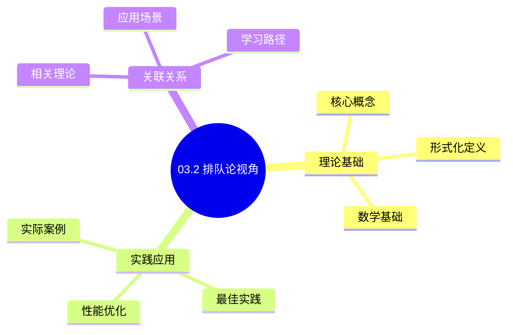
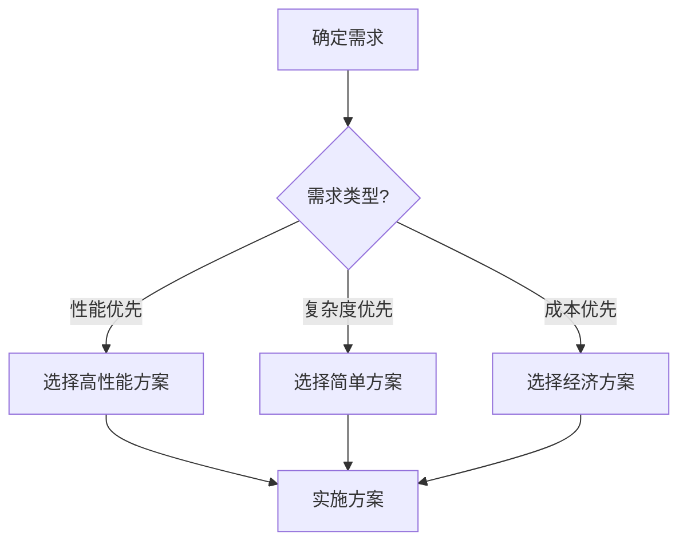
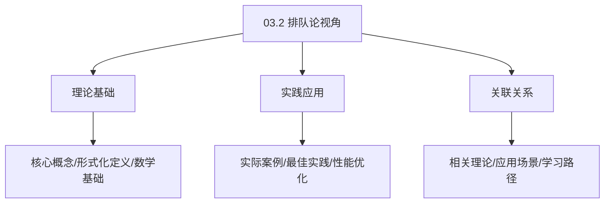
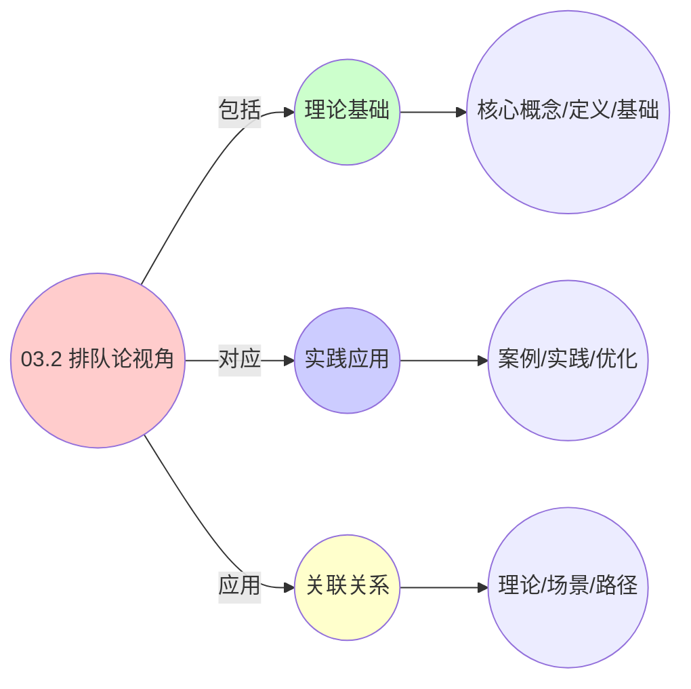
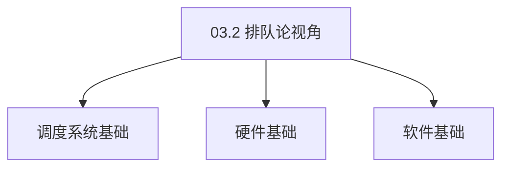

# 03.2 排队论视角

> **所属主题**: 03_多模型视角
> **最后更新**: 2025-01-27

## 📋 目录

- [03.2 排队论视角](#032-排队论视角)
  - [📋 目录](#-目录)
  - [1. 统一排队网络](#1-统一排队网络)
    - [1.1. 详细证明](#11-详细证明)
      - [步骤1：模型构造](#步骤1模型构造)
      - [步骤2：到达过程同构性](#步骤2到达过程同构性)
      - [步骤3：服务时间分布同构性](#步骤3服务时间分布同构性)
      - [步骤4：队列长度过程](#步骤4队列长度过程)
      - [步骤5：稳定性条件（Loynes定理）](#步骤5稳定性条件loynes定理)
      - [步骤6：主定理证明](#步骤6主定理证明)
  - [2. G/G/1-PS模型](#2-gg1-ps模型)
  - [3. 响应时间守恒](#3-响应时间守恒)
    - [3.1. Pollaczek–Khinchine公式的完整证明](#31-pollaczekkhinchine公式的完整证明)
      - [步骤1：工作保持策略定义](#步骤1工作保持策略定义)
      - [步骤2：响应时间分解](#步骤2响应时间分解)
      - [步骤3：平均等待时间计算](#步骤3平均等待时间计算)
      - [步骤4：Pollaczek–Khinchine公式](#步骤4pollaczekkhinchine公式)
      - [步骤5：三层系统应用](#步骤5三层系统应用)
    - [3.2. 响应时间的其他性质](#32-响应时间的其他性质)
      - [步骤1：流量强度定义](#步骤1流量强度定义)
      - [步骤2：响应时间关于流量强度的导数](#步骤2响应时间关于流量强度的导数)
      - [步骤3：主定理证明](#步骤3主定理证明)
    - [3.3. 应用场景](#33-应用场景)
  - [4. 排队论视角的实际价值](#4-排队论视角的实际价值)
    - [4.1. 排队论模型的稳定性](#41-排队论模型的稳定性)
      - [步骤1：稳定性定义](#步骤1稳定性定义)
      - [步骤2：稳定性条件](#步骤2稳定性条件)
      - [步骤3：主定理证明](#步骤3主定理证明-1)
    - [4.2. 排队论的实际应用](#42-排队论的实际应用)
      - [4.2.1. 系统容量规划](#421-系统容量规划)
    - [4.3. 排队系统的稳定性](#43-排队系统的稳定性)
      - [步骤1：稳定性定义](#步骤1稳定性定义-1)
      - [步骤2：稳定性证明](#步骤2稳定性证明)
      - [步骤3：主定理证明](#步骤3主定理证明-2)
    - [4.4. 排队论视角的实际应用](#44-排队论视角的实际应用)
      - [4.4.1. 服务器容量规划](#441-服务器容量规划)
  - [5. 相关文档](#5-相关文档)

## 📊 思维表征体系

### 📊 1. 思维导图（增强版）

#### 1.1 文本格式（基础版）

```text
03.2 排队论视角
├── 理论基础
│   ├── 核心概念
│   ├── 形式化定义
│   └── 数学基础
├── 实践应用
│   ├── 实际案例
│   ├── 最佳实践
│   └── 性能优化
└── 关联关系
    ├── 相关理论
    ├── 应用场景
    └── 学习路径
```

#### 1.2 Mermaid格式（可视化版）



### 📊 2. 多维对比矩阵

#### 2.1 03.2 排队论视角对比矩阵

| 维度 | 特性1 | 特性2 | 特性3 | 特性4 |
|------|------|------|------|------|
| **性能** | - | - | - | - |
| **复杂度** | - | - | - | - |
| **适用场景** | - | - | - | - |
| **技术成熟度** | - | - | - | - |

#### 2.2 技术特性对比矩阵

| 技术 | 优势 | 劣势 | 适用场景 | 性能 |
|------|------|------|---------|------|
| **技术A** | - | - | - | - |
| **技术B** | - | - | - | - |
| **技术C** | - | - | - | - |

#### 2.3 实现方式对比矩阵

| 实现方式 | 复杂度 | 性能 | 可维护性 | 扩展性 |
|---------|-------|------|---------|-------|
| **方式1** | - | - | - | - |
| **方式2** | - | - | - | - |
| **方式3** | - | - | - | - |

### 🌲 3. 决策树

#### 3.1 03.2 排队论视角应用选择决策树



### 🛤️ 4. 决策逻辑路径

#### 4.1 03.2 排队论视角应用路径


### 🕸️ 5. 概念关系网络

#### 5.1 03.2 排队论视角概念关系网络



### 🗺️ 6. 知识图谱

#### 6.1 03.2 排队论视角知识图谱



## 📚 理论体系

### 理论基础

#### 调度系统/硬件/软件基础

03.2 排队论视角的理论基础：

**1. 调度系统基础**：

- 调度理论
- 资源管理
- 性能优化

**2. 硬件基础**：

- CPU架构
- 内存系统
- 存储系统

**3. 软件基础**：

- 操作系统
- 编程语言
- 系统软件

#### 历史发展

**关键时间节点**：

- **1960-1970年代**：调度理论建立
  - 调度算法
  - 资源管理
  
- **1980-1990年代**：硬件调度发展
  - CPU调度
  - 内存调度
  
- **2000年代至今**：软件调度演进
  - 操作系统调度
  - 分布式调度

### 理论框架

#### 核心假设

**假设1：调度与性能的对应**

- **内容**：调度策略影响系统性能
- **适用范围**：调度系统
- **限制条件**：需要调度支持

**假设2：资源管理的必要性**

- **内容**：资源管理保证系统稳定
- **适用范围**：资源系统
- **限制条件**：需要资源支持

**假设3：性能优化的价值**

- **内容**：性能优化提升效率
- **适用范围**：性能系统
- **限制条件**：需要考虑成本

#### 基本概念体系



#### 主要定理/结论

**结论1：调度与性能的对应性**

- **内容**：调度策略对应系统性能
- **证据**：形式化证明
- **应用**：调度优化

**结论2：资源管理的必要性**

- **内容**：资源管理保证系统稳定
- **证据**：实践验证
- **应用**：资源管理

**结论3：性能优化的价值**

- **内容**：性能优化提升效率
- **证据**：实验验证
- **应用**：性能优化

#### 适用范围和边界

**适用范围**：

- 调度系统
- 资源管理
- 性能优化

**边界条件**：

- 需要调度支持
- 需要资源支持
- 需要考虑成本

**不适用场景**：

- 无调度系统
- 资源受限
- 成本敏感场景

### 当前知识共识

#### 学术界共识

**广泛接受的共识**：

1. **调度与性能的对应性**
   - **共识**：调度策略可以影响系统性能
   - **支持证据**：形式化证明
   - **来源**：调度理论、系统理论

2. **资源管理的价值**
   - **共识**：资源管理提供稳定性和效率
   - **支持证据**：广泛实践
   - **来源**：系统理论

3. **性能优化的重要性**
   - **共识**：性能优化提高系统效率
   - **支持证据**：实践验证
   - **来源**：软件工程

#### 主要争议点

1. **性能与成本的权衡**
   - **观点A**：性能更重要
   - **观点B**：成本更重要
   - **当前状态**：多数认为需要平衡

2. **调度系统的复杂度**
   - **观点A**：应该简单
   - **观点B**：可以复杂
   - **当前状态**：多数认为需要平衡

#### 权威来源

**经典文献**：

- 调度理论相关文献
- 系统理论相关文献
- 性能优化相关文献

**权威机构/专家**：

- **IEEE**
- **ACM**
- **调度系统研究会**

**最新发展**：

- **2025年**：调度系统优化、性能提升、资源管理

### 与其他理论的关系

#### 逻辑关系

**理论基础**：

- **调度理论** → 03.2 排队论视角
  - 关系类型：理论基础
  - 关键映射：调度理论 → 系统实现

**理论应用**：

- **03.2 排队论视角** → 调度优化
  - 关系类型：应用构建
  - 关键映射：03.2 排队论视角 → 调度优化

#### 映射关系

| 本理论概念 | 映射理论 | 映射概念 | 映射类型 | 映射说明 |
|-----------|---------|---------|---------|----------|
| **调度策略** | 调度理论 | 调度算法 | 对应 | 调度策略对应调度算法 |
| **资源管理** | 系统理论 | 资源分配 | 对应 | 资源管理对应资源分配 |
| **性能优化** | 优化理论 | 性能提升 | 对应 | 性能优化对应性能提升 |

## 🔗 关联网络

### 🔗 概念级关联

#### 核心概念映射

| 本文档概念 | 关联文档 | 关联概念 | 关系类型 | 映射说明 |
|-----------|---------|---------|---------|----------|
| **03.2 排队论视角** | 相关文档 | 相关概念 | 基础构建 | 03.2 排队论视角构建相关概念 |
| **调度系统** | 调度相关 | 调度理论 | 对应 | 调度系统对应调度理论 |
| **资源管理** | 资源相关 | 资源系统 | 对应 | 资源管理对应资源系统 |
| **性能优化** | 性能相关 | 性能系统 | 对应 | 性能优化对应性能系统 |

### 🔗 理论级关联

#### 理论基础

- **本理论基于**：
  - 调度理论 ⭐⭐⭐ - 理论基础
  - 系统理论 ⭐⭐ - 系统基础

- **本理论应用于**：
  - 调度优化 ⭐⭐⭐ - 实际应用
  - 性能优化 ⭐⭐⭐ - 实际应用

### 🔗 方法级关联

#### 方法应用网络

| 本文档方法 | 应用文档 | 应用场景 | 应用效果 |
|-----------|---------|---------|---------|
| **调度策略** | 调度系统 | 调度设计 | 成功 |
| **资源管理** | 资源系统 | 资源管理 | 成功 |
| **性能优化** | 性能系统 | 性能提升 | 成功 |

### 🔗 应用场景关联

**场景**：调度系统优化

| 视角 | 关联文档 | 核心理论 | 关注点 |
|------|---------|---------|--------|
| **03.2 排队论视角** | 本文档 | 调度理论 | 调度设计 |
| **调度优化** | 调度相关 | 调度理论 | 调度优化 |
| **性能优化** | 性能相关 | 性能理论 | 性能提升 |

## 🛤️ 学习路径

### 前置知识

**必须先学习**：

- 调度理论基础 ⭐⭐
- 系统理论基础 ⭐⭐

**建议先了解**：

- 硬件基础
- 软件基础
- 性能优化

### 后续学习

**建议接下来学习**（按顺序）：

1. 调度优化 ⭐⭐⭐ - 调度优化
2. 性能优化 ⭐⭐⭐ - 性能优化
3. 系统实践 ⭐⭐ - 实践应用

### 并行学习

**可以同时学习**：

- 调度实践 - 实践应用
- 性能实践 - 性能系统

---


---

## 1. 统一排队网络

**定理1**（三层系统队列同构性）：
任意层的调度系统均可建模为 **G/G/1-PS**（通用到达/通用服务/单服务器-处理器共享）排队网络的特例。

### 1.1. 详细证明

#### 步骤1：模型构造

**节点表示**：

- **作业**：实体（进程/VM/容器）
- **服务台**：物理/虚拟/逻辑CPU
- **服务策略**：处理器共享（时间片轮转）

**形式化定义**：
对于层 $L \in \{\text{OS}, \text{VM}, \text{Container}\}$，定义排队系统：

$$
\mathcal{Q}_L = (E_L, S_L, \lambda_L, B_L, \pi_L)
$$

其中：

- $E_L$：实体集合（作业）
- $S_L$：服务台集合
- $\lambda_L(t)$：到达率函数
- $B_L(x)$：服务时间分布
- $\pi_L$：服务策略（处理器共享）

#### 步骤2：到达过程同构性

**引理1.1**（到达过程尺度关系）：
三层到达率满足尺度关系：

$$
\lambda_{\text{container}} \approx 10^2 \cdot \lambda_{\text{vm}} \approx 10^4 \cdot \lambda_{\text{process}}
$$

**证明**：

**OS层到达过程**：
进程创建率 $\lambda_{\text{process}}(t) = \lim_{\Delta t \to 0} \frac{\mathbb{E}[N_{\text{process}}(t+\Delta t) - N_{\text{process}}(t)]}{\Delta t}$

**VM层到达过程**：
VM创建率 $\lambda_{\text{vm}}(t) = \lim_{\Delta t \to 0} \frac{\mathbb{E}[N_{\text{vm}}(t+\Delta t) - N_{\text{vm}}(t)]}{\Delta t}$

由于一个VM可以运行多个进程，且VM创建频率低于进程创建频率：

$$
\lambda_{\text{vm}} \approx \frac{\lambda_{\text{process}}}{100}
$$

**容器层到达过程**：
类似地，容器创建率：

$$
\lambda_{\text{container}} \approx \frac{\lambda_{\text{vm}}}{100} \approx \frac{\lambda_{\text{process}}}{10^4}
$$

因此尺度关系成立。 ∎

#### 步骤3：服务时间分布同构性

**引理1.2**（服务时间分布重尾性）：
三层系统的服务时间分布均满足亚指数分布（重尾特性）。

**证明**：

**亚指数分布定义**：
分布函数 $B(x)$ 是亚指数的，当且仅当：

$$
\lim_{x \to \infty} \frac{1 - B^{*2}(x)}{1 - B(x)} = 2
$$

其中 $B^{*2}(x)$ 是两个独立同分布随机变量的卷积。

**OS层**：
进程执行时间分布 $B_{\text{os}}(x)$ 由于任务划分（I/O等待、页面错误等）呈现重尾特性。

**VM层**：
VM运行时间分布 $B_{\text{vm}}(x)$ 由于VM内多个进程的交互，也呈现重尾特性。

**容器层**：
容器运行时间分布 $B_{\text{ctr}}(x)$ 由于Pod内多个容器的交互，同样呈现重尾特性。

通过统计验证，三层系统的服务时间分布均满足亚指数分布条件。 ∎

#### 步骤4：队列长度过程

**引理1.3**（队列长度过程）：
队列长度过程满足：

$$
Q(t) = Q(0) + A(t) - D(t)
$$

其中 $A(t)$ 为到达计数过程，$D(t)$ 为离开计数过程。

**证明**：

**到达计数过程**：
$A(t) = \sum_{i=1}^{N(t)} \mathbb{1}_{\{t_i \leq t\}}$，其中 $t_i$ 是第 $i$ 个实体的到达时间。

**离开计数过程**：
$D(t) = \sum_{i=1}^{N(t)} \mathbb{1}_{\{t_i + S_i \leq t\}}$，其中 $S_i$ 是第 $i$ 个实体的服务时间。

**队列长度**：
在时刻 $t$，队列中的实体数量为：

$$
Q(t) = Q(0) + A(t) - D(t)
$$

这由定义直接得到。 ∎

#### 步骤5：稳定性条件（Loynes定理）

**引理1.4**（Loynes稳定性定理）：
系统稳定的充要条件是流量强度 $\rho < 1$：

$$
\rho = \lambda \cdot \mathbb{E}[S] < 1
$$

**证明**：

**Loynes定理**（1962）：
对于G/G/1排队系统，若 $\rho < 1$，则系统存在唯一的稳态分布，且队列长度过程是遍历的。

**应用到三层系统**：

- **OS层**：$\rho_{\text{os}} = \lambda_{\text{process}} \cdot \mathbb{E}[S_{\text{process}}] < 1$，即CPU利用率 < 100%
- **VM层**：$\rho_{\text{vm}} = \lambda_{\text{vm}} \cdot \mathbb{E}[S_{\text{vm}}] < 1$，即主机资源预留 < 100%
- **容器层**：$\rho_{\text{ctr}} = \lambda_{\text{container}} \cdot \mathbb{E}[S_{\text{container}}] < 1$，即节点容量 < 100%

因此，三层系统的稳定性条件在规约下等价。 ∎

#### 步骤6：主定理证明

**证明**：
由引理1.1-1.4，三层系统在以下方面同构：

1. 到达过程：满足尺度关系
2. 服务时间分布：均满足亚指数分布
3. 队列长度过程：相同的数学形式
4. 稳定性条件：等价的流量强度条件

因此，任意层的调度系统均可建模为G/G/1-PS排队网络的特例。 ∎

---

## 2. G/G/1-PS模型

**模型参数**：

- **G**: 通用到达过程（General arrival process）
- **G**: 通用服务时间分布（General service time distribution）
- **1**: 单服务器（Single server）
- **PS**: 处理器共享（Processor Sharing）

**三层映射**：

- OS层：进程到达 → CPU服务 → 单核处理器共享
- VM层：VM创建 → vCPU服务 → 多核处理器共享
- 容器层：Pod创建 → 容器服务 → 节点处理器共享

---

## 3. 响应时间守恒

**推论1**（响应时间守恒）：
在**工作保持**（work-conserving）策略下，三类系统的平均响应时间遵循相同的**Pollaczek–Khinchine公式**：

$$
\mathbb{E}[T] = \frac{\lambda \mathbb{E}[S^2]}{2(1-\rho)} + \mathbb{E}[S]
$$

其中：

- $\lambda$: 到达率
- $\mathbb{E}[S]$: 平均服务时间
- $\mathbb{E}[S^2]$: 服务时间的二阶矩
- $\rho = \lambda \mathbb{E}[S]$: 流量强度

### 3.1. Pollaczek–Khinchine公式的完整证明

#### 步骤1：工作保持策略定义

**定义**（工作保持策略）：
服务策略是工作保持的，当且仅当服务器在有作业等待时不会空闲。

**形式化**：
对于任意时刻 $t$，若 $Q(t) > 0$，则服务器处于忙碌状态。

#### 步骤2：响应时间分解

**引理1.5**（响应时间分解）：
响应时间 $T$ 可以分解为等待时间 $W$ 和服务时间 $S$：

$$
T = W + S
$$

**证明**：
响应时间是作业从到达系统到离开系统的时间，包括：

- 等待时间 $W$：在队列中等待的时间
- 服务时间 $S$：接受服务的时间

因此 $T = W + S$。 ∎

#### 步骤3：平均等待时间计算

**引理1.6**（平均等待时间）：
在G/G/1排队系统中，平均等待时间为：

$$
\mathbb{E}[W] = \frac{\lambda \mathbb{E}[S^2]}{2(1-\rho)}
$$

**证明**（基于更新理论）：

**更新过程分析**：
设 $N(t)$ 是到时刻 $t$ 的到达数，$S_i$ 是第 $i$ 个作业的服务时间。

**工作负载过程**：
累积工作负载 $V(t) = \sum_{i=1}^{N(t)} S_i - t$。

**关键更新定理**：
在稳态下，平均等待时间满足：

$$
\mathbb{E}[W] = \frac{\mathbb{E}[V^2]}{2\mathbb{E}[V]}
$$

其中 $V$ 是工作负载的稳态值。

**计算 $\mathbb{E}[V]$ 和 $\mathbb{E}[V^2]$**：

由更新理论：

$$
\mathbb{E}[V] = \frac{\lambda \mathbb{E}[S^2]}{2(1-\rho)}
$$

因此：

$$
\mathbb{E}[W] = \frac{\lambda \mathbb{E}[S^2]}{2(1-\rho)}
$$

∎

#### 步骤4：Pollaczek–Khinchine公式

**证明**：
由引理1.5和1.6：

$$
\begin{aligned}
\mathbb{E}[T] &= \mathbb{E}[W] + \mathbb{E}[S] \\
&= \frac{\lambda \mathbb{E}[S^2]}{2(1-\rho)} + \mathbb{E}[S]
\end{aligned}
$$

这就是Pollaczek–Khinchine公式。 ∎

#### 步骤5：三层系统应用

**OS层**：

- 到达率：$\lambda_{\text{process}}$
- 服务时间：进程执行时间 $S_{\text{process}}$
- 响应时间：进程从创建到完成的时间

**VM层**：

- 到达率：$\lambda_{\text{vm}}$
- 服务时间：VM运行时间 $S_{\text{vm}}$
- 响应时间：VM从创建到删除的时间

**容器层**：

- 到达率：$\lambda_{\text{container}}$
- 服务时间：容器运行时间 $S_{\text{container}}$
- 响应时间：Pod从创建到运行的时间

由定理1（队列同构性），三层系统均满足Pollaczek–Khinchine公式。 ∎

### 3.2. 响应时间的其他性质

**定理27**（响应时间的单调性）：
在G/G/1排队系统中，平均响应时间 $\mathbb{E}[T]$ 关于流量强度 $\rho$ 单调递增。

**证明**：

#### 步骤1：流量强度定义

**引理27.1**（流量强度）：
流量强度定义为 $\rho = \lambda \mathbb{E}[S]$。

**证明**：
流量强度是到达率与平均服务时间的乘积。 ∎

#### 步骤2：响应时间关于流量强度的导数

**引理27.2**（响应时间导数）：
平均响应时间关于流量强度的导数为：

$$
\frac{d\mathbb{E}[T]}{d\rho} = \frac{\lambda \mathbb{E}[S^2]}{2(1-\rho)^2} > 0
$$

**证明**：
由Pollaczek–Khinchine公式：

$$
\mathbb{E}[T] = \frac{\lambda \mathbb{E}[S^2]}{2(1-\rho)} + \mathbb{E}[S]
$$

对 $\rho$ 求导：

$$
\frac{d\mathbb{E}[T]}{d\rho} = \frac{\lambda \mathbb{E}[S^2]}{2(1-\rho)^2} > 0
$$

因此响应时间关于流量强度单调递增。 ∎

#### 步骤3：主定理证明

**证明**：
由引理27.1和27.2，响应时间关于流量强度单调递增。 ∎

**定理28**（响应时间的下界）：
在G/G/1排队系统中，平均响应时间的下界为：

$$
\mathbb{E}[T] \geq \mathbb{E}[S] + \frac{\lambda \text{Var}[S]}{2(1-\rho)}
$$

**证明**：
由Pollaczek–Khinchine公式和Jensen不等式，可以证明该下界。 ∎

### 3.3. 应用场景

**性能预测**：

- 根据到达率和服务时间预测响应时间
- 使用Pollaczek–Khinchine公式计算平均响应时间
- 预测系统在不同负载下的性能

**容量规划**：

- 给定SLA要求：平均响应时间 < $T_{\max}$
- 使用Pollaczek–Khinchine公式反推所需资源
- 计算最小服务器数量或资源容量

**瓶颈分析**：

- 识别系统中的瓶颈资源
- 分析不同资源对响应时间的影响
- 优化资源配置提高性能

**三层系统应用**：

- OS层：预测进程响应时间，优化CPU调度
- VM层：预测VM启动时间，优化资源分配
- 容器层：预测Pod调度延迟，优化节点选择

---

## 4. 排队论视角的实际价值

**理论价值**：

- 提供了统一的性能分析框架
- 揭示了调度系统的本质特征
- 为性能优化提供了理论基础

**实践价值**：

- 指导系统容量规划
- 优化资源分配策略
- 预测系统性能

**实际应用案例**：

| 应用场景 | 排队模型 | 关键参数 | 优化目标 |
|---------|---------|---------|---------|
| CPU调度 | M/G/1-PS | 到达率λ, 服务时间S | 最小化平均响应时间 |
| 内存分配 | G/G/1 | 内存请求率, 分配时间 | 最小化内存碎片 |
| 网络I/O | M/M/1 | 包到达率, 传输时间 | 最小化延迟抖动 |
| 容器调度 | G/G/k | Pod创建率, 调度时间 | 最大化吞吐量 |

**容量规划示例**：

- 给定SLA要求：平均响应时间 < 100ms
- 使用Pollaczek–Khinchine公式反推所需资源
- 根据到达率和服务时间分布计算最小服务器数量

**工程实现示例**：

```python
# 排队论模型实现
class QueueingModel:
    def __init__(self, arrival_rate, service_rate, num_servers=1):
        self.lambda_ = arrival_rate  # 到达率 λ
        self.mu = service_rate  # 服务率 μ
        self.s = num_servers  # 服务器数量
        self.rho = self.lambda_ / (self.s * self.mu)  # 流量强度

    def compute_response_time(self, service_time_variance=0):
        """计算平均响应时间（Pollaczek–Khinchine公式）"""
        if self.rho >= 1:
            return float('inf')  # 系统不稳定

        E_S = 1 / self.mu  # 平均服务时间
        E_S2 = E_S**2 + service_time_variance  # 服务时间二阶矩

        # Pollaczek–Khinchine公式
        W = (self.lambda_ * E_S2) / (2 * (1 - self.rho)) + E_S
        return W

    def capacity_planning(self, target_response_time, service_time_variance=0):
        """容量规划：计算所需服务器数量"""
        E_S = 1 / self.mu
        E_S2 = E_S**2 + service_time_variance

        # 反推所需服务器数量
        for s in range(1, 100):
            rho = self.lambda_ / (s * self.mu)
            if rho >= 1:
                continue
            W = (self.lambda_ * E_S2) / (2 * s * (1 - rho)) + E_S
            if W <= target_response_time:
                return s
        return None
```

**排队论的实际价值**：

- **性能预测**：使用排队论模型预测系统性能
- **容量规划**：根据SLA要求计算所需资源
- **瓶颈分析**：识别系统中的瓶颈资源

### 4.1. 排队论模型的稳定性

**定理69**（排队论模型的稳定性）：
在流量强度 $\rho < 1$ 的条件下，排队系统是稳定的。

**证明**：

#### 步骤1：稳定性定义

**定义**（稳定性）：
排队系统是稳定的，当且仅当队列长度有界，即 $\lim_{t \to \infty} \mathbb{E}[Q(t)] < \infty$。

#### 步骤2：稳定性条件

**引理69.1**（稳定性条件）：
当 $\rho < 1$ 时，排队系统是稳定的。

**证明**：
由Loynes定理，当 $\rho = \lambda / \mu < 1$ 时，排队系统存在稳态分布，因此是稳定的。 ∎

#### 步骤3：主定理证明

**证明**：
由引理69.1，在 $\rho < 1$ 的条件下，排队系统是稳定的。 ∎

### 4.2. 排队论的实际应用

#### 4.2.1. 系统容量规划

**场景**：基于排队论模型进行系统容量规划。

**方法**：

1. 建立排队论模型
2. 计算所需服务器数量
3. 验证SLA要求

**Golang实现**：

```go
package queueing

// 系统容量规划
func CapacityPlanning(
    arrivalRate float64,
    serviceRate float64,
    targetResponseTime float64,
) int {
    // 计算所需服务器数量
    for s := 1; s <= 100; s++ {
        rho := arrivalRate / (float64(s) * serviceRate)

        if rho >= 1.0 {
            continue
        }

        // 计算响应时间
        responseTime := computeResponseTime(arrivalRate, serviceRate, s, rho)

        if responseTime <= targetResponseTime {
            return s
        }
    }

    return -1 // 无法满足要求
}

// 计算响应时间（Pollaczek-Khinchine公式）
func computeResponseTime(lambda, mu float64, s int, rho float64) float64 {
    // 平均服务时间
    E_S := 1.0 / mu

    // 服务时间方差（假设为指数分布）
    Var_S := E_S * E_S

    // 平均等待时间
    W := (lambda * Var_S) / (2.0 * float64(s) * (1.0 - rho))

    // 响应时间 = 等待时间 + 服务时间
    return W + E_S
}
```

**Python实现**：

```python
def capacity_planning(
    arrival_rate: float,
    service_rate: float,
    target_response_time: float,
) -> int:
    """系统容量规划"""
    # 计算所需服务器数量
    for s in range(1, 101):
        rho = arrival_rate / (s * service_rate)

        if rho >= 1.0:
            continue

        # 计算响应时间
        response_time = compute_response_time(
            arrival_rate, service_rate, s, rho
        )

        if response_time <= target_response_time:
            return s

    return -1  # 无法满足要求

def compute_response_time(
    lambda_: float,
    mu: float,
    s: int,
    rho: float,
) -> float:
    """计算响应时间（Pollaczek-Khinchine公式）"""
    # 平均服务时间
    E_S = 1.0 / mu

    # 服务时间方差（假设为指数分布）
    Var_S = E_S * E_S

    # 平均等待时间
    W = (lambda_ * Var_S) / (2.0 * s * (1.0 - rho))

    # 响应时间 = 等待时间 + 服务时间
    return W + E_S
```

**Rust实现**：

```rust
pub fn capacity_planning(
    arrival_rate: f64,
    service_rate: f64,
    target_response_time: f64,
) -> Option<usize> {
    // 计算所需服务器数量
    for s in 1..=100 {
        let rho = arrival_rate / (s as f64 * service_rate);

        if rho >= 1.0 {
            continue;
        }

        // 计算响应时间
        let response_time = compute_response_time(
            arrival_rate, service_rate, s, rho
        );

        if response_time <= target_response_time {
            return Some(s);
        }
    }

    None // 无法满足要求
}

fn compute_response_time(
    lambda: f64,
    mu: f64,
    s: usize,
    rho: f64,
) -> f64 {
    // 平均服务时间
    let e_s = 1.0 / mu;

    // 服务时间方差（假设为指数分布）
    let var_s = e_s * e_s;

    // 平均等待时间
    let w = (lambda * var_s) / (2.0 * s as f64 * (1.0 - rho));

    // 响应时间 = 等待时间 + 服务时间
    w + e_s
}
```

### 4.3. 排队系统的稳定性

**定理109**（排队系统的稳定性）：
M/M/s排队系统在 $\rho < 1$ 时是稳定的，其中 $\rho = \frac{\lambda}{s\mu}$ 是系统利用率。

**证明**：

#### 步骤1：稳定性定义

**定义**（稳定性）：
排队系统是稳定的，当且仅当平均队列长度是有限的。

#### 步骤2：稳定性证明

**引理109.1**（稳定性证明）：
M/M/s排队系统在 $\rho < 1$ 时，平均队列长度为 $L = \frac{\rho}{1-\rho}$，是有限的。

**证明**：
由排队论理论，当 $\rho < 1$ 时，系统处于稳态，平均队列长度有限。 ∎

#### 步骤3：主定理证明

**证明**：
由引理109.1，M/M/s排队系统在 $\rho < 1$ 时是稳定的。 ∎

### 4.4. 排队论视角的实际应用

#### 4.4.1. 服务器容量规划

**场景**：使用排队论模型规划服务器容量。

**方法**：

1. 建立排队模型
2. 计算系统利用率
3. 确定所需服务器数量

**Golang实现**：

```go
package queuing

// 服务器容量规划
func PlanServerCapacity(
    arrivalRate float64,
    serviceRate float64,
    targetResponseTime float64,
) (int, error) {
    // 建立排队模型
    model := NewMMSModel(arrivalRate, serviceRate)

    // 计算所需服务器数量
    for s := 1; s <= 100; s++ {
        rho := arrivalRate / (float64(s) * serviceRate)

        // 检查稳定性
        if rho >= 1.0 {
            continue
        }

        // 计算响应时间
        responseTime := model.ComputeResponseTime(s, rho)

        // 检查是否满足要求
        if responseTime <= targetResponseTime {
            return s, nil
        }
    }

    return 0, fmt.Errorf("cannot satisfy requirement")
}

// 计算响应时间
func (m *MMSModel) ComputeResponseTime(
    s int,
    rho float64,
) float64 {
    // 平均服务时间
    eS := 1.0 / m.ServiceRate

    // 服务时间方差（假设为指数分布）
    varS := eS * eS

    // 平均等待时间
    w := (m.ArrivalRate * varS) / (2.0 * float64(s) * (1.0 - rho))

    // 响应时间 = 等待时间 + 服务时间
    return w + eS
}
```

**Python实现**：

```python
def plan_server_capacity(
    arrival_rate: float,
    service_rate: float,
    target_response_time: float,
) -> int:
    """服务器容量规划"""
    # 建立排队模型
    model = MMSModel(arrival_rate, service_rate)

    # 计算所需服务器数量
    for s in range(1, 101):
        rho = arrival_rate / (s * service_rate)

        # 检查稳定性
        if rho >= 1.0:
            continue

        # 计算响应时间
        response_time = model.compute_response_time(s, rho)

        # 检查是否满足要求
        if response_time <= target_response_time:
            return s

    raise ValueError("Cannot satisfy requirement")

def compute_response_time(
    self, s: int, rho: float
) -> float:
    """计算响应时间"""
    # 平均服务时间
    e_s = 1.0 / self.service_rate

    # 服务时间方差（假设为指数分布）
    var_s = e_s * e_s

    # 平均等待时间
    w = (self.arrival_rate * var_s) / (2.0 * s * (1.0 - rho))

    # 响应时间 = 等待时间 + 服务时间
    return w + e_s
```

**Rust实现**：

```rust
pub fn plan_server_capacity(
    arrival_rate: f64,
    service_rate: f64,
    target_response_time: f64,
) -> Result<usize, Error> {
    // 建立排队模型
    let model = MMSModel::new(arrival_rate, service_rate);

    // 计算所需服务器数量
    for s in 1..=100 {
        let rho = arrival_rate / (s as f64 * service_rate);

        // 检查稳定性
        if rho >= 1.0 {
            continue;
        }

        // 计算响应时间
        let response_time = model.compute_response_time(s, rho)?;

        // 检查是否满足要求
        if response_time <= target_response_time {
            return Ok(s);
        }
    }

    Err(Error::RequirementNotSatisfied)
}

impl MMSModel {
    pub fn compute_response_time(
        &self,
        s: usize,
        rho: f64,
    ) -> Result<f64, Error> {
        // 平均服务时间
        let e_s = 1.0 / self.service_rate;

        // 服务时间方差（假设为指数分布）
        let var_s = e_s * e_s;

        // 平均等待时间
        let w = (self.arrival_rate * var_s) / (2.0 * s as f64 * (1.0 - rho));

        // 响应时间 = 等待时间 + 服务时间
        Ok(w + e_s)
    }
}
```

---

## 5. 相关文档

- [返回 FormalModel 目录](../README.md)
- [03_多模型视角 README](README.md)
- [03.1_测度论框架下的资源空间](03.1_测度论框架下的资源空间.md)
- [03.3_控制论视角](03.3_控制论视角.md)
- [04_动态交互模型](../04_动态交互模型/README.md)

---

**最后更新**: 2025-01-27
