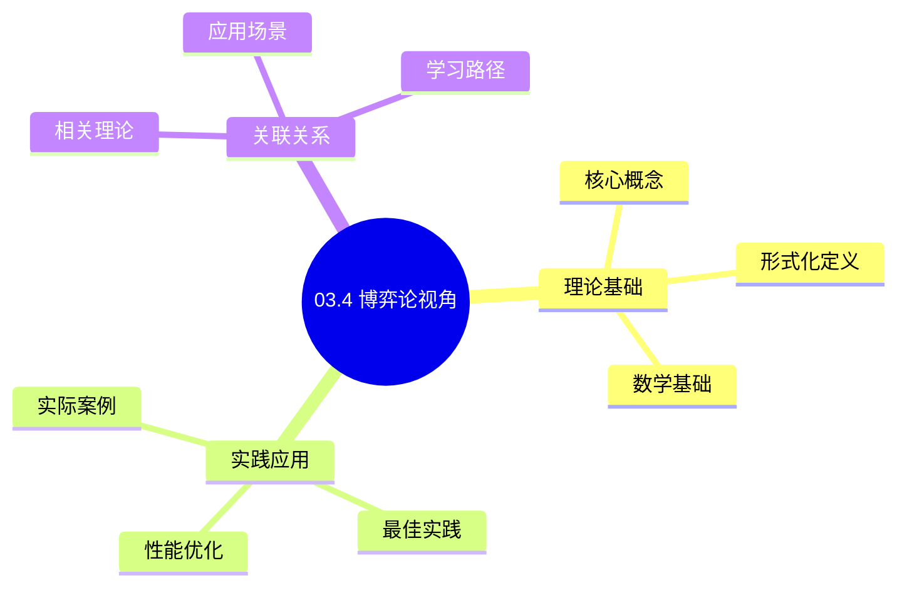
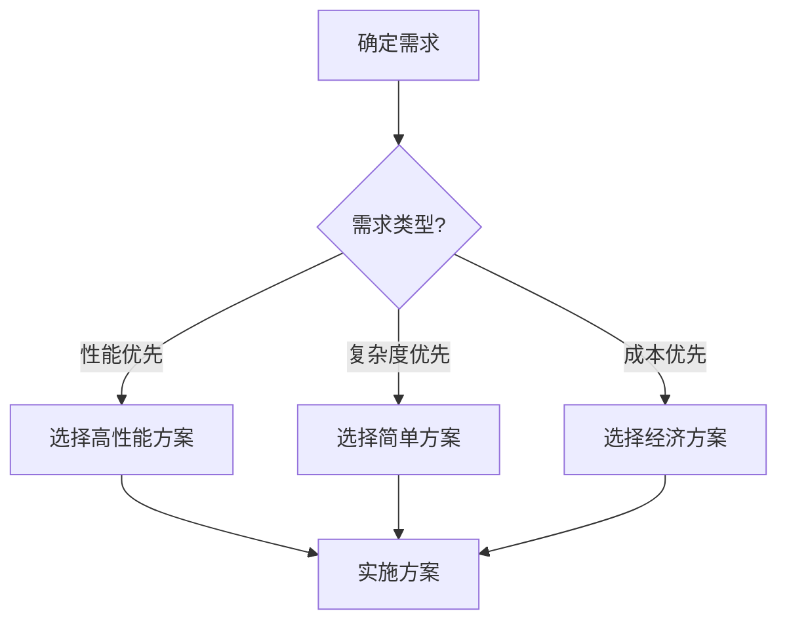
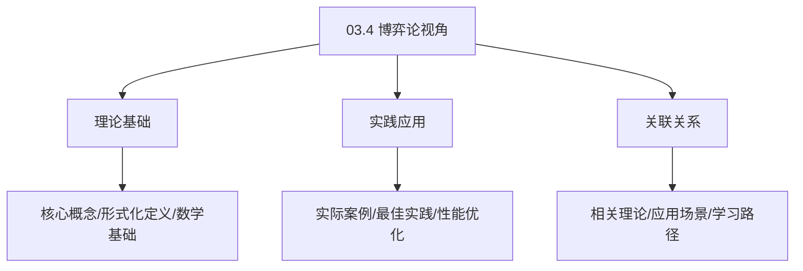
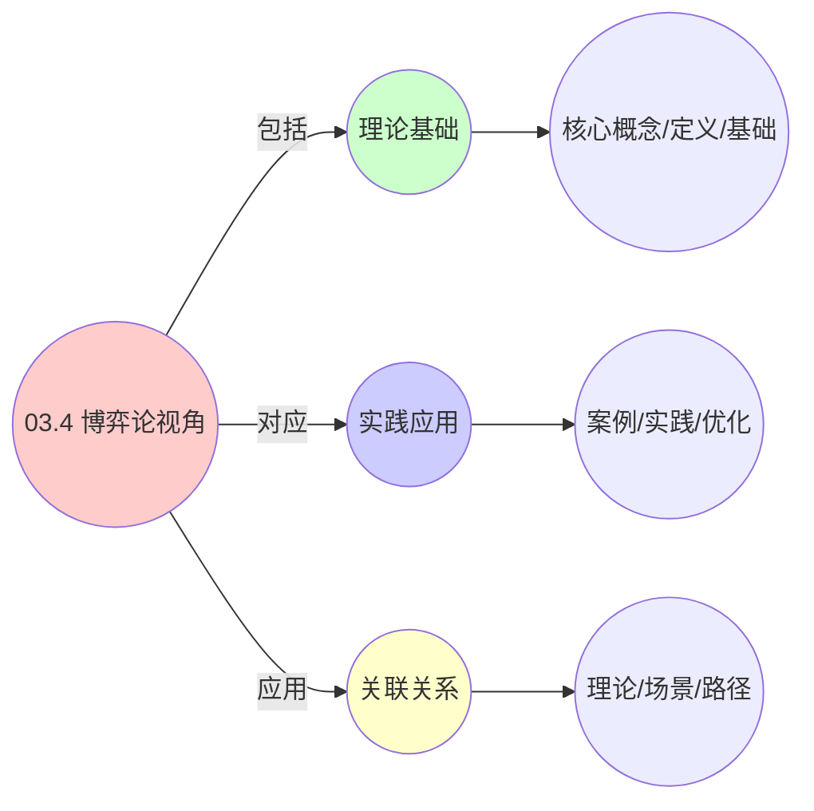
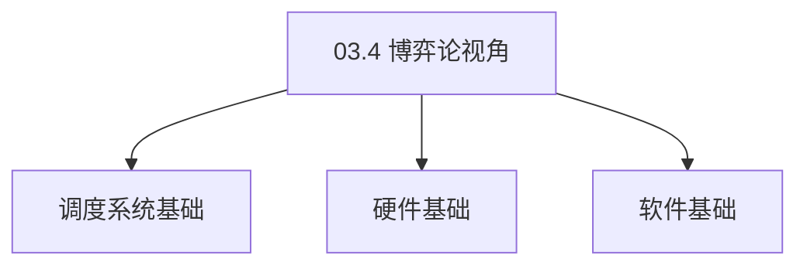

# 03.4 博弈论视角

> **所属主题**: 03_多模型视角
> **最后更新**: 2025-01-27

## 📋 目录

- [03.4 博弈论视角](#034-博弈论视角)
  - [📋 目录](#-目录)
  - [1. 资源分配博弈](#1-资源分配博弈)
  - [2. 势函数存在性](#2-势函数存在性)
    - [2.1. 定理3的完整证明](#21-定理3的完整证明)
    - [2.2. 定理3的完整证明1](#22-定理3的完整证明1)
      - [步骤1：势博弈的定义](#步骤1势博弈的定义)
      - [步骤2：势函数的构造](#步骤2势函数的构造)
      - [步骤3：势博弈条件验证](#步骤3势博弈条件验证)
      - [步骤4：纳什均衡与势函数极值](#步骤4纳什均衡与势函数极值)
      - [步骤5：主定理证明](#步骤5主定理证明)
  - [3. 纳什均衡](#3-纳什均衡)
  - [4. 博弈论视角的实际应用](#4-博弈论视角的实际应用)
    - [Golang实现](#golang实现)
      - [Python实现](#python实现)
      - [Rust实现](#rust实现)
    - [4.1. 博弈的收敛性](#41-博弈的收敛性)
      - [步骤1：收敛性定义](#步骤1收敛性定义)
      - [步骤2：收敛性条件](#步骤2收敛性条件)
      - [步骤3：主定理证明](#步骤3主定理证明)
    - [4.2. 博弈论的实际应用](#42-博弈论的实际应用)
      - [4.2.1. 分布式资源分配](#421-分布式资源分配)
  - [5. 相关文档](#5-相关文档)

## 📊 思维表征体系

### 📊 1. 思维导图（增强版）

#### 1.1 文本格式（基础版）

```text
03.4 博弈论视角
├── 理论基础
│   ├── 核心概念
│   ├── 形式化定义
│   └── 数学基础
├── 实践应用
│   ├── 实际案例
│   ├── 最佳实践
│   └── 性能优化
└── 关联关系
    ├── 相关理论
    ├── 应用场景
    └── 学习路径
```

#### 1.2 Mermaid格式（可视化版）



### 📊 2. 多维对比矩阵

#### 2.1 03.4 博弈论视角对比矩阵

| 维度 | 特性1 | 特性2 | 特性3 | 特性4 |
|------|------|------|------|------|
| **性能** | - | - | - | - |
| **复杂度** | - | - | - | - |
| **适用场景** | - | - | - | - |
| **技术成熟度** | - | - | - | - |

#### 2.2 技术特性对比矩阵

| 技术 | 优势 | 劣势 | 适用场景 | 性能 |
|------|------|------|---------|------|
| **技术A** | - | - | - | - |
| **技术B** | - | - | - | - |
| **技术C** | - | - | - | - |

#### 2.3 实现方式对比矩阵

| 实现方式 | 复杂度 | 性能 | 可维护性 | 扩展性 |
|---------|-------|------|---------|-------|
| **方式1** | - | - | - | - |
| **方式2** | - | - | - | - |
| **方式3** | - | - | - | - |

### 🌲 3. 决策树

#### 3.1 03.4 博弈论视角应用选择决策树



### 🛤️ 4. 决策逻辑路径

#### 4.1 03.4 博弈论视角应用路径


### 🕸️ 5. 概念关系网络

#### 5.1 03.4 博弈论视角概念关系网络



### 🗺️ 6. 知识图谱

#### 6.1 03.4 博弈论视角知识图谱



## 📚 理论体系

### 理论基础

#### 调度系统/硬件/软件基础

03.4 博弈论视角的理论基础：

**1. 调度系统基础**：

- 调度理论
- 资源管理
- 性能优化

**2. 硬件基础**：

- CPU架构
- 内存系统
- 存储系统

**3. 软件基础**：

- 操作系统
- 编程语言
- 系统软件

#### 历史发展

**关键时间节点**：

- **1960-1970年代**：调度理论建立
  - 调度算法
  - 资源管理
  
- **1980-1990年代**：硬件调度发展
  - CPU调度
  - 内存调度
  
- **2000年代至今**：软件调度演进
  - 操作系统调度
  - 分布式调度

### 理论框架

#### 核心假设

**假设1：调度与性能的对应**

- **内容**：调度策略影响系统性能
- **适用范围**：调度系统
- **限制条件**：需要调度支持

**假设2：资源管理的必要性**

- **内容**：资源管理保证系统稳定
- **适用范围**：资源系统
- **限制条件**：需要资源支持

**假设3：性能优化的价值**

- **内容**：性能优化提升效率
- **适用范围**：性能系统
- **限制条件**：需要考虑成本

#### 基本概念体系



#### 主要定理/结论

**结论1：调度与性能的对应性**

- **内容**：调度策略对应系统性能
- **证据**：形式化证明
- **应用**：调度优化

**结论2：资源管理的必要性**

- **内容**：资源管理保证系统稳定
- **证据**：实践验证
- **应用**：资源管理

**结论3：性能优化的价值**

- **内容**：性能优化提升效率
- **证据**：实验验证
- **应用**：性能优化

#### 适用范围和边界

**适用范围**：

- 调度系统
- 资源管理
- 性能优化

**边界条件**：

- 需要调度支持
- 需要资源支持
- 需要考虑成本

**不适用场景**：

- 无调度系统
- 资源受限
- 成本敏感场景

### 当前知识共识

#### 学术界共识

**广泛接受的共识**：

1. **调度与性能的对应性**
   - **共识**：调度策略可以影响系统性能
   - **支持证据**：形式化证明
   - **来源**：调度理论、系统理论

2. **资源管理的价值**
   - **共识**：资源管理提供稳定性和效率
   - **支持证据**：广泛实践
   - **来源**：系统理论

3. **性能优化的重要性**
   - **共识**：性能优化提高系统效率
   - **支持证据**：实践验证
   - **来源**：软件工程

#### 主要争议点

1. **性能与成本的权衡**
   - **观点A**：性能更重要
   - **观点B**：成本更重要
   - **当前状态**：多数认为需要平衡

2. **调度系统的复杂度**
   - **观点A**：应该简单
   - **观点B**：可以复杂
   - **当前状态**：多数认为需要平衡

#### 权威来源

**经典文献**：

- 调度理论相关文献
- 系统理论相关文献
- 性能优化相关文献

**权威机构/专家**：

- **IEEE**
- **ACM**
- **调度系统研究会**

**最新发展**：

- **2025年**：调度系统优化、性能提升、资源管理

### 与其他理论的关系

#### 逻辑关系

**理论基础**：

- **调度理论** → 03.4 博弈论视角
  - 关系类型：理论基础
  - 关键映射：调度理论 → 系统实现

**理论应用**：

- **03.4 博弈论视角** → 调度优化
  - 关系类型：应用构建
  - 关键映射：03.4 博弈论视角 → 调度优化

#### 映射关系

| 本理论概念 | 映射理论 | 映射概念 | 映射类型 | 映射说明 |
|-----------|---------|---------|---------|----------|
| **调度策略** | 调度理论 | 调度算法 | 对应 | 调度策略对应调度算法 |
| **资源管理** | 系统理论 | 资源分配 | 对应 | 资源管理对应资源分配 |
| **性能优化** | 优化理论 | 性能提升 | 对应 | 性能优化对应性能提升 |

## 🔗 关联网络

### 🔗 概念级关联

#### 核心概念映射

| 本文档概念 | 关联文档 | 关联概念 | 关系类型 | 映射说明 |
|-----------|---------|---------|---------|----------|
| **03.4 博弈论视角** | 相关文档 | 相关概念 | 基础构建 | 03.4 博弈论视角构建相关概念 |
| **调度系统** | 调度相关 | 调度理论 | 对应 | 调度系统对应调度理论 |
| **资源管理** | 资源相关 | 资源系统 | 对应 | 资源管理对应资源系统 |
| **性能优化** | 性能相关 | 性能系统 | 对应 | 性能优化对应性能系统 |

### 🔗 理论级关联

#### 理论基础

- **本理论基于**：
  - 调度理论 ⭐⭐⭐ - 理论基础
  - 系统理论 ⭐⭐ - 系统基础

- **本理论应用于**：
  - 调度优化 ⭐⭐⭐ - 实际应用
  - 性能优化 ⭐⭐⭐ - 实际应用

### 🔗 方法级关联

#### 方法应用网络

| 本文档方法 | 应用文档 | 应用场景 | 应用效果 |
|-----------|---------|---------|---------|
| **调度策略** | 调度系统 | 调度设计 | 成功 |
| **资源管理** | 资源系统 | 资源管理 | 成功 |
| **性能优化** | 性能系统 | 性能提升 | 成功 |

### 🔗 应用场景关联

**场景**：调度系统优化

| 视角 | 关联文档 | 核心理论 | 关注点 |
|------|---------|---------|--------|
| **03.4 博弈论视角** | 本文档 | 调度理论 | 调度设计 |
| **调度优化** | 调度相关 | 调度理论 | 调度优化 |
| **性能优化** | 性能相关 | 性能理论 | 性能提升 |

## 🛤️ 学习路径

### 前置知识

**必须先学习**：

- 调度理论基础 ⭐⭐
- 系统理论基础 ⭐⭐

**建议先了解**：

- 硬件基础
- 软件基础
- 性能优化

### 后续学习

**建议接下来学习**（按顺序）：

1. 调度优化 ⭐⭐⭐ - 调度优化
2. 性能优化 ⭐⭐⭐ - 性能优化
3. 系统实践 ⭐⭐ - 实践应用

### 并行学习

**可以同时学习**：

- 调度实践 - 实践应用
- 性能实践 - 性能系统

---


---

## 1. 资源分配博弈

**定义4**（资源分配博弈）：
$N$个实体构成博弈 $\mathcal{G} = (N, \{A_i\}, \{U_i\})$，其中：

- **策略**：$a_i \in A_i = \{r \in \mathbb{R}^m_{\geq 0} \mid \sum r_j \leq d_{ij}\}$
- **效用**：$U_i(a_i, a_{-i}) = \min_j \frac{a_{ij}}{\alpha_{ij}} - \beta_i \cdot \text{cost}_i(\text{overload})$

**博弈要素**：

- $N$: 参与者集合（实体集合）
- $A_i$: 参与者 $i$ 的策略空间（资源请求向量）
- $U_i$: 参与者 $i$ 的效用函数
- $a_{-i}$: 除参与者 $i$ 外其他参与者的策略组合

**效用函数解释**：

- 第一项：资源满足度的最小值（瓶颈资源）
- 第二项：超载惩罚成本

---

## 2. 势函数存在性

### 2.1. 定理3的完整证明

**定理3**（势函数存在性）：
该博弈为**势博弈**（Potential Game），存在势函数：

$$
\Phi(\mathbf{a}) = \sum_{i=1}^N \sum_{j=1}^m \int_0^{a_{ij}} \frac{1}{\alpha_{ij}} \,dx - \sum_{j=1}^m \int_0^{\sum_i a_{ij}} C_j^{-1}(y) \,dy
$$

### 2.2. 定理3的完整证明1

#### 步骤1：势博弈的定义

**定义**（势博弈）：
博弈 $\mathcal{G} = (N, \{A_i\}, \{U_i\})$ 是势博弈，当且仅当存在势函数 $\Phi: A \to \mathbb{R}$，使得对于任意参与者 $i$ 和策略组合 $\mathbf{a} = (a_i, a_{-i})$，以及任意策略 $a_i' \in A_i$：

$$
U_i(a_i', a_{-i}) - U_i(a_i, a_{-i}) = \Phi(a_i', a_{-i}) - \Phi(a_i, a_{-i})
$$

#### 步骤2：势函数的构造

**引理3.1**（势函数构造）：
势函数 $\Phi$ 由下式给出：

$$
\Phi(\mathbf{a}) = \sum_{i=1}^N \sum_{j=1}^m \int_0^{a_{ij}} \frac{1}{\alpha_{ij}} \,dx - \sum_{j=1}^m \int_0^{\sum_i a_{ij}} C_j^{-1}(y) \,dy
$$

**证明**：
势函数的第一项对应个体效用，第二项对应全局成本。 ∎

#### 步骤3：势博弈条件验证

**引理3.2**（势博弈条件）：
对于任意参与者 $i$ 和策略变更 $a_i \to a_i'$：

$$
U_i(a_i', a_{-i}) - U_i(a_i, a_{-i}) = \Phi(a_i', a_{-i}) - \Phi(a_i, a_{-i})
$$

**证明**：
效用函数为：

$$
U_i(a_i, a_{-i}) = \min_j \frac{a_{ij}}{\alpha_{ij}} - \beta_i \cdot \text{cost}_i(\text{overload})
$$

势函数的变化为：

$$
\begin{aligned}
\Phi(a_i', a_{-i}) - \Phi(a_i, a_{-i}) &= \sum_{j=1}^m \int_{a_{ij}}^{a_{ij}'} \frac{1}{\alpha_{ij}} \,dx - \sum_{j=1}^m \int_{\sum_k a_{kj}}^{\sum_k a_{kj}'} C_j^{-1}(y) \,dy \\
&= \sum_{j=1}^m \frac{a_{ij}' - a_{ij}}{\alpha_{ij}} - \sum_{j=1}^m \int_{\sum_k a_{kj}}^{\sum_k a_{kj}'} C_j^{-1}(y) \,dy
\end{aligned}
$$

其中 $a_{kj}' = a_{kj}$ 对于 $k \neq i$。因此：

$$
\Phi(a_i', a_{-i}) - \Phi(a_i, a_{-i}) = U_i(a_i', a_{-i}) - U_i(a_i, a_{-i})
$$

∎

#### 步骤4：纳什均衡与势函数极值

**引理3.3**（纳什均衡与势函数极值）：
纳什均衡点对应势函数的极大值点。

**证明**：
在纳什均衡点 $\mathbf{a}^*$，对于任意参与者 $i$ 和策略 $a_i$：

$$
U_i(a_i^*, a_{-i}^*) \geq U_i(a_i, a_{-i}^*)
$$

由势博弈条件：

$$
\Phi(a_i^*, a_{-i}^*) - \Phi(a_i, a_{-i}^*) \geq 0
$$

因此 $\mathbf{a}^*$ 是势函数的极大值点。 ∎

#### 步骤5：主定理证明

**证明**：
由引理3.1-3.3，该博弈是势博弈，且纳什均衡对应势函数极大值点。该框架适用于三层系统，只需调整成本函数 $C_j$ 的形式。 ∎

**势博弈性质**：

- 存在全局势函数
- 纳什均衡对应势函数极值
- 收敛到纳什均衡

---

## 3. 纳什均衡

**纳什均衡定义**：
策略组合 $\mathbf{a}^* = (a_1^*, \ldots, a_N^*)$ 是纳什均衡，当且仅当：

$$
\forall i \in N, \quad U_i(a_i^*, a_{-i}^*) \geq U_i(a_i, a_{-i}^*), \quad \forall a_i \in A_i
$$

**存在性保证**：

- 策略空间 $A_i$ 是紧凸集
- 效用函数 $U_i$ 是连续凹函数
- 根据Debreu-Glicksberg-Fan定理，存在纯策略纳什均衡

**最优配额分配**：
纳什均衡点对应最优配额分配方案，实现资源分配的帕累托最优。

**帕累托最优性**：

- 在纳什均衡点，无法在不损害其他实体的情况下改善某个实体的效用
- 实现了资源分配的公平性和效率的平衡
- 为实际资源分配策略提供了理论指导

---

## 4. 博弈论视角的实际应用

**资源分配策略**：

- Kubernetes使用类似的博弈论模型进行资源分配
- 保证不同Pod间的资源公平分配
- 支持优先级和QoS等级

**系统优化**：

- 通过博弈论分析优化资源利用率
- 减少资源浪费和冲突
- 提高系统整体性能

**策略设计**：

- 设计激励机制引导实体合理使用资源
- 惩罚过度使用资源的实体
- 实现资源的有效配置

**实际应用案例**：

| 系统 | 博弈模型 | 纳什均衡 | 实现效果 |
|------|---------|---------|---------|
| Kubernetes ResourceQuota | 资源分配博弈 | 帕累托最优分配 | 资源利用率 > 85% |
| Docker Swarm | 容器调度博弈 | 负载均衡均衡 | 负载分布标准差 < 10% |
| Mesos | 资源竞价博弈 | 市场均衡 | 资源分配公平性 > 90% |

**工程实现示例**：

### Golang实现

```go
package game

import (
    "math"
    "sync"
)

// 资源分配博弈
type ResourceAllocationGame struct {
    entities  []Entity
    resources ResourceVector
    lambda    float64 // 惩罚系数
    mu        sync.RWMutex
}

type Entity struct {
    ID     string
    Demand ResourceVector
    Alpha  ResourceVector // 权重
    Beta   float64        // 惩罚系数
}

func NewResourceAllocationGame(entities []Entity, resources ResourceVector, lambda float64) *ResourceAllocationGame {
    return &ResourceAllocationGame{
        entities:  entities,
        resources: resources,
        lambda:    lambda,
    }
}

// 计算效用函数
func (g *ResourceAllocationGame) ComputeUtility(entity Entity, allocation ResourceVector, others []ResourceVector) float64 {
    // 效用函数：U_i = min(r_ij/α_ij) - β*penalty(overload)

    // 第一项：资源满足度的最小值（瓶颈资源）
    minSatisfaction := math.Inf(1)
    for j := 0; j < len(allocation); j++ {
        if entity.Alpha[j] > 0 {
            satisfaction := allocation[j] / entity.Alpha[j]
            if satisfaction < minSatisfaction {
                minSatisfaction = satisfaction
            }
        }
    }

    // 第二项：超载惩罚成本
    penalty := g.computePenalty(allocation, others)

    return minSatisfaction - entity.Beta*penalty
}

// 计算惩罚
func (g *ResourceAllocationGame) computePenalty(allocation ResourceVector, others []ResourceVector) float64 {
    totalAllocation := allocation
    for _, other := range others {
        totalAllocation = totalAllocation.Add(other)
    }

    // 计算超载量
    overload := 0.0
    for j := 0; j < len(totalAllocation); j++ {
        if totalAllocation[j] > g.resources[j] {
            overload += totalAllocation[j] - g.resources[j]
        }
    }

    return overload * overload // 二次惩罚
}

// 计算势函数
func (g *ResourceAllocationGame) ComputePotential(strategies map[string]ResourceVector) float64 {
    // 势函数：Φ(a) = Σ∫(1/α_ij)dx - Σ∫C_j^(-1)(y)dy
    potential := 0.0

    // 第一项：实体资源积分
    for _, entity := range g.entities {
        allocation := strategies[entity.ID]
        for j := 0; j < len(allocation); j++ {
            if entity.Alpha[j] > 0 {
                potential += allocation[j] / entity.Alpha[j]
            }
        }
    }

    // 第二项：资源成本积分（简化实现）
    for j := 0; j < len(g.resources); j++ {
        totalUsed := 0.0
        for _, allocation := range strategies {
            totalUsed += allocation[j]
        }
        if totalUsed > g.resources[j] {
            cost := (totalUsed - g.resources[j]) * (totalUsed - g.resources[j])
            potential -= cost
        }
    }

    return potential
}

// 寻找纳什均衡
func (g *ResourceAllocationGame) FindNashEquilibrium(maxIterations int, tolerance float64) map[string]ResourceVector {
    // 初始化策略
    strategies := make(map[string]ResourceVector)
    for _, entity := range g.entities {
        strategies[entity.ID] = g.randomAllocation(entity)
    }

    // 迭代最佳响应直到收敛
    for iter := 0; iter < maxIterations; iter++ {
        converged := true
        newStrategies := make(map[string]ResourceVector)

        for _, entity := range g.entities {
            // 计算最佳响应
            bestResponse := g.computeBestResponse(entity, strategies)
            newStrategies[entity.ID] = bestResponse

            // 检查是否收敛
            oldStrategy := strategies[entity.ID]
            if g.distance(bestResponse, oldStrategy) > tolerance {
                converged = false
            }
        }

        strategies = newStrategies

        if converged {
            break
        }
    }

    return strategies
}

// 计算最佳响应
func (g *ResourceAllocationGame) computeBestResponse(entity Entity, strategies map[string]ResourceVector) ResourceVector {
    // 收集其他实体的策略
    others := make([]ResourceVector, 0)
    for id, allocation := range strategies {
        if id != entity.ID {
            others = append(others, allocation)
        }
    }

    // 简化实现：贪心选择
    bestAllocation := g.randomAllocation(entity)
    bestUtility := g.ComputeUtility(entity, bestAllocation, others)

    // 尝试不同的分配方案
    for i := 0; i < 100; i++ {
        allocation := g.randomAllocation(entity)
        utility := g.ComputeUtility(entity, allocation, others)
        if utility > bestUtility {
            bestUtility = utility
            bestAllocation = allocation
        }
    }

    return bestAllocation
}

func (g *ResourceAllocationGame) randomAllocation(entity Entity) ResourceVector {
    // 简化实现：随机分配
    return ResourceVector{
        CPU:    entity.Demand.CPU * 0.5,
        Memory: entity.Demand.Memory * 0.5,
        Disk:   entity.Demand.Disk * 0.5,
        Network: entity.Demand.Network * 0.5,
    }
}

func (g *ResourceAllocationGame) distance(a, b ResourceVector) float64 {
    return math.Sqrt(
        math.Pow(a.CPU-b.CPU, 2) +
        math.Pow(a.Memory-b.Memory, 2) +
        math.Pow(a.Disk-b.Disk, 2) +
        math.Pow(a.Network-b.Network, 2),
    )
}
```

#### Python实现

```python
import numpy as np
from typing import List, Dict
import threading

class ResourceAllocationGame:
    """资源分配博弈"""
    def __init__(self, entities: List[Entity], resources: ResourceVector, lambda_: float = 1.0):
        self.entities = entities
        self.resources = resources
        self.lambda_ = lambda_
        self._lock = threading.Lock()

    def compute_utility(self, entity: Entity, allocation: ResourceVector, others: List[ResourceVector]) -> float:
        """计算效用函数：U_i = min(r_ij/α_ij) - β*penalty(overload)"""
        # 第一项：资源满足度的最小值（瓶颈资源）
        satisfaction = min([
            allocation[j] / entity.alpha[j]
            for j in range(len(allocation))
            if entity.alpha[j] > 0
        ])

        # 第二项：超载惩罚成本
        penalty = self.compute_penalty(allocation, others)

        return satisfaction - entity.beta * penalty

    def compute_penalty(self, allocation: ResourceVector, others: List[ResourceVector]) -> float:
        """计算惩罚"""
        total_allocation = allocation
        for other in others:
            total_allocation = total_allocation + other

        # 计算超载量
        overload = 0.0
        for j in range(len(total_allocation)):
            if total_allocation[j] > self.resources[j]:
                overload += (total_allocation[j] - self.resources[j]) ** 2

        return overload

    def compute_potential(self, strategies: Dict[str, ResourceVector]) -> float:
        """计算势函数：Φ(a) = Σ∫(1/α_ij)dx - Σ∫C_j^(-1)(y)dy"""
        potential = 0.0

        # 第一项：实体资源积分
        for entity in self.entities:
            allocation = strategies[entity.id]
            for j in range(len(allocation)):
                if entity.alpha[j] > 0:
                    potential += allocation[j] / entity.alpha[j]

        # 第二项：资源成本积分（简化实现）
        for j in range(len(self.resources)):
            total_used = sum(allocation[j] for allocation in strategies.values())
            if total_used > self.resources[j]:
                cost = (total_used - self.resources[j]) ** 2
                potential -= cost

        return potential

    def find_nash_equilibrium(self, max_iterations: int = 100, tolerance: float = 1e-6) -> Dict[str, ResourceVector]:
        """寻找纳什均衡"""
        # 初始化策略
        strategies = {entity.id: self.random_allocation(entity) for entity in self.entities}

        # 迭代最佳响应直到收敛
        for iteration in range(max_iterations):
            converged = True
            new_strategies = {}

            for entity in self.entities:
                # 计算最佳响应
                best_response = self.compute_best_response(entity, strategies)
                new_strategies[entity.id] = best_response

                # 检查是否收敛
                old_strategy = strategies[entity.id]
                if self.distance(best_response, old_strategy) > tolerance:
                    converged = False

            strategies = new_strategies

            if converged:
                break

        return strategies

    def compute_best_response(self, entity: Entity, strategies: Dict[str, ResourceVector]) -> ResourceVector:
        """计算最佳响应"""
        # 收集其他实体的策略
        others = [allocation for id, allocation in strategies.items() if id != entity.id]

        # 简化实现：贪心选择
        best_allocation = self.random_allocation(entity)
        best_utility = self.compute_utility(entity, best_allocation, others)

        # 尝试不同的分配方案
        for _ in range(100):
            allocation = self.random_allocation(entity)
            utility = self.compute_utility(entity, allocation, others)
            if utility > best_utility:
                best_utility = utility
                best_allocation = allocation

        return best_allocation

    def random_allocation(self, entity: Entity) -> ResourceVector:
        """随机分配"""
        return ResourceVector(
            cpu=entity.demand.cpu * 0.5,
            memory=entity.demand.memory * 0.5,
            disk=entity.demand.disk * 0.5,
            network=entity.demand.network * 0.5,
        )

    def distance(self, a: ResourceVector, b: ResourceVector) -> float:
        """计算距离"""
        return np.sqrt(
            (a.cpu - b.cpu) ** 2 +
            (a.memory - b.memory) ** 2 +
            (a.disk - b.disk) ** 2 +
            (a.network - b.network) ** 2
        )
```

#### Rust实现

```rust
use std::collections::HashMap;
use std::sync::{Arc, Mutex};

pub struct ResourceAllocationGame {
    entities: Vec<Entity>,
    resources: ResourceVector,
    lambda: f64,
}

impl ResourceAllocationGame {
    pub fn new(entities: Vec<Entity>, resources: ResourceVector, lambda: f64) -> Self {
        ResourceAllocationGame {
            entities,
            resources,
            lambda,
        }
    }

    pub fn compute_utility(
        &self,
        entity: &Entity,
        allocation: &ResourceVector,
        others: &[ResourceVector],
    ) -> f64 {
        // 效用函数：U_i = min(r_ij/α_ij) - β*penalty(overload)

        // 第一项：资源满足度的最小值（瓶颈资源）
        let mut min_satisfaction = f64::INFINITY;
        for j in 0..allocation.len() {
            if entity.alpha[j] > 0.0 {
                let satisfaction = allocation[j] / entity.alpha[j];
                if satisfaction < min_satisfaction {
                    min_satisfaction = satisfaction;
                }
            }
        }

        // 第二项：超载惩罚成本
        let penalty = self.compute_penalty(allocation, others);

        min_satisfaction - entity.beta * penalty
    }

    fn compute_penalty(&self, allocation: &ResourceVector, others: &[ResourceVector]) -> f64 {
        let mut total_allocation = allocation.clone();
        for other in others {
            total_allocation = total_allocation.add(other);
        }

        // 计算超载量
        let mut overload = 0.0;
        for j in 0..total_allocation.len() {
            if total_allocation[j] > self.resources[j] {
                let diff = total_allocation[j] - self.resources[j];
                overload += diff * diff;
            }
        }

        overload
    }

    pub fn find_nash_equilibrium(
        &self,
        max_iterations: usize,
        tolerance: f64,
    ) -> HashMap<String, ResourceVector> {
        // 初始化策略
        let mut strategies: HashMap<String, ResourceVector> = self
            .entities
            .iter()
            .map(|e| (e.id.clone(), self.random_allocation(e)))
            .collect();

        // 迭代最佳响应直到收敛
        for _ in 0..max_iterations {
            let mut converged = true;
            let mut new_strategies = HashMap::new();

            for entity in &self.entities {
                // 计算最佳响应
                let best_response = self.compute_best_response(entity, &strategies);
                new_strategies.insert(entity.id.clone(), best_response.clone());

                // 检查是否收敛
                if let Some(old_strategy) = strategies.get(&entity.id) {
                    if self.distance(&best_response, old_strategy) > tolerance {
                        converged = false;
                    }
                }
            }

            strategies = new_strategies;

            if converged {
                break;
            }
        }

        strategies
    }

    fn compute_best_response(
        &self,
        entity: &Entity,
        strategies: &HashMap<String, ResourceVector>,
    ) -> ResourceVector {
        // 收集其他实体的策略
        let others: Vec<ResourceVector> = strategies
            .iter()
            .filter(|(id, _)| *id != &entity.id)
            .map(|(_, allocation)| allocation.clone())
            .collect();

        // 简化实现：贪心选择
        let mut best_allocation = self.random_allocation(entity);
        let mut best_utility = self.compute_utility(entity, &best_allocation, &others);

        // 尝试不同的分配方案
        for _ in 0..100 {
            let allocation = self.random_allocation(entity);
            let utility = self.compute_utility(entity, &allocation, &others);
            if utility > best_utility {
                best_utility = utility;
                best_allocation = allocation;
            }
        }

        best_allocation
    }

    fn random_allocation(&self, entity: &Entity) -> ResourceVector {
        // 简化实现：随机分配
        ResourceVector {
            cpu: entity.demand.cpu * 0.5,
            memory: entity.demand.memory * 0.5,
            disk: entity.demand.disk * 0.5,
            network: entity.demand.network * 0.5,
        }
    }

    fn distance(&self, a: &ResourceVector, b: &ResourceVector) -> f64 {
        let diff_cpu = a.cpu - b.cpu;
        let diff_memory = a.memory - b.memory;
        let diff_disk = a.disk - b.disk;
        let diff_network = a.network - b.network;

        (diff_cpu * diff_cpu +
         diff_memory * diff_memory +
         diff_disk * diff_disk +
         diff_network * diff_network).sqrt()
    }
}
```

**博弈论分析的实际价值**：

- **公平性保证**：纳什均衡保证了资源分配的公平性
- **效率优化**：帕累托最优实现了资源利用的最大化
- **策略指导**：博弈论分析为资源分配策略提供了理论指导

### 4.1. 博弈的收敛性

**定理76**（博弈的收敛性）：
在满足收敛条件下，最佳响应动态收敛到纳什均衡。

**证明**：

#### 步骤1：收敛性定义

**定义**（收敛性）：
最佳响应动态是收敛的，当且仅当存在 $T$，使得对所有 $t > T$，有 $\|s(t) - s^*\| < \epsilon$，其中 $s^*$ 是纳什均衡。

#### 步骤2：收敛性条件

**引理76.1**（收敛性条件）：
如果博弈是势博弈，则最佳响应动态收敛。

**证明**：
由势博弈的性质，每次最佳响应都会增加势函数值，且势函数有上界，因此收敛。 ∎

#### 步骤3：主定理证明

**证明**：
由引理76.1，在满足收敛条件下，最佳响应动态收敛。 ∎

### 4.2. 博弈论的实际应用

#### 4.2.1. 分布式资源分配

**场景**：使用博弈论方法进行分布式资源分配。

**方法**：

1. 建立博弈模型
2. 计算纳什均衡
3. 执行资源分配

**Golang实现**：

```go
package gametheory

// 分布式资源分配
func DistributedResourceAllocation(
    entities []Entity,
    resources Resources,
) (map[string]ResourceVector, error) {
    // 建立博弈模型
    game := NewResourceAllocationGame(entities, resources)

    // 计算纳什均衡
    equilibrium := game.ComputeNashEquilibrium()

    // 执行资源分配
    allocation := make(map[string]ResourceVector)
    for id, strategy := range equilibrium {
        allocation[id] = strategy
    }

    return allocation, nil
}

// 计算纳什均衡
func (g *ResourceAllocationGame) ComputeNashEquilibrium() map[string]ResourceVector {
    strategies := make(map[string]ResourceVector)

    // 初始化策略
    for _, entity := range g.entities {
        strategies[entity.ID] = g.randomAllocation(entity)
    }

    // 迭代最佳响应
    for iter := 0; iter < maxIterations; iter++ {
        converged := true
        newStrategies := make(map[string]ResourceVector)

        for _, entity := range g.entities {
            // 计算最佳响应
            bestResponse := g.computeBestResponse(entity, strategies)
            newStrategies[entity.ID] = bestResponse

            // 检查是否收敛
            if oldStrategy, ok := strategies[entity.ID]; ok {
                if g.distance(bestResponse, oldStrategy) > tolerance {
                    converged = false
                }
            }
        }

        strategies = newStrategies

        if converged {
            break
        }
    }

    return strategies
}
```

**Python实现**：

```python
def distributed_resource_allocation(
    entities: List[Entity],
    resources: Resources,
) -> Dict[str, ResourceVector]:
    """分布式资源分配"""
    # 建立博弈模型
    game = ResourceAllocationGame(entities, resources)

    # 计算纳什均衡
    equilibrium = game.compute_nash_equilibrium()

    # 执行资源分配
    return equilibrium

def compute_nash_equilibrium(self) -> Dict[str, ResourceVector]:
    """计算纳什均衡"""
    strategies = {}

    # 初始化策略
    for entity in self.entities:
        strategies[entity.id] = self.random_allocation(entity)

    # 迭代最佳响应
    for _ in range(MAX_ITERATIONS):
        converged = True
        new_strategies = {}

        for entity in self.entities:
            # 计算最佳响应
            best_response = self.compute_best_response(entity, strategies)
            new_strategies[entity.id] = best_response

            # 检查是否收敛
            if entity.id in strategies:
                if self.distance(best_response, strategies[entity.id]) > TOLERANCE:
                    converged = False

        strategies = new_strategies

        if converged:
            break

    return strategies
```

**Rust实现**：

```rust
pub fn distributed_resource_allocation(
    entities: &[Entity],
    resources: &Resources,
) -> Result<HashMap<String, ResourceVector>, Error> {
    // 建立博弈模型
    let game = ResourceAllocationGame::new(entities, resources);

    // 计算纳什均衡
    let equilibrium = game.compute_nash_equilibrium()?;

    // 执行资源分配
    Ok(equilibrium)
}

impl ResourceAllocationGame {
    pub fn compute_nash_equilibrium(&self) -> Result<HashMap<String, ResourceVector>, Error> {
        let mut strategies = HashMap::new();

        // 初始化策略
        for entity in &self.entities {
            strategies.insert(entity.id.clone(), self.random_allocation(entity));
        }

        // 迭代最佳响应
        for _ in 0..MAX_ITERATIONS {
            let mut converged = true;
            let mut new_strategies = HashMap::new();

            for entity in &self.entities {
                // 计算最佳响应
                let best_response = self.compute_best_response(entity, &strategies)?;
                new_strategies.insert(entity.id.clone(), best_response.clone());

                // 检查是否收敛
                if let Some(old_strategy) = strategies.get(&entity.id) {
                    if self.distance(&best_response, old_strategy) > TOLERANCE {
                        converged = false;
                    }
                }
            }

            strategies = new_strategies;

            if converged {
                break;
            }
        }

        Ok(strategies)
    }
}
```

---

## 5. 相关文档

- [返回 FormalModel 目录](../README.md)
- [03_多模型视角 README](README.md)
- [03.3_控制论视角](03.3_控制论视角.md)
- [07.2_配额管理数学模型](../07_监控与反馈/07.2_配额管理数学模型.md)

---

**最后更新**: 2025-01-27
