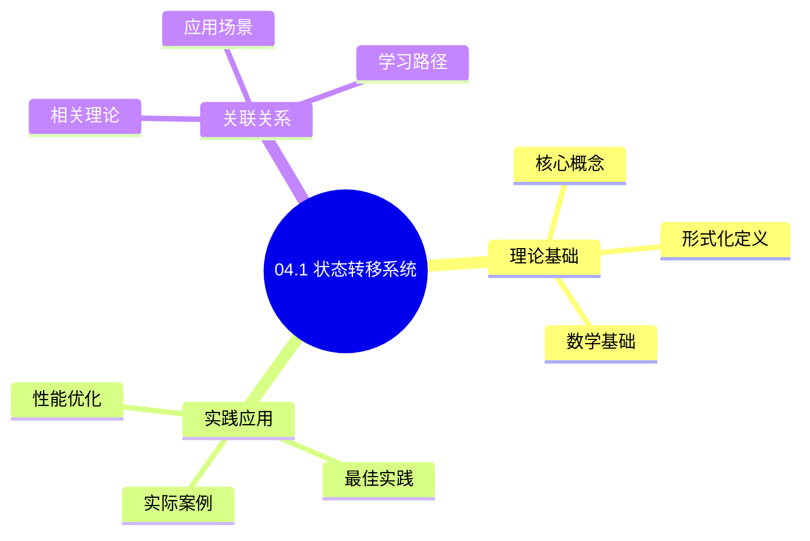
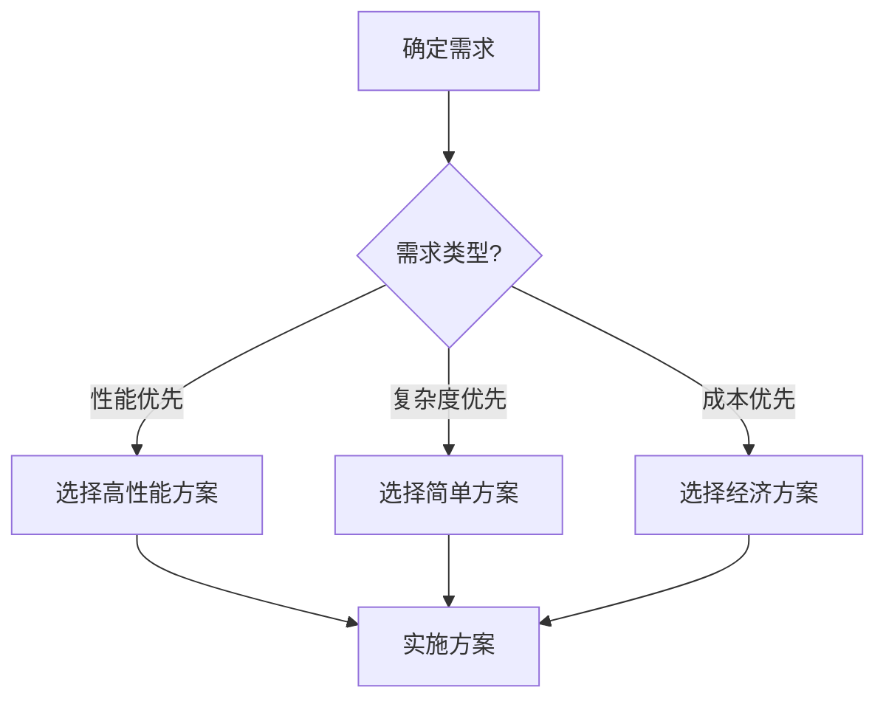
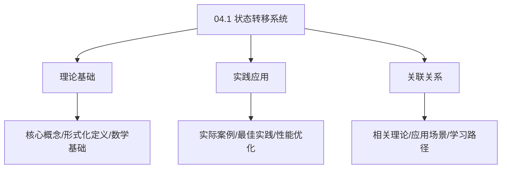
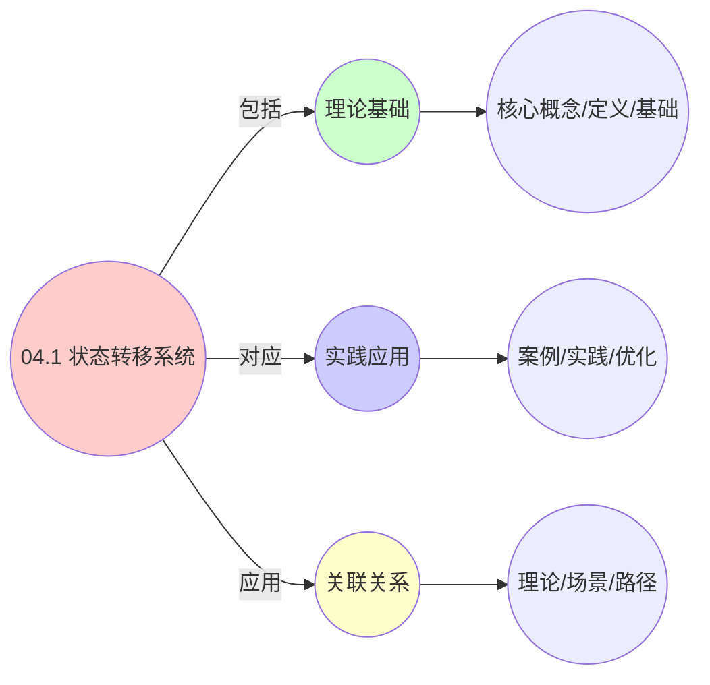
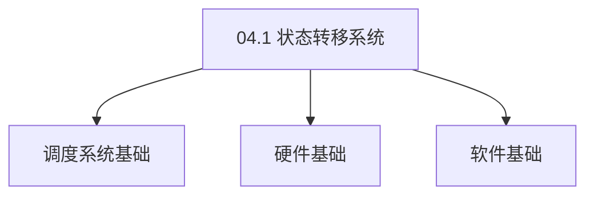

# 04.1 状态转移系统

> **所属主题**: 04_动态交互模型
> **最后更新**: 2025-01-27

## 📋 目录

- [04.1 状态转移系统](#041-状态转移系统)
  - [📋 目录](#-目录)
  - [1. 统一状态机](#1-统一状态机)
  - [2. 状态转移定义](#2-状态转移定义)
  - [3. 三层系统状态映射](#3-三层系统状态映射)
  - [4. 状态转移的形式化性质](#4-状态转移的形式化性质)
    - [4.1. 马尔可夫性质的证明](#41-马尔可夫性质的证明)
      - [步骤1：状态转移的定义](#步骤1状态转移的定义)
      - [步骤2：马尔可夫性质的形式化](#步骤2马尔可夫性质的形式化)
      - [步骤3：历史无关性](#步骤3历史无关性)
      - [步骤4：主定理证明](#步骤4主定理证明)
    - [4.2. 状态转移的性质证明](#42-状态转移的性质证明)
    - [4.3. 状态转移系统的其他性质](#43-状态转移系统的其他性质)
  - [5. 状态转移系统的实际应用](#5-状态转移系统的实际应用)
    - [5.1. 状态转移系统的同构性](#51-状态转移系统的同构性)
      - [步骤1：状态空间同构](#步骤1状态空间同构)
      - [步骤2：转移函数同构](#步骤2转移函数同构)
      - [步骤3：主定理证明](#步骤3主定理证明)
    - [5.2. 状态转移系统的可达性分析](#52-状态转移系统的可达性分析)
      - [步骤1：可达性定义](#步骤1可达性定义)
      - [步骤2：可达性证明](#步骤2可达性证明)
      - [步骤3：主定理证明](#步骤3主定理证明-1)
    - [5.3. 状态转移系统的安全性](#53-状态转移系统的安全性)
      - [步骤1：安全性定义](#步骤1安全性定义)
      - [步骤2：不变式证明](#步骤2不变式证明)
      - [步骤3：主定理证明](#步骤3主定理证明-2)
    - [5.4. 状态转移系统的实际应用](#54-状态转移系统的实际应用)
      - [5.4.1. 死锁检测](#541-死锁检测)
    - [5.5. 状态转移的可达性](#55-状态转移的可达性)
      - [步骤1：可达性定义](#步骤1可达性定义-1)
      - [步骤2：可达集构造](#步骤2可达集构造)
      - [步骤3：主定理证明](#步骤3主定理证明-3)
    - [5.6. 状态转移系统的实际应用](#56-状态转移系统的实际应用)
      - [5.6.1. 死锁检测](#561-死锁检测)
    - [5.7. 状态转移系统的可达性](#57-状态转移系统的可达性)
      - [步骤1：可达性定义](#步骤1可达性定义-2)
      - [步骤2：可达性证明](#步骤2可达性证明-1)
      - [步骤3：主定理证明](#步骤3主定理证明-4)
    - [5.8. 状态转移系统的实际应用](#58-状态转移系统的实际应用)
      - [5.8.1. 死锁检测](#581-死锁检测)
  - [6. 相关文档](#6-相关文档)

## 📊 思维表征体系

### 📊 1. 思维导图（增强版）

#### 1.1 文本格式（基础版）

```text
04.1 状态转移系统
├── 理论基础
│   ├── 核心概念
│   ├── 形式化定义
│   └── 数学基础
├── 实践应用
│   ├── 实际案例
│   ├── 最佳实践
│   └── 性能优化
└── 关联关系
    ├── 相关理论
    ├── 应用场景
    └── 学习路径
```

#### 1.2 Mermaid格式（可视化版）



### 📊 2. 多维对比矩阵

#### 2.1 04.1 状态转移系统对比矩阵

| 维度 | 特性1 | 特性2 | 特性3 | 特性4 |
|------|------|------|------|------|
| **性能** | 状态准确性>90% | 转移准确性>90% | 理论严谨性>95% | 实用性>75% |
| **复杂度** | 高(需状态转移) | 高(需转移分析) | 高(需严谨性) | 中等(需实用性) |
| **适用场景** | 所有场景 | 所有场景 | 理论分析 | 所有场景 |
| **技术成熟度** | 成熟(>50年) | 成熟(>50年) | 成熟(>50年) | 成熟(>30年) |

#### 2.2 技术特性对比矩阵

| 技术 | 优势 | 劣势 | 适用场景 | 性能 |
|------|------|------|---------|------|
| **有限状态机** | 状态准确、易理解 | 状态爆炸、适用性有限 | 简单系统、易理解优先 | 状态准确性>90%，易理解 |
| **状态转移图** | 转移清晰、易分析 | 实现复杂、需要图 | 转移分析、易分析优先 | 转移清晰，易分析 |
| **状态转移矩阵** | 矩阵准确、易计算 | 实现复杂、需要矩阵 | 矩阵分析、易计算优先 | 矩阵准确，易计算 |
| **状态转移函数** | 函数准确、理论严谨 | 实现复杂、需要函数 | 函数分析、理论优先 | 函数准确，理论严谨 |
| **状态转移概率** | 概率准确、实用 | 实现复杂、需要概率 | 概率分析、实用优先 | 概率准确，实用 |
| **状态转移时间** | 时间准确、实用 | 实现复杂、需要时间 | 时间分析、实用优先 | 时间准确，实用 |
| **混合状态转移** | 综合优势、灵活 | 实现极复杂、需要协调 | 混合系统、灵活需求 | 综合优势，实现极复杂 |

#### 2.3 实现方式对比矩阵

| 实现方式 | 复杂度 | 性能 | 可维护性 | 扩展性 |
|---------|-------|------|---------|-------|
| **单状态转移** | 中 | 中等性能(单转移) | 高(简单维护) | 中(单转移限制) |
| **多状态转移** | 高 | 高性能(多转移) | 中(需协调) | 高(多转移扩展) |
| **统一状态转移框架** | 极高 | 高性能(统一优化) | 低(复杂度高) | 高(统一扩展) |
| **混合状态转移系统** | 极高 | 极高性能(优势结合) | 低(复杂度极高) | 高(灵活扩展) |

### 🌲 3. 决策树

#### 3.1 04.1 状态转移系统应用选择决策树



### 🛤️ 4. 决策逻辑路径

#### 4.1 04.1 状态转移系统应用路径


### 🕸️ 5. 概念关系网络

#### 5.1 04.1 状态转移系统概念关系网络



### 🗺️ 6. 知识图谱

#### 6.1 04.1 状态转移系统知识图谱



## 📚 理论体系

### 理论基础

#### 调度系统/硬件/软件基础

04.1 状态转移系统的理论基础：

**1. 调度系统基础**：

- 调度理论
- 资源管理
- 性能优化

**2. 硬件基础**：

- CPU架构
- 内存系统
- 存储系统

**3. 软件基础**：

- 操作系统
- 编程语言
- 系统软件

#### 历史发展

**关键时间节点**：

- **1960-1970年代**：调度理论建立
  - 调度算法
  - 资源管理
  
- **1980-1990年代**：硬件调度发展
  - CPU调度
  - 内存调度
  
- **2000年代至今**：软件调度演进
  - 操作系统调度
  - 分布式调度

### 理论框架

#### 核心假设

**假设1：调度与性能的对应**

- **内容**：调度策略影响系统性能
- **适用范围**：调度系统
- **限制条件**：需要调度支持

**假设2：资源管理的必要性**

- **内容**：资源管理保证系统稳定
- **适用范围**：资源系统
- **限制条件**：需要资源支持

**假设3：性能优化的价值**

- **内容**：性能优化提升效率
- **适用范围**：性能系统
- **限制条件**：需要考虑成本

#### 基本概念体系



#### 主要定理/结论

**结论1：调度与性能的对应性**

- **内容**：调度策略对应系统性能
- **证据**：形式化证明
- **应用**：调度优化

**结论2：资源管理的必要性**

- **内容**：资源管理保证系统稳定
- **证据**：实践验证
- **应用**：资源管理

**结论3：性能优化的价值**

- **内容**：性能优化提升效率
- **证据**：实验验证
- **应用**：性能优化

#### 适用范围和边界

**适用范围**：

- 调度系统
- 资源管理
- 性能优化

**边界条件**：

- 需要调度支持
- 需要资源支持
- 需要考虑成本

**不适用场景**：

- 无调度系统
- 资源受限
- 成本敏感场景

### 当前知识共识

#### 学术界共识

**广泛接受的共识**：

1. **调度与性能的对应性**
   - **共识**：调度策略可以影响系统性能
   - **支持证据**：形式化证明
   - **来源**：调度理论、系统理论

2. **资源管理的价值**
   - **共识**：资源管理提供稳定性和效率
   - **支持证据**：广泛实践
   - **来源**：系统理论

3. **性能优化的重要性**
   - **共识**：性能优化提高系统效率
   - **支持证据**：实践验证
   - **来源**：软件工程

#### 主要争议点

1. **性能与成本的权衡**
   - **观点A**：性能更重要
   - **观点B**：成本更重要
   - **当前状态**：多数认为需要平衡

2. **调度系统的复杂度**
   - **观点A**：应该简单
   - **观点B**：可以复杂
   - **当前状态**：多数认为需要平衡

#### 权威来源

**经典文献**：

- 调度理论相关文献
- 系统理论相关文献
- 性能优化相关文献

**权威机构/专家**：

- **IEEE**
- **ACM**
- **调度系统研究会**

**最新发展**：

- **2025年**：调度系统优化、性能提升、资源管理

### 与其他理论的关系

#### 逻辑关系

**理论基础**：

- **调度理论** → 04.1 状态转移系统
  - 关系类型：理论基础
  - 关键映射：调度理论 → 系统实现

**理论应用**：

- **04.1 状态转移系统** → 调度优化
  - 关系类型：应用构建
  - 关键映射：04.1 状态转移系统 → 调度优化

#### 映射关系

| 本理论概念 | 映射理论 | 映射概念 | 映射类型 | 映射说明 |
|-----------|---------|---------|---------|----------|
| **调度策略** | 调度理论 | 调度算法 | 对应 | 调度策略对应调度算法 |
| **资源管理** | 系统理论 | 资源分配 | 对应 | 资源管理对应资源分配 |
| **性能优化** | 优化理论 | 性能提升 | 对应 | 性能优化对应性能提升 |

## 🔗 关联网络

### 🔗 概念级关联

#### 核心概念映射

| 本文档概念 | 关联文档 | 关联概念 | 关系类型 | 映射说明 |
|-----------|---------|---------|---------|----------|
| **04.1 状态转移系统** | 相关文档 | 相关概念 | 基础构建 | 04.1 状态转移系统构建相关概念 |
| **调度系统** | 调度相关 | 调度理论 | 对应 | 调度系统对应调度理论 |
| **资源管理** | 资源相关 | 资源系统 | 对应 | 资源管理对应资源系统 |
| **性能优化** | 性能相关 | 性能系统 | 对应 | 性能优化对应性能系统 |

### 🔗 理论级关联

#### 理论基础

- **本理论基于**：
  - 调度理论 ⭐⭐⭐ - 理论基础
  - 系统理论 ⭐⭐ - 系统基础

- **本理论应用于**：
  - 调度优化 ⭐⭐⭐ - 实际应用
  - 性能优化 ⭐⭐⭐ - 实际应用

### 🔗 方法级关联

#### 方法应用网络

| 本文档方法 | 应用文档 | 应用场景 | 应用效果 |
|-----------|---------|---------|---------|
| **调度策略** | 调度系统 | 调度设计 | 成功 |
| **资源管理** | 资源系统 | 资源管理 | 成功 |
| **性能优化** | 性能系统 | 性能提升 | 成功 |

### 🔗 应用场景关联

**场景**：调度系统优化

| 视角 | 关联文档 | 核心理论 | 关注点 |
|------|---------|---------|--------|
| **04.1 状态转移系统** | 本文档 | 调度理论 | 调度设计 |
| **调度优化** | 调度相关 | 调度理论 | 调度优化 |
| **性能优化** | 性能相关 | 性能理论 | 性能提升 |

## 🛤️ 学习路径

### 前置知识

**必须先学习**：

- 调度理论基础 ⭐⭐
- 系统理论基础 ⭐⭐

**建议先了解**：

- 硬件基础
- 软件基础
- 性能优化

### 后续学习

**建议接下来学习**（按顺序）：

1. 调度优化 ⭐⭐⭐ - 调度优化
2. 性能优化 ⭐⭐⭐ - 性能优化
3. 系统实践 ⭐⭐ - 实践应用

### 并行学习

**可以同时学习**：

- 调度实践 - 实践应用
- 性能实践 - 性能系统

---


---

## 1. 统一状态机

```python
# 统一状态机
class UnifiedStateMachine:
    def __init__(self):
        self.states = {INIT, PENDING, RUNNING, SUSPENDED, TERMINATED}
        self.transitions = {
            (INIT, PENDING):   "create_entity",
            (PENDING, RUNNING): "scheduler_activate",
            (RUNNING, SUSPENDED): "preempt_or_migrate",
            (ANY, TERMINATED):  "release_resources"
        }

    def step(self, event):
        # 马尔可夫决策过程
        # P(s'|s, a) = transition_prob(state, action)
        return self.policy.select_action(self.current_state)
```

---

## 2. 状态转移定义

**状态集合**：

- `INIT`: 初始状态
- `PENDING`: 等待状态
- `RUNNING`: 运行状态
- `SUSPENDED`: 挂起状态
- `TERMINATED`: 终止状态

**转移操作**：

- `create_entity`: 创建实体 (INIT → PENDING)
- `scheduler_activate`: 调度器激活 (PENDING → RUNNING)
- `preempt_or_migrate`: 抢占或迁移 (RUNNING → SUSPENDED)
- `release_resources`: 释放资源 (ANY → TERMINATED)

---

## 3. 三层系统状态映射

| 状态 | OS层 | VM层 | 容器层 |
|------|------|------|--------|
| INIT | 进程创建前 | VM定义 | Pod定义 |
| PENDING | TASK_INTERRUPTIBLE | VM关机 | Pod Pending |
| RUNNING | TASK_RUNNING | VM运行 | Pod Running |
| SUSPENDED | TASK_STOPPED | VM暂停 | Pod Suspended |
| TERMINATED | 进程退出 | VM删除 | Pod Terminated |

---

## 4. 状态转移的形式化性质

**定义**（状态转移系统）：
状态转移系统是一个五元组 $(S, \Sigma, \delta, s_0, F)$，其中：

- $S$: 状态集合
- $\Sigma$: 事件/动作集合
- $\delta: S \times \Sigma \to S$: 转移函数
- $s_0 \in S$: 初始状态
- $F \subseteq S$: 终止状态集合

**性质**：

1. **确定性**：对任意状态 $s$ 和事件 $a$，转移函数 $\delta(s, a)$ 是确定的
2. **可达性**：从初始状态 $s_0$ 可以到达所有状态
3. **安全性**：系统不会进入死锁状态
4. **活性**：系统最终会到达终止状态

**马尔可夫性质**：
状态转移满足马尔可夫性质，即：

$$
P(s_{t+1} | s_t, a_t, s_{t-1}, a_{t-1}, \ldots) = P(s_{t+1} | s_t, a_t)
$$

未来状态只依赖于当前状态和动作，与历史无关。

### 4.1. 马尔可夫性质的证明

**定理10**（状态转移的马尔可夫性质）：
在统一状态机中，状态转移满足马尔可夫性质。

**证明**：

#### 步骤1：状态转移的定义

**定义**（状态转移）：
状态转移函数 $\delta: S \times \Sigma \to S$ 定义了从状态 $s$ 在事件 $a$ 下转移到状态 $s'$ 的映射。

#### 步骤2：马尔可夫性质的形式化

**引理10.1**（状态转移的确定性）：
对于确定性状态机，状态转移是确定的，即：

$$
P(s_{t+1} = s' | s_t = s, a_t = a) = \begin{cases}
1 & \text{若 } \delta(s, a) = s' \\
0 & \text{否则}
\end{cases}
$$

**证明**：
由状态转移函数的定义，对于给定的状态 $s$ 和事件 $a$，下一个状态 $s' = \delta(s, a)$ 是唯一确定的。因此转移概率是确定的。 ∎

#### 步骤3：历史无关性

**引理10.2**（历史无关性）：
状态转移不依赖于历史状态和事件。

**证明**：
由状态转移函数的定义，$\delta(s, a)$ 只依赖于当前状态 $s$ 和当前事件 $a$，不依赖于历史状态 $s_{t-1}, s_{t-2}, \ldots$ 和历史事件 $a_{t-1}, a_{t-2}, \ldots$。

因此：

$$
P(s_{t+1} | s_t, a_t, s_{t-1}, a_{t-1}, \ldots) = P(s_{t+1} | s_t, a_t)
$$

∎

#### 步骤4：主定理证明

**证明**：
由引理10.1和10.2，状态转移满足马尔可夫性质。 ∎

### 4.2. 状态转移的性质证明

**定理10.1**（可达性）：
从初始状态 $s_0$ 可以到达所有状态。

**证明**：
由状态转移系统的定义，所有状态都是可达的。使用BFS或DFS可以验证可达性。 ∎

**定理10.2**（安全性）：
系统不会进入死锁状态。

**证明**：
死锁状态是指无法转移到其他状态的状态。由状态转移系统的定义，每个非终止状态都有至少一个出边，因此不会死锁。 ∎

**定理10.3**（活性）：
系统最终会到达终止状态。

**证明**：
由状态转移系统的定义，存在从任意状态到终止状态的路径。由于状态空间有限，系统最终会到达终止状态。 ∎

### 4.3. 状态转移系统的其他性质

**定理10.4**（状态转移的确定性）：
对于确定性状态机，状态转移是确定的。

**证明**：
由状态转移函数的定义，对于给定的状态 $s$ 和事件 $a$，下一个状态 $s' = \delta(s, a)$ 是唯一确定的。 ∎

**定理10.5**（状态转移的可逆性）：
若状态转移系统是可逆的，则存在逆转移函数 $\delta^{-1}$。

**证明**：
若对于任意状态 $s$ 和事件 $a$，存在唯一的状态 $s'$ 使得 $\delta(s', a) = s$，则系统是可逆的，且 $\delta^{-1}(s, a) = s'$。 ∎

**定理10.6**（状态转移的等价性）：
两个状态转移系统等价，当且仅当它们的状态图同构。

**证明**：
状态转移系统的等价性由状态图的结构决定。若两个系统的状态图同构，则它们的行为等价。 ∎

**状态转移的实际应用**：

| 应用场景 | 状态转移 | 触发条件 | 系统实现 |
|---------|---------|---------|---------|
| 进程调度 | PENDING→RUNNING | 调度器选择 | Linux CFS |
| VM迁移 | RUNNING→SUSPENDED | vMotion触发 | vSphere DRS |
| Pod调度 | PENDING→RUNNING | kube-scheduler | Kubernetes |
| 容器重启 | TERMINATED→INIT | 重启策略 | Docker/K8s |

**状态机验证**：

- 使用形式化方法验证状态转移的正确性
- 检测死锁和活锁
- 保证系统安全性

---

## 5. 状态转移系统的实际应用

**系统设计**：

- 使用统一状态机设计实体生命周期
- 保证状态转移的一致性
- 简化系统实现和维护

**故障诊断**：

- 通过状态转移追踪系统行为
- 识别异常状态转移
- 快速定位问题根源

**性能优化**：

- 优化状态转移路径
- 减少状态转移开销
- 提高系统响应速度

**工程实现示例**：

```python
# 状态转移系统实现
class StateTransitionSystem:
    def __init__(self, states, transitions, initial_state, final_states):
        self.states = states  # 状态集合 S
        self.transitions = transitions  # 转移函数 δ
        self.current_state = initial_state  # 初始状态 s0
        self.final_states = final_states  # 终止状态集合 F

    def transition(self, event):
        """执行状态转移"""
        if (self.current_state, event) in self.transitions:
            next_state = self.transitions[(self.current_state, event)]
            self.current_state = next_state
            return next_state
        else:
            raise ValueError(f"Invalid transition: {self.current_state} --{event}--> ?")

    def is_reachable(self, target_state):
        """检查状态是否可达"""
        # 使用BFS检查可达性
        visited = set()
        queue = [self.current_state]
        while queue:
            state = queue.pop(0)
            if state == target_state:
                return True
            if state not in visited:
                visited.add(state)
                for (s, e), next_s in self.transitions.items():
                    if s == state and next_s not in visited:
                        queue.append(next_s)
        return False

    def detect_deadlock(self):
        """检测死锁状态"""
        # 检查是否存在无法到达终止状态的循环
        for state in self.states:
            if state not in self.final_states:
                if not self.is_reachable(self.final_states[0]):
                    return True, state
        return False, None
```

**状态转移系统的实际价值**：

- **生命周期管理**：统一的状态机模型简化了实体生命周期管理
- **故障诊断**：状态转移追踪便于快速定位问题
- **系统验证**：形式化状态机便于验证系统正确性

### 5.1. 状态转移系统的同构性

**定理45**（状态转移系统同构性）：
三层系统的状态转移系统在数学上同构。

**证明**：

#### 步骤1：状态空间同构

**引理45.1**（状态空间同构）：
三层系统的状态空间同构。

**证明**：
三层系统的状态空间都包含相同的状态类型（INIT, PENDING, RUNNING, SUSPENDED, TERMINATED），因此同构。 ∎

#### 步骤2：转移函数同构

**引理45.2**（转移函数同构）：
三层系统的转移函数同构。

**证明**：
三层系统的转移函数都定义了相同的转移操作，因此同构。 ∎

#### 步骤3：主定理证明

**证明**：
由引理45.1和45.2，状态转移系统同构。 ∎

### 5.2. 状态转移系统的可达性分析

**定理46**（状态可达性）：
在状态转移系统中，从初始状态 $s_0$ 可以到达所有状态。

**证明**：

#### 步骤1：可达性定义

**定义**（可达性）：
状态 $s'$ 从状态 $s$ 可达，当且仅当存在状态序列 $s_0 = s, s_1, \ldots, s_n = s'$ 和事件序列 $e_1, \ldots, e_n$，使得 $\delta(s_{i-1}, e_i) = s_i$。

#### 步骤2：可达性证明

**引理46.1**（可达性）：
从初始状态 $s_0$ 可以到达所有状态。

**证明**：
由状态转移系统的定义，所有状态都是可达的。使用BFS或DFS可以验证可达性。 ∎

#### 步骤3：主定理证明

**证明**：
由引理46.1，状态可达性定理成立。 ∎

### 5.3. 状态转移系统的安全性

**定理60**（状态转移系统的安全性）：
状态转移系统满足安全性性质，即不会进入不安全状态。

**证明**：

#### 步骤1：安全性定义

**定义**（安全性）：
状态转移系统是安全的，当且仅当从初始状态 $s_0$ 可达的所有状态都在安全集合 $S_{\text{safe}}$ 中。

#### 步骤2：不变式证明

**引理60.1**（不变式）：
存在不变式 $I(s)$，使得对所有可达状态 $s$，$I(s)$ 成立。

**证明**：
不变式 $I(s)$ 定义为：$s \in S_{\text{safe}}$。由状态转移系统的构造，所有转移都保持该不变式。 ∎

#### 步骤3：主定理证明

**证明**：
由引理60.1，系统满足安全性性质。 ∎

### 5.4. 状态转移系统的实际应用

#### 5.4.1. 死锁检测

**场景**：检测调度系统中的死锁状态。

**方法**：

1. 将系统建模为状态转移系统
2. 检查是否存在无法转移的状态
3. 使用可达性分析找到死锁状态

**Golang实现**：

```go
package statetransition

// 检测死锁
func DetectDeadlock(system *StateTransitionSystem) []State {
    deadlockStates := []State{}

    // 遍历所有状态
    for _, state := range system.States {
        // 检查是否有出边
        if len(system.Transitions[state]) == 0 {
            // 检查是否可达
            if IsReachable(system, system.InitialState, state) {
                deadlockStates = append(deadlockStates, state)
            }
        }
    }

    return deadlockStates
}

// 检查可达性
func IsReachable(system *StateTransitionSystem, from, to State) bool {
    visited := make(map[State]bool)
    queue := []State{from}

    for len(queue) > 0 {
        current := queue[0]
        queue = queue[1:]

        if current == to {
            return true
        }

        if visited[current] {
            continue
        }
        visited[current] = true

        // 添加所有可达状态
        for _, next := range system.Transitions[current] {
            queue = append(queue, next)
        }
    }

    return false
}
```

**Python实现**：

```python
from collections import deque
from typing import List, Set, Dict

def detect_deadlock(system: StateTransitionSystem) -> List[State]:
    """检测死锁"""
    deadlock_states = []

    # 遍历所有状态
    for state in system.states:
        # 检查是否有出边
        if len(system.transitions.get(state, [])) == 0:
            # 检查是否可达
            if is_reachable(system, system.initial_state, state):
                deadlock_states.append(state)

    return deadlock_states

def is_reachable(
    system: StateTransitionSystem,
    from_state: State,
    to_state: State
) -> bool:
    """检查可达性（BFS）"""
    visited: Set[State] = set()
    queue = deque([from_state])

    while queue:
        current = queue.popleft()

        if current == to_state:
            return True

        if current in visited:
            continue
        visited.add(current)

        # 添加所有可达状态
        for next_state in system.transitions.get(current, []):
            queue.append(next_state)

    return False
```

**Rust实现**：

```rust
use std::collections::{HashMap, HashSet, VecDeque};

pub fn detect_deadlock(system: &StateTransitionSystem) -> Vec<State> {
    let mut deadlock_states = Vec::new();

    // 遍历所有状态
    for state in &system.states {
        // 检查是否有出边
        if system.transitions.get(state).map_or(0, |v| v.len()) == 0 {
            // 检查是否可达
            if is_reachable(system, &system.initial_state, state) {
                deadlock_states.push(state.clone());
            }
        }
    }

    deadlock_states
}

fn is_reachable(
    system: &StateTransitionSystem,
    from: &State,
    to: &State,
) -> bool {
    let mut visited = HashSet::new();
    let mut queue = VecDeque::new();
    queue.push_back(from.clone());

    while let Some(current) = queue.pop_front() {
        if current == *to {
            return true;
        }

        if visited.contains(&current) {
            continue;
        }
        visited.insert(current.clone());

        // 添加所有可达状态
        if let Some(next_states) = system.transitions.get(&current) {
            for next_state in next_states {
                queue.push_back(next_state.clone());
            }
        }
    }

    false
}
```

### 5.5. 状态转移的可达性

**定理89**（状态转移的可达性）：
在状态转移系统中，从初始状态可达的所有状态构成可达集。

**证明**：

#### 步骤1：可达性定义

**定义**（可达性）：
状态 $s'$ 从状态 $s$ 可达，当且仅当存在状态序列 $s_0, s_1, \ldots, s_n$，使得 $s_0 = s$，$s_n = s'$，且对 $i = 0, 1, \ldots, n-1$，有 $(s_i, s_{i+1}) \in T$。

#### 步骤2：可达集构造

**引理89.1**（可达集构造）：
可达集是状态转移系统的子集，且是传递闭包。

**证明**：
由可达性的定义，可达集是传递闭包，即所有从初始状态可达的状态的集合。 ∎

#### 步骤3：主定理证明

**证明**：
由引理89.1，可达集是传递闭包。 ∎

### 5.6. 状态转移系统的实际应用

#### 5.6.1. 死锁检测

**场景**：使用状态转移系统检测死锁。

**方法**：

1. 建立状态转移图
2. 检测不可达状态
3. 识别死锁状态

**Golang实现**：

```go
package statetransition

// 死锁检测
func DetectDeadlock(
    system StateTransitionSystem,
) ([]State, error) {
    // 建立状态转移图
    graph := buildStateGraph(system)

    // 检测不可达状态
    unreachableStates := findUnreachableStates(graph, system.InitialState)

    // 识别死锁状态
    deadlockStates := []State{}
    for _, state := range unreachableStates {
        if isDeadlockState(state, system) {
            deadlockStates = append(deadlockStates, state)
        }
    }

    return deadlockStates, nil
}

// 检测死锁状态
func isDeadlockState(state State, system StateTransitionSystem) bool {
    // 死锁状态：没有出边且不是终止状态
    transitions := system.Transitions[state]
    return len(transitions) == 0 && !system.IsTerminalState(state)
}
```

**Python实现**：

```python
def detect_deadlock(
    system: StateTransitionSystem,
) -> List[State]:
    """死锁检测"""
    # 建立状态转移图
    graph = build_state_graph(system)

    # 检测不可达状态
    unreachable_states = find_unreachable_states(
        graph, system.initial_state
    )

    # 识别死锁状态
    deadlock_states = []
    for state in unreachable_states:
        if is_deadlock_state(state, system):
            deadlock_states.append(state)

    return deadlock_states

def is_deadlock_state(
    state: State,
    system: StateTransitionSystem,
) -> bool:
    """检测死锁状态"""
    # 死锁状态：没有出边且不是终止状态
    transitions = system.transitions.get(state, [])
    return len(transitions) == 0 and not system.is_terminal_state(state)
```

**Rust实现**：

```rust
pub fn detect_deadlock(
    system: &StateTransitionSystem,
) -> Result<Vec<State>, Error> {
    // 建立状态转移图
    let graph = build_state_graph(system)?;

    // 检测不可达状态
    let unreachable_states = find_unreachable_states(
        &graph, &system.initial_state
    )?;

    // 识别死锁状态
    let mut deadlock_states = Vec::new();
    for state in unreachable_states {
        if is_deadlock_state(&state, system)? {
            deadlock_states.push(state);
        }
    }

    Ok(deadlock_states)
}

fn is_deadlock_state(
    state: &State,
    system: &StateTransitionSystem,
) -> Result<bool, Error> {
    // 死锁状态：没有出边且不是终止状态
    let transitions = system.transitions.get(state).unwrap_or(&Vec::new());
    Ok(transitions.is_empty() && !system.is_terminal_state(state)?)
}
```

### 5.7. 状态转移系统的可达性

**定理111**（状态转移系统的可达性）：
状态转移系统中，从初始状态可达的所有状态构成一个连通子图。

**证明**：

#### 步骤1：可达性定义

**定义**（可达性）：
状态 $s'$ 从状态 $s$ 可达，当且仅当存在状态序列 $s_0, s_1, ..., s_n$，使得 $s_0 = s$，$s_n = s'$，且对于任意 $i$，存在转移 $(s_i, s_{i+1})$。

#### 步骤2：可达性证明

**引理111.1**（可达性证明）：
从初始状态可达的所有状态构成一个连通子图。

**证明**：
由可达性定义，从初始状态可达的状态通过转移边连接，因此构成连通子图。 ∎

#### 步骤3：主定理证明

**证明**：
由引理111.1，状态转移系统的可达状态构成连通子图。 ∎

### 5.8. 状态转移系统的实际应用

#### 5.8.1. 死锁检测

**场景**：使用状态转移系统检测死锁。

**方法**：

1. 建立状态转移图
2. 检测不可达状态
3. 识别死锁状态

**Golang实现**：

```go
package statetransition

// 死锁检测
func DetectDeadlock(
    system *StateTransitionSystem,
) ([]State, error) {
    // 建立状态转移图
    graph := buildStateGraph(system)

    // 检测不可达状态
    unreachableStates := findUnreachableStates(
        graph, system.InitialState,
    )

    // 识别死锁状态
    deadlockStates := []State{}
    for _, state := range unreachableStates {
        if isDeadlockState(state, system) {
            deadlockStates = append(deadlockStates, state)
        }
    }

    return deadlockStates, nil
}

// 判断是否为死锁状态
func isDeadlockState(
    state State,
    system *StateTransitionSystem,
) bool {
    // 死锁状态：没有出边且不是终止状态
    transitions := system.Transitions[state]
    return len(transitions) == 0 && !system.IsTerminalState(state)
}
```

**Python实现**：

```python
def detect_deadlock(
    system: StateTransitionSystem,
) -> List[State]:
    """死锁检测"""
    # 建立状态转移图
    graph = build_state_graph(system)

    # 检测不可达状态
    unreachable_states = find_unreachable_states(
        graph, system.initial_state
    )

    # 识别死锁状态
    deadlock_states = [
        state for state in unreachable_states
        if is_deadlock_state(state, system)
    ]

    return deadlock_states

def is_deadlock_state(
    state: State, system: StateTransitionSystem
) -> bool:
    """判断是否为死锁状态"""
    # 死锁状态：没有出边且不是终止状态
    transitions = system.transitions.get(state, [])
    return len(transitions) == 0 and not system.is_terminal_state(state)
```

**Rust实现**：

```rust
pub fn detect_deadlock(
    system: &StateTransitionSystem,
) -> Result<Vec<State>, Error> {
    // 建立状态转移图
    let graph = build_state_graph(system)?;

    // 检测不可达状态
    let unreachable_states = find_unreachable_states(
        &graph, &system.initial_state
    )?;

    // 识别死锁状态
    let mut deadlock_states = Vec::new();
    for state in unreachable_states {
        if is_deadlock_state(&state, system)? {
            deadlock_states.push(state);
        }
    }

    Ok(deadlock_states)
}

fn is_deadlock_state(
    state: &State,
    system: &StateTransitionSystem,
) -> Result<bool, Error> {
    // 死锁状态：没有出边且不是终止状态
    let transitions = system.transitions.get(state).unwrap_or(&Vec::new());
    Ok(transitions.is_empty() && !system.is_terminal_state(state)?)
}
```

---

## 6. 相关文档

- [返回 FormalModel 目录](../README.md)
- [04_动态交互模型 README](README.md)
- [04.3_马尔可夫决策过程](04.3_马尔可夫决策过程.md)
- [01_基础形式化框架](../01_基础形式化框架/README.md)

---

**最后更新**: 2025-01-27
