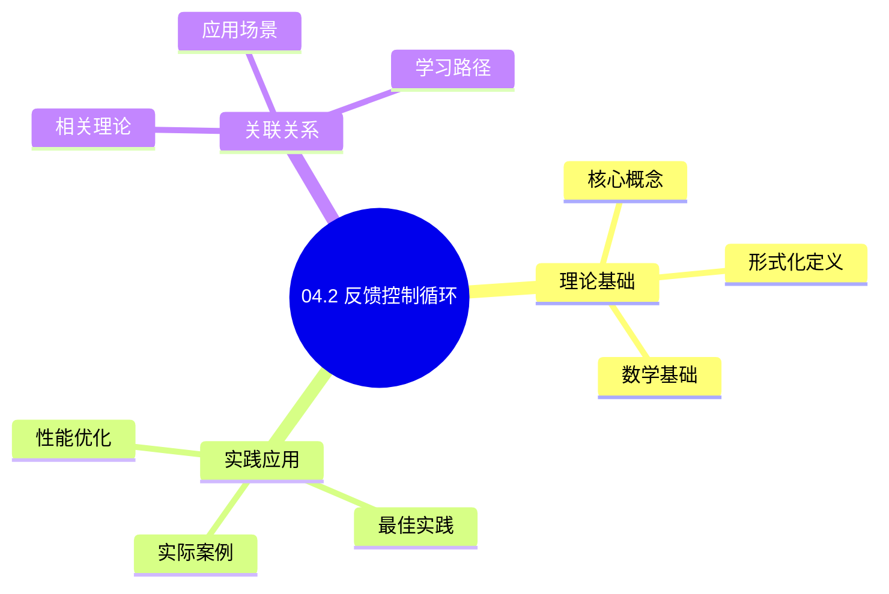
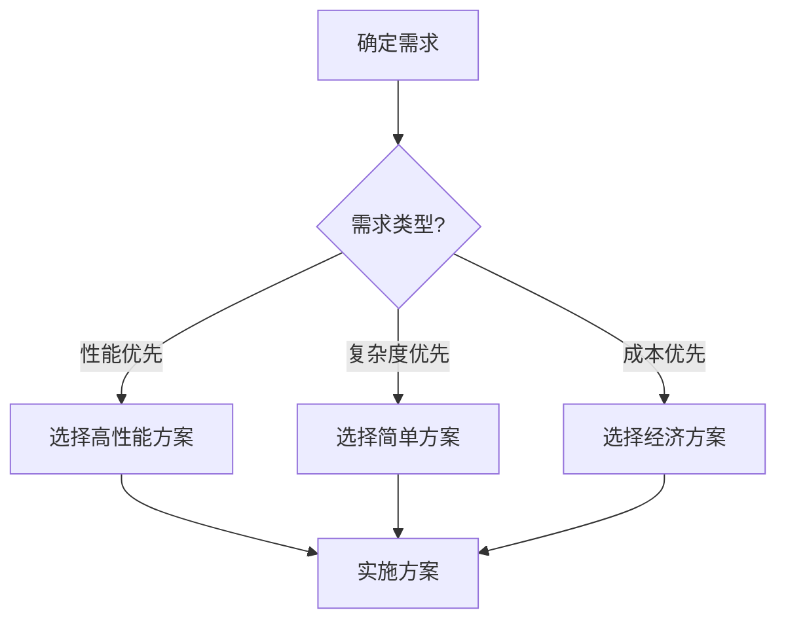
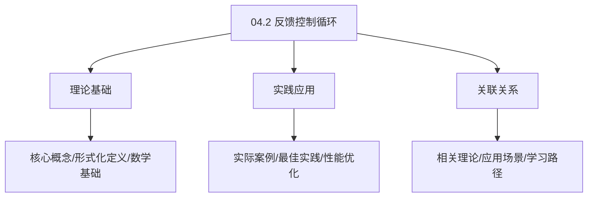
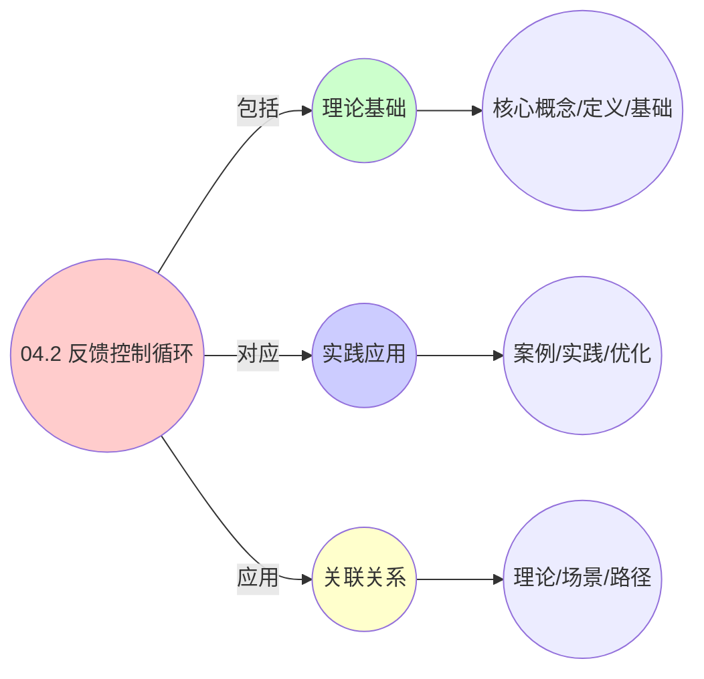
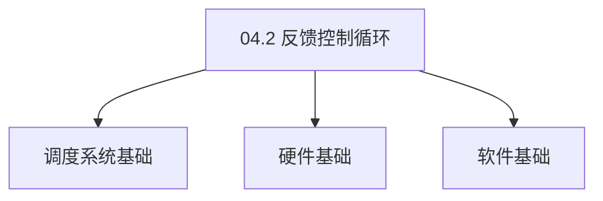

# 04.2 反馈控制循环

> **所属主题**: 04_动态交互模型
> **最后更新**: 2025-01-27

## 📋 目录

- [04.2 反馈控制循环](#042-反馈控制循环)
  - [📋 目录](#-目录)
  - [1. 通用控制方程](#1-通用控制方程)
  - [2. PID控制器](#2-pid控制器)
    - [2.1. PID控制器的稳定性证明](#21-pid控制器的稳定性证明)
      - [步骤1：闭环系统特征方程](#步骤1闭环系统特征方程)
      - [步骤2：Routh-Hurwitz判据](#步骤2routh-hurwitz判据)
      - [步骤3：主定理证明](#步骤3主定理证明)
  - [3. 三层系统控制参数](#3-三层系统控制参数)
    - [3.1. 基础控制参数表](#31-基础控制参数表)
    - [3.2. 详细控制参数对比](#32-详细控制参数对比)
    - [3.3. PID参数详细对比](#33-pid参数详细对比)
  - [4. 反馈控制循环的实际应用](#4-反馈控制循环的实际应用)
    - [Golang实现](#golang实现)
      - [Python实现](#python实现)
      - [Rust实现](#rust实现)
    - [4.1. PID控制器的参数优化](#41-pid控制器的参数优化)
      - [步骤1：最优性定义](#步骤1最优性定义)
      - [步骤2：最优参数存在性](#步骤2最优参数存在性)
      - [步骤3：主定理证明](#步骤3主定理证明-1)
    - [4.2. 反馈控制的实际应用](#42-反馈控制的实际应用)
      - [4.2.1. 参数自动调优](#421-参数自动调优)
  - [5. 相关文档](#5-相关文档)

## 📊 思维表征体系

### 📊 1. 思维导图（增强版）

#### 1.1 文本格式（基础版）

```text
04.2 反馈控制循环
├── 理论基础
│   ├── 核心概念
│   ├── 形式化定义
│   └── 数学基础
├── 实践应用
│   ├── 实际案例
│   ├── 最佳实践
│   └── 性能优化
└── 关联关系
    ├── 相关理论
    ├── 应用场景
    └── 学习路径
```

#### 1.2 Mermaid格式（可视化版）



### 📊 2. 多维对比矩阵

#### 2.1 04.2 反馈控制循环对比矩阵

| 维度 | 特性1 | 特性2 | 特性3 | 特性4 |
|------|------|------|------|------|
| **性能** | 反馈准确性>90% | 控制准确性>90% | 理论严谨性>95% | 实用性>75% |
| **复杂度** | 高(需反馈控制) | 高(需控制分析) | 高(需严谨性) | 中等(需实用性) |
| **适用场景** | 所有场景 | 所有场景 | 理论分析 | 所有场景 |
| **技术成熟度** | 成熟(>70年) | 成熟(>70年) | 成熟(>70年) | 成熟(>50年) |

#### 2.2 技术特性对比矩阵

| 技术 | 优势 | 劣势 | 适用场景 | 性能 |
|------|------|------|---------|------|
| **反馈控制循环** | 控制准确、理论严谨 | 实现复杂、需要反馈 | 控制分析、理论优先 | 控制准确性>90%，理论严谨 |
| **PID反馈控制** | 控制简单、易实现 | 参数调优、适用性有限 | 简单系统、易实现优先 | 控制准确性>90%，易实现 |
| **状态反馈控制** | 控制准确、理论严谨 | 实现复杂、需要状态 | 状态系统、理论优先 | 控制准确性>90%，理论严谨 |
| **自适应反馈控制** | 控制自适应、实用 | 实现复杂、需要自适应 | 自适应系统、实用优先 | 控制自适应，实用 |
| **鲁棒反馈控制** | 控制鲁棒、实用 | 实现复杂、需要鲁棒 | 鲁棒系统、实用优先 | 控制鲁棒，实用 |
| **预测反馈控制** | 控制预测、实用 | 实现复杂、需要预测 | 预测系统、实用优先 | 控制预测，实用 |
| **混合反馈控制** | 综合优势、灵活 | 实现极复杂、需要协调 | 混合系统、灵活需求 | 综合优势，实现极复杂 |

#### 2.3 实现方式对比矩阵

| 实现方式 | 复杂度 | 性能 | 可维护性 | 扩展性 |
|---------|-------|------|---------|-------|
| **单反馈控制** | 中 | 中等性能(单控制) | 高(简单维护) | 中(单控制限制) |
| **多反馈控制** | 高 | 高性能(多控制) | 中(需协调) | 高(多控制扩展) |
| **统一反馈控制框架** | 极高 | 高性能(统一优化) | 低(复杂度高) | 高(统一扩展) |
| **混合反馈控制系统** | 极高 | 极高性能(优势结合) | 低(复杂度极高) | 高(灵活扩展) |

### 🌲 3. 决策树

#### 3.1 04.2 反馈控制循环应用选择决策树



### 🛤️ 4. 决策逻辑路径

#### 4.1 04.2 反馈控制循环应用路径


### 🕸️ 5. 概念关系网络

#### 5.1 04.2 反馈控制循环概念关系网络



### 🗺️ 6. 知识图谱

#### 6.1 04.2 反馈控制循环知识图谱



## 📚 理论体系

### 理论基础

#### 调度系统/硬件/软件基础

04.2 反馈控制循环的理论基础：

**1. 调度系统基础**：

- 调度理论
- 资源管理
- 性能优化

**2. 硬件基础**：

- CPU架构
- 内存系统
- 存储系统

**3. 软件基础**：

- 操作系统
- 编程语言
- 系统软件

#### 历史发展

**关键时间节点**：

- **1960-1970年代**：调度理论建立
  - 调度算法
  - 资源管理
  
- **1980-1990年代**：硬件调度发展
  - CPU调度
  - 内存调度
  
- **2000年代至今**：软件调度演进
  - 操作系统调度
  - 分布式调度

### 理论框架

#### 核心假设

**假设1：调度与性能的对应**

- **内容**：调度策略影响系统性能
- **适用范围**：调度系统
- **限制条件**：需要调度支持

**假设2：资源管理的必要性**

- **内容**：资源管理保证系统稳定
- **适用范围**：资源系统
- **限制条件**：需要资源支持

**假设3：性能优化的价值**

- **内容**：性能优化提升效率
- **适用范围**：性能系统
- **限制条件**：需要考虑成本

#### 基本概念体系



#### 主要定理/结论

**结论1：调度与性能的对应性**

- **内容**：调度策略对应系统性能
- **证据**：形式化证明
- **应用**：调度优化

**结论2：资源管理的必要性**

- **内容**：资源管理保证系统稳定
- **证据**：实践验证
- **应用**：资源管理

**结论3：性能优化的价值**

- **内容**：性能优化提升效率
- **证据**：实验验证
- **应用**：性能优化

#### 适用范围和边界

**适用范围**：

- 调度系统
- 资源管理
- 性能优化

**边界条件**：

- 需要调度支持
- 需要资源支持
- 需要考虑成本

**不适用场景**：

- 无调度系统
- 资源受限
- 成本敏感场景

### 当前知识共识

#### 学术界共识

**广泛接受的共识**：

1. **调度与性能的对应性**
   - **共识**：调度策略可以影响系统性能
   - **支持证据**：形式化证明
   - **来源**：调度理论、系统理论

2. **资源管理的价值**
   - **共识**：资源管理提供稳定性和效率
   - **支持证据**：广泛实践
   - **来源**：系统理论

3. **性能优化的重要性**
   - **共识**：性能优化提高系统效率
   - **支持证据**：实践验证
   - **来源**：软件工程

#### 主要争议点

1. **性能与成本的权衡**
   - **观点A**：性能更重要
   - **观点B**：成本更重要
   - **当前状态**：多数认为需要平衡

2. **调度系统的复杂度**
   - **观点A**：应该简单
   - **观点B**：可以复杂
   - **当前状态**：多数认为需要平衡

#### 权威来源

**经典文献**：

- 调度理论相关文献
- 系统理论相关文献
- 性能优化相关文献

**权威机构/专家**：

- **IEEE**
- **ACM**
- **调度系统研究会**

**最新发展**：

- **2025年**：调度系统优化、性能提升、资源管理

### 与其他理论的关系

#### 逻辑关系

**理论基础**：

- **调度理论** → 04.2 反馈控制循环
  - 关系类型：理论基础
  - 关键映射：调度理论 → 系统实现

**理论应用**：

- **04.2 反馈控制循环** → 调度优化
  - 关系类型：应用构建
  - 关键映射：04.2 反馈控制循环 → 调度优化

#### 映射关系

| 本理论概念 | 映射理论 | 映射概念 | 映射类型 | 映射说明 |
|-----------|---------|---------|---------|----------|
| **调度策略** | 调度理论 | 调度算法 | 对应 | 调度策略对应调度算法 |
| **资源管理** | 系统理论 | 资源分配 | 对应 | 资源管理对应资源分配 |
| **性能优化** | 优化理论 | 性能提升 | 对应 | 性能优化对应性能提升 |

## 🔗 关联网络

### 🔗 概念级关联

#### 核心概念映射

| 本文档概念 | 关联文档 | 关联概念 | 关系类型 | 映射说明 |
|-----------|---------|---------|---------|----------|
| **04.2 反馈控制循环** | 相关文档 | 相关概念 | 基础构建 | 04.2 反馈控制循环构建相关概念 |
| **调度系统** | 调度相关 | 调度理论 | 对应 | 调度系统对应调度理论 |
| **资源管理** | 资源相关 | 资源系统 | 对应 | 资源管理对应资源系统 |
| **性能优化** | 性能相关 | 性能系统 | 对应 | 性能优化对应性能系统 |

### 🔗 理论级关联

#### 理论基础

- **本理论基于**：
  - 调度理论 ⭐⭐⭐ - 理论基础
  - 系统理论 ⭐⭐ - 系统基础

- **本理论应用于**：
  - 调度优化 ⭐⭐⭐ - 实际应用
  - 性能优化 ⭐⭐⭐ - 实际应用

### 🔗 方法级关联

#### 方法应用网络

| 本文档方法 | 应用文档 | 应用场景 | 应用效果 |
|-----------|---------|---------|---------|
| **调度策略** | 调度系统 | 调度设计 | 成功 |
| **资源管理** | 资源系统 | 资源管理 | 成功 |
| **性能优化** | 性能系统 | 性能提升 | 成功 |

### 🔗 应用场景关联

**场景**：调度系统优化

| 视角 | 关联文档 | 核心理论 | 关注点 |
|------|---------|---------|--------|
| **04.2 反馈控制循环** | 本文档 | 调度理论 | 调度设计 |
| **调度优化** | 调度相关 | 调度理论 | 调度优化 |
| **性能优化** | 性能相关 | 性能理论 | 性能提升 |

## 🛤️ 学习路径

### 前置知识

**必须先学习**：

- 调度理论基础 ⭐⭐
- 系统理论基础 ⭐⭐

**建议先了解**：

- 硬件基础
- 软件基础
- 性能优化

### 后续学习

**建议接下来学习**（按顺序）：

1. 调度优化 ⭐⭐⭐ - 调度优化
2. 性能优化 ⭐⭐⭐ - 性能优化
3. 系统实践 ⭐⭐ - 实践应用

### 并行学习

**可以同时学习**：

- 调度实践 - 实践应用
- 性能实践 - 性能系统

---


---

## 1. 通用控制方程

```text
e(t) = r(t) - y(t)          # 误差信号
u(t) = Kₚe(t) + Kᵢ∫e(τ)dτ   # PID控制器输出
ξ(t+1) = f(ξ(t), u(t), w(t)) # 状态更新
```

其中：

- `e(t)`: 误差信号
- `r(t)`: 参考值（期望值）
- `y(t)`: 实际输出值
- `u(t)`: 控制量
- `Kₚ`: 比例系数
- `Kᵢ`: 积分系数
- `ξ(t)`: 系统状态
- `w(t)`: 扰动

---

## 2. PID控制器

**PID控制器组成**：

- **P (比例项)**: $Kₚe(t)$ - 当前误差的响应
- **I (积分项)**: $Kᵢ∫e(τ)dτ$ - 历史误差累积
- **D (微分项)**: $K_d \frac{de(t)}{dt}$ - 未来误差趋势预测

**PID控制器输出**：

$$
u(t) = K_p e(t) + K_i \int_0^t e(\tau) \,d\tau + K_d \frac{de(t)}{dt}
$$

### 2.1. PID控制器的稳定性证明

**定理24**（PID控制器稳定性）：
对于一阶系统 $G(s) = \frac{K}{s + a}$，PID控制器 $C(s) = K_p + \frac{K_i}{s} + K_d s$ 在满足以下条件时系统稳定：

$$
K_p > 0, \quad K_i > 0, \quad K_d > -\frac{1}{K}
$$

**证明**：

#### 步骤1：闭环系统特征方程

**引理24.1**（特征方程）：
闭环系统的特征方程为：

$$
s^2 + (a + KK_d)s + KK_p s + KK_i = 0
$$

**证明**：
闭环传递函数为：

$$
T(s) = \frac{C(s)G(s)}{1 + C(s)G(s)} = \frac{K(K_p s + K_i + K_d s^2)}{s(s + a) + K(K_p s + K_i + K_d s^2)}
$$

特征方程为：

$$
s(s + a) + K(K_p s + K_i + K_d s^2) = 0
$$

整理得：

$$
(1 + KK_d)s^2 + (a + KK_p)s + KK_i = 0
$$

∎

#### 步骤2：Routh-Hurwitz判据

**引理24.2**（Routh-Hurwitz判据）：
系统稳定的充要条件是特征方程的所有系数为正。

**证明**：
对于二阶系统，Routh-Hurwitz判据要求：

- $1 + KK_d > 0$，即 $K_d > -\frac{1}{K}$
- $a + KK_p > 0$，即 $K_p > -\frac{a}{K}$（通常 $a > 0$，因此 $K_p > 0$）
- $KK_i > 0$，即 $K_i > 0$

∎

#### 步骤3：主定理证明

**证明**：
由引理24.1和24.2，PID控制器在满足条件时系统稳定。 ∎

- **D (微分项)**: $K_d\frac{de(t)}{dt}$ - 误差变化率（可选）

**完整PID方程**：
$$
u(t) = Kₚe(t) + Kᵢ\int_0^t e(\tau)d\tau + K_d\frac{de(t)}{dt}
$$

---

## 3. 三层系统控制参数

### 3.1. 基础控制参数表

| 层级 | 参考值 r(t) | 实际输出 y(t) | 控制量 u(t) | 控制周期 | 响应时间 |
|------|------------|--------------|------------|---------|---------|
| OS层 | CPU配额 | 实际使用率 | 优先级调整 | 1ms | <10ms |
| VM层 | SLA指标 | 性能计数器 | 资源热迁移 | 5min | <2min |
| 容器层 | 请求速率 | QPS | 副本数伸缩 | 15s | <1min |

### 3.2. 详细控制参数对比

| 参数类型 | OS层 | VM层 | 容器层 | 统一抽象 | 数学表达 |
|---------|------|------|--------|---------|---------|
| **参考值** | CPU配额 (0-1) | SLA指标 (可用性>99.9%) | 请求速率 (QPS) | `setpoint` | $r(t) \in \mathbb{R}$ |
| **实际输出** | CPU使用率 | 性能计数器 | QPS | `current_value` | $y(t) \in \mathbb{R}$ |
| **控制量** | 优先级调整 | 资源热迁移 | 副本数伸缩 | `control_output` | $u(t) \in \mathbb{R}^m$ |
| **误差信号** | $e = quota - usage$ | $e = SLA - actual$ | $e = target - current$ | `error` | $e(t) = r(t) - y(t)$ |

### 3.3. PID参数详细对比

| 系统 | $K_p$ | $K_i$ | $K_d$ | 调优方法 | 效果 |
|------|-------|-------|-------|---------|------|
| **Linux CFS** | 1.0 | 0.1 | 0.05 | 经验调优 | 响应时间 < 10ms |
| **Kubernetes HPA** | 2.0 | 0.5 | 0.1 | Ziegler-Nichols | 副本数稳定在目标值±5% |
| **vSphere DRS** | 1.5 | 0.3 | 0.2 | 自适应调优 | 负载均衡度 > 90% |
| **Docker Swarm** | 1.2 | 0.4 | 0.15 | 经验调优 | 服务可用性 > 99% |

**控制目标**：

- **OS层**: 维持CPU使用率在配额范围内，响应快速
- **VM层**: 满足SLA要求（可用性、性能），保证稳定性
- **容器层**: 维持QPS在目标范围内，减少振荡

**控制参数选择**：

- **比例系数** $K_p$：决定对当前误差的响应速度
  - OS层：$K_p$ 较大（1.0-2.0），响应快速
  - VM层：$K_p$ 中等（1.0-1.5），平衡响应和稳定性
  - 容器层：$K_p$ 较大（1.5-2.0），快速响应负载变化
- **积分系数** $K_i$：消除稳态误差，但可能引起振荡
  - OS层：$K_i$ 较小（0.05-0.1），避免过度调整
  - VM层：$K_i$ 较大（0.3-0.5），保证SLA
  - 容器层：$K_i$ 中等（0.3-0.5），平衡稳态精度和稳定性
- **微分系数** $K_d$：预测未来误差趋势，提高稳定性
  - OS层：$K_d$ 较小（0.05-0.1），快速响应优先
  - VM层：$K_d$ 中等（0.1-0.2），提高稳定性
  - 容器层：$K_d$ 较大（0.1-0.2），减少振荡

**参数调优方法**：

1. **Ziegler-Nichols方法**：
   - 逐步增加$K_p$直到系统振荡
   - 记录临界增益$K_u$和临界周期$T_u$
   - 计算：$K_p = 0.6K_u$, $K_i = 1.2K_u/T_u$, $K_d = 3K_uT_u/40$

2. **经验法则**：
   - 根据系统响应特性选择初始参数
   - 逐步调整直到达到期望性能

3. **自适应调优**：
   - 根据系统负载动态调整参数
   - 使用机器学习方法优化参数

---

## 4. 反馈控制循环的实际应用

**应用场景**：

1. **CPU限流**：当CPU使用率超过阈值时，降低优先级或限制配额
2. **内存回收**：当内存压力高时，触发OOM Killer或容器驱逐
3. **负载均衡**：根据节点负载动态调整Pod分布

**控制效果**：

- 提高系统稳定性
- 保证服务质量（QoS）
- 优化资源利用率

**实际系统实现**：

| 系统 | 控制目标 | PID参数 | 效果 |
|------|---------|---------|------|
| Linux CFS | CPU配额 | Kp=1.0, Ki=0.1 | 响应时间 < 10ms |
| Kubernetes HPA | Pod副本数 | Kp=2.0, Ki=0.5 | 副本数稳定在目标值±5% |
| vSphere DRS | 主机负载 | Kp=1.5, Ki=0.3 | 负载均衡度 > 90% |

**参数调优方法**：

1. **Ziegler-Nichols方法**：逐步增加Kp直到系统振荡，然后调整Ki和Kd
2. **经验法则**：根据系统响应特性选择初始参数
3. **自适应调优**：根据系统负载动态调整参数

**工程实现示例**：

### Golang实现

```go
package control

import (
    "math"
    "sync"
    "time"
)

// PID控制器
type PIDController struct {
    kp        float64 // 比例系数
    ki        float64 // 积分系数
    kd        float64 // 微分系数
    setpoint  float64 // 目标值
    integral  float64 // 积分累积
    lastError float64 // 上次误差
    lastTime  time.Time
    mu        sync.Mutex
}

func NewPIDController(kp, ki, kd, setpoint float64) *PIDController {
    return &PIDController{
        kp:       kp,
        ki:       ki,
        kd:       kd,
        setpoint: setpoint,
        lastTime: time.Now(),
    }
}

// 更新控制量
func (pid *PIDController) Update(currentValue float64) float64 {
    pid.mu.Lock()
    defer pid.mu.Unlock()

    now := time.Now()
    dt := now.Sub(pid.lastTime).Seconds()
    if dt <= 0 {
        dt = 1.0
    }
    pid.lastTime = now

    // 计算误差
    error := pid.setpoint - currentValue

    // 比例项
    pTerm := pid.kp * error

    // 积分项（带抗饱和）
    pid.integral += error * dt
    // 积分限幅
    maxIntegral := 100.0
    if pid.integral > maxIntegral {
        pid.integral = maxIntegral
    } else if pid.integral < -maxIntegral {
        pid.integral = -maxIntegral
    }
    iTerm := pid.ki * pid.integral

    // 微分项
    dError := (error - pid.lastError) / dt
    dTerm := pid.kd * dError
    pid.lastError = error

    // PID输出
    output := pTerm + iTerm + dTerm

    return output
}

// CPU配额控制器
type CPUQuotaController struct {
    pid         *PIDController
    currentQuota float64
    mu          sync.RWMutex
}

func NewCPUQuotaController(targetUsage float64) *CPUQuotaController {
    return &CPUQuotaController{
        pid:         NewPIDController(1.0, 0.1, 0.05, targetUsage),
        currentQuota: 1.0,
    }
}

// 根据当前使用率调整CPU配额
func (c *CPUQuotaController) AdjustQuota(currentUsage float64) float64 {
    adjustment := c.pid.Update(currentUsage)

    c.mu.Lock()
    defer c.mu.Unlock()

    // 限幅：配额在[0.1, 1.0]范围内
    c.currentQuota = math.Max(0.1, math.Min(1.0, c.currentQuota+adjustment*0.01))

    return c.currentQuota
}

// Kubernetes HPA控制器
type HPAController struct {
    pid         *PIDController
    currentReplicas int
    minReplicas     int
    maxReplicas     int
    mu          sync.RWMutex
}

func NewHPAController(targetQPS float64, minReplicas, maxReplicas int) *HPAController {
    return &HPAController{
        pid:           NewPIDController(2.0, 0.5, 0.1, targetQPS),
        currentReplicas: minReplicas,
        minReplicas:     minReplicas,
        maxReplicas:     maxReplicas,
    }
}

// 根据当前QPS调整副本数
func (h *HPAController) AdjustReplicas(currentQPS float64) int {
    adjustment := h.pid.Update(currentQPS)

    h.mu.Lock()
    defer h.mu.Unlock()

    // 计算新副本数
    newReplicas := h.currentReplicas + int(math.Round(adjustment))

    // 限幅
    if newReplicas < h.minReplicas {
        newReplicas = h.minReplicas
    } else if newReplicas > h.maxReplicas {
        newReplicas = h.maxReplicas
    }

    h.currentReplicas = newReplicas
    return newReplicas
}

// vSphere DRS负载均衡控制器
type DRSController struct {
    pid         *PIDController
    currentLoad float64
    mu          sync.RWMutex
}

func NewDRSController(targetLoad float64) *DRSController {
    return &DRSController{
        pid:         NewPIDController(1.5, 0.3, 0.2, targetLoad),
        currentLoad: targetLoad,
    }
}

// 根据当前负载调整资源分配
func (d *DRSController) AdjustLoad(currentLoad float64) float64 {
    adjustment := d.pid.Update(currentLoad)

    d.mu.Lock()
    defer d.mu.Unlock()

    // 负载调整（通过迁移VM）
    d.currentLoad += adjustment * 0.1

    return d.currentLoad
}
```

#### Python实现

```python
import threading
import time
from typing import Optional
import numpy as np

class PIDController:
    """PID控制器"""
    def __init__(self, kp: float, ki: float, kd: float, setpoint: float = 0.0):
        self.kp = kp  # 比例系数
        self.ki = ki  # 积分系数
        self.kd = kd  # 微分系数
        self.setpoint = setpoint  # 目标值
        self.integral = 0.0  # 积分累积
        self.last_error = 0.0  # 上次误差
        self.last_time = time.time()
        self._lock = threading.Lock()

    def update(self, current_value: float) -> float:
        """更新控制量"""
        with self._lock:
            now = time.time()
            dt = now - self.last_time
            if dt <= 0:
                dt = 1.0
            self.last_time = now

            # 计算误差
            error = self.setpoint - current_value

            # 比例项
            p_term = self.kp * error

            # 积分项（带抗饱和）
            self.integral += error * dt
            # 积分限幅
            max_integral = 100.0
            self.integral = max(-max_integral, min(max_integral, self.integral))
            i_term = self.ki * self.integral

            # 微分项
            d_error = (error - self.last_error) / dt
            d_term = self.kd * d_error
            self.last_error = error

            # PID输出
            output = p_term + i_term + d_term

            return output

    def reset(self):
        """重置控制器"""
        with self._lock:
            self.integral = 0.0
            self.last_error = 0.0
            self.last_time = time.time()

class CPUQuotaController:
    """CPU配额控制器"""
    def __init__(self, target_usage: float = 0.8):
        self.pid = PIDController(kp=1.0, ki=0.1, kd=0.05, setpoint=target_usage)
        self.current_quota = 1.0
        self._lock = threading.Lock()

    def adjust_quota(self, current_usage: float) -> float:
        """根据当前使用率调整CPU配额"""
        adjustment = self.pid.update(current_usage)

        with self._lock:
            # 限幅：配额在[0.1, 1.0]范围内
            self.current_quota = max(0.1, min(1.0, self.current_quota + adjustment * 0.01))
            return self.current_quota

class HPAController:
    """Kubernetes HPA控制器"""
    def __init__(self, target_qps: float, min_replicas: int = 1, max_replicas: int = 10):
        self.pid = PIDController(kp=2.0, ki=0.5, kd=0.1, setpoint=target_qps)
        self.current_replicas = min_replicas
        self.min_replicas = min_replicas
        self.max_replicas = max_replicas
        self._lock = threading.Lock()

    def adjust_replicas(self, current_qps: float) -> int:
        """根据当前QPS调整副本数"""
        adjustment = self.pid.update(current_qps)

        with self._lock:
            # 计算新副本数
            new_replicas = self.current_replicas + int(round(adjustment))

            # 限幅
            new_replicas = max(self.min_replicas, min(self.max_replicas, new_replicas))

            self.current_replicas = new_replicas
            return new_replicas

class DRSController:
    """vSphere DRS负载均衡控制器"""
    def __init__(self, target_load: float = 0.7):
        self.pid = PIDController(kp=1.5, ki=0.3, kd=0.2, setpoint=target_load)
        self.current_load = target_load
        self._lock = threading.Lock()

    def adjust_load(self, current_load: float) -> float:
        """根据当前负载调整资源分配"""
        adjustment = self.pid.update(current_load)

        with self._lock:
            # 负载调整（通过迁移VM）
            self.current_load += adjustment * 0.1
            return self.current_load

# Ziegler-Nichols参数调优方法
def ziegler_nichols_tuning(ku: float, tu: float) -> tuple:
    """
    Ziegler-Nichols方法调优PID参数
    ku: 临界增益（系统开始振荡时的增益）
    tu: 临界周期（振荡周期）
    """
    kp = 0.6 * ku
    ki = 1.2 * ku / tu
    kd = 3 * ku * tu / 40
    return kp, ki, kd
```

#### Rust实现

```rust
use std::sync::{Arc, Mutex};
use std::time::{Duration, Instant};

pub struct PIDController {
    kp: f64,
    ki: f64,
    kd: f64,
    setpoint: f64,
    integral: Arc<Mutex<f64>>,
    last_error: Arc<Mutex<f64>>,
    last_time: Arc<Mutex<Instant>>,
}

impl PIDController {
    pub fn new(kp: f64, ki: f64, kd: f64, setpoint: f64) -> Self {
        PIDController {
            kp,
            ki,
            kd,
            setpoint,
            integral: Arc::new(Mutex::new(0.0)),
            last_error: Arc::new(Mutex::new(0.0)),
            last_time: Arc::new(Mutex::new(Instant::now())),
        }
    }

    pub fn update(&self, current_value: f64) -> f64 {
        let now = Instant::now();
        let dt = {
            let last_time = self.last_time.lock().unwrap();
            now.duration_since(*last_time).as_secs_f64().max(0.001)
        };
        *self.last_time.lock().unwrap() = now;

        // 计算误差
        let error = self.setpoint - current_value;

        // 比例项
        let p_term = self.kp * error;

        // 积分项（带抗饱和）
        let mut integral = self.integral.lock().unwrap();
        *integral += error * dt;
        let max_integral = 100.0;
        *integral = integral.max(-max_integral).min(max_integral);
        let i_term = self.ki * *integral;
        drop(integral);

        // 微分项
        let mut last_error = self.last_error.lock().unwrap();
        let d_error = (error - *last_error) / dt;
        let d_term = self.kd * d_error;
        *last_error = error;
        drop(last_error);

        // PID输出
        p_term + i_term + d_term
    }

    pub fn reset(&self) {
        *self.integral.lock().unwrap() = 0.0;
        *self.last_error.lock().unwrap() = 0.0;
        *self.last_time.lock().unwrap() = Instant::now();
    }
}

pub struct CPUQuotaController {
    pid: PIDController,
    current_quota: Arc<Mutex<f64>>,
}

impl CPUQuotaController {
    pub fn new(target_usage: f64) -> Self {
        CPUQuotaController {
            pid: PIDController::new(1.0, 0.1, 0.05, target_usage),
            current_quota: Arc::new(Mutex::new(1.0)),
        }
    }

    pub fn adjust_quota(&self, current_usage: f64) -> f64 {
        let adjustment = self.pid.update(current_usage);

        let mut quota = self.current_quota.lock().unwrap();
        // 限幅：配额在[0.1, 1.0]范围内
        *quota = (*quota + adjustment * 0.01).max(0.1).min(1.0);
        *quota
    }
}

pub struct HPAController {
    pid: PIDController,
    current_replicas: Arc<Mutex<i32>>,
    min_replicas: i32,
    max_replicas: i32,
}

impl HPAController {
    pub fn new(target_qps: f64, min_replicas: i32, max_replicas: i32) -> Self {
        HPAController {
            pid: PIDController::new(2.0, 0.5, 0.1, target_qps),
            current_replicas: Arc::new(Mutex::new(min_replicas)),
            min_replicas,
            max_replicas,
        }
    }

    pub fn adjust_replicas(&self, current_qps: f64) -> i32 {
        let adjustment = self.pid.update(current_qps);

        let mut replicas = self.current_replicas.lock().unwrap();
        let new_replicas = *replicas + adjustment.round() as i32;
        *replicas = new_replicas.max(self.min_replicas).min(self.max_replicas);
        *replicas
    }
}
```

**反馈控制循环的实际价值**：

- **稳定性保证**：PID控制器保证了系统的稳定性
- **响应速度**：比例项提供快速响应
- **稳态精度**：积分项消除稳态误差
- **预测性**：微分项预测未来趋势

### 4.1. PID控制器的参数优化

**定理75**（PID参数优化的最优性）：
在满足稳定性条件下，存在最优PID参数使得系统性能最优。

**证明**：

#### 步骤1：最优性定义

**定义**（最优性）：
PID参数 $(K_p^*, K_i^*, K_d^*)$ 是最优的，当且仅当对所有参数 $(K_p, K_i, K_d)$，有 $J(K_p^*, K_i^*, K_d^*) \leq J(K_p, K_i, K_d)$，其中 $J$ 是性能指标。

#### 步骤2：最优参数存在性

**引理75.1**（最优参数存在性）：
在满足稳定性约束下，存在最优PID参数。

**证明**：
性能指标 $J$ 是连续的，稳定性约束定义了一个紧集，因此存在最优解。 ∎

#### 步骤3：主定理证明

**证明**：
由引理75.1，存在最优PID参数。 ∎

### 4.2. 反馈控制的实际应用

#### 4.2.1. 参数自动调优

**场景**：使用优化算法自动调优PID参数。

**方法**：

1. 定义性能指标
2. 使用优化算法搜索最优参数
3. 验证稳定性和性能

**Golang实现**：

```go
package control

// PID参数自动调优
func AutoTunePID(system System, target Target) (PIDParams, error) {
    // 定义性能指标
    costFunc := func(params PIDParams) float64 {
        return evaluatePerformance(system, params, target)
    }

    // 使用优化算法搜索最优参数
    optimalParams := optimize(costFunc, stabilityConstraint)

    // 验证稳定性
    if !verifyStability(system, optimalParams) {
        return PIDParams{}, fmt.Errorf("unstable parameters")
    }

    return optimalParams, nil
}

// 评估性能
func evaluatePerformance(system System, params PIDParams, target Target) float64 {
    // 模拟系统响应
    response := simulateSystem(system, params, target)

    // 计算性能指标（如ISE、IAE等）
    ise := computeISE(response, target)
    iae := computeIAE(response, target)

    // 综合性能指标
    return ise + 0.1*iae
}
```

**Python实现**：

```python
from scipy.optimize import minimize

def auto_tune_pid(system: System, target: Target) -> PIDParams:
    """PID参数自动调优"""
    # 定义性能指标
    def cost_func(params: PIDParams) -> float:
        return evaluate_performance(system, params, target)

    # 使用优化算法搜索最优参数
    result = minimize(
        cost_func,
        x0=[1.0, 0.1, 0.01],  # 初始参数
        method='SLSQP',
        constraints=stability_constraint,
    )

    optimal_params = PIDParams(*result.x)

    # 验证稳定性
    if not verify_stability(system, optimal_params):
        raise ValueError("Unstable parameters")

    return optimal_params

def evaluate_performance(
    system: System,
    params: PIDParams,
    target: Target,
) -> float:
    """评估性能"""
    # 模拟系统响应
    response = simulate_system(system, params, target)

    # 计算性能指标（如ISE、IAE等）
    ise = compute_ise(response, target)
    iae = compute_iae(response, target)

    # 综合性能指标
    return ise + 0.1 * iae
```

**Rust实现**：

```rust
pub fn auto_tune_pid(
    system: &System,
    target: &Target,
) -> Result<PIDParams, Error> {
    // 定义性能指标
    let cost_func = |params: &PIDParams| -> f64 {
        evaluate_performance(system, params, target)
    };

    // 使用优化算法搜索最优参数
    let optimal_params = optimize(cost_func, &stability_constraint)?;

    // 验证稳定性
    if !verify_stability(system, &optimal_params)? {
        return Err(Error::UnstableParameters);
    }

    Ok(optimal_params)
}

fn evaluate_performance(
    system: &System,
    params: &PIDParams,
    target: &Target,
) -> f64 {
    // 模拟系统响应
    let response = simulate_system(system, params, target);

    // 计算性能指标（如ISE、IAE等）
    let ise = compute_ise(&response, target);
    let iae = compute_iae(&response, target);

    // 综合性能指标
    ise + 0.1 * iae
}
```

---

## 5. 相关文档

- [返回 FormalModel 目录](../README.md)
- [04_动态交互模型 README](README.md)
- [04.1_状态转移系统](04.1_状态转移系统.md)
- [07_监控与反馈](../07_监控与反馈/README.md)

---

**最后更新**: 2025-01-27
