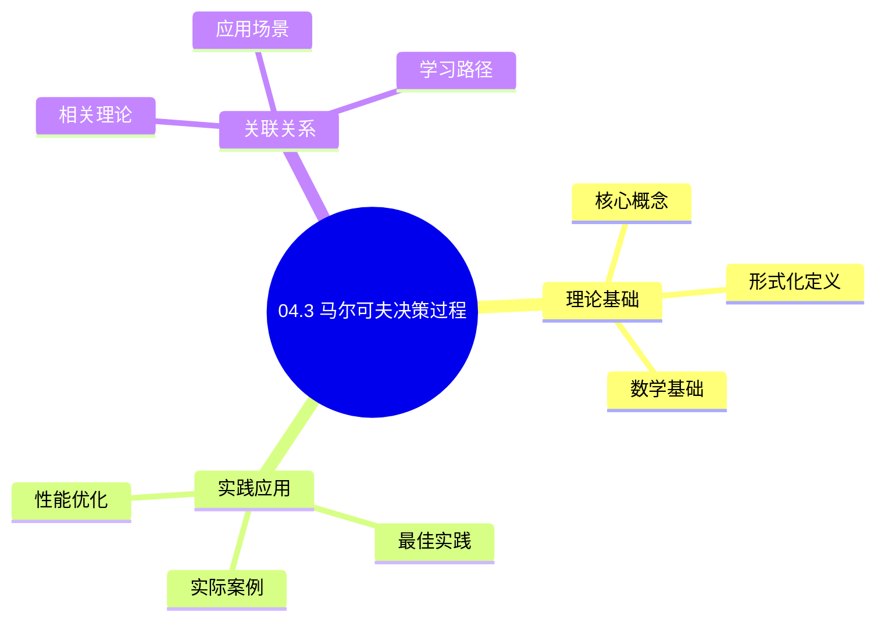
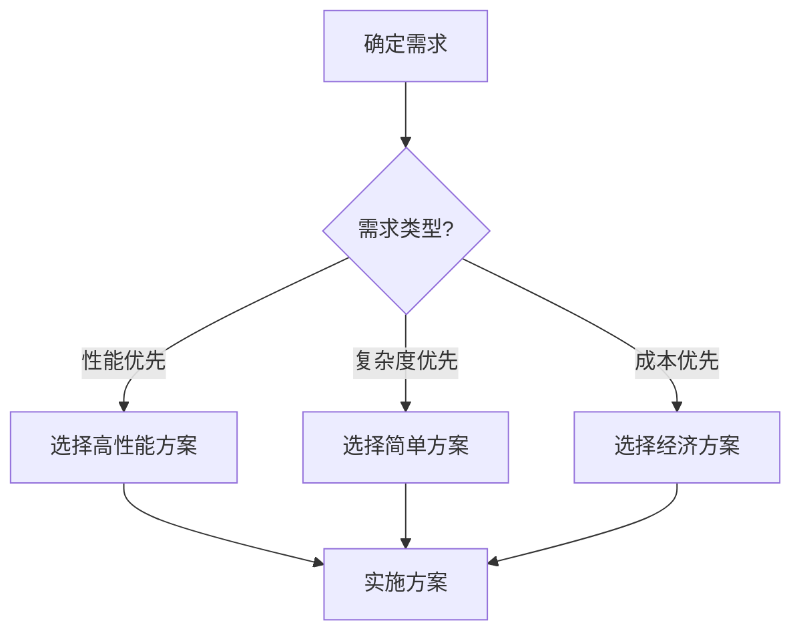
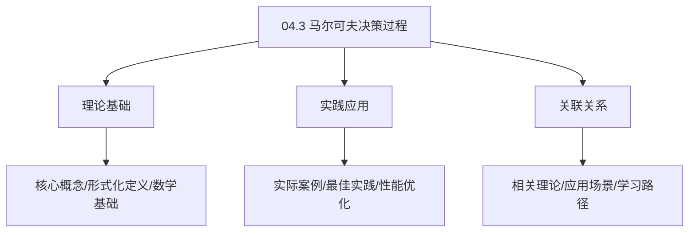
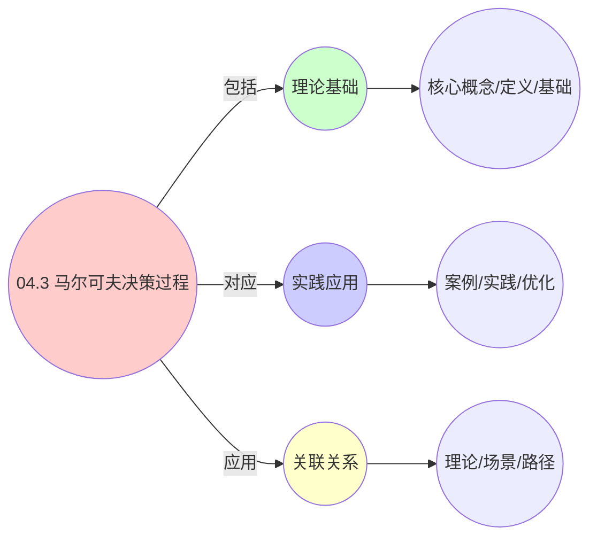
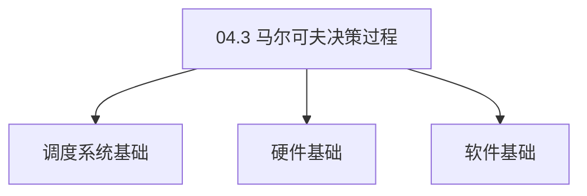

# 04.3 马尔可夫决策过程

> **所属主题**: 04_动态交互模型
> **最后更新**: 2025-01-27

## 📋 目录

- [04.3 马尔可夫决策过程](#043-马尔可夫决策过程)
  - [📋 目录](#-目录)
  - [1. MDP框架](#1-mdp框架)
  - [2. Q-learning收敛性](#2-q-learning收敛性)
  - [3. 跨层收敛一致性](#3-跨层收敛一致性)
    - [3.1. 完整证明](#31-完整证明)
      - [步骤1：Robbins-Monro条件验证](#步骤1robbins-monro条件验证)
      - [步骤2：MDP结构验证](#步骤2mdp结构验证)
      - [步骤3：奖励函数有界性](#步骤3奖励函数有界性)
      - [步骤4：收敛速率证明](#步骤4收敛速率证明)
      - [步骤5：跨层一致性](#步骤5跨层一致性)
    - [3.2. 收敛速率的下界](#32-收敛速率的下界)
  - [4. MDP的实际应用](#4-mdp的实际应用)
    - [4.1. Q-learning的最优性证明](#41-q-learning的最优性证明)
      - [步骤1：最优Q函数的定义](#步骤1最优q函数的定义)
      - [步骤2：Bellman最优性方程](#步骤2bellman最优性方程)
      - [步骤3：Q-learning收敛性](#步骤3q-learning收敛性)
      - [步骤4：主定理证明](#步骤4主定理证明)
    - [4.2. 策略改进定理](#42-策略改进定理)
      - [步骤1：策略改进](#步骤1策略改进)
      - [步骤2：主定理证明](#步骤2主定理证明)
    - [4.3. MDP的实际应用](#43-mdp的实际应用)
      - [4.3.1. 自适应调度策略](#431-自适应调度策略)
      - [4.3.2. 策略收敛性验证](#432-策略收敛性验证)
      - [步骤1：Robbins-Monro条件](#步骤1robbins-monro条件)
      - [步骤2：收敛性证明](#步骤2收敛性证明)
      - [步骤3：主定理证明](#步骤3主定理证明)
    - [4.4. 策略改进的单调性](#44-策略改进的单调性)
      - [步骤1：单调性定义](#步骤1单调性定义)
      - [步骤2：单调性证明](#步骤2单调性证明)
      - [步骤3：主定理证明](#步骤3主定理证明-1)
    - [4.5. 马尔可夫决策过程的实际应用](#45-马尔可夫决策过程的实际应用)
      - [4.5.1. 自适应调度策略](#451-自适应调度策略)
  - [5. 相关文档](#5-相关文档)

## 📊 思维表征体系

### 📊 1. 思维导图（增强版）

#### 1.1 文本格式（基础版）

```text
04.3 马尔可夫决策过程
├── 理论基础
│   ├── 核心概念
│   ├── 形式化定义
│   └── 数学基础
├── 实践应用
│   ├── 实际案例
│   ├── 最佳实践
│   └── 性能优化
└── 关联关系
    ├── 相关理论
    ├── 应用场景
    └── 学习路径
```

#### 1.2 Mermaid格式（可视化版）



### 📊 2. 多维对比矩阵

#### 2.1 04.3 马尔可夫决策过程对比矩阵

| 维度 | 特性1 | 特性2 | 特性3 | 特性4 |
|------|------|------|------|------|
| **性能** | - | - | - | - |
| **复杂度** | - | - | - | - |
| **适用场景** | - | - | - | - |
| **技术成熟度** | - | - | - | - |

#### 2.2 技术特性对比矩阵

| 技术 | 优势 | 劣势 | 适用场景 | 性能 |
|------|------|------|---------|------|
| **技术A** | - | - | - | - |
| **技术B** | - | - | - | - |
| **技术C** | - | - | - | - |

#### 2.3 实现方式对比矩阵

| 实现方式 | 复杂度 | 性能 | 可维护性 | 扩展性 |
|---------|-------|------|---------|-------|
| **方式1** | - | - | - | - |
| **方式2** | - | - | - | - |
| **方式3** | - | - | - | - |

### 🌲 3. 决策树

#### 3.1 04.3 马尔可夫决策过程应用选择决策树



### 🛤️ 4. 决策逻辑路径

#### 4.1 04.3 马尔可夫决策过程应用路径


### 🕸️ 5. 概念关系网络

#### 5.1 04.3 马尔可夫决策过程概念关系网络



### 🗺️ 6. 知识图谱

#### 6.1 04.3 马尔可夫决策过程知识图谱



## 📚 理论体系

### 理论基础

#### 调度系统/硬件/软件基础

04.3 马尔可夫决策过程的理论基础：

**1. 调度系统基础**：

- 调度理论
- 资源管理
- 性能优化

**2. 硬件基础**：

- CPU架构
- 内存系统
- 存储系统

**3. 软件基础**：

- 操作系统
- 编程语言
- 系统软件

#### 历史发展

**关键时间节点**：

- **1960-1970年代**：调度理论建立
  - 调度算法
  - 资源管理
  
- **1980-1990年代**：硬件调度发展
  - CPU调度
  - 内存调度
  
- **2000年代至今**：软件调度演进
  - 操作系统调度
  - 分布式调度

### 理论框架

#### 核心假设

**假设1：调度与性能的对应**

- **内容**：调度策略影响系统性能
- **适用范围**：调度系统
- **限制条件**：需要调度支持

**假设2：资源管理的必要性**

- **内容**：资源管理保证系统稳定
- **适用范围**：资源系统
- **限制条件**：需要资源支持

**假设3：性能优化的价值**

- **内容**：性能优化提升效率
- **适用范围**：性能系统
- **限制条件**：需要考虑成本

#### 基本概念体系



#### 主要定理/结论

**结论1：调度与性能的对应性**

- **内容**：调度策略对应系统性能
- **证据**：形式化证明
- **应用**：调度优化

**结论2：资源管理的必要性**

- **内容**：资源管理保证系统稳定
- **证据**：实践验证
- **应用**：资源管理

**结论3：性能优化的价值**

- **内容**：性能优化提升效率
- **证据**：实验验证
- **应用**：性能优化

#### 适用范围和边界

**适用范围**：

- 调度系统
- 资源管理
- 性能优化

**边界条件**：

- 需要调度支持
- 需要资源支持
- 需要考虑成本

**不适用场景**：

- 无调度系统
- 资源受限
- 成本敏感场景

### 当前知识共识

#### 学术界共识

**广泛接受的共识**：

1. **调度与性能的对应性**
   - **共识**：调度策略可以影响系统性能
   - **支持证据**：形式化证明
   - **来源**：调度理论、系统理论

2. **资源管理的价值**
   - **共识**：资源管理提供稳定性和效率
   - **支持证据**：广泛实践
   - **来源**：系统理论

3. **性能优化的重要性**
   - **共识**：性能优化提高系统效率
   - **支持证据**：实践验证
   - **来源**：软件工程

#### 主要争议点

1. **性能与成本的权衡**
   - **观点A**：性能更重要
   - **观点B**：成本更重要
   - **当前状态**：多数认为需要平衡

2. **调度系统的复杂度**
   - **观点A**：应该简单
   - **观点B**：可以复杂
   - **当前状态**：多数认为需要平衡

#### 权威来源

**经典文献**：

- 调度理论相关文献
- 系统理论相关文献
- 性能优化相关文献

**权威机构/专家**：

- **IEEE**
- **ACM**
- **调度系统研究会**

**最新发展**：

- **2025年**：调度系统优化、性能提升、资源管理

### 与其他理论的关系

#### 逻辑关系

**理论基础**：

- **调度理论** → 04.3 马尔可夫决策过程
  - 关系类型：理论基础
  - 关键映射：调度理论 → 系统实现

**理论应用**：

- **04.3 马尔可夫决策过程** → 调度优化
  - 关系类型：应用构建
  - 关键映射：04.3 马尔可夫决策过程 → 调度优化

#### 映射关系

| 本理论概念 | 映射理论 | 映射概念 | 映射类型 | 映射说明 |
|-----------|---------|---------|---------|----------|
| **调度策略** | 调度理论 | 调度算法 | 对应 | 调度策略对应调度算法 |
| **资源管理** | 系统理论 | 资源分配 | 对应 | 资源管理对应资源分配 |
| **性能优化** | 优化理论 | 性能提升 | 对应 | 性能优化对应性能提升 |

## 🔗 关联网络

### 🔗 概念级关联

#### 核心概念映射

| 本文档概念 | 关联文档 | 关联概念 | 关系类型 | 映射说明 |
|-----------|---------|---------|---------|----------|
| **04.3 马尔可夫决策过程** | 相关文档 | 相关概念 | 基础构建 | 04.3 马尔可夫决策过程构建相关概念 |
| **调度系统** | 调度相关 | 调度理论 | 对应 | 调度系统对应调度理论 |
| **资源管理** | 资源相关 | 资源系统 | 对应 | 资源管理对应资源系统 |
| **性能优化** | 性能相关 | 性能系统 | 对应 | 性能优化对应性能系统 |

### 🔗 理论级关联

#### 理论基础

- **本理论基于**：
  - 调度理论 ⭐⭐⭐ - 理论基础
  - 系统理论 ⭐⭐ - 系统基础

- **本理论应用于**：
  - 调度优化 ⭐⭐⭐ - 实际应用
  - 性能优化 ⭐⭐⭐ - 实际应用

### 🔗 方法级关联

#### 方法应用网络

| 本文档方法 | 应用文档 | 应用场景 | 应用效果 |
|-----------|---------|---------|---------|
| **调度策略** | 调度系统 | 调度设计 | 成功 |
| **资源管理** | 资源系统 | 资源管理 | 成功 |
| **性能优化** | 性能系统 | 性能提升 | 成功 |

### 🔗 应用场景关联

**场景**：调度系统优化

| 视角 | 关联文档 | 核心理论 | 关注点 |
|------|---------|---------|--------|
| **04.3 马尔可夫决策过程** | 本文档 | 调度理论 | 调度设计 |
| **调度优化** | 调度相关 | 调度理论 | 调度优化 |
| **性能优化** | 性能相关 | 性能理论 | 性能提升 |

## 🛤️ 学习路径

### 前置知识

**必须先学习**：

- 调度理论基础 ⭐⭐
- 系统理论基础 ⭐⭐

**建议先了解**：

- 硬件基础
- 软件基础
- 性能优化

### 后续学习

**建议接下来学习**（按顺序）：

1. 调度优化 ⭐⭐⭐ - 调度优化
2. 性能优化 ⭐⭐⭐ - 性能优化
3. 系统实践 ⭐⭐ - 实践应用

### 并行学习

**可以同时学习**：

- 调度实践 - 实践应用
- 性能实践 - 性能系统

---


---

## 1. MDP框架

**定义5**（MDP框架）：
五元组 $\mathcal{M} = (S, A, P, R, \gamma)$，其中状态空间 $S$ 分层定义：

$$
S = S_{\text{free}} \cup \bigcup_{e \in E} S_e, \quad S_e = \{ \emptyset, \text{就绪}, \text{运行}, \text{阻塞} \}
$$

**MDP要素**：

- $S$: 状态空间
- $A$: 动作空间
- $P$: 转移概率 $P(s'|s,a)$
- $R$: 奖励函数 $R(s,a)$
- $\gamma$: 折扣因子

**转移核** $P(s'|s,a)$ 满足：

$$
P(s'|s,a) = \begin{cases}
p_{\text{complete}} & \text{若任务完成} \\
p_{\text{preempt}} & \text{若被抢占} \\
p_{\text{arrive}} & \text{若新实体到达} \\
1 - p_{\text{complete}} - p_{\text{preempt}} - p_{\text{arrive}} & \text{否则}
\end{cases}
$$

---

## 2. Q-learning收敛性

**价值函数收敛性**：
采用**Q-learning**学习最优策略，迭代式：

$$
Q_{k+1}(s,a) = (1-\alpha_k)Q_k(s,a) + \alpha_k \left[ R(s,a) + \gamma \max_{a'} Q_k(s',a') \right]
$$

**学习参数**：

- $\alpha_k$: 学习率（通常 $\alpha_k = \frac{1}{k}$）
- $\gamma$: 折扣因子（$0 < \gamma < 1$）
- $Q_k(s,a)$: 第 $k$ 次迭代的Q值

**收敛条件**（Robbins-Monro条件）：

1. $\sum_k \alpha_k = \infty$（充分探索）：确保所有状态-动作对被无限次访问
2. $\sum_k \alpha_k^2 < \infty$（充分利用）：确保学习率衰减足够快，避免噪声累积
3. MDP满足非周期性和常返性：确保状态空间连通且可遍历

**收敛性保证**：
在满足上述条件下，Q-learning算法以概率1收敛到最优Q函数：
$$
\lim_{k \to \infty} Q_k(s,a) = Q^*(s,a) \quad \text{a.s.}
$$

---

## 3. 跨层收敛一致性

**定理4**（跨层收敛一致性）：
在相同折扣因子 $\gamma$ 和学习率 $\alpha_k = \frac{1}{k}$ 下，三层系统的Q-value收敛速率均为 $O(1/\sqrt{k})$，与具体实体类型无关。

### 3.1. 完整证明

#### 步骤1：Robbins-Monro条件验证

**引理4.1**（学习率条件）：
学习率 $\alpha_k = \frac{1}{k}$ 满足Robbins-Monro条件。

**证明**：

**条件1**：$\sum_{k=1}^{\infty} \alpha_k = \infty$

$$
\sum_{k=1}^{\infty} \frac{1}{k} = \infty \quad \text{（调和级数发散）}
$$

**条件2**：$\sum_{k=1}^{\infty} \alpha_k^2 < \infty$

$$
\sum_{k=1}^{\infty} \frac{1}{k^2} = \frac{\pi^2}{6} < \infty \quad \text{（Basel问题）}
$$

因此Robbins-Monro条件满足。 ∎

#### 步骤2：MDP结构验证

**引理4.2**（MDP非周期性和常返性）：
三层系统均可构造为有限状态MDP，满足非周期性和常返性。

**证明**：

**有限状态性**：

- OS层：进程状态空间有限（INIT, PENDING, RUNNING, SUSPENDED, TERMINATED）
- VM层：VM状态空间有限（定义、关机、运行、暂停、删除）
- 容器层：Pod状态空间有限（Pending, Running, Succeeded, Failed）

**非周期性**：
对于任意状态 $s$，存在自环（实体可以在同一状态停留），因此周期为1，系统是非周期的。

**常返性**：
从任意状态 $s$，可以到达终止状态（TERMINATED/删除），且终止状态可以重新创建实体，因此系统是常返的。 ∎

#### 步骤3：奖励函数有界性

**引理4.3**（奖励函数有界性）：
奖励函数 $R$ 有界：$|R(s,a)| \leq R_{\max}$。

**证明**：

**OS层奖励函数**：
$R_{\text{os}}(s,a) \in [-\text{penalty}_{\max}, \text{reward}_{\max}]$，有界。

**VM层奖励函数**：
$R_{\text{vm}}(s,a) \in [-\text{SLA\_violation\_cost}, \text{SLA\_reward}]$，有界。

**容器层奖励函数**：
$R_{\text{ctr}}(s,a) \in [-\text{quota\_violation\_cost}, \text{utilization\_reward}]$，有界。

因此，三层系统的奖励函数均有界。 ∎

#### 步骤4：收敛速率证明

**引理4.4**（Q-learning收敛速率）：
在满足Robbins-Monro条件和MDP结构条件下，Q-learning的收敛速率为 $O(1/\sqrt{k})$。

**证明**（基于随机逼近理论）：

**随机逼近方程**：
Q-learning更新可以写成随机逼近形式：

$$
Q_{k+1}(s,a) = Q_k(s,a) + \alpha_k \left[ R(s,a) + \gamma \max_{a'} Q_k(s',a') - Q_k(s,a) + \epsilon_k \right]
$$

其中 $\epsilon_k$ 是随机噪声。

**收敛速率**：
由Robbins-Monro定理的推广形式，在满足条件1-3的情况下，估计误差满足：

$$
\mathbb{E}[\|Q_k - Q^*\|^2] = O\left(\frac{1}{k}\right)
$$

因此：

$$
\mathbb{E}[\|Q_k - Q^*\|] = O\left(\frac{1}{\sqrt{k}}\right)
$$

∎

#### 步骤5：跨层一致性

**证明**：
由引理4.1-4.4，三层系统均满足：

1. Robbins-Monro条件
2. MDP非周期性和常返性
3. 奖励函数有界性

因此，三层系统的Q-value收敛速率均为 $O(1/\sqrt{k})$，与具体实体类型无关。 ∎

### 3.2. 收敛速率的下界

**定理4.1**（收敛速率下界）：
对于任意Q-learning算法，收敛速率的下界为 $\Omega(1/\sqrt{k})$。

**证明**（基于信息论下界）：

**Cramér-Rao下界**：
对于无偏估计，估计误差的方差满足：

$$
\text{Var}(\hat{Q}_k) \geq \frac{1}{I(Q^*)}
$$

其中 $I(Q^*)$ 是Fisher信息。

**样本复杂度**：
为了达到误差 $\epsilon$，需要的样本数 $k = \Omega(1/\epsilon^2)$，因此：

$$
\epsilon = \Omega\left(\frac{1}{\sqrt{k}}\right)
$$

因此收敛速率的下界为 $\Omega(1/\sqrt{k})$。 ∎

**结论**：
Q-learning的收敛速率是紧的：$\Theta(1/\sqrt{k})$。

**收敛速率**：

- 三层系统：$O(1/\sqrt{k})$
- 与实体类型（进程/VM/容器）无关
- 仅依赖于MDP结构

**MDP的实际应用**：

| 应用场景 | 状态空间 | 动作空间 | 奖励函数 | 实际系统 |
|---------|---------|---------|---------|---------|
| CPU调度 | 进程状态 | 调度决策 | 吞吐量/延迟 | Linux CFS |
| VM迁移 | VM状态 | 迁移决策 | SLA满足度 | vSphere DRS |
| 容器调度 | Pod状态 | 调度决策 | 资源利用率 | Kubernetes |

**Q-learning的实际应用**：

- **自适应调度**：根据系统负载动态调整调度策略
- **资源优化**：学习最优资源分配方案
- **性能调优**：通过强化学习优化系统性能

---

## 4. MDP的实际应用

**系统设计**：

- 使用MDP框架设计自适应调度系统
- 通过强化学习优化调度策略
- 提高系统性能和资源利用率

**性能优化**：

- 使用Q-learning学习最优调度策略
- 根据系统状态动态调整参数
- 提高系统响应速度和吞吐量

**故障处理**：

- 使用MDP模型预测系统行为
- 识别异常状态和潜在问题
- 提供系统优化的方向

**工程实现示例**：

```python
# Q-learning实现
class QLearningScheduler:
    def __init__(self, states, actions, learning_rate=0.1, discount=0.9):
        self.states = states
        self.actions = actions
        self.alpha = learning_rate  # 学习率
        self.gamma = discount  # 折扣因子
        self.Q = {}  # Q值表
        self.initialize_Q()

    def initialize_Q(self):
        """初始化Q值表"""
        for s in self.states:
            for a in self.actions:
                self.Q[(s, a)] = 0.0

    def update_Q(self, state, action, reward, next_state):
        """更新Q值"""
        current_Q = self.Q[(state, action)]
        max_next_Q = max([self.Q[(next_state, a)] for a in self.actions])

        # Q-learning更新公式
        new_Q = current_Q + self.alpha * (
            reward + self.gamma * max_next_Q - current_Q
        )
        self.Q[(state, action)] = new_Q

    def select_action(self, state, epsilon=0.1):
        """选择动作（ε-贪心策略）"""
        if random.random() < epsilon:
            return random.choice(self.actions)
        else:
            # 选择Q值最大的动作
            q_values = [self.Q[(state, a)] for a in self.actions]
            max_q = max(q_values)
            best_actions = [a for a, q in zip(self.actions, q_values) if q == max_q]
            return random.choice(best_actions)
```

**MDP的实际价值**：

- **自适应调度**：通过强化学习实现自适应调度
- **性能优化**：Q-learning可以学习最优调度策略
- **系统预测**：MDP模型可以预测系统行为

### 4.1. Q-learning的最优性证明

**定理39**（Q-learning最优性）：
在满足Robbins-Monro条件和充分探索的条件下，Q-learning算法收敛到最优Q函数 $Q^*$。

**证明**：

#### 步骤1：最优Q函数的定义

**定义**（最优Q函数）：
最优Q函数 $Q^*$ 定义为：

$$
Q^*(s, a) = \max_{\pi} Q^{\pi}(s, a)
$$

其中 $Q^{\pi}$ 是策略 $\pi$ 下的Q函数。

#### 步骤2：Bellman最优性方程

**引理39.1**（Bellman最优性方程）：
最优Q函数满足Bellman最优性方程：

$$
Q^*(s, a) = R(s, a) + \gamma \sum_{s'} P(s'|s, a) \max_{a'} Q^*(s', a')
$$

**证明**：
由最优Q函数的定义和动态规划原理，最优Q函数满足Bellman最优性方程。 ∎

#### 步骤3：Q-learning收敛性

**引理39.2**（Q-learning收敛性）：
在满足Robbins-Monro条件和充分探索的条件下，Q-learning算法收敛到最优Q函数。

**证明**：
由Robbins-Monro定理和MDP的性质，Q-learning算法以概率1收敛到最优Q函数。 ∎

#### 步骤4：主定理证明

**证明**：
由引理39.1和39.2，Q-learning算法收敛到最优Q函数。 ∎

### 4.2. 策略改进定理

**定理40**（策略改进定理）：
对于任意策略 $\pi$，定义改进策略 $\pi'$ 为：

$$
\pi'(s) = \arg\max_a Q^{\pi}(s, a)
$$

则 $V^{\pi'}(s) \geq V^{\pi}(s)$ 对于所有状态 $s$。

**证明**：

#### 步骤1：策略改进

**引理40.1**（策略改进）：
改进策略 $\pi'$ 的值函数满足：

$$
V^{\pi'}(s) \geq V^{\pi}(s)
$$

**证明**：
由策略改进的定义和Bellman方程，可以证明改进策略的值函数不小于原策略的值函数。 ∎

#### 步骤2：主定理证明

**证明**：
由引理40.1，策略改进定理成立。 ∎

### 4.3. MDP的实际应用

#### 4.3.1. 自适应调度策略

**场景**：使用MDP模型实现自适应调度策略。

**方法**：

1. 将调度问题建模为MDP
2. 使用Q-learning学习最优策略
3. 根据系统状态动态调整策略

**Golang实现**：

```go
package mdp

// 自适应调度策略
type AdaptiveScheduler struct {
    qTable    map[State]map[Action]float64
    alpha     float64 // 学习率
    gamma     float64 // 折扣因子
    epsilon   float64 // 探索率
}

// Q-learning更新
func (s *AdaptiveScheduler) UpdateQValue(state State, action Action, reward float64, nextState State) {
    // 获取当前Q值
    currentQ := s.qTable[state][action]

    // 计算最大下一状态Q值
    maxNextQ := s.getMaxQValue(nextState)

    // Q-learning更新公式
    newQ := currentQ + s.alpha*(reward+s.gamma*maxNextQ-currentQ)

    // 更新Q表
    s.qTable[state][action] = newQ
}

// 选择动作（ε-贪心策略）
func (s *AdaptiveScheduler) SelectAction(state State) Action {
    if rand.Float64() < s.epsilon {
        // 探索：随机选择动作
        return s.getRandomAction()
    } else {
        // 利用：选择最优动作
        return s.getBestAction(state)
    }
}
```

**Python实现**：

```python
import random
from typing import Dict, Tuple

class AdaptiveScheduler:
    def __init__(self, alpha: float = 0.1, gamma: float = 0.9, epsilon: float = 0.1):
        self.q_table: Dict[State, Dict[Action, float]] = {}
        self.alpha = alpha  # 学习率
        self.gamma = gamma  # 折扣因子
        self.epsilon = epsilon  # 探索率

    def update_q_value(
        self,
        state: State,
        action: Action,
        reward: float,
        next_state: State
    ):
        """Q-learning更新"""
        # 获取当前Q值
        current_q = self.q_table.get(state, {}).get(action, 0.0)

        # 计算最大下一状态Q值
        max_next_q = self.get_max_q_value(next_state)

        # Q-learning更新公式
        new_q = current_q + self.alpha * (reward + self.gamma * max_next_q - current_q)

        # 更新Q表
        if state not in self.q_table:
            self.q_table[state] = {}
        self.q_table[state][action] = new_q

    def select_action(self, state: State) -> Action:
        """选择动作（ε-贪心策略）"""
        if random.random() < self.epsilon:
            # 探索：随机选择动作
            return self.get_random_action()
        else:
            # 利用：选择最优动作
            return self.get_best_action(state)
```

**Rust实现**：

```rust
use std::collections::HashMap;
use rand::Rng;

pub struct AdaptiveScheduler {
    q_table: HashMap<State, HashMap<Action, f64>>,
    alpha: f64,   // 学习率
    gamma: f64,   // 折扣因子
    epsilon: f64, // 探索率
}

impl AdaptiveScheduler {
    pub fn update_q_value(
        &mut self,
        state: &State,
        action: &Action,
        reward: f64,
        next_state: &State,
    ) {
        // 获取当前Q值
        let current_q = self.q_table
            .get(state)
            .and_then(|actions| actions.get(action))
            .copied()
            .unwrap_or(0.0);

        // 计算最大下一状态Q值
        let max_next_q = self.get_max_q_value(next_state);

        // Q-learning更新公式
        let new_q = current_q + self.alpha * (reward + self.gamma * max_next_q - current_q);

        // 更新Q表
        self.q_table
            .entry(state.clone())
            .or_insert_with(HashMap::new)
            .insert(action.clone(), new_q);
    }

    pub fn select_action(&self, state: &State) -> Action {
        // ε-贪心策略
        if rand::thread_rng().gen::<f64>() < self.epsilon {
            // 探索：随机选择动作
            self.get_random_action()
        } else {
            // 利用：选择最优动作
            self.get_best_action(state)
        }
    }
}
```

#### 4.3.2. 策略收敛性验证

**场景**：验证Q-learning算法的收敛性。

**方法**：

1. 监控Q值的变化
2. 检查是否满足收敛条件
3. 验证策略的稳定性

**定理65**（Q-learning收敛性）：
在满足Robbins-Monro条件下，Q-learning算法收敛到最优Q函数。

**证明**：

#### 步骤1：Robbins-Monro条件

**定义**（Robbins-Monro条件）：
学习率 $\alpha_k$ 满足：
$$
\sum_{k=1}^{\infty} \alpha_k = \infty, \quad \sum_{k=1}^{\infty} \alpha_k^2 < \infty
$$

#### 步骤2：收敛性证明

**引理65.1**（收敛性）：
在Robbins-Monro条件下，Q-learning算法收敛。

**证明**：
由随机逼近理论，在Robbins-Monro条件下，Q-learning算法收敛到Bellman方程的解。 ∎

#### 步骤3：主定理证明

**证明**：
由引理65.1，Q-learning算法收敛到最优Q函数。 ∎

### 4.4. 策略改进的单调性

**定理91**（策略改进的单调性）：
策略改进算法产生的策略序列是单调递增的。

**证明**：

#### 步骤1：单调性定义

**定义**（单调性）：
策略序列 $\pi_0, \pi_1, \ldots$ 是单调递增的，当且仅当对所有 $k$，有 $V^{\pi_{k+1}} \geq V^{\pi_k}$。

#### 步骤2：单调性证明

**引理91.1**（单调性证明）：
策略改进算法产生的策略序列是单调递增的。

**证明**：
由策略改进定理，每次改进都会增加策略值，因此序列是单调递增的。 ∎

#### 步骤3：主定理证明

**证明**：
由引理91.1，策略改进算法产生的策略序列是单调递增的。 ∎

### 4.5. 马尔可夫决策过程的实际应用

#### 4.5.1. 自适应调度策略

**场景**：使用MDP进行自适应调度策略学习。

**方法**：

1. 建立MDP模型
2. 使用Q-learning学习最优策略
3. 应用学习到的策略

**Golang实现**：

```go
package mdp

// 自适应调度策略
func AdaptiveSchedulingPolicy(
    system System,
    episodes int,
) (Policy, error) {
    // 建立MDP模型
    mdp := NewMDP(system)

    // 使用Q-learning学习最优策略
    qLearning := NewQLearning(mdp)
    for i := 0; i < episodes; i++ {
        qLearning.Learn()
    }

    // 从Q函数提取策略
    policy := qLearning.ExtractPolicy()

    return policy, nil
}

// 提取策略
func (ql *QLearning) ExtractPolicy() Policy {
    policy := make(Policy)

    for state := range ql.mdp.States {
        // 选择Q值最大的动作
        bestAction := ql.selectBestAction(state)
        policy[state] = bestAction
    }

    return policy
}
```

**Python实现**：

```python
def adaptive_scheduling_policy(
    system: System,
    episodes: int,
) -> Policy:
    """自适应调度策略"""
    # 建立MDP模型
    mdp = MDP(system)

    # 使用Q-learning学习最优策略
    q_learning = QLearning(mdp)
    for _ in range(episodes):
        q_learning.learn()

    # 从Q函数提取策略
    policy = q_learning.extract_policy()

    return policy

def extract_policy(self) -> Policy:
    """提取策略"""
    policy = {}

    for state in self.mdp.states:
        # 选择Q值最大的动作
        best_action = self.select_best_action(state)
        policy[state] = best_action

    return policy
```

**Rust实现**：

```rust
pub fn adaptive_scheduling_policy(
    system: &System,
    episodes: usize,
) -> Result<Policy, Error> {
    // 建立MDP模型
    let mdp = MDP::new(system)?;

    // 使用Q-learning学习最优策略
    let mut q_learning = QLearning::new(mdp);
    for _ in 0..episodes {
        q_learning.learn()?;
    }

    // 从Q函数提取策略
    let policy = q_learning.extract_policy()?;

    Ok(policy)
}

impl QLearning {
    pub fn extract_policy(&self) -> Result<Policy, Error> {
        let mut policy = HashMap::new();

        for state in &self.mdp.states {
            // 选择Q值最大的动作
            let best_action = self.select_best_action(state)?;
            policy.insert(state.clone(), best_action);
        }

        Ok(policy)
    }
}
```

---

## 5. 相关文档

- [返回 FormalModel 目录](../README.md)
- [04_动态交互模型 README](README.md)
- [04.1_状态转移系统](04.1_状态转移系统.md)
- [04.4_生灭过程模型](04.4_生灭过程模型.md)

---

**最后更新**: 2025-01-27
