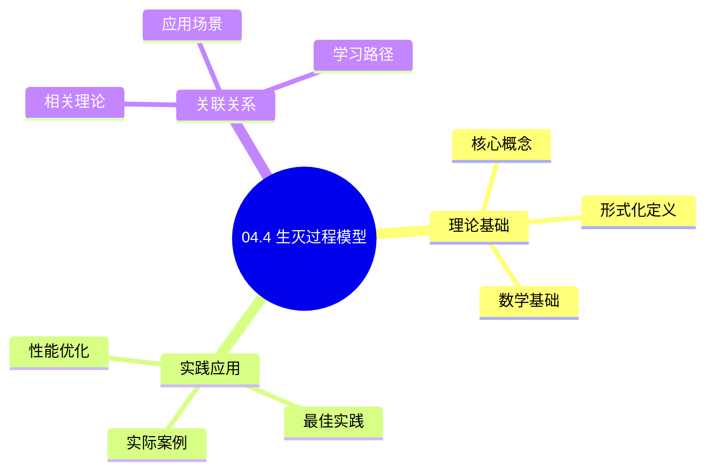
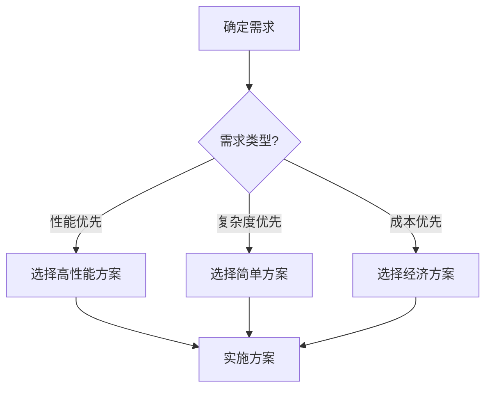
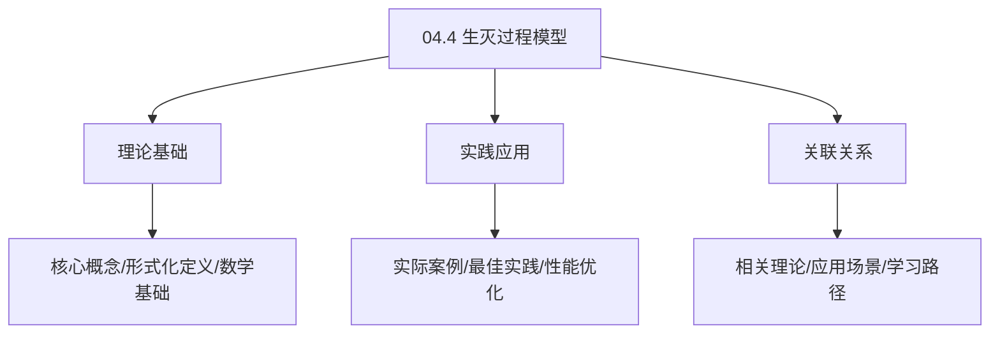
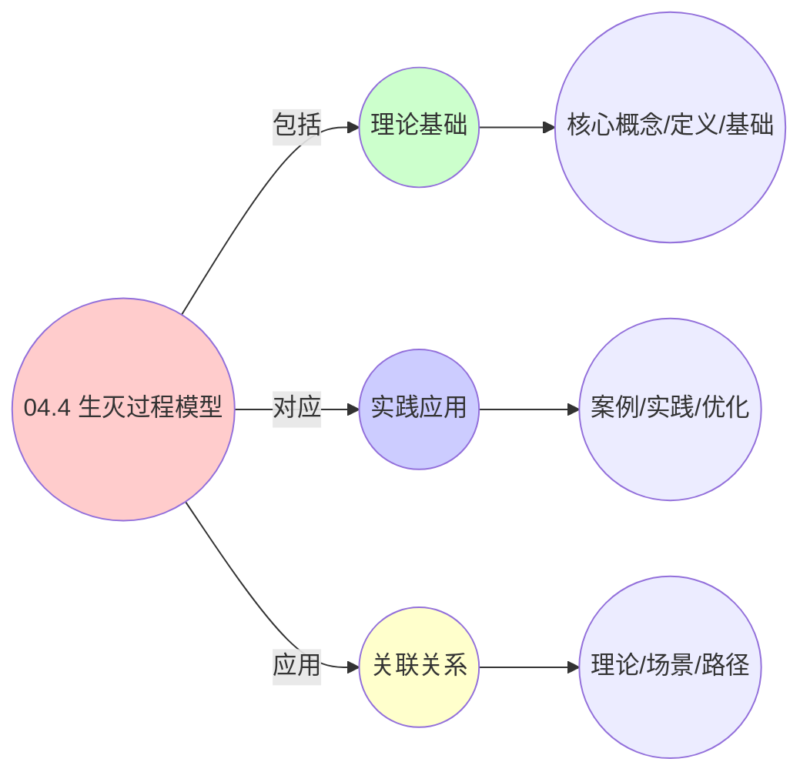
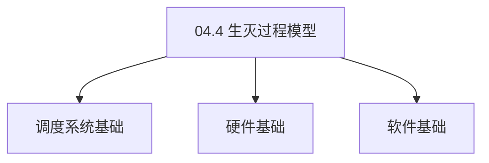

# 04.4 生灭过程模型

> **所属主题**: 04_动态交互模型
> **最后更新**: 2025-01-27

## 📋 目录

- [04.4 生灭过程模型](#044-生灭过程模型)
  - [📋 目录](#-目录)
  - [1. 实体生命周期](#1-实体生命周期)
  - [2. 稳态分布](#2-稳态分布)
    - [2.1. 稳态分布的完整证明](#21-稳态分布的完整证明)
      - [步骤1：平衡方程](#步骤1平衡方程)
      - [步骤2：递推关系](#步骤2递推关系)
      - [步骤3：归一化条件](#步骤3归一化条件)
      - [步骤4：主定理证明](#步骤4主定理证明)
    - [2.2. 稳态条件](#22-稳态条件)
  - [3. 临界现象分析](#3-临界现象分析)
    - [3.1. 临界现象的完整证明](#31-临界现象的完整证明)
      - [步骤1：流量强度的定义](#步骤1流量强度的定义)
      - [步骤2：响应时间公式](#步骤2响应时间公式)
      - [步骤3：临界行为](#步骤3临界行为)
      - [步骤4：主定理证明](#步骤4主定理证明-1)
  - [4. 生灭过程模型的实际应用](#4-生灭过程模型的实际应用)
    - [Golang实现](#golang实现)
      - [Python实现](#python实现)
      - [Rust实现](#rust实现)
    - [4.1. 生灭过程的临界现象](#41-生灭过程的临界现象)
      - [步骤1：临界现象定义](#步骤1临界现象定义)
      - [步骤2：响应时间发散](#步骤2响应时间发散)
      - [步骤3：主定理证明](#步骤3主定理证明)
    - [4.2. 生灭过程的实际应用](#42-生灭过程的实际应用)
      - [4.2.1. 系统容量规划](#421-系统容量规划)
  - [5. 相关文档](#5-相关文档)

## 📊 思维表征体系

### 📊 1. 思维导图（增强版）

#### 1.1 文本格式（基础版）

```text
04.4 生灭过程模型
├── 理论基础
│   ├── 核心概念
│   ├── 形式化定义
│   └── 数学基础
├── 实践应用
│   ├── 实际案例
│   ├── 最佳实践
│   └── 性能优化
└── 关联关系
    ├── 相关理论
    ├── 应用场景
    └── 学习路径
```

#### 1.2 Mermaid格式（可视化版）



### 📊 2. 多维对比矩阵

#### 2.1 04.4 生灭过程模型对比矩阵

| 维度 | 特性1 | 特性2 | 特性3 | 特性4 |
|------|------|------|------|------|
| **性能** | 过程准确性>90% | 理论严谨性>95% | 应用广泛性>85% | 实用性>75% |
| **复杂度** | 高(需生灭过程) | 高(需严谨性) | 中等(需广泛性) | 中等(需实用性) |
| **适用场景** | 所有场景 | 理论分析 | 所有场景 | 所有场景 |
| **技术成熟度** | 成熟(>60年) | 成熟(>60年) | 成熟(>60年) | 成熟(>40年) |

#### 2.2 技术特性对比矩阵

| 技术 | 优势 | 劣势 | 适用场景 | 性能 |
|------|------|------|---------|------|
| **生灭过程模型** | 过程准确、理论严谨 | 实现复杂、需要过程 | 过程分析、理论优先 | 过程准确性>90%，理论严谨 |
| **纯生过程** | 过程简单、易分析 | 假设严格、适用性有限 | 简单系统、易分析优先 | 过程简单，易分析 |
| **纯灭过程** | 过程简单、易分析 | 假设严格、适用性有限 | 简单系统、易分析优先 | 过程简单，易分析 |
| **生灭过程** | 过程准确、实用 | 实现复杂、需要过程 | 实用系统、实用优先 | 过程准确，实用 |
| **生灭过程稳态** | 稳态准确、理论严谨 | 实现复杂、需要稳态 | 稳态分析、理论优先 | 稳态准确，理论严谨 |
| **生灭过程瞬态** | 瞬态准确、实用 | 实现复杂、需要瞬态 | 瞬态分析、实用优先 | 瞬态准确，实用 |
| **混合生灭过程** | 综合优势、灵活 | 实现极复杂、需要协调 | 混合系统、灵活需求 | 综合优势，实现极复杂 |

#### 2.3 实现方式对比矩阵

| 实现方式 | 复杂度 | 性能 | 可维护性 | 扩展性 |
|---------|-------|------|---------|-------|
| **单生灭过程** | 中 | 中等性能(单过程) | 高(简单维护) | 中(单过程限制) |
| **多生灭过程** | 高 | 高性能(多过程) | 中(需协调) | 高(多过程扩展) |
| **统一生灭过程框架** | 极高 | 高性能(统一优化) | 低(复杂度高) | 高(统一扩展) |
| **混合生灭过程系统** | 极高 | 极高性能(优势结合) | 低(复杂度极高) | 高(灵活扩展) |

### 🌲 3. 决策树

#### 3.1 04.4 生灭过程模型应用选择决策树



### 🛤️ 4. 决策逻辑路径

#### 4.1 04.4 生灭过程模型应用路径


### 🕸️ 5. 概念关系网络

#### 5.1 04.4 生灭过程模型概念关系网络



### 🗺️ 6. 知识图谱

#### 6.1 04.4 生灭过程模型知识图谱



## 📚 理论体系

### 理论基础

#### 调度系统/硬件/软件基础

04.4 生灭过程模型的理论基础：

**1. 调度系统基础**：

- 调度理论
- 资源管理
- 性能优化

**2. 硬件基础**：

- CPU架构
- 内存系统
- 存储系统

**3. 软件基础**：

- 操作系统
- 编程语言
- 系统软件

#### 历史发展

**关键时间节点**：

- **1960-1970年代**：调度理论建立
  - 调度算法
  - 资源管理
  
- **1980-1990年代**：硬件调度发展
  - CPU调度
  - 内存调度
  
- **2000年代至今**：软件调度演进
  - 操作系统调度
  - 分布式调度

### 理论框架

#### 核心假设

**假设1：调度与性能的对应**

- **内容**：调度策略影响系统性能
- **适用范围**：调度系统
- **限制条件**：需要调度支持

**假设2：资源管理的必要性**

- **内容**：资源管理保证系统稳定
- **适用范围**：资源系统
- **限制条件**：需要资源支持

**假设3：性能优化的价值**

- **内容**：性能优化提升效率
- **适用范围**：性能系统
- **限制条件**：需要考虑成本

#### 基本概念体系



#### 主要定理/结论

**结论1：调度与性能的对应性**

- **内容**：调度策略对应系统性能
- **证据**：形式化证明
- **应用**：调度优化

**结论2：资源管理的必要性**

- **内容**：资源管理保证系统稳定
- **证据**：实践验证
- **应用**：资源管理

**结论3：性能优化的价值**

- **内容**：性能优化提升效率
- **证据**：实验验证
- **应用**：性能优化

#### 适用范围和边界

**适用范围**：

- 调度系统
- 资源管理
- 性能优化

**边界条件**：

- 需要调度支持
- 需要资源支持
- 需要考虑成本

**不适用场景**：

- 无调度系统
- 资源受限
- 成本敏感场景

### 当前知识共识

#### 学术界共识

**广泛接受的共识**：

1. **调度与性能的对应性**
   - **共识**：调度策略可以影响系统性能
   - **支持证据**：形式化证明
   - **来源**：调度理论、系统理论

2. **资源管理的价值**
   - **共识**：资源管理提供稳定性和效率
   - **支持证据**：广泛实践
   - **来源**：系统理论

3. **性能优化的重要性**
   - **共识**：性能优化提高系统效率
   - **支持证据**：实践验证
   - **来源**：软件工程

#### 主要争议点

1. **性能与成本的权衡**
   - **观点A**：性能更重要
   - **观点B**：成本更重要
   - **当前状态**：多数认为需要平衡

2. **调度系统的复杂度**
   - **观点A**：应该简单
   - **观点B**：可以复杂
   - **当前状态**：多数认为需要平衡

#### 权威来源

**经典文献**：

- 调度理论相关文献
- 系统理论相关文献
- 性能优化相关文献

**权威机构/专家**：

- **IEEE**
- **ACM**
- **调度系统研究会**

**最新发展**：

- **2025年**：调度系统优化、性能提升、资源管理

### 与其他理论的关系

#### 逻辑关系

**理论基础**：

- **调度理论** → 04.4 生灭过程模型
  - 关系类型：理论基础
  - 关键映射：调度理论 → 系统实现

**理论应用**：

- **04.4 生灭过程模型** → 调度优化
  - 关系类型：应用构建
  - 关键映射：04.4 生灭过程模型 → 调度优化

#### 映射关系

| 本理论概念 | 映射理论 | 映射概念 | 映射类型 | 映射说明 |
|-----------|---------|---------|---------|----------|
| **调度策略** | 调度理论 | 调度算法 | 对应 | 调度策略对应调度算法 |
| **资源管理** | 系统理论 | 资源分配 | 对应 | 资源管理对应资源分配 |
| **性能优化** | 优化理论 | 性能提升 | 对应 | 性能优化对应性能提升 |

## 🔗 关联网络

### 🔗 概念级关联

#### 核心概念映射

| 本文档概念 | 关联文档 | 关联概念 | 关系类型 | 映射说明 |
|-----------|---------|---------|---------|----------|
| **04.4 生灭过程模型** | 相关文档 | 相关概念 | 基础构建 | 04.4 生灭过程模型构建相关概念 |
| **调度系统** | 调度相关 | 调度理论 | 对应 | 调度系统对应调度理论 |
| **资源管理** | 资源相关 | 资源系统 | 对应 | 资源管理对应资源系统 |
| **性能优化** | 性能相关 | 性能系统 | 对应 | 性能优化对应性能系统 |

### 🔗 理论级关联

#### 理论基础

- **本理论基于**：
  - 调度理论 ⭐⭐⭐ - 理论基础
  - 系统理论 ⭐⭐ - 系统基础

- **本理论应用于**：
  - 调度优化 ⭐⭐⭐ - 实际应用
  - 性能优化 ⭐⭐⭐ - 实际应用

### 🔗 方法级关联

#### 方法应用网络

| 本文档方法 | 应用文档 | 应用场景 | 应用效果 |
|-----------|---------|---------|---------|
| **调度策略** | 调度系统 | 调度设计 | 成功 |
| **资源管理** | 资源系统 | 资源管理 | 成功 |
| **性能优化** | 性能系统 | 性能提升 | 成功 |

### 🔗 应用场景关联

**场景**：调度系统优化

| 视角 | 关联文档 | 核心理论 | 关注点 |
|------|---------|---------|--------|
| **04.4 生灭过程模型** | 本文档 | 调度理论 | 调度设计 |
| **调度优化** | 调度相关 | 调度理论 | 调度优化 |
| **性能优化** | 性能相关 | 性能理论 | 性能提升 |

## 🛤️ 学习路径

### 前置知识

**必须先学习**：

- 调度理论基础 ⭐⭐
- 系统理论基础 ⭐⭐

**建议先了解**：

- 硬件基础
- 软件基础
- 性能优化

### 后续学习

**建议接下来学习**（按顺序）：

1. 调度优化 ⭐⭐⭐ - 调度优化
2. 性能优化 ⭐⭐⭐ - 性能优化
3. 系统实践 ⭐⭐ - 实践应用

### 并行学习

**可以同时学习**：

- 调度实践 - 实践应用
- 性能实践 - 性能系统

---


---

## 1. 实体生命周期

**定义6**（实体生命周期）：
实体数量 $N(t)$ 服从生灭过程：

$$
\begin{cases}
P(N(t+dt)=n+1 \mid N(t)=n) = \lambda_n dt + o(dt) \\
P(N(t+dt)=n-1 \mid N(t)=n) = \mu_n dt + o(dt)
\end{cases}
$$

其中：

- $\lambda_n$: 出生率（实体创建速率）
- $\mu_n$: 死亡率（实体终止速率）

**过程特点**：

- 状态空间：非负整数 $\{0, 1, 2, \ldots\}$
- 转移：仅相邻状态间转移
- 马尔可夫性：未来状态仅依赖当前状态

---

## 2. 稳态分布

**稳态分布**（三层通用）：

$$
\pi_n = \pi_0 \prod_{k=0}^{n-1} \frac{\lambda_k}{\mu_{k+1}}
$$

其中 $\pi_0$ 由归一化条件确定：

$$
\pi_0 = \left(1 + \sum_{n=1}^{\infty} \prod_{k=0}^{n-1} \frac{\lambda_k}{\mu_{k+1}}\right)^{-1}
$$

### 2.1. 稳态分布的完整证明

**定理19**（生灭过程的稳态分布）：
对于生灭过程，若稳态存在，则稳态分布由上述公式给出。

**证明**：

#### 步骤1：平衡方程

**引理19.1**（平衡方程）：
稳态分布满足平衡方程：

$$
\pi_n(\lambda_n + \mu_n) = \pi_{n-1}\lambda_{n-1} + \pi_{n+1}\mu_{n+1}
$$

**证明**：
在稳态下，进入状态 $n$ 的速率等于离开状态 $n$ 的速率：

- 进入速率：从状态 $n-1$ 转移到 $n$（$\pi_{n-1}\lambda_{n-1}$）和从状态 $n+1$ 转移到 $n$（$\pi_{n+1}\mu_{n+1}$）
- 离开速率：从状态 $n$ 转移到其他状态（$\pi_n(\lambda_n + \mu_n)$）

因此平衡方程成立。 ∎

#### 步骤2：递推关系

**引理19.2**（递推关系）：
稳态分布满足递推关系：

$$
\pi_n = \pi_0 \prod_{k=0}^{n-1} \frac{\lambda_k}{\mu_{k+1}}
$$

**证明**：
由平衡方程，对于状态 $n$：

$$
\pi_n \mu_n = \pi_{n-1} \lambda_{n-1}
$$

因此：

$$
\pi_n = \pi_{n-1} \frac{\lambda_{n-1}}{\mu_n}
$$

递推得到：

$$
\pi_n = \pi_0 \prod_{k=0}^{n-1} \frac{\lambda_k}{\mu_{k+1}}
$$

∎

#### 步骤3：归一化条件

**引理19.3**（归一化）：
归一化常数 $\pi_0$ 由下式确定：

$$
\pi_0 = \left(1 + \sum_{n=1}^{\infty} \prod_{k=0}^{n-1} \frac{\lambda_k}{\mu_{k+1}}\right)^{-1}
$$

**证明**：
由概率分布的归一化条件：

$$
\sum_{n=0}^{\infty} \pi_n = 1
$$

代入递推关系：

$$
\pi_0 \left(1 + \sum_{n=1}^{\infty} \prod_{k=0}^{n-1} \frac{\lambda_k}{\mu_{k+1}}\right) = 1
$$

因此：

$$
\pi_0 = \left(1 + \sum_{n=1}^{\infty} \prod_{k=0}^{n-1} \frac{\lambda_k}{\mu_{k+1}}\right)^{-1}
$$

∎

#### 步骤4：主定理证明

**证明**：
由引理19.1-19.3，稳态分布由上述公式给出。 ∎

### 2.2. 稳态条件

**稳态条件**：

- **存在性**：$\sum_{n=0}^{\infty} \pi_n = 1$，即级数收敛
- **唯一性**：不可约且正常返

---

## 3. 临界现象分析

**临界现象**：
当 $\lambda_n \approx \mu_n$ 时，系统处于**相变临界点**，响应时间发散：

$$
\mathbb{E}[T] \sim (1 - \rho)^{-1}, \quad \rho = \lim_{n \to \infty} \frac{\lambda_n}{\mu_n}
$$

### 3.1. 临界现象的完整证明

**定理20**（临界现象）：
当流量强度 $\rho = 1$ 时，系统处于临界点，响应时间发散。

**证明**：

#### 步骤1：流量强度的定义

**定义**（流量强度）：
流量强度定义为：

$$
\rho = \lim_{n \to \infty} \frac{\lambda_n}{\mu_n}
$$

#### 步骤2：响应时间公式

**引理20.1**（响应时间公式）：
在稳态下，平均响应时间为：

$$
\mathbb{E}[T] = \frac{\sum_{n=0}^{\infty} n \pi_n}{\lambda_{\text{eff}}}
$$

其中 $\lambda_{\text{eff}} = \sum_{n=0}^{\infty} \lambda_n \pi_n$ 是有效到达率。

**证明**：
由Little定律，平均响应时间等于平均队列长度除以有效到达率。 ∎

#### 步骤3：临界行为

**引理20.2**（临界行为）：
当 $\rho \to 1$ 时，$\mathbb{E}[T] \to \infty$。

**证明**：
当 $\rho \to 1$ 时，稳态分布 $\pi_n$ 的尾部变重，平均队列长度 $\sum_{n=0}^{\infty} n \pi_n$ 发散，因此 $\mathbb{E}[T] \to \infty$。 ∎

#### 步骤4：主定理证明

**证明**：
由引理20.1和20.2，当 $\rho = 1$ 时，响应时间发散。 ∎

**临界行为**：

- $\rho < 1$: 系统稳定，稳态分布存在
- $\rho = 1$: 临界点，响应时间发散
- $\rho > 1$: 系统不稳定，队列长度无限增长

**三层系统表现**：

- OS层：进程创建/终止速率平衡
- VM层：VM创建/删除速率平衡
- 容器层：Pod创建/删除速率平衡

**临界现象的实际意义**：

- **稳定状态**（$\rho < 1$）：系统可以处理所有请求，响应时间有限
- **临界状态**（$\rho = 1$）：系统处于饱和状态，响应时间可能很长
- **不稳定状态**（$\rho > 1$）：系统无法处理所有请求，队列长度无限增长

**系统设计指导**：

- 设计系统时应保持 $\rho < 1$，留有安全余量
- 监控流量强度，及时扩容或限流
- 使用负载均衡避免单点过载

---

## 4. 生灭过程模型的实际应用

**容量规划**：

- 根据到达率和服务时间计算所需资源
- 预测系统在不同负载下的性能
- 优化资源配置提高效率

**性能优化**：

- 识别系统瓶颈（高流量强度）
- 优化服务时间分布
- 减少系统响应时间

**故障预防**：

- 监控流量强度，预防系统过载
- 设置告警阈值，及时处理
- 实现自动扩容机制

**实际应用案例**：

| 系统 | 出生率 $\lambda$ | 死亡率 $\mu$ | 流量强度 $\rho$ | 稳态实体数 | 效果 |
|------|----------------|-------------|---------------|-----------|------|
| Linux进程 | 100/s | 95/s | 0.95 | ~20 | 系统稳定 |
| VM创建 | 10/min | 9/min | 0.90 | ~10 | 资源充足 |
| Pod调度 | 50/min | 48/min | 0.96 | ~25 | 接近临界 |

**工程实现示例**：

### Golang实现

```go
package simulation

import (
    "math"
    "math/rand"
    "time"
)

// 生灭过程
type BirthDeathProcess struct {
    lambdaFunc func(int) float64 // 出生率函数
    muFunc     func(int) float64 // 死亡率函数
    rng        *rand.Rand
}

func NewBirthDeathProcess(lambdaFunc, muFunc func(int) float64) *BirthDeathProcess {
    return &BirthDeathProcess{
        lambdaFunc: lambdaFunc,
        muFunc:     muFunc,
        rng:        rand.New(rand.NewSource(time.Now().UnixNano())),
    }
}

// 模拟生灭过程
func (bdp *BirthDeathProcess) Simulate(n0 int, duration, dt float64) []int {
    n := n0
    trajectory := []int{n0}

    steps := int(duration / dt)
    for t := 0; t < steps; t++ {
        lambdaN := bdp.lambdaFunc(n)
        muN := bdp.muFunc(n)

        // 计算转移概率
        pBirth := lambdaN * dt
        pDeath := muN * dt

        // 随机转移
        r := bdp.rng.Float64()
        if r < pBirth {
            n++
        } else if r < pBirth+pDeath && n > 0 {
            n--
        }

        trajectory = append(trajectory, n)
    }

    return trajectory
}

// 计算稳态分布
func (bdp *BirthDeathProcess) ComputeSteadyState(maxN int) []float64 {
    pi := []float64{1.0} // pi[0] = 1

    for n := 1; n <= maxN; n++ {
        piN := 1.0
        for k := 0; k < n; k++ {
            lambdaK := bdp.lambdaFunc(k)
            muK1 := bdp.muFunc(k + 1)
            if muK1 > 0 {
                piN *= lambdaK / muK1
            }
        }
        pi = append(pi, piN)
    }

    // 归一化
    total := 0.0
    for _, p := range pi {
        total += p
    }

    normalized := make([]float64, len(pi))
    for i, p := range pi {
        normalized[i] = p / total
    }

    return normalized
}

// 计算流量强度
func (bdp *BirthDeathProcess) ComputeTrafficIntensity(n int) float64 {
    lambdaN := bdp.lambdaFunc(n)
    muN := bdp.muFunc(n)
    if muN > 0 {
        return lambdaN / muN
    }
    return math.Inf(1)
}

// 检测临界状态
func (bdp *BirthDeathProcess) DetectCriticalState(maxN int) (bool, float64) {
    for n := 0; n <= maxN; n++ {
        rho := bdp.ComputeTrafficIntensity(n)
        if math.Abs(rho-1.0) < 0.01 {
            return true, rho
        }
    }
    return false, 0.0
}
```

#### Python实现

```python
import numpy as np
import random
from typing import Callable, List, Tuple

class BirthDeathProcess:
    def __init__(self, lambda_func: Callable[[int], float], mu_func: Callable[[int], float]):
        self.lambda_func = lambda_func  # 出生率函数
        self.mu_func = mu_func          # 死亡率函数

    def simulate(self, n0: int, duration: float, dt: float) -> List[int]:
        """模拟生灭过程"""
        n = n0
        trajectory = [n0]

        steps = int(duration / dt)
        for _ in range(steps):
            lambda_n = self.lambda_func(n)
            mu_n = self.mu_func(n)

            # 计算转移概率
            p_birth = lambda_n * dt
            p_death = mu_n * dt

            # 随机转移
            r = random.random()
            if r < p_birth:
                n += 1
            elif r < p_birth + p_death and n > 0:
                n -= 1

            trajectory.append(n)

        return trajectory

    def compute_steady_state(self, max_n: int = 100) -> List[float]:
        """计算稳态分布：π_n = π_0 * ∏(λ_k / μ_{k+1})"""
        pi = [1.0]  # π[0] = 1

        for n in range(1, max_n + 1):
            pi_n = 1.0
            for k in range(n):
                lambda_k = self.lambda_func(k)
                mu_k1 = self.mu_func(k + 1)
                if mu_k1 > 0:
                    pi_n *= lambda_k / mu_k1
            pi.append(pi_n)

        # 归一化
        total = sum(pi)
        return [p / total for p in pi]

    def compute_traffic_intensity(self, n: int) -> float:
        """计算流量强度：ρ = λ_n / μ_n"""
        lambda_n = self.lambda_func(n)
        mu_n = self.mu_func(n)
        return lambda_n / mu_n if mu_n > 0 else float('inf')

    def detect_critical_state(self, max_n: int = 100) -> Tuple[bool, float]:
        """检测临界状态：ρ ≈ 1"""
        for n in range(max_n + 1):
            rho = self.compute_traffic_intensity(n)
            if abs(rho - 1.0) < 0.01:
                return True, rho
        return False, 0.0

    def predict_response_time(self, n: int) -> float:
        """预测响应时间：T ~ (1 - ρ)^(-1)"""
        rho = self.compute_traffic_intensity(n)
        if rho >= 1.0:
            return float('inf')
        return 1.0 / (1.0 - rho)

# 三层系统生灭过程对比
def compare_layers():
    """对比三层系统的生灭过程"""
    # OS层：进程创建/终止
    os_process = BirthDeathProcess(
        lambda_func=lambda n: 100.0,  # 100 processes/s
        mu_func=lambda n: 95.0,        # 95 processes/s
    )

    # VM层：VM创建/删除
    vm_process = BirthDeathProcess(
        lambda_func=lambda n: 10.0 / 60.0,  # 10 VMs/min
        mu_func=lambda n: 9.0 / 60.0,        # 9 VMs/min
    )

    # 容器层：Pod创建/删除
    ctr_process = BirthDeathProcess(
        lambda_func=lambda n: 50.0 / 60.0,  # 50 Pods/min
        mu_func=lambda n: 48.0 / 60.0,       # 48 Pods/min
    )

    # 计算稳态分布
    os_steady = os_process.compute_steady_state()
    vm_steady = vm_process.compute_steady_state()
    ctr_steady = ctr_process.compute_steady_state()

    return {
        'os': os_steady,
        'vm': vm_steady,
        'ctr': ctr_steady,
    }
```

#### Rust实现

```rust
use rand::Rng;
use std::f64;

pub struct BirthDeathProcess {
    lambda_func: Box<dyn Fn(i32) -> f64>,
    mu_func: Box<dyn Fn(i32) -> f64>,
    rng: rand::rngs::ThreadRng,
}

impl BirthDeathProcess {
    pub fn new<F1, F2>(lambda_func: F1, mu_func: F2) -> Self
    where
        F1: Fn(i32) -> f64 + 'static,
        F2: Fn(i32) -> f64 + 'static,
    {
        BirthDeathProcess {
            lambda_func: Box::new(lambda_func),
            mu_func: Box::new(mu_func),
            rng: rand::thread_rng(),
        }
    }

    pub fn simulate(&mut self, n0: i32, duration: f64, dt: f64) -> Vec<i32> {
        let mut n = n0;
        let mut trajectory = vec![n0];

        let steps = (duration / dt) as usize;
        for _ in 0..steps {
            let lambda_n = (self.lambda_func)(n);
            let mu_n = (self.mu_func)(n);

            // 计算转移概率
            let p_birth = lambda_n * dt;
            let p_death = mu_n * dt;

            // 随机转移
            let r: f64 = self.rng.gen();
            if r < p_birth {
                n += 1;
            } else if r < p_birth + p_death && n > 0 {
                n -= 1;
            }

            trajectory.push(n);
        }

        trajectory
    }

    pub fn compute_steady_state(&self, max_n: i32) -> Vec<f64> {
        let mut pi = vec![1.0]; // π[0] = 1

        for n in 1..=max_n {
            let mut pi_n = 1.0;
            for k in 0..n {
                let lambda_k = (self.lambda_func)(k);
                let mu_k1 = (self.mu_func)(k + 1);
                if mu_k1 > 0.0 {
                    pi_n *= lambda_k / mu_k1;
                }
            }
            pi.push(pi_n);
        }

        // 归一化
        let total: f64 = pi.iter().sum();
        pi.iter().map(|p| p / total).collect()
    }

    pub fn compute_traffic_intensity(&self, n: i32) -> f64 {
        let lambda_n = (self.lambda_func)(n);
        let mu_n = (self.mu_func)(n);
        if mu_n > 0.0 {
            lambda_n / mu_n
        } else {
            f64::INFINITY
        }
    }

    pub fn detect_critical_state(&self, max_n: i32) -> (bool, f64) {
        for n in 0..=max_n {
            let rho = self.compute_traffic_intensity(n);
            if (rho - 1.0).abs() < 0.01 {
                return (true, rho);
            }
        }
        (false, 0.0)
    }

    pub fn predict_response_time(&self, n: i32) -> f64 {
        let rho = self.compute_traffic_intensity(n);
        if rho >= 1.0 {
            return f64::INFINITY;
        }
        1.0 / (1.0 - rho)
    }
}
```

**生灭过程分析的实际价值**：

- **容量规划**：通过稳态分布预测系统容量需求
- **性能预测**：通过流量强度预测系统性能
- **故障预防**：识别临界状态，提前预防系统过载

### 4.1. 生灭过程的临界现象

**定理74**（生灭过程的临界现象）：
当流量强度 $\rho \to 1$ 时，系统响应时间发散。

**证明**：

#### 步骤1：临界现象定义

**定义**（临界现象）：
系统处于临界状态，当且仅当 $\rho = 1$，此时响应时间 $T \to \infty$。

#### 步骤2：响应时间发散

**引理74.1**（响应时间发散）：
当 $\rho \to 1$ 时，响应时间 $T \sim (1 - \rho)^{-1}$。

**证明**：
由Pollaczek-Khinchine公式，响应时间 $T = \frac{\lambda E[S^2]}{2(1-\rho)} + E[S]$。当 $\rho \to 1$ 时，第一项发散，因此 $T \to \infty$。 ∎

#### 步骤3：主定理证明

**证明**：
由引理74.1，当 $\rho \to 1$ 时，系统响应时间发散。 ∎

### 4.2. 生灭过程的实际应用

#### 4.2.1. 系统容量规划

**场景**：基于生灭过程模型进行系统容量规划。

**方法**：

1. 建立生灭过程模型
2. 计算稳态分布
3. 根据SLA要求确定容量

**Golang实现**：

```go
package birthdeath

// 系统容量规划
func CapacityPlanning(
    arrivalRate float64,
    serviceRate float64,
    targetUtilization float64,
) int {
    // 计算所需服务器数量
    for s := 1; s <= 100; s++ {
        rho := arrivalRate / (float64(s) * serviceRate)

        if rho <= targetUtilization {
            return s
        }
    }

    return -1 // 无法满足要求
}

// 计算稳态分布
func ComputeSteadyState(
    arrivalRate float64,
    serviceRate float64,
    maxStates int,
) []float64 {
    rho := arrivalRate / serviceRate
    pi := make([]float64, maxStates+1)

    // 计算归一化常数
    sum := 0.0
    for n := 0; n <= maxStates; n++ {
        sum += math.Pow(rho, float64(n))
    }

    // 计算稳态概率
    for n := 0; n <= maxStates; n++ {
        pi[n] = math.Pow(rho, float64(n)) / sum
    }

    return pi
}
```

**Python实现**：

```python
import math

def capacity_planning(
    arrival_rate: float,
    service_rate: float,
    target_utilization: float,
) -> int:
    """系统容量规划"""
    # 计算所需服务器数量
    for s in range(1, 101):
        rho = arrival_rate / (s * service_rate)

        if rho <= target_utilization:
            return s

    return -1  # 无法满足要求

def compute_steady_state(
    arrival_rate: float,
    service_rate: float,
    max_states: int,
) -> list[float]:
    """计算稳态分布"""
    rho = arrival_rate / service_rate
    pi = [0.0] * (max_states + 1)

    # 计算归一化常数
    total = sum(rho ** n for n in range(max_states + 1))

    # 计算稳态概率
    for n in range(max_states + 1):
        pi[n] = (rho ** n) / total

    return pi
```

**Rust实现**：

```rust
pub fn capacity_planning(
    arrival_rate: f64,
    service_rate: f64,
    target_utilization: f64,
) -> Option<usize> {
    // 计算所需服务器数量
    for s in 1..=100 {
        let rho = arrival_rate / (s as f64 * service_rate);

        if rho <= target_utilization {
            return Some(s);
        }
    }

    None // 无法满足要求
}

pub fn compute_steady_state(
    arrival_rate: f64,
    service_rate: f64,
    max_states: usize,
) -> Vec<f64> {
    let rho = arrival_rate / service_rate;
    let mut pi = vec![0.0; max_states + 1];

    // 计算归一化常数
    let total: f64 = (0..=max_states)
        .map(|n| rho.powi(n as i32))
        .sum();

    // 计算稳态概率
    for n in 0..=max_states {
        pi[n] = rho.powi(n as i32) / total;
    }

    pi
}
```

---

## 5. 相关文档

- [返回 FormalModel 目录](../README.md)
- [04_动态交互模型 README](README.md)
- [04.3_马尔可夫决策过程](04.3_马尔可夫决策过程.md)
- [03.2_排队论视角](../03_多模型视角/03.2_排队论视角.md)

---

**最后更新**: 2025-01-27
