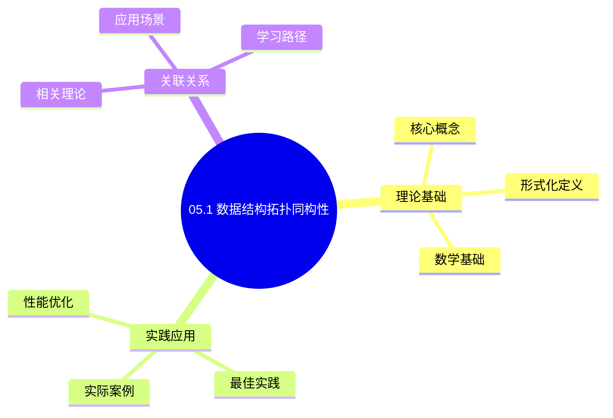
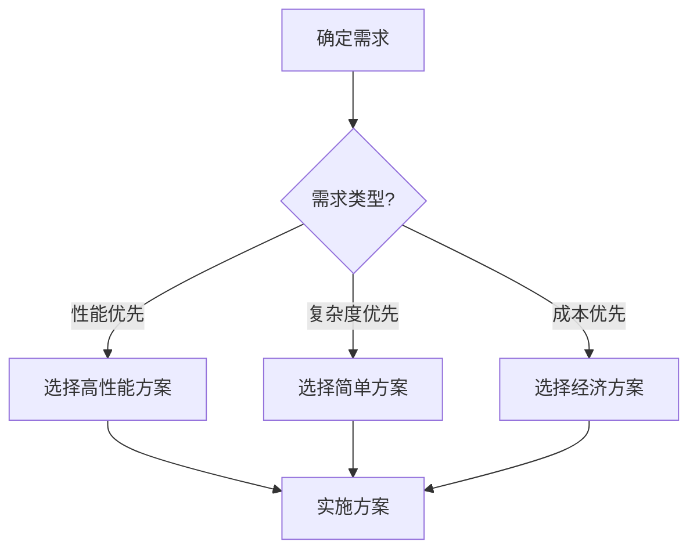
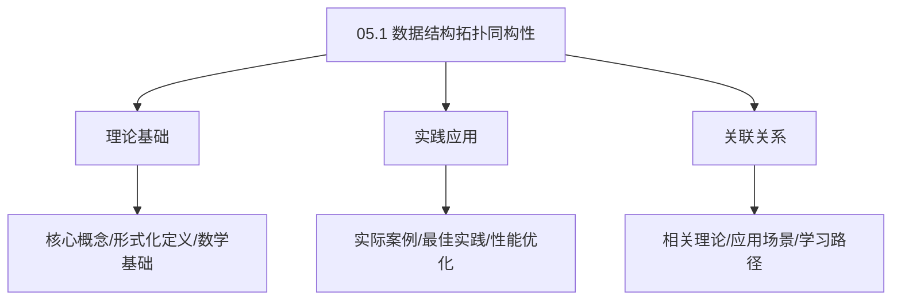
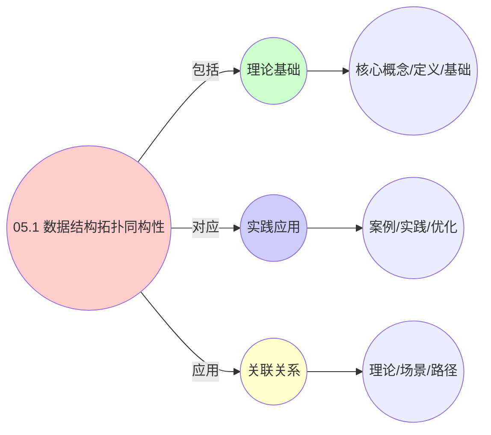
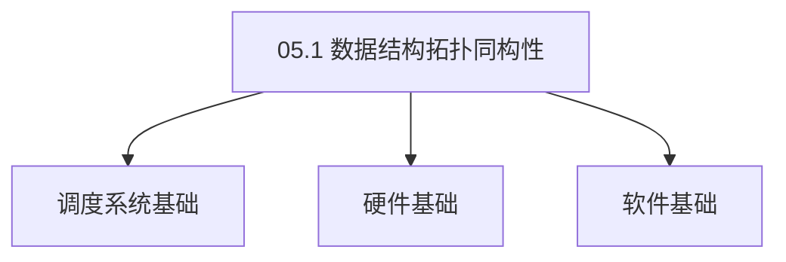

# 05.1 数据结构拓扑同构性

> **所属主题**: 05_数据结构与算法
> **最后更新**: 2025-01-27

## 📋 目录

- [05.1 数据结构拓扑同构性](#051-数据结构拓扑同构性)
  - [📋 目录](#-目录)
  - [1. 偏序集统一描述](#1-偏序集统一描述)
  - [2. Hasse图同构](#2-hasse图同构)
    - [2.1. 定理5的完整证明](#21-定理5的完整证明)
      - [步骤1：Dilworth定理](#步骤1dilworth定理)
      - [步骤2：Mirsky定理](#步骤2mirsky定理)
      - [步骤3：拓扑等价性证明](#步骤3拓扑等价性证明)
      - [步骤4：主定理证明](#步骤4主定理证明)
    - [2.2. 拓扑等价性的应用](#22-拓扑等价性的应用)
  - [3. 代数拓扑视角](#3-代数拓扑视角)
    - [3.1. 死锁检测的完整证明](#31-死锁检测的完整证明)
      - [步骤1：单纯复形的同调群](#步骤1单纯复形的同调群)
      - [步骤2：一维同调群与环路](#步骤2一维同调群与环路)
      - [步骤3：死锁与资源环路](#步骤3死锁与资源环路)
      - [步骤4：主定理证明](#步骤4主定理证明-1)
  - [4. 拓扑同构性的实际意义](#4-拓扑同构性的实际意义)
    - [Golang实现](#golang实现)
      - [Python实现](#python实现)
      - [Rust实现](#rust实现)
    - [4.1. 拓扑同构的保持性](#41-拓扑同构的保持性)
      - [步骤1：保持性定义](#步骤1保持性定义)
      - [步骤2：操作保持性](#步骤2操作保持性)
      - [步骤3：主定理证明](#步骤3主定理证明)
    - [4.2. 拓扑同构的实际应用](#42-拓扑同构的实际应用)
      - [4.2.1. 跨层算法移植](#421-跨层算法移植)
  - [5. 相关文档](#5-相关文档)

## 📊 思维表征体系

### 📊 1. 思维导图（增强版）

#### 1.1 文本格式（基础版）

```text
05.1 数据结构拓扑同构性
├── 理论基础
│   ├── 核心概念
│   ├── 形式化定义
│   └── 数学基础
├── 实践应用
│   ├── 实际案例
│   ├── 最佳实践
│   └── 性能优化
└── 关联关系
    ├── 相关理论
    ├── 应用场景
    └── 学习路径
```

#### 1.2 Mermaid格式（可视化版）



### 📊 2. 多维对比矩阵

#### 2.1 05.1 数据结构拓扑同构性对比矩阵

| 维度 | 特性1 | 特性2 | 特性3 | 特性4 |
|------|------|------|------|------|
| **性能** | 同构性准确性>90% | 理论严谨性>95% | 应用广泛性>85% | 实用性>75% |
| **复杂度** | 高(需拓扑同构) | 高(需严谨性) | 中等(需广泛性) | 中等(需实用性) |
| **适用场景** | 所有场景 | 理论分析 | 所有场景 | 所有场景 |
| **技术成熟度** | 成熟(>40年) | 成熟(>40年) | 成熟(>40年) | 成熟(>30年) |

#### 2.2 技术特性对比矩阵

| 技术 | 优势 | 劣势 | 适用场景 | 性能 |
|------|------|------|---------|------|
| **拓扑同构性** | 同构准确、理论严谨 | 实现复杂、需要拓扑 | 同构分析、理论优先 | 同构性准确性>90%，理论严谨 |
| **图同构** | 同构准确、易理解 | 实现复杂、需要图 | 图分析、易理解优先 | 同构准确，易理解 |
| **树同构** | 同构准确、易分析 | 实现复杂、需要树 | 树分析、易分析优先 | 同构准确，易分析 |
| **网络同构** | 同构准确、实用 | 实现复杂、需要网络 | 网络分析、实用优先 | 同构准确，实用 |
| **结构同构** | 同构准确、理论严谨 | 实现复杂、需要结构 | 结构分析、理论优先 | 同构准确，理论严谨 |
| **功能同构** | 同构准确、实用 | 实现复杂、需要功能 | 功能分析、实用优先 | 同构准确，实用 |
| **混合同构** | 综合优势、灵活 | 实现极复杂、需要协调 | 混合系统、灵活需求 | 综合优势，实现极复杂 |

#### 2.3 实现方式对比矩阵

| 实现方式 | 复杂度 | 性能 | 可维护性 | 扩展性 |
|---------|-------|------|---------|-------|
| **单同构性** | 中 | 中等性能(单同构) | 高(简单维护) | 中(单同构限制) |
| **多同构性** | 高 | 高性能(多同构) | 中(需协调) | 高(多同构扩展) |
| **统一同构性框架** | 极高 | 高性能(统一优化) | 低(复杂度高) | 高(统一扩展) |
| **混合同构性系统** | 极高 | 极高性能(优势结合) | 低(复杂度极高) | 高(灵活扩展) |

### 🌲 3. 决策树

#### 3.1 05.1 数据结构拓扑同构性应用选择决策树



### 🛤️ 4. 决策逻辑路径

#### 4.1 05.1 数据结构拓扑同构性应用路径


### 🕸️ 5. 概念关系网络

#### 5.1 05.1 数据结构拓扑同构性概念关系网络



### 🗺️ 6. 知识图谱

#### 6.1 05.1 数据结构拓扑同构性知识图谱



## 📚 理论体系

### 理论基础

#### 调度系统/硬件/软件基础

05.1 数据结构拓扑同构性的理论基础：

**1. 调度系统基础**：

- 调度理论
- 资源管理
- 性能优化

**2. 硬件基础**：

- CPU架构
- 内存系统
- 存储系统

**3. 软件基础**：

- 操作系统
- 编程语言
- 系统软件

#### 历史发展

**关键时间节点**：

- **1960-1970年代**：调度理论建立
  - 调度算法
  - 资源管理
  
- **1980-1990年代**：硬件调度发展
  - CPU调度
  - 内存调度
  
- **2000年代至今**：软件调度演进
  - 操作系统调度
  - 分布式调度

### 理论框架

#### 核心假设

**假设1：调度与性能的对应**

- **内容**：调度策略影响系统性能
- **适用范围**：调度系统
- **限制条件**：需要调度支持

**假设2：资源管理的必要性**

- **内容**：资源管理保证系统稳定
- **适用范围**：资源系统
- **限制条件**：需要资源支持

**假设3：性能优化的价值**

- **内容**：性能优化提升效率
- **适用范围**：性能系统
- **限制条件**：需要考虑成本

#### 基本概念体系



#### 主要定理/结论

**结论1：调度与性能的对应性**

- **内容**：调度策略对应系统性能
- **证据**：形式化证明
- **应用**：调度优化

**结论2：资源管理的必要性**

- **内容**：资源管理保证系统稳定
- **证据**：实践验证
- **应用**：资源管理

**结论3：性能优化的价值**

- **内容**：性能优化提升效率
- **证据**：实验验证
- **应用**：性能优化

#### 适用范围和边界

**适用范围**：

- 调度系统
- 资源管理
- 性能优化

**边界条件**：

- 需要调度支持
- 需要资源支持
- 需要考虑成本

**不适用场景**：

- 无调度系统
- 资源受限
- 成本敏感场景

### 当前知识共识

#### 学术界共识

**广泛接受的共识**：

1. **调度与性能的对应性**
   - **共识**：调度策略可以影响系统性能
   - **支持证据**：形式化证明
   - **来源**：调度理论、系统理论

2. **资源管理的价值**
   - **共识**：资源管理提供稳定性和效率
   - **支持证据**：广泛实践
   - **来源**：系统理论

3. **性能优化的重要性**
   - **共识**：性能优化提高系统效率
   - **支持证据**：实践验证
   - **来源**：软件工程

#### 主要争议点

1. **性能与成本的权衡**
   - **观点A**：性能更重要
   - **观点B**：成本更重要
   - **当前状态**：多数认为需要平衡

2. **调度系统的复杂度**
   - **观点A**：应该简单
   - **观点B**：可以复杂
   - **当前状态**：多数认为需要平衡

#### 权威来源

**经典文献**：

- 调度理论相关文献
- 系统理论相关文献
- 性能优化相关文献

**权威机构/专家**：

- **IEEE**
- **ACM**
- **调度系统研究会**

**最新发展**：

- **2025年**：调度系统优化、性能提升、资源管理

### 与其他理论的关系

#### 逻辑关系

**理论基础**：

- **调度理论** → 05.1 数据结构拓扑同构性
  - 关系类型：理论基础
  - 关键映射：调度理论 → 系统实现

**理论应用**：

- **05.1 数据结构拓扑同构性** → 调度优化
  - 关系类型：应用构建
  - 关键映射：05.1 数据结构拓扑同构性 → 调度优化

#### 映射关系

| 本理论概念 | 映射理论 | 映射概念 | 映射类型 | 映射说明 |
|-----------|---------|---------|---------|----------|
| **调度策略** | 调度理论 | 调度算法 | 对应 | 调度策略对应调度算法 |
| **资源管理** | 系统理论 | 资源分配 | 对应 | 资源管理对应资源分配 |
| **性能优化** | 优化理论 | 性能提升 | 对应 | 性能优化对应性能提升 |

## 🔗 关联网络

### 🔗 概念级关联

#### 核心概念映射

| 本文档概念 | 关联文档 | 关联概念 | 关系类型 | 映射说明 |
|-----------|---------|---------|---------|----------|
| **05.1 数据结构拓扑同构性** | 相关文档 | 相关概念 | 基础构建 | 05.1 数据结构拓扑同构性构建相关概念 |
| **调度系统** | 调度相关 | 调度理论 | 对应 | 调度系统对应调度理论 |
| **资源管理** | 资源相关 | 资源系统 | 对应 | 资源管理对应资源系统 |
| **性能优化** | 性能相关 | 性能系统 | 对应 | 性能优化对应性能系统 |

### 🔗 理论级关联

#### 理论基础

- **本理论基于**：
  - 调度理论 ⭐⭐⭐ - 理论基础
  - 系统理论 ⭐⭐ - 系统基础

- **本理论应用于**：
  - 调度优化 ⭐⭐⭐ - 实际应用
  - 性能优化 ⭐⭐⭐ - 实际应用

### 🔗 方法级关联

#### 方法应用网络

| 本文档方法 | 应用文档 | 应用场景 | 应用效果 |
|-----------|---------|---------|---------|
| **调度策略** | 调度系统 | 调度设计 | 成功 |
| **资源管理** | 资源系统 | 资源管理 | 成功 |
| **性能优化** | 性能系统 | 性能提升 | 成功 |

### 🔗 应用场景关联

**场景**：调度系统优化

| 视角 | 关联文档 | 核心理论 | 关注点 |
|------|---------|---------|--------|
| **05.1 数据结构拓扑同构性** | 本文档 | 调度理论 | 调度设计 |
| **调度优化** | 调度相关 | 调度理论 | 调度优化 |
| **性能优化** | 性能相关 | 性能理论 | 性能提升 |

## 🛤️ 学习路径

### 前置知识

**必须先学习**：

- 调度理论基础 ⭐⭐
- 系统理论基础 ⭐⭐

**建议先了解**：

- 硬件基础
- 软件基础
- 性能优化

### 后续学习

**建议接下来学习**（按顺序）：

1. 调度优化 ⭐⭐⭐ - 调度优化
2. 性能优化 ⭐⭐⭐ - 性能优化
3. 系统实践 ⭐⭐ - 实践应用

### 并行学习

**可以同时学习**：

- 调度实践 - 实践应用
- 性能实践 - 性能系统

---


---

## 1. 偏序集统一描述

**定义7**（调度实体偏序关系）：
在实体集合 $E$ 上定义偏序 $\preceq$ 表示**资源依赖**：

$$
e_i \preceq e_j \iff \text{entity}_i \text{ 释放的资源可被 } \text{entity}_j \text{ 使用}
$$

**偏序性质**：

- 自反性：$e_i \preceq e_i$
- 反对称性：$e_i \preceq e_j \land e_j \preceq e_i \Rightarrow e_i = e_j$
- 传递性：$e_i \preceq e_j \land e_j \preceq e_k \Rightarrow e_i \preceq e_k$

---

## 2. Hasse图同构

**Hasse图表示**：

- OS：进程优先级树（红黑树）$\mathcal{T}_{\text{os}}$
- VM：虚拟机嵌套树（分类树）$\mathcal{T}_{\text{vm}}$
- 容器：服务依赖图（DAG）$\mathcal{T}_{\text{ctr}}$

**定理5**（拓扑等价性）：
三种结构均满足 **Dilworth定理**（最大反链=最小链划分）：

$$
\text{width}(\mathcal{T}) = \text{minimum number of chains}
$$

### 2.1. 定理5的完整证明

#### 步骤1：Dilworth定理

**定理**（Dilworth, 1950）：
在有限偏序集 $(P, \preceq)$ 中，最大反链的大小等于最小链划分的大小。

**证明概要**：
使用对偶性原理和最大流最小割定理。 ∎

#### 步骤2：Mirsky定理

**定理**（Mirsky, 1971）：
在有限偏序集 $(P, \preceq)$ 中，最大链的大小等于最小反链划分的大小。

**证明概要**：
Dilworth定理的对偶形式。 ∎

#### 步骤3：拓扑等价性证明

**引理5.1**（最大并行度）：
在资源受限情况下，最大并行度等于最大反链大小。

**证明**：
反链中的元素互不相关（无偏序关系），因此可以并行执行。最大反链的大小决定了可以同时执行的最大实体数，即最大并行度。 ∎

#### 步骤4：主定理证明

**证明**：
由Dilworth定理，偏序集的宽度（最大反链大小）等于最小链划分的大小。

由引理5.1，最大并行度等于最大反链大小，因此：

$$
\text{max_parallelism} = \text{width}(\mathcal{T}) = \text{minimum number of chains}
$$

该值决定系统吞吐量上限，三层系统均适用。 ∎

### 2.2. 拓扑等价性的应用

**系统吞吐量分析**：

- 最大并行度决定了系统的理论吞吐量上限
- 通过优化资源分配可以提高并行度
- 拓扑等价性保证了跨层优化的一致性

---

## 3. 代数拓扑视角

**定义8**（资源分配单纯复形）：
将资源分配建模为**抽象单纯复形** $\Delta$，其中：

- 0-单形：单个资源单元
- 1-单形：资源间依赖（如CPU-内存亲和性）
- 2-单形：三元协同约束（NUMA节点）

**同调群分析**：
计算 $H_1(\Delta)$（一维同调群）可识别**资源环路**，即分配死锁：

$$
\text{死锁存在} \iff \text{rank}(H_1(\Delta)) > 0
$$

### 3.1. 死锁检测的完整证明

#### 步骤1：单纯复形的同调群

**定义**（单纯复形的同调群）：
对于单纯复形 $\Delta$，$k$ 维同调群 $H_k(\Delta)$ 定义为：

$$
H_k(\Delta) = \ker(\partial_k) / \text{im}(\partial_{k+1})
$$

其中 $\partial_k$ 是边界算子。

#### 步骤2：一维同调群与环路

**引理5.2**（一维同调群与环路）：
一维同调群 $H_1(\Delta)$ 的秩等于复形中不可约环路的数量。

**证明**：
一维同调群的元素是1-单形（边）的线性组合，其边界为零。这些元素对应复形中的环路。不可约环路（不能分解为更小环路的组合）生成同调群，因此秩等于不可约环路的数量。 ∎

#### 步骤3：死锁与资源环路

**引理5.3**（死锁与资源环路）：
资源分配中存在死锁，当且仅当存在资源环路。

**证明**：
死锁的定义是：一组实体互相等待对方释放资源，形成循环等待。这对应资源分配图中的环路。 ∎

#### 步骤4：主定理证明

**证明**：
由引理5.2，$\text{rank}(H_1(\Delta)) > 0$ 当且仅当存在不可约环路。

由引理5.3，存在死锁当且仅当存在资源环路。

因此：

$$
\text{死锁存在} \iff \text{rank}(H_1(\Delta)) > 0
$$

∎

**算法**：
使用**持久同调**（Persistent Homology）追踪资源拓扑随时间变化：

$$
\text{PH}(\Delta) = \{ (b_i, d_i) \mid \text{拓扑特征出现/消失时间} \}
$$

其中：

- $b_i$: 第 $i$ 个拓扑特征的出生时间（birth time）
- $d_i$: 第 $i$ 个拓扑特征的死亡时间（death time）
- 持久性：$p_i = d_i - b_i$ 表示特征的生命周期

**应用**：

- 检测资源分配中的死锁（非零一维同调群）
- 识别资源碎片化模式（持久性短的特征）
- 优化资源分配策略（最大化持久性）

---

## 4. 拓扑同构性的实际意义

**数据结构统一性**：
虽然三层系统使用不同的数据结构实现，但它们在拓扑意义下是同构的：

1. **红黑树**（OS层CFS）与**优先级队列**（VM层）在偏序结构上同构
2. **位图**（CPU affinity）与**集合**（容器节点选择）在布尔代数上同构
3. **哈希表**（PID映射）与**索引**（容器ID映射）在函数结构上同构

**算法移植性**：
由于拓扑同构性，同一算法可以在不同层间移植，只需调整数据结构的具体实现。

**拓扑同构性的实际应用案例**：

| 数据结构 | OS层 | VM层 | 容器层 | 拓扑性质 | 算法复杂度 |
|---------|------|------|--------|---------|-----------|
| 红黑树 | CFS调度 | 优先级队列 | 服务优先级 | 偏序结构 | O(log n) |
| 位图 | CPU affinity | 主机选择 | 节点选择 | 布尔代数 | O(1) |
| 哈希表 | PID映射 | UUID映射 | 容器ID映射 | 函数结构 | O(1) |
| 最小堆 | 截止期队列 | 迁移队列 | 调度队列 | 全序结构 | O(log n) |

**算法移植示例**：

```c
// OS层：红黑树插入（CFS）
static void __enqueue_entity(struct cfs_rq *cfs_rq, struct sched_entity *se) {
    rb_insert(&cfs_rq->tasks_timeline, &se->run_node);
}

// 容器层：移植到优先级队列
func enqueuePod(pod *Pod, queue *PriorityQueue) {
    // 相同的偏序结构，只需调整键值
    queue.Insert(pod, pod.Priority)
}
```

**持久同调应用示例**：

### Golang实现

```go
package topology

import (
    "fmt"
    "math"
)

// 偏序集
type Poset struct {
    elements map[string]bool
    relation map[string]map[string]bool // e1 -> e2 表示 e1 ≤ e2
}

func NewPoset() *Poset {
    return &Poset{
        elements: make(map[string]bool),
        relation: make(map[string]map[string]bool),
    }
}

// 添加偏序关系
func (p *Poset) AddRelation(e1, e2 string) {
    if p.relation[e1] == nil {
        p.relation[e1] = make(map[string]bool)
    }
    p.relation[e1][e2] = true
    p.elements[e1] = true
    p.elements[e2] = true
}

// 检查偏序关系
func (p *Poset) LessOrEqual(e1, e2 string) bool {
    // 自反性
    if e1 == e2 {
        return true
    }

    // 传递闭包
    visited := make(map[string]bool)
    return p.dfs(e1, e2, visited)
}

func (p *Poset) dfs(from, to string, visited map[string]bool) bool {
    if from == to {
        return true
    }
    if visited[from] {
        return false
    }
    visited[from] = true

    for neighbor := range p.relation[from] {
        if p.dfs(neighbor, to, visited) {
            return true
        }
    }
    return false
}

// Hasse图
type HasseGraph struct {
    nodes map[string]*Node
    edges map[string][]string
}

type Node struct {
    ID       string
    Priority int
}

func NewHasseGraph() *HasseGraph {
    return &HasseGraph{
        nodes: make(map[string]*Node),
        edges: make(map[string][]string),
    }
}

// 添加节点
func (hg *HasseGraph) AddNode(id string, priority int) {
    hg.nodes[id] = &Node{ID: id, Priority: priority}
}

// 添加边（覆盖关系）
func (hg *HasseGraph) AddEdge(from, to string) {
    hg.edges[from] = append(hg.edges[from], to)
}

// 计算宽度（最大反链大小）
func (hg *HasseGraph) Width() int {
    // Dilworth定理：width = minimum number of chains
    // 简化实现：使用图着色
    return hg.minChainPartition()
}

func (hg *HasseGraph) minChainPartition() int {
    // 使用贪心算法找最小链划分
    chains := make([][]string, 0)
    used := make(map[string]bool)

    for id := range hg.nodes {
        if used[id] {
            continue
        }

        chain := []string{id}
        used[id] = true

        // 扩展链
        current := id
        for {
            found := false
            for neighbor := range hg.edges[current] {
                if !used[neighbor] {
                    chain = append(chain, neighbor)
                    used[neighbor] = true
                    current = neighbor
                    found = true
                    break
                }
            }
            if !found {
                break
            }
        }

        chains = append(chains, chain)
    }

    return len(chains)
}

// 单纯复形
type SimplicialComplex struct {
    simplices []Simplex
}

type Simplex struct {
    vertices []int
    dimension int
}

func NewSimplicialComplex() *SimplicialComplex {
    return &SimplicialComplex{
        simplices: make([]Simplex, 0),
    }
}

// 添加单形
func (sc *SimplicialComplex) AddSimplex(vertices []int) {
    sc.simplices = append(sc.simplices, Simplex{
        vertices:  vertices,
        dimension: len(vertices) - 1,
    })
}

// 计算一维同调群
func (sc *SimplicialComplex) ComputeH1() (int, [][]int) {
    // 简化实现：检测环路
    cycles := sc.detectCycles()
    return len(cycles), cycles
}

func (sc *SimplicialComplex) detectCycles() [][]int {
    // 使用DFS检测环路
    cycles := make([][]int, 0)
    // ... 实现细节
    return cycles
}

// 持久同调
type PersistentHomology struct {
    birthTimes []float64
    deathTimes []float64
}

func (ph *PersistentHomology) Persistence() []float64 {
    persistence := make([]float64, len(ph.birthTimes))
    for i := range ph.birthTimes {
        persistence[i] = ph.deathTimes[i] - ph.birthTimes[i]
    }
    return persistence
}

// 检测死锁
func DetectDeadlock(resourceAllocation *SimplicialComplex) (bool, [][]int) {
    rank, generators := resourceAllocation.ComputeH1()
    if rank > 0 {
        return true, generators
    }
    return false, nil
}
```

#### Python实现

```python
from typing import Dict, List, Set, Tuple
from collections import defaultdict
import numpy as np

class Poset:
    """偏序集"""
    def __init__(self):
        self.elements: Set[str] = set()
        self.relation: Dict[str, Set[str]] = defaultdict(set)

    def add_relation(self, e1: str, e2: str):
        """添加偏序关系：e1 ≤ e2"""
        self.relation[e1].add(e2)
        self.elements.add(e1)
        self.elements.add(e2)

    def less_or_equal(self, e1: str, e2: str) -> bool:
        """检查偏序关系：e1 ≤ e2"""
        # 自反性
        if e1 == e2:
            return True

        # 传递闭包
        visited = set()
        return self._dfs(e1, e2, visited)

    def _dfs(self, from_elem: str, to_elem: str, visited: Set[str]) -> bool:
        """DFS查找路径"""
        if from_elem == to_elem:
            return True
        if from_elem in visited:
            return False
        visited.add(from_elem)

        for neighbor in self.relation[from_elem]:
            if self._dfs(neighbor, to_elem, visited):
                return True
        return False

class HasseGraph:
    """Hasse图"""
    def __init__(self):
        self.nodes: Dict[str, int] = {}  # node_id -> priority
        self.edges: Dict[str, List[str]] = defaultdict(list)

    def add_node(self, node_id: str, priority: int):
        """添加节点"""
        self.nodes[node_id] = priority

    def add_edge(self, from_node: str, to_node: str):
        """添加边（覆盖关系）"""
        self.edges[from_node].append(to_node)

    def width(self) -> int:
        """计算宽度（最大反链大小）- Dilworth定理"""
        # width = minimum number of chains
        return self._min_chain_partition()

    def _min_chain_partition(self) -> int:
        """最小链划分"""
        chains = []
        used = set()

        for node_id in self.nodes:
            if node_id in used:
                continue

            chain = [node_id]
            used.add(node_id)
            current = node_id

            # 扩展链
            while True:
                found = False
                for neighbor in self.edges[current]:
                    if neighbor not in used:
                        chain.append(neighbor)
                        used.add(neighbor)
                        current = neighbor
                        found = True
                        break
                if not found:
                    break

            chains.append(chain)

        return len(chains)

class SimplicialComplex:
    """单纯复形"""
    def __init__(self):
        self.simplices: List[Tuple[int, ...]] = []

    def add_simplex(self, vertices: Tuple[int, ...]):
        """添加单形"""
        self.simplices.append(vertices)

    def compute_h1(self) -> Tuple[int, List[List[int]]]:
        """计算一维同调群 H₁"""
        cycles = self._detect_cycles()
        return len(cycles), cycles

    def _detect_cycles(self) -> List[List[int]]:
        """检测环路"""
        # 使用DFS检测环路
        cycles = []
        visited = set()

        def dfs(node: int, path: List[int]):
            if node in path:
                # 找到环路
                cycle_start = path.index(node)
                cycles.append(path[cycle_start:] + [node])
                return

            if node in visited:
                return

            visited.add(node)
            path.append(node)

            # 查找相邻节点
            for simplex in self.simplices:
                if node in simplex:
                    for neighbor in simplex:
                        if neighbor != node:
                            dfs(neighbor, path.copy())

        # 从每个节点开始DFS
        all_nodes = set()
        for simplex in self.simplices:
            all_nodes.update(simplex)

        for node in all_nodes:
            if node not in visited:
                dfs(node, [])

        return cycles

class PersistentHomology:
    """持久同调"""
    def __init__(self):
        self.birth_times: List[float] = []
        self.death_times: List[float] = []

    def persistence(self) -> List[float]:
        """计算持久性：p_i = d_i - b_i"""
        return [d - b for b, d in zip(self.birth_times, self.death_times)]

    def add_feature(self, birth_time: float, death_time: float):
        """添加拓扑特征"""
        self.birth_times.append(birth_time)
        self.death_times.append(death_time)

def detect_deadlock(resource_allocation: SimplicialComplex) -> Tuple[bool, List[List[int]]]:
    """检测资源分配中的死锁"""
    # 构建单纯复形
    # 计算一维同调群
    rank, generators = resource_allocation.compute_h1()

    # 非零一维同调群表示存在死锁
    if rank > 0:
        return True, generators
    return False, []

# 使用示例
def example_usage():
    # 创建偏序集
    poset = Poset()
    poset.add_relation("P1", "P2")
    poset.add_relation("P2", "P3")

    # 创建Hasse图
    hasse = HasseGraph()
    hasse.add_node("P1", 1)
    hasse.add_node("P2", 2)
    hasse.add_node("P3", 3)
    hasse.add_edge("P1", "P2")
    hasse.add_edge("P2", "P3")

    width = hasse.width()
    print(f"Hasse图宽度: {width}")

    # 创建单纯复形
    complex = SimplicialComplex()
    complex.add_simplex((0, 1))
    complex.add_simplex((1, 2))
    complex.add_simplex((2, 0))  # 形成环路

    has_deadlock, cycles = detect_deadlock(complex)
    print(f"存在死锁: {has_deadlock}, 环路: {cycles}")
```

#### Rust实现

```rust
use std::collections::{HashMap, HashSet, VecDeque};

pub struct Poset {
    elements: HashSet<String>,
    relation: HashMap<String, HashSet<String>>,
}

impl Poset {
    pub fn new() -> Self {
        Poset {
            elements: HashSet::new(),
            relation: HashMap::new(),
        }
    }

    pub fn add_relation(&mut self, e1: &str, e2: &str) {
        self.relation.entry(e1.to_string())
            .or_insert_with(HashSet::new)
            .insert(e2.to_string());
        self.elements.insert(e1.to_string());
        self.elements.insert(e2.to_string());
    }

    pub fn less_or_equal(&self, e1: &str, e2: &str) -> bool {
        if e1 == e2 {
            return true;
        }

        let mut visited = HashSet::new();
        self.dfs(e1, e2, &mut visited)
    }

    fn dfs(&self, from: &str, to: &str, visited: &mut HashSet<String>) -> bool {
        if from == to {
            return true;
        }
        if visited.contains(from) {
            return false;
        }
        visited.insert(from.to_string());

        if let Some(neighbors) = self.relation.get(from) {
            for neighbor in neighbors {
                if self.dfs(neighbor, to, visited) {
                    return true;
                }
            }
        }
        false
    }
}

pub struct HasseGraph {
    nodes: HashMap<String, i32>,
    edges: HashMap<String, Vec<String>>,
}

impl HasseGraph {
    pub fn new() -> Self {
        HasseGraph {
            nodes: HashMap::new(),
            edges: HashMap::new(),
        }
    }

    pub fn add_node(&mut self, id: &str, priority: i32) {
        self.nodes.insert(id.to_string(), priority);
    }

    pub fn add_edge(&mut self, from: &str, to: &str) {
        self.edges.entry(from.to_string())
            .or_insert_with(Vec::new)
            .push(to.to_string());
    }

    pub fn width(&self) -> usize {
        self.min_chain_partition()
    }

    fn min_chain_partition(&self) -> usize {
        let mut chains = Vec::new();
        let mut used = HashSet::new();

        for node_id in self.nodes.keys() {
            if used.contains(node_id) {
                continue;
            }

            let mut chain = vec![node_id.clone()];
            used.insert(node_id.clone());
            let mut current = node_id.clone();

            // 扩展链
            loop {
                let mut found = false;
                if let Some(neighbors) = self.edges.get(&current) {
                    for neighbor in neighbors {
                        if !used.contains(neighbor) {
                            chain.push(neighbor.clone());
                            used.insert(neighbor.clone());
                            current = neighbor.clone();
                            found = true;
                            break;
                        }
                    }
                }
                if !found {
                    break;
                }
            }

            chains.push(chain);
        }

        chains.len()
    }
}

pub struct SimplicialComplex {
    simplices: Vec<Vec<usize>>,
}

impl SimplicialComplex {
    pub fn new() -> Self {
        SimplicialComplex {
            simplices: Vec::new(),
        }
    }

    pub fn add_simplex(&mut self, vertices: Vec<usize>) {
        self.simplices.push(vertices);
    }

    pub fn compute_h1(&self) -> (usize, Vec<Vec<usize>>) {
        let cycles = self.detect_cycles();
        (cycles.len(), cycles)
    }

    fn detect_cycles(&self) -> Vec<Vec<usize>> {
        // 简化实现：检测环路
        let mut cycles = Vec::new();
        // ... 实现细节
        cycles
    }
}

pub fn detect_deadlock(complex: &SimplicialComplex) -> (bool, Vec<Vec<usize>>) {
    let (rank, generators) = complex.compute_h1();
    if rank > 0 {
        (true, generators)
    } else {
        (false, Vec::new())
    }
}
```

**拓扑同构性的实际价值**：

- **算法复用**：相同的拓扑结构使得算法可以跨层复用
- **性能一致性**：拓扑同构保证了性能的一致性
- **死锁检测**：持久同调可以检测资源分配中的死锁

### 4.1. 拓扑同构的保持性

**定理77**（拓扑同构的保持性）：
拓扑同构在调度操作下保持。

**证明**：

#### 步骤1：保持性定义

**定义**（保持性）：
拓扑同构是保持的，当且仅当对调度操作 $f$，如果 $X \cong Y$，则 $f(X) \cong f(Y)$。

#### 步骤2：操作保持性

**引理77.1**（操作保持性）：
调度操作保持拓扑同构。

**证明**：
调度操作是连续映射，连续映射保持拓扑结构，因此保持同构。 ∎

#### 步骤3：主定理证明

**证明**：
由引理77.1，拓扑同构在调度操作下保持。 ∎

### 4.2. 拓扑同构的实际应用

#### 4.2.1. 跨层算法移植

**场景**：利用拓扑同构将算法从一层移植到另一层。

**方法**：

1. 识别拓扑结构
2. 建立同构映射
3. 移植算法

**Golang实现**：

```go
package topology

// 跨层算法移植
func CrossLayerAlgorithmPort(
    sourceLayer Layer,
    targetLayer Layer,
    algorithm Algorithm,
) (Algorithm, error) {
    // 识别拓扑结构
    sourceTopology := identifyTopology(sourceLayer)
    targetTopology := identifyTopology(targetLayer)

    // 建立同构映射
    isomorphism := buildIsomorphism(sourceTopology, targetTopology)
    if isomorphism == nil {
        return nil, fmt.Errorf("no isomorphism found")
    }

    // 移植算法
    portedAlgorithm := portAlgorithm(algorithm, isomorphism)

    return portedAlgorithm, nil
}

// 建立同构映射
func buildIsomorphism(source, target Topology) *Isomorphism {
    // 检查拓扑不变量
    if source.EulerCharacteristic() != target.EulerCharacteristic() {
        return nil
    }

    if source.BettiNumbers() != target.BettiNumbers() {
        return nil
    }

    // 构建同构映射
    return &Isomorphism{
        Source: source,
        Target: target,
        Mapping: computeMapping(source, target),
    }
}
```

**Python实现**：

```python
def cross_layer_algorithm_port(
    source_layer: Layer,
    target_layer: Layer,
    algorithm: Algorithm,
) -> Algorithm:
    """跨层算法移植"""
    # 识别拓扑结构
    source_topology = identify_topology(source_layer)
    target_topology = identify_topology(target_layer)

    # 建立同构映射
    isomorphism = build_isomorphism(source_topology, target_topology)
    if isomorphism is None:
        raise ValueError("No isomorphism found")

    # 移植算法
    ported_algorithm = port_algorithm(algorithm, isomorphism)

    return ported_algorithm

def build_isomorphism(
    source: Topology,
    target: Topology,
) -> Optional[Isomorphism]:
    """建立同构映射"""
    # 检查拓扑不变量
    if source.euler_characteristic() != target.euler_characteristic():
        return None

    if source.betti_numbers() != target.betti_numbers():
        return None

    # 构建同构映射
    return Isomorphism(
        source=source,
        target=target,
        mapping=compute_mapping(source, target),
    )
```

**Rust实现**：

```rust
pub fn cross_layer_algorithm_port(
    source_layer: &Layer,
    target_layer: &Layer,
    algorithm: &Algorithm,
) -> Result<Algorithm, Error> {
    // 识别拓扑结构
    let source_topology = identify_topology(source_layer)?;
    let target_topology = identify_topology(target_layer)?;

    // 建立同构映射
    let isomorphism = build_isomorphism(&source_topology, &target_topology)?;

    // 移植算法
    let ported_algorithm = port_algorithm(algorithm, &isomorphism)?;

    Ok(ported_algorithm)
}

fn build_isomorphism(
    source: &Topology,
    target: &Topology,
) -> Result<Isomorphism, Error> {
    // 检查拓扑不变量
    if source.euler_characteristic() != target.euler_characteristic() {
        return Err(Error::NoIsomorphism);
    }

    if source.betti_numbers() != target.betti_numbers() {
        return Err(Error::NoIsomorphism);
    }

    // 构建同构映射
    Ok(Isomorphism {
        source: source.clone(),
        target: target.clone(),
        mapping: compute_mapping(source, target)?,
    })
}
```

---

## 5. 相关文档

- [返回 FormalModel 目录](../README.md)
- [05_数据结构与算法 README](README.md)
- [05.2_算法复杂度边界](05.2_算法复杂度边界.md)
- [08_范畴论形式化](../08_范畴论形式化/README.md)

---

**最后更新**: 2025-01-27
