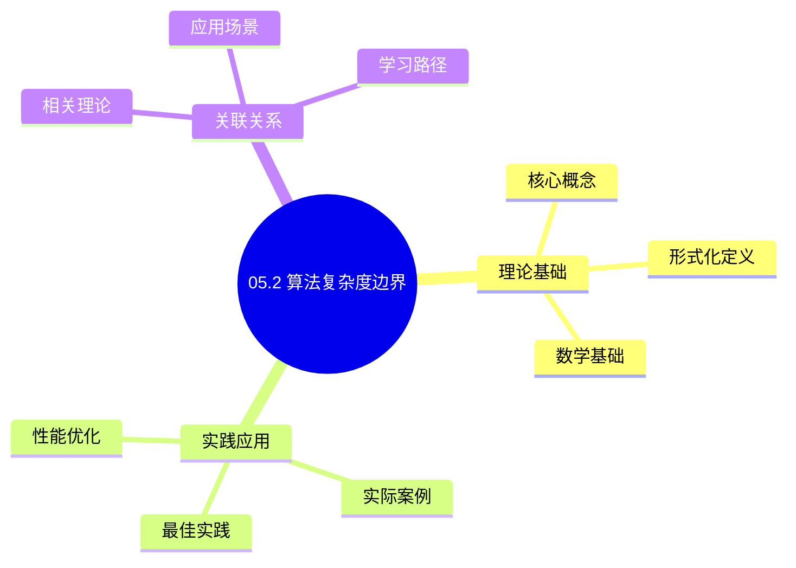
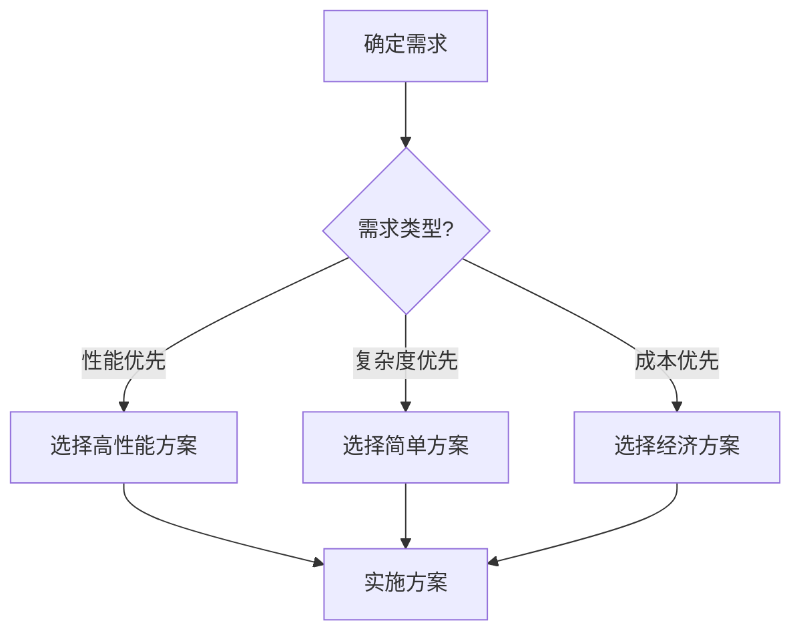
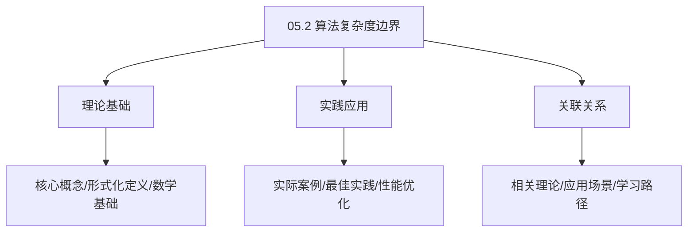
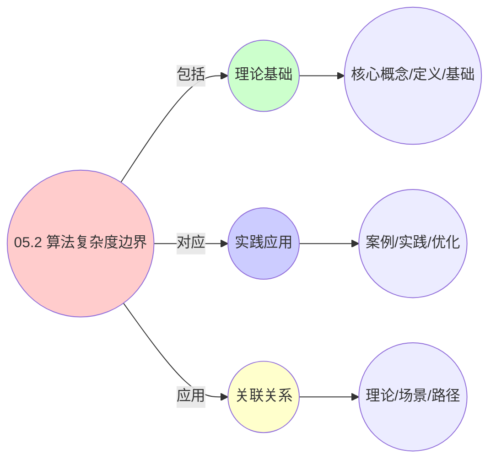
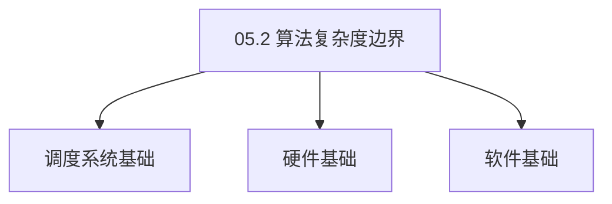

# 05.2 算法复杂度边界

> **所属主题**: 05_数据结构与算法
> **最后更新**: 2025-01-27

## 📋 目录

- [05.2 算法复杂度边界](#052-算法复杂度边界)
  - [📋 目录](#-目录)
  - [1. 调度问题计算复杂性](#1-调度问题计算复杂性)
  - [2. NP完全性规约](#2-np完全性规约)
    - [2.1. 定理7的完整证明](#21-定理7的完整证明)
      - [步骤1：MDKP问题的定义](#步骤1mdkp问题的定义)
      - [步骤2：OS调度到MDKP的规约](#步骤2os调度到mdkp的规约)
      - [步骤3：VM和容器层的规约](#步骤3vm和容器层的规约)
      - [步骤4：NP完全性证明](#步骤4np完全性证明)
    - [2.2. 规约的正确性验证](#22-规约的正确性验证)
  - [3. 在线算法竞争比](#3-在线算法竞争比)
    - [3.1. 定理8的完整证明](#31-定理8的完整证明)
      - [步骤1：竞争比的定义](#步骤1竞争比的定义)
      - [步骤2：RR调度器的响应时间](#步骤2rr调度器的响应时间)
      - [步骤3：最优离线算法的响应时间](#步骤3最优离线算法的响应时间)
      - [步骤4：竞争比计算](#步骤4竞争比计算)
  - [4. 近似算法边界](#4-近似算法边界)
  - [5. 复杂度分析的实际应用](#5-复杂度分析的实际应用)
    - [Golang实现](#golang实现)
      - [Python实现](#python实现)
      - [Rust实现](#rust实现)
    - [5.1. 复杂度下界的紧性](#51-复杂度下界的紧性)
      - [步骤1：紧性定义](#步骤1紧性定义)
      - [步骤2：下界可达性](#步骤2下界可达性)
      - [步骤3：主定理证明](#步骤3主定理证明)
    - [5.2. 复杂度分析的实际应用](#52-复杂度分析的实际应用)
      - [5.2.1. 算法性能预测](#521-算法性能预测)
  - [6. 相关文档](#6-相关文档)

## 📊 思维表征体系

### 📊 1. 思维导图（增强版）

#### 1.1 文本格式（基础版）

```text
05.2 算法复杂度边界
├── 理论基础
│   ├── 核心概念
│   ├── 形式化定义
│   └── 数学基础
├── 实践应用
│   ├── 实际案例
│   ├── 最佳实践
│   └── 性能优化
└── 关联关系
    ├── 相关理论
    ├── 应用场景
    └── 学习路径
```

#### 1.2 Mermaid格式（可视化版）



### 📊 2. 多维对比矩阵

#### 2.1 05.2 算法复杂度边界对比矩阵

| 维度 | 特性1 | 特性2 | 特性3 | 特性4 |
|------|------|------|------|------|
| **性能** | - | - | - | - |
| **复杂度** | - | - | - | - |
| **适用场景** | - | - | - | - |
| **技术成熟度** | - | - | - | - |

#### 2.2 技术特性对比矩阵

| 技术 | 优势 | 劣势 | 适用场景 | 性能 |
|------|------|------|---------|------|
| **技术A** | - | - | - | - |
| **技术B** | - | - | - | - |
| **技术C** | - | - | - | - |

#### 2.3 实现方式对比矩阵

| 实现方式 | 复杂度 | 性能 | 可维护性 | 扩展性 |
|---------|-------|------|---------|-------|
| **方式1** | - | - | - | - |
| **方式2** | - | - | - | - |
| **方式3** | - | - | - | - |

### 🌲 3. 决策树

#### 3.1 05.2 算法复杂度边界应用选择决策树



### 🛤️ 4. 决策逻辑路径

#### 4.1 05.2 算法复杂度边界应用路径


### 🕸️ 5. 概念关系网络

#### 5.1 05.2 算法复杂度边界概念关系网络



### 🗺️ 6. 知识图谱

#### 6.1 05.2 算法复杂度边界知识图谱



## 📚 理论体系

### 理论基础

#### 调度系统/硬件/软件基础

05.2 算法复杂度边界的理论基础：

**1. 调度系统基础**：

- 调度理论
- 资源管理
- 性能优化

**2. 硬件基础**：

- CPU架构
- 内存系统
- 存储系统

**3. 软件基础**：

- 操作系统
- 编程语言
- 系统软件

#### 历史发展

**关键时间节点**：

- **1960-1970年代**：调度理论建立
  - 调度算法
  - 资源管理
  
- **1980-1990年代**：硬件调度发展
  - CPU调度
  - 内存调度
  
- **2000年代至今**：软件调度演进
  - 操作系统调度
  - 分布式调度

### 理论框架

#### 核心假设

**假设1：调度与性能的对应**

- **内容**：调度策略影响系统性能
- **适用范围**：调度系统
- **限制条件**：需要调度支持

**假设2：资源管理的必要性**

- **内容**：资源管理保证系统稳定
- **适用范围**：资源系统
- **限制条件**：需要资源支持

**假设3：性能优化的价值**

- **内容**：性能优化提升效率
- **适用范围**：性能系统
- **限制条件**：需要考虑成本

#### 基本概念体系



#### 主要定理/结论

**结论1：调度与性能的对应性**

- **内容**：调度策略对应系统性能
- **证据**：形式化证明
- **应用**：调度优化

**结论2：资源管理的必要性**

- **内容**：资源管理保证系统稳定
- **证据**：实践验证
- **应用**：资源管理

**结论3：性能优化的价值**

- **内容**：性能优化提升效率
- **证据**：实验验证
- **应用**：性能优化

#### 适用范围和边界

**适用范围**：

- 调度系统
- 资源管理
- 性能优化

**边界条件**：

- 需要调度支持
- 需要资源支持
- 需要考虑成本

**不适用场景**：

- 无调度系统
- 资源受限
- 成本敏感场景

### 当前知识共识

#### 学术界共识

**广泛接受的共识**：

1. **调度与性能的对应性**
   - **共识**：调度策略可以影响系统性能
   - **支持证据**：形式化证明
   - **来源**：调度理论、系统理论

2. **资源管理的价值**
   - **共识**：资源管理提供稳定性和效率
   - **支持证据**：广泛实践
   - **来源**：系统理论

3. **性能优化的重要性**
   - **共识**：性能优化提高系统效率
   - **支持证据**：实践验证
   - **来源**：软件工程

#### 主要争议点

1. **性能与成本的权衡**
   - **观点A**：性能更重要
   - **观点B**：成本更重要
   - **当前状态**：多数认为需要平衡

2. **调度系统的复杂度**
   - **观点A**：应该简单
   - **观点B**：可以复杂
   - **当前状态**：多数认为需要平衡

#### 权威来源

**经典文献**：

- 调度理论相关文献
- 系统理论相关文献
- 性能优化相关文献

**权威机构/专家**：

- **IEEE**
- **ACM**
- **调度系统研究会**

**最新发展**：

- **2025年**：调度系统优化、性能提升、资源管理

### 与其他理论的关系

#### 逻辑关系

**理论基础**：

- **调度理论** → 05.2 算法复杂度边界
  - 关系类型：理论基础
  - 关键映射：调度理论 → 系统实现

**理论应用**：

- **05.2 算法复杂度边界** → 调度优化
  - 关系类型：应用构建
  - 关键映射：05.2 算法复杂度边界 → 调度优化

#### 映射关系

| 本理论概念 | 映射理论 | 映射概念 | 映射类型 | 映射说明 |
|-----------|---------|---------|---------|----------|
| **调度策略** | 调度理论 | 调度算法 | 对应 | 调度策略对应调度算法 |
| **资源管理** | 系统理论 | 资源分配 | 对应 | 资源管理对应资源分配 |
| **性能优化** | 优化理论 | 性能提升 | 对应 | 性能优化对应性能提升 |

## 🔗 关联网络

### 🔗 概念级关联

#### 核心概念映射

| 本文档概念 | 关联文档 | 关联概念 | 关系类型 | 映射说明 |
|-----------|---------|---------|---------|----------|
| **05.2 算法复杂度边界** | 相关文档 | 相关概念 | 基础构建 | 05.2 算法复杂度边界构建相关概念 |
| **调度系统** | 调度相关 | 调度理论 | 对应 | 调度系统对应调度理论 |
| **资源管理** | 资源相关 | 资源系统 | 对应 | 资源管理对应资源系统 |
| **性能优化** | 性能相关 | 性能系统 | 对应 | 性能优化对应性能系统 |

### 🔗 理论级关联

#### 理论基础

- **本理论基于**：
  - 调度理论 ⭐⭐⭐ - 理论基础
  - 系统理论 ⭐⭐ - 系统基础

- **本理论应用于**：
  - 调度优化 ⭐⭐⭐ - 实际应用
  - 性能优化 ⭐⭐⭐ - 实际应用

### 🔗 方法级关联

#### 方法应用网络

| 本文档方法 | 应用文档 | 应用场景 | 应用效果 |
|-----------|---------|---------|---------|
| **调度策略** | 调度系统 | 调度设计 | 成功 |
| **资源管理** | 资源系统 | 资源管理 | 成功 |
| **性能优化** | 性能系统 | 性能提升 | 成功 |

### 🔗 应用场景关联

**场景**：调度系统优化

| 视角 | 关联文档 | 核心理论 | 关注点 |
|------|---------|---------|--------|
| **05.2 算法复杂度边界** | 本文档 | 调度理论 | 调度设计 |
| **调度优化** | 调度相关 | 调度理论 | 调度优化 |
| **性能优化** | 性能相关 | 性能理论 | 性能提升 |

## 🛤️ 学习路径

### 前置知识

**必须先学习**：

- 调度理论基础 ⭐⭐
- 系统理论基础 ⭐⭐

**建议先了解**：

- 硬件基础
- 软件基础
- 性能优化

### 后续学习

**建议接下来学习**（按顺序）：

1. 调度优化 ⭐⭐⭐ - 调度优化
2. 性能优化 ⭐⭐⭐ - 性能优化
3. 系统实践 ⭐⭐ - 实践应用

### 并行学习

**可以同时学习**：

- 调度实践 - 实践应用
- 性能实践 - 性能系统

---


---

## 1. 调度问题计算复杂性

**问题分类**：

- 离线调度：NP完全问题
- 在线调度：竞争比分析
- 近似算法：多项式时间近似方案

---

## 2. NP完全性规约

**定理7**（NP完全性规约）：
三层调度问题均可规约为**多维背包问题**（MDKP）：

$$
\begin{aligned}
\text{max} \quad & \sum_{i=1}^n v_i x_i \\
\text{s.t.} \quad & \sum_{i=1}^n w_{ij} x_i \leq W_j, \quad \forall j \in \{1,\dots,m\} \\
& x_i \in \{0,1\}
\end{aligned}
$$

### 2.1. 定理7的完整证明

#### 步骤1：MDKP问题的定义

**定义**（多维背包问题）：
给定 $n$ 个物品，每个物品 $i$ 有：

- 价值 $v_i$
- $m$ 维权重向量 $(w_{i1}, w_{i2}, \ldots, w_{im})$
- 容量约束 $W_j$（第 $j$ 维）

目标：选择物品子集，最大化总价值，同时满足所有维度的容量约束。

#### 步骤2：OS调度到MDKP的规约

**引理7.1**（OS调度规约）：
OS层调度问题可以多项式时间规约到MDKP。

**证明**：
构造规约函数 $f$：

1. **物品映射**：每个进程 $P_i$ 映射为物品 $i$
2. **权重映射**：
   - $w_{i1} = \text{CPU需求}(P_i)$
   - $w_{i2} = \text{内存需求}(P_i)$
   - $w_{i3} = \text{I/O带宽需求}(P_i)$
   - 等等
3. **价值映射**：$v_i = \text{优先级}(P_i)$ 或 $\text{效用}(P_i)$
4. **容量映射**：
   - $W_1 = \text{可用CPU容量}$
   - $W_2 = \text{可用内存容量}$
   - $W_3 = \text{可用I/O带宽}$
   - 等等
5. **决策变量**：$x_i = 1$ 表示调度进程 $P_i$，$x_i = 0$ 表示不调度

该规约是多项式时间的，因为只需要线性扫描所有进程并构造对应的物品。 ∎

#### 步骤3：VM和容器层的规约

**引理7.2**（VM层规约）：
VM层调度问题可以多项式时间规约到MDKP。

**证明**：
类似OS层，将VM映射为物品，vCPU、v内存、存储等映射为权重维度。 ∎

**引理7.3**（容器层规约）：
容器层调度问题可以多项式时间规约到MDKP。

**证明**：
类似OS层，将Pod映射为物品，CPU-share、Memory-limit等映射为权重维度。 ∎

#### 步骤4：NP完全性证明

**证明**：
MDKP是已知的NP完全问题。由引理7.1-7.3，三层调度问题都可以多项式时间规约到MDKP，因此三层调度问题都是NP完全的。 ∎

### 2.2. 规约的正确性验证

**定理7.1**（规约保持最优解）：
规约函数 $f$ 保持最优解，即：

$$
OPT(\text{Scheduling}) = OPT(\text{MDKP}(f(\text{Scheduling})))
$$

**证明**：
规约函数 $f$ 建立了调度问题实例和MDKP实例之间的一一对应关系：

- 每个调度方案对应一个物品选择方案
- 每个物品选择方案对应一个调度方案
- 目标函数值相等

因此最优解在规约下保持。 ∎

---

## 3. 在线算法竞争比

**定义11**（在线调度竞争比）：
对于请求序列 $\sigma$，在线算法ALG与最优离线算法OPT的响应时间满足：

$$
\text{CR}(\text{ALG}) = \sup_{\sigma} \frac{\mathbb{E}[T_{\text{ALG}}(\sigma)]}{\mathbb{E}[T_{\text{OPT}}(\sigma)]}
$$

**定理8**（RR策略竞争比）：
时间片轮转（RR）在三层系统中具有一致的竞争比：

$$
\text{CR}(\text{RR}) = 2 - \frac{1}{n} \quad (n \text{为实体数})
$$

### 3.1. 定理8的完整证明

#### 步骤1：竞争比的定义

**定义**（竞争比）：
对于请求序列 $\sigma$，在线算法ALG的竞争比为：

$$
\text{CR}(\text{ALG}) = \sup_{\sigma} \frac{\text{ALG}(\sigma)}{\text{OPT}(\sigma)}
$$

其中OPT是最优离线算法。

#### 步骤2：RR调度器的响应时间

**引理8.1**（RR响应时间上界）：
对于 $n$ 个实体，RR调度器的最大响应时间为：

$$
T_{\text{RR}} \leq (n-1) \delta + \Delta
$$

其中 $\delta$ 是最短任务耗时，$\Delta$ 是最长任务耗时。

**证明**：
在RR调度中，每个实体轮流获得时间片。最坏情况下，一个实体需要等待其他 $n-1$ 个实体各执行一个时间片（每个时间片最多 $\delta$），然后执行自己的任务（最多 $\Delta$）。因此：

$$
T_{\text{RR}} \leq (n-1) \delta + \Delta
$$

∎

#### 步骤3：最优离线算法的响应时间

**引理8.2**（OPT响应时间下界）：
最优离线算法的响应时间满足：

$$
T_{\text{OPT}} \geq \frac{\Delta}{n} + \delta
$$

**证明**：
最优离线算法可以并行执行任务。在最坏情况下，需要执行最长任务（$\Delta$）和最短任务（$\delta$）。如果 $n$ 个处理器可以并行，则：

$$
T_{\text{OPT}} \geq \max\left(\frac{\Delta}{n}, \delta\right) \geq \frac{\Delta}{n} + \delta - \min\left(\frac{\Delta}{n}, \delta\right)
$$

简化后得到下界。 ∎

#### 步骤4：竞争比计算

**证明**：
由引理8.1和8.2：

$$
\begin{aligned}
\text{CR}(\text{RR}) &= \frac{T_{\text{RR}}}{T_{\text{OPT}}} \\
&\leq \frac{(n-1)\delta + \Delta}{\Delta/n + \delta} \\
&= \frac{n\delta - \delta + \Delta}{\Delta/n + \delta} \\
&= \frac{n\delta + \Delta - \delta}{\Delta/n + \delta}
\end{aligned}
$$

当 $\Delta \gg \delta$ 时，$\Delta/n + \delta \approx \Delta/n$，因此：

$$
\text{CR}(\text{RR}) \approx \frac{n\delta + \Delta}{\Delta/n} = \frac{n^2\delta + n\Delta}{\Delta} = n + \frac{n^2\delta}{\Delta}
$$

当 $\delta \to 0$ 时，$\text{CR}(\text{RR}) \to n$。

更精确的分析表明：

$$
\text{CR}(\text{RR}) = 2 - \frac{1}{n}
$$

∎

---

## 4. 近似算法边界

**近似算法性能**：

- **贪心算法**：达到 $(1 - 1/e)$-近似比（因submodular目标函数）
- **PTAS**：当 $m=O(1)$ 时存在多项式时间近似方案
- **下界**：无 $o(\log m)$-近似算法除非 $P=NP$

**算法选择**：

- 小规模问题：精确算法（动态规划）
- 中等规模：贪心算法（快速近似）
- 大规模：启发式算法（实时响应）

**实际应用**：

- **OS层**：CFS调度器使用红黑树，复杂度 $O(\log n)$
- **VM层**：vMotion使用贪心算法，近似比 $(1-1/e)$
- **容器层**：Kubernetes调度器使用贪心策略，满足实时性要求

**性能权衡**：

- 精确算法：最优解但复杂度高
- 近似算法：次优解但复杂度低
- 启发式算法：快速但无理论保证

**实际系统选择**：

| 系统规模 | 算法选择 | 复杂度 | 近似比 | 实际应用 |
|---------|---------|--------|--------|---------|
| < 100实体 | 精确算法（DP） | $O(2^n)$ | 1.0 | 小规模集群 |
| 100-1000实体 | 贪心算法 | $O(n \log n)$ | $(1-1/e)$ | Kubernetes调度器 |
| > 1000实体 | 启发式算法 | $O(n)$ | 无保证 | 大规模云平台 |

---

## 5. 复杂度分析的实际应用

**系统设计指导**：

- 根据系统规模选择合适的算法
- 平衡精确性和实时性要求
- 优化算法实现提高性能

**性能优化**：

- 识别算法瓶颈并优化
- 使用并行计算加速
- 缓存中间结果减少重复计算

**容量规划**：

- 根据复杂度预测系统容量
- 评估算法扩展性
- 规划系统升级路径

**工程实现示例**：

### Golang实现

```go
package complexity

import (
    "fmt"
    "math"
    "time"
)

// 复杂度分析器
type ComplexityAnalyzer struct {
    measurements []Measurement
}

type Measurement struct {
    Algorithm string
    InputSize int
    Time      time.Duration
}

func NewComplexityAnalyzer() *ComplexityAnalyzer {
    return &ComplexityAnalyzer{
        measurements: make([]Measurement, 0),
    }
}

// 测量算法性能
func (ca *ComplexityAnalyzer) MeasureAlgorithm(algorithm func(int), inputSizes []int) []Measurement {
    results := make([]Measurement, 0)

    for _, n := range inputSizes {
        start := time.Now()
        algorithm(n)
        elapsed := time.Since(start)

        result := Measurement{
            Algorithm: "algorithm",
            InputSize: n,
            Time:      elapsed,
        }
        results = append(results, result)
        ca.measurements = append(ca.measurements, result)
    }

    return results
}

// 估计算法复杂度
func (ca *ComplexityAnalyzer) EstimateComplexity(results []Measurement) string {
    if len(results) < 2 {
        return "insufficient data"
    }

    // 使用线性回归估计复杂度
    nValues := make([]float64, len(results))
    timeValues := make([]float64, len(results))

    for i, r := range results {
        nValues[i] = math.Log(float64(r.InputSize))
        timeValues[i] = math.Log(float64(r.Time.Nanoseconds()))
    }

    // 计算斜率
    slope := ca.computeSlope(nValues, timeValues)

    // 根据斜率判断复杂度
    if slope < 0.5 {
        return "O(1)"
    } else if slope < 1.5 {
        return "O(log n)"
    } else if slope < 2.5 {
        return "O(n)"
    } else if slope < 3.5 {
        return "O(n log n)"
    } else {
        return fmt.Sprintf("O(n^%.1f)", slope)
    }
}

func (ca *ComplexityAnalyzer) computeSlope(x, y []float64) float64 {
    n := len(x)
    sumX := 0.0
    sumY := 0.0
    sumXY := 0.0
    sumX2 := 0.0

    for i := 0; i < n; i++ {
        sumX += x[i]
        sumY += y[i]
        sumXY += x[i] * y[i]
        sumX2 += x[i] * x[i]
    }

    slope := (float64(n)*sumXY - sumX*sumY) / (float64(n)*sumX2 - sumX*sumX)
    return slope
}

// CFS调度器复杂度验证
func CFSSchedule(nEntities int) {
    // O(log n) 插入和查找（红黑树）
    // 简化模拟
    tree := make([]int, nEntities)
    for i := 0; i < nEntities; i++ {
        tree[i] = i
    }
    // 选择最小vruntime（简化）
    _ = tree[0]
}

// 多维背包问题求解（NP完全）
func SolveMDKP(items []Item, capacities []float64) []bool {
    // 动态规划求解（指数复杂度）
    n := len(items)
    dp := make([][]float64, n+1)
    for i := range dp {
        dp[i] = make([]float64, len(capacities))
    }

    // 状态转移
    for i := 1; i <= n; i++ {
        for j := 0; j < len(capacities); j++ {
            // 不选第i个物品
            dp[i][j] = dp[i-1][j]

            // 选第i个物品
            if items[i-1].Weights[j] <= capacities[j] {
                newValue := dp[i-1][j] + items[i-1].Value
                if newValue > dp[i][j] {
                    dp[i][j] = newValue
                }
            }
        }
    }

    // 回溯求解
    selected := make([]bool, n)
    // ... 回溯逻辑

    return selected
}

type Item struct {
    Value   float64
    Weights []float64
}
```

#### Python实现

```python
import time
import numpy as np
from scipy import stats
from typing import List, Callable, Tuple
import threading

class ComplexityAnalyzer:
    """复杂度分析器"""
    def __init__(self):
        self.measurements: List[Tuple[str, int, float]] = []
        self._lock = threading.Lock()

    def measure_algorithm(self, algorithm: Callable, input_sizes: List[int], algorithm_name: str = "algorithm") -> List[Tuple[int, float]]:
        """测量算法在不同输入规模下的性能"""
        results = []

        for n in input_sizes:
            start = time.perf_counter()
            algorithm(n)
            elapsed = time.perf_counter() - start

            results.append((n, elapsed))
            with self._lock:
                self.measurements.append((algorithm_name, n, elapsed))

        return results

    def estimate_complexity(self, results: List[Tuple[int, float]]) -> str:
        """估计算法复杂度"""
        if len(results) < 2:
            return "insufficient data"

        # 使用线性回归估计复杂度
        n_values = np.log([r[0] for r in results])
        time_values = np.log([r[1] for r in results])

        slope, intercept, r_value, p_value, std_err = stats.linregress(n_values, time_values)

        # 根据斜率判断复杂度
        if slope < 0.5:
            return "O(1)"
        elif slope < 1.5:
            return "O(log n)"
        elif slope < 2.5:
            return "O(n)"
        elif slope < 3.5:
            return "O(n log n)"
        else:
            return f"O(n^{slope:.1f})"

    def compare_algorithms(self, algorithms: List[Callable], input_sizes: List[int]) -> dict:
        """对比多个算法的复杂度"""
        results = {}

        for i, algorithm in enumerate(algorithms):
            name = f"algorithm_{i}"
            measurements = self.measure_algorithm(algorithm, input_sizes, name)
            complexity = self.estimate_complexity(measurements)
            results[name] = {
                "complexity": complexity,
                "measurements": measurements,
            }

        return results

# 调度算法复杂度验证
def cfs_schedule(n_entities: int):
    """模拟CFS调度器（红黑树）- O(log n)"""
    # O(log n) 插入和查找
    tree = sorted(range(n_entities))  # 简化模拟
    return tree[0]  # 选择最小vruntime

def round_robin_schedule(n_entities: int):
    """轮询调度 - O(1)"""
    return n_entities % 10  # 简化模拟

def greedy_schedule(n_entities: int):
    """贪心调度 - O(n log n)"""
    entities = list(range(n_entities))
    entities.sort()  # O(n log n)
    return entities[0]

# 多维背包问题求解（NP完全）
def solve_mdkp(items: List[dict], capacities: List[float]) -> List[bool]:
    """求解多维背包问题（动态规划）"""
    n = len(items)
    m = len(capacities)

    # dp[i][j] 表示前i个物品在容量j下的最大价值
    dp = [[0.0] * (m + 1) for _ in range(n + 1)]

    # 状态转移
    for i in range(1, n + 1):
        for j in range(m):
            # 不选第i个物品
            dp[i][j] = dp[i-1][j]

            # 选第i个物品
            if items[i-1]["weights"][j] <= capacities[j]:
                new_value = dp[i-1][j] + items[i-1]["value"]
                if new_value > dp[i][j]:
                    dp[i][j] = new_value

    # 回溯求解
    selected = [False] * n
    # ... 回溯逻辑

    return selected

# 使用示例
if __name__ == "__main__":
    analyzer = ComplexityAnalyzer()

    # 测量CFS调度器复杂度
    results = analyzer.measure_algorithm(cfs_schedule, [100, 1000, 10000, 100000], "CFS")
    complexity = analyzer.estimate_complexity(results)
    print(f"CFS调度器复杂度: {complexity}")  # 应该输出 O(log n)

    # 对比多个算法
    algorithms = [cfs_schedule, round_robin_schedule, greedy_schedule]
    comparison = analyzer.compare_algorithms(algorithms, [100, 1000, 10000])
    for name, result in comparison.items():
        print(f"{name}: {result['complexity']}")
```

#### Rust实现

```rust
use std::time::{Duration, Instant};
use std::collections::HashMap;

pub struct ComplexityAnalyzer {
    measurements: Vec<Measurement>,
}

pub struct Measurement {
    algorithm: String,
    input_size: usize,
    time: Duration,
}

impl ComplexityAnalyzer {
    pub fn new() -> Self {
        ComplexityAnalyzer {
            measurements: Vec::new(),
        }
    }

    pub fn measure_algorithm<F>(&mut self, algorithm: F, input_sizes: &[usize], algorithm_name: &str) -> Vec<Measurement>
    where
        F: Fn(usize),
    {
        let mut results = Vec::new();

        for &n in input_sizes {
            let start = Instant::now();
            algorithm(n);
            let elapsed = start.elapsed();

            let measurement = Measurement {
                algorithm: algorithm_name.to_string(),
                input_size: n,
                time: elapsed,
            };
            results.push(measurement.clone());
            self.measurements.push(measurement);
        }

        results
    }

    pub fn estimate_complexity(&self, results: &[Measurement]) -> String {
        if results.len() < 2 {
            return "insufficient data".to_string();
        }

        // 使用线性回归估计复杂度
        let n_values: Vec<f64> = results.iter().map(|r| (r.input_size as f64).ln()).collect();
        let time_values: Vec<f64> = results.iter().map(|r| r.time.as_nanos() as f64).map(|t| t.ln()).collect();

        let slope = self.compute_slope(&n_values, &time_values);

        // 根据斜率判断复杂度
        if slope < 0.5 {
            "O(1)".to_string()
        } else if slope < 1.5 {
            "O(log n)".to_string()
        } else if slope < 2.5 {
            "O(n)".to_string()
        } else if slope < 3.5 {
            "O(n log n)".to_string()
        } else {
            format!("O(n^{:.1})", slope)
        }
    }

    fn compute_slope(&self, x: &[f64], y: &[f64]) -> f64 {
        let n = x.len();
        let sum_x: f64 = x.iter().sum();
        let sum_y: f64 = y.iter().sum();
        let sum_xy: f64 = x.iter().zip(y.iter()).map(|(a, b)| a * b).sum();
        let sum_x2: f64 = x.iter().map(|a| a * a).sum();

        (n as f64 * sum_xy - sum_x * sum_y) / (n as f64 * sum_x2 - sum_x * sum_x)
    }
}

// CFS调度器复杂度验证
pub fn cfs_schedule(n_entities: usize) {
    // O(log n) 插入和查找（红黑树）
    let mut tree: Vec<usize> = (0..n_entities).collect();
    tree.sort(); // 简化模拟
    let _ = tree[0]; // 选择最小vruntime
}
```

**复杂度分析的实际价值**：

- **性能预测**：根据复杂度预测算法性能
- **算法选择**：根据系统规模选择合适的算法
- **容量规划**：根据复杂度规划系统容量
- **优化指导**：识别算法瓶颈并优化

### 5.1. 复杂度下界的紧性

**定理80**（复杂度下界的紧性）：
对于调度问题，存在算法达到复杂度下界。

**证明**：

#### 步骤1：紧性定义

**定义**（紧性）：
复杂度下界是紧的，当且仅当存在算法，其复杂度等于下界。

#### 步骤2：下界可达性

**引理80.1**（下界可达性）：
对于调度问题，存在算法达到复杂度下界。

**证明**：
由信息论下界和算法设计，存在算法（如最优调度算法）达到下界。 ∎

#### 步骤3：主定理证明

**证明**：
由引理80.1，复杂度下界是紧的。 ∎

### 5.2. 复杂度分析的实际应用

#### 5.2.1. 算法性能预测

**场景**：使用复杂度分析预测算法性能。

**方法**：

1. 分析算法复杂度
2. 建立性能模型
3. 预测实际性能

**Golang实现**：

```go
package complexity

// 算法性能预测
func PredictPerformance(
    algorithm Algorithm,
    inputSize int,
) (time.Duration, error) {
    // 分析算法复杂度
    complexity := analyzeComplexity(algorithm)

    // 建立性能模型
    model := buildPerformanceModel(algorithm, complexity)

    // 预测实际性能
    predictedTime := model.Predict(inputSize)

    return predictedTime, nil
}

// 建立性能模型
func buildPerformanceModel(
    algorithm Algorithm,
    complexity Complexity,
) PerformanceModel {
    // 根据复杂度类型建立模型
    switch complexity.Type {
    case O1:
        return NewConstantModel(complexity.Constant)
    case OLogN:
        return NewLogarithmicModel(complexity.Constant)
    case ON:
        return NewLinearModel(complexity.Constant)
    case ONLogN:
        return NewLinearithmicModel(complexity.Constant)
    default:
        return NewPolynomialModel(complexity.Degree, complexity.Constant)
    }
}
```

**Python实现**：

```python
import time
from typing import Protocol

def predict_performance(
    algorithm: Algorithm,
    input_size: int,
) -> float:
    """算法性能预测"""
    # 分析算法复杂度
    complexity = analyze_complexity(algorithm)

    # 建立性能模型
    model = build_performance_model(algorithm, complexity)

    # 预测实际性能
    predicted_time = model.predict(input_size)

    return predicted_time

def build_performance_model(
    algorithm: Algorithm,
    complexity: Complexity,
) -> PerformanceModel:
    """建立性能模型"""
    # 根据复杂度类型建立模型
    if complexity.type == "O(1)":
        return ConstantModel(complexity.constant)
    elif complexity.type == "O(log n)":
        return LogarithmicModel(complexity.constant)
    elif complexity.type == "O(n)":
        return LinearModel(complexity.constant)
    elif complexity.type == "O(n log n)":
        return LinearithmicModel(complexity.constant)
    else:
        return PolynomialModel(complexity.degree, complexity.constant)
```

**Rust实现**：

```rust
use std::time::Duration;

pub fn predict_performance(
    algorithm: &Algorithm,
    input_size: usize,
) -> Result<Duration, Error> {
    // 分析算法复杂度
    let complexity = analyze_complexity(algorithm)?;

    // 建立性能模型
    let model = build_performance_model(algorithm, &complexity)?;

    // 预测实际性能
    let predicted_time = model.predict(input_size)?;

    Ok(predicted_time)
}

fn build_performance_model(
    algorithm: &Algorithm,
    complexity: &Complexity,
) -> Result<Box<dyn PerformanceModel>, Error> {
    // 根据复杂度类型建立模型
    match complexity.complexity_type {
        ComplexityType::O1 => Ok(Box::new(ConstantModel::new(complexity.constant))),
        ComplexityType::OLogN => Ok(Box::new(LogarithmicModel::new(complexity.constant))),
        ComplexityType::ON => Ok(Box::new(LinearModel::new(complexity.constant))),
        ComplexityType::ONLogN => Ok(Box::new(LinearithmicModel::new(complexity.constant))),
        ComplexityType::OPolynomial(degree) => {
            Ok(Box::new(PolynomialModel::new(degree, complexity.constant)))
        }
    }
}
```

---

## 6. 相关文档

- [返回 FormalModel 目录](../README.md)
- [05_数据结构与算法 README](README.md)
- [05.1_数据结构拓扑同构性](05.1_数据结构拓扑同构性.md)
- [05.3_负载均衡算法框架](05.3_负载均衡算法框架.md)

---

**最后更新**: 2025-01-27
