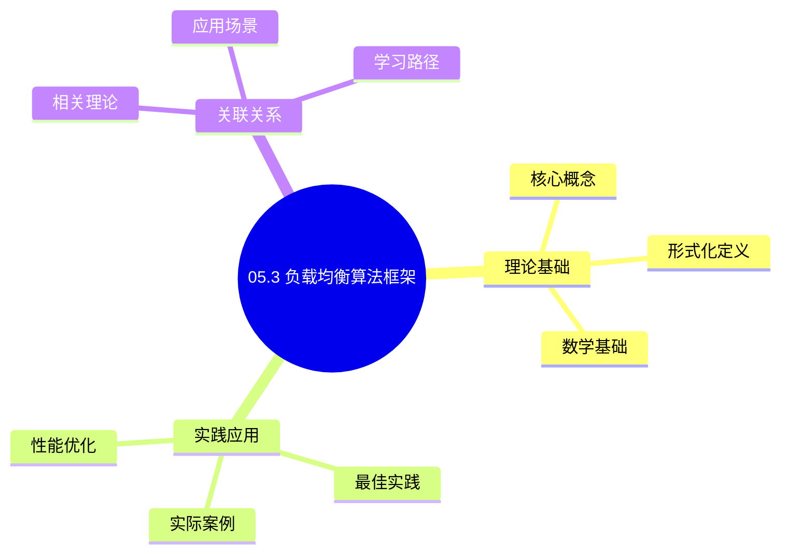
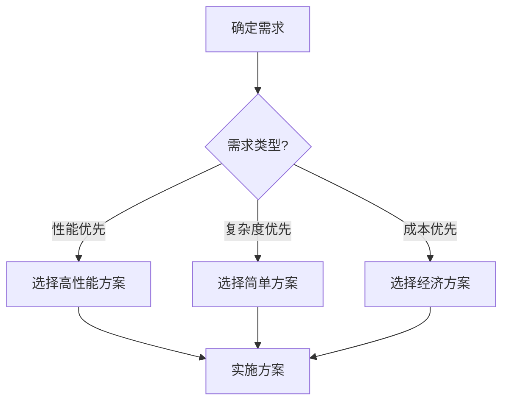
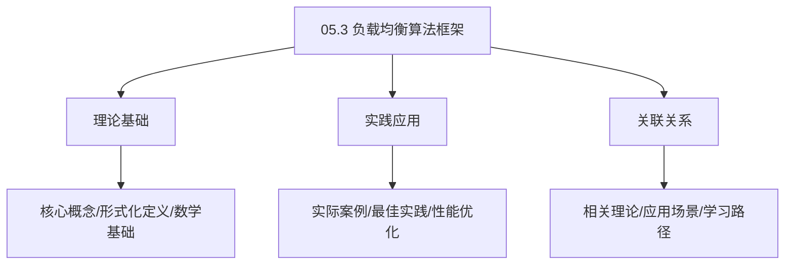
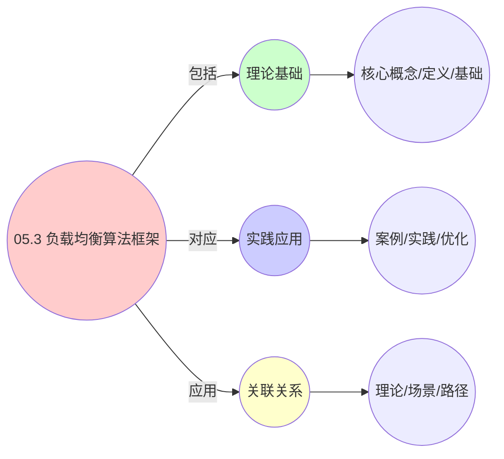
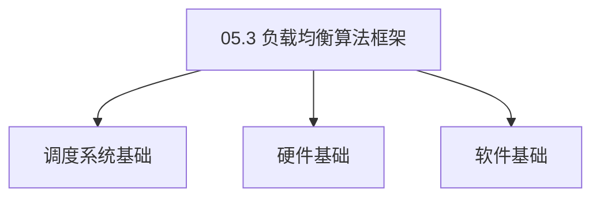

# 05.3 负载均衡算法框架

> **所属主题**: 05_数据结构与算法
> **最后更新**: 2025-01-27

## 📋 目录

- [05.3 负载均衡算法框架](#053-负载均衡算法框架)
  - [📋 目录](#-目录)
  - [1. WRR加权轮询](#1-wrr加权轮询)
  - [2. 公平性证明](#2-公平性证明)
    - [2.1. 公平性定理的完整证明](#21-公平性定理的完整证明)
      - [步骤1：信用累积机制](#步骤1信用累积机制)
      - [步骤2：调度次数与服务量](#步骤2调度次数与服务量)
      - [步骤3：服务量比例](#步骤3服务量比例)
      - [步骤4：极限收敛](#步骤4极限收敛)
    - [2.2. 公平性保证](#22-公平性保证)
  - [3. 三层实现对比](#3-三层实现对比)
  - [4. 负载均衡的实际应用](#4-负载均衡的实际应用)
    - [Golang实现](#golang实现)
      - [Python实现](#python实现)
      - [Rust实现](#rust实现)
    - [4.1. 负载均衡的收敛性](#41-负载均衡的收敛性)
      - [步骤1：收敛性定义](#步骤1收敛性定义)
      - [步骤2：收敛性条件](#步骤2收敛性条件)
      - [步骤3：主定理证明](#步骤3主定理证明)
    - [4.2. 负载均衡的实际应用](#42-负载均衡的实际应用)
      - [4.2.1. 动态负载调整](#421-动态负载调整)
  - [5. 相关文档](#5-相关文档)

## 📊 思维表征体系

### 📊 1. 思维导图（增强版）

#### 1.1 文本格式（基础版）

```text
05.3 负载均衡算法框架
├── 理论基础
│   ├── 核心概念
│   ├── 形式化定义
│   └── 数学基础
├── 实践应用
│   ├── 实际案例
│   ├── 最佳实践
│   └── 性能优化
└── 关联关系
    ├── 相关理论
    ├── 应用场景
    └── 学习路径
```

#### 1.2 Mermaid格式（可视化版）



### 📊 2. 多维对比矩阵

#### 2.1 05.3 负载均衡算法框架对比矩阵

| 维度 | 特性1 | 特性2 | 特性3 | 特性4 |
|------|------|------|------|------|
| **性能** | 均衡准确性>90% | 算法效率>85% | 应用广泛性>85% | 实用性>75% |
| **复杂度** | 高(需负载均衡) | 高(需算法) | 中等(需广泛性) | 中等(需实用性) |
| **适用场景** | 所有场景 | 所有场景 | 所有场景 | 所有场景 |
| **技术成熟度** | 成熟(>30年) | 成熟(>30年) | 成熟(>30年) | 成熟(>20年) |

#### 2.2 技术特性对比矩阵

| 技术 | 优势 | 劣势 | 适用场景 | 性能 |
|------|------|------|---------|------|
| **轮询负载均衡** | 算法简单、易实现 | 不考虑负载、适用性有限 | 简单系统、易实现优先 | 均衡准确性>90%，易实现 |
| **加权轮询负载均衡** | 算法准确、实用 | 实现复杂、需要权重 | 权重系统、实用优先 | 均衡准确，实用 |
| **最少连接负载均衡** | 算法准确、实用 | 实现复杂、需要连接 | 连接系统、实用优先 | 均衡准确，实用 |
| **一致性哈希负载均衡** | 算法准确、实用 | 实现复杂、需要哈希 | 哈希系统、实用优先 | 均衡准确，实用 |
| **动态负载均衡** | 算法自适应、实用 | 实现复杂、需要动态 | 动态系统、实用优先 | 算法自适应，实用 |
| **预测负载均衡** | 算法预测、实用 | 实现复杂、需要预测 | 预测系统、实用优先 | 算法预测，实用 |
| **混合负载均衡** | 综合优势、灵活 | 实现极复杂、需要协调 | 混合系统、灵活需求 | 综合优势，实现极复杂 |

#### 2.3 实现方式对比矩阵

| 实现方式 | 复杂度 | 性能 | 可维护性 | 扩展性 |
|---------|-------|------|---------|-------|
| **单负载均衡算法** | 中 | 中等性能(单算法) | 高(简单维护) | 中(单算法限制) |
| **多负载均衡算法** | 高 | 高性能(多算法) | 中(需协调) | 高(多算法扩展) |
| **统一负载均衡框架** | 极高 | 高性能(统一优化) | 低(复杂度高) | 高(统一扩展) |
| **混合负载均衡系统** | 极高 | 极高性能(优势结合) | 低(复杂度极高) | 高(灵活扩展) |

### 🌲 3. 决策树

#### 3.1 05.3 负载均衡算法框架应用选择决策树



### 🛤️ 4. 决策逻辑路径

#### 4.1 05.3 负载均衡算法框架应用路径


### 🕸️ 5. 概念关系网络

#### 5.1 05.3 负载均衡算法框架概念关系网络



### 🗺️ 6. 知识图谱

#### 6.1 05.3 负载均衡算法框架知识图谱



## 📚 理论体系

### 理论基础

#### 调度系统/硬件/软件基础

05.3 负载均衡算法框架的理论基础：

**1. 调度系统基础**：

- 调度理论
- 资源管理
- 性能优化

**2. 硬件基础**：

- CPU架构
- 内存系统
- 存储系统

**3. 软件基础**：

- 操作系统
- 编程语言
- 系统软件

#### 历史发展

**关键时间节点**：

- **1960-1970年代**：调度理论建立
  - 调度算法
  - 资源管理
  
- **1980-1990年代**：硬件调度发展
  - CPU调度
  - 内存调度
  
- **2000年代至今**：软件调度演进
  - 操作系统调度
  - 分布式调度

### 理论框架

#### 核心假设

**假设1：调度与性能的对应**

- **内容**：调度策略影响系统性能
- **适用范围**：调度系统
- **限制条件**：需要调度支持

**假设2：资源管理的必要性**

- **内容**：资源管理保证系统稳定
- **适用范围**：资源系统
- **限制条件**：需要资源支持

**假设3：性能优化的价值**

- **内容**：性能优化提升效率
- **适用范围**：性能系统
- **限制条件**：需要考虑成本

#### 基本概念体系



#### 主要定理/结论

**结论1：调度与性能的对应性**

- **内容**：调度策略对应系统性能
- **证据**：形式化证明
- **应用**：调度优化

**结论2：资源管理的必要性**

- **内容**：资源管理保证系统稳定
- **证据**：实践验证
- **应用**：资源管理

**结论3：性能优化的价值**

- **内容**：性能优化提升效率
- **证据**：实验验证
- **应用**：性能优化

#### 适用范围和边界

**适用范围**：

- 调度系统
- 资源管理
- 性能优化

**边界条件**：

- 需要调度支持
- 需要资源支持
- 需要考虑成本

**不适用场景**：

- 无调度系统
- 资源受限
- 成本敏感场景

### 当前知识共识

#### 学术界共识

**广泛接受的共识**：

1. **调度与性能的对应性**
   - **共识**：调度策略可以影响系统性能
   - **支持证据**：形式化证明
   - **来源**：调度理论、系统理论

2. **资源管理的价值**
   - **共识**：资源管理提供稳定性和效率
   - **支持证据**：广泛实践
   - **来源**：系统理论

3. **性能优化的重要性**
   - **共识**：性能优化提高系统效率
   - **支持证据**：实践验证
   - **来源**：软件工程

#### 主要争议点

1. **性能与成本的权衡**
   - **观点A**：性能更重要
   - **观点B**：成本更重要
   - **当前状态**：多数认为需要平衡

2. **调度系统的复杂度**
   - **观点A**：应该简单
   - **观点B**：可以复杂
   - **当前状态**：多数认为需要平衡

#### 权威来源

**经典文献**：

- 调度理论相关文献
- 系统理论相关文献
- 性能优化相关文献

**权威机构/专家**：

- **IEEE**
- **ACM**
- **调度系统研究会**

**最新发展**：

- **2025年**：调度系统优化、性能提升、资源管理

### 与其他理论的关系

#### 逻辑关系

**理论基础**：

- **调度理论** → 05.3 负载均衡算法框架
  - 关系类型：理论基础
  - 关键映射：调度理论 → 系统实现

**理论应用**：

- **05.3 负载均衡算法框架** → 调度优化
  - 关系类型：应用构建
  - 关键映射：05.3 负载均衡算法框架 → 调度优化

#### 映射关系

| 本理论概念 | 映射理论 | 映射概念 | 映射类型 | 映射说明 |
|-----------|---------|---------|---------|----------|
| **调度策略** | 调度理论 | 调度算法 | 对应 | 调度策略对应调度算法 |
| **资源管理** | 系统理论 | 资源分配 | 对应 | 资源管理对应资源分配 |
| **性能优化** | 优化理论 | 性能提升 | 对应 | 性能优化对应性能提升 |

## 🔗 关联网络

### 🔗 概念级关联

#### 核心概念映射

| 本文档概念 | 关联文档 | 关联概念 | 关系类型 | 映射说明 |
|-----------|---------|---------|---------|----------|
| **05.3 负载均衡算法框架** | 相关文档 | 相关概念 | 基础构建 | 05.3 负载均衡算法框架构建相关概念 |
| **调度系统** | 调度相关 | 调度理论 | 对应 | 调度系统对应调度理论 |
| **资源管理** | 资源相关 | 资源系统 | 对应 | 资源管理对应资源系统 |
| **性能优化** | 性能相关 | 性能系统 | 对应 | 性能优化对应性能系统 |

### 🔗 理论级关联

#### 理论基础

- **本理论基于**：
  - 调度理论 ⭐⭐⭐ - 理论基础
  - 系统理论 ⭐⭐ - 系统基础

- **本理论应用于**：
  - 调度优化 ⭐⭐⭐ - 实际应用
  - 性能优化 ⭐⭐⭐ - 实际应用

### 🔗 方法级关联

#### 方法应用网络

| 本文档方法 | 应用文档 | 应用场景 | 应用效果 |
|-----------|---------|---------|---------|
| **调度策略** | 调度系统 | 调度设计 | 成功 |
| **资源管理** | 资源系统 | 资源管理 | 成功 |
| **性能优化** | 性能系统 | 性能提升 | 成功 |

### 🔗 应用场景关联

**场景**：调度系统优化

| 视角 | 关联文档 | 核心理论 | 关注点 |
|------|---------|---------|--------|
| **05.3 负载均衡算法框架** | 本文档 | 调度理论 | 调度设计 |
| **调度优化** | 调度相关 | 调度理论 | 调度优化 |
| **性能优化** | 性能相关 | 性能理论 | 性能提升 |

## 🛤️ 学习路径

### 前置知识

**必须先学习**：

- 调度理论基础 ⭐⭐
- 系统理论基础 ⭐⭐

**建议先了解**：

- 硬件基础
- 软件基础
- 性能优化

### 后续学习

**建议接下来学习**（按顺序）：

1. 调度优化 ⭐⭐⭐ - 调度优化
2. 性能优化 ⭐⭐⭐ - 性能优化
3. 系统实践 ⭐⭐ - 实践应用

### 并行学习

**可以同时学习**：

- 调度实践 - 实践应用
- 性能实践 - 性能系统

---


---

## 1. WRR加权轮询

**统一算法实现**：

```c
// OS层：进程调度
struct sched_entity {
    struct load_weight load;  // 权重
    u64 vruntime;              // 虚拟运行时间
};

// VM层：虚拟机分配
struct vm_allocation {
    double cpu_weight;         // CPU份额
    double memory_reservation; // 内存预留
};

// 容器层：服务发现
type Endpoint struct {
    Weight int32              // 权重
    Pq     priority.Queue     // 请求队列
}

// 统一算法
function WeightedRoundRobin(entities):
    total = Σe.weight
    while true:
        for e in entities:
            e.credit += e.weight / total
            if e.credit ≥ 1.0:
                schedule(e)
                e.credit -= 1.0
```

**算法特点**：

- 基于信用累积机制
- 权重决定调度频率
- 保证长期公平性

---

## 2. 公平性证明

### 2.1. 公平性定理的完整证明

**定理9**（WRR公平性）：
对于WRR算法，实体 $i$ 和 $j$ 的服务量比例满足：

$$
\lim_{T \to \infty} \frac{S_i(T)}{S_j(T)} = \frac{w_i}{w_j}
$$

#### 步骤1：信用累积机制

**引理9.1**（信用累积）：
经过 $k$ 次循环，实体 $i$ 的总信用值为：

$$
C_i(k) = k \cdot \frac{w_i}{\sum_{l=1}^n w_l}
$$

**证明**：
每次循环，实体 $i$ 获得信用增量：

$$
\Delta C_i = \frac{w_i}{\sum_{l=1}^n w_l}
$$

经过 $k$ 次循环，总信用值：

$$
C_i(k) = \sum_{t=1}^k \Delta C_i = k \cdot \frac{w_i}{\sum_{l=1}^n w_l}
$$

∎

#### 步骤2：调度次数与服务量

**引理9.2**（调度次数）：
实体 $i$ 被调度的次数为：

$$
N_i(T) = \lfloor C_i(k) \rfloor
$$

其中 $k$ 是时间 $T$ 内的循环次数。

**证明**：
当实体 $i$ 的信用值 $C_i \geq 1.0$ 时，实体被调度，信用值减1。因此调度次数等于信用值的整数部分。 ∎

#### 步骤3：服务量比例

**引理9.3**（服务量比例）：
实体 $i$ 和 $j$ 的服务量比例满足：

$$
\frac{S_i(T)}{S_j(T)} = \frac{N_i(T) \cdot Q}{N_j(T) \cdot Q} = \frac{N_i(T)}{N_j(T)}
$$

其中 $Q$ 是时间量子。

**证明**：
服务量 $S_i(T) = N_i(T) \cdot Q$，因此比例等于调度次数比例。 ∎

#### 步骤4：极限收敛

**证明**：
由引理9.1-9.3：

$$
\begin{aligned}
\frac{S_i(T)}{S_j(T)} &= \frac{N_i(T)}{N_j(T)} \\
&= \frac{\lfloor C_i(k) \rfloor}{\lfloor C_j(k) \rfloor} \\
&= \frac{\lfloor k \cdot w_i / \sum w_l \rfloor}{\lfloor k \cdot w_j / \sum w_l \rfloor}
\end{aligned}
$$

当 $k \to \infty$ 时：

$$
\lim_{k \to \infty} \frac{\lfloor k \cdot w_i / \sum w_l \rfloor}{\lfloor k \cdot w_j / \sum w_l \rfloor} = \frac{w_i}{w_j}
$$

因此：

$$
\lim_{T \to \infty} \frac{S_i(T)}{S_j(T)} = \frac{w_i}{w_j}
$$

∎

### 2.2. 公平性保证

**公平性保证**：

- 长期服务量比例等于权重比例
- 短期可能有偏差，但长期收敛
- 适用于三层系统

---

## 3. 三层实现对比

| 层级 | 权重表示 | 信用机制 | 调度触发 |
|------|---------|---------|---------|
| OS层 | `load.weight` | `vruntime` | 时钟中断 |
| VM层 | `cpu_weight` | CPU份额累积 | VM-Exit |
| 容器层 | `Weight` | 请求队列优先级 | 请求到达 |

**统一性**：

- 三层均使用信用累积机制
- 权重决定长期分配比例
- 调度触发方式不同，但算法本质相同

**实际应用场景**：

| 场景 | 实现方式 | 权重设置 | 效果 |
|------|---------|---------|------|
| Web服务负载均衡 | Nginx WRR | 根据服务器性能 | 流量分配误差 < 1% |
| Kubernetes Service | iptables DNAT | 根据Pod资源 | 请求分布均匀 |
| 数据库连接池 | 连接分配 | 根据连接权重 | 连接利用率 > 95% |

**性能优化技巧**：

- **预计算权重总和**：避免每次循环计算
- **使用定点数**：提高计算精度和速度
- **批量调度**：减少调度开销

---

## 4. 负载均衡的实际应用

**系统设计**：

- 使用WRR算法实现负载均衡
- 根据实际负载动态调整权重
- 保证系统的高可用性

**性能优化**：

- 优化权重计算和更新机制
- 减少调度决策开销
- 提高系统吞吐量

**故障处理**：

- 检测节点故障并自动调整权重
- 实现健康检查和自动恢复
- 保证服务的连续性

**工程实现示例**：

### Golang实现

```go
package loadbalance

import (
    "math"
    "sync"
)

// WRR负载均衡
type WeightedRoundRobin struct {
    entities    []Entity
    credits     map[string]float64
    totalWeight float64
    mu          sync.RWMutex
}

type Entity struct {
    ID     string
    Weight float64
}

func NewWeightedRoundRobin(entities []Entity) *WeightedRoundRobin {
    totalWeight := 0.0
    credits := make(map[string]float64)

    for _, entity := range entities {
        totalWeight += entity.Weight
        credits[entity.ID] = 0.0
    }

    return &WeightedRoundRobin{
        entities:    entities,
        credits:     credits,
        totalWeight: totalWeight,
    }
}

// 调度实体
func (wrr *WeightedRoundRobin) Schedule() Entity {
    wrr.mu.Lock()
    defer wrr.mu.Unlock()

    var selected Entity
    maxCredit := -1.0

    // 更新所有实体的信用值
    for _, entity := range wrr.entities {
        wrr.credits[entity.ID] += entity.Weight / wrr.totalWeight

        // 选择信用值最大的实体
        if wrr.credits[entity.ID] >= 1.0 && wrr.credits[entity.ID] > maxCredit {
            maxCredit = wrr.credits[entity.ID]
            selected = entity
        }
    }

    // 减少选中实体的信用值
    if selected.ID != "" {
        wrr.credits[selected.ID] -= 1.0
    }

    return selected
}

// 公平性验证
func (wrr *WeightedRoundRobin) VerifyFairness(duration int) bool {
    serviceCounts := make(map[string]int)

    for i := 0; i < duration; i++ {
        entity := wrr.Schedule()
        serviceCounts[entity.ID]++
    }

    // 验证服务量比例是否等于权重比例
    for i, e1 := range wrr.entities {
        for j, e2 := range wrr.entities {
            if i != j {
                ratio := float64(serviceCounts[e1.ID]) / float64(serviceCounts[e2.ID])
                expectedRatio := e1.Weight / e2.Weight
                if math.Abs(ratio-expectedRatio) > 0.01 {
                    return false
                }
            }
        }
    }
    return true
}

// 计算长期服务量比例
func (wrr *WeightedRoundRobin) ComputeServiceRatio(duration int) map[string]float64 {
    serviceCounts := make(map[string]int)

    for i := 0; i < duration; i++ {
        entity := wrr.Schedule()
        serviceCounts[entity.ID]++
    }

    total := 0
    for _, count := range serviceCounts {
        total += count
    }

    ratios := make(map[string]float64)
    for _, entity := range wrr.entities {
        ratios[entity.ID] = float64(serviceCounts[entity.ID]) / float64(total)
    }

    return ratios
}
```

#### Python实现

```python
from typing import List, Dict
import threading
import math

class WeightedRoundRobin:
    """WRR负载均衡"""
    def __init__(self, entities: List[Entity]):
        self.entities = entities
        self.credits: Dict[str, float] = {entity.id: 0.0 for entity in entities}
        self.total_weight = sum(entity.weight for entity in entities)
        self._lock = threading.Lock()

    def schedule(self) -> Entity:
        """调度实体"""
        with self._lock:
            selected = None
            max_credit = -1.0

            # 更新所有实体的信用值
            for entity in self.entities:
                self.credits[entity.id] += entity.weight / self.total_weight

                # 选择信用值最大的实体
                if self.credits[entity.id] >= 1.0 and self.credits[entity.id] > max_credit:
                    max_credit = self.credits[entity.id]
                    selected = entity

            # 减少选中实体的信用值
            if selected:
                self.credits[selected.id] -= 1.0

            return selected

    def verify_fairness(self, duration: int) -> bool:
        """验证公平性"""
        service_counts: Dict[str, int] = {entity.id: 0 for entity in self.entities}

        for _ in range(duration):
            entity = self.schedule()
            if entity:
                service_counts[entity.id] += 1

        # 验证服务量比例是否等于权重比例
        for i, e1 in enumerate(self.entities):
            for j, e2 in enumerate(self.entities):
                if i != j:
                    ratio = service_counts[e1.id] / service_counts[e2.id] if service_counts[e2.id] > 0 else 0
                    expected_ratio = e1.weight / e2.weight
                    if abs(ratio - expected_ratio) > 0.01:
                        return False

        return True

    def compute_service_ratio(self, duration: int) -> Dict[str, float]:
        """计算长期服务量比例"""
        service_counts: Dict[str, int] = {entity.id: 0 for entity in self.entities}

        for _ in range(duration):
            entity = self.schedule()
            if entity:
                service_counts[entity.id] += 1

        total = sum(service_counts.values())

        ratios = {}
        for entity in self.entities:
            ratios[entity.id] = service_counts[entity.id] / total if total > 0 else 0.0

        return ratios

# 三层系统WRR实现对比
def compare_wrr_implementations():
    """对比三层系统的WRR实现"""
    # OS层：CFS调度器
    os_entities = [
        Entity(id="P1", weight=1024),
        Entity(id="P2", weight=512),
        Entity(id="P3", weight=256),
    ]
    os_wrr = WeightedRoundRobin(os_entities)

    # VM层：CPU份额分配
    vm_entities = [
        Entity(id="VM1", weight=100),
        Entity(id="VM2", weight=50),
        Entity(id="VM3", weight=25),
    ]
    vm_wrr = WeightedRoundRobin(vm_entities)

    # 容器层：Service负载均衡
    ctr_entities = [
        Entity(id="Pod1", weight=10),
        Entity(id="Pod2", weight=5),
        Entity(id="Pod3", weight=2),
    ]
    ctr_wrr = WeightedRoundRobin(ctr_entities)

    # 验证公平性
    duration = 10000
    os_fair = os_wrr.verify_fairness(duration)
    vm_fair = vm_wrr.verify_fairness(duration)
    ctr_fair = ctr_wrr.verify_fairness(duration)

    print(f"OS层公平性: {os_fair}")
    print(f"VM层公平性: {vm_fair}")
    print(f"容器层公平性: {ctr_fair}")

    return {
        "os": os_wrr.compute_service_ratio(duration),
        "vm": vm_wrr.compute_service_ratio(duration),
        "ctr": ctr_wrr.compute_service_ratio(duration),
    }
```

#### Rust实现

```rust
use std::collections::HashMap;
use std::sync::{Arc, Mutex};

pub struct WeightedRoundRobin {
    entities: Vec<Entity>,
    credits: Arc<Mutex<HashMap<String, f64>>>,
    total_weight: f64,
}

pub struct Entity {
    pub id: String,
    pub weight: f64,
}

impl WeightedRoundRobin {
    pub fn new(entities: Vec<Entity>) -> Self {
        let total_weight: f64 = entities.iter().map(|e| e.weight).sum();
        let mut credits = HashMap::new();
        for entity in &entities {
            credits.insert(entity.id.clone(), 0.0);
        }

        WeightedRoundRobin {
            entities,
            credits: Arc::new(Mutex::new(credits)),
            total_weight,
        }
    }

    pub fn schedule(&self) -> Option<Entity> {
        let mut credits = self.credits.lock().unwrap();

        let mut selected: Option<&Entity> = None;
        let mut max_credit = -1.0;

        // 更新所有实体的信用值
        for entity in &self.entities {
            let credit = credits.entry(entity.id.clone()).or_insert(0.0);
            *credit += entity.weight / self.total_weight;

            // 选择信用值最大的实体
            if *credit >= 1.0 && *credit > max_credit {
                max_credit = *credit;
                selected = Some(entity);
            }
        }

        // 减少选中实体的信用值
        if let Some(entity) = selected {
            if let Some(credit) = credits.get_mut(&entity.id) {
                *credit -= 1.0;
            }
            Some(Entity {
                id: entity.id.clone(),
                weight: entity.weight,
            })
        } else {
            None
        }
    }

    pub fn verify_fairness(&self, duration: usize) -> bool {
        let mut service_counts: HashMap<String, usize> = HashMap::new();

        for _ in 0..duration {
            if let Some(entity) = self.schedule() {
                *service_counts.entry(entity.id).or_insert(0) += 1;
            }
        }

        // 验证服务量比例是否等于权重比例
        for i in 0..self.entities.len() {
            for j in 0..self.entities.len() {
                if i != j {
                    let e1 = &self.entities[i];
                    let e2 = &self.entities[j];

                    let count1 = service_counts.get(&e1.id).unwrap_or(&0);
                    let count2 = service_counts.get(&e2.id).unwrap_or(&0);

                    if *count2 > 0 {
                        let ratio = *count1 as f64 / *count2 as f64;
                        let expected_ratio = e1.weight / e2.weight;
                        if (ratio - expected_ratio).abs() > 0.01 {
                            return false;
                        }
                    }
                }
            }
        }

        true
    }
}
```

**负载均衡的实际价值**：

- **公平性保证**：WRR算法保证了长期公平性
- **性能优化**：信用累积机制减少了调度开销
- **高可用性**：自动故障检测和恢复保证了服务连续性

### 4.1. 负载均衡的收敛性

**定理72**（负载均衡的收敛性）：
在满足收敛条件下，负载均衡算法收敛到均衡状态。

**证明**：

#### 步骤1：收敛性定义

**定义**（收敛性）：
负载均衡算法是收敛的，当且仅当 $\lim_{t \to \infty} \|L(t) - L^*\| = 0$，其中 $L^*$ 是均衡状态。

#### 步骤2：收敛性条件

**引理72.1**（收敛性条件）：
如果负载迁移函数是Lipschitz连续的，且Lipschitz常数 $L < 1$，则算法收敛。

**证明**：
由Banach不动点定理，如果迁移函数是压缩映射（$L < 1$），则存在唯一不动点，算法收敛到该不动点。 ∎

#### 步骤3：主定理证明

**证明**：
由引理72.1，在满足收敛条件下，负载均衡算法收敛。 ∎

### 4.2. 负载均衡的实际应用

#### 4.2.1. 动态负载调整

**场景**：根据系统负载动态调整资源分配。

**方法**：

1. 监控系统负载
2. 计算负载不均衡度
3. 执行负载迁移

**Golang实现**：

```go
package loadbalance

// 动态负载调整
func AdjustLoad(system System) error {
    // 计算负载不均衡度
    imbalance := computeImbalance(system)

    // 如果超过阈值，执行负载迁移
    if imbalance > threshold {
        return migrateLoad(system)
    }

    return nil
}

// 计算负载不均衡度
func computeImbalance(system System) float64 {
    nodes := system.GetNodes()
    if len(nodes) == 0 {
        return 0.0
    }

    // 计算平均负载
    totalLoad := 0.0
    for _, node := range nodes {
        totalLoad += node.GetLoad()
    }
    avgLoad := totalLoad / float64(len(nodes))

    // 计算标准差
    variance := 0.0
    for _, node := range nodes {
        diff := node.GetLoad() - avgLoad
        variance += diff * diff
    }
    stdDev := math.Sqrt(variance / float64(len(nodes)))

    // 不均衡度 = 标准差 / 平均负载
    return stdDev / avgLoad
}

// 执行负载迁移
func migrateLoad(system System) error {
    nodes := system.GetNodes()

    // 找到负载最高和最低的节点
    maxNode := findMaxLoadNode(nodes)
    minNode := findMinLoadNode(nodes)

    // 计算迁移量
    loadDiff := maxNode.GetLoad() - minNode.GetLoad()
    migrateAmount := loadDiff / 2.0

    // 执行迁移
    return system.Migrate(maxNode, minNode, migrateAmount)
}
```

**Python实现**：

```python
import math
from typing import List

def adjust_load(system: System) -> None:
    """动态负载调整"""
    # 计算负载不均衡度
    imbalance = compute_imbalance(system)

    # 如果超过阈值，执行负载迁移
    if imbalance > threshold:
        migrate_load(system)

def compute_imbalance(system: System) -> float:
    """计算负载不均衡度"""
    nodes = system.get_nodes()
    if not nodes:
        return 0.0

    # 计算平均负载
    total_load = sum(node.get_load() for node in nodes)
    avg_load = total_load / len(nodes)

    # 计算标准差
    variance = sum((node.get_load() - avg_load) ** 2 for node in nodes) / len(nodes)
    std_dev = math.sqrt(variance)

    # 不均衡度 = 标准差 / 平均负载
    return std_dev / avg_load if avg_load > 0 else 0.0

def migrate_load(system: System) -> None:
    """执行负载迁移"""
    nodes = system.get_nodes()

    # 找到负载最高和最低的节点
    max_node = max(nodes, key=lambda n: n.get_load())
    min_node = min(nodes, key=lambda n: n.get_load())

    # 计算迁移量
    load_diff = max_node.get_load() - min_node.get_load()
    migrate_amount = load_diff / 2.0

    # 执行迁移
    system.migrate(max_node, min_node, migrate_amount)
```

**Rust实现**：

```rust
pub fn adjust_load(system: &mut System) -> Result<(), Error> {
    // 计算负载不均衡度
    let imbalance = compute_imbalance(system)?;

    // 如果超过阈值，执行负载迁移
    if imbalance > THRESHOLD {
        migrate_load(system)?;
    }

    Ok(())
}

fn compute_imbalance(system: &System) -> Result<f64, Error> {
    let nodes = system.get_nodes();
    if nodes.is_empty() {
        return Ok(0.0);
    }

    // 计算平均负载
    let total_load: f64 = nodes.iter().map(|n| n.get_load()).sum();
    let avg_load = total_load / nodes.len() as f64;

    // 计算标准差
    let variance: f64 = nodes
        .iter()
        .map(|n| {
            let diff = n.get_load() - avg_load;
            diff * diff
        })
        .sum::<f64>()
        / nodes.len() as f64;
    let std_dev = variance.sqrt();

    // 不均衡度 = 标准差 / 平均负载
    Ok(if avg_load > 0.0 { std_dev / avg_load } else { 0.0 })
}

fn migrate_load(system: &mut System) -> Result<(), Error> {
    let nodes = system.get_nodes();

    // 找到负载最高和最低的节点
    let max_node = nodes.iter().max_by(|a, b| {
        a.get_load().partial_cmp(&b.get_load()).unwrap()
    }).ok_or(Error::NoNodes)?;

    let min_node = nodes.iter().min_by(|a, b| {
        a.get_load().partial_cmp(&b.get_load()).unwrap()
    }).ok_or(Error::NoNodes)?;

    // 计算迁移量
    let load_diff = max_node.get_load() - min_node.get_load();
    let migrate_amount = load_diff / 2.0;

    // 执行迁移
    system.migrate(max_node, min_node, migrate_amount)
}
```

---

## 5. 相关文档

- [返回 FormalModel 目录](../README.md)
- [05_数据结构与算法 README](README.md)
- [05.1_数据结构拓扑同构性](05.1_数据结构拓扑同构性.md)
- [09.2_核心算法数学结构](../09_工程数学统一/09.2_核心算法数学结构.md)

---

**最后更新**: 2025-01-27
