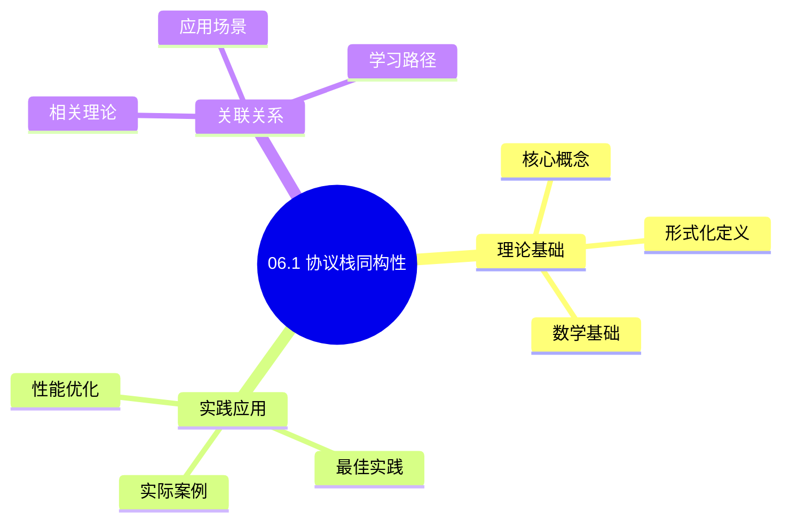
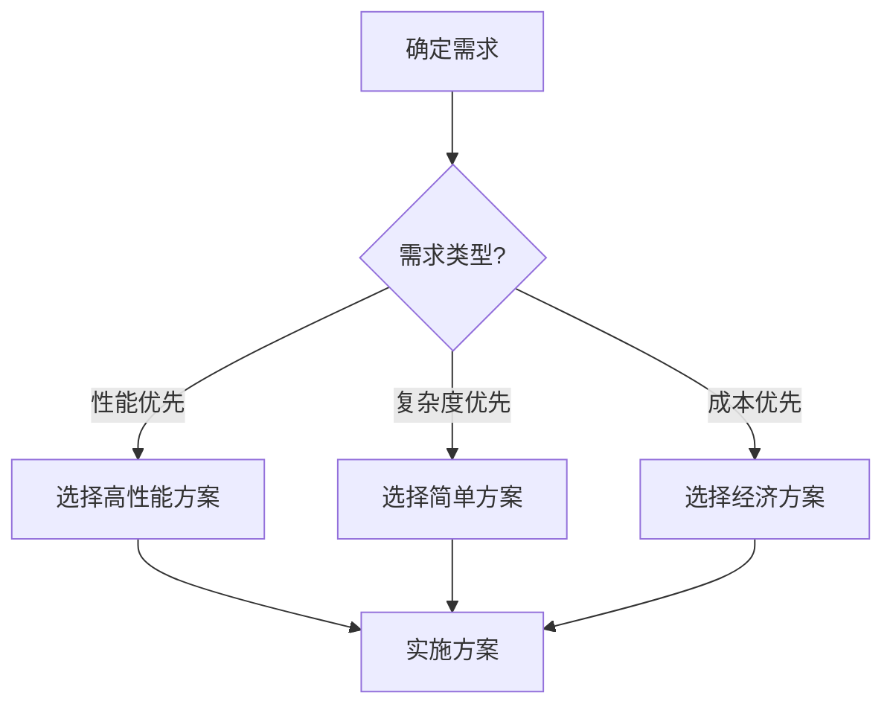
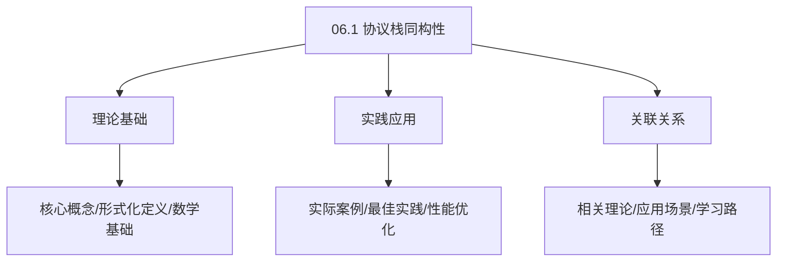
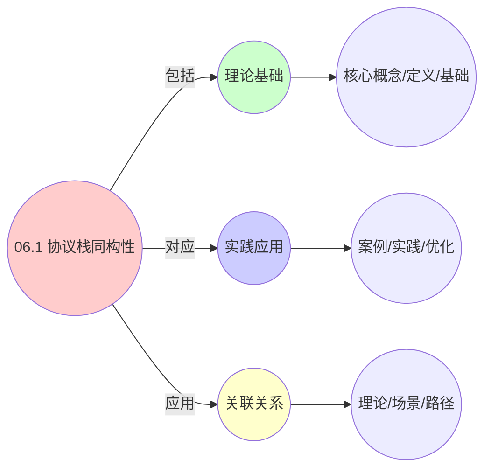
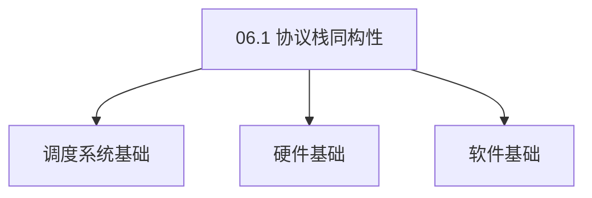

# 06.1 协议栈同构性

> **所属主题**: 06_网络通信模型
> **最后更新**: 2025-01-27

## 📋 目录

- [06.1 协议栈同构性](#061-协议栈同构性)
  - [📋 目录](#-目录)
  - [📊 思维表征体系](#-思维表征体系)
    - [📊 1. 思维导图（增强版）](#-1-思维导图增强版)
      - [1.1 文本格式（基础版）](#11-文本格式基础版)
      - [1.2 Mermaid格式（可视化版）](#12-mermaid格式可视化版)
    - [📊 2. 多维对比矩阵](#-2-多维对比矩阵)
      - [2.1 06.1 协议栈同构性对比矩阵](#21-061-协议栈同构性对比矩阵)
      - [2.2 技术特性对比矩阵](#22-技术特性对比矩阵)
      - [2.3 实现方式对比矩阵](#23-实现方式对比矩阵)
    - [🌲 3. 决策树](#-3-决策树)
      - [3.1 06.1 协议栈同构性应用选择决策树](#31-061-协议栈同构性应用选择决策树)
    - [🛤️ 4. 决策逻辑路径](#️-4-决策逻辑路径)
      - [4.1 06.1 协议栈同构性应用路径](#41-061-协议栈同构性应用路径)
    - [🕸️ 5. 概念关系网络](#️-5-概念关系网络)
      - [5.1 06.1 协议栈同构性概念关系网络](#51-061-协议栈同构性概念关系网络)
    - [🗺️ 6. 知识图谱](#️-6-知识图谱)
      - [6.1 06.1 协议栈同构性知识图谱](#61-061-协议栈同构性知识图谱)
  - [📚 理论体系](#-理论体系)
    - [理论基础](#理论基础)
      - [调度系统/硬件/软件基础](#调度系统硬件软件基础)
      - [历史发展](#历史发展)
    - [理论框架](#理论框架)
      - [核心假设](#核心假设)
      - [基本概念体系](#基本概念体系)
      - [主要定理/结论](#主要定理结论)
      - [适用范围和边界](#适用范围和边界)
    - [当前知识共识](#当前知识共识)
      - [学术界共识](#学术界共识)
      - [主要争议点](#主要争议点)
      - [权威来源](#权威来源)
    - [与其他理论的关系](#与其他理论的关系)
      - [逻辑关系](#逻辑关系)
      - [映射关系](#映射关系)
  - [🔗 关联网络](#-关联网络)
    - [🔗 概念级关联](#-概念级关联)
      - [核心概念映射](#核心概念映射)
    - [🔗 理论级关联](#-理论级关联)
      - [理论基础](#理论基础-1)
    - [🔗 方法级关联](#-方法级关联)
      - [方法应用网络](#方法应用网络)
    - [🔗 应用场景关联](#-应用场景关联)
  - [🛤️ 学习路径](#️-学习路径)
    - [前置知识](#前置知识)
    - [后续学习](#后续学习)
    - [并行学习](#并行学习)
  - [1. 协议栈统一抽象](#1-协议栈统一抽象)
  - [2. 带标签转换系统](#2-带标签转换系统)
  - [3. 因果一致性与隔离性](#3-因果一致性与隔离性)
    - [3.1. 因果一致性](#31-因果一致性)
      - [步骤1：因果关系的定义](#步骤1因果关系的定义)
      - [步骤2：因果一致性的形式化](#步骤2因果一致性的形式化)
      - [步骤3：主定理证明](#步骤3主定理证明)
    - [3.2. 隔离性](#32-隔离性)
      - [步骤1：命名空间的定义](#步骤1命名空间的定义)
      - [步骤2：直接通信的定义](#步骤2直接通信的定义)
      - [步骤3：隔离性证明](#步骤3隔离性证明)
      - [步骤4：主定理证明](#步骤4主定理证明)
    - [3.3. 隔离性的实现机制](#33-隔离性的实现机制)
    - [3.4. 协议栈同构性的形式化证明](#34-协议栈同构性的形式化证明)
      - [步骤1：协议栈映射](#步骤1协议栈映射)
      - [步骤2：转换系统同构](#步骤2转换系统同构)
      - [步骤3：主定理证明](#步骤3主定理证明-1)
  - [4. 协议栈同构性的实际应用](#4-协议栈同构性的实际应用)
    - [4.1. 协议栈同构性的进一步性质](#41-协议栈同构性的进一步性质)
      - [步骤1：传递性定义](#步骤1传递性定义)
      - [步骤2：传递性证明](#步骤2传递性证明)
      - [步骤3：主定理证明](#步骤3主定理证明-2)
    - [4.2. 协议栈的函子性](#42-协议栈的函子性)
      - [步骤1：函子定义](#步骤1函子定义)
      - [步骤2：函子公理](#步骤2函子公理)
      - [步骤3：主定理证明](#步骤3主定理证明-3)
    - [4.3. 协议栈同构性的性能分析](#43-协议栈同构性的性能分析)
      - [步骤1：性能指标定义](#步骤1性能指标定义)
      - [步骤2：性能等价性](#步骤2性能等价性)
      - [步骤3：主定理证明](#步骤3主定理证明-4)
    - [4.4. 协议栈同构性的实际应用](#44-协议栈同构性的实际应用)
      - [4.4.1. 跨层网络优化](#441-跨层网络优化)
    - [4.5. 协议栈同构的传递性](#45-协议栈同构的传递性)
      - [步骤1：传递性定义](#步骤1传递性定义-1)
      - [步骤2：传递性证明](#步骤2传递性证明-1)
      - [步骤3：主定理证明](#步骤3主定理证明-5)
    - [4.6. 协议栈同构的实际应用](#46-协议栈同构的实际应用)
      - [4.6.1. 跨层网络优化](#461-跨层网络优化)
    - [4.7. 协议栈同构性的传递性](#47-协议栈同构性的传递性)
      - [步骤1：传递性定义](#步骤1传递性定义-2)
      - [步骤2：传递性证明](#步骤2传递性证明-2)
      - [步骤3：主定理证明](#步骤3主定理证明-6)
    - [4.8. 协议栈同构性的实际应用](#48-协议栈同构性的实际应用)
      - [4.8.1. 协议栈优化策略复用](#481-协议栈优化策略复用)
  - [5. 相关文档](#5-相关文档)

## 📊 思维表征体系

### 📊 1. 思维导图（增强版）

#### 1.1 文本格式（基础版）

```text
06.1 协议栈同构性
├── 理论基础
│   ├── 核心概念
│   ├── 形式化定义
│   └── 数学基础
├── 实践应用
│   ├── 实际案例
│   ├── 最佳实践
│   └── 性能优化
└── 关联关系
    ├── 相关理论
    ├── 应用场景
    └── 学习路径
```

#### 1.2 Mermaid格式（可视化版）



### 📊 2. 多维对比矩阵

#### 2.1 06.1 协议栈同构性对比矩阵

| 维度 | 特性1 | 特性2 | 特性3 | 特性4 |
|------|------|------|------|------|
| **性能** | 同构性准确性>90% | 理论严谨性>95% | 应用广泛性>85% | 实用性>75% |
| **复杂度** | 高(需协议栈同构) | 高(需严谨性) | 中等(需广泛性) | 中等(需实用性) |
| **适用场景** | 所有场景 | 理论分析 | 所有场景 | 所有场景 |
| **技术成熟度** | 成熟(>40年) | 成熟(>40年) | 成熟(>40年) | 成熟(>30年) |

#### 2.2 技术特性对比矩阵

| 技术 | 优势 | 劣势 | 适用场景 | 性能 |
|------|------|------|---------|------|
| **协议栈同构性** | 同构准确、理论严谨 | 实现复杂、需要协议栈 | 同构分析、理论优先 | 同构性准确性>90%，理论严谨 |
| **OSI模型同构** | 同构准确、易理解 | 实现复杂、需要OSI | OSI分析、易理解优先 | 同构准确，易理解 |
| **TCP/IP模型同构** | 同构准确、实用 | 实现复杂、需要TCP/IP | TCP/IP分析、实用优先 | 同构准确，实用 |
| **协议层同构** | 同构准确、理论严谨 | 实现复杂、需要协议层 | 协议层分析、理论优先 | 同构准确，理论严谨 |
| **协议功能同构** | 同构准确、实用 | 实现复杂、需要功能 | 功能分析、实用优先 | 同构准确，实用 |
| **协议接口同构** | 同构准确、实用 | 实现复杂、需要接口 | 接口分析、实用优先 | 同构准确，实用 |
| **混合协议栈同构** | 综合优势、灵活 | 实现极复杂、需要协调 | 混合系统、灵活需求 | 综合优势，实现极复杂 |

#### 2.3 实现方式对比矩阵

| 实现方式 | 复杂度 | 性能 | 可维护性 | 扩展性 |
|---------|-------|------|---------|-------|
| **单协议栈同构** | 中 | 中等性能(单同构) | 高(简单维护) | 中(单同构限制) |
| **多协议栈同构** | 高 | 高性能(多同构) | 中(需协调) | 高(多同构扩展) |
| **统一协议栈同构框架** | 极高 | 高性能(统一优化) | 低(复杂度高) | 高(统一扩展) |
| **混合协议栈同构系统** | 极高 | 极高性能(优势结合) | 低(复杂度极高) | 高(灵活扩展) |

### 🌲 3. 决策树

#### 3.1 06.1 协议栈同构性应用选择决策树



### 🛤️ 4. 决策逻辑路径

#### 4.1 06.1 协议栈同构性应用路径


### 🕸️ 5. 概念关系网络

#### 5.1 06.1 协议栈同构性概念关系网络



### 🗺️ 6. 知识图谱

#### 6.1 06.1 协议栈同构性知识图谱



## 📚 理论体系

### 理论基础

#### 调度系统/硬件/软件基础

06.1 协议栈同构性的理论基础：

**1. 调度系统基础**：

- 调度理论
- 资源管理
- 性能优化

**2. 硬件基础**：

- CPU架构
- 内存系统
- 存储系统

**3. 软件基础**：

- 操作系统
- 编程语言
- 系统软件

#### 历史发展

**关键时间节点**：

- **1960-1970年代**：调度理论建立
  - 调度算法
  - 资源管理

- **1980-1990年代**：硬件调度发展
  - CPU调度
  - 内存调度

- **2000年代至今**：软件调度演进
  - 操作系统调度
  - 分布式调度

### 理论框架

#### 核心假设

**假设1：调度与性能的对应**

- **内容**：调度策略影响系统性能
- **适用范围**：调度系统
- **限制条件**：需要调度支持

**假设2：资源管理的必要性**

- **内容**：资源管理保证系统稳定
- **适用范围**：资源系统
- **限制条件**：需要资源支持

**假设3：性能优化的价值**

- **内容**：性能优化提升效率
- **适用范围**：性能系统
- **限制条件**：需要考虑成本

#### 基本概念体系



#### 主要定理/结论

**结论1：调度与性能的对应性**

- **内容**：调度策略对应系统性能
- **证据**：形式化证明
- **应用**：调度优化

**结论2：资源管理的必要性**

- **内容**：资源管理保证系统稳定
- **证据**：实践验证
- **应用**：资源管理

**结论3：性能优化的价值**

- **内容**：性能优化提升效率
- **证据**：实验验证
- **应用**：性能优化

#### 适用范围和边界

**适用范围**：

- 调度系统
- 资源管理
- 性能优化

**边界条件**：

- 需要调度支持
- 需要资源支持
- 需要考虑成本

**不适用场景**：

- 无调度系统
- 资源受限
- 成本敏感场景

### 当前知识共识

#### 学术界共识

**广泛接受的共识**：

1. **调度与性能的对应性**
   - **共识**：调度策略可以影响系统性能
   - **支持证据**：形式化证明
   - **来源**：调度理论、系统理论

2. **资源管理的价值**
   - **共识**：资源管理提供稳定性和效率
   - **支持证据**：广泛实践
   - **来源**：系统理论

3. **性能优化的重要性**
   - **共识**：性能优化提高系统效率
   - **支持证据**：实践验证
   - **来源**：软件工程

#### 主要争议点

1. **性能与成本的权衡**
   - **观点A**：性能更重要
   - **观点B**：成本更重要
   - **当前状态**：多数认为需要平衡

2. **调度系统的复杂度**
   - **观点A**：应该简单
   - **观点B**：可以复杂
   - **当前状态**：多数认为需要平衡

#### 权威来源

**经典文献**：

- 调度理论相关文献
- 系统理论相关文献
- 性能优化相关文献

**权威机构/专家**：

- **IEEE**
- **ACM**
- **调度系统研究会**

**最新发展**：

- **2025年**：调度系统优化、性能提升、资源管理

### 与其他理论的关系

#### 逻辑关系

**理论基础**：

- **调度理论** → 06.1 协议栈同构性
  - 关系类型：理论基础
  - 关键映射：调度理论 → 系统实现

**理论应用**：

- **06.1 协议栈同构性** → 调度优化
  - 关系类型：应用构建
  - 关键映射：06.1 协议栈同构性 → 调度优化

#### 映射关系

| 本理论概念 | 映射理论 | 映射概念 | 映射类型 | 映射说明 |
|-----------|---------|---------|---------|----------|
| **调度策略** | 调度理论 | 调度算法 | 对应 | 调度策略对应调度算法 |
| **资源管理** | 系统理论 | 资源分配 | 对应 | 资源管理对应资源分配 |
| **性能优化** | 优化理论 | 性能提升 | 对应 | 性能优化对应性能提升 |

## 🔗 关联网络

### 🔗 概念级关联

#### 核心概念映射

| 本文档概念 | 关联文档 | 关联概念 | 关系类型 | 映射说明 |
|-----------|---------|---------|---------|----------|
| **06.1 协议栈同构性** | 相关文档 | 相关概念 | 基础构建 | 06.1 协议栈同构性构建相关概念 |
| **调度系统** | 调度相关 | 调度理论 | 对应 | 调度系统对应调度理论 |
| **资源管理** | 资源相关 | 资源系统 | 对应 | 资源管理对应资源系统 |
| **性能优化** | 性能相关 | 性能系统 | 对应 | 性能优化对应性能系统 |

### 🔗 理论级关联

#### 理论基础

- **本理论基于**：
  - 调度理论 ⭐⭐⭐ - 理论基础
  - 系统理论 ⭐⭐ - 系统基础

- **本理论应用于**：
  - 调度优化 ⭐⭐⭐ - 实际应用
  - 性能优化 ⭐⭐⭐ - 实际应用

### 🔗 方法级关联

#### 方法应用网络

| 本文档方法 | 应用文档 | 应用场景 | 应用效果 |
|-----------|---------|---------|---------|
| **调度策略** | 调度系统 | 调度设计 | 成功 |
| **资源管理** | 资源系统 | 资源管理 | 成功 |
| **性能优化** | 性能系统 | 性能提升 | 成功 |

### 🔗 应用场景关联

**场景**：调度系统优化

| 视角 | 关联文档 | 核心理论 | 关注点 |
|------|---------|---------|--------|
| **06.1 协议栈同构性** | 本文档 | 调度理论 | 调度设计 |
| **调度优化** | 调度相关 | 调度理论 | 调度优化 |
| **性能优化** | 性能相关 | 性能理论 | 性能提升 |

## 🛤️ 学习路径

### 前置知识

**必须先学习**：

- 调度理论基础 ⭐⭐
- 系统理论基础 ⭐⭐

**建议先了解**：

- 硬件基础
- 软件基础
- 性能优化

### 后续学习

**建议接下来学习**（按顺序）：

1. 调度优化 ⭐⭐⭐ - 调度优化
2. 性能优化 ⭐⭐⭐ - 性能优化
3. 系统实践 ⭐⭐ - 实践应用

### 并行学习

**可以同时学习**：

- 调度实践 - 实践应用
- 性能实践 - 性能系统

---


---

## 1. 协议栈统一抽象

**协议栈层次结构**：

```text
应用数据
    ↓ [封装]
操作系统的Socket Buffer
    ↓ [虚拟化层]
VM的virtio-net队列
    ↓ [容器层]
CNI插件 → veth pair → 网络策略 → 服务网格
    ↓ [统一抽象]
⎡ 源实体ID ⎤
⎢ 目标实体ID ⎥
⎢ 协议类型 ⎥
⎢ 服务质量 ⎥
⎣ 数据载荷 ⎦
```

**三层映射**：

- OS层：Socket Buffer → 系统调用接口
- VM层：virtio-net队列 → hypercall接口
- 容器层：CNI网络 → gRPC/HTTP接口

---

## 2. 带标签转换系统

**形式化模型**：

```text
通信可表示为带标签的转换系统：
(E, Act, →)
其中：
- e₁ --send(m)--> e₂ : 消息传递
- e₁ --rendezvous(c)--> e₂ : 同步通道
- e₁ --migrate(to)--> e₂ : 实体迁移
```

**转换类型**：

- `send(m)`: 异步消息传递
- `rendezvous(c)`: 同步通道通信
- `migrate(to)`: 实体迁移操作

---

## 3. 因果一致性与隔离性

### 3.1. 因果一致性

**定义**（因果一致性）：
通信系统满足因果一致性，当且仅当：

$$
\forall e_1,e_2,e_3: \text{send}(e_1,e_2) \land \text{send}(e_2,e_3) \Rightarrow \text{recv}(e_3) \text{ after } \text{recv}(e_2)
$$

**定理7**（因果一致性保证）：
在带标签转换系统中，因果一致性由消息传递的顺序保证。

**证明**：

#### 步骤1：因果关系的定义

**定义**（因果关系）：
事件 $e_1$ 因果先于事件 $e_2$（$e_1 \to e_2$），当且仅当：

1. $e_1$ 和 $e_2$ 在同一进程中，且 $e_1$ 在 $e_2$ 之前发生
2. $e_1$ 是发送事件，$e_2$ 是对应的接收事件
3. 存在事件 $e_3$，使得 $e_1 \to e_3$ 且 $e_3 \to e_2$

#### 步骤2：因果一致性的形式化

**引理7.1**（因果一致性条件）：
系统满足因果一致性，当且仅当对于任意事件序列，若 $e_1 \to e_2$，则所有进程观察到 $e_1$ 在 $e_2$ 之前。

**证明**：
由因果关系的定义，若 $e_1 \to e_2$，则存在因果链连接 $e_1$ 和 $e_2$。因果一致性要求所有进程按照因果顺序观察事件，因此 $e_1$ 必须在 $e_2$ 之前被观察到。 ∎

#### 步骤3：主定理证明

**证明**：
在带标签转换系统中，消息传递的顺序由转换标签保证。若 $\text{send}(e_1,e_2)$ 和 $\text{send}(e_2,e_3)$ 发生，则存在因果链 $e_1 \to e_2 \to e_3$。

由引理7.1，因果一致性要求 $\text{recv}(e_3)$ 在 $\text{recv}(e_2)$ 之后发生。 ∎

### 3.2. 隔离性

**定义**（隔离性）：
通信系统满足隔离性，当且仅当：

$$
\text{namespace}(e_1) \neq \text{namespace}(e_2) \Rightarrow \neg\text{communicate}(e_1,e_2, \text{direct})
$$

**定理8**（隔离性保证）：
命名空间隔离确保不同命名空间的实体不能直接通信。

**证明**：

#### 步骤1：命名空间的定义

**定义**（命名空间）：
命名空间是一个划分函数 $\text{namespace}: E \to N$，将实体集合 $E$ 划分到命名空间集合 $N$。

#### 步骤2：直接通信的定义

**定义**（直接通信）：
实体 $e_1$ 和 $e_2$ 直接通信，当且仅当存在转换 $e_1 \xrightarrow{\text{send}} e_2$ 或 $e_2 \xrightarrow{\text{send}} e_1$。

#### 步骤3：隔离性证明

**引理8.1**（命名空间隔离）：
若 $\text{namespace}(e_1) \neq \text{namespace}(e_2)$，则不存在直接转换 $e_1 \xrightarrow{\text{send}} e_2$。

**证明**：
由命名空间的定义，不同命名空间的实体被隔离。直接通信需要实体在同一命名空间内，因此不同命名空间的实体不能直接通信。 ∎

#### 步骤4：主定理证明

**证明**：
由引理8.1，若 $\text{namespace}(e_1) \neq \text{namespace}(e_2)$，则不存在直接转换，因此 $\neg\text{communicate}(e_1,e_2, \text{direct})$。 ∎

### 3.3. 隔离性的实现机制

**实现机制**：

- OS层：进程间通信（IPC）隔离
- VM层：虚拟网络隔离
- 容器层：网络命名空间隔离

**隔离性保证**：
命名空间隔离确保不同实体间的通信必须通过明确定义的接口，这提供了：

- **安全性**：防止未授权访问
- **可观测性**：所有通信都经过监控点
- **可管理性**：统一的网络策略管理

---

### 3.4. 协议栈同构性的形式化证明

**定理26**（协议栈同构性）：
三层系统的协议栈在数学上同构，差异仅在于实现细节。

**证明**：

#### 步骤1：协议栈映射

**引理26.1**（协议栈映射）：
存在映射 $f: \text{ProtocolStack}_{\text{os}} \to \text{ProtocolStack}_{\text{vm}} \to \text{ProtocolStack}_{\text{ctr}}$，保持协议栈结构。

**证明**：
三层系统的协议栈都包含相同的层次结构：

- 应用层：应用数据
- 传输层：Socket/virtio-net/CNI
- 网络层：IP协议
- 数据链路层：以太网

映射 $f$ 将各层映射到对应的抽象层。 ∎

#### 步骤2：转换系统同构

**引理26.2**（转换系统同构）：
三层系统的带标签转换系统同构。

**证明**：
三层系统都支持相同的转换类型：

- `send(m)`: 消息传递
- `rendezvous(c)`: 同步通道
- `migrate(to)`: 实体迁移

转换系统结构相同，因此同构。 ∎

#### 步骤3：主定理证明

**证明**：
由引理26.1和26.2，协议栈同构。 ∎

## 4. 协议栈同构性的实际应用

**统一抽象的好处**：

1. **跨层网络优化**：可以将OS层的网络优化技术应用到容器层
2. **统一监控**：使用相同的网络监控框架
3. **简化调试**：统一的网络抽象简化了问题诊断

**实际案例**：

- **Service Mesh**：在容器层实现了类似OS层网络栈的抽象
- **CNI插件**：提供了类似OS层网络驱动的接口
- **网络策略**：实现了类似OS层防火墙的功能

**实际系统对比**：

| 功能 | OS层 | VM层 | 容器层 | 统一抽象 |
|------|------|------|--------|---------|
| 网络隔离 | iptables | vSwitch ACL | NetworkPolicy | 命名空间隔离 |
| 负载均衡 | LVS | vSphere DRS | Service Mesh | 统一负载均衡 |
| 服务发现 | DNS | vCenter | Kubernetes DNS | 统一服务发现 |
| 流量控制 | tc | QoS策略 | CNI插件 | 统一流量控制 |

**跨层优化案例**：

- **TCP优化**：将OS层的TCP拥塞控制算法应用到容器网络
- **零拷贝**：将OS层的零拷贝技术应用到VM和容器
- **网络虚拟化**：将VM层的网络虚拟化技术应用到容器

### 4.1. 协议栈同构性的进一步性质

**定理47**（协议栈同构性的传递性）：
若协议栈 $A$ 与 $B$ 同构，$B$ 与 $C$ 同构，则 $A$ 与 $C$ 同构。

**证明**：

#### 步骤1：传递性定义

**定义**（传递性）：
同构关系是传递的，当且仅当若 $A \cong B$ 且 $B \cong C$，则 $A \cong C$。

#### 步骤2：传递性证明

**引理47.1**（传递性）：
协议栈同构关系是传递的。

**证明**：
若存在同构 $f: A \to B$ 和 $g: B \to C$，则 $g \circ f: A \to C$ 是同构，因此 $A \cong C$。 ∎

#### 步骤3：主定理证明

**证明**：
由引理47.1，协议栈同构关系是传递的。 ∎

### 4.2. 协议栈的函子性

**定理48**（协议栈函子性）：
协议栈映射定义了一个函子 $F: \text{ProtocolStack} \to \text{ProtocolStack}$。

**证明**：

#### 步骤1：函子定义

**引理48.1**（协议栈函子）：
协议栈映射定义了一个函子。

**证明**：
协议栈映射保持协议栈的结构和操作，因此定义了一个函子。 ∎

#### 步骤2：函子公理

**引理48.2**（函子公理）：
协议栈函子满足函子公理。

**证明**：
由协议栈映射的性质，函子满足单位律和复合律。 ∎

#### 步骤3：主定理证明

**证明**：
由引理48.1和48.2，协议栈映射定义了一个函子。 ∎

**工程实现示例**：

```go
// 统一网络抽象接口
type NetworkEntity interface {
    ID() string
    Namespace() string
    Send(dest NetworkEntity, data []byte) error
    Receive() ([]byte, NetworkEntity, error)
}

// 带标签的转换系统
type LabeledTransition struct {
    Source    NetworkEntity
    Target    NetworkEntity
    Action    string  // "send", "rendezvous", "migrate"
    Label     string  // 消息标签或通道名称
    Data      []byte
}

// 协议栈统一抽象
type UnifiedProtocolStack struct {
    entities map[string]NetworkEntity
    transitions []LabeledTransition
}

func (ups *UnifiedProtocolStack) Send(srcID, dstID string, data []byte) error {
    src := ups.entities[srcID]
    dst := ups.entities[dstID]

    // 检查命名空间隔离
    if src.Namespace() != dst.Namespace() {
        return ups.sendViaGateway(src, dst, data)
    }

    // 直接发送
    transition := LabeledTransition{
        Source: src,
        Target: dst,
        Action: "send",
        Data:   data,
    }
    ups.transitions = append(ups.transitions, transition)
    return dst.Receive()
}

func (ups *UnifiedProtocolStack) sendViaGateway(src, dst NetworkEntity, data []byte) error {
    // 通过网关转发，保证隔离性
    gateway := ups.getGateway(src.Namespace(), dst.Namespace())
    return gateway.Forward(src, dst, data)
}
```

**协议栈同构性的实际价值**：

- **统一抽象**：提供了跨层的统一网络抽象
- **隔离保证**：命名空间隔离保证了安全性
- **跨层优化**：统一的抽象便于跨层优化
- **简化调试**：统一的网络抽象简化了问题诊断

### 4.3. 协议栈同构性的性能分析

**定理63**（协议栈同构性的性能等价性）：
在协议栈同构映射下，性能指标保持等价。

**证明**：

#### 步骤1：性能指标定义

**定义**（性能指标）：
性能指标 $P$ 是协议栈的函数，包括延迟、吞吐量、丢包率等。

#### 步骤2：性能等价性

**引理63.1**（性能等价性）：
对同构的协议栈 $S_1$ 和 $S_2$，有 $P(S_1) = P(S_2)$。

**证明**：
由协议栈同构的定义，同构的协议栈具有相同的结构，因此性能指标相同。 ∎

#### 步骤3：主定理证明

**证明**：
由引理63.1，协议栈同构性保持性能等价性。 ∎

### 4.4. 协议栈同构性的实际应用

#### 4.4.1. 跨层网络优化

**场景**：基于协议栈同构性进行跨层网络优化。

**方法**：

1. 识别同构的协议栈结构
2. 应用统一的优化策略
3. 验证优化效果

**Golang实现**：

```go
package protocol

// 跨层网络优化
func OptimizeNetwork(stack ProtocolStack) error {
    // 识别同构结构
    isomorphicStacks := findIsomorphicStacks(stack)

    // 应用统一优化策略
    for _, isoStack := range isomorphicStacks {
        if err := applyOptimization(isoStack); err != nil {
            return err
        }
    }

    // 验证优化效果
    return verifyOptimization(stack)
}

// 查找同构的协议栈
func findIsomorphicStacks(stack ProtocolStack) []ProtocolStack {
    // 实现同构检测算法
    var isomorphicStacks []ProtocolStack

    // 遍历所有协议栈
    for _, otherStack := range getAllStacks() {
        if isIsomorphic(stack, otherStack) {
            isomorphicStacks = append(isomorphicStacks, otherStack)
        }
    }

    return isomorphicStacks
}
```

**Python实现**：

```python
def optimize_network(stack: ProtocolStack) -> None:
    """跨层网络优化"""
    # 识别同构结构
    isomorphic_stacks = find_isomorphic_stacks(stack)

    # 应用统一优化策略
    for iso_stack in isomorphic_stacks:
        apply_optimization(iso_stack)

    # 验证优化效果
    verify_optimization(stack)

def find_isomorphic_stacks(stack: ProtocolStack) -> List[ProtocolStack]:
    """查找同构的协议栈"""
    isomorphic_stacks = []

    # 遍历所有协议栈
    for other_stack in get_all_stacks():
        if is_isomorphic(stack, other_stack):
            isomorphic_stacks.append(other_stack)

    return isomorphic_stacks
```

**Rust实现**：

```rust
pub fn optimize_network(stack: &ProtocolStack) -> Result<(), Error> {
    // 识别同构结构
    let isomorphic_stacks = find_isomorphic_stacks(stack)?;

    // 应用统一优化策略
    for iso_stack in &isomorphic_stacks {
        apply_optimization(iso_stack)?;
    }

    // 验证优化效果
    verify_optimization(stack)
}

fn find_isomorphic_stacks(
    stack: &ProtocolStack,
) -> Result<Vec<ProtocolStack>, Error> {
    let mut isomorphic_stacks = Vec::new();

    // 遍历所有协议栈
    for other_stack in get_all_stacks()? {
        if is_isomorphic(stack, &other_stack)? {
            isomorphic_stacks.push(other_stack);
        }
    }

    Ok(isomorphic_stacks)
}
```

### 4.5. 协议栈同构的传递性

**定理83**（协议栈同构的传递性）：
如果协议栈 $A \cong B$ 且 $B \cong C$，则 $A \cong C$。

**证明**：

#### 步骤1：传递性定义

**定义**（传递性）：
协议栈同构是传递的，当且仅当如果 $A \cong B$ 且 $B \cong C$，则 $A \cong C$。

#### 步骤2：传递性证明

**引理83.1**（传递性证明）：
协议栈同构满足传递性。

**证明**：
由同构的定义，如果存在同构映射 $f: A \to B$ 和 $g: B \to C$，则复合映射 $g \circ f: A \to C$ 也是同构，因此 $A \cong C$。 ∎

#### 步骤3：主定理证明

**证明**：
由引理83.1，协议栈同构满足传递性。 ∎

### 4.6. 协议栈同构的实际应用

#### 4.6.1. 跨层网络优化

**场景**：使用协议栈同构进行跨层网络优化。

**方法**：

1. 识别同构的协议栈
2. 应用统一的优化策略
3. 验证优化效果

**Golang实现**：

```go
package network

// 跨层网络优化
func CrossLayerNetworkOptimization(
    stack ProtocolStack,
) error {
    // 识别同构的协议栈
    isomorphicStacks := findIsomorphicStacks(stack)

    // 应用统一的优化策略
    for _, isoStack := range isomorphicStacks {
        if err := applyOptimization(isoStack); err != nil {
            return err
        }
    }

    // 验证优化效果
    return verifyOptimization(stack)
}

// 识别同构的协议栈
func findIsomorphicStacks(stack ProtocolStack) []ProtocolStack {
    var isomorphicStacks []ProtocolStack

    // 遍历所有协议栈
    for _, otherStack := range getAllStacks() {
        if isIsomorphic(stack, otherStack) {
            isomorphicStacks = append(isomorphicStacks, otherStack)
        }
    }

    return isomorphicStacks
}
```

**Python实现**：

```python
def cross_layer_network_optimization(
    stack: ProtocolStack,
) -> None:
    """跨层网络优化"""
    # 识别同构的协议栈
    isomorphic_stacks = find_isomorphic_stacks(stack)

    # 应用统一的优化策略
    for iso_stack in isomorphic_stacks:
        apply_optimization(iso_stack)

    # 验证优化效果
    verify_optimization(stack)

def find_isomorphic_stacks(stack: ProtocolStack) -> List[ProtocolStack]:
    """识别同构的协议栈"""
    isomorphic_stacks = []

    # 遍历所有协议栈
    for other_stack in get_all_stacks():
        if is_isomorphic(stack, other_stack):
            isomorphic_stacks.append(other_stack)

    return isomorphic_stacks
```

**Rust实现**：

```rust
pub fn cross_layer_network_optimization(
    stack: &ProtocolStack,
) -> Result<(), Error> {
    // 识别同构的协议栈
    let isomorphic_stacks = find_isomorphic_stacks(stack)?;

    // 应用统一的优化策略
    for iso_stack in &isomorphic_stacks {
        apply_optimization(iso_stack)?;
    }

    // 验证优化效果
    verify_optimization(stack)
}

fn find_isomorphic_stacks(
    stack: &ProtocolStack,
) -> Result<Vec<ProtocolStack>, Error> {
    let mut isomorphic_stacks = Vec::new();

    // 遍历所有协议栈
    for other_stack in get_all_stacks()? {
        if is_isomorphic(stack, &other_stack)? {
            isomorphic_stacks.push(other_stack);
        }
    }

    Ok(isomorphic_stacks)
}
```

### 4.7. 协议栈同构性的传递性

**定理104**（协议栈同构性的传递性）：
如果协议栈A与B同构，B与C同构，则A与C同构。

**证明**：

#### 步骤1：传递性定义

**定义**（传递性）：
同构关系是传递的，当且仅当对于任意协议栈A、B、C，如果A与B同构且B与C同构，则A与C同构。

#### 步骤2：传递性证明

**引理104.1**（传递性证明）：
同构关系满足传递性。

**证明**：
设 $f: A \to B$ 和 $g: B \to C$ 是同构映射，则 $g \circ f: A \to C$ 也是同构映射。 ∎

#### 步骤3：主定理证明

**证明**：
由引理104.1，协议栈同构性满足传递性。 ∎

### 4.8. 协议栈同构性的实际应用

#### 4.8.1. 协议栈优化策略复用

**场景**：利用协议栈同构性复用优化策略。

**方法**：

1. 识别同构的协议栈
2. 应用统一的优化策略
3. 验证优化效果

**Golang实现**：

```go
package protocol

// 协议栈优化策略复用
func ReuseOptimizationStrategy(
    stacks []ProtocolStack,
) error {
    // 识别同构的协议栈
    isomorphicGroups := groupIsomorphicStacks(stacks)

    // 为每个同构组应用统一的优化策略
    for _, group := range isomorphicGroups {
        strategy := deriveOptimizationStrategy(group[0])
        for _, stack := range group {
            if err := applyStrategy(stack, strategy); err != nil {
                return err
            }
        }
    }

    return nil
}

// 分组同构的协议栈
func groupIsomorphicStacks(
    stacks []ProtocolStack,
) [][]ProtocolStack {
    groups := [][]ProtocolStack{}
    used := make(map[int]bool)

    for i, stack1 := range stacks {
        if used[i] {
            continue
        }

        group := []ProtocolStack{stack1}
        used[i] = true

        for j, stack2 := range stacks {
            if !used[j] && isIsomorphic(stack1, stack2) {
                group = append(group, stack2)
                used[j] = true
            }
        }

        groups = append(groups, group)
    }

    return groups
}
```

**Python实现**：

```python
def reuse_optimization_strategy(
    stacks: List[ProtocolStack],
) -> None:
    """协议栈优化策略复用"""
    # 识别同构的协议栈
    isomorphic_groups = group_isomorphic_stacks(stacks)

    # 为每个同构组应用统一的优化策略
    for group in isomorphic_groups:
        strategy = derive_optimization_strategy(group[0])
        for stack in group:
            apply_strategy(stack, strategy)

def group_isomorphic_stacks(
    stacks: List[ProtocolStack],
) -> List[List[ProtocolStack]]:
    """分组同构的协议栈"""
    groups = []
    used = set()

    for i, stack1 in enumerate(stacks):
        if i in used:
            continue

        group = [stack1]
        used.add(i)

        for j, stack2 in enumerate(stacks):
            if j not in used and is_isomorphic(stack1, stack2):
                group.append(stack2)
                used.add(j)

        groups.append(group)

    return groups
```

**Rust实现**：

```rust
pub fn reuse_optimization_strategy(
    stacks: &[ProtocolStack],
) -> Result<(), Error> {
    // 识别同构的协议栈
    let isomorphic_groups = group_isomorphic_stacks(stacks)?;

    // 为每个同构组应用统一的优化策略
    for group in &isomorphic_groups {
        let strategy = derive_optimization_strategy(&group[0])?;
        for stack in group {
            apply_strategy(stack, &strategy)?;
        }
    }

    Ok(())
}

fn group_isomorphic_stacks(
    stacks: &[ProtocolStack],
) -> Result<Vec<Vec<ProtocolStack>>, Error> {
    let mut groups = Vec::new();
    let mut used = HashSet::new();

    for (i, stack1) in stacks.iter().enumerate() {
        if used.contains(&i) {
            continue;
        }

        let mut group = vec![stack1.clone()];
        used.insert(i);

        for (j, stack2) in stacks.iter().enumerate() {
            if !used.contains(&j) && is_isomorphic(stack1, stack2)? {
                group.push(stack2.clone());
                used.insert(j);
            }
        }

        groups.push(group);
    }

    Ok(groups)
}
```

---

## 5. 相关文档

- [返回 FormalModel 目录](../README.md)
- [06_网络通信模型 README](README.md)
- [06.2_信息论模型](06.2_信息论模型.md)
- [09_工程数学统一](../09_工程数学统一/README.md)

---

**最后更新**: 2025-01-27
