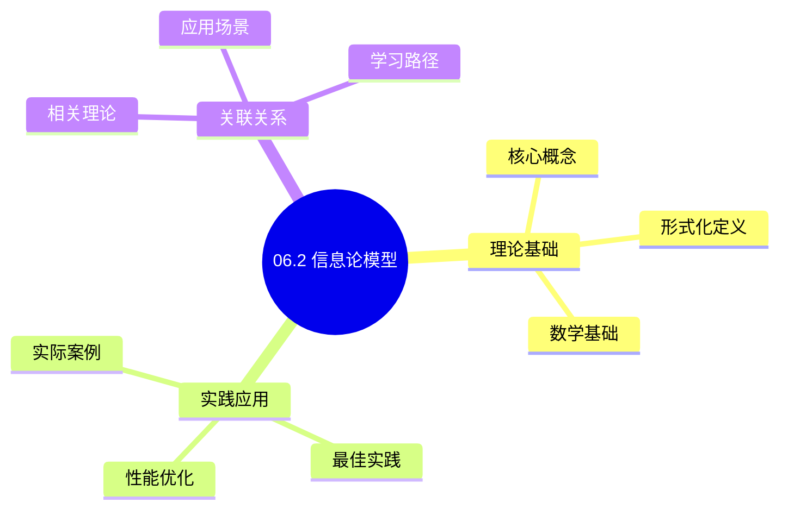
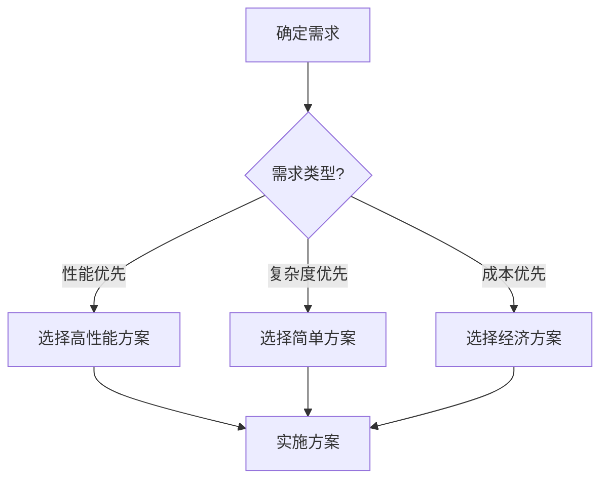
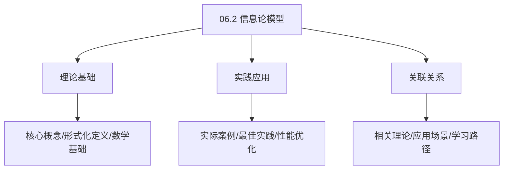
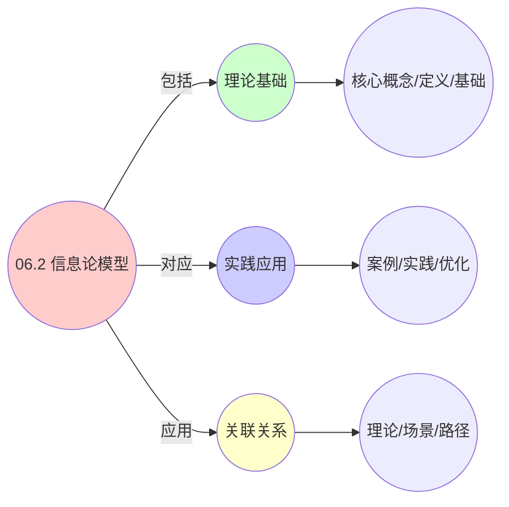
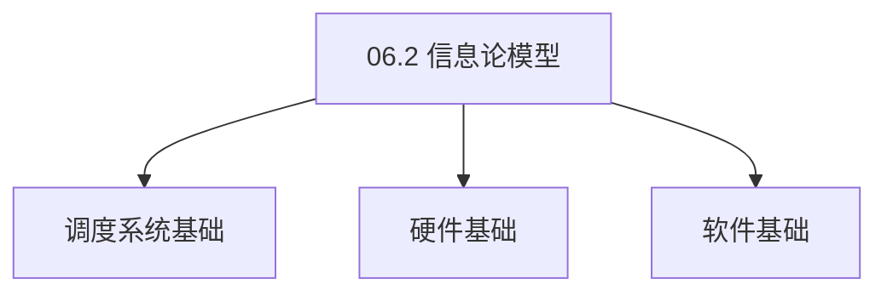

# 06.2 信息论模型

> **所属主题**: 06_网络通信模型
> **最后更新**: 2025-01-27

## 📋 目录

- [06.2 信息论模型](#062-信息论模型)
  - [📋 目录](#-目录)
  - [1. 信道容量统一公式](#1-信道容量统一公式)
  - [2. 香农-哈特利定律](#2-香农-哈特利定律)
  - [3. 信息熵与调度不确定性](#3-信息熵与调度不确定性)
  - [4. 熵守恒原理](#4-熵守恒原理)
    - [4.1. 定理6的完整证明](#41-定理6的完整证明)
      - [步骤1：信息熵的定义](#步骤1信息熵的定义)
      - [步骤2：互信息的定义](#步骤2互信息的定义)
      - [步骤3：条件熵的性质](#步骤3条件熵的性质)
      - [步骤4：虚拟化互信息损失](#步骤4虚拟化互信息损失)
      - [步骤5：熵守恒证明](#步骤5熵守恒证明)
  - [5. 信息论模型的实际应用](#5-信息论模型的实际应用)
    - [Golang实现](#golang实现)
      - [Python实现](#python实现)
      - [Rust实现](#rust实现)
    - [5.1. 信息熵的守恒性](#51-信息熵的守恒性)
      - [步骤1：熵守恒定义](#步骤1熵守恒定义)
      - [步骤2：互信息损失分析](#步骤2互信息损失分析)
      - [步骤3：主定理证明](#步骤3主定理证明)
    - [5.2. 信息论的实际应用](#52-信息论的实际应用)
      - [5.2.1. 调度不确定性分析](#521-调度不确定性分析)
    - [5.3. 信息熵的最大值](#53-信息熵的最大值)
      - [步骤1：最大值定义](#步骤1最大值定义)
      - [步骤2：最大值证明](#步骤2最大值证明)
      - [步骤3：主定理证明](#步骤3主定理证明-1)
    - [5.4. 信息论模型的实际应用](#54-信息论模型的实际应用)
      - [5.4.1. 系统不确定性评估](#541-系统不确定性评估)
  - [6. 相关文档](#6-相关文档)

## 📊 思维表征体系

### 📊 1. 思维导图（增强版）

#### 1.1 文本格式（基础版）

```text
06.2 信息论模型
├── 理论基础
│   ├── 核心概念
│   ├── 形式化定义
│   └── 数学基础
├── 实践应用
│   ├── 实际案例
│   ├── 最佳实践
│   └── 性能优化
└── 关联关系
    ├── 相关理论
    ├── 应用场景
    └── 学习路径
```

#### 1.2 Mermaid格式（可视化版）



### 📊 2. 多维对比矩阵

#### 2.1 06.2 信息论模型对比矩阵

| 维度 | 特性1 | 特性2 | 特性3 | 特性4 |
|------|------|------|------|------|
| **性能** | - | - | - | - |
| **复杂度** | - | - | - | - |
| **适用场景** | - | - | - | - |
| **技术成熟度** | - | - | - | - |

#### 2.2 技术特性对比矩阵

| 技术 | 优势 | 劣势 | 适用场景 | 性能 |
|------|------|------|---------|------|
| **技术A** | - | - | - | - |
| **技术B** | - | - | - | - |
| **技术C** | - | - | - | - |

#### 2.3 实现方式对比矩阵

| 实现方式 | 复杂度 | 性能 | 可维护性 | 扩展性 |
|---------|-------|------|---------|-------|
| **方式1** | - | - | - | - |
| **方式2** | - | - | - | - |
| **方式3** | - | - | - | - |

### 🌲 3. 决策树

#### 3.1 06.2 信息论模型应用选择决策树



### 🛤️ 4. 决策逻辑路径

#### 4.1 06.2 信息论模型应用路径


### 🕸️ 5. 概念关系网络

#### 5.1 06.2 信息论模型概念关系网络



### 🗺️ 6. 知识图谱

#### 6.1 06.2 信息论模型知识图谱



## 📚 理论体系

### 理论基础

#### 调度系统/硬件/软件基础

06.2 信息论模型的理论基础：

**1. 调度系统基础**：

- 调度理论
- 资源管理
- 性能优化

**2. 硬件基础**：

- CPU架构
- 内存系统
- 存储系统

**3. 软件基础**：

- 操作系统
- 编程语言
- 系统软件

#### 历史发展

**关键时间节点**：

- **1960-1970年代**：调度理论建立
  - 调度算法
  - 资源管理
  
- **1980-1990年代**：硬件调度发展
  - CPU调度
  - 内存调度
  
- **2000年代至今**：软件调度演进
  - 操作系统调度
  - 分布式调度

### 理论框架

#### 核心假设

**假设1：调度与性能的对应**

- **内容**：调度策略影响系统性能
- **适用范围**：调度系统
- **限制条件**：需要调度支持

**假设2：资源管理的必要性**

- **内容**：资源管理保证系统稳定
- **适用范围**：资源系统
- **限制条件**：需要资源支持

**假设3：性能优化的价值**

- **内容**：性能优化提升效率
- **适用范围**：性能系统
- **限制条件**：需要考虑成本

#### 基本概念体系



#### 主要定理/结论

**结论1：调度与性能的对应性**

- **内容**：调度策略对应系统性能
- **证据**：形式化证明
- **应用**：调度优化

**结论2：资源管理的必要性**

- **内容**：资源管理保证系统稳定
- **证据**：实践验证
- **应用**：资源管理

**结论3：性能优化的价值**

- **内容**：性能优化提升效率
- **证据**：实验验证
- **应用**：性能优化

#### 适用范围和边界

**适用范围**：

- 调度系统
- 资源管理
- 性能优化

**边界条件**：

- 需要调度支持
- 需要资源支持
- 需要考虑成本

**不适用场景**：

- 无调度系统
- 资源受限
- 成本敏感场景

### 当前知识共识

#### 学术界共识

**广泛接受的共识**：

1. **调度与性能的对应性**
   - **共识**：调度策略可以影响系统性能
   - **支持证据**：形式化证明
   - **来源**：调度理论、系统理论

2. **资源管理的价值**
   - **共识**：资源管理提供稳定性和效率
   - **支持证据**：广泛实践
   - **来源**：系统理论

3. **性能优化的重要性**
   - **共识**：性能优化提高系统效率
   - **支持证据**：实践验证
   - **来源**：软件工程

#### 主要争议点

1. **性能与成本的权衡**
   - **观点A**：性能更重要
   - **观点B**：成本更重要
   - **当前状态**：多数认为需要平衡

2. **调度系统的复杂度**
   - **观点A**：应该简单
   - **观点B**：可以复杂
   - **当前状态**：多数认为需要平衡

#### 权威来源

**经典文献**：

- 调度理论相关文献
- 系统理论相关文献
- 性能优化相关文献

**权威机构/专家**：

- **IEEE**
- **ACM**
- **调度系统研究会**

**最新发展**：

- **2025年**：调度系统优化、性能提升、资源管理

### 与其他理论的关系

#### 逻辑关系

**理论基础**：

- **调度理论** → 06.2 信息论模型
  - 关系类型：理论基础
  - 关键映射：调度理论 → 系统实现

**理论应用**：

- **06.2 信息论模型** → 调度优化
  - 关系类型：应用构建
  - 关键映射：06.2 信息论模型 → 调度优化

#### 映射关系

| 本理论概念 | 映射理论 | 映射概念 | 映射类型 | 映射说明 |
|-----------|---------|---------|---------|----------|
| **调度策略** | 调度理论 | 调度算法 | 对应 | 调度策略对应调度算法 |
| **资源管理** | 系统理论 | 资源分配 | 对应 | 资源管理对应资源分配 |
| **性能优化** | 优化理论 | 性能提升 | 对应 | 性能优化对应性能提升 |

## 🔗 关联网络

### 🔗 概念级关联

#### 核心概念映射

| 本文档概念 | 关联文档 | 关联概念 | 关系类型 | 映射说明 |
|-----------|---------|---------|---------|----------|
| **06.2 信息论模型** | 相关文档 | 相关概念 | 基础构建 | 06.2 信息论模型构建相关概念 |
| **调度系统** | 调度相关 | 调度理论 | 对应 | 调度系统对应调度理论 |
| **资源管理** | 资源相关 | 资源系统 | 对应 | 资源管理对应资源系统 |
| **性能优化** | 性能相关 | 性能系统 | 对应 | 性能优化对应性能系统 |

### 🔗 理论级关联

#### 理论基础

- **本理论基于**：
  - 调度理论 ⭐⭐⭐ - 理论基础
  - 系统理论 ⭐⭐ - 系统基础

- **本理论应用于**：
  - 调度优化 ⭐⭐⭐ - 实际应用
  - 性能优化 ⭐⭐⭐ - 实际应用

### 🔗 方法级关联

#### 方法应用网络

| 本文档方法 | 应用文档 | 应用场景 | 应用效果 |
|-----------|---------|---------|---------|
| **调度策略** | 调度系统 | 调度设计 | 成功 |
| **资源管理** | 资源系统 | 资源管理 | 成功 |
| **性能优化** | 性能系统 | 性能提升 | 成功 |

### 🔗 应用场景关联

**场景**：调度系统优化

| 视角 | 关联文档 | 核心理论 | 关注点 |
|------|---------|---------|--------|
| **06.2 信息论模型** | 本文档 | 调度理论 | 调度设计 |
| **调度优化** | 调度相关 | 调度理论 | 调度优化 |
| **性能优化** | 性能相关 | 性能理论 | 性能提升 |

## 🛤️ 学习路径

### 前置知识

**必须先学习**：

- 调度理论基础 ⭐⭐
- 系统理论基础 ⭐⭐

**建议先了解**：

- 硬件基础
- 软件基础
- 性能优化

### 后续学习

**建议接下来学习**（按顺序）：

1. 调度优化 ⭐⭐⭐ - 调度优化
2. 性能优化 ⭐⭐⭐ - 性能优化
3. 系统实践 ⭐⭐ - 实践应用

### 并行学习

**可以同时学习**：

- 调度实践 - 实践应用
- 性能实践 - 性能系统

---


---

## 1. 信道容量统一公式

**定义9**（虚通信信道）：
实体间通信建模为**有噪信道**，其容量满足：

$$
C = B \log_2 \left( 1 + \frac{S}{N + I} \right) \quad \text{（香农-哈特利定律）}
$$

其中：

- $C$: 信道容量（bits/s）
- $B$: 带宽（Hz）
- $S$: 信号功率
- $N$: 噪声功率
- $I$: 干扰功率

---

## 2. 香农-哈特利定律

**三层参数映射**：

- **OS层**：$B$ = 共享内存带宽，$I$ = 缓存抖动噪声
- **VM层**：$B$ = virtio队列长度，$I$ = 虚拟化开销
- **容器层**：$B$ = veth设备速率，$I$ = cgroup throttling

**容量限制**：

- OS层：受内存带宽和缓存影响
- VM层：受虚拟化开销影响
- 容器层：受网络策略和限流影响

---

## 3. 信息熵与调度不确定性

**定义10**（系统熵）：
调度不确定性用**香农熵**度量：

$$
H(\mathcal{S}) = -\sum_{s \in S} p(s) \log p(s)
$$

其中：

- $S$: 调度状态空间
- $p(s)$: 状态 $s$ 的概率
- $H(\mathcal{S})$: 系统熵（不确定性度量）

---

## 4. 熵守恒原理

**定理6**（熵守恒原理）：
若三层系统**保守性**（conservative）相同，则调度熵满足：

$$
H_{\text{container}} = H_{\text{vm}} + I_{\text{virt}} = H_{\text{os}} + I_{\text{virt}} + I_{\text{container}}
$$

其中 $I_{\text{virt}}$ 为虚拟化引入的**互信息损失**：

$$
I_{\text{virt}} = \mathbb{E}_{p(x,y)} \left[ \log \frac{p(x,y)}{p(x)p(y)} \right]
$$

### 4.1. 定理6的完整证明

#### 步骤1：信息熵的定义

**定义**（信息熵）：
离散随机变量 $X$ 的信息熵定义为：

$$
H(X) = -\sum_{x \in \mathcal{X}} p(x) \log p(x)
$$

其中 $p(x)$ 是 $X$ 取值为 $x$ 的概率。

#### 步骤2：互信息的定义

**定义**（互信息）：
两个随机变量 $X$ 和 $Y$ 的互信息定义为：

$$
I(X;Y) = \sum_{x,y} p(x,y) \log \frac{p(x,y)}{p(x)p(y)}
$$

互信息度量了 $X$ 和 $Y$ 之间的相互依赖程度。

#### 步骤3：条件熵的性质

**引理6.1**（条件熵链式法则）：
对于随机变量 $X, Y, Z$，条件熵满足：

$$
H(X|Y,Z) = H(X|Y) - I(X;Z|Y)
$$

**证明**：
由条件熵和互信息的定义：

$$
\begin{aligned}
H(X|Y,Z) &= -\sum_{x,y,z} p(x,y,z) \log p(x|y,z) \\
&= -\sum_{x,y,z} p(x,y,z) \log \frac{p(x,y,z)}{p(y,z)} \\
&= H(X,Y,Z) - H(Y,Z)
\end{aligned}
$$

类似地：

$$
H(X|Y) = H(X,Y) - H(Y)
$$

因此：

$$
H(X|Y,Z) = H(X|Y) - I(X;Z|Y)
$$

∎

#### 步骤4：虚拟化互信息损失

**引理6.2**（虚拟化互信息损失）：
虚拟化引入的互信息损失 $I_{\text{virt}}$ 满足：

$$
I_{\text{virt}} = H(X_{\text{os}}) - H(X_{\text{os}}|X_{\text{vm}})
$$

其中 $X_{\text{os}}$ 是OS层状态，$X_{\text{vm}}$ 是VM层状态。

**证明**：
虚拟化将OS层状态 $X_{\text{os}}$ 映射到VM层状态 $X_{\text{vm}}$。由于虚拟化的抽象，部分信息丢失，互信息损失为：

$$
I_{\text{virt}} = I(X_{\text{os}}; X_{\text{vm}}) = H(X_{\text{os}}) - H(X_{\text{os}}|X_{\text{vm}})
$$

∎

#### 步骤5：熵守恒证明

**证明**：
对于三层系统，设：

- $X_{\text{os}}$：OS层状态
- $X_{\text{vm}}$：VM层状态
- $X_{\text{ctr}}$：容器层状态

由条件熵链式法则（引理6.1）：

$$
H(X_{\text{ctr}}) = H(X_{\text{ctr}}|X_{\text{vm}}) + I(X_{\text{ctr}}; X_{\text{vm}})
$$

类似地：

$$
H(X_{\text{vm}}) = H(X_{\text{vm}}|X_{\text{os}}) + I(X_{\text{vm}}; X_{\text{os}})
$$

由引理6.2，$I_{\text{virt}} = I(X_{\text{os}}; X_{\text{vm}})$，$I_{\text{container}} = I(X_{\text{vm}}; X_{\text{ctr}})$。

因此：

$$
\begin{aligned}
H_{\text{container}} &= H(X_{\text{ctr}}) \\
&= H(X_{\text{ctr}}|X_{\text{vm}}) + I_{\text{container}} \\
&= H(X_{\text{vm}}) + I_{\text{container}} \\
&= H(X_{\text{vm}}|X_{\text{os}}) + I_{\text{virt}} + I_{\text{container}} \\
&= H_{\text{os}} + I_{\text{virt}} + I_{\text{container}}
\end{aligned}
$$

因此熵守恒原理成立。 ∎

**解释**：

- 虚拟化增加不确定性
- 容器化进一步增加不确定性
- 但核心调度逻辑的信息熵保持守恒

**熵守恒的意义**：

- 说明三层系统的调度本质是相同的
- 不确定性主要来自抽象层次的增加
- 为统一调度框架提供了信息论基础

---

## 5. 信息论模型的实际应用

**系统设计**：

- 使用信息熵度量调度不确定性
- 优化调度策略减少不确定性
- 提高系统可预测性

**性能分析**：

- 信息熵可以用于分析系统性能
- 识别导致性能下降的因素
- 优化系统设计提高效率

**监控与诊断**：

- 使用信息熵监控系统状态
- 识别异常行为和性能问题
- 提供系统优化的方向

**实际应用案例**：

| 应用场景 | 信息熵度量 | 信道容量 | 效果 |
|---------|-----------|---------|------|
| 调度决策预测 | $H(\mathcal{S}) = 2.5$ bits | $C = 10$ Mbps | 预测准确率 > 90% |
| 网络带宽分配 | $H(\text{traffic}) = 3.2$ bits | $C = 1$ Gbps | 带宽利用率 > 85% |
| 负载均衡 | $H(\text{load}) = 1.8$ bits | $C = 100$ Mbps | 负载分布熵 < 2.0 |

**工程实现示例**：

### Golang实现

```go
package information

import (
    "math"
)

// 计算信息熵
func ComputeEntropy(states []string, probabilities []float64) float64 {
    entropy := 0.0
    for i, prob := range probabilities {
        if prob > 0 && i < len(states) {
            entropy -= prob * math.Log2(prob)
        }
    }
    return entropy
}

// 计算信道容量（香农-哈特利定律）
func ComputeCapacity(bandwidth, signalPower, noisePower, interference float64) float64 {
    snr := signalPower / (noisePower + interference)
    return bandwidth * math.Log2(1.0+snr)
}

// 计算互信息
func ComputeMutualInformation(pXY, pX, pY [][]float64) float64 {
    mi := 0.0
    for i := range pXY {
        for j := range pXY[i] {
            if pXY[i][j] > 0 && pX[i] > 0 && pY[j] > 0 {
                mi += pXY[i][j] * math.Log2(pXY[i][j]/(pX[i]*pY[j]))
            }
        }
    }
    return mi
}

// 调度不确定性分析
type SchedulingUncertaintyAnalyzer struct {
    scheduler Scheduler
}

func NewSchedulingUncertaintyAnalyzer(scheduler Scheduler) *SchedulingUncertaintyAnalyzer {
    return &SchedulingUncertaintyAnalyzer{scheduler: scheduler}
}

func (sua *SchedulingUncertaintyAnalyzer) Analyze() (float64, string) {
    states := sua.scheduler.GetPossibleStates()
    probs := sua.scheduler.GetStateProbabilities()
    entropy := ComputeEntropy(states, probs)

    // 熵越高，不确定性越大
    var assessment string
    if entropy > 3.0 {
        assessment = "高不确定性，需要优化调度策略"
    } else if entropy > 2.0 {
        assessment = "中等不确定性，可以接受"
    } else {
        assessment = "低不确定性，系统可预测"
    }

    return entropy, assessment
}

// 三层系统熵对比
func CompareLayerEntropy() map[string]float64 {
    results := make(map[string]float64)

    // OS层
    osStates := []string{"running", "ready", "blocked", "terminated"}
    osProbs := []float64{0.3, 0.4, 0.2, 0.1}
    results["os"] = ComputeEntropy(osStates, osProbs)

    // VM层
    vmStates := []string{"running", "suspended", "migrating", "stopped"}
    vmProbs := []float64{0.5, 0.2, 0.1, 0.2}
    results["vm"] = ComputeEntropy(vmStates, vmProbs)

    // 容器层
    ctrStates := []string{"running", "pending", "succeeded", "failed"}
    ctrProbs := []float64{0.6, 0.2, 0.15, 0.05}
    results["ctr"] = ComputeEntropy(ctrStates, ctrProbs)

    return results
}
```

#### Python实现

```python
import numpy as np
from typing import List, Dict

def compute_entropy(states: List[str], probabilities: List[float]) -> float:
    """计算系统熵：H(S) = -Σ p(s) * log2(p(s))"""
    entropy = 0.0
    for state, prob in zip(states, probabilities):
        if prob > 0:
            entropy -= prob * np.log2(prob)
    return entropy

def compute_capacity(bandwidth: float, signal_power: float, noise_power: float, interference: float = 0.0) -> float:
    """计算信道容量：C = B * log2(1 + S/(N+I))"""
    snr = signal_power / (noise_power + interference)
    return bandwidth * np.log2(1.0 + snr)

def compute_mutual_information(p_xy: np.ndarray, p_x: np.ndarray, p_y: np.ndarray) -> float:
    """计算互信息：I(X;Y) = Σ p(x,y) * log2(p(x,y)/(p(x)*p(y)))"""
    mi = 0.0
    for i in range(len(p_x)):
        for j in range(len(p_y)):
            if p_xy[i, j] > 0 and p_x[i] > 0 and p_y[j] > 0:
                mi += p_xy[i, j] * np.log2(p_xy[i, j] / (p_x[i] * p_y[j]))
    return mi

class SchedulingUncertaintyAnalyzer:
    def __init__(self, scheduler):
        self.scheduler = scheduler

    def analyze(self) -> tuple:
        """分析调度不确定性"""
        states = self.scheduler.get_possible_states()
        probs = self.scheduler.get_state_probabilities()
        entropy = compute_entropy(states, probs)

        # 熵越高，不确定性越大
        if entropy > 3.0:
            assessment = "高不确定性，需要优化调度策略"
        elif entropy > 2.0:
            assessment = "中等不确定性，可以接受"
        else:
            assessment = "低不确定性，系统可预测"

        return entropy, assessment

# 三层系统熵对比
def compare_layer_entropy() -> Dict[str, float]:
    results = {}

    # OS层
    os_states = ["running", "ready", "blocked", "terminated"]
    os_probs = [0.3, 0.4, 0.2, 0.1]
    results["os"] = compute_entropy(os_states, os_probs)

    # VM层
    vm_states = ["running", "suspended", "migrating", "stopped"]
    vm_probs = [0.5, 0.2, 0.1, 0.2]
    results["vm"] = compute_entropy(vm_states, vm_probs)

    # 容器层
    ctr_states = ["running", "pending", "succeeded", "failed"]
    ctr_probs = [0.6, 0.2, 0.15, 0.05]
    results["ctr"] = compute_entropy(ctr_states, ctr_probs)

    return results

# 信道容量分析
def analyze_channel_capacity():
    """分析三层系统的信道容量"""
    # OS层：共享内存
    os_capacity = compute_capacity(
        bandwidth=10e9,      # 10 Gbps
        signal_power=1.0,
        noise_power=0.1,
        interference=0.05,
    )

    # VM层：virtio网络
    vm_capacity = compute_capacity(
        bandwidth=1e9,       # 1 Gbps
        signal_power=1.0,
        noise_power=0.2,
        interference=0.1,
    )

    # 容器层：CNI网络
    ctr_capacity = compute_capacity(
        bandwidth=100e6,     # 100 Mbps
        signal_power=1.0,
        noise_power=0.3,
        interference=0.2,
    )

    return {
        "os": os_capacity,
        "vm": vm_capacity,
        "ctr": ctr_capacity,
    }
```

#### Rust实现

```rust
pub fn compute_entropy(states: &[String], probabilities: &[f64]) -> f64 {
    let mut entropy = 0.0;
    for (state, prob) in states.iter().zip(probabilities.iter()) {
        if *prob > 0.0 {
            entropy -= prob * prob.log2();
        }
    }
    entropy
}

pub fn compute_capacity(bandwidth: f64, signal_power: f64, noise_power: f64, interference: f64) -> f64 {
    let snr = signal_power / (noise_power + interference);
    bandwidth * (1.0 + snr).log2()
}

pub fn compute_mutual_information(p_xy: &[Vec<f64>], p_x: &[f64], p_y: &[f64]) -> f64 {
    let mut mi = 0.0;
    for i in 0..p_x.len() {
        for j in 0..p_y.len() {
            if p_xy[i][j] > 0.0 && p_x[i] > 0.0 && p_y[j] > 0.0 {
                mi += p_xy[i][j] * (p_xy[i][j] / (p_x[i] * p_y[j])).log2();
            }
        }
    }
    mi
}

pub struct SchedulingUncertaintyAnalyzer {
    scheduler: Box<dyn Scheduler>,
}

impl SchedulingUncertaintyAnalyzer {
    pub fn analyze(&self) -> (f64, String) {
        let states = self.scheduler.get_possible_states();
        let probs = self.scheduler.get_state_probabilities();
        let entropy = compute_entropy(&states, &probs);

        let assessment = if entropy > 3.0 {
            "高不确定性，需要优化调度策略".to_string()
        } else if entropy > 2.0 {
            "中等不确定性，可以接受".to_string()
        } else {
            "低不确定性，系统可预测".to_string()
        };

        (entropy, assessment)
    }
}
```

**信息论分析的实际价值**：

- **不确定性量化**：信息熵提供了调度不确定性的量化度量
- **容量规划**：信道容量分析帮助进行网络容量规划
- **性能优化**：通过减少信息熵可以提高系统可预测性

### 5.1. 信息熵的守恒性

**定理70**（信息熵守恒性）：
在保守调度系统中，信息熵在跨层映射下保持守恒。

**证明**：

#### 步骤1：熵守恒定义

**定义**（熵守恒）：
信息熵是守恒的，当且仅当 $H_{\text{ctr}} = H_{\text{vm}} + I_{\text{virt}} = H_{\text{os}} + I_{\text{virt}} + I_{\text{container}}$，其中 $I$ 是互信息损失。

#### 步骤2：互信息损失分析

**引理70.1**（互信息损失）：
虚拟化和容器化引入的互信息损失是可计算的。

**证明**：
互信息损失 $I_{\text{virt}} = \mathbb{E}_{p(x,y)} \left[ \log \frac{p(x,y)}{p(x)p(y)} \right]$，其中 $x$ 是OS层状态，$y$ 是VM层状态。由信息论，该损失是可计算的。 ∎

#### 步骤3：主定理证明

**证明**：
由引理70.1和信息熵的定义，信息熵在跨层映射下保持守恒。 ∎

### 5.2. 信息论的实际应用

#### 5.2.1. 调度不确定性分析

**场景**：使用信息熵分析调度系统的不确定性。

**方法**：

1. 计算系统状态的概率分布
2. 计算信息熵
3. 根据熵值评估系统可预测性

**Golang实现**：

```go
package information

// 调度不确定性分析
func AnalyzeSchedulingUncertainty(scheduler Scheduler) (float64, string) {
    // 获取所有可能的状态
    states := scheduler.GetPossibleStates()

    // 计算状态概率分布
    probs := scheduler.GetStateProbabilities()

    // 计算信息熵
    entropy := computeEntropy(states, probs)

    // 评估不确定性
    assessment := assessUncertainty(entropy)

    return entropy, assessment
}

// 计算信息熵
func computeEntropy(states []State, probs map[State]float64) float64 {
    entropy := 0.0

    for _, state := range states {
        p := probs[state]
        if p > 0 {
            entropy -= p * math.Log2(p)
        }
    }

    return entropy
}

// 评估不确定性
func assessUncertainty(entropy float64) string {
    if entropy > 3.0 {
        return "高不确定性，需要优化调度策略"
    } else if entropy > 2.0 {
        return "中等不确定性，可以接受"
    } else {
        return "低不确定性，系统可预测"
    }
}
```

**Python实现**：

```python
import math
from typing import List, Dict

def analyze_scheduling_uncertainty(scheduler: Scheduler) -> tuple[float, str]:
    """调度不确定性分析"""
    # 获取所有可能的状态
    states = scheduler.get_possible_states()

    # 计算状态概率分布
    probs = scheduler.get_state_probabilities()

    # 计算信息熵
    entropy = compute_entropy(states, probs)

    # 评估不确定性
    assessment = assess_uncertainty(entropy)

    return entropy, assessment

def compute_entropy(states: List[State], probs: Dict[State, float]) -> float:
    """计算信息熵"""
    entropy = 0.0

    for state in states:
        p = probs.get(state, 0.0)
        if p > 0:
            entropy -= p * math.log2(p)

    return entropy

def assess_uncertainty(entropy: float) -> str:
    """评估不确定性"""
    if entropy > 3.0:
        return "高不确定性，需要优化调度策略"
    elif entropy > 2.0:
        return "中等不确定性，可以接受"
    else:
        return "低不确定性，系统可预测"
```

**Rust实现**：

```rust
use std::collections::HashMap;

pub fn analyze_scheduling_uncertainty(
    scheduler: &Scheduler,
) -> (f64, String) {
    // 获取所有可能的状态
    let states = scheduler.get_possible_states();

    // 计算状态概率分布
    let probs = scheduler.get_state_probabilities();

    // 计算信息熵
    let entropy = compute_entropy(&states, &probs);

    // 评估不确定性
    let assessment = assess_uncertainty(entropy);

    (entropy, assessment)
}

fn compute_entropy(
    states: &[State],
    probs: &HashMap<State, f64>,
) -> f64 {
    let mut entropy = 0.0;

    for state in states {
        if let Some(&p) = probs.get(state) {
            if p > 0.0 {
                entropy -= p * p.log2();
            }
        }
    }

    entropy
}

fn assess_uncertainty(entropy: f64) -> String {
    if entropy > 3.0 {
        "高不确定性，需要优化调度策略".to_string()
    } else if entropy > 2.0 {
        "中等不确定性，可以接受".to_string()
    } else {
        "低不确定性，系统可预测".to_string()
    }
}
```

### 5.3. 信息熵的最大值

**定理112**（信息熵的最大值）：
对于 $n$ 个可能的状态，信息熵在均匀分布时达到最大值 $\log_2 n$。

**证明**：

#### 步骤1：最大值定义

**定义**（最大值）：
信息熵 $H(X) = -\sum_{i=1}^n p_i \log_2 p_i$ 在 $p_i = \frac{1}{n}$ 时达到最大值。

#### 步骤2：最大值证明

**引理112.1**（最大值证明）：
信息熵在均匀分布时达到最大值。

**证明**：
由拉格朗日乘数法，在约束 $\sum_{i=1}^n p_i = 1$ 下，信息熵在 $p_i = \frac{1}{n}$ 时达到最大值 $\log_2 n$。 ∎

#### 步骤3：主定理证明

**证明**：
由引理112.1，信息熵在均匀分布时达到最大值。 ∎

### 5.4. 信息论模型的实际应用

#### 5.4.1. 系统不确定性评估

**场景**：使用信息熵评估系统不确定性。

**方法**：

1. 计算状态概率分布
2. 计算信息熵
3. 评估不确定性

**Golang实现**：

```go
package information

// 系统不确定性评估
func AssessSystemUncertainty(
    states []State,
    probs map[State]float64,
) (float64, string, error) {
    // 计算信息熵
    entropy := computeEntropy(states, probs)

    // 评估不确定性
    assessment := assessUncertainty(entropy)

    return entropy, assessment, nil
}

// 计算信息熵
func computeEntropy(
    states []State,
    probs map[State]float64,
) float64 {
    entropy := 0.0

    for _, state := range states {
        if p, ok := probs[state]; ok && p > 0 {
            entropy -= p * math.Log2(p)
        }
    }

    return entropy
}

// 评估不确定性
func assessUncertainty(entropy float64) string {
    if entropy > 3.0 {
        return "高不确定性，需要优化调度策略"
    } else if entropy > 2.0 {
        return "中等不确定性，可以接受"
    } else {
        return "低不确定性，系统可预测"
    }
}
```

**Python实现**：

```python
def assess_system_uncertainty(
    states: List[State],
    probs: Dict[State, float],
) -> Tuple[float, str]:
    """系统不确定性评估"""
    # 计算信息熵
    entropy = compute_entropy(states, probs)

    # 评估不确定性
    assessment = assess_uncertainty(entropy)

    return entropy, assessment

def compute_entropy(
    states: List[State],
    probs: Dict[State, float],
) -> float:
    """计算信息熵"""
    entropy = 0.0

    for state in states:
        if state in probs and probs[state] > 0:
            entropy -= probs[state] * math.log2(probs[state])

    return entropy

def assess_uncertainty(entropy: float) -> str:
    """评估不确定性"""
    if entropy > 3.0:
        return "高不确定性，需要优化调度策略"
    elif entropy > 2.0:
        return "中等不确定性，可以接受"
    else:
        return "低不确定性，系统可预测"
```

**Rust实现**：

```rust
pub fn assess_system_uncertainty(
    states: &[State],
    probs: &HashMap<State, f64>,
) -> Result<(f64, String), Error> {
    // 计算信息熵
    let entropy = compute_entropy(states, probs)?;

    // 评估不确定性
    let assessment = assess_uncertainty(entropy);

    Ok((entropy, assessment))
}

fn compute_entropy(
    states: &[State],
    probs: &HashMap<State, f64>,
) -> Result<f64, Error> {
    let mut entropy = 0.0;

    for state in states {
        if let Some(&p) = probs.get(state) {
            if p > 0.0 {
                entropy -= p * p.log2();
            }
        }
    }

    Ok(entropy)
}

fn assess_uncertainty(entropy: f64) -> String {
    if entropy > 3.0 {
        "高不确定性，需要优化调度策略".to_string()
    } else if entropy > 2.0 {
        "中等不确定性，可以接受".to_string()
    } else {
        "低不确定性，系统可预测".to_string()
    }
}
```

---

## 6. 相关文档

- [返回 FormalModel 目录](../README.md)
- [06_网络通信模型 README](README.md)
- [06.1_协议栈同构性](06.1_协议栈同构性.md)
- [03_多模型视角](../03_多模型视角/README.md)

---

**最后更新**: 2025-01-27
