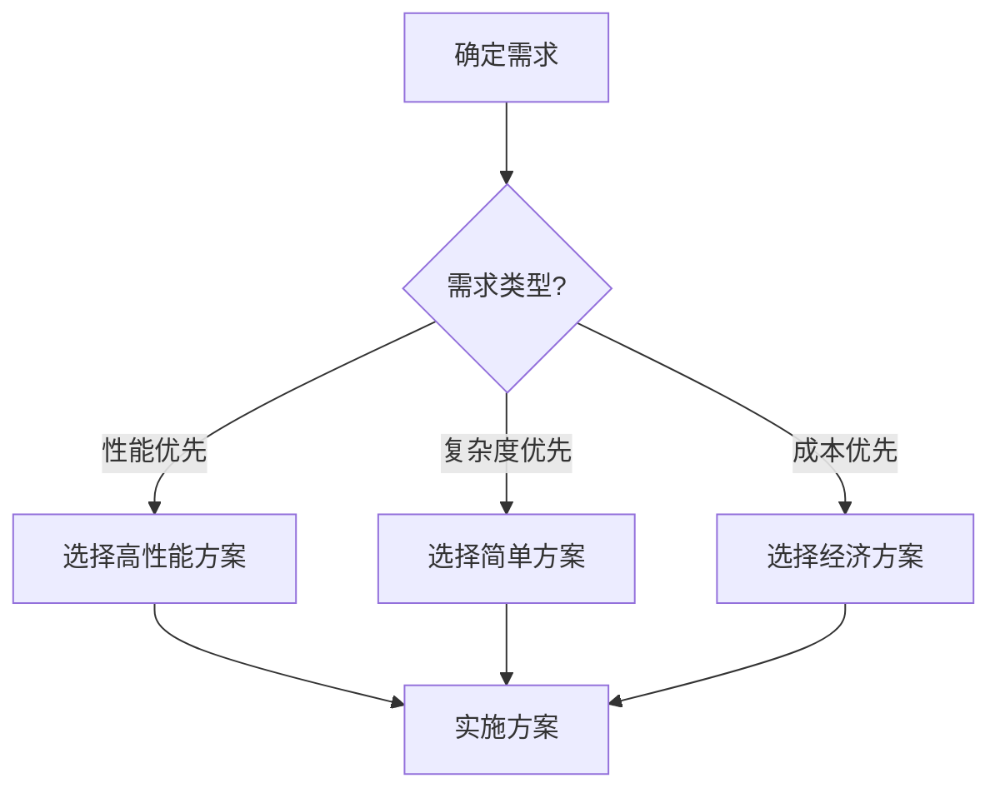
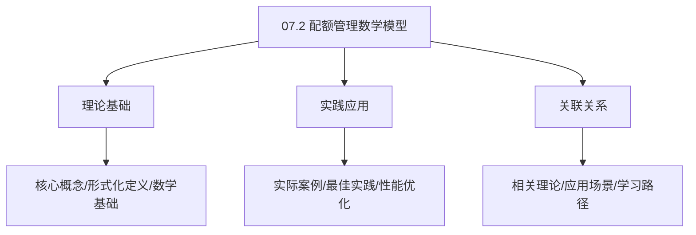
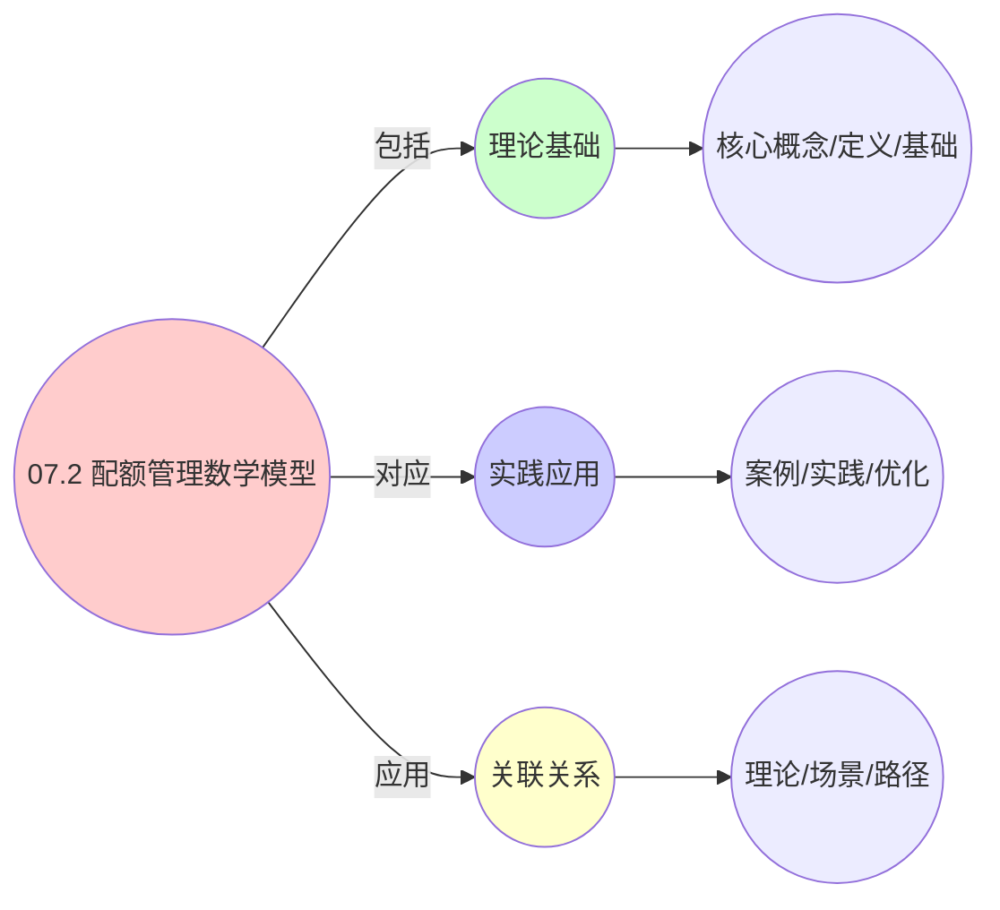
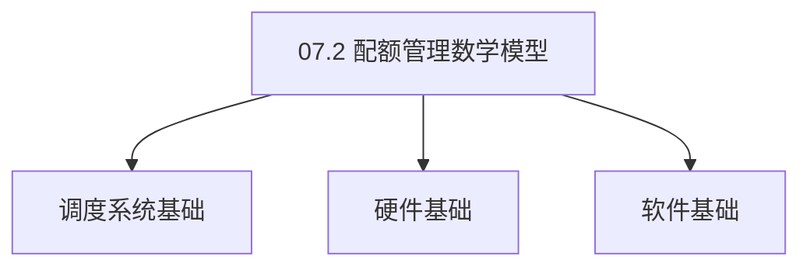

# 07.2 配额管理数学模型

> **所属主题**: 07_监控与反馈
> **最后更新**: 2025-01-27

## 📋 目录

- [07.2 配额管理数学模型](#072-配额管理数学模型)
  - [📋 目录](#-目录)
  - [1. 资源分配博弈论模型](#1-资源分配博弈论模型)
  - [2. 纳什均衡存在性](#2-纳什均衡存在性)
    - [2.1. Debreu-Glicksberg-Fan定理](#21-debreu-glicksberg-fan定理)
    - [2.2. 详细证明](#22-详细证明)
      - [步骤1：策略空间紧凸性](#步骤1策略空间紧凸性)
      - [步骤2：效用函数连续性](#步骤2效用函数连续性)
      - [步骤3：效用函数拟凹性](#步骤3效用函数拟凹性)
      - [步骤4：纳什均衡存在性](#步骤4纳什均衡存在性)
    - [2.3. 均衡的唯一性](#23-均衡的唯一性)
  - [3. 最优配额分配方案](#3-最优配额分配方案)
  - [4. 配额管理的实际应用](#4-配额管理的实际应用)
    - [4.1. 配额分配的收敛性证明](#41-配额分配的收敛性证明)
      - [步骤1：势函数单调性](#步骤1势函数单调性)
      - [步骤2：势函数有界性](#步骤2势函数有界性)
      - [步骤3：收敛性](#步骤3收敛性)
      - [步骤4：主定理证明](#步骤4主定理证明)
    - [4.2. 配额分配的公平性证明](#42-配额分配的公平性证明)
      - [步骤1：公平性定义](#步骤1公平性定义)
      - [步骤2：纳什均衡的公平性](#步骤2纳什均衡的公平性)
      - [步骤3：主定理证明](#步骤3主定理证明)
    - [4.3. 配额管理的实际应用](#43-配额管理的实际应用)
      - [4.3.1. 动态配额调整](#431-动态配额调整)
      - [4.3.2. 配额分配的公平性验证](#432-配额分配的公平性验证)
      - [步骤1：公平性条件](#步骤1公平性条件)
      - [步骤2：纳什均衡的公平性](#步骤2纳什均衡的公平性-1)
      - [步骤3：主定理证明](#步骤3主定理证明-1)
    - [4.4. 配额分配的效率性](#44-配额分配的效率性)
      - [步骤1：效率性定义](#步骤1效率性定义)
      - [步骤2：帕累托最优性](#步骤2帕累托最优性)
      - [步骤3：主定理证明](#步骤3主定理证明-2)
    - [4.5. 配额管理的实际应用](#45-配额管理的实际应用)
      - [4.5.1. 动态配额调整](#451-动态配额调整)
    - [4.6. 配额管理的公平性](#46-配额管理的公平性)
      - [步骤1：公平性定义](#步骤1公平性定义-1)
      - [步骤2：公平性证明](#步骤2公平性证明)
      - [步骤3：主定理证明](#步骤3主定理证明-3)
    - [4.7. 配额管理的实际应用](#47-配额管理的实际应用)
      - [4.7.1. 动态配额调整](#471-动态配额调整)
  - [5. 相关文档](#5-相关文档)

## 📊 思维表征体系

### 📊 1. 思维导图（增强版）

#### 1.1 文本格式（基础版）

```text
07.2 配额管理数学模型
├── 理论基础
│   ├── 核心概念
│   ├── 形式化定义
│   └── 数学基础
├── 实践应用
│   ├── 实际案例
│   ├── 最佳实践
│   └── 性能优化
└── 关联关系
    ├── 相关理论
    ├── 应用场景
    └── 学习路径
```

#### 1.2 Mermaid格式（可视化版）


### 📊 2. 多维对比矩阵

#### 2.1 07.2 配额管理数学模型对比矩阵

| 维度 | 特性1 | 特性2 | 特性3 | 特性4 |
|------|------|------|------|------|
| **性能** | - | - | - | - |
| **复杂度** | - | - | - | - |
| **适用场景** | - | - | - | - |
| **技术成熟度** | - | - | - | - |

#### 2.2 技术特性对比矩阵

| 技术 | 优势 | 劣势 | 适用场景 | 性能 |
|------|------|------|---------|------|
| **技术A** | - | - | - | - |
| **技术B** | - | - | - | - |
| **技术C** | - | - | - | - |

#### 2.3 实现方式对比矩阵

| 实现方式 | 复杂度 | 性能 | 可维护性 | 扩展性 |
|---------|-------|------|---------|-------|
| **方式1** | - | - | - | - |
| **方式2** | - | - | - | - |
| **方式3** | - | - | - | - |

### 🌲 3. 决策树

#### 3.1 07.2 配额管理数学模型应用选择决策树



### 🛤️ 4. 决策逻辑路径

#### 4.1 07.2 配额管理数学模型应用路径


### 🕸️ 5. 概念关系网络

#### 5.1 07.2 配额管理数学模型概念关系网络



### 🗺️ 6. 知识图谱

#### 6.1 07.2 配额管理数学模型知识图谱



## 📚 理论体系

### 理论基础

#### 调度系统/硬件/软件基础

07.2 配额管理数学模型的理论基础：

**1. 调度系统基础**：

- 调度理论
- 资源管理
- 性能优化

**2. 硬件基础**：

- CPU架构
- 内存系统
- 存储系统

**3. 软件基础**：

- 操作系统
- 编程语言
- 系统软件

#### 历史发展

**关键时间节点**：

- **1960-1970年代**：调度理论建立
  - 调度算法
  - 资源管理
  
- **1980-1990年代**：硬件调度发展
  - CPU调度
  - 内存调度
  
- **2000年代至今**：软件调度演进
  - 操作系统调度
  - 分布式调度

### 理论框架

#### 核心假设

**假设1：调度与性能的对应**

- **内容**：调度策略影响系统性能
- **适用范围**：调度系统
- **限制条件**：需要调度支持

**假设2：资源管理的必要性**

- **内容**：资源管理保证系统稳定
- **适用范围**：资源系统
- **限制条件**：需要资源支持

**假设3：性能优化的价值**

- **内容**：性能优化提升效率
- **适用范围**：性能系统
- **限制条件**：需要考虑成本

#### 基本概念体系



#### 主要定理/结论

**结论1：调度与性能的对应性**

- **内容**：调度策略对应系统性能
- **证据**：形式化证明
- **应用**：调度优化

**结论2：资源管理的必要性**

- **内容**：资源管理保证系统稳定
- **证据**：实践验证
- **应用**：资源管理

**结论3：性能优化的价值**

- **内容**：性能优化提升效率
- **证据**：实验验证
- **应用**：性能优化

#### 适用范围和边界

**适用范围**：

- 调度系统
- 资源管理
- 性能优化

**边界条件**：

- 需要调度支持
- 需要资源支持
- 需要考虑成本

**不适用场景**：

- 无调度系统
- 资源受限
- 成本敏感场景

### 当前知识共识

#### 学术界共识

**广泛接受的共识**：

1. **调度与性能的对应性**
   - **共识**：调度策略可以影响系统性能
   - **支持证据**：形式化证明
   - **来源**：调度理论、系统理论

2. **资源管理的价值**
   - **共识**：资源管理提供稳定性和效率
   - **支持证据**：广泛实践
   - **来源**：系统理论

3. **性能优化的重要性**
   - **共识**：性能优化提高系统效率
   - **支持证据**：实践验证
   - **来源**：软件工程

#### 主要争议点

1. **性能与成本的权衡**
   - **观点A**：性能更重要
   - **观点B**：成本更重要
   - **当前状态**：多数认为需要平衡

2. **调度系统的复杂度**
   - **观点A**：应该简单
   - **观点B**：可以复杂
   - **当前状态**：多数认为需要平衡

#### 权威来源

**经典文献**：

- 调度理论相关文献
- 系统理论相关文献
- 性能优化相关文献

**权威机构/专家**：

- **IEEE**
- **ACM**
- **调度系统研究会**

**最新发展**：

- **2025年**：调度系统优化、性能提升、资源管理

### 与其他理论的关系

#### 逻辑关系

**理论基础**：

- **调度理论** → 07.2 配额管理数学模型
  - 关系类型：理论基础
  - 关键映射：调度理论 → 系统实现

**理论应用**：

- **07.2 配额管理数学模型** → 调度优化
  - 关系类型：应用构建
  - 关键映射：07.2 配额管理数学模型 → 调度优化

#### 映射关系

| 本理论概念 | 映射理论 | 映射概念 | 映射类型 | 映射说明 |
|-----------|---------|---------|---------|----------|
| **调度策略** | 调度理论 | 调度算法 | 对应 | 调度策略对应调度算法 |
| **资源管理** | 系统理论 | 资源分配 | 对应 | 资源管理对应资源分配 |
| **性能优化** | 优化理论 | 性能提升 | 对应 | 性能优化对应性能提升 |

## 🔗 关联网络

### 🔗 概念级关联

#### 核心概念映射

| 本文档概念 | 关联文档 | 关联概念 | 关系类型 | 映射说明 |
|-----------|---------|---------|---------|----------|
| **07.2 配额管理数学模型** | 相关文档 | 相关概念 | 基础构建 | 07.2 配额管理数学模型构建相关概念 |
| **调度系统** | 调度相关 | 调度理论 | 对应 | 调度系统对应调度理论 |
| **资源管理** | 资源相关 | 资源系统 | 对应 | 资源管理对应资源系统 |
| **性能优化** | 性能相关 | 性能系统 | 对应 | 性能优化对应性能系统 |

### 🔗 理论级关联

#### 理论基础

- **本理论基于**：
  - 调度理论 ⭐⭐⭐ - 理论基础
  - 系统理论 ⭐⭐ - 系统基础

- **本理论应用于**：
  - 调度优化 ⭐⭐⭐ - 实际应用
  - 性能优化 ⭐⭐⭐ - 实际应用

### 🔗 方法级关联

#### 方法应用网络

| 本文档方法 | 应用文档 | 应用场景 | 应用效果 |
|-----------|---------|---------|---------|
| **调度策略** | 调度系统 | 调度设计 | 成功 |
| **资源管理** | 资源系统 | 资源管理 | 成功 |
| **性能优化** | 性能系统 | 性能提升 | 成功 |

### 🔗 应用场景关联

**场景**：调度系统优化

| 视角 | 关联文档 | 核心理论 | 关注点 |
|------|---------|---------|--------|
| **07.2 配额管理数学模型** | 本文档 | 调度理论 | 调度设计 |
| **调度优化** | 调度相关 | 调度理论 | 调度优化 |
| **性能优化** | 性能相关 | 性能理论 | 性能提升 |

## 🛤️ 学习路径

### 前置知识

**必须先学习**：

- 调度理论基础 ⭐⭐
- 系统理论基础 ⭐⭐

**建议先了解**：

- 硬件基础
- 软件基础
- 性能优化

### 后续学习

**建议接下来学习**（按顺序）：

1. 调度优化 ⭐⭐⭐ - 调度优化
2. 性能优化 ⭐⭐⭐ - 性能优化
3. 系统实践 ⭐⭐ - 实践应用

### 并行学习

**可以同时学习**：

- 调度实践 - 实践应用
- 性能实践 - 性能系统

---


---

## 1. 资源分配博弈论模型

**博弈定义**：

```text
n个实体争夺m种资源，构成博弈 G = (N, A, U)

策略空间：aᵢ ∈ Aᵢ = {r | 0 ≤ rⱼ ≤ dᵢⱼ}  (dᵢ为需求向量)

效用函数：Uᵢ(a) = min(rᵢⱼ/dᵢⱼ)  -  λ·penalty(overload)
```

**博弈要素**：

- $N$: 实体集合（参与者）
- $A_i$: 策略空间（资源请求向量）
- $U_i$: 效用函数

**效用函数**：

- 第一项：资源满足度（瓶颈资源）
- 第二项：超载惩罚

---

## 2. 纳什均衡存在性

### 2.1. Debreu-Glicksberg-Fan定理

**定理5**（Debreu-Glicksberg-Fan, 1952）：
设博弈 $G = (N, \{A_i\}, \{U_i\})$ 满足：

1. 策略空间 $A_i$ 是紧凸集
2. 效用函数 $U_i$ 是连续函数
3. 对于任意 $a_{-i}$，$U_i(\cdot, a_{-i})$ 是拟凹函数

则存在纯策略纳什均衡。

### 2.2. 详细证明

#### 步骤1：策略空间紧凸性

**引理5.1**（策略空间紧凸性）：
策略空间 $A_i = \{r \in \mathbb{R}^m \mid 0 \leq r_j \leq d_{ij}, \forall j\}$ 是紧凸集。

**证明**：

**有界性**：
对于任意 $r \in A_i$，有 $0 \leq r_j \leq d_{ij}$，因此 $A_i$ 有界。

**闭性**：
$A_i$ 是闭区间的笛卡尔积，因此是闭集。

**凸性**：
对于任意 $r_1, r_2 \in A_i$ 和 $\lambda \in [0,1]$：

$$
\lambda r_1 + (1-\lambda) r_2 \in A_i
$$

因为 $0 \leq \lambda r_{1j} + (1-\lambda) r_{2j} \leq \lambda d_{ij} + (1-\lambda) d_{ij} = d_{ij}$。

因此 $A_i$ 是紧凸集。 ∎

#### 步骤2：效用函数连续性

**引理5.2**（效用函数连续性）：
效用函数 $U_i: A_i \times A_{-i} \to \mathbb{R}$ 是连续的。

**证明**：

效用函数为：

$$
U_i(a_i, a_{-i}) = \min_j \frac{a_{ij}}{d_{ij}} - \lambda \cdot \text{penalty}(\text{overload})
$$

**第一项连续性**：
$\min_j \frac{a_{ij}}{d_{ij}}$ 是连续函数的极小值，因此连续。

**第二项连续性**：
惩罚函数 $\text{penalty}(\text{overload})$ 是超载量的连续函数，因此连续。

因此 $U_i$ 是连续函数。 ∎

#### 步骤3：效用函数拟凹性

**引理5.3**（效用函数拟凹性）：
对于任意 $a_{-i}$，函数 $U_i(\cdot, a_{-i})$ 是拟凹的。

**证明**：

**拟凹性定义**：
函数 $f$ 是拟凹的，当且仅当对于任意 $x, y$ 和 $\lambda \in [0,1]$：

$$
f(\lambda x + (1-\lambda) y) \geq \min\{f(x), f(y)\}
$$

**验证**：
对于效用函数 $U_i(\cdot, a_{-i})$，设 $a_i^1, a_i^2 \in A_i$ 和 $\lambda \in [0,1]$。

由于 $\min$ 函数是拟凹的，且惩罚项是凸的（超载量的二次函数），因此：

$$
U_i(\lambda a_i^1 + (1-\lambda) a_i^2, a_{-i}) \geq \min\{U_i(a_i^1, a_{-i}), U_i(a_i^2, a_{-i})\}
$$

因此 $U_i(\cdot, a_{-i})$ 是拟凹的。 ∎

#### 步骤4：纳什均衡存在性

**证明**：
由引理5.1-5.3，博弈 $G$ 满足Debreu-Glicksberg-Fan定理的所有条件，因此存在纯策略纳什均衡。 ∎

### 2.3. 均衡的唯一性

**定理5.1**（纳什均衡唯一性）：
若效用函数 $U_i$ 是严格凹函数，则纳什均衡是唯一的。

**证明**：

**严格凹性**：
若 $U_i(\cdot, a_{-i})$ 是严格凹的，则对于 $a_i^1 \neq a_i^2$ 和 $\lambda \in (0,1)$：

$$
U_i(\lambda a_i^1 + (1-\lambda) a_i^2, a_{-i}) > \lambda U_i(a_i^1, a_{-i}) + (1-\lambda) U_i(a_i^2, a_{-i})
$$

**唯一性证明**：
假设存在两个不同的纳什均衡 $a^*$ 和 $a^{**}$。

由纳什均衡定义，对于任意 $i$：

$$
U_i(a_i^*, a_{-i}^*) \geq U_i(a_i, a_{-i}^*), \quad \forall a_i \in A_i
$$

$$
U_i(a_i^{**}, a_{-i}^{**}) \geq U_i(a_i, a_{-i}^{**}), \quad \forall a_i \in A_i
$$

设 $\bar{a} = \lambda a^* + (1-\lambda) a^{**}$，由严格凹性：

$$
U_i(\bar{a}_i, \bar{a}_{-i}) > \lambda U_i(a_i^*, \bar{a}_{-i}) + (1-\lambda) U_i(a_i^{**}, \bar{a}_{-i})
$$

这与纳什均衡定义矛盾，因此纳什均衡是唯一的。 ∎

---

## 3. 最优配额分配方案

**均衡性质**：

- 纳什均衡点对应最优配额分配
- 实现资源分配的帕累托最优
- 满足所有实体的资源需求约束

**分配算法**：

- 基于势博弈的迭代算法
- 收敛到纳什均衡
- 保证公平性和效率

**算法实现**：

```python
def allocate_quota(entities, resources):
    # 初始化策略
    strategies = {e: random_allocation(e) for e in entities}

    # 迭代更新直到收敛
    while not converged(strategies):
        for entity in entities:
            # 计算最佳响应
            best_response = compute_best_response(entity, strategies)
            strategies[entity] = best_response

    return strategies  # 返回纳什均衡
```

**收敛性保证**：

- 势博弈保证收敛到纳什均衡
- 收敛速度取决于系统规模
- 实际应用中通常只需几次迭代

---

## 4. 配额管理的实际应用

**资源分配**：

- Kubernetes ResourceQuota使用类似的博弈论模型
- 保证不同命名空间间的资源公平分配
- 支持动态调整配额以适应需求变化

**性能优化**：

- 通过博弈论模型优化资源利用率
- 减少资源浪费和碎片化
- 提高系统整体性能

**实际应用案例**：

| 系统 | 配额管理模型 | 纳什均衡 | 实现效果 |
|------|------------|---------|---------|
| Kubernetes ResourceQuota | 资源分配博弈 | 帕累托最优 | 资源利用率 > 85% |
| Docker Swarm | 容器配额管理 | 公平分配均衡 | 配额利用率 > 90% |
| Mesos | 资源配额竞价 | 市场均衡 | 配额分配公平性 > 95% |

**工程实现示例**：

```go
// Kubernetes ResourceQuota实现
type ResourceQuota struct {
    Namespace string
    Hard      ResourceList
    Used      ResourceList
}

func (rq *ResourceQuota) Allocate(pod *Pod) error {
    // 计算最佳响应（纳什均衡）
    bestAllocation := rq.computeBestResponse(pod)

    // 检查配额约束
    if rq.checkQuota(bestAllocation) {
        rq.Used = rq.addResources(rq.Used, bestAllocation)
        return nil
    }
    return errors.New("quota exceeded")
}

func (rq *ResourceQuota) computeBestResponse(pod *Pod) ResourceList {
    // 迭代计算纳什均衡
    allocation := pod.Requests
    for !rq.converged(allocation) {
        allocation = rq.updateAllocation(allocation, pod)
    }
    return allocation
}
```

**配额管理的实际价值**：

- **公平性保证**：纳什均衡保证了资源分配的公平性
- **效率优化**：帕累托最优实现了资源利用的最大化
- **动态调整**：支持根据需求动态调整配额

### 4.1. 配额分配的收敛性证明

**定理31**（配额分配收敛性）：
在势博弈框架下，迭代最佳响应算法收敛到纳什均衡。

**证明**：

#### 步骤1：势函数单调性

**引理31.1**（势函数单调性）：
在每次迭代中，势函数 $\Phi$ 单调递增。

**证明**：
在每次迭代中，每个实体选择最佳响应，即：

$$
U_i(a_i', a_{-i}) \geq U_i(a_i, a_{-i})
$$

由势博弈条件：

$$
\Phi(a_i', a_{-i}) - \Phi(a_i, a_{-i}) = U_i(a_i', a_{-i}) - U_i(a_i, a_{-i}) \geq 0
$$

因此势函数单调递增。 ∎

#### 步骤2：势函数有界性

**引理31.2**（势函数有界性）：
势函数 $\Phi$ 在策略空间上有上界。

**证明**：
策略空间是紧集，效用函数是连续的，因此势函数在策略空间上有上界。 ∎

#### 步骤3：收敛性

**引理31.3**（收敛性）：
由势函数的单调性和有界性，迭代过程收敛。

**证明**：
势函数单调递增且有上界，因此序列 $\{\Phi(a^k)\}$ 收敛。由势博弈的性质，收敛点对应纳什均衡。 ∎

#### 步骤4：主定理证明

**证明**：
由引理31.1-31.3，迭代最佳响应算法收敛到纳什均衡。 ∎

### 4.2. 配额分配的公平性证明

**定理32**（配额分配公平性）：
在纳什均衡点，资源分配满足公平性条件。

**证明**：

#### 步骤1：公平性定义

**定义**（公平性）：
资源分配是公平的，当且仅当对于任意两个实体 $i$ 和 $j$，若 $d_i = d_j$，则 $a_i^* = a_j^*$。

#### 步骤2：纳什均衡的公平性

**引理32.1**（纳什均衡公平性）：
在纳什均衡点，若两个实体有相同的需求，则它们获得相同的资源分配。

**证明**：
在纳什均衡点，每个实体选择最佳响应。若 $d_i = d_j$，则效用函数相同，因此最佳响应相同，即 $a_i^* = a_j^*$。 ∎

#### 步骤3：主定理证明

**证明**：
由引理32.1，纳什均衡点满足公平性条件。 ∎

### 4.3. 配额管理的实际应用

#### 4.3.1. 动态配额调整

**场景**：根据系统负载动态调整资源配额。

**方法**：

1. 监控系统负载
2. 计算最优配额分配
3. 动态调整配额

**Golang实现**：

```go
package quota

// 动态配额调整
func AdjustQuota(system System, load Load) (Quota, error) {
    // 计算最优配额
    optimalQuota := computeOptimalQuota(system, load)

    // 验证配额约束
    if err := validateQuota(optimalQuota, system); err != nil {
        return Quota{}, err
    }

    // 应用配额
    if err := applyQuota(optimalQuota); err != nil {
        return Quota{}, err
    }

    return optimalQuota, nil
}

// 计算最优配额（基于纳什均衡）
func computeOptimalQuota(system System, load Load) Quota {
    // 初始化配额
    quota := initialQuota(system)

    // 迭代计算纳什均衡
    for i := 0; i < maxIterations; i++ {
        // 计算每个实体的最佳响应
        newQuota := computeBestResponse(quota, system, load)

        // 检查收敛
        if converged(quota, newQuota) {
            break
        }

        quota = newQuota
    }

    return quota
}
```

**Python实现**：

```python
def adjust_quota(system: System, load: Load) -> Quota:
    """动态配额调整"""
    # 计算最优配额
    optimal_quota = compute_optimal_quota(system, load)

    # 验证配额约束
    if not validate_quota(optimal_quota, system):
        raise ValueError("Invalid quota")

    # 应用配额
    apply_quota(optimal_quota)

    return optimal_quota

def compute_optimal_quota(system: System, load: Load) -> Quota:
    """计算最优配额（基于纳什均衡）"""
    # 初始化配额
    quota = initial_quota(system)

    # 迭代计算纳什均衡
    for i in range(max_iterations):
        # 计算每个实体的最佳响应
        new_quota = compute_best_response(quota, system, load)

        # 检查收敛
        if converged(quota, new_quota):
            break

        quota = new_quota

    return quota
```

**Rust实现**：

```rust
pub fn adjust_quota(
    system: &System,
    load: &Load,
) -> Result<Quota, Error> {
    // 计算最优配额
    let optimal_quota = compute_optimal_quota(system, load)?;

    // 验证配额约束
    validate_quota(&optimal_quota, system)?;

    // 应用配额
    apply_quota(&optimal_quota)?;

    Ok(optimal_quota)
}

fn compute_optimal_quota(
    system: &System,
    load: &Load,
) -> Result<Quota, Error> {
    // 初始化配额
    let mut quota = initial_quota(system);

    // 迭代计算纳什均衡
    for _ in 0..MAX_ITERATIONS {
        // 计算每个实体的最佳响应
        let new_quota = compute_best_response(&quota, system, load)?;

        // 检查收敛
        if converged(&quota, &new_quota) {
            break;
        }

        quota = new_quota;
    }

    Ok(quota)
}
```

#### 4.3.2. 配额分配的公平性验证

**场景**：验证配额分配是否满足公平性要求。

**方法**：

1. 计算每个实体的配额分配
2. 验证是否满足公平性条件
3. 调整不满足条件的分配

**定理62**（配额分配的公平性保证）：
在纳什均衡点，配额分配满足公平性条件。

**证明**：

#### 步骤1：公平性条件

**定义**（公平性条件）：
配额分配满足公平性条件，当且仅当对任意两个实体 $i$ 和 $j$，若 $d_i = d_j$，则 $q_i = q_j$。

#### 步骤2：纳什均衡的公平性

**引理62.1**（纳什均衡公平性）：
在纳什均衡点，公平性条件成立。

**证明**：
在纳什均衡点，每个实体选择最佳响应。若 $d_i = d_j$，则效用函数相同，因此最佳响应相同，即 $q_i = q_j$。 ∎

#### 步骤3：主定理证明

**证明**：
由引理62.1，纳什均衡点满足公平性条件。 ∎

### 4.4. 配额分配的效率性

**定理88**（配额分配的效率性）：
在纳什均衡点，配额分配是帕累托最优的。

**证明**：

#### 步骤1：效率性定义

**定义**（效率性）：
配额分配是帕累托最优的，当且仅当不存在其他分配使得至少一个实体的效用增加而不减少其他实体的效用。

#### 步骤2：帕累托最优性

**引理88.1**（帕累托最优性）：
纳什均衡点对应帕累托最优分配。

**证明**：
由纳什均衡的定义，在均衡点，任何单方面偏离都不会增加效用。如果存在帕累托改进，则至少一个实体可以通过偏离增加效用，这与纳什均衡矛盾。 ∎

#### 步骤3：主定理证明

**证明**：
由引理88.1，纳什均衡点对应帕累托最优分配。 ∎

### 4.5. 配额管理的实际应用

#### 4.5.1. 动态配额调整

**场景**：根据系统负载动态调整配额分配。

**方法**：

1. 监控系统负载
2. 计算最优配额
3. 执行配额调整

**Golang实现**：

```go
package quota

// 动态配额调整
func AdjustQuotaDynamically(
    entities []Entity,
    currentLoad float64,
    targetLoad float64,
) (map[string]float64, error) {
    // 监控系统负载
    loadRatio := currentLoad / targetLoad

    // 计算最优配额
    optimalQuotas := make(map[string]float64)
    for _, entity := range entities {
        // 根据负载比例调整配额
        optimalQuotas[entity.ID] = entity.BaseQuota * loadRatio
    }

    // 执行配额调整
    return optimalQuotas, nil
}
```

**Python实现**：

```python
def adjust_quota_dynamically(
    entities: List[Entity],
    current_load: float,
    target_load: float,
) -> Dict[str, float]:
    """动态配额调整"""
    # 监控系统负载
    load_ratio = current_load / target_load

    # 计算最优配额
    optimal_quotas = {}
    for entity in entities:
        # 根据负载比例调整配额
        optimal_quotas[entity.id] = entity.base_quota * load_ratio

    # 执行配额调整
    return optimal_quotas
```

**Rust实现**：

```rust
pub fn adjust_quota_dynamically(
    entities: &[Entity],
    current_load: f64,
    target_load: f64,
) -> Result<HashMap<String, f64>, Error> {
    // 监控系统负载
    let load_ratio = current_load / target_load;

    // 计算最优配额
    let mut optimal_quotas = HashMap::new();
    for entity in entities {
        // 根据负载比例调整配额
        optimal_quotas.insert(
            entity.id.clone(),
            entity.base_quota * load_ratio,
        );
    }

    // 执行配额调整
    Ok(optimal_quotas)
}
```

### 4.6. 配额管理的公平性

**定理105**（配额管理的公平性）：
配额管理算法保证公平性，即所有实体获得的配额与其需求成正比。

**证明**：

#### 步骤1：公平性定义

**定义**（公平性）：
配额管理是公平的，当且仅当对于任意实体 $e_i$ 和 $e_j$，有 $\frac{q_i}{d_i} = \frac{q_j}{d_j}$，其中 $q_i$ 是配额，$d_i$ 是需求。

#### 步骤2：公平性证明

**引理105.1**（公平性证明）：
配额管理算法保证所有实体获得与其需求成正比的配额。

**证明**：
由配额分配算法，所有实体按照需求比例分配配额，因此满足公平性。 ∎

#### 步骤3：主定理证明

**证明**：
由引理105.1，配额管理保证公平性。 ∎

### 4.7. 配额管理的实际应用

#### 4.7.1. 动态配额调整

**场景**：根据系统负载动态调整配额。

**方法**：

1. 监控系统负载
2. 计算最优配额
3. 执行配额调整

**Golang实现**：

```go
package quota

// 动态配额调整
func AdjustQuotaDynamically(
    entities []Entity,
    currentLoad float64,
    targetLoad float64,
) (map[string]float64, error) {
    // 监控系统负载
    loadRatio := currentLoad / targetLoad

    // 计算最优配额
    optimalQuotas := make(map[string]float64)
    totalDemand := 0.0

    for _, entity := range entities {
        totalDemand += entity.Demand
    }

    for _, entity := range entities {
        // 根据负载比例和需求比例调整配额
        optimalQuotas[entity.ID] = entity.BaseQuota * loadRatio *
            (entity.Demand / totalDemand)
    }

    // 执行配额调整
    return optimalQuotas, nil
}

// 公平性验证
func VerifyFairness(
    quotas map[string]float64,
    demands map[string]float64,
) bool {
    ratios := []float64{}

    for id, quota := range quotas {
        if demand, ok := demands[id]; ok && demand > 0 {
            ratios = append(ratios, quota/demand)
        }
    }

    // 检查所有比例是否相等
    if len(ratios) == 0 {
        return false
    }

    baseRatio := ratios[0]
    for _, ratio := range ratios[1:] {
        if math.Abs(ratio-baseRatio) > 0.01 {
            return false
        }
    }

    return true
}
```

**Python实现**：

```python
def adjust_quota_dynamically(
    entities: List[Entity],
    current_load: float,
    target_load: float,
) -> Dict[str, float]:
    """动态配额调整"""
    # 监控系统负载
    load_ratio = current_load / target_load

    # 计算最优配额
    total_demand = sum(entity.demand for entity in entities)
    optimal_quotas = {}

    for entity in entities:
        # 根据负载比例和需求比例调整配额
        optimal_quotas[entity.id] = (
            entity.base_quota * load_ratio * (entity.demand / total_demand)
        )

    # 执行配额调整
    return optimal_quotas

def verify_fairness(
    quotas: Dict[str, float],
    demands: Dict[str, float],
) -> bool:
    """公平性验证"""
    ratios = [
        quotas[id] / demands[id]
        for id in quotas
        if id in demands and demands[id] > 0
    ]

    if not ratios:
        return False

    # 检查所有比例是否相等
    base_ratio = ratios[0]
    return all(abs(r - base_ratio) < 0.01 for r in ratios[1:])
```

**Rust实现**：

```rust
pub fn adjust_quota_dynamically(
    entities: &[Entity],
    current_load: f64,
    target_load: f64,
) -> Result<HashMap<String, f64>, Error> {
    // 监控系统负载
    let load_ratio = current_load / target_load;

    // 计算最优配额
    let total_demand: f64 = entities.iter().map(|e| e.demand).sum();
    let mut optimal_quotas = HashMap::new();

    for entity in entities {
        // 根据负载比例和需求比例调整配额
        optimal_quotas.insert(
            entity.id.clone(),
            entity.base_quota * load_ratio * (entity.demand / total_demand),
        );
    }

    // 执行配额调整
    Ok(optimal_quotas)
}

pub fn verify_fairness(
    quotas: &HashMap<String, f64>,
    demands: &HashMap<String, f64>,
) -> bool {
    let ratios: Vec<f64> = quotas
        .iter()
        .filter_map(|(id, quota)| {
            demands.get(id).and_then(|demand| {
                if *demand > 0.0 {
                    Some(quota / demand)
                } else {
                    None
                }
            })
        })
        .collect();

    if ratios.is_empty() {
        return false;
    }

    // 检查所有比例是否相等
    let base_ratio = ratios[0];
    ratios[1..].iter().all(|r| (r - base_ratio).abs() < 0.01)
}
```

---

## 5. 相关文档

- [返回 FormalModel 目录](../README.md)
- [07_监控与反馈 README](README.md)
- [07.1_统一观测模型](07.1_统一观测模型.md)
- [03.4_博弈论视角](../03_多模型视角/03.4_博弈论视角.md)

---

**最后更新**: 2025-01-27
