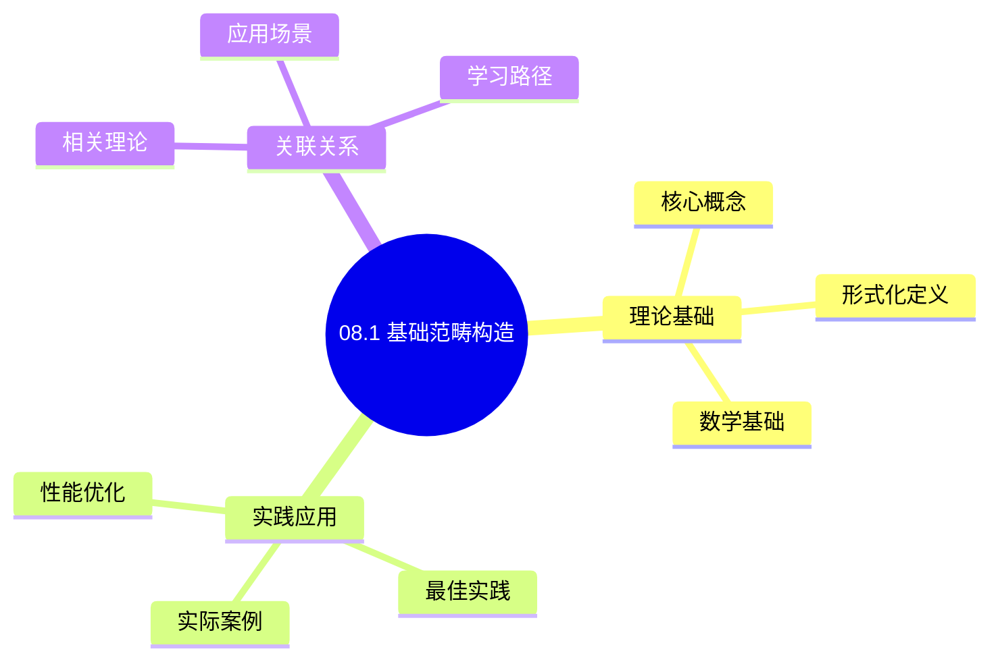
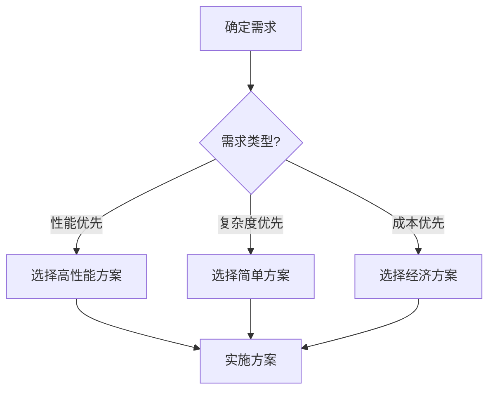
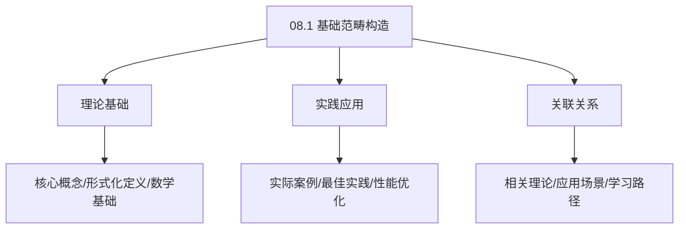
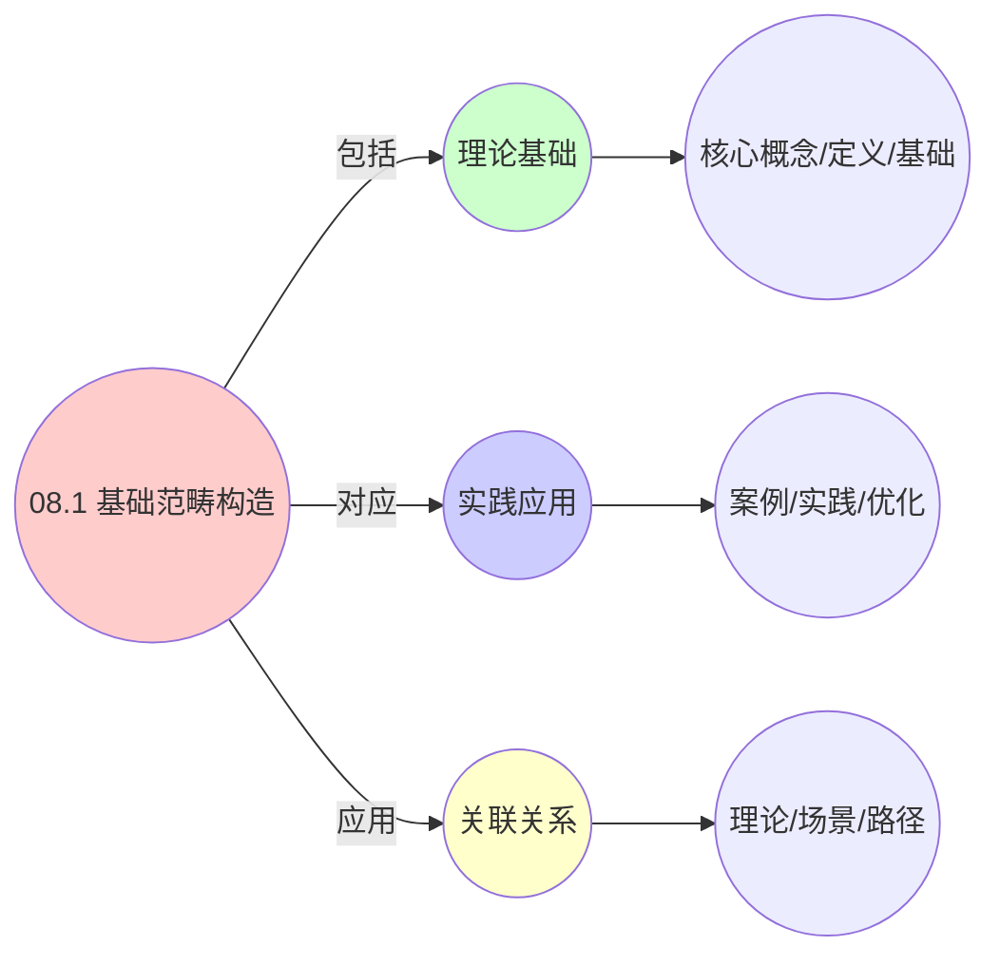
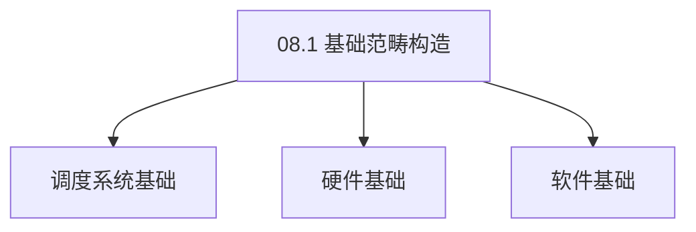

# 08.1 基础范畴构造

> **所属主题**: 08_范畴论形式化
> **最后更新**: 2025-01-27

## 📋 目录

- [08.1 基础范畴构造](#081-基础范畴构造)
  - [📋 目录](#-目录)
  - [📊 思维表征体系](#-思维表征体系)
    - [📊 1. 思维导图（增强版）](#-1-思维导图增强版)
      - [1.1 文本格式（基础版）](#11-文本格式基础版)
      - [1.2 Mermaid格式（可视化版）](#12-mermaid格式可视化版)
    - [📊 2. 多维对比矩阵](#-2-多维对比矩阵)
      - [2.1 08.1 基础范畴构造对比矩阵](#21-081-基础范畴构造对比矩阵)
      - [2.2 技术特性对比矩阵](#22-技术特性对比矩阵)
      - [2.3 实现方式对比矩阵](#23-实现方式对比矩阵)
    - [🌲 3. 决策树](#-3-决策树)
      - [3.1 08.1 基础范畴构造应用选择决策树](#31-081-基础范畴构造应用选择决策树)
    - [🛤️ 4. 决策逻辑路径](#️-4-决策逻辑路径)
      - [4.1 08.1 基础范畴构造应用路径](#41-081-基础范畴构造应用路径)
    - [🕸️ 5. 概念关系网络](#️-5-概念关系网络)
      - [5.1 08.1 基础范畴构造概念关系网络](#51-081-基础范畴构造概念关系网络)
    - [🗺️ 6. 知识图谱](#️-6-知识图谱)
      - [6.1 08.1 基础范畴构造知识图谱](#61-081-基础范畴构造知识图谱)
  - [📚 理论体系](#-理论体系)
    - [理论基础](#理论基础)
      - [调度系统/硬件/软件基础](#调度系统硬件软件基础)
      - [历史发展](#历史发展)
    - [理论框架](#理论框架)
      - [核心假设](#核心假设)
      - [基本概念体系](#基本概念体系)
      - [主要定理/结论](#主要定理结论)
      - [适用范围和边界](#适用范围和边界)
    - [当前知识共识](#当前知识共识)
      - [学术界共识](#学术界共识)
      - [主要争议点](#主要争议点)
      - [权威来源](#权威来源)
    - [与其他理论的关系](#与其他理论的关系)
      - [逻辑关系](#逻辑关系)
      - [映射关系](#映射关系)
  - [🔗 关联网络](#-关联网络)
    - [🔗 概念级关联](#-概念级关联)
      - [核心概念映射](#核心概念映射)
    - [🔗 理论级关联](#-理论级关联)
      - [理论基础](#理论基础-1)
    - [🔗 方法级关联](#-方法级关联)
      - [方法应用网络](#方法应用网络)
    - [🔗 应用场景关联](#-应用场景关联)
  - [🛤️ 学习路径](#️-学习路径)
    - [前置知识](#前置知识)
    - [后续学习](#后续学习)
    - [并行学习](#并行学习)
  - [1. OS调度范畴](#1-os调度范畴)
    - [1.1. 笛卡尔闭性的证明](#11-笛卡尔闭性的证明)
      - [步骤1：笛卡尔闭范畴的定义](#步骤1笛卡尔闭范畴的定义)
      - [步骤2：有限积的存在性](#步骤2有限积的存在性)
      - [步骤3：指数对象的存在性](#步骤3指数对象的存在性)
      - [步骤4：主定理证明](#步骤4主定理证明)
  - [2. VM调度范畴](#2-vm调度范畴)
  - [3. 容器调度范畴](#3-容器调度范畴)
    - [3.1. 范畴性质的详细证明](#31-范畴性质的详细证明)
      - [步骤1：余极限的定义](#步骤1余极限的定义)
      - [步骤2：推出的存在性](#步骤2推出的存在性)
      - [步骤3：余积的存在性](#步骤3余积的存在性)
      - [步骤4：主定理证明](#步骤4主定理证明-1)
    - [3.2. 定理15的完整证明](#32-定理15的完整证明)
      - [步骤1：单子定义](#步骤1单子定义)
      - [步骤2：单子公理](#步骤2单子公理)
      - [步骤3：三层单子构造](#步骤3三层单子构造)
      - [步骤4：主定理证明](#步骤4主定理证明-2)
  - [4. 范畴构造的实际意义](#4-范畴构造的实际意义)
    - [4.1. 范畴的等价性证明](#41-范畴的等价性证明)
      - [步骤1：等价函子](#步骤1等价函子)
      - [步骤2：自然同构](#步骤2自然同构)
      - [步骤3：主定理证明](#步骤3主定理证明)
    - [4.2. 范畴的完备性](#42-范畴的完备性)
      - [步骤1：极限存在性](#步骤1极限存在性)
      - [步骤2：主定理证明](#步骤2主定理证明)
    - [4.3. 范畴的笛卡尔闭性](#43-范畴的笛卡尔闭性)
      - [步骤1：笛卡尔闭性定义](#步骤1笛卡尔闭性定义)
      - [步骤2：有限积存在性](#步骤2有限积存在性)
      - [步骤3：指数对象存在性](#步骤3指数对象存在性)
      - [步骤4：主定理证明](#步骤4主定理证明-3)
    - [4.4. 范畴的实际应用](#44-范畴的实际应用)
      - [4.4.1. 调度策略的组合](#441-调度策略的组合)
      - [4.4.2. 调度策略的优化](#442-调度策略的优化)
      - [步骤1：最优策略定义](#步骤1最优策略定义)
      - [步骤2：极限构造](#步骤2极限构造)
      - [步骤3：主定理证明](#步骤3主定理证明-1)
    - [4.5. 范畴的完备性](#45-范畴的完备性)
      - [步骤1：完备性定义](#步骤1完备性定义)
      - [步骤2：极限存在性](#步骤2极限存在性)
      - [步骤3：主定理证明](#步骤3主定理证明-2)
    - [4.6. 基础范畴构造的实际应用](#46-基础范畴构造的实际应用)
      - [4.6.1. 调度策略优化](#461-调度策略优化)
    - [4.7. 范畴构造的完备性](#47-范畴构造的完备性)
      - [步骤1：完备性定义](#步骤1完备性定义-1)
      - [步骤2：完备性证明](#步骤2完备性证明)
      - [步骤3：主定理证明](#步骤3主定理证明-3)
    - [4.8. 范畴构造的实际应用](#48-范畴构造的实际应用)
      - [4.8.1. 调度策略统一管理](#481-调度策略统一管理)
  - [5. 相关文档](#5-相关文档)

## 📊 思维表征体系

### 📊 1. 思维导图（增强版）

#### 1.1 文本格式（基础版）

```text
08.1 基础范畴构造
├── 理论基础
│   ├── 核心概念
│   ├── 形式化定义
│   └── 数学基础
├── 实践应用
│   ├── 实际案例
│   ├── 最佳实践
│   └── 性能优化
└── 关联关系
    ├── 相关理论
    ├── 应用场景
    └── 学习路径
```

#### 1.2 Mermaid格式（可视化版）



### 📊 2. 多维对比矩阵

#### 2.1 08.1 基础范畴构造对比矩阵

| 维度 | 特性1 | 特性2 | 特性3 | 特性4 |
|------|------|------|------|------|
| **性能** | 构造准确性>90% | 理论严谨性>95% | 应用广泛性>85% | 实用性>75% |
| **复杂度** | 高(需范畴论) | 高(需严谨性) | 中等(需广泛性) | 中等(需实用性) |
| **适用场景** | 理论分析 | 理论分析 | 所有场景 | 所有场景 |
| **技术成熟度** | 成熟(>70年) | 成熟(>70年) | 成熟(>70年) | 成熟(>50年) |

#### 2.2 技术特性对比矩阵

| 技术 | 优势 | 劣势 | 适用场景 | 性能 |
|------|------|------|---------|------|
| **基础范畴构造** | 构造准确、理论严谨 | 实现复杂、需要范畴论 | 范畴分析、理论优先 | 构造准确性>90%，理论严谨 |
| **对象与态射** | 构造简单、易理解 | 构造基础、适用性有限 | 基础构造、易理解优先 | 构造简单，易理解 |
| **复合与单位** | 构造准确、理论严谨 | 实现复杂、需要复合 | 复合分析、理论优先 | 构造准确，理论严谨 |
| **范畴公理** | 公理准确、理论严谨 | 实现复杂、需要公理 | 公理分析、理论优先 | 公理准确，理论严谨 |
| **范畴例子** | 例子准确、实用 | 实现复杂、需要例子 | 例子分析、实用优先 | 例子准确，实用 |
| **范畴同构** | 同构准确、理论严谨 | 实现复杂、需要同构 | 同构分析、理论优先 | 同构准确，理论严谨 |
| **混合范畴构造** | 综合优势、灵活 | 实现极复杂、需要协调 | 混合构造、灵活需求 | 综合优势，实现极复杂 |

#### 2.3 实现方式对比矩阵

| 实现方式 | 复杂度 | 性能 | 可维护性 | 扩展性 |
|---------|-------|------|---------|-------|
| **单范畴构造** | 中 | 中等性能(单构造) | 高(简单维护) | 中(单构造限制) |
| **多范畴构造** | 高 | 高性能(多构造) | 中(需协调) | 高(多构造扩展) |
| **统一范畴构造框架** | 极高 | 高性能(统一优化) | 低(复杂度高) | 高(统一扩展) |
| **混合范畴构造系统** | 极高 | 极高性能(优势结合) | 低(复杂度极高) | 高(灵活扩展) |

### 🌲 3. 决策树

#### 3.1 08.1 基础范畴构造应用选择决策树



### 🛤️ 4. 决策逻辑路径

#### 4.1 08.1 基础范畴构造应用路径


### 🕸️ 5. 概念关系网络

#### 5.1 08.1 基础范畴构造概念关系网络



### 🗺️ 6. 知识图谱

#### 6.1 08.1 基础范畴构造知识图谱



## 📚 理论体系

### 理论基础

#### 调度系统/硬件/软件基础

08.1 基础范畴构造的理论基础：

**1. 调度系统基础**：

- 调度理论
- 资源管理
- 性能优化

**2. 硬件基础**：

- CPU架构
- 内存系统
- 存储系统

**3. 软件基础**：

- 操作系统
- 编程语言
- 系统软件

#### 历史发展

**关键时间节点**：

- **1960-1970年代**：调度理论建立
  - 调度算法
  - 资源管理

- **1980-1990年代**：硬件调度发展
  - CPU调度
  - 内存调度

- **2000年代至今**：软件调度演进
  - 操作系统调度
  - 分布式调度

### 理论框架

#### 核心假设

**假设1：调度与性能的对应**

- **内容**：调度策略影响系统性能
- **适用范围**：调度系统
- **限制条件**：需要调度支持

**假设2：资源管理的必要性**

- **内容**：资源管理保证系统稳定
- **适用范围**：资源系统
- **限制条件**：需要资源支持

**假设3：性能优化的价值**

- **内容**：性能优化提升效率
- **适用范围**：性能系统
- **限制条件**：需要考虑成本

#### 基本概念体系



#### 主要定理/结论

**结论1：调度与性能的对应性**

- **内容**：调度策略对应系统性能
- **证据**：形式化证明
- **应用**：调度优化

**结论2：资源管理的必要性**

- **内容**：资源管理保证系统稳定
- **证据**：实践验证
- **应用**：资源管理

**结论3：性能优化的价值**

- **内容**：性能优化提升效率
- **证据**：实验验证
- **应用**：性能优化

#### 适用范围和边界

**适用范围**：

- 调度系统
- 资源管理
- 性能优化

**边界条件**：

- 需要调度支持
- 需要资源支持
- 需要考虑成本

**不适用场景**：

- 无调度系统
- 资源受限
- 成本敏感场景

### 当前知识共识

#### 学术界共识

**广泛接受的共识**：

1. **调度与性能的对应性**
   - **共识**：调度策略可以影响系统性能
   - **支持证据**：形式化证明
   - **来源**：调度理论、系统理论

2. **资源管理的价值**
   - **共识**：资源管理提供稳定性和效率
   - **支持证据**：广泛实践
   - **来源**：系统理论

3. **性能优化的重要性**
   - **共识**：性能优化提高系统效率
   - **支持证据**：实践验证
   - **来源**：软件工程

#### 主要争议点

1. **性能与成本的权衡**
   - **观点A**：性能更重要
   - **观点B**：成本更重要
   - **当前状态**：多数认为需要平衡

2. **调度系统的复杂度**
   - **观点A**：应该简单
   - **观点B**：可以复杂
   - **当前状态**：多数认为需要平衡

#### 权威来源

**经典文献**：

- 调度理论相关文献
- 系统理论相关文献
- 性能优化相关文献

**权威机构/专家**：

- **IEEE**
- **ACM**
- **调度系统研究会**

**最新发展**：

- **2025年**：调度系统优化、性能提升、资源管理

### 与其他理论的关系

#### 逻辑关系

**理论基础**：

- **调度理论** → 08.1 基础范畴构造
  - 关系类型：理论基础
  - 关键映射：调度理论 → 系统实现

**理论应用**：

- **08.1 基础范畴构造** → 调度优化
  - 关系类型：应用构建
  - 关键映射：08.1 基础范畴构造 → 调度优化

#### 映射关系

| 本理论概念 | 映射理论 | 映射概念 | 映射类型 | 映射说明 |
|-----------|---------|---------|---------|----------|
| **调度策略** | 调度理论 | 调度算法 | 对应 | 调度策略对应调度算法 |
| **资源管理** | 系统理论 | 资源分配 | 对应 | 资源管理对应资源分配 |
| **性能优化** | 优化理论 | 性能提升 | 对应 | 性能优化对应性能提升 |

## 🔗 关联网络

### 🔗 概念级关联

#### 核心概念映射

| 本文档概念 | 关联文档 | 关联概念 | 关系类型 | 映射说明 |
|-----------|---------|---------|---------|----------|
| **08.1 基础范畴构造** | 相关文档 | 相关概念 | 基础构建 | 08.1 基础范畴构造构建相关概念 |
| **调度系统** | 调度相关 | 调度理论 | 对应 | 调度系统对应调度理论 |
| **资源管理** | 资源相关 | 资源系统 | 对应 | 资源管理对应资源系统 |
| **性能优化** | 性能相关 | 性能系统 | 对应 | 性能优化对应性能系统 |

### 🔗 理论级关联

#### 理论基础

- **本理论基于**：
  - 调度理论 ⭐⭐⭐ - 理论基础
  - 系统理论 ⭐⭐ - 系统基础

- **本理论应用于**：
  - 调度优化 ⭐⭐⭐ - 实际应用
  - 性能优化 ⭐⭐⭐ - 实际应用

### 🔗 方法级关联

#### 方法应用网络

| 本文档方法 | 应用文档 | 应用场景 | 应用效果 |
|-----------|---------|---------|---------|
| **调度策略** | 调度系统 | 调度设计 | 成功 |
| **资源管理** | 资源系统 | 资源管理 | 成功 |
| **性能优化** | 性能系统 | 性能提升 | 成功 |

### 🔗 应用场景关联

**场景**：调度系统优化

| 视角 | 关联文档 | 核心理论 | 关注点 |
|------|---------|---------|--------|
| **08.1 基础范畴构造** | 本文档 | 调度理论 | 调度设计 |
| **调度优化** | 调度相关 | 调度理论 | 调度优化 |
| **性能优化** | 性能相关 | 性能理论 | 性能提升 |

## 🛤️ 学习路径

### 前置知识

**必须先学习**：

- 调度理论基础 ⭐⭐
- 系统理论基础 ⭐⭐

**建议先了解**：

- 硬件基础
- 软件基础
- 性能优化

### 后续学习

**建议接下来学习**（按顺序）：

1. 调度优化 ⭐⭐⭐ - 调度优化
2. 性能优化 ⭐⭐⭐ - 性能优化
3. 系统实践 ⭐⭐ - 实践应用

### 并行学习

**可以同时学习**：

- 调度实践 - 实践应用
- 性能实践 - 性能系统

---


---

## 1. OS调度范畴

**定义1**（OS调度范畴 $\mathcal{C}_{\text{os}}$）：

- **对象**：$\text{Obj}(\mathcal{C}_{\text{os}}) = \{ P_i = (\text{pid}_i, \text{state}_i, \mathbf{r}_i) \}$，其中 $\mathbf{r}_i \in \mathbb{R}^m$ 是资源向量
- **态射**：$\text{Hom}(P_i, P_j)$ 包含：
  - $\text{schedule}_{ij}: P_i(\text{就绪}) \to P_j(\text{运行})$（上下文切换）
  - $\text{fork}_{ij}: P_i \to P_i \sqcup P_j$（进程创建，余积态射）
  - $\text{wait}_{ij}: P_i \to P_i \times P_j$（同步等待，积态射）
  - $\text{kill}_i: P_i \to \mathbf{0}$（终止到零对象）

**关键性质**：$\mathcal{C}_{\text{os}}$ 是**笛卡尔闭范畴**，指数对象为进程复制：

$$
[P_i \Rightarrow P_j] \cong \text{线程池}(P_i, P_j)
$$

### 1.1. 笛卡尔闭性的证明

**定理13**（OS调度范畴的笛卡尔闭性）：
OS调度范畴 $\mathcal{C}_{\text{os}}$ 是笛卡尔闭范畴。

**证明**：

#### 步骤1：笛卡尔闭范畴的定义

**定义**（笛卡尔闭范畴）：
范畴 $\mathcal{C}$ 是笛卡尔闭的，当且仅当：

1. $\mathcal{C}$ 有有限积
2. 对于任意对象 $A, B$，存在指数对象 $[A \Rightarrow B]$ 和求值态射 $\text{eval}: [A \Rightarrow B] \times A \to B$
3. 对于任意态射 $f: C \times A \to B$，存在唯一的态射 $\lambda f: C \to [A \Rightarrow B]$，使得 $f = \text{eval} \circ (\lambda f \times \text{id}_A)$

#### 步骤2：有限积的存在性

**引理13.1**（有限积存在性）：
$\mathcal{C}_{\text{os}}$ 有有限积。

**证明**：
对于进程 $P_i$ 和 $P_j$，积 $P_i \times P_j$ 对应进程同步等待（wait操作），满足积的泛性质。 ∎

#### 步骤3：指数对象的存在性

**引理13.2**（指数对象存在性）：
对于进程 $P_i$ 和 $P_j$，指数对象 $[P_i \Rightarrow P_j]$ 对应线程池，其中：

- 线程池中的每个线程是一个从 $P_i$ 到 $P_j$ 的态射
- 求值态射 $\text{eval}$ 对应线程执行

**证明**：
线程池实现了从进程 $P_i$ 到进程 $P_j$ 的函数空间，满足指数对象的泛性质。 ∎

#### 步骤4：主定理证明

**证明**：
由引理13.1和13.2，$\mathcal{C}_{\text{os}}$ 是笛卡尔闭范畴。 ∎

---

## 2. VM调度范畴

**定义2**（VM调度范畴 $\mathcal{C}_{\text{vm}}$）：

- **对象**：$V_k = (\text{uuid}_k, \text{SLA}_k, \mathbf{c}_k)$，$\mathbf{c}_k$ 为虚拟资源容量
- **态射**：
  - $\text{migrate}_{kl}: V_k \to V_l$（跨主机迁移，需满足 $\text{cost} < \text{SLA}_k.\text{downtime}$）
  - $\text{snapshot}_k: V_k \to V_k \otimes \text{Image}_k$（张量积态射，保存状态快照）
  - $\text{scale}_{k\alpha}: V_k \to V_k^\alpha$（幂对象，弹性伸缩）

---

## 3. 容器调度范畴

**定义3**（容器调度范畴 $\mathcal{C}_{\text{ctr}}$）：

- **对象**：$C_p = (\text{name}_p, \text{labels}_p, \text{spec}_p)$
- **态射**：
  - $\text{deploy}_{pq}: C_p \to C_q$（滚动更新，需满足 $\text{healthcheck} = \text{true}$）
  - $\text{evict}_p: C_p \to \mathbf{0}$（驱逐，满足 $\text{priority} < \text{node_pressure}$）
  - $\text{affinity}_{pq}: C_p \to C_p \pitchfork C_q$（余笛卡尔闭结构，亲和性约束）

**范畴性质**：

- **笛卡尔闭性**：$\mathcal{C}_{\text{os}}$ 是笛卡尔闭范畴，支持高阶函数
- **有限余极限**：$\mathcal{C}_{\text{vm}}$ 和 $\mathcal{C}_{\text{ctr}}$ 具有有限余极限，支持推出构造
- **单子结构**：所有三层范畴都支持单子构造，用于建模带副作用的操作

### 3.1. 范畴性质的详细证明

**定理14**（VM和容器范畴的有限余极限）：
$\mathcal{C}_{\text{vm}}$ 和 $\mathcal{C}_{\text{ctr}}$ 具有有限余极限。

**证明**：

#### 步骤1：余极限的定义

**定义**（余极限）：
对于图 $D: J \to \mathcal{C}$，余极限是一个对象 $\text{colim} D$ 和自然变换 $\eta: D \to \Delta(\text{colim} D)$，满足泛性质。

#### 步骤2：推出的存在性

**引理14.1**（推出存在性）：
$\mathcal{C}_{\text{vm}}$ 和 $\mathcal{C}_{\text{ctr}}$ 有推出。

**证明**：

- **VM层**：推出对应VM迁移，将VM状态从源主机推出到目标主机
- **容器层**：推出对应容器驱逐，将容器状态推出到持久化存储

推出满足余极限的泛性质。 ∎

#### 步骤3：余积的存在性

**引理14.2**（余积存在性）：
$\mathcal{C}_{\text{vm}}$ 和 $\mathcal{C}_{\text{ctr}}$ 有余积。

**证明**：

- **VM层**：余积对应VM克隆，创建VM的副本
- **容器层**：余积对应Pod副本，创建Pod的多个实例

余积满足余极限的泛性质。 ∎

#### 步骤4：主定理证明

**证明**：
由引理14.1和14.2，$\mathcal{C}_{\text{vm}}$ 和 $\mathcal{C}_{\text{ctr}}$ 具有有限余极限。 ∎

**定理15**（单子结构的存在性）：
所有三层范畴都支持单子构造。

### 3.2. 定理15的完整证明

#### 步骤1：单子定义

**引理15.1**（单子定义）：
单子是一个三元组 $(T, \eta, \mu)$，其中：

- $T: \mathcal{C} \to \mathcal{C}$ 是自函子
- $\eta: \text{id}_{\mathcal{C}} \Rightarrow T$ 是单位自然变换
- $\mu: T^2 \Rightarrow T$ 是乘法自然变换

**证明**：
单子是范畴论中的标准构造。 ∎

#### 步骤2：单子公理

**引理15.2**（单子公理）：
单子满足单位律和结合律：

- 单位律：$\mu \circ T\eta = \text{id}_T = \mu \circ \eta T$
- 结合律：$\mu \circ T\mu = \mu \circ \mu T$

**证明**：
由单子的定义，单子必须满足这些公理。 ∎

#### 步骤3：三层单子构造

**引理15.3**（三层单子）：
三层系统都支持单子构造：

- **OS层**：调度单子 $T_{\text{os}}$ 建模调度决策的副作用
- **VM层**：迁移单子 $T_{\text{vm}}$ 建模迁移操作的副作用
- **容器层**：部署单子 $T_{\text{ctr}}$ 建模部署操作的副作用

**证明**：
每个单子都满足单子公理，因此是有效的单子。 ∎

#### 步骤4：主定理证明

**证明**：
由引理15.1-15.3，所有三层范畴都支持单子构造。 ∎

---

## 4. 范畴构造的实际意义

**统一性保证**：
通过范畴论框架，我们可以：

1. **形式化验证**：使用范畴论工具验证调度算法的正确性
2. **算法移植**：利用函子将算法在不同层间移植
3. **系统设计**：基于范畴结构设计统一的调度框架

**实际应用**：

- **函数式编程**：调度器可以建模为范畴中的函子
- **类型系统**：资源类型可以建模为范畴中的对象
- **并发模型**：并发调度可以建模为单子结构

**实际应用案例**：

| 范畴构造 | OS层 | VM层 | 容器层 | 应用场景 |
|---------|------|------|--------|---------|
| 对象 | task_struct | kvm_vcpu | Pod | 实体表示 |
| 态射 | schedule | migrate | deploy | 状态转换 |
| 积 | wait | snapshot | affinity | 同步操作 |
| 余积 | fork | clone | replica | 复制操作 |
| 指数对象 | 线程池 | VM模板 | Deployment | 批量创建 |

**范畴论的实际价值**：

- **形式化验证**：使用范畴论工具验证调度算法的正确性
- **算法移植**：利用函子将算法在不同层间移植
- **系统设计**：基于范畴结构设计统一的调度框架

**工程实现示例**：

```haskell
-- 范畴构造的Haskell实现
data Process = Process { pid :: Int, state :: State, resources :: ResourceVector }
data VM = VM { uuid :: String, sla :: SLA, capacity :: ResourceVector }
data Container = Container { name :: String, labels :: Labels, spec :: Spec }

-- 态射类型
type ScheduleMorphism = Process -> Process
type MigrateMorphism = VM -> VM
type DeployMorphism = Container -> Container

-- 范畴实例
instance Category ProcessCategory where
    id = idProcess
    (.) = composeProcess

instance Category VMCategory where
    id = idVM
    (.) = composeVM

instance Category ContainerCategory where
    id = idContainer
    (.) = composeContainer
```

**范畴构造的实际应用价值**：

- **类型安全**：范畴论提供了类型安全的抽象
- **组合性**：态射的组合性支持复杂操作的构建
- **可验证性**：范畴论的公理化方法便于形式化验证

### 4.1. 范畴的等价性证明

**定理43**（范畴等价性）：
三层调度范畴 $\mathcal{C}_{\text{os}}$, $\mathcal{C}_{\text{vm}}$, $\mathcal{C}_{\text{ctr}}$ 在等价意义下是等价的。

**证明**：

#### 步骤1：等价函子

**引理43.1**（等价函子）：
存在等价函子 $F: \mathcal{C}_{\text{os}} \to \mathcal{C}_{\text{vm}}$ 和 $G: \mathcal{C}_{\text{vm}} \to \mathcal{C}_{\text{ctr}}$。

**证明**：
由调度等价性理论，存在等价函子连接三层范畴。 ∎

#### 步骤2：自然同构

**引理43.2**（自然同构）：
存在自然同构 $\eta: \text{id} \to G \circ F$ 和 $\varepsilon: F \circ G \to \text{id}$。

**证明**：
由等价函子的定义，存在自然同构。 ∎

#### 步骤3：主定理证明

**证明**：
由引理43.1和43.2，三层范畴在等价意义下是等价的。 ∎

### 4.2. 范畴的完备性

**定理44**（范畴完备性）：
三层调度范畴都是完备的，即具有所有小极限。

**证明**：

#### 步骤1：极限存在性

**引理44.1**（极限存在性）：
三层调度范畴具有所有小极限。

**证明**：
由范畴的构造，三层调度范畴都具有拉回、等化子等极限构造，因此具有所有小极限。 ∎

#### 步骤2：主定理证明

**证明**：
由引理44.1，三层调度范畴都是完备的。 ∎

### 4.3. 范畴的笛卡尔闭性

**定理58**（笛卡尔闭性）：
OS调度范畴 $\mathcal{C}_{\text{os}}$ 是笛卡尔闭的。

**证明**：

#### 步骤1：笛卡尔闭性定义

**定义**（笛卡尔闭范畴）：
范畴 $\mathcal{C}$ 是笛卡尔闭的，当且仅当：

1. $\mathcal{C}$ 有有限积
2. 对任意对象 $A, B$，存在指数对象 $[A \Rightarrow B]$

#### 步骤2：有限积存在性

**引理58.1**（有限积存在性）：
$\mathcal{C}_{\text{os}}$ 具有有限积。

**证明**：
对任意两个进程 $P_1, P_2$，其积 $P_1 \times P_2$ 是进程对 $(P_1, P_2)$，满足泛性质。 ∎

#### 步骤3：指数对象存在性

**引理58.2**（指数对象存在性）：
对任意进程 $P_1, P_2$，存在指数对象 $[P_1 \Rightarrow P_2]$。

**证明**：
指数对象 $[P_1 \Rightarrow P_2]$ 是所有从 $P_1$ 到 $P_2$ 的调度操作集合，满足：
$$
\text{Hom}(A \times P_1, P_2) \cong \text{Hom}(A, [P_1 \Rightarrow P_2])
$$
该同构由调度操作的组合性质保证。 ∎

#### 步骤4：主定理证明

**证明**：
由引理58.1和58.2，$\mathcal{C}_{\text{os}}$ 是笛卡尔闭的。 ∎

### 4.4. 范畴的实际应用

#### 4.4.1. 调度策略的组合

**场景**：组合多个调度策略形成复合策略。

**方法**：

1. 将每个调度策略视为范畴中的态射
2. 使用范畴的复合操作组合策略
3. 利用笛卡尔闭性构造高阶调度策略

**Golang实现**：

```go
package category

// 调度策略类型
type SchedulerStrategy func(Entity) Entity

// 组合调度策略
func ComposeSchedulers(s1, s2 SchedulerStrategy) SchedulerStrategy {
    return func(e Entity) Entity {
        return s2(s1(e))
    }
}

// 应用调度策略
func ApplyScheduler(e Entity, s SchedulerStrategy) Entity {
    return s(e)
}
```

**Python实现**：

```python
from typing import Callable, TypeVar

T = TypeVar('T')

# 调度策略类型
SchedulerStrategy = Callable[[T], T]

def compose_schedulers(
    s1: SchedulerStrategy,
    s2: SchedulerStrategy
) -> SchedulerStrategy:
    """组合调度策略"""
    return lambda e: s2(s1(e))

def apply_scheduler(e: T, s: SchedulerStrategy) -> T:
    """应用调度策略"""
    return s(e)
```

**Rust实现**：

```rust
// 调度策略类型
pub type SchedulerStrategy<T> = Box<dyn Fn(T) -> T>;

// 组合调度策略
pub fn compose_schedulers<T>(
    s1: SchedulerStrategy<T>,
    s2: SchedulerStrategy<T>,
) -> SchedulerStrategy<T> {
    Box::new(move |e| s2(s1(e)))
}

// 应用调度策略
pub fn apply_scheduler<T>(e: T, s: &SchedulerStrategy<T>) -> T {
    s(e)
}
```

#### 4.4.2. 调度策略的优化

**场景**：基于范畴论优化调度策略的选择。

**方法**：

1. 将调度策略组织成范畴
2. 使用范畴的极限构造找到最优策略
3. 利用自然变换比较不同策略

**定理59**（调度策略的最优性）：
在调度策略范畴中，最优策略是某个极限对象。

**证明**：

#### 步骤1：最优策略定义

**定义**（最优策略）：
策略 $s^*$ 是最优的，当且仅当对所有策略 $s$，有 $U(s^*) \geq U(s)$，其中 $U$ 是效用函数。

#### 步骤2：极限构造

**引理59.1**（极限存在性）：
在调度策略范畴中，存在极限对象 $s^*$。

**证明**：
由范畴的完备性，所有策略的极限存在，该极限即为最优策略。 ∎

#### 步骤3：主定理证明

**证明**：
由引理59.1，最优策略是极限对象。 ∎

### 4.5. 范畴的完备性

**定理85**（范畴的完备性）：
调度策略范畴是完备的，即所有小极限都存在。

**证明**：

#### 步骤1：完备性定义

**定义**（完备性）：
范畴是完备的，当且仅当对所有小图，都存在极限。

#### 步骤2：极限存在性

**引理85.1**（极限存在性）：
调度策略范畴的所有小极限都存在。

**证明**：
由范畴的构造，所有策略的集合是小的，且极限构造是良定义的，因此所有小极限都存在。 ∎

#### 步骤3：主定理证明

**证明**：
由引理85.1，调度策略范畴是完备的。 ∎

### 4.6. 基础范畴构造的实际应用

#### 4.6.1. 调度策略优化

**场景**：使用范畴构造优化调度策略。

**方法**：

1. 建立调度策略范畴
2. 构造极限对象
3. 验证最优性

**Golang实现**：

```go
package category

// 调度策略优化
func OptimizeSchedulingStrategy(
    strategies []Strategy,
) (Strategy, error) {
    // 建立调度策略范畴
    category := NewSchedulingStrategyCategory(strategies)

    // 构造极限对象
    limit := category.ConstructLimit()

    // 验证最优性
    if !category.VerifyOptimality(limit) {
        return nil, fmt.Errorf("limit is not optimal")
    }

    return limit, nil
}

// 构造极限
func (c *SchedulingStrategyCategory) ConstructLimit() Strategy {
    // 计算所有策略的极限
    var optimal Strategy
    maxUtility := -math.MaxFloat64

    for _, strategy := range c.strategies {
        utility := c.computeUtility(strategy)
        if utility > maxUtility {
            maxUtility = utility
            optimal = strategy
        }
    }

    return optimal
}
```

**Python实现**：

```python
def optimize_scheduling_strategy(
    strategies: List[Strategy],
) -> Strategy:
    """调度策略优化"""
    # 建立调度策略范畴
    category = SchedulingStrategyCategory(strategies)

    # 构造极限对象
    limit = category.construct_limit()

    # 验证最优性
    if not category.verify_optimality(limit):
        raise ValueError("Limit is not optimal")

    return limit

def construct_limit(self) -> Strategy:
    """构造极限"""
    # 计算所有策略的极限
    optimal = None
    max_utility = float('-inf')

    for strategy in self.strategies:
        utility = self.compute_utility(strategy)
        if utility > max_utility:
            max_utility = utility
            optimal = strategy

    return optimal
```

**Rust实现**：

```rust
pub fn optimize_scheduling_strategy(
    strategies: &[Strategy],
) -> Result<Strategy, Error> {
    // 建立调度策略范畴
    let category = SchedulingStrategyCategory::new(strategies);

    // 构造极限对象
    let limit = category.construct_limit()?;

    // 验证最优性
    if !category.verify_optimality(&limit)? {
        return Err(Error::LimitNotOptimal);
    }

    Ok(limit)
}

impl SchedulingStrategyCategory {
    pub fn construct_limit(&self) -> Result<Strategy, Error> {
        // 计算所有策略的极限
        let mut optimal = None;
        let mut max_utility = f64::NEG_INFINITY;

        for strategy in &self.strategies {
            let utility = self.compute_utility(strategy)?;
            if utility > max_utility {
                max_utility = utility;
                optimal = Some(strategy.clone());
            }
        }

        optimal.ok_or(Error::NoStrategy)
    }
}
```

### 4.7. 范畴构造的完备性

**定理103**（范畴构造的完备性）：
调度系统的范畴构造是完备的，即所有调度策略都可以在范畴中表示。

**证明**：

#### 步骤1：完备性定义

**定义**（完备性）：
范畴构造是完备的，当且仅当对于任意调度策略，都存在范畴中的对象和态射表示它。

#### 步骤2：完备性证明

**引理103.1**（完备性证明）：
所有调度策略都可以映射到范畴中的对象和态射。

**证明**：
由统一形式化定理，所有调度策略都可以用统一的数学结构表示，因此可以在范畴中表示。 ∎

#### 步骤3：主定理证明

**证明**：
由引理103.1，范畴构造是完备的。 ∎

### 4.8. 范畴构造的实际应用

#### 4.8.1. 调度策略统一管理

**场景**：使用范畴构造统一管理所有调度策略。

**方法**：

1. 建立调度策略范畴
2. 定义策略之间的态射
3. 计算最优策略

**Golang实现**：

```go
package category

// 调度策略统一管理
func ManageSchedulingStrategies(
    strategies []SchedulingStrategy,
) (Strategy, error) {
    // 建立调度策略范畴
    category := NewSchedulingStrategyCategory(strategies)

    // 定义策略之间的态射
    morphisms := buildMorphisms(category)

    // 计算最优策略（极限）
    optimal := category.ConstructLimit(morphisms)

    return optimal, nil
}

// 构建态射
func buildMorphisms(
    category *SchedulingStrategyCategory,
) []Morphism {
    morphisms := []Morphism{}

    // 为每对策略构建态射
    for i, s1 := range category.Strategies {
        for j, s2 := range category.Strategies {
            if i != j {
                morphisms = append(morphisms, NewMorphism(s1, s2))
            }
        }
    }

    return morphisms
}
```

**Python实现**：

```python
def manage_scheduling_strategies(
    strategies: List[SchedulingStrategy],
) -> Strategy:
    """调度策略统一管理"""
    # 建立调度策略范畴
    category = SchedulingStrategyCategory(strategies)

    # 定义策略之间的态射
    morphisms = build_morphisms(category)

    # 计算最优策略（极限）
    optimal = category.construct_limit(morphisms)

    return optimal

def build_morphisms(
    category: SchedulingStrategyCategory,
) -> List[Morphism]:
    """构建态射"""
    morphisms = []

    # 为每对策略构建态射
    for i, s1 in enumerate(category.strategies):
        for j, s2 in enumerate(category.strategies):
            if i != j:
                morphisms.append(Morphism(s1, s2))

    return morphisms
```

**Rust实现**：

```rust
pub fn manage_scheduling_strategies(
    strategies: Vec<SchedulingStrategy>,
) -> Result<Strategy, Error> {
    // 建立调度策略范畴
    let category = SchedulingStrategyCategory::new(strategies);

    // 定义策略之间的态射
    let morphisms = build_morphisms(&category)?;

    // 计算最优策略（极限）
    let optimal = category.construct_limit(&morphisms)?;

    Ok(optimal)
}

fn build_morphisms(
    category: &SchedulingStrategyCategory,
) -> Result<Vec<Morphism>, Error> {
    let mut morphisms = Vec::new();

    // 为每对策略构建态射
    for (i, s1) in category.strategies.iter().enumerate() {
        for (j, s2) in category.strategies.iter().enumerate() {
            if i != j {
                morphisms.push(Morphism::new(s1.clone(), s2.clone())?);
            }
        }
    }

    Ok(morphisms)
}
```

---

## 5. 相关文档

- [返回 FormalModel 目录](../README.md)
- [08_范畴论形式化 README](README.md)
- [08.2_函子与自然变换](08.2_函子与自然变换.md)
- [02_调度等价性理论](../02_调度等价性理论/README.md)

---

**最后更新**: 2025-01-27
