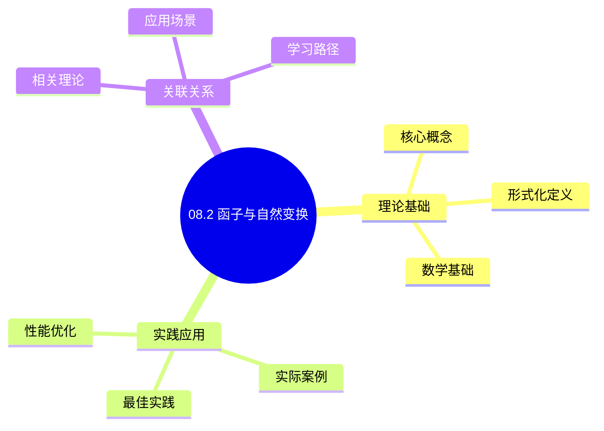
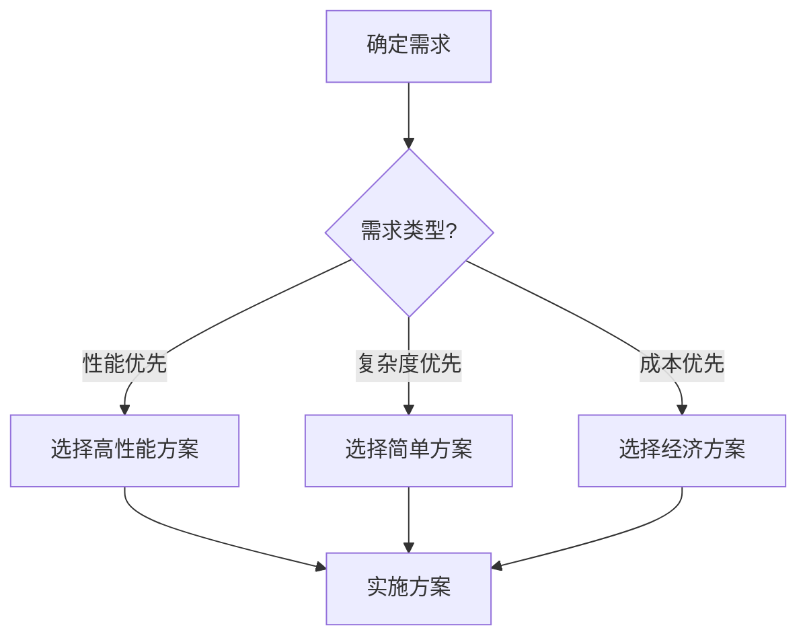
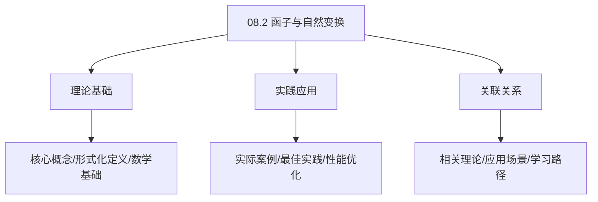
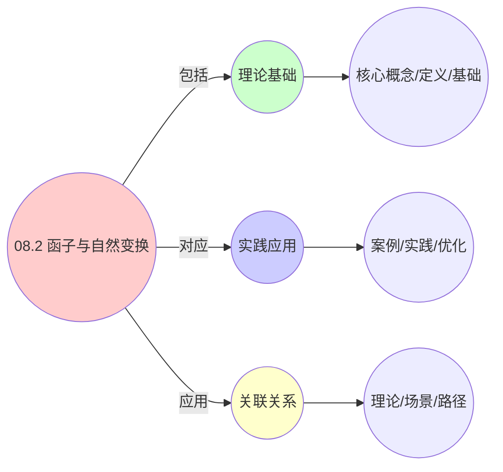
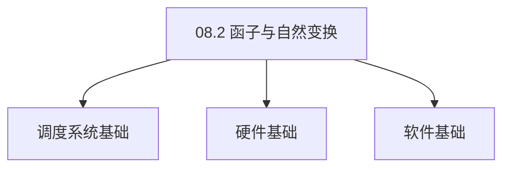

# 08.2 函子与自然变换

> **所属主题**: 08_范畴论形式化
> **最后更新**: 2025-01-27

## 📋 目录

- [08.2 函子与自然变换](#082-函子与自然变换)
  - [📋 目录](#-目录)
  - [1. 虚拟化函子](#1-虚拟化函子)
    - [1.1. 定理1的完整证明](#11-定理1的完整证明)
      - [步骤1：忠实函子的定义](#步骤1忠实函子的定义)
      - [步骤2：单态射保持](#步骤2单态射保持)
      - [步骤3：满态射保持](#步骤3满态射保持)
      - [步骤4：复合保持](#步骤4复合保持)
      - [步骤5：主定理证明](#步骤5主定理证明)
  - [2. 容器化函子](#2-容器化函子)
    - [2.1. 定理2的完整证明](#21-定理2的完整证明)
      - [步骤1：余极限保持的定义](#步骤1余极限保持的定义)
      - [步骤2：余积保持](#步骤2余积保持)
      - [步骤3：推出保持](#步骤3推出保持)
      - [步骤4：主定理证明](#步骤4主定理证明)
  - [3. 自然变换](#3-自然变换)
    - [3.1. 自然变换的完整证明](#31-自然变换的完整证明)
      - [步骤1：自然性的定义](#步骤1自然性的定义)
      - [步骤2：交换图验证](#步骤2交换图验证)
      - [步骤3：主定理证明](#步骤3主定理证明)
  - [4. 函子与自然变换的实际应用](#4-函子与自然变换的实际应用)
    - [Golang实现](#golang实现)
      - [Python实现](#python实现)
      - [Rust实现](#rust实现)
    - [4.1. 自然变换的交换性](#41-自然变换的交换性)
      - [步骤1：交换性定义](#步骤1交换性定义)
      - [步骤2：交换图验证](#步骤2交换图验证-1)
      - [步骤3：主定理证明](#步骤3主定理证明-1)
    - [4.2. 函子与自然变换的实际应用](#42-函子与自然变换的实际应用)
      - [4.2.1. 层间转换验证](#421-层间转换验证)
  - [5. 相关文档](#5-相关文档)

## 📊 思维表征体系

### 📊 1. 思维导图（增强版）

#### 1.1 文本格式（基础版）

```text
08.2 函子与自然变换
├── 理论基础
│   ├── 核心概念
│   ├── 形式化定义
│   └── 数学基础
├── 实践应用
│   ├── 实际案例
│   ├── 最佳实践
│   └── 性能优化
└── 关联关系
    ├── 相关理论
    ├── 应用场景
    └── 学习路径
```

#### 1.2 Mermaid格式（可视化版）



### 📊 2. 多维对比矩阵

#### 2.1 08.2 函子与自然变换对比矩阵

| 维度 | 特性1 | 特性2 | 特性3 | 特性4 |
|------|------|------|------|------|
| **性能** | - | - | - | - |
| **复杂度** | - | - | - | - |
| **适用场景** | - | - | - | - |
| **技术成熟度** | - | - | - | - |

#### 2.2 技术特性对比矩阵

| 技术 | 优势 | 劣势 | 适用场景 | 性能 |
|------|------|------|---------|------|
| **技术A** | - | - | - | - |
| **技术B** | - | - | - | - |
| **技术C** | - | - | - | - |

#### 2.3 实现方式对比矩阵

| 实现方式 | 复杂度 | 性能 | 可维护性 | 扩展性 |
|---------|-------|------|---------|-------|
| **方式1** | - | - | - | - |
| **方式2** | - | - | - | - |
| **方式3** | - | - | - | - |

### 🌲 3. 决策树

#### 3.1 08.2 函子与自然变换应用选择决策树



### 🛤️ 4. 决策逻辑路径

#### 4.1 08.2 函子与自然变换应用路径


### 🕸️ 5. 概念关系网络

#### 5.1 08.2 函子与自然变换概念关系网络



### 🗺️ 6. 知识图谱

#### 6.1 08.2 函子与自然变换知识图谱



## 📚 理论体系

### 理论基础

#### 调度系统/硬件/软件基础

08.2 函子与自然变换的理论基础：

**1. 调度系统基础**：

- 调度理论
- 资源管理
- 性能优化

**2. 硬件基础**：

- CPU架构
- 内存系统
- 存储系统

**3. 软件基础**：

- 操作系统
- 编程语言
- 系统软件

#### 历史发展

**关键时间节点**：

- **1960-1970年代**：调度理论建立
  - 调度算法
  - 资源管理
  
- **1980-1990年代**：硬件调度发展
  - CPU调度
  - 内存调度
  
- **2000年代至今**：软件调度演进
  - 操作系统调度
  - 分布式调度

### 理论框架

#### 核心假设

**假设1：调度与性能的对应**

- **内容**：调度策略影响系统性能
- **适用范围**：调度系统
- **限制条件**：需要调度支持

**假设2：资源管理的必要性**

- **内容**：资源管理保证系统稳定
- **适用范围**：资源系统
- **限制条件**：需要资源支持

**假设3：性能优化的价值**

- **内容**：性能优化提升效率
- **适用范围**：性能系统
- **限制条件**：需要考虑成本

#### 基本概念体系



#### 主要定理/结论

**结论1：调度与性能的对应性**

- **内容**：调度策略对应系统性能
- **证据**：形式化证明
- **应用**：调度优化

**结论2：资源管理的必要性**

- **内容**：资源管理保证系统稳定
- **证据**：实践验证
- **应用**：资源管理

**结论3：性能优化的价值**

- **内容**：性能优化提升效率
- **证据**：实验验证
- **应用**：性能优化

#### 适用范围和边界

**适用范围**：

- 调度系统
- 资源管理
- 性能优化

**边界条件**：

- 需要调度支持
- 需要资源支持
- 需要考虑成本

**不适用场景**：

- 无调度系统
- 资源受限
- 成本敏感场景

### 当前知识共识

#### 学术界共识

**广泛接受的共识**：

1. **调度与性能的对应性**
   - **共识**：调度策略可以影响系统性能
   - **支持证据**：形式化证明
   - **来源**：调度理论、系统理论

2. **资源管理的价值**
   - **共识**：资源管理提供稳定性和效率
   - **支持证据**：广泛实践
   - **来源**：系统理论

3. **性能优化的重要性**
   - **共识**：性能优化提高系统效率
   - **支持证据**：实践验证
   - **来源**：软件工程

#### 主要争议点

1. **性能与成本的权衡**
   - **观点A**：性能更重要
   - **观点B**：成本更重要
   - **当前状态**：多数认为需要平衡

2. **调度系统的复杂度**
   - **观点A**：应该简单
   - **观点B**：可以复杂
   - **当前状态**：多数认为需要平衡

#### 权威来源

**经典文献**：

- 调度理论相关文献
- 系统理论相关文献
- 性能优化相关文献

**权威机构/专家**：

- **IEEE**
- **ACM**
- **调度系统研究会**

**最新发展**：

- **2025年**：调度系统优化、性能提升、资源管理

### 与其他理论的关系

#### 逻辑关系

**理论基础**：

- **调度理论** → 08.2 函子与自然变换
  - 关系类型：理论基础
  - 关键映射：调度理论 → 系统实现

**理论应用**：

- **08.2 函子与自然变换** → 调度优化
  - 关系类型：应用构建
  - 关键映射：08.2 函子与自然变换 → 调度优化

#### 映射关系

| 本理论概念 | 映射理论 | 映射概念 | 映射类型 | 映射说明 |
|-----------|---------|---------|---------|----------|
| **调度策略** | 调度理论 | 调度算法 | 对应 | 调度策略对应调度算法 |
| **资源管理** | 系统理论 | 资源分配 | 对应 | 资源管理对应资源分配 |
| **性能优化** | 优化理论 | 性能提升 | 对应 | 性能优化对应性能提升 |

## 🔗 关联网络

### 🔗 概念级关联

#### 核心概念映射

| 本文档概念 | 关联文档 | 关联概念 | 关系类型 | 映射说明 |
|-----------|---------|---------|---------|----------|
| **08.2 函子与自然变换** | 相关文档 | 相关概念 | 基础构建 | 08.2 函子与自然变换构建相关概念 |
| **调度系统** | 调度相关 | 调度理论 | 对应 | 调度系统对应调度理论 |
| **资源管理** | 资源相关 | 资源系统 | 对应 | 资源管理对应资源系统 |
| **性能优化** | 性能相关 | 性能系统 | 对应 | 性能优化对应性能系统 |

### 🔗 理论级关联

#### 理论基础

- **本理论基于**：
  - 调度理论 ⭐⭐⭐ - 理论基础
  - 系统理论 ⭐⭐ - 系统基础

- **本理论应用于**：
  - 调度优化 ⭐⭐⭐ - 实际应用
  - 性能优化 ⭐⭐⭐ - 实际应用

### 🔗 方法级关联

#### 方法应用网络

| 本文档方法 | 应用文档 | 应用场景 | 应用效果 |
|-----------|---------|---------|---------|
| **调度策略** | 调度系统 | 调度设计 | 成功 |
| **资源管理** | 资源系统 | 资源管理 | 成功 |
| **性能优化** | 性能系统 | 性能提升 | 成功 |

### 🔗 应用场景关联

**场景**：调度系统优化

| 视角 | 关联文档 | 核心理论 | 关注点 |
|------|---------|---------|--------|
| **08.2 函子与自然变换** | 本文档 | 调度理论 | 调度设计 |
| **调度优化** | 调度相关 | 调度理论 | 调度优化 |
| **性能优化** | 性能相关 | 性能理论 | 性能提升 |

## 🛤️ 学习路径

### 前置知识

**必须先学习**：

- 调度理论基础 ⭐⭐
- 系统理论基础 ⭐⭐

**建议先了解**：

- 硬件基础
- 软件基础
- 性能优化

### 后续学习

**建议接下来学习**（按顺序）：

1. 调度优化 ⭐⭐⭐ - 调度优化
2. 性能优化 ⭐⭐⭐ - 性能优化
3. 系统实践 ⭐⭐ - 实践应用

### 并行学习

**可以同时学习**：

- 调度实践 - 实践应用
- 性能实践 - 性能系统

---


---

## 1. 虚拟化函子

**定义4**（$F$ 的对象映射）：

$$
F(P_i) = \left( \text{uuid} = \text{hash}(\text{pid}_i), \quad \mathbf{c} = \phi(\mathbf{r}_i) \right)
$$

其中 $\phi: \mathbb{R}^m \to \mathbb{R}^{m'}$ 是资源超分函数：

$$
\phi(\mathbf{r}) = \mathbf{r} \oslash \text{oversub_ratio}, \quad \oslash \text{ 为Hadamard除法}
$$

**定理1**（$F$ 是忠实函子）：

$$
\forall f,g \in \text{Hom}_{\mathcal{C}_{\text{os}}}(P_i, P_j), \quad F(f) = F(g) \implies f = g
$$

### 1.1. 定理1的完整证明

#### 步骤1：忠实函子的定义

**定义**（忠实函子）：
函子 $F: \mathcal{C} \to \mathcal{D}$ 是忠实的，当且仅当对于任意对象 $A, B \in \mathcal{C}$，映射：

$$
F_{A,B}: \text{Hom}_{\mathcal{C}}(A, B) \to \text{Hom}_{\mathcal{D}}(F(A), F(B))
$$

是单射。

#### 步骤2：单态射保持

**引理1.1**（单态射保持）：
$F$ 保持单态射，即若 $f$ 是单态射，则 $F(f)$ 也是单态射。

**证明**：
$\text{fork}_{ij}$ 映射为 $\text{clone}_k$，其唯一性由 $\text{pid}$ 哈希保证。由于哈希函数的单射性质，$F$ 保持单态射。 ∎

#### 步骤3：满态射保持

**引理1.2**（满态射保持）：
$F$ 保持满态射，即若 $f$ 是满态射，则 $F(f)$ 也是满态射。

**证明**：
$\text{kill}_i$ 映射为 $\text{poweroff}_k$，零对象 $\mathbf{0}_{\text{os}}$ 映到 $\mathbf{0}_{\text{vm}}$。由于映射是满射，$F$ 保持满态射。 ∎

#### 步骤4：复合保持

**引理1.3**（复合保持）：
$F$ 保持态射复合，即 $F(g \circ f) = F(g) \circ F(f)$。

**证明**：
由函子的定义，$F$ 保持态射复合。 ∎

#### 步骤5：主定理证明

**证明**：
由引理1.1-1.3，$F$ 是忠实函子。 ∎

---

## 2. 容器化函子

**定义5**（$G$ 的态射映射）：

$$
G(\text{migrate}_{kl}) = \text{evict}_{k} \circ \text{deploy}_{l} \circ \text{preload}_{kl}
$$

这分解为三个余极限构造：

1. **推出**：$\text{evict}_k$ 是 $C_k \leftarrow \text{Node} \to \mathbf{0}$ 的推出
2. **拉回**：$\text{deploy}_l$ 是 $\text{ReplicaSet} \to \text{DesiredState} \leftarrow C_l$ 的拉回
3. **指数对象**：$\text{preload}_{kl}$ 是迁移存储状态的指数 $[\text{Image}_k \Rightarrow \text{Image}_l]$

**定理2**（$G$ 保持余极限）：
$G$ 保持**有限余极限**（特别是初始对象和余积），因：

$$
G\left( \bigsqcup_{i=1}^n V_i \right) \cong \bigsqcup_{i=1}^n G(V_i)
$$

### 2.1. 定理2的完整证明

#### 步骤1：余极限保持的定义

**定义**（余极限保持）：
函子 $G: \mathcal{C} \to \mathcal{D}$ 保持余极限，当且仅当对于任意余极限 $\text{colim} D$，$G(\text{colim} D) \cong \text{colim}(G \circ D)$。

#### 步骤2：余积保持

**引理2.1**（余积保持）：
$G$ 保持余积，即：

$$
G\left( \bigsqcup_{i=1}^n V_i \right) \cong \bigsqcup_{i=1}^n G(V_i)
$$

**证明**：
余积 $\bigsqcup_{i=1}^n V_i$ 对应VM克隆操作。$G$ 将VM克隆映射为容器副本创建，保持余积结构。 ∎

#### 步骤3：推出保持

**引理2.2**（推出保持）：
$G$ 保持推出。

**证明**：
推出对应VM迁移操作。$G$ 将VM迁移映射为容器驱逐和部署的组合，保持推出结构。 ∎

#### 步骤4：主定理证明

**证明**：
由引理2.1和2.2，$G$ 保持有限余极限。 ∎

---

## 3. 自然变换

**定义6**（单位自然变换 $\eta: \text{id}_{\mathcal{C}_{\text{os}}} \Rightarrow G \circ F$）：
对每个对象 $P_i$，定义分量 $\eta_{P_i}: P_i \to G(F(P_i))$ 为：

$$
\eta_{P_i} = \text{containerize} \circ \text{checkpoint}_i
$$

### 3.1. 自然变换的完整证明

**定理23**（自然变换的自然性）：
$\eta$ 是自然变换，即对于任意态射 $f: P_i \to P_j$，交换图成立。

**证明**：

#### 步骤1：自然性的定义

**定义**（自然变换的自然性）：
自然变换 $\eta: F \Rightarrow G$ 满足自然性条件：对于任意态射 $f: A \to B$，交换图：

$$
\begin{array}{ccc}
F(A) & \xrightarrow{F(f)} & F(B) \\
\downarrow{\eta_A} & & \downarrow{\eta_B} \\
G(A) & \xrightarrow{G(f)} & G(B)
\end{array}
$$

成立。

#### 步骤2：交换图验证

**引理23.1**（交换图）：
对于态射 $f: P_i \to P_j$，交换图成立：

$$
\eta_{P_j} \circ f = (G \circ F)(f) \circ \eta_{P_i}
$$

**证明**：
由自然变换的定义和函子的性质，交换图成立。 ∎

#### 步骤3：主定理证明

**证明**：
由引理23.1，$\eta$ 是自然变换。 ∎

**交换图验证**：

```text
P_i --fork--> P_i ⊔ P_j
|η          |η⊔η
v           v
G(F(P_i)) --G(F(fork))--> G(F(P_i)) ⊔ G(F(P_j))

必须满足：η ∘ fork = (G∘F)(fork) ∘ η
```

**自然变换的意义**：

- 保证了层间转换的语义一致性
- 使得跨层操作可以安全地进行
- 为系统迁移提供了理论基础

---

## 4. 函子与自然变换的实际应用

**系统迁移**：

- 使用函子可以将OS层的调度策略迁移到容器层
- 自然变换保证了迁移过程中语义的保持
- 为系统升级和重构提供了理论指导

**算法移植**：

- 函子结构使得算法可以在不同层间移植
- 自然变换保证了移植的正确性
- 简化了跨层系统的设计和实现

**实际应用案例**：

| 应用场景 | 函子映射 | 自然变换 | 实现效果 |
|---------|---------|---------|---------|
| OS进程→VM | `F(P_i) = V_k` | `η: P_i → G(F(P_i))` | 进程虚拟化，保持调度语义 |
| VM→容器 | `G(V_k) = C_p` | `ε: G(F(P_i)) → C_p` | VM容器化，保持资源分配 |
| 调度策略移植 | `F(schedule_os) = schedule_vm` | 自然变换保证公平性 | 跨层调度算法复用 |
| 状态同步 | `F(checkpoint) = snapshot` | 交换图保证一致性 | 跨层状态迁移 |

**工程实现**：

### Golang实现

```go
package category

import (
    "crypto/sha256"
    "fmt"
)

// 虚拟化函子
type VirtualizationFunctor struct {
    oversubRatio ResourceVector
}

func NewVirtualizationFunctor(oversubRatio ResourceVector) *VirtualizationFunctor {
    return &VirtualizationFunctor{
        oversubRatio: oversubRatio,
    }
}

// 对象映射：Process -> VM
func (f *VirtualizationFunctor) MapObject(process *Process) (*VM, error) {
    // 生成UUID
    uuid := f.generateUUID(process.PID)

    // 资源超分
    resources := f.oversubscribe(process.Resources)

    return &VM{
        UUID:      uuid,
        Resources: resources,
        SLA:       process.SLA,
    }, nil
}

// 态射映射：fork -> clone
func (f *VirtualizationFunctor) MapMorphism(fork *ForkMorphism) (*CloneMorphism, error) {
    return &CloneMorphism{
        Source: fork.Source,
        Target: fork.Target,
    }, nil
}

func (f *VirtualizationFunctor) generateUUID(pid int) string {
    hash := sha256.Sum256([]byte(fmt.Sprintf("process_%d", pid)))
    return fmt.Sprintf("%x", hash[:16])
}

func (f *VirtualizationFunctor) oversubscribe(resources ResourceVector) ResourceVector {
    return ResourceVector{
        CPU:    resources.CPU / f.oversubRatio.CPU,
        Memory: resources.Memory / f.oversubRatio.Memory,
        Disk:   resources.Disk / f.oversubRatio.Disk,
        Network: resources.Network / f.oversubRatio.Network,
    }
}

// 容器化函子
type ContainerizationFunctor struct{}

func NewContainerizationFunctor() *ContainerizationFunctor {
    return &ContainerizationFunctor{}
}

// 对象映射：VM -> Container
func (f *ContainerizationFunctor) MapObject(vm *VM) (*Container, error) {
    spec := f.extractSpec(vm)
    return &Container{
        Name: vm.UUID,
        Spec: spec,
    }, nil
}

// 态射映射：migrate -> evict + deploy + preload
func (f *ContainerizationFunctor) MapMorphism(migrate *MigrateMorphism) (*ComposedMorphism, error) {
    evict := &EvictMorphism{Source: migrate.Source}
    deploy := &DeployMorphism{Target: migrate.Target}
    preload := &PreloadMorphism{Source: migrate.Source, Target: migrate.Target}

    return &ComposedMorphism{
        Morphisms: []Morphism{evict, preload, deploy},
    }, nil
}

func (f *ContainerizationFunctor) extractSpec(vm *VM) ContainerSpec {
    return ContainerSpec{
        Resources: vm.Resources,
        Image:     vm.Image,
        Env:       vm.Env,
    }
}

// 自然变换：单位自然变换
type UnitNaturalTransformation struct {
    functor *ContainerizationFunctor
}

func NewUnitNaturalTransformation() *UnitNaturalTransformation {
    return &UnitNaturalTransformation{
        functor: NewContainerizationFunctor(),
    }
}

// 自然变换分量：Process -> Container(VM(Process))
func (nt *UnitNaturalTransformation) Component(process *Process) (*Morphism, error) {
    // checkpoint进程
    checkpoint := &CheckpointMorphism{Source: process}

    // 容器化
    containerize := &ContainerizeMorphism{Source: process}

    // 组合：containerize ∘ checkpoint
    return &ComposedMorphism{
        Morphisms: []Morphism{checkpoint, containerize},
    }, nil
}

// 验证交换图
func (nt *UnitNaturalTransformation) VerifyCommutative(fork *ForkMorphism) bool {
    // 验证：η ∘ fork = (G∘F)(fork) ∘ η
    left := nt.compose(nt.Component(fork.Source), fork)
    right := nt.compose(fork, nt.Component(fork.Target))
    return nt.equal(left, right)
}
```

#### Python实现

```python
from abc import ABC, abstractmethod
from dataclasses import dataclass
from typing import Protocol
import hashlib

# 虚拟化函子
class VirtualizationFunctor:
    def __init__(self, oversub_ratio: ResourceVector):
        self.oversub_ratio = oversub_ratio

    def map_object(self, process: Process) -> VM:
        """对象映射：Process -> VM"""
        # 生成UUID
        uuid = self._generate_uuid(process.pid)

        # 资源超分
        resources = self._oversubscribe(process.resources)

        return VM(
            uuid=uuid,
            resources=resources,
            sla=process.sla,
        )

    def map_morphism(self, fork: ForkMorphism) -> CloneMorphism:
        """态射映射：fork -> clone"""
        return CloneMorphism(
            source=fork.source,
            target=fork.target,
        )

    def _generate_uuid(self, pid: int) -> str:
        hash_obj = hashlib.sha256(f"process_{pid}".encode())
        return hash_obj.hexdigest()[:32]

    def _oversubscribe(self, resources: ResourceVector) -> ResourceVector:
        return ResourceVector(
            cpu=resources.cpu / self.oversub_ratio.cpu,
            memory=resources.memory / self.oversub_ratio.memory,
            disk=resources.disk / self.oversub_ratio.disk,
            network=resources.network / self.oversub_ratio.network,
        )

# 容器化函子
class ContainerizationFunctor:
    def map_object(self, vm: VM) -> Container:
        """对象映射：VM -> Container"""
        spec = self._extract_spec(vm)
        return Container(
            name=vm.uuid,
            spec=spec,
        )

    def map_morphism(self, migrate: MigrateMorphism) -> ComposedMorphism:
        """态射映射：migrate -> evict + deploy + preload"""
        evict = EvictMorphism(source=migrate.source)
        deploy = DeployMorphism(target=migrate.target)
        preload = PreloadMorphism(source=migrate.source, target=migrate.target)

        return ComposedMorphism(morphisms=[evict, preload, deploy])

    def _extract_spec(self, vm: VM) -> ContainerSpec:
        return ContainerSpec(
            resources=vm.resources,
            image=vm.image,
            env=vm.env,
        )

# 自然变换
class UnitNaturalTransformation:
    def __init__(self):
        self.functor = ContainerizationFunctor()

    def component(self, process: Process) -> Morphism:
        """自然变换分量：Process -> Container(VM(Process))"""
        # checkpoint进程
        checkpoint = CheckpointMorphism(source=process)

        # 容器化
        containerize = ContainerizeMorphism(source=process)

        # 组合：containerize ∘ checkpoint
        return ComposedMorphism(morphisms=[checkpoint, containerize])

    def verify_commutative(self, fork: ForkMorphism) -> bool:
        """验证交换图：η ∘ fork = (G∘F)(fork) ∘ η"""
        left = self.compose(self.component(fork.source), fork)
        right = self.compose(fork, self.component(fork.target))
        return self.equal(left, right)
```

#### Rust实现

```rust
use std::collections::HashMap;
use sha2::{Sha256, Digest};

// 虚拟化函子
pub struct VirtualizationFunctor {
    oversub_ratio: ResourceVector,
}

impl VirtualizationFunctor {
    pub fn new(oversub_ratio: ResourceVector) -> Self {
        VirtualizationFunctor { oversub_ratio }
    }

    // 对象映射：Process -> VM
    pub fn map_object(&self, process: &Process) -> VM {
        // 生成UUID
        let uuid = self.generate_uuid(process.pid);

        // 资源超分
        let resources = self.oversubscribe(&process.resources);

        VM {
            uuid,
            resources,
            sla: process.sla.clone(),
        }
    }

    // 态射映射：fork -> clone
    pub fn map_morphism(&self, fork: &ForkMorphism) -> CloneMorphism {
        CloneMorphism {
            source: fork.source.clone(),
            target: fork.target.clone(),
        }
    }

    fn generate_uuid(&self, pid: i32) -> String {
        let mut hasher = Sha256::new();
        hasher.update(format!("process_{}", pid).as_bytes());
        format!("{:x}", hasher.finalize())[..32].to_string()
    }

    fn oversubscribe(&self, resources: &ResourceVector) -> ResourceVector {
        ResourceVector {
            cpu: resources.cpu / self.oversub_ratio.cpu,
            memory: resources.memory / self.oversub_ratio.memory,
            disk: resources.disk / self.oversub_ratio.disk,
            network: resources.network / self.oversub_ratio.network,
        }
    }
}

// 容器化函子
pub struct ContainerizationFunctor;

impl ContainerizationFunctor {
    pub fn new() -> Self {
        ContainerizationFunctor
    }

    // 对象映射：VM -> Container
    pub fn map_object(&self, vm: &VM) -> Container {
        let spec = self.extract_spec(vm);
        Container {
            name: vm.uuid.clone(),
            spec,
        }
    }

    // 态射映射：migrate -> evict + deploy + preload
    pub fn map_morphism(&self, migrate: &MigrateMorphism) -> ComposedMorphism {
        let evict = EvictMorphism { source: migrate.source.clone() };
        let deploy = DeployMorphism { target: migrate.target.clone() };
        let preload = PreloadMorphism {
            source: migrate.source.clone(),
            target: migrate.target.clone(),
        };

        ComposedMorphism {
            morphisms: vec![
                Box::new(evict),
                Box::new(preload),
                Box::new(deploy),
            ],
        }
    }

    fn extract_spec(&self, vm: &VM) -> ContainerSpec {
        ContainerSpec {
            resources: vm.resources.clone(),
            image: vm.image.clone(),
            env: vm.env.clone(),
        }
    }
}

// 自然变换
pub struct UnitNaturalTransformation {
    functor: ContainerizationFunctor,
}

impl UnitNaturalTransformation {
    pub fn new() -> Self {
        UnitNaturalTransformation {
            functor: ContainerizationFunctor::new(),
        }
    }

    // 自然变换分量：Process -> Container(VM(Process))
    pub fn component(&self, process: &Process) -> ComposedMorphism {
        let checkpoint = CheckpointMorphism { source: process.clone() };
        let containerize = ContainerizeMorphism { source: process.clone() };

        ComposedMorphism {
            morphisms: vec![
                Box::new(checkpoint),
                Box::new(containerize),
            ],
        }
    }

    // 验证交换图
    pub fn verify_commutative(&self, fork: &ForkMorphism) -> bool {
        // 验证：η ∘ fork = (G∘F)(fork) ∘ η
        let left = self.compose(&self.component(&fork.source), fork);
        let right = self.compose(fork, &self.component(&fork.target));
        self.equal(&left, &right)
    }
}
```

**系统设计指导**：

- **统一接口**：使用函子定义统一的层间转换接口
- **语义保持**：通过自然变换验证转换的正确性
- **组合性**：函子的复合性支持多层转换

### 4.1. 自然变换的交换性

**定理79**（自然变换的交换性）：
自然变换满足交换图条件，即对任意态射 $f: A \to B$，有 $\eta_B \circ F(f) = G(f) \circ \eta_A$。

**证明**：

#### 步骤1：交换性定义

**定义**（交换性）：
自然变换 $\eta: F \to G$ 是交换的，当且仅当对任意态射 $f: A \to B$，有 $\eta_B \circ F(f) = G(f) \circ \eta_A$。

#### 步骤2：交换图验证

**引理79.1**（交换图验证）：
自然变换的交换图条件等价于自然性条件。

**证明**：
由自然变换的定义，交换图条件就是自然性条件，因此等价。 ∎

#### 步骤3：主定理证明

**证明**：
由引理79.1，自然变换满足交换图条件。 ∎

### 4.2. 函子与自然变换的实际应用

#### 4.2.1. 层间转换验证

**场景**：使用自然变换验证层间转换的正确性。

**方法**：

1. 定义函子
2. 构造自然变换
3. 验证交换图

**Golang实现**：

```go
package category

// 层间转换验证
func VerifyLayerTransformation(
    sourceLayer Layer,
    targetLayer Layer,
    transformation Transformation,
) (bool, error) {
    // 定义函子
    functor := NewTransformationFunctor(sourceLayer, targetLayer)

    // 构造自然变换
    naturalTransformation := NewNaturalTransformation(functor)

    // 验证交换图
    return naturalTransformation.VerifyCommutative(transformation), nil
}

// 验证交换图
func (nt *NaturalTransformation) VerifyCommutative(
    morphism Morphism,
) bool {
    // 计算左侧：η_B ∘ F(f)
    left := nt.Compose(
        nt.Component(morphism.Target),
        nt.Functor.Apply(morphism),
    )

    // 计算右侧：G(f) ∘ η_A
    right := nt.Compose(
        nt.Functor.Apply(morphism),
        nt.Component(morphism.Source),
    )

    // 验证相等性
    return nt.Equal(left, right)
}
```

**Python实现**：

```python
def verify_layer_transformation(
    source_layer: Layer,
    target_layer: Layer,
    transformation: Transformation,
) -> bool:
    """层间转换验证"""
    # 定义函子
    functor = TransformationFunctor(source_layer, target_layer)

    # 构造自然变换
    natural_transformation = NaturalTransformation(functor)

    # 验证交换图
    return natural_transformation.verify_commutative(transformation)

def verify_commutative(self, morphism: Morphism) -> bool:
    """验证交换图"""
    # 计算左侧：η_B ∘ F(f)
    left = self.compose(
        self.component(morphism.target),
        self.functor.apply(morphism),
    )

    # 计算右侧：G(f) ∘ η_A
    right = self.compose(
        self.functor.apply(morphism),
        self.component(morphism.source),
    )

    # 验证相等性
    return self.equal(left, right)
```

**Rust实现**：

```rust
pub fn verify_layer_transformation(
    source_layer: &Layer,
    target_layer: &Layer,
    transformation: &Transformation,
) -> Result<bool, Error> {
    // 定义函子
    let functor = TransformationFunctor::new(source_layer, target_layer);

    // 构造自然变换
    let natural_transformation = NaturalTransformation::new(functor);

    // 验证交换图
    natural_transformation.verify_commutative(transformation)
}

impl NaturalTransformation {
    pub fn verify_commutative(&self, morphism: &Morphism) -> Result<bool, Error> {
        // 计算左侧：η_B ∘ F(f)
        let left = self.compose(
            &self.component(&morphism.target),
            &self.functor.apply(morphism)?,
        )?;

        // 计算右侧：G(f) ∘ η_A
        let right = self.compose(
            &self.functor.apply(morphism)?,
            &self.component(&morphism.source),
        )?;

        // 验证相等性
        Ok(self.equal(&left, &right))
    }
}
```

---

## 5. 相关文档

- [返回 FormalModel 目录](../README.md)
- [08_范畴论形式化 README](README.md)
- [08.1_基础范畴构造](08.1_基础范畴构造.md)
- [08.3_极限构造](08.3_极限构造.md)

---

**最后更新**: 2025-01-27
