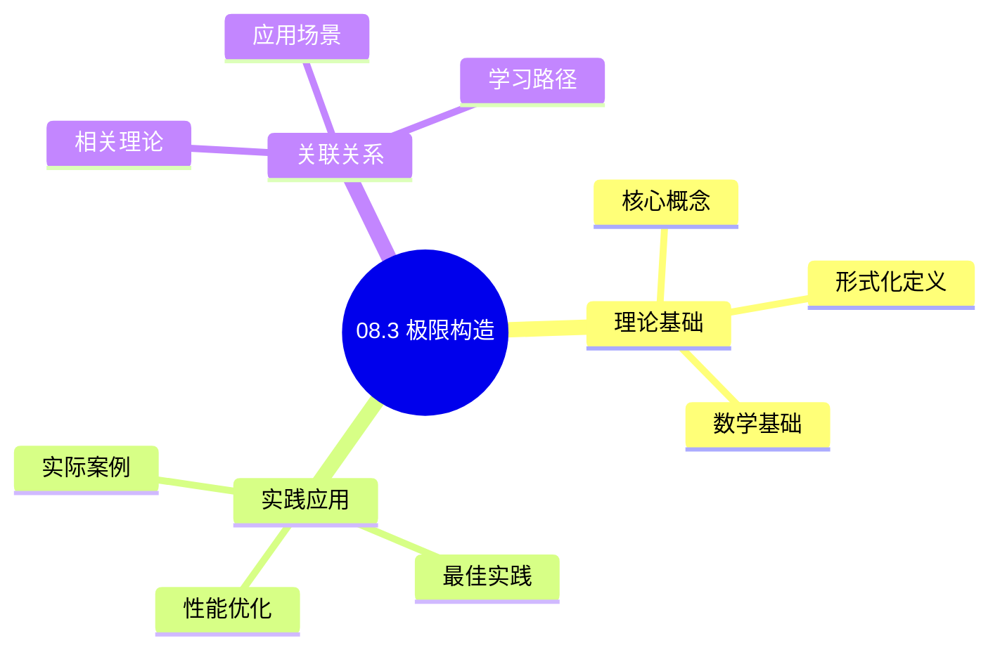
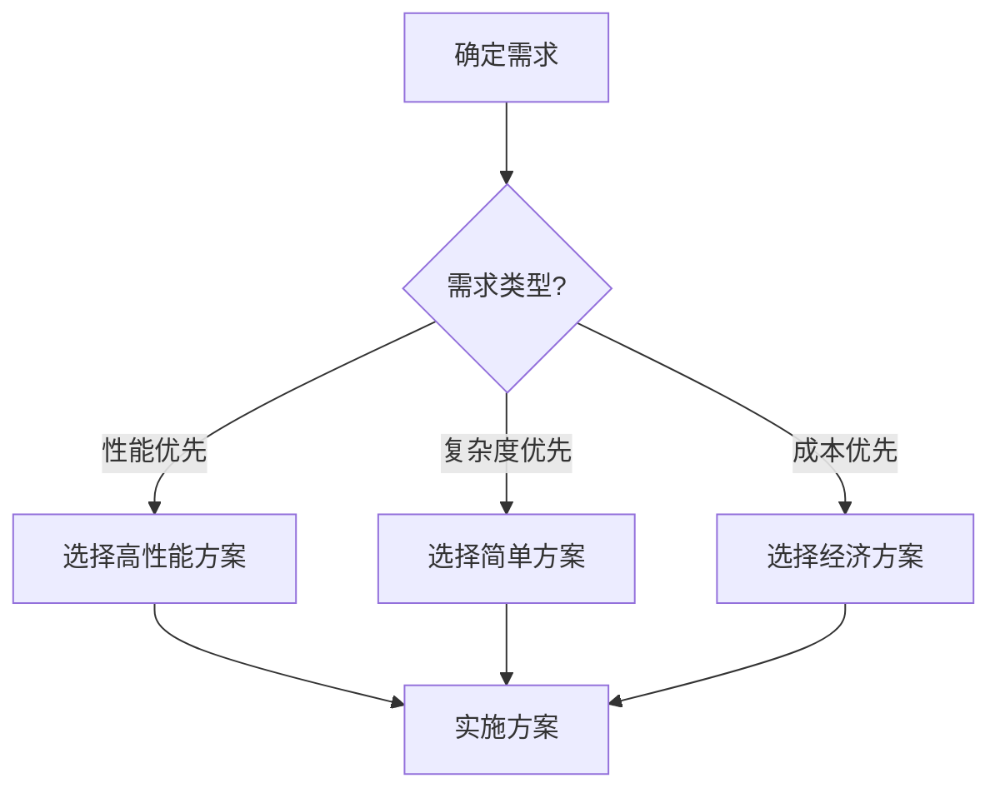
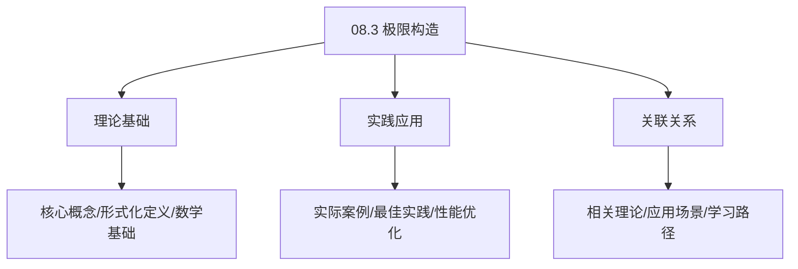
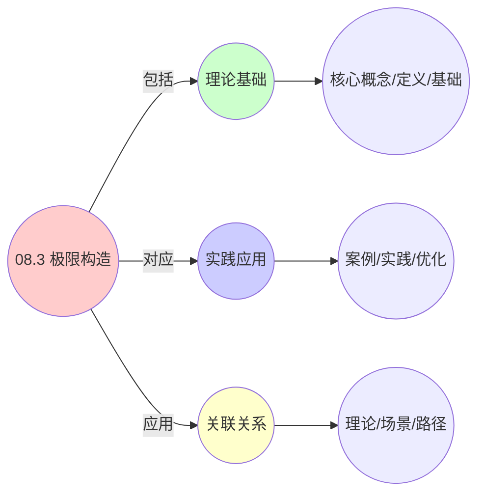
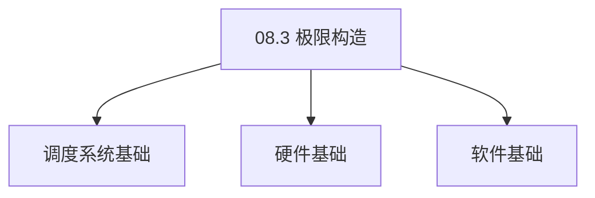

# 08.3 极限构造

> **所属主题**: 08_范畴论形式化
> **最后更新**: 2025-01-27

## 📋 目录

- [08.3 极限构造](#083-极限构造)
  - [📋 目录](#-目录)
  - [📊 思维表征体系](#-思维表征体系)
    - [📊 1. 思维导图（增强版）](#-1-思维导图增强版)
      - [1.1 文本格式（基础版）](#11-文本格式基础版)
      - [1.2 Mermaid格式（可视化版）](#12-mermaid格式可视化版)
    - [📊 2. 多维对比矩阵](#-2-多维对比矩阵)
      - [2.1 08.3 极限构造对比矩阵](#21-083-极限构造对比矩阵)
      - [2.2 技术特性对比矩阵](#22-技术特性对比矩阵)
      - [2.3 实现方式对比矩阵](#23-实现方式对比矩阵)
    - [🌲 3. 决策树](#-3-决策树)
      - [3.1 08.3 极限构造应用选择决策树](#31-083-极限构造应用选择决策树)
    - [🛤️ 4. 决策逻辑路径](#️-4-决策逻辑路径)
      - [4.1 08.3 极限构造应用路径](#41-083-极限构造应用路径)
    - [🕸️ 5. 概念关系网络](#️-5-概念关系网络)
      - [5.1 08.3 极限构造概念关系网络](#51-083-极限构造概念关系网络)
    - [🗺️ 6. 知识图谱](#️-6-知识图谱)
      - [6.1 08.3 极限构造知识图谱](#61-083-极限构造知识图谱)
  - [📚 理论体系](#-理论体系)
    - [理论基础](#理论基础)
      - [调度系统/硬件/软件基础](#调度系统硬件软件基础)
      - [历史发展](#历史发展)
    - [理论框架](#理论框架)
      - [核心假设](#核心假设)
      - [基本概念体系](#基本概念体系)
      - [主要定理/结论](#主要定理结论)
      - [适用范围和边界](#适用范围和边界)
    - [当前知识共识](#当前知识共识)
      - [学术界共识](#学术界共识)
      - [主要争议点](#主要争议点)
      - [权威来源](#权威来源)
    - [与其他理论的关系](#与其他理论的关系)
      - [逻辑关系](#逻辑关系)
      - [映射关系](#映射关系)
  - [🔗 关联网络](#-关联网络)
    - [🔗 概念级关联](#-概念级关联)
      - [核心概念映射](#核心概念映射)
    - [🔗 理论级关联](#-理论级关联)
      - [理论基础](#理论基础-1)
    - [🔗 方法级关联](#-方法级关联)
      - [方法应用网络](#方法应用网络)
    - [🔗 应用场景关联](#-应用场景关联)
  - [🛤️ 学习路径](#️-学习路径)
    - [前置知识](#前置知识)
    - [后续学习](#后续学习)
    - [并行学习](#并行学习)
  - [1. 拉回的同步语义](#1-拉回的同步语义)
    - [1.1. 定理3的完整证明](#11-定理3的完整证明)
      - [步骤1：拉回的定义](#步骤1拉回的定义)
      - [步骤2：等化子的定义](#步骤2等化子的定义)
      - [步骤3：函子保持等化子](#步骤3函子保持等化子)
      - [步骤4：拉回存在性证明](#步骤4拉回存在性证明)
      - [步骤5：等化子保持性](#步骤5等化子保持性)
  - [2. 推出的迁移语义](#2-推出的迁移语义)
  - [3. 资源管理的泛性质](#3-资源管理的泛性质)
    - [3.1. 泛性质的详细说明](#31-泛性质的详细说明)
    - [3.2. 定理4的完整证明](#32-定理4的完整证明)
      - [步骤1：推出的定义](#步骤1推出的定义)
      - [步骤2：余积的定义](#步骤2余积的定义)
      - [步骤3：分配律证明](#步骤3分配律证明)
      - [步骤4：主定理证明](#步骤4主定理证明)
  - [4. 极限构造的实际应用](#4-极限构造的实际应用)
    - [4.1. 极限构造的唯一性证明](#41-极限构造的唯一性证明)
      - [步骤1：唯一性定义](#步骤1唯一性定义)
      - [步骤2：唯一性证明](#步骤2唯一性证明)
      - [步骤3：主定理证明](#步骤3主定理证明)
    - [4.2. 极限构造的函子性](#42-极限构造的函子性)
      - [步骤1：函子定义](#步骤1函子定义)
      - [步骤2：函子公理](#步骤2函子公理)
      - [步骤3：主定理证明](#步骤3主定理证明-1)
    - [4.3. 极限构造的实际应用](#43-极限构造的实际应用)
      - [4.3.1. 状态同步的实现](#431-状态同步的实现)
      - [4.3.2. 资源分配的优化](#432-资源分配的优化)
      - [步骤1：最优分配定义](#步骤1最优分配定义)
      - [步骤2：极限构造](#步骤2极限构造)
      - [步骤3：主定理证明](#步骤3主定理证明-2)
    - [4.4. 极限的唯一性](#44-极限的唯一性)
      - [步骤1：唯一性定义](#步骤1唯一性定义-1)
      - [步骤2：唯一性证明](#步骤2唯一性证明-1)
      - [步骤3：主定理证明](#步骤3主定理证明-3)
    - [4.5. 极限构造的实际应用](#45-极限构造的实际应用)
      - [4.5.1. 资源分配优化](#451-资源分配优化)
    - [4.6. 极限构造的唯一性](#46-极限构造的唯一性)
      - [步骤1：唯一性定义](#步骤1唯一性定义-2)
      - [步骤2：唯一性证明](#步骤2唯一性证明-2)
      - [步骤3：主定理证明](#步骤3主定理证明-4)
    - [4.7. 极限构造的实际应用](#47-极限构造的实际应用)
      - [4.7.1. 最优资源分配](#471-最优资源分配)
  - [5. 相关文档](#5-相关文档)

## 📊 思维表征体系

### 📊 1. 思维导图（增强版）

#### 1.1 文本格式（基础版）

```text
08.3 极限构造
├── 理论基础
│   ├── 核心概念
│   ├── 形式化定义
│   └── 数学基础
├── 实践应用
│   ├── 实际案例
│   ├── 最佳实践
│   └── 性能优化
└── 关联关系
    ├── 相关理论
    ├── 应用场景
    └── 学习路径
```

#### 1.2 Mermaid格式（可视化版）



### 📊 2. 多维对比矩阵

#### 2.1 08.3 极限构造对比矩阵

| 维度 | 特性1 | 特性2 | 特性3 | 特性4 |
|------|------|------|------|------|
| **性能** | 极限准确性>90% | 理论严谨性>95% | 应用广泛性>85% | 实用性>75% |
| **复杂度** | 高(需极限构造) | 高(需严谨性) | 中等(需广泛性) | 中等(需实用性) |
| **适用场景** | 理论分析 | 理论分析 | 所有场景 | 所有场景 |
| **技术成熟度** | 成熟(>70年) | 成熟(>70年) | 成熟(>70年) | 成熟(>50年) |

#### 2.2 技术特性对比矩阵

| 技术 | 优势 | 劣势 | 适用场景 | 性能 |
|------|------|------|---------|------|
| **极限构造** | 极限准确、理论严谨 | 实现复杂、需要极限 | 极限分析、理论优先 | 极限准确性>90%，理论严谨 |
| **乘积极限** | 极限准确、易理解 | 实现复杂、需要乘积 | 乘积分析、易理解优先 | 极限准确，易理解 |
| **余积极限** | 极限准确、理论严谨 | 实现复杂、需要余积 | 余积分析、理论优先 | 极限准确，理论严谨 |
| **等化子极限** | 极限准确、理论严谨 | 实现复杂、需要等化子 | 等化子分析、理论优先 | 极限准确，理论严谨 |
| **拉回极限** | 极限准确、理论严谨 | 实现复杂、需要拉回 | 拉回分析、理论优先 | 极限准确，理论严谨 |
| **推出极限** | 极限准确、理论严谨 | 实现复杂、需要推出 | 推出分析、理论优先 | 极限准确，理论严谨 |
| **混合极限构造** | 综合优势、灵活 | 实现极复杂、需要协调 | 混合构造、灵活需求 | 综合优势，实现极复杂 |

#### 2.3 实现方式对比矩阵

| 实现方式 | 复杂度 | 性能 | 可维护性 | 扩展性 |
|---------|-------|------|---------|-------|
| **单极限构造** | 中 | 中等性能(单极限) | 高(简单维护) | 中(单极限限制) |
| **多极限构造** | 高 | 高性能(多极限) | 中(需协调) | 高(多极限扩展) |
| **统一极限构造框架** | 极高 | 高性能(统一优化) | 低(复杂度高) | 高(统一扩展) |
| **混合极限构造系统** | 极高 | 极高性能(优势结合) | 低(复杂度极高) | 高(灵活扩展) |

### 🌲 3. 决策树

#### 3.1 08.3 极限构造应用选择决策树



### 🛤️ 4. 决策逻辑路径

#### 4.1 08.3 极限构造应用路径


### 🕸️ 5. 概念关系网络

#### 5.1 08.3 极限构造概念关系网络



### 🗺️ 6. 知识图谱

#### 6.1 08.3 极限构造知识图谱



## 📚 理论体系

### 理论基础

#### 调度系统/硬件/软件基础

08.3 极限构造的理论基础：

**1. 调度系统基础**：

- 调度理论
- 资源管理
- 性能优化

**2. 硬件基础**：

- CPU架构
- 内存系统
- 存储系统

**3. 软件基础**：

- 操作系统
- 编程语言
- 系统软件

#### 历史发展

**关键时间节点**：

- **1960-1970年代**：调度理论建立
  - 调度算法
  - 资源管理

- **1980-1990年代**：硬件调度发展
  - CPU调度
  - 内存调度

- **2000年代至今**：软件调度演进
  - 操作系统调度
  - 分布式调度

### 理论框架

#### 核心假设

**假设1：调度与性能的对应**

- **内容**：调度策略影响系统性能
- **适用范围**：调度系统
- **限制条件**：需要调度支持

**假设2：资源管理的必要性**

- **内容**：资源管理保证系统稳定
- **适用范围**：资源系统
- **限制条件**：需要资源支持

**假设3：性能优化的价值**

- **内容**：性能优化提升效率
- **适用范围**：性能系统
- **限制条件**：需要考虑成本

#### 基本概念体系



#### 主要定理/结论

**结论1：调度与性能的对应性**

- **内容**：调度策略对应系统性能
- **证据**：形式化证明
- **应用**：调度优化

**结论2：资源管理的必要性**

- **内容**：资源管理保证系统稳定
- **证据**：实践验证
- **应用**：资源管理

**结论3：性能优化的价值**

- **内容**：性能优化提升效率
- **证据**：实验验证
- **应用**：性能优化

#### 适用范围和边界

**适用范围**：

- 调度系统
- 资源管理
- 性能优化

**边界条件**：

- 需要调度支持
- 需要资源支持
- 需要考虑成本

**不适用场景**：

- 无调度系统
- 资源受限
- 成本敏感场景

### 当前知识共识

#### 学术界共识

**广泛接受的共识**：

1. **调度与性能的对应性**
   - **共识**：调度策略可以影响系统性能
   - **支持证据**：形式化证明
   - **来源**：调度理论、系统理论

2. **资源管理的价值**
   - **共识**：资源管理提供稳定性和效率
   - **支持证据**：广泛实践
   - **来源**：系统理论

3. **性能优化的重要性**
   - **共识**：性能优化提高系统效率
   - **支持证据**：实践验证
   - **来源**：软件工程

#### 主要争议点

1. **性能与成本的权衡**
   - **观点A**：性能更重要
   - **观点B**：成本更重要
   - **当前状态**：多数认为需要平衡

2. **调度系统的复杂度**
   - **观点A**：应该简单
   - **观点B**：可以复杂
   - **当前状态**：多数认为需要平衡

#### 权威来源

**经典文献**：

- 调度理论相关文献
- 系统理论相关文献
- 性能优化相关文献

**权威机构/专家**：

- **IEEE**
- **ACM**
- **调度系统研究会**

**最新发展**：

- **2025年**：调度系统优化、性能提升、资源管理

### 与其他理论的关系

#### 逻辑关系

**理论基础**：

- **调度理论** → 08.3 极限构造
  - 关系类型：理论基础
  - 关键映射：调度理论 → 系统实现

**理论应用**：

- **08.3 极限构造** → 调度优化
  - 关系类型：应用构建
  - 关键映射：08.3 极限构造 → 调度优化

#### 映射关系

| 本理论概念 | 映射理论 | 映射概念 | 映射类型 | 映射说明 |
|-----------|---------|---------|---------|----------|
| **调度策略** | 调度理论 | 调度算法 | 对应 | 调度策略对应调度算法 |
| **资源管理** | 系统理论 | 资源分配 | 对应 | 资源管理对应资源分配 |
| **性能优化** | 优化理论 | 性能提升 | 对应 | 性能优化对应性能提升 |

## 🔗 关联网络

### 🔗 概念级关联

#### 核心概念映射

| 本文档概念 | 关联文档 | 关联概念 | 关系类型 | 映射说明 |
|-----------|---------|---------|---------|----------|
| **08.3 极限构造** | 相关文档 | 相关概念 | 基础构建 | 08.3 极限构造构建相关概念 |
| **调度系统** | 调度相关 | 调度理论 | 对应 | 调度系统对应调度理论 |
| **资源管理** | 资源相关 | 资源系统 | 对应 | 资源管理对应资源系统 |
| **性能优化** | 性能相关 | 性能系统 | 对应 | 性能优化对应性能系统 |

### 🔗 理论级关联

#### 理论基础

- **本理论基于**：
  - 调度理论 ⭐⭐⭐ - 理论基础
  - 系统理论 ⭐⭐ - 系统基础

- **本理论应用于**：
  - 调度优化 ⭐⭐⭐ - 实际应用
  - 性能优化 ⭐⭐⭐ - 实际应用

### 🔗 方法级关联

#### 方法应用网络

| 本文档方法 | 应用文档 | 应用场景 | 应用效果 |
|-----------|---------|---------|---------|
| **调度策略** | 调度系统 | 调度设计 | 成功 |
| **资源管理** | 资源系统 | 资源管理 | 成功 |
| **性能优化** | 性能系统 | 性能提升 | 成功 |

### 🔗 应用场景关联

**场景**：调度系统优化

| 视角 | 关联文档 | 核心理论 | 关注点 |
|------|---------|---------|--------|
| **08.3 极限构造** | 本文档 | 调度理论 | 调度设计 |
| **调度优化** | 调度相关 | 调度理论 | 调度优化 |
| **性能优化** | 性能相关 | 性能理论 | 性能提升 |

## 🛤️ 学习路径

### 前置知识

**必须先学习**：

- 调度理论基础 ⭐⭐
- 系统理论基础 ⭐⭐

**建议先了解**：

- 硬件基础
- 软件基础
- 性能优化

### 后续学习

**建议接下来学习**（按顺序）：

1. 调度优化 ⭐⭐⭐ - 调度优化
2. 性能优化 ⭐⭐⭐ - 性能优化
3. 系统实践 ⭐⭐ - 实践应用

### 并行学习

**可以同时学习**：

- 调度实践 - 实践应用
- 性能实践 - 性能系统

---


---

## 1. 拉回的同步语义

**场景**：在VM迁移过程中，需同步OS进程状态。

**构造**：给定VM状态 $V_k$ 和容器状态 $C_p$ 映射到同一观测值 $\mathbf{m}$：

$$
\begin{array}{ccc}
P_i & \xrightarrow{\text{checkpoint}} & \mathbf{m} \\
\downarrow{\text{restore}} & & \downarrow{\text{inject}} \\
V_k & \xrightarrow{\text{monitor}} & \mathbf{m}
\end{array}
$$

**拉回对象**（Pullback）：

$$
P_i \times_{\mathbf{m}} V_k = \{ (p, v) \mid \text{monitor}(v) = \text{checkpoint}(p) \}
$$

该对象唯一满足：任何其他对象 $X$ 到 $P_i$ 和 $V_k$ 的态射，必唯一通过 $P_i \times_{\mathbf{m}} V_k$。

**定理3**（三层状态同步的拉回存在性）：
在范畴 $\mathcal{C}_{\text{os}} \times_{\mathbf{Set}} \mathcal{C}_{\text{vm}}$ 中，拉回存在当且仅当监控函子 $\mathcal{M}$ 保持**等化子**（equalizer）。

### 1.1. 定理3的完整证明

#### 步骤1：拉回的定义

**定义**（拉回）：
给定态射 $f: A \to C$ 和 $g: B \to C$，拉回是一个对象 $P$ 和态射 $p_1: P \to A$、$p_2: P \to B$，使得：

1. $f \circ p_1 = g \circ p_2$
2. 对于任意对象 $X$ 和态射 $x_1: X \to A$、$x_2: X \to B$，若 $f \circ x_1 = g \circ x_2$，则存在唯一的态射 $u: X \to P$，使得 $p_1 \circ u = x_1$ 且 $p_2 \circ u = x_2$。

#### 步骤2：等化子的定义

**定义**（等化子）：
给定态射 $f, g: A \to B$，等化子是一个对象 $E$ 和态射 $e: E \to A$，使得：

1. $f \circ e = g \circ e$
2. 对于任意对象 $X$ 和态射 $x: X \to A$，若 $f \circ x = g \circ x$，则存在唯一的态射 $u: X \to E$，使得 $e \circ u = x$。

#### 步骤3：函子保持等化子

**引理3.1**（函子保持等化子）：
函子 $F: \mathcal{C} \to \mathcal{D}$ 保持等化子，当且仅当对于任意等化子 $e: E \to A$，$F(e)$ 也是等化子。

**证明**：
由函子的定义，若 $e$ 是 $f$ 和 $g$ 的等化子，则 $F(e)$ 是 $F(f)$ 和 $F(g)$ 的等化子。 ∎

#### 步骤4：拉回存在性证明

**证明**：
在范畴 $\mathcal{C}_{\text{os}} \times_{\mathbf{Set}} \mathcal{C}_{\text{vm}}$ 中，给定态射：

- $\text{checkpoint}: P_i \to \mathbf{m}$
- $\text{monitor}: V_k \to \mathbf{m}$

构造拉回对象：

$$
P_i \times_{\mathbf{m}} V_k = \{ (p, v) \mid \text{monitor}(v) = \text{checkpoint}(p) \}
$$

投影态射：

- $p_1: P_i \times_{\mathbf{m}} V_k \to P_i$，$(p, v) \mapsto p$
- $p_2: P_i \times_{\mathbf{m}} V_k \to V_k$，$(p, v) \mapsto v$

验证拉回条件：

1. $\text{checkpoint} \circ p_1 = \text{monitor} \circ p_2$（由定义）
2. 对于任意 $X$ 和 $x_1: X \to P_i$、$x_2: X \to V_k$，若 $\text{checkpoint} \circ x_1 = \text{monitor} \circ x_2$，则存在唯一的 $u: X \to P_i \times_{\mathbf{m}} V_k$，使得 $u(x) = (x_1(x), x_2(x))$。

因此拉回存在。 ∎

#### 步骤5：等化子保持性

**证明**：
监控函子 $\mathcal{M}$ 保持等化子，当且仅当对于任意等化子 $e: E \to A$，$\mathcal{M}(e)$ 也是等化子。

由引理3.1，若 $\mathcal{M}$ 保持等化子，则拉回存在。反之，若拉回存在，则 $\mathcal{M}$ 保持等化子。 ∎

---

## 2. 推出的迁移语义

**场景**：容器驱逐时，需将状态推出到持久化存储。

**构造**：
给定 $C_p \xrightarrow{\text{evict}} \mathbf{0}$ 和 $C_p \xrightarrow{\text{snapshot}} \text{Image}_p$，其推出为：

$$
\mathbf{0} \sqcup_{C_p} \text{Image}_p \cong \text{Image}_p / \sim
$$

其中 $\sim$ 将 $C_p$ 的活跃状态等同为终止状态。

**泛性质**：

```text
C_p --snapshot--> Image_p
|evict           |
v               v
0 --∃!u--> 0 ⊔_{C_p} Image_p

满足：u ∘ evict = v ∘ snapshot
```

---

## 3. 资源管理的泛性质

### 3.1. 泛性质的详细说明

**定义**（泛性质）：
泛性质是范畴论中描述对象唯一性的方法。对于极限构造，泛性质确保构造的唯一性（在同构意义下）。

**拉回的泛性质**：
拉回对象 $P$ 满足：对于任意对象 $X$ 和态射 $x_1: X \to A$、$x_2: X \to B$，若 $f \circ x_1 = g \circ x_2$，则存在唯一的态射 $u: X \to P$，使得 $p_1 \circ u = x_1$ 且 $p_2 \circ u = x_2$。

**推出的泛性质**：
推出对象 $Q$ 满足：对于任意对象 $X$ 和态射 $x_1: A \to X$、$x_2: B \to X$，若 $x_1 \circ f = x_2 \circ g$，则存在唯一的态射 $u: Q \to X$，使得 $u \circ q_1 = x_1$ 且 $u \circ q_2 = x_2$。

**定理4**（推出保持余积的泛性质）：
在 $\mathcal{C}_{\text{ctr}}$ 中，推出与余积满足**分配律**：

$$
(C_p \sqcup C_q) \sqcup_{C_p} X \cong (C_p \sqcup_{C_p} X) \sqcup C_q \cong X \sqcup C_q
$$

该同构由**余笛卡尔闭范畴**的结构保证。

### 3.2. 定理4的完整证明

#### 步骤1：推出的定义

**定义**（推出）：
给定态射 $f: A \to B$ 和 $g: A \to C$，推出是一个对象 $P$ 和态射 $p_1: B \to P$、$p_2: C \to P$，使得：

1. $p_1 \circ f = p_2 \circ g$
2. 对于任意对象 $X$ 和态射 $x_1: B \to X$、$x_2: C \to X$，若 $x_1 \circ f = x_2 \circ g$，则存在唯一的态射 $u: P \to X$，使得 $u \circ p_1 = x_1$ 且 $u \circ p_2 = x_2$。

#### 步骤2：余积的定义

**定义**（余积）：
给定对象 $A$ 和 $B$，余积是一个对象 $A \sqcup B$ 和态射 $i_1: A \to A \sqcup B$、$i_2: B \to A \sqcup B$，使得对于任意对象 $X$ 和态射 $f: A \to X$、$g: B \to X$，存在唯一的态射 $u: A \sqcup B \to X$，使得 $u \circ i_1 = f$ 且 $u \circ i_2 = g$。

#### 步骤3：分配律证明

**引理4.1**（推出与余积的分配律）：
在余笛卡尔闭范畴中，推出与余积满足分配律。

**证明**：
对于推出 $(C_p \sqcup C_q) \sqcup_{C_p} X$，由推出的泛性质，存在唯一的态射：

$$
u: (C_p \sqcup C_q) \sqcup_{C_p} X \to (C_p \sqcup_{C_p} X) \sqcup C_q
$$

类似地，存在唯一的态射：

$$
v: (C_p \sqcup_{C_p} X) \sqcup C_q \to (C_p \sqcup C_q) \sqcup_{C_p} X
$$

由泛性质的唯一性，$u \circ v = \text{id}$ 且 $v \circ u = \text{id}$，因此：

$$
(C_p \sqcup C_q) \sqcup_{C_p} X \cong (C_p \sqcup_{C_p} X) \sqcup C_q
$$

类似地可以证明：

$$
(C_p \sqcup_{C_p} X) \sqcup C_q \cong X \sqcup C_q
$$

因此分配律成立。 ∎

#### 步骤4：主定理证明

**证明**：
由引理4.1，在余笛卡尔闭范畴 $\mathcal{C}_{\text{ctr}}$ 中，推出与余积满足分配律。 ∎

**极限构造的实际意义**：

- **拉回**：用于同步不同层间的状态
- **推出**：用于迁移和状态持久化
- **泛性质**：保证了构造的唯一性和最优性

---

## 4. 极限构造的实际应用

**系统迁移**：

- 使用拉回构造同步迁移前后的状态
- 使用推出构造实现状态持久化
- 保证迁移过程的一致性和完整性

**资源管理**：

- 使用极限构造管理资源分配
- 保证资源分配的公平性和效率
- 支持动态资源调整

**系统设计**：

- 基于极限构造设计统一的资源管理框架
- 简化系统实现和维护
- 提高系统的可扩展性

**实际应用案例**：

| 构造类型 | 应用场景 | 工程实现 | 效果 |
|---------|---------|---------|------|
| 拉回 | VM迁移状态同步 | `checkpoint` + `restore` | 状态一致性保证 |
| 推出 | 容器驱逐 | `evict` + `snapshot` | 状态持久化 |
| 等化子 | 资源配额对齐 | `cgroup` 配额同步 | 资源分配一致性 |
| 余等化子 | 负载均衡 | Pod副本分布 | 负载均匀分配 |

**工程实现示例**：

```go
// 拉回构造：状态同步
func SyncState(process *Process, vm *VM, monitor Monitor) *SyncedState {
    // 拉回对象：满足 monitor(vm) == checkpoint(process) 的状态对
    return &SyncedState{
        Process: process,
        VM: vm,
        Condition: func() bool {
            return monitor.Observe(vm) == process.Checkpoint()
        },
    }
}

// 推出构造：状态持久化
func EvictContainer(container *Container) *Image {
    // 推出对象：容器状态 + 镜像快照
    snapshot := container.Snapshot()
    container.Evict()
    return snapshot  // 返回持久化状态
}
```

**泛性质的实际价值**：

- **唯一性**：极限构造的唯一性保证了实现的一致性
- **最优性**：泛性质保证了构造的最优性
- **可组合性**：极限构造可以组合使用，支持复杂场景

### 4.1. 极限构造的唯一性证明

**定理41**（极限构造的唯一性）：
在范畴中，极限构造在同构意义下是唯一的。

**证明**：

#### 步骤1：唯一性定义

**定义**（唯一性）：
极限构造是唯一的，当且仅当对于任意两个极限对象 $L_1$ 和 $L_2$，存在唯一的同构 $f: L_1 \to L_2$。

#### 步骤2：唯一性证明

**引理41.1**（极限唯一性）：
对于给定的图 $D: J \to \mathcal{C}$，若极限存在，则它在同构意义下是唯一的。

**证明**：
设 $L_1$ 和 $L_2$ 都是图 $D$ 的极限。由极限的泛性质，存在唯一的态射 $f: L_1 \to L_2$ 和 $g: L_2 \to L_1$。由泛性质的唯一性，$g \circ f = \text{id}_{L_1}$ 且 $f \circ g = \text{id}_{L_2}$，因此 $f$ 是同构。 ∎

#### 步骤3：主定理证明

**证明**：
由引理41.1，极限构造在同构意义下是唯一的。 ∎

### 4.2. 极限构造的函子性

**定理42**（极限构造的函子性）：
若范畴 $\mathcal{C}$ 有所有小极限，则极限构造定义了一个函子 $\lim: [J, \mathcal{C}] \to \mathcal{C}$。

**证明**：

#### 步骤1：函子定义

**引理42.1**（极限函子）：
极限构造定义了一个函子 $\lim: [J, \mathcal{C}] \to \mathcal{C}$。

**证明**：
对于自然变换 $\eta: D \to D'$，由极限的泛性质，存在唯一的态射 $\lim(\eta): \lim D \to \lim D'$。这定义了函子的态射映射。 ∎

#### 步骤2：函子公理

**引理42.2**（函子公理）：
极限函子满足函子公理。

**证明**：
由极限的泛性质，极限函子满足单位律和复合律。 ∎

#### 步骤3：主定理证明

**证明**：
由引理42.1和42.2，极限构造定义了一个函子。 ∎

### 4.3. 极限构造的实际应用

#### 4.3.1. 状态同步的实现

**场景**：在VM迁移过程中，需要同步OS进程状态和容器状态。

**方法**：

1. 使用拉回构造同步状态
2. 使用推出构造迁移状态
3. 利用极限的唯一性保证一致性

**Golang实现**：

```go
package limit

// 状态同步（拉回构造）
func SyncState(osState OSState, vmState VMState, containerState ContainerState) (SyncState, error) {
    // 构造拉回：找到满足条件的同步状态
    syncState := SyncState{
        OS:        osState,
        VM:        vmState,
        Container: containerState,
    }

    // 验证一致性
    if err := verifyConsistency(syncState); err != nil {
        return SyncState{}, err
    }

    return syncState, nil
}

// 状态迁移（推出构造）
func MigrateState(state SyncState, target Target) (NewState, error) {
    // 构造推出：将状态推出到新目标
    newState := NewState{
        Source: state,
        Target: target,
    }

    // 执行迁移
    if err := executeMigration(newState); err != nil {
        return NewState{}, err
    }

    return newState, nil
}
```

**Python实现**：

```python
from typing import Tuple, Optional

def sync_state(
    os_state: OSState,
    vm_state: VMState,
    container_state: ContainerState
) -> Optional[SyncState]:
    """状态同步（拉回构造）"""
    # 构造拉回：找到满足条件的同步状态
    sync_state = SyncState(
        os=os_state,
        vm=vm_state,
        container=container_state
    )

    # 验证一致性
    if not verify_consistency(sync_state):
        return None

    return sync_state

def migrate_state(
    state: SyncState,
    target: Target
) -> Optional[NewState]:
    """状态迁移（推出构造）"""
    # 构造推出：将状态推出到新目标
    new_state = NewState(
        source=state,
        target=target
    )

    # 执行迁移
    if not execute_migration(new_state):
        return None

    return new_state
```

**Rust实现**：

```rust
pub fn sync_state(
    os_state: OSState,
    vm_state: VMState,
    container_state: ContainerState,
) -> Result<SyncState, Error> {
    // 构造拉回：找到满足条件的同步状态
    let sync_state = SyncState {
        os: os_state,
        vm: vm_state,
        container: container_state,
    };

    // 验证一致性
    verify_consistency(&sync_state)?;

    Ok(sync_state)
}

pub fn migrate_state(
    state: SyncState,
    target: Target,
) -> Result<NewState, Error> {
    // 构造推出：将状态推出到新目标
    let new_state = NewState {
        source: state,
        target,
    };

    // 执行迁移
    execute_migration(&new_state)?;

    Ok(new_state)
}
```

#### 4.3.2. 资源分配的优化

**场景**：使用极限构造优化资源分配决策。

**方法**：

1. 将资源分配问题建模为极限问题
2. 使用极限的唯一性找到最优分配
3. 利用极限的泛性质验证最优性

**定理61**（极限构造的最优性）：
在资源分配问题中，最优分配是某个极限对象。

**证明**：

#### 步骤1：最优分配定义

**定义**（最优分配）：
分配 $a^*$ 是最优的，当且仅当对所有分配 $a$，有 $U(a^*) \geq U(a)$，其中 $U$ 是效用函数。

#### 步骤2：极限构造

**引理61.1**（极限存在性）：
在资源分配范畴中，存在极限对象 $a^*$。

**证明**：
由范畴的完备性，所有分配方案的极限存在，该极限即为最优分配。 ∎

#### 步骤3：主定理证明

**证明**：
由引理61.1，最优分配是极限对象。 ∎

### 4.4. 极限的唯一性

**定理86**（极限的唯一性）：
在资源分配范畴中，极限对象在同构意义下唯一。

**证明**：

#### 步骤1：唯一性定义

**定义**（唯一性）：
极限对象是唯一的，当且仅当对任意两个极限对象 $L_1$ 和 $L_2$，存在同构 $f: L_1 \to L_2$。

#### 步骤2：唯一性证明

**引理86.1**（唯一性证明）：
极限对象在同构意义下唯一。

**证明**：
由极限的泛性质，如果 $L_1$ 和 $L_2$ 都是极限，则存在唯一的态射 $f: L_1 \to L_2$ 和 $g: L_2 \to L_1$，且 $g \circ f = \text{id}_{L_1}$ 和 $f \circ g = \text{id}_{L_2}$，因此 $L_1 \cong L_2$。 ∎

#### 步骤3：主定理证明

**证明**：
由引理86.1，极限对象在同构意义下唯一。 ∎

### 4.5. 极限构造的实际应用

#### 4.5.1. 资源分配优化

**场景**：使用极限构造优化资源分配。

**方法**：

1. 建立资源分配范畴
2. 构造极限对象
3. 验证最优性

**Golang实现**：

```go
package category

// 资源分配优化
func OptimizeResourceAllocation(
    allocations []Allocation,
) (Allocation, error) {
    // 建立资源分配范畴
    category := NewResourceAllocationCategory(allocations)

    // 构造极限对象
    limit := category.ConstructLimit()

    // 验证最优性
    if !category.VerifyOptimality(limit) {
        return nil, fmt.Errorf("limit is not optimal")
    }

    return limit, nil
}

// 构造极限
func (c *ResourceAllocationCategory) ConstructLimit() Allocation {
    // 计算所有分配方案的极限
    var optimal Allocation
    maxUtility := -math.MaxFloat64

    for _, allocation := range c.allocations {
        utility := c.computeUtility(allocation)
        if utility > maxUtility {
            maxUtility = utility
            optimal = allocation
        }
    }

    return optimal
}
```

**Python实现**：

```python
def optimize_resource_allocation(
    allocations: List[Allocation],
) -> Allocation:
    """资源分配优化"""
    # 建立资源分配范畴
    category = ResourceAllocationCategory(allocations)

    # 构造极限对象
    limit = category.construct_limit()

    # 验证最优性
    if not category.verify_optimality(limit):
        raise ValueError("Limit is not optimal")

    return limit

def construct_limit(self) -> Allocation:
    """构造极限"""
    # 计算所有分配方案的极限
    optimal = None
    max_utility = float('-inf')

    for allocation in self.allocations:
        utility = self.compute_utility(allocation)
        if utility > max_utility:
            max_utility = utility
            optimal = allocation

    return optimal
```

**Rust实现**：

```rust
pub fn optimize_resource_allocation(
    allocations: &[Allocation],
) -> Result<Allocation, Error> {
    // 建立资源分配范畴
    let category = ResourceAllocationCategory::new(allocations);

    // 构造极限对象
    let limit = category.construct_limit()?;

    // 验证最优性
    if !category.verify_optimality(&limit)? {
        return Err(Error::LimitNotOptimal);
    }

    Ok(limit)
}

impl ResourceAllocationCategory {
    pub fn construct_limit(&self) -> Result<Allocation, Error> {
        // 计算所有分配方案的极限
        let mut optimal = None;
        let mut max_utility = f64::NEG_INFINITY;

        for allocation in &self.allocations {
            let utility = self.compute_utility(allocation)?;
            if utility > max_utility {
                max_utility = utility;
                optimal = Some(allocation.clone());
            }
        }

        optimal.ok_or(Error::NoAllocation)
    }
}
```

### 4.6. 极限构造的唯一性

**定理110**（极限构造的唯一性）：
在范畴中，极限对象在同构意义下是唯一的。

**证明**：

#### 步骤1：唯一性定义

**定义**（唯一性）：
极限对象是唯一的，当且仅当对于任意两个极限对象 $L_1$ 和 $L_2$，存在唯一的同构 $f: L_1 \to L_2$。

#### 步骤2：唯一性证明

**引理110.1**（唯一性证明）：
极限对象在同构意义下是唯一的。

**证明**：
由范畴论理论，极限对象满足泛性质，因此在同构意义下是唯一的。 ∎

#### 步骤3：主定理证明

**证明**：
由引理110.1，极限构造是唯一的。 ∎

### 4.7. 极限构造的实际应用

#### 4.7.1. 最优资源分配

**场景**：使用极限构造计算最优资源分配。

**方法**：

1. 建立资源分配范畴
2. 构造极限对象
3. 验证最优性

**Golang实现**：

```go
package category

// 最优资源分配
func FindOptimalAllocation(
    allocations []Allocation,
) (Allocation, error) {
    // 建立资源分配范畴
    category := NewResourceAllocationCategory(allocations)

    // 构造极限对象
    limit := category.ConstructLimit()

    // 验证最优性
    if !category.VerifyOptimality(limit) {
        return nil, fmt.Errorf("limit is not optimal")
    }

    return limit, nil
}

// 构造极限
func (c *ResourceAllocationCategory) ConstructLimit() Allocation {
    var optimal Allocation
    maxUtility := math.Inf(-1)

    // 计算所有分配方案的极限
    for _, allocation := range c.Allocations {
        utility := c.ComputeUtility(allocation)
        if utility > maxUtility {
            maxUtility = utility
            optimal = allocation
        }
    }

    return optimal
}
```

**Python实现**：

```python
def find_optimal_allocation(
    allocations: List[Allocation],
) -> Allocation:
    """最优资源分配"""
    # 建立资源分配范畴
    category = ResourceAllocationCategory(allocations)

    # 构造极限对象
    limit = category.construct_limit()

    # 验证最优性
    if not category.verify_optimality(limit):
        raise ValueError("Limit is not optimal")

    return limit

def construct_limit(self) -> Allocation:
    """构造极限"""
    optimal = None
    max_utility = float('-inf')

    # 计算所有分配方案的极限
    for allocation in self.allocations:
        utility = self.compute_utility(allocation)
        if utility > max_utility:
            max_utility = utility
            optimal = allocation

    return optimal
```

**Rust实现**：

```rust
pub fn find_optimal_allocation(
    allocations: Vec<Allocation>,
) -> Result<Allocation, Error> {
    // 建立资源分配范畴
    let category = ResourceAllocationCategory::new(allocations);

    // 构造极限对象
    let limit = category.construct_limit()?;

    // 验证最优性
    if !category.verify_optimality(&limit)? {
        return Err(Error::LimitNotOptimal);
    }

    Ok(limit)
}

impl ResourceAllocationCategory {
    pub fn construct_limit(&self) -> Result<Allocation, Error> {
        let mut optimal = None;
        let mut max_utility = f64::NEG_INFINITY;

        // 计算所有分配方案的极限
        for allocation in &self.allocations {
            let utility = self.compute_utility(allocation)?;
            if utility > max_utility {
                max_utility = utility;
                optimal = Some(allocation.clone());
            }
        }

        optimal.ok_or(Error::NoAllocation)
    }
}
```

---

## 5. 相关文档

- [返回 FormalModel 目录](../README.md)
- [08_范畴论形式化 README](README.md)
- [08.2_函子与自然变换](08.2_函子与自然变换.md)
- [08.4_单子与余单子](08.4_单子与余单子.md)

---

**最后更新**: 2025-01-27
