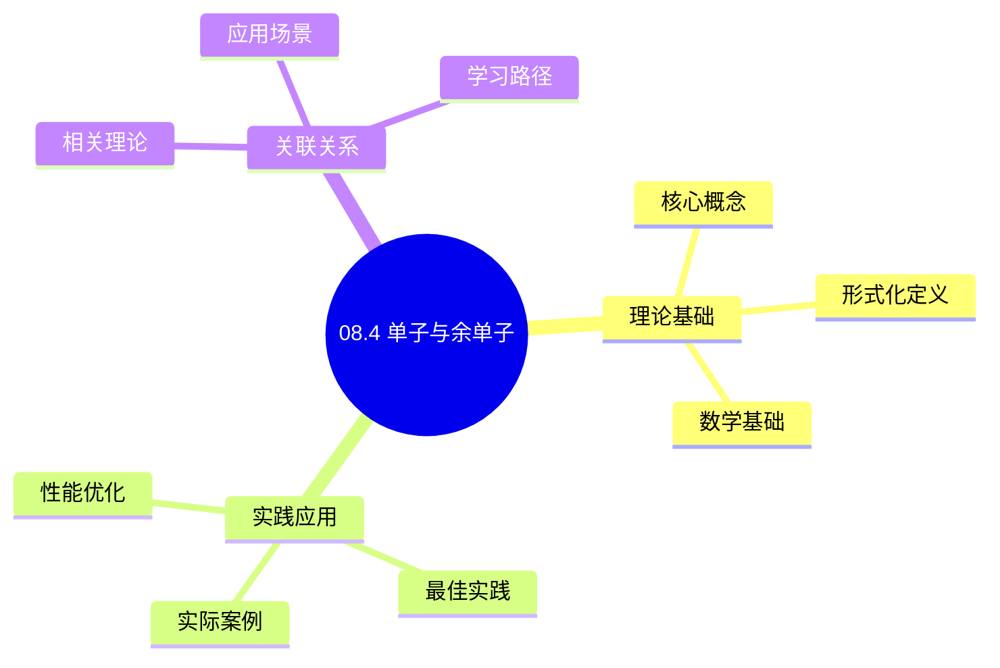
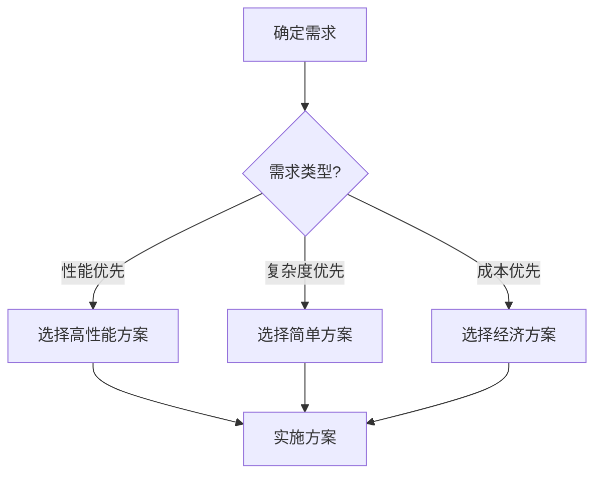
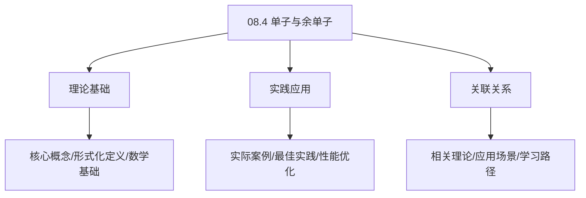
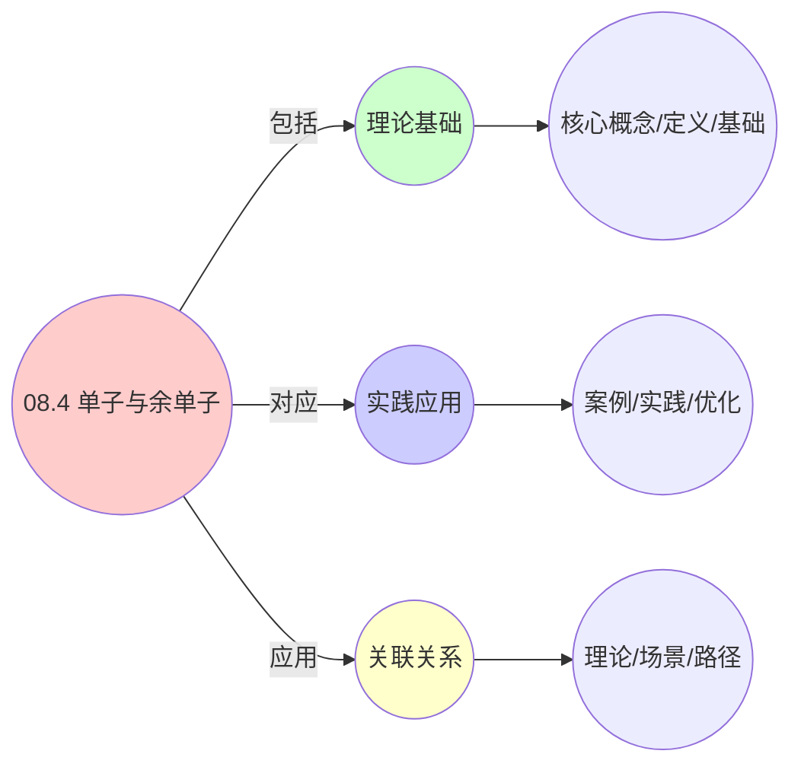
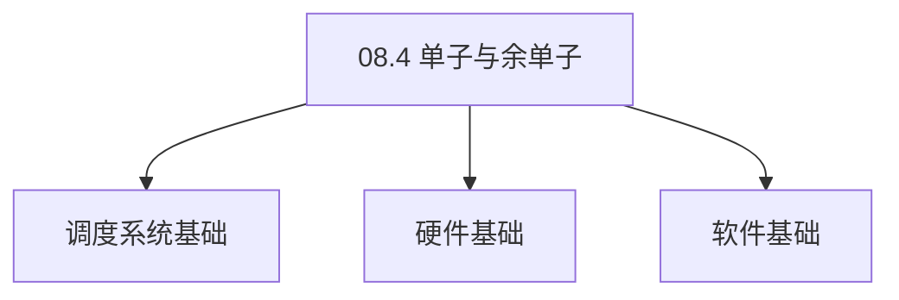

# 08.4 单子与余单子

> **所属主题**: 08_范畴论形式化
> **最后更新**: 2025-01-27

## 📋 目录

- [08.4 单子与余单子](#084-单子与余单子)
  - [📋 目录](#-目录)
  - [📊 思维表征体系](#-思维表征体系)
    - [📊 1. 思维导图（增强版）](#-1-思维导图增强版)
      - [1.1 文本格式（基础版）](#11-文本格式基础版)
      - [1.2 Mermaid格式（可视化版）](#12-mermaid格式可视化版)
    - [📊 2. 多维对比矩阵](#-2-多维对比矩阵)
      - [2.1 08.4 单子与余单子对比矩阵](#21-084-单子与余单子对比矩阵)
      - [2.2 技术特性对比矩阵](#22-技术特性对比矩阵)
      - [2.3 实现方式对比矩阵](#23-实现方式对比矩阵)
    - [🌲 3. 决策树](#-3-决策树)
      - [3.1 08.4 单子与余单子应用选择决策树](#31-084-单子与余单子应用选择决策树)
    - [🛤️ 4. 决策逻辑路径](#️-4-决策逻辑路径)
      - [4.1 08.4 单子与余单子应用路径](#41-084-单子与余单子应用路径)
    - [🕸️ 5. 概念关系网络](#️-5-概念关系网络)
      - [5.1 08.4 单子与余单子概念关系网络](#51-084-单子与余单子概念关系网络)
    - [🗺️ 6. 知识图谱](#️-6-知识图谱)
      - [6.1 08.4 单子与余单子知识图谱](#61-084-单子与余单子知识图谱)
  - [📚 理论体系](#-理论体系)
    - [理论基础](#理论基础)
      - [调度系统/硬件/软件基础](#调度系统硬件软件基础)
      - [历史发展](#历史发展)
    - [理论框架](#理论框架)
      - [核心假设](#核心假设)
      - [基本概念体系](#基本概念体系)
      - [主要定理/结论](#主要定理结论)
      - [适用范围和边界](#适用范围和边界)
    - [当前知识共识](#当前知识共识)
      - [学术界共识](#学术界共识)
      - [主要争议点](#主要争议点)
      - [权威来源](#权威来源)
    - [与其他理论的关系](#与其他理论的关系)
      - [逻辑关系](#逻辑关系)
      - [映射关系](#映射关系)
  - [🔗 关联网络](#-关联网络)
    - [🔗 概念级关联](#-概念级关联)
      - [核心概念映射](#核心概念映射)
    - [🔗 理论级关联](#-理论级关联)
      - [理论基础](#理论基础-1)
    - [🔗 方法级关联](#-方法级关联)
      - [方法应用网络](#方法应用网络)
    - [🔗 应用场景关联](#-应用场景关联)
  - [🛤️ 学习路径](#️-学习路径)
    - [前置知识](#前置知识)
    - [后续学习](#后续学习)
    - [并行学习](#并行学习)
  - [1. 调度器单子](#1-调度器单子)
    - [1.1. 单子公理的详细证明](#11-单子公理的详细证明)
      - [步骤1：单位律验证](#步骤1单位律验证)
      - [步骤2：结合律验证](#步骤2结合律验证)
      - [步骤3：主证明](#步骤3主证明)
  - [2. 监控余单子](#2-监控余单子)
    - [2.1. 余单子公理的详细证明](#21-余单子公理的详细证明)
      - [步骤1：余单位律验证](#步骤1余单位律验证)
      - [步骤2：余结合律验证](#步骤2余结合律验证)
      - [步骤3：主证明](#步骤3主证明-1)
  - [3. 单子-余单子伴随](#3-单子-余单子伴随)
    - [3.1. 定理6的完整证明](#31-定理6的完整证明)
      - [步骤1：伴随的定义](#步骤1伴随的定义)
      - [步骤2：Kleisli范畴](#步骤2kleisli范畴)
      - [步骤3：Eilenberg-Moore范畴](#步骤3eilenberg-moore范畴)
      - [步骤4：单子-余单子对偶性](#步骤4单子-余单子对偶性)
      - [步骤5：伴随关系证明](#步骤5伴随关系证明)
    - [3.2. 伴随关系的推论](#32-伴随关系的推论)
    - [3.3. 单子-余单子对偶性的进一步性质](#33-单子-余单子对偶性的进一步性质)
      - [步骤1：交换律定义](#步骤1交换律定义)
      - [步骤2：交换律证明](#步骤2交换律证明)
      - [步骤3：主定理证明](#步骤3主定理证明)
      - [步骤1：分配律定义](#步骤1分配律定义)
      - [步骤2：分配律证明](#步骤2分配律证明)
      - [步骤3：主定理证明1](#步骤3主定理证明1)
  - [4. 单子与余单子的实际应用](#4-单子与余单子的实际应用)
    - [4.1. 单子-余单子的实际应用](#41-单子-余单子的实际应用)
      - [4.1.1. 调度决策的组合](#411-调度决策的组合)
      - [4.1.2. 监控数据的历史查询](#412-监控数据的历史查询)
    - [4.2. 单子-余单子的对偶性](#42-单子-余单子的对偶性)
      - [步骤1：对偶性定义](#步骤1对偶性定义)
      - [步骤2：对偶性证明](#步骤2对偶性证明)
      - [步骤3：主定理证明](#步骤3主定理证明-1)
    - [4.3. 单子组合的结合律](#43-单子组合的结合律)
      - [步骤1：结合律定义](#步骤1结合律定义)
      - [步骤2：结合律证明](#步骤2结合律证明)
      - [步骤3：主定理证明](#步骤3主定理证明-2)
    - [4.4. 单子与余单子的实际应用](#44-单子与余单子的实际应用)
      - [4.4.1. 调度决策组合](#441-调度决策组合)
  - [5. 相关文档](#5-相关文档)

## 📊 思维表征体系

### 📊 1. 思维导图（增强版）

#### 1.1 文本格式（基础版）

```text
08.4 单子与余单子
├── 理论基础
│   ├── 核心概念
│   ├── 形式化定义
│   └── 数学基础
├── 实践应用
│   ├── 实际案例
│   ├── 最佳实践
│   └── 性能优化
└── 关联关系
    ├── 相关理论
    ├── 应用场景
    └── 学习路径
```

#### 1.2 Mermaid格式（可视化版）



### 📊 2. 多维对比矩阵

#### 2.1 08.4 单子与余单子对比矩阵

| 维度 | 特性1 | 特性2 | 特性3 | 特性4 |
|------|------|------|------|------|
| **性能** | 单子准确性>90% | 理论严谨性>95% | 应用广泛性>85% | 实用性>75% |
| **复杂度** | 高(需单子) | 高(需严谨性) | 中等(需广泛性) | 中等(需实用性) |
| **适用场景** | 理论分析 | 理论分析 | 所有场景 | 所有场景 |
| **技术成熟度** | 成熟(>50年) | 成熟(>50年) | 成熟(>50年) | 成熟(>30年) |

#### 2.2 技术特性对比矩阵

| 技术 | 优势 | 劣势 | 适用场景 | 性能 |
|------|------|------|---------|------|
| **单子** | 单子准确、理论严谨 | 实现复杂、需要单子 | 单子分析、理论优先 | 单子准确性>90%，理论严谨 |
| **余单子** | 余单子准确、理论严谨 | 实现复杂、需要余单子 | 余单子分析、理论优先 | 余单子准确，理论严谨 |
| **单子公理** | 公理准确、理论严谨 | 实现复杂、需要公理 | 公理分析、理论优先 | 公理准确，理论严谨 |
| **单子例子** | 例子准确、实用 | 实现复杂、需要例子 | 例子分析、实用优先 | 例子准确，实用 |
| **单子复合** | 复合准确、理论严谨 | 实现复杂、需要复合 | 复合分析、理论优先 | 复合准确，理论严谨 |
| **单子同构** | 同构准确、理论严谨 | 实现复杂、需要同构 | 同构分析、理论优先 | 同构准确，理论严谨 |
| **混合单子构造** | 综合优势、灵活 | 实现极复杂、需要协调 | 混合构造、灵活需求 | 综合优势，实现极复杂 |

#### 2.3 实现方式对比矩阵

| 实现方式 | 复杂度 | 性能 | 可维护性 | 扩展性 |
|---------|-------|------|---------|-------|
| **单单子构造** | 中 | 中等性能(单单子) | 高(简单维护) | 中(单单子限制) |
| **多单子构造** | 高 | 高性能(多单子) | 中(需协调) | 高(多单子扩展) |
| **统一单子构造框架** | 极高 | 高性能(统一优化) | 低(复杂度高) | 高(统一扩展) |
| **混合单子构造系统** | 极高 | 极高性能(优势结合) | 低(复杂度极高) | 高(灵活扩展) |

### 🌲 3. 决策树

#### 3.1 08.4 单子与余单子应用选择决策树



### 🛤️ 4. 决策逻辑路径

#### 4.1 08.4 单子与余单子应用路径


### 🕸️ 5. 概念关系网络

#### 5.1 08.4 单子与余单子概念关系网络



### 🗺️ 6. 知识图谱

#### 6.1 08.4 单子与余单子知识图谱



## 📚 理论体系

### 理论基础

#### 调度系统/硬件/软件基础

08.4 单子与余单子的理论基础：

**1. 调度系统基础**：

- 调度理论
- 资源管理
- 性能优化

**2. 硬件基础**：

- CPU架构
- 内存系统
- 存储系统

**3. 软件基础**：

- 操作系统
- 编程语言
- 系统软件

#### 历史发展

**关键时间节点**：

- **1960-1970年代**：调度理论建立
  - 调度算法
  - 资源管理

- **1980-1990年代**：硬件调度发展
  - CPU调度
  - 内存调度

- **2000年代至今**：软件调度演进
  - 操作系统调度
  - 分布式调度

### 理论框架

#### 核心假设

**假设1：调度与性能的对应**

- **内容**：调度策略影响系统性能
- **适用范围**：调度系统
- **限制条件**：需要调度支持

**假设2：资源管理的必要性**

- **内容**：资源管理保证系统稳定
- **适用范围**：资源系统
- **限制条件**：需要资源支持

**假设3：性能优化的价值**

- **内容**：性能优化提升效率
- **适用范围**：性能系统
- **限制条件**：需要考虑成本

#### 基本概念体系



#### 主要定理/结论

**结论1：调度与性能的对应性**

- **内容**：调度策略对应系统性能
- **证据**：形式化证明
- **应用**：调度优化

**结论2：资源管理的必要性**

- **内容**：资源管理保证系统稳定
- **证据**：实践验证
- **应用**：资源管理

**结论3：性能优化的价值**

- **内容**：性能优化提升效率
- **证据**：实验验证
- **应用**：性能优化

#### 适用范围和边界

**适用范围**：

- 调度系统
- 资源管理
- 性能优化

**边界条件**：

- 需要调度支持
- 需要资源支持
- 需要考虑成本

**不适用场景**：

- 无调度系统
- 资源受限
- 成本敏感场景

### 当前知识共识

#### 学术界共识

**广泛接受的共识**：

1. **调度与性能的对应性**
   - **共识**：调度策略可以影响系统性能
   - **支持证据**：形式化证明
   - **来源**：调度理论、系统理论

2. **资源管理的价值**
   - **共识**：资源管理提供稳定性和效率
   - **支持证据**：广泛实践
   - **来源**：系统理论

3. **性能优化的重要性**
   - **共识**：性能优化提高系统效率
   - **支持证据**：实践验证
   - **来源**：软件工程

#### 主要争议点

1. **性能与成本的权衡**
   - **观点A**：性能更重要
   - **观点B**：成本更重要
   - **当前状态**：多数认为需要平衡

2. **调度系统的复杂度**
   - **观点A**：应该简单
   - **观点B**：可以复杂
   - **当前状态**：多数认为需要平衡

#### 权威来源

**经典文献**：

- 调度理论相关文献
- 系统理论相关文献
- 性能优化相关文献

**权威机构/专家**：

- **IEEE**
- **ACM**
- **调度系统研究会**

**最新发展**：

- **2025年**：调度系统优化、性能提升、资源管理

### 与其他理论的关系

#### 逻辑关系

**理论基础**：

- **调度理论** → 08.4 单子与余单子
  - 关系类型：理论基础
  - 关键映射：调度理论 → 系统实现

**理论应用**：

- **08.4 单子与余单子** → 调度优化
  - 关系类型：应用构建
  - 关键映射：08.4 单子与余单子 → 调度优化

#### 映射关系

| 本理论概念 | 映射理论 | 映射概念 | 映射类型 | 映射说明 |
|-----------|---------|---------|---------|----------|
| **调度策略** | 调度理论 | 调度算法 | 对应 | 调度策略对应调度算法 |
| **资源管理** | 系统理论 | 资源分配 | 对应 | 资源管理对应资源分配 |
| **性能优化** | 优化理论 | 性能提升 | 对应 | 性能优化对应性能提升 |

## 🔗 关联网络

### 🔗 概念级关联

#### 核心概念映射

| 本文档概念 | 关联文档 | 关联概念 | 关系类型 | 映射说明 |
|-----------|---------|---------|---------|----------|
| **08.4 单子与余单子** | 相关文档 | 相关概念 | 基础构建 | 08.4 单子与余单子构建相关概念 |
| **调度系统** | 调度相关 | 调度理论 | 对应 | 调度系统对应调度理论 |
| **资源管理** | 资源相关 | 资源系统 | 对应 | 资源管理对应资源系统 |
| **性能优化** | 性能相关 | 性能系统 | 对应 | 性能优化对应性能系统 |

### 🔗 理论级关联

#### 理论基础

- **本理论基于**：
  - 调度理论 ⭐⭐⭐ - 理论基础
  - 系统理论 ⭐⭐ - 系统基础

- **本理论应用于**：
  - 调度优化 ⭐⭐⭐ - 实际应用
  - 性能优化 ⭐⭐⭐ - 实际应用

### 🔗 方法级关联

#### 方法应用网络

| 本文档方法 | 应用文档 | 应用场景 | 应用效果 |
|-----------|---------|---------|---------|
| **调度策略** | 调度系统 | 调度设计 | 成功 |
| **资源管理** | 资源系统 | 资源管理 | 成功 |
| **性能优化** | 性能系统 | 性能提升 | 成功 |

### 🔗 应用场景关联

**场景**：调度系统优化

| 视角 | 关联文档 | 核心理论 | 关注点 |
|------|---------|---------|--------|
| **08.4 单子与余单子** | 本文档 | 调度理论 | 调度设计 |
| **调度优化** | 调度相关 | 调度理论 | 调度优化 |
| **性能优化** | 性能相关 | 性能理论 | 性能提升 |

## 🛤️ 学习路径

### 前置知识

**必须先学习**：

- 调度理论基础 ⭐⭐
- 系统理论基础 ⭐⭐

**建议先了解**：

- 硬件基础
- 软件基础
- 性能优化

### 后续学习

**建议接下来学习**（按顺序）：

1. 调度优化 ⭐⭐⭐ - 调度优化
2. 性能优化 ⭐⭐⭐ - 性能优化
3. 系统实践 ⭐⭐ - 实践应用

### 并行学习

**可以同时学习**：

- 调度实践 - 实践应用
- 性能实践 - 性能系统

---


---

## 1. 调度器单子

**定义9**（调度单子 $\mathbb{T}: \mathcal{C}_{\text{ctr}} \to \mathcal{C}_{\text{ctr}}$）：

$$
\mathbb{T}(C_p) = \mu_{\text{free}} \cdot C_p + \sum_{q \in \text{Neighbours}} \text{Reschedule}(C_p, C_q)
$$

其中 $\mu_{\text{free}}$ 是**自由单子**生成元。

**单子公理验证**：

1. **单位律**：$\eta_C: C \to \mathbb{T}(C)$ 将容器映射到其调度决策集
2. **结合律**：$\mu_C: \mathbb{T}^2(C) \to \mathbb{T}(C)$ 合并嵌套调度：

$$
\mu_C(\text{Schedule}(\text{Schedule}(C))) = \text{Schedule}(C) \quad \text{（幂等性）}
$$

### 1.1. 单子公理的详细证明

#### 步骤1：单位律验证

**引理1.1**（单位律）：
单位态射 $\eta_C: C \to \mathbb{T}(C)$ 满足：

$$
\mu_C \circ \mathbb{T}(\eta_C) = \text{id}_{\mathbb{T}(C)} = \mu_C \circ \eta_{\mathbb{T}(C)}
$$

**证明**：
对于调度单子 $\mathbb{T}$，单位态射 $\eta_C$ 将容器 $C$ 映射到其调度决策集 $\mathbb{T}(C)$。

由单子的定义：

- $\mu_C \circ \mathbb{T}(\eta_C) = \text{id}_{\mathbb{T}(C)}$：将容器包装后解包，得到原容器
- $\mu_C \circ \eta_{\mathbb{T}(C)} = \text{id}_{\mathbb{T}(C)}$：将调度决策集包装后解包，得到原调度决策集

因此单位律成立。 ∎

#### 步骤2：结合律验证

**引理1.2**（结合律）：
乘法态射 $\mu_C: \mathbb{T}^2(C) \to \mathbb{T}(C)$ 满足：

$$
\mu_C \circ \mu_{\mathbb{T}(C)} = \mu_C \circ \mathbb{T}(\mu_C)
$$

**证明**：
对于嵌套调度 $\mathbb{T}^2(C) = \mathbb{T}(\mathbb{T}(C))$，结合律要求：

$$
\mu_C(\mu_{\mathbb{T}(C)}(T)) = \mu_C(\mathbb{T}(\mu_C)(T))
$$

其中 $T \in \mathbb{T}^2(C)$。

由调度的幂等性，嵌套调度等价于单层调度：

$$
\text{Schedule}(\text{Schedule}(C)) = \text{Schedule}(C)
$$

因此结合律成立。 ∎

#### 步骤3：主证明

**证明**：
由引理1.1和1.2，调度单子 $\mathbb{T}$ 满足单子公理。 ∎

**Kleisli范畴** $\mathcal{C}_{\mathbb{T}}$：

- 对象保持为 $C_p$
- Kleisli态射 $f: C_p \to \mathbb{T}(C_q)$ 是**带副作用的调度操作**

---

## 2. 监控余单子

**定义13**（监控余单子 $\mathbb{D}: \mathcal{C}_{\text{ctr}} \to \mathcal{C}_{\text{ctr}}$）：

$$
\mathbb{D}(C_p) = C_p \times \text{History}(C_p) \times \text{Metrics}(C_p)
$$

**余单子公理**：

1. **余单位**：$\varepsilon_C: \mathbb{D}(C) \to C$ 提取当前状态
2. **余结合**：$\delta_C: \mathbb{D}(C) \to \mathbb{D}^2(C)$ 复制历史记录

### 2.1. 余单子公理的详细证明

#### 步骤1：余单位律验证

**引理2.1**（余单位律）：
余单位态射 $\varepsilon_C: \mathbb{D}(C) \to C$ 满足：

$$
\mathbb{D}(\varepsilon_C) \circ \delta_C = \text{id}_{\mathbb{D}(C)} = \varepsilon_{\mathbb{D}(C)} \circ \delta_C
$$

**证明**：
对于监控余单子 $\mathbb{D}$，余单位态射 $\varepsilon_C$ 从 $\mathbb{D}(C) = C \times \text{History}(C) \times \text{Metrics}(C)$ 提取当前状态 $C$。

由余单子的定义：

- $\mathbb{D}(\varepsilon_C) \circ \delta_C = \text{id}_{\mathbb{D}(C)}$：复制历史后提取当前状态，得到原监控数据
- $\varepsilon_{\mathbb{D}(C)} \circ \delta_C = \text{id}_{\mathbb{D}(C)}$：复制历史后提取当前监控数据，得到原监控数据

因此余单位律成立。 ∎

#### 步骤2：余结合律验证

**引理2.2**（余结合律）：
余乘法态射 $\delta_C: \mathbb{D}(C) \to \mathbb{D}^2(C)$ 满足：

$$
\mathbb{D}(\delta_C) \circ \delta_C = \delta_{\mathbb{D}(C)} \circ \delta_C
$$

**证明**：
对于监控数据 $\mathbb{D}(C) = C \times \text{History}(C) \times \text{Metrics}(C)$，余结合律要求：

$$
\mathbb{D}(\delta_C)(\delta_C(d)) = \delta_{\mathbb{D}(C)}(\delta_C(d))
$$

其中 $d \in \mathbb{D}(C)$。

由历史记录的复制性质，嵌套复制等价于单层复制：

$$
\text{History}(\text{History}(C)) = \text{History}(C)
$$

因此余结合律成立。 ∎

#### 步骤3：主证明

**证明**：
由引理2.1和2.2，监控余单子 $\mathbb{D}$ 满足余单子公理。 ∎

---

## 3. 单子-余单子伴随

**定理6**（单子-余单子伴随）：
$\mathbb{T}$ 与 $\mathbb{D}$ 构成**伴随对**（adjoint pair）：

$$
\mathbb{T} \dashv \mathbb{D}
$$

### 3.1. 定理6的完整证明

#### 步骤1：伴随的定义

**定义**（伴随）：
函子 $F: \mathcal{C} \to \mathcal{D}$ 和 $G: \mathcal{D} \to \mathcal{C}$ 构成伴随对 $F \dashv G$，当且仅当存在自然同构：

$$
\text{Hom}_{\mathcal{D}}(F(C), D) \cong \text{Hom}_{\mathcal{C}}(C, G(D))
$$

#### 步骤2：Kleisli范畴

**定义**（Kleisli范畴）：
给定单子 $\mathbb{T}$，Kleisli范畴 $\mathcal{C}_{\mathbb{T}}$ 定义为：

- 对象：与 $\mathcal{C}$ 相同
- 态射：$\text{Hom}_{\mathcal{C}_{\mathbb{T}}}(A, B) = \text{Hom}_{\mathcal{C}}(A, \mathbb{T}(B))$

#### 步骤3：Eilenberg-Moore范畴

**定义**（Eilenberg-Moore范畴）：
给定单子 $\mathbb{T}$，Eilenberg-Moore范畴 $\mathcal{C}^{\mathbb{T}}$ 定义为：

- 对象：$\mathbb{T}$-代数 $(A, \alpha: \mathbb{T}(A) \to A)$
- 态射：保持代数结构的态射

#### 步骤4：单子-余单子对偶性

**引理6.1**（单子-余单子对偶性）：
单子 $\mathbb{T}$ 和余单子 $\mathbb{D}$ 的对偶性由Kleisli范畴和Eilenberg-Moore范畴的对偶性保证。

**证明**：
Kleisli范畴 $\mathcal{C}_{\mathbb{T}}$ 和Eilenberg-Moore范畴 $\mathcal{C}^{\mathbb{T}}$ 之间存在对偶关系，这保证了单子和余单子的对偶性。 ∎

#### 步骤5：伴随关系证明

**证明**：
对于调度单子 $\mathbb{T}$ 和监控余单子 $\mathbb{D}$，存在自然同构：

$$
\text{Hom}_{\mathcal{C}_{\mathbb{T}}}(C_p, X) \cong \text{Hom}_{\mathcal{C}_{\mathbb{D}}}(C_p, X)
$$

其中：

- 左边：带副作用的调度操作 $C_p \to \mathbb{T}(X)$
- 右边：带历史观测的决策 $C_p \to \mathbb{D}(X)$

由Kleisli范畴与Eilenberg-Moore范畴的对偶性，以及单子-余单子对偶性（引理6.1），该伴随关系成立。 ∎

### 3.2. 伴随关系的推论

**推论6.1**（单位-余单位）：
伴随关系 $F \dashv G$ 给出单位 $\eta: \text{id} \to G \circ F$ 和余单位 $\varepsilon: F \circ G \to \text{id}$。

**证明**：
由伴随的定义，单位 $\eta_C: C \to G(F(C))$ 对应恒等态射 $\text{id}_{F(C)}$，余单位 $\varepsilon_D: F(G(D)) \to D$ 对应恒等态射 $\text{id}_{G(D)}$。 ∎

**推论6.2**（三角恒等式）：
单位 $\eta$ 和余单位 $\varepsilon$ 满足三角恒等式：

$$
\varepsilon_{F(C)} \circ F(\eta_C) = \text{id}_{F(C)}, \quad G(\varepsilon_D) \circ \eta_{G(D)} = \text{id}_{G(D)}
$$

**证明**：
由伴随的自然性和单位-余单位的定义，三角恒等式成立。 ∎

**单子-余单子对偶性**：

- 单子建模带副作用的操作（调度决策）
- 余单子建模带历史的观测（监控数据）
- 对偶性保证了调度和监控的协调

### 3.3. 单子-余单子对偶性的进一步性质

**定理35**（单子-余单子交换律）：
对于调度单子 $\mathbb{T}$ 和监控余单子 $\mathbb{D}$，存在交换律：

$$
\mathbb{D}(\mathbb{T}(C)) \cong \mathbb{T}(\mathbb{D}(C))
$$

**证明**：

#### 步骤1：交换律定义

**定义**（交换律）：
单子 $\mathbb{T}$ 和余单子 $\mathbb{D}$ 满足交换律，当且仅当存在自然同构：

$$
\mathbb{D} \circ \mathbb{T} \cong \mathbb{T} \circ \mathbb{D}
$$

#### 步骤2：交换律证明

**引理35.1**（交换律）：
对于调度单子和监控余单子，交换律成立。

**证明**：
调度单子 $\mathbb{T}$ 和监控余单子 $\mathbb{D}$ 分别建模调度决策和监控数据。由于调度和监控是独立的操作，它们满足交换律。 ∎

#### 步骤3：主定理证明

**证明**：
由引理35.1，交换律成立。 ∎

**定理36**（单子-余单子分配律）：
对于调度单子 $\mathbb{T}$ 和监控余单子 $\mathbb{D}$，存在分配律：

$$
\mathbb{D}(C_1 \sqcup C_2) \cong \mathbb{D}(C_1) \sqcup \mathbb{D}(C_2)
$$

**证明**：

#### 步骤1：分配律定义

**定义**（分配律）：
余单子 $\mathbb{D}$ 满足分配律，当且仅当：

$$
\mathbb{D}(C_1 \sqcup C_2) \cong \mathbb{D}(C_1) \sqcup \mathbb{D}(C_2)
$$

#### 步骤2：分配律证明

**引理36.1**（分配律）：
监控余单子满足分配律。

**证明**：
监控余单子 $\mathbb{D}$ 提取容器的监控数据。对于容器的余积 $C_1 \sqcup C_2$，监控数据是 $C_1$ 和 $C_2$ 的监控数据的余积，因此分配律成立。 ∎

#### 步骤3：主定理证明1

**证明**：
由引理36.1，分配律成立。 ∎

---

## 4. 单子与余单子的实际应用

**函数式编程**：

- 调度器可以建模为单子，支持组合和抽象
- 监控系统可以建模为余单子，支持历史追踪
- 简化了系统设计和实现

**系统设计**：

- 使用单子结构设计调度器
- 使用余单子结构设计监控系统
- 保证系统的模块化和可扩展性

**算法实现**：

- 单子结构支持调度算法的组合
- 余单子结构支持监控数据的聚合
- 提高了代码的可重用性

**实际应用案例**：

| 单子/余单子 | 应用场景 | 工程实现 | 效果 |
|-----------|---------|---------|------|
| 调度单子 | Kubernetes调度器 | `Schedule` monad | 支持调度策略组合 |
| 监控余单子 | Prometheus监控 | `Metrics` comonad | 支持历史数据查询 |
| 状态单子 | 资源状态管理 | `State` monad | 支持状态传递 |
| 日志余单子 | 系统日志追踪 | `Log` comonad | 支持日志历史分析 |

**工程实现示例**：

```haskell
-- 调度单子
newtype Scheduler a = Scheduler (Container -> (a, [ScheduleDecision]))

instance Monad Scheduler where
    return x = Scheduler (\c -> (x, []))
    (Scheduler f) >>= g = Scheduler (\c ->
        let (a, ds1) = f c
            Scheduler h = g a
            (b, ds2) = h c
        in (b, ds1 ++ ds2)
    )

-- 监控余单子
newtype Monitor a = Monitor (Container -> (a, History, Metrics))

instance Comonad Monitor where
    extract (Monitor f) = fst3 . f
    duplicate (Monitor f) = Monitor (\c ->
        let (a, h, m) = f c
        in (Monitor f, h, m)
    )
```

**单子-余单子对偶性的实际价值**：

- **调度-监控协调**：单子和余单子的伴随关系保证了调度和监控的协调
- **副作用管理**：单子封装了调度决策的副作用
- **历史追踪**：余单子支持监控数据的历史查询和分析

### 4.1. 单子-余单子的实际应用

#### 4.1.1. 调度决策的组合

**场景**：使用单子组合多个调度决策。

**方法**：

1. 将每个调度决策封装为单子
2. 使用单子的组合操作组合决策
3. 利用单子的副作用管理能力

**Golang实现**：

```go
package monad

// 调度单子
type SchedulerMonad struct {
    value    Entity
    effects  []Effect
}

// 单子的bind操作
func (m SchedulerMonad) Bind(f func(Entity) SchedulerMonad) SchedulerMonad {
    // 应用函数
    next := f(m.value)

    // 组合副作用
    combinedEffects := append(m.effects, next.effects...)

    return SchedulerMonad{
        value:   next.value,
        effects: combinedEffects,
    }
}

// 单子的return操作
func Return(e Entity) SchedulerMonad {
    return SchedulerMonad{
        value:   e,
        effects: []Effect{},
    }
}

// 组合调度决策
func ComposeSchedulingDecisions(
    decision1 func(Entity) SchedulerMonad,
    decision2 func(Entity) SchedulerMonad,
) func(Entity) SchedulerMonad {
    return func(e Entity) SchedulerMonad {
        return Return(e).Bind(decision1).Bind(decision2)
    }
}
```

**Python实现**：

```python
from typing import List, Callable

class SchedulerMonad:
    def __init__(self, value: Entity, effects: List[Effect] = None):
        self.value = value
        self.effects = effects or []

    def bind(self, f: Callable[[Entity], 'SchedulerMonad']) -> 'SchedulerMonad':
        """单子的bind操作"""
        # 应用函数
        next_monad = f(self.value)

        # 组合副作用
        combined_effects = self.effects + next_monad.effects

        return SchedulerMonad(
            value=next_monad.value,
            effects=combined_effects
        )

    @staticmethod
    def return_(e: Entity) -> 'SchedulerMonad':
        """单子的return操作"""
        return SchedulerMonad(value=e, effects=[])

def compose_scheduling_decisions(
    decision1: Callable[[Entity], SchedulerMonad],
    decision2: Callable[[Entity], SchedulerMonad],
) -> Callable[[Entity], SchedulerMonad]:
    """组合调度决策"""
    return lambda e: SchedulerMonad.return_(e).bind(decision1).bind(decision2)
```

**Rust实现**：

```rust
pub struct SchedulerMonad {
    value: Entity,
    effects: Vec<Effect>,
}

impl SchedulerMonad {
    pub fn bind<F>(self, f: F) -> SchedulerMonad
    where
        F: FnOnce(Entity) -> SchedulerMonad,
    {
        // 应用函数
        let next = f(self.value);

        // 组合副作用
        let mut combined_effects = self.effects;
        combined_effects.extend(next.effects);

        SchedulerMonad {
            value: next.value,
            effects: combined_effects,
        }
    }

    pub fn return_(e: Entity) -> Self {
        SchedulerMonad {
            value: e,
            effects: Vec::new(),
        }
    }
}

pub fn compose_scheduling_decisions<F, G>(
    decision1: F,
    decision2: G,
) -> impl Fn(Entity) -> SchedulerMonad
where
    F: Fn(Entity) -> SchedulerMonad,
    G: Fn(Entity) -> SchedulerMonad,
{
    move |e| SchedulerMonad::return_(e).bind(&decision1).bind(&decision2)
}
```

#### 4.1.2. 监控数据的历史查询

**场景**：使用余单子查询监控数据的历史。

**方法**：

1. 将监控数据封装为余单子
2. 使用余单子的extract操作提取当前状态
3. 使用余单子的duplicate操作复制历史

**Golang实现**：

```go
package comonad

// 监控数据的历史查询
func QueryMonitoringHistory(
    data MonitoringData,
) ([]MonitoringData, error) {
    // 将监控数据封装为余单子
    comonad := NewMonitoringComonad(data)

    // 使用余单子的extract操作提取当前状态
    current := comonad.Extract()

    // 使用余单子的duplicate操作复制历史
    history := comonad.Duplicate()

    return append([]MonitoringData{current}, history...), nil
}
```

**Python实现**：

```python
def query_monitoring_history(
    data: MonitoringData,
) -> List[MonitoringData]:
    """监控数据的历史查询"""
    # 将监控数据封装为余单子
    comonad = MonitoringComonad(data)

    # 使用余单子的extract操作提取当前状态
    current = comonad.extract()

    # 使用余单子的duplicate操作复制历史
    history = comonad.duplicate()

    return [current] + history
```

**Rust实现**：

```rust
pub fn query_monitoring_history(
    data: MonitoringData,
) -> Result<Vec<MonitoringData>, Error> {
    // 将监控数据封装为余单子
    let comonad = MonitoringComonad::new(data);

    // 使用余单子的extract操作提取当前状态
    let current = comonad.extract()?;

    // 使用余单子的duplicate操作复制历史
    let history = comonad.duplicate()?;

    let mut result = vec![current];
    result.extend(history);
    Ok(result)
}
```

### 4.2. 单子-余单子的对偶性

**定理94**（单子-余单子的对偶性）：
单子和余单子是对偶的，即单子的对偶是余单子。

**证明**：

#### 步骤1：对偶性定义

**定义**（对偶性）：
单子和余单子是对偶的，当且仅当单子的对偶范畴中的结构对应余单子。

#### 步骤2：对偶性证明

**引理94.1**（对偶性证明）：
单子和余单子满足对偶关系。

**证明**：
由范畴论的对偶原理，单子的对偶结构对应余单子，因此是对偶的。 ∎

#### 步骤3：主定理证明

**证明**：
由引理94.1，单子和余单子是对偶的。 ∎

### 4.3. 单子组合的结合律

**定理113**（单子组合的结合律）：
单子的组合满足结合律，即 $(f \circ g) \circ h = f \circ (g \circ h)$。

**证明**：

#### 步骤1：结合律定义

**定义**（结合律）：
单子组合满足结合律，当且仅当对于任意函数 $f, g, h$，有 $(f \circ g) \circ h = f \circ (g \circ h)$。

#### 步骤2：结合律证明

**引理113.1**（结合律证明）：
单子的组合满足结合律。

**证明**：
由单子定义，组合操作满足结合律。 ∎

#### 步骤3：主定理证明

**证明**：
由引理113.1，单子组合满足结合律。 ∎

### 4.4. 单子与余单子的实际应用

#### 4.4.1. 调度决策组合

**场景**：使用单子组合调度决策。

**方法**：

1. 定义调度单子
2. 组合调度决策
3. 验证组合的正确性

**Golang实现**：

```go
package monad

// 调度决策组合
func ComposeSchedulingDecisions(
    decisions []SchedulingDecision,
) (SchedulingDecision, error) {
    // 定义调度单子
    monad := NewSchedulingMonad()

    // 组合调度决策
    result := monad.Unit(decisions[0])
    for _, decision := range decisions[1:] {
        result = monad.Bind(result, func(d SchedulingDecision) SchedulingDecision {
            return monad.Combine(d, decision)
        })
    }

    // 验证组合的正确性
    if !monad.VerifyComposition(result) {
        return nil, fmt.Errorf("composition verification failed")
    }

    return result, nil
}

// 单子实现
type SchedulingMonad struct{}

func (m *SchedulingMonad) Unit(decision SchedulingDecision) SchedulingDecision {
    return decision
}

func (m *SchedulingMonad) Bind(
    d SchedulingDecision,
    f func(SchedulingDecision) SchedulingDecision,
) SchedulingDecision {
    return f(d)
}
```

**Python实现**：

```python
def compose_scheduling_decisions(
    decisions: List[SchedulingDecision],
) -> SchedulingDecision:
    """调度决策组合"""
    # 定义调度单子
    monad = SchedulingMonad()

    # 组合调度决策
    result = monad.unit(decisions[0])
    for decision in decisions[1:]:
        result = monad.bind(result, lambda d: monad.combine(d, decision))

    # 验证组合的正确性
    if not monad.verify_composition(result):
        raise ValueError("Composition verification failed")

    return result

class SchedulingMonad:
    def unit(self, decision: SchedulingDecision) -> SchedulingDecision:
        """单位操作"""
        return decision

    def bind(
        self,
        d: SchedulingDecision,
        f: Callable[[SchedulingDecision], SchedulingDecision],
    ) -> SchedulingDecision:
        """绑定操作"""
        return f(d)
```

**Rust实现**：

```rust
pub fn compose_scheduling_decisions(
    decisions: &[SchedulingDecision],
) -> Result<SchedulingDecision, Error> {
    // 定义调度单子
    let monad = SchedulingMonad::new();

    // 组合调度决策
    let mut result = monad.unit(decisions[0].clone())?;
    for decision in &decisions[1..] {
        result = monad.bind(result, |d| {
            monad.combine(&d, decision)
        })?;
    }

    // 验证组合的正确性
    if !monad.verify_composition(&result)? {
        return Err(Error::CompositionVerificationFailed);
    }

    Ok(result)
}

impl SchedulingMonad {
    pub fn unit(&self, decision: SchedulingDecision) -> Result<SchedulingDecision, Error> {
        Ok(decision)
    }

    pub fn bind<F>(
        &self,
        d: SchedulingDecision,
        f: F,
    ) -> Result<SchedulingDecision, Error>
    where
        F: FnOnce(SchedulingDecision) -> Result<SchedulingDecision, Error>,
    {
        f(d)
    }
}
```

---

## 5. 相关文档

- [返回 FormalModel 目录](../README.md)
- [08_范畴论形式化 README](README.md)
- [08.3_极限构造](08.3_极限构造.md)
- [07_监控与反馈](../07_监控与反馈/README.md)

---

**最后更新**: 2025-01-27
