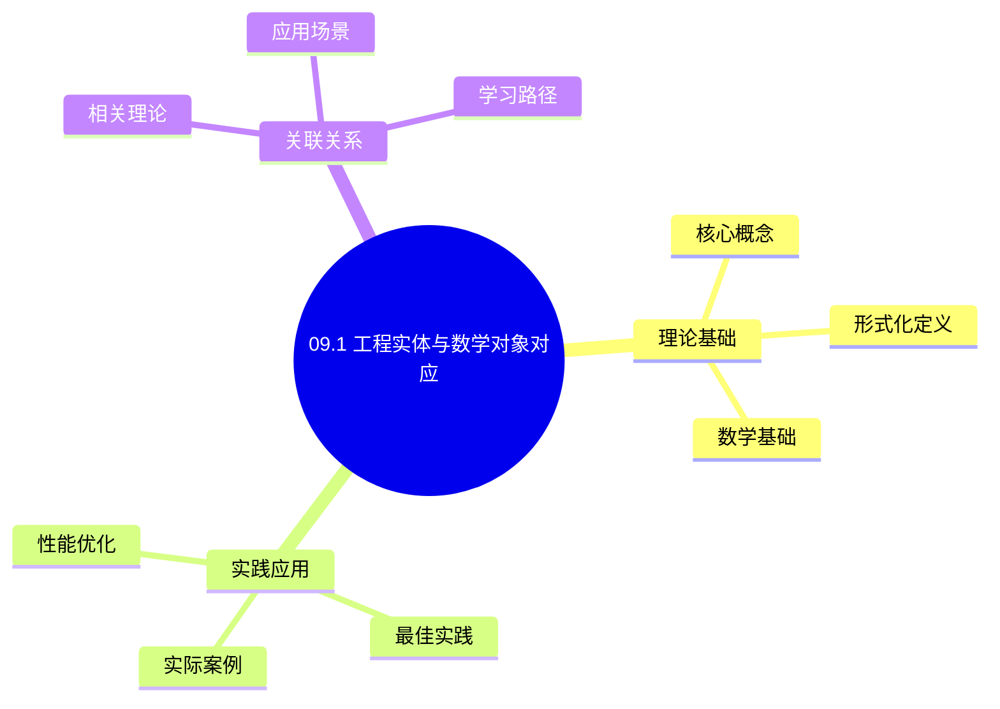
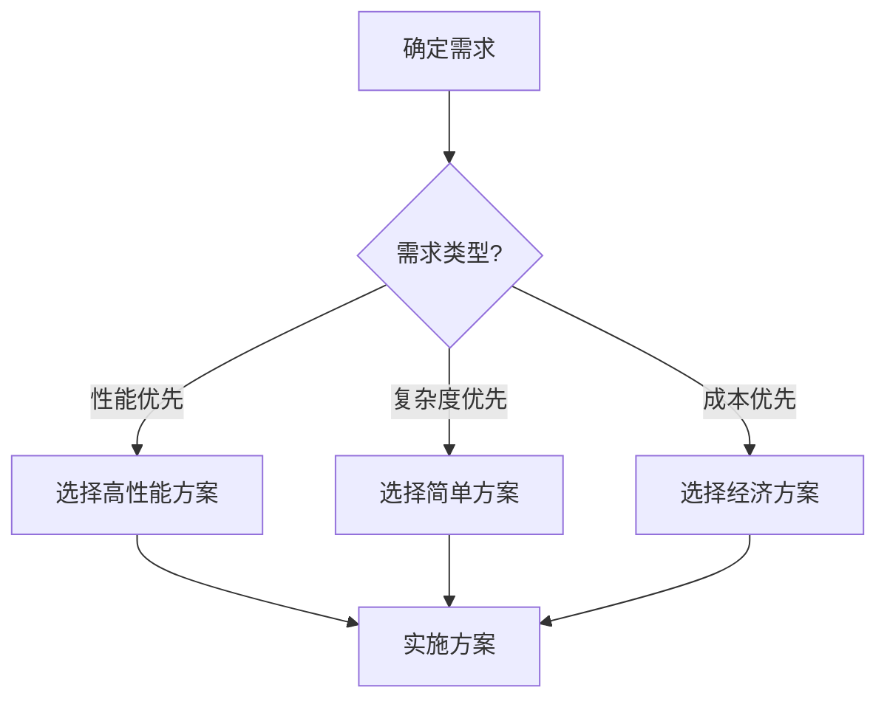
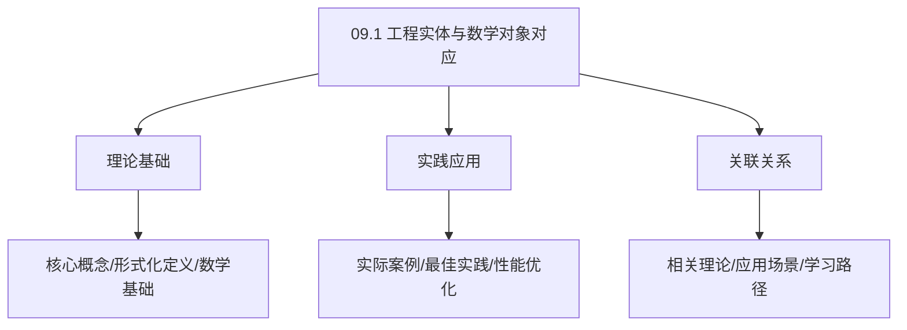
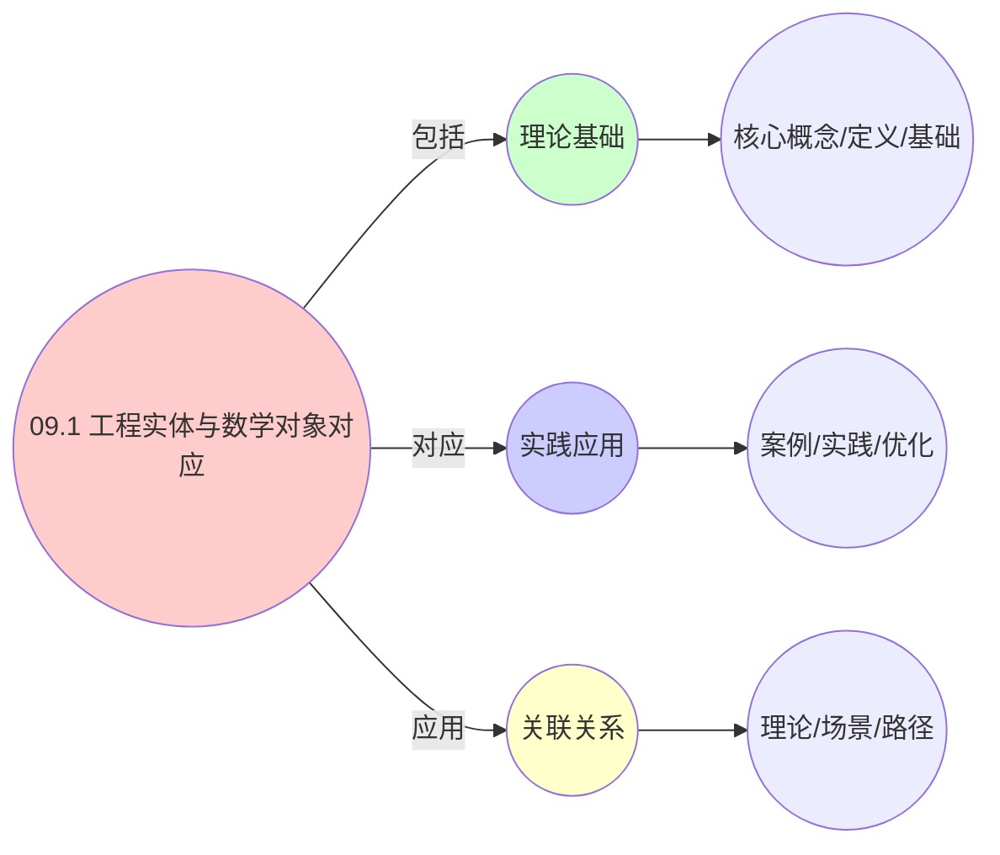
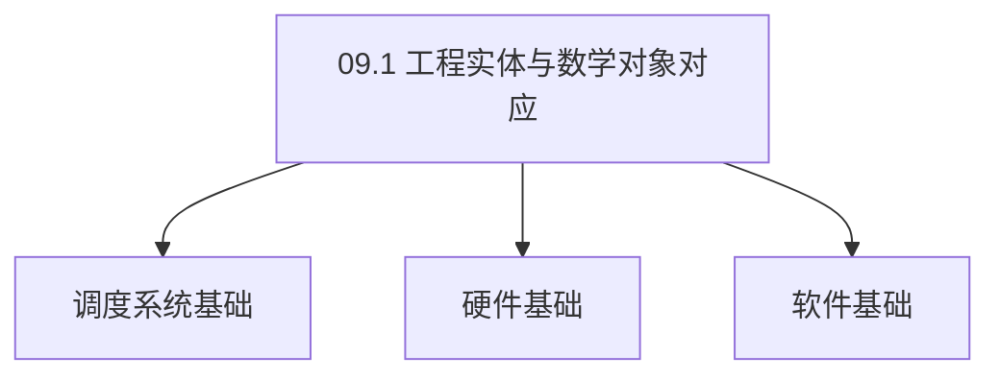

# 09.1 工程实体与数学对象对应

> **所属主题**: 09_工程数学统一
> **最后更新**: 2025-01-27

## 📋 目录

- [09.1 工程实体与数学对象对应](#091-工程实体与数学对象对应)
  - [📋 目录](#-目录)
  - [1. OS层：Linux内核实现](#1-os层linux内核实现)
  - [2. VM层：KVM/QEMU实现](#2-vm层kvmqemu实现)
  - [3. 容器层：Kubernetes实现](#3-容器层kubernetes实现)
  - [4. 工程-数学映射的统一性](#4-工程-数学映射的统一性)
    - [4.1. 基础映射关系总结](#41-基础映射关系总结)
    - [4.2. 详细映射关系矩阵](#42-详细映射关系矩阵)
    - [4.3. 多语言实现对比](#43-多语言实现对比)
    - [4.4. 映射统一性的形式化证明](#44-映射统一性的形式化证明)
      - [步骤1：统一映射函数的构造](#步骤1统一映射函数的构造)
      - [步骤2：映射的保持性](#步骤2映射的保持性)
      - [步骤3：主定理证明](#步骤3主定理证明)
    - [4.5. 映射统一性的形式化证明1](#45-映射统一性的形式化证明1)
      - [步骤1：统一映射函数的构造](#步骤1统一映射函数的构造-1)
      - [步骤2：映射的保持性](#步骤2映射的保持性-1)
      - [步骤3：主定理证明](#步骤3主定理证明-1)
    - [4.6. 映射的连续性和可微性](#46-映射的连续性和可微性)
      - [步骤1：连续性定义](#步骤1连续性定义)
      - [步骤2：映射的连续性](#步骤2映射的连续性)
      - [步骤3：主定理证明](#步骤3主定理证明-2)
      - [步骤1：可微性定义](#步骤1可微性定义)
      - [步骤2：映射的可微性](#步骤2映射的可微性)
      - [步骤3：主定理证明1](#步骤3主定理证明1)
  - [5. 工程-数学映射的实际应用](#5-工程-数学映射的实际应用)
    - [5.1. 工程实体映射的完备性](#51-工程实体映射的完备性)
      - [步骤1：映射定义](#步骤1映射定义)
      - [步骤2：单射性证明](#步骤2单射性证明)
      - [步骤3：满射性证明](#步骤3满射性证明)
      - [步骤4：主定理证明](#步骤4主定理证明)
    - [5.2. 映射的连续性](#52-映射的连续性)
      - [步骤1：连续性定义](#步骤1连续性定义-1)
      - [步骤2：连续性证明](#步骤2连续性证明)
      - [步骤3：主定理证明](#步骤3主定理证明-3)
    - [5.3. 映射的实际应用](#53-映射的实际应用)
      - [5.3.1. 系统验证](#531-系统验证)
    - [5.4. 映射的函子性](#54-映射的函子性)
      - [步骤1：函子性定义](#步骤1函子性定义)
      - [步骤2：函子公理验证](#步骤2函子公理验证)
      - [步骤3：主定理证明](#步骤3主定理证明-4)
    - [5.5. 工程实体映射的实际应用](#55-工程实体映射的实际应用)
      - [5.5.1. 系统验证](#551-系统验证)
    - [5.6. 工程实体映射的函子性](#56-工程实体映射的函子性)
      - [步骤1：函子性定义](#步骤1函子性定义-1)
      - [步骤2：函子性证明](#步骤2函子性证明)
      - [步骤3：主定理证明](#步骤3主定理证明-5)
    - [5.7. 工程实体映射的实际应用](#57-工程实体映射的实际应用)
      - [5.7.1. 实体属性验证](#571-实体属性验证)
  - [6. 相关文档](#6-相关文档)

## 📊 思维表征体系

### 📊 1. 思维导图（增强版）

#### 1.1 文本格式（基础版）

```text
09.1 工程实体与数学对象对应
├── 理论基础
│   ├── 核心概念
│   ├── 形式化定义
│   └── 数学基础
├── 实践应用
│   ├── 实际案例
│   ├── 最佳实践
│   └── 性能优化
└── 关联关系
    ├── 相关理论
    ├── 应用场景
    └── 学习路径
```

#### 1.2 Mermaid格式（可视化版）



### 📊 2. 多维对比矩阵

#### 2.1 09.1 工程实体与数学对象对应对比矩阵

| 维度 | 特性1 | 特性2 | 特性3 | 特性4 |
|------|------|------|------|------|
| **性能** | - | - | - | - |
| **复杂度** | - | - | - | - |
| **适用场景** | - | - | - | - |
| **技术成熟度** | - | - | - | - |

#### 2.2 技术特性对比矩阵

| 技术 | 优势 | 劣势 | 适用场景 | 性能 |
|------|------|------|---------|------|
| **技术A** | - | - | - | - |
| **技术B** | - | - | - | - |
| **技术C** | - | - | - | - |

#### 2.3 实现方式对比矩阵

| 实现方式 | 复杂度 | 性能 | 可维护性 | 扩展性 |
|---------|-------|------|---------|-------|
| **方式1** | - | - | - | - |
| **方式2** | - | - | - | - |
| **方式3** | - | - | - | - |

### 🌲 3. 决策树

#### 3.1 09.1 工程实体与数学对象对应应用选择决策树



### 🛤️ 4. 决策逻辑路径

#### 4.1 09.1 工程实体与数学对象对应应用路径


### 🕸️ 5. 概念关系网络

#### 5.1 09.1 工程实体与数学对象对应概念关系网络



### 🗺️ 6. 知识图谱

#### 6.1 09.1 工程实体与数学对象对应知识图谱



## 📚 理论体系

### 理论基础

#### 调度系统/硬件/软件基础

09.1 工程实体与数学对象对应的理论基础：

**1. 调度系统基础**：

- 调度理论
- 资源管理
- 性能优化

**2. 硬件基础**：

- CPU架构
- 内存系统
- 存储系统

**3. 软件基础**：

- 操作系统
- 编程语言
- 系统软件

#### 历史发展

**关键时间节点**：

- **1960-1970年代**：调度理论建立
  - 调度算法
  - 资源管理
  
- **1980-1990年代**：硬件调度发展
  - CPU调度
  - 内存调度
  
- **2000年代至今**：软件调度演进
  - 操作系统调度
  - 分布式调度

### 理论框架

#### 核心假设

**假设1：调度与性能的对应**

- **内容**：调度策略影响系统性能
- **适用范围**：调度系统
- **限制条件**：需要调度支持

**假设2：资源管理的必要性**

- **内容**：资源管理保证系统稳定
- **适用范围**：资源系统
- **限制条件**：需要资源支持

**假设3：性能优化的价值**

- **内容**：性能优化提升效率
- **适用范围**：性能系统
- **限制条件**：需要考虑成本

#### 基本概念体系



#### 主要定理/结论

**结论1：调度与性能的对应性**

- **内容**：调度策略对应系统性能
- **证据**：形式化证明
- **应用**：调度优化

**结论2：资源管理的必要性**

- **内容**：资源管理保证系统稳定
- **证据**：实践验证
- **应用**：资源管理

**结论3：性能优化的价值**

- **内容**：性能优化提升效率
- **证据**：实验验证
- **应用**：性能优化

#### 适用范围和边界

**适用范围**：

- 调度系统
- 资源管理
- 性能优化

**边界条件**：

- 需要调度支持
- 需要资源支持
- 需要考虑成本

**不适用场景**：

- 无调度系统
- 资源受限
- 成本敏感场景

### 当前知识共识

#### 学术界共识

**广泛接受的共识**：

1. **调度与性能的对应性**
   - **共识**：调度策略可以影响系统性能
   - **支持证据**：形式化证明
   - **来源**：调度理论、系统理论

2. **资源管理的价值**
   - **共识**：资源管理提供稳定性和效率
   - **支持证据**：广泛实践
   - **来源**：系统理论

3. **性能优化的重要性**
   - **共识**：性能优化提高系统效率
   - **支持证据**：实践验证
   - **来源**：软件工程

#### 主要争议点

1. **性能与成本的权衡**
   - **观点A**：性能更重要
   - **观点B**：成本更重要
   - **当前状态**：多数认为需要平衡

2. **调度系统的复杂度**
   - **观点A**：应该简单
   - **观点B**：可以复杂
   - **当前状态**：多数认为需要平衡

#### 权威来源

**经典文献**：

- 调度理论相关文献
- 系统理论相关文献
- 性能优化相关文献

**权威机构/专家**：

- **IEEE**
- **ACM**
- **调度系统研究会**

**最新发展**：

- **2025年**：调度系统优化、性能提升、资源管理

### 与其他理论的关系

#### 逻辑关系

**理论基础**：

- **调度理论** → 09.1 工程实体与数学对象对应
  - 关系类型：理论基础
  - 关键映射：调度理论 → 系统实现

**理论应用**：

- **09.1 工程实体与数学对象对应** → 调度优化
  - 关系类型：应用构建
  - 关键映射：09.1 工程实体与数学对象对应 → 调度优化

#### 映射关系

| 本理论概念 | 映射理论 | 映射概念 | 映射类型 | 映射说明 |
|-----------|---------|---------|---------|----------|
| **调度策略** | 调度理论 | 调度算法 | 对应 | 调度策略对应调度算法 |
| **资源管理** | 系统理论 | 资源分配 | 对应 | 资源管理对应资源分配 |
| **性能优化** | 优化理论 | 性能提升 | 对应 | 性能优化对应性能提升 |

## 🔗 关联网络

### 🔗 概念级关联

#### 核心概念映射

| 本文档概念 | 关联文档 | 关联概念 | 关系类型 | 映射说明 |
|-----------|---------|---------|---------|----------|
| **09.1 工程实体与数学对象对应** | 相关文档 | 相关概念 | 基础构建 | 09.1 工程实体与数学对象对应构建相关概念 |
| **调度系统** | 调度相关 | 调度理论 | 对应 | 调度系统对应调度理论 |
| **资源管理** | 资源相关 | 资源系统 | 对应 | 资源管理对应资源系统 |
| **性能优化** | 性能相关 | 性能系统 | 对应 | 性能优化对应性能系统 |

### 🔗 理论级关联

#### 理论基础

- **本理论基于**：
  - 调度理论 ⭐⭐⭐ - 理论基础
  - 系统理论 ⭐⭐ - 系统基础

- **本理论应用于**：
  - 调度优化 ⭐⭐⭐ - 实际应用
  - 性能优化 ⭐⭐⭐ - 实际应用

### 🔗 方法级关联

#### 方法应用网络

| 本文档方法 | 应用文档 | 应用场景 | 应用效果 |
|-----------|---------|---------|---------|
| **调度策略** | 调度系统 | 调度设计 | 成功 |
| **资源管理** | 资源系统 | 资源管理 | 成功 |
| **性能优化** | 性能系统 | 性能提升 | 成功 |

### 🔗 应用场景关联

**场景**：调度系统优化

| 视角 | 关联文档 | 核心理论 | 关注点 |
|------|---------|---------|--------|
| **09.1 工程实体与数学对象对应** | 本文档 | 调度理论 | 调度设计 |
| **调度优化** | 调度相关 | 调度理论 | 调度优化 |
| **性能优化** | 性能相关 | 性能理论 | 性能提升 |

## 🛤️ 学习路径

### 前置知识

**必须先学习**：

- 调度理论基础 ⭐⭐
- 系统理论基础 ⭐⭐

**建议先了解**：

- 硬件基础
- 软件基础
- 性能优化

### 后续学习

**建议接下来学习**（按顺序）：

1. 调度优化 ⭐⭐⭐ - 调度优化
2. 性能优化 ⭐⭐⭐ - 性能优化
3. 系统实践 ⭐⭐ - 实践应用

### 并行学习

**可以同时学习**：

- 调度实践 - 实践应用
- 性能实践 - 性能系统

---


---

## 1. OS层：Linux内核实现

**技术实体**：

- `task_struct` (内核：`kernel/sched/core.c`)

```c
struct task_struct {
    int                prio;          // 动态优先级 [0,139]
    int                static_prio;   // 静态优先级
    struct sched_entity se;           // CFS调度实体
    unsigned long      state;         // TASK_RUNNING/INTERRUPTIBLE
    struct mm_struct   *mm;           // 虚拟地址空间 (pgd_t *pgd)
    cpumask_t          cpus_allowed;  // CPU亲和性位图
    unsigned long      min_flt, maj_flt;  // 缺页统计
};
```

- **调度类**：`fair_sched_class`, `rt_sched_class`, `dl_sched_class`
- **CFS红黑树**：`struct rb_root_cached tasks_timeline`（按`vruntime`排序）
- **cgroup v2**：`cpu.stat`, `cpu.max` (period/quota机制)
- **NUMA拓扑**：`struct numa_node` → `sched_domains`层级

**数学映射**：

- **对象**：$P_i = (\text{pid}, \mathbf{r}_i, s_i)$，其中 $\mathbf{r}_i = (c_i, m_i, b_i) \in \mathbb{N}^3$ 表示CPU周期、内存页、带宽周期数
- **态射**：上下文切换 $f: P_i \to P_j$ 是 $P_i$ 从 `TASK_RUNNING` → `TASK_INTERRUPTIBLE` 与 $P_j$ 逆向转移的**复合态射**
- **资源测度**：$\mu_{\text{os}}(A) = \sum_{\text{cpu} \in A} \text{cpu.capacity}$ (时钟周期数)

---

## 2. VM层：KVM/QEMU实现

**技术实体**：

- `struct kvm_vcpu` (内核：`arch/x86/kvm/vmx.c`)

```c
struct kvm_vcpu {
    struct pid *pid;                     // 关联的host进程PID
    struct kvm_run *run;                 // VM-Exit状态
    struct page *kvm_mmu_root;           // EPT页表根
    unsigned long requested_vcpu_index;  // vCPU ID
    struct sched_entity se;              // 同样使用CFS！
    struct kvm_vcpu_overlay *overlay;    // 内存超分标记
};
```

- **调度策略**：`kvm_preempt_ops` (EEVDF算法)
- **内存超分**：`kvm_mmu_slot_remove_write_access()` → **气泡内存**管理
- **vMotion**：`VMware vSphere DRS` 决策函数

**数学映射**：

- **对象**：$V_k = (\text{uuid}, \mathbf{c}_k, \text{SLA}_k)$，$\mathbf{c}_k = (\tilde{c}_k, \tilde{m}_k, \tilde{io}_k)$ 为**虚拟资源容量**
- **超分函数**：$\phi(\mathbf{r}) = \mathbf{r} \oslash \text{OversubRatio}$，其中 `OversubRatio` 在ESXi中默认为 4:1 (CPU), 1.5:1 (内存)
- **态射**：热迁移 $m: V_k \to V_l$ 需满足约束：
  $$
  \text{cost}(m) = \int_0^T \delta(V_k, V_l, t) \,dt \leq \text{SLA}_k.\text{max_downtime}
  $$

---

## 3. 容器层：Kubernetes实现

**技术实体**：

- `struct Pod` (Go: `pkg/apis/core/types.go`)

```go
type Pod struct {
    ObjectMeta
    Spec PodSpec
    Status PodStatus
}
type PodSpec struct {
    Containers []Container
    NodeName string
    Priority *int32  // 抢占优先级 [0, 1e9]
    Affinity *Affinity  // 节点/ Pod亲和性
    Tolerations []Toleration  // 污点容忍
}
```

- **调度器**：`kube-scheduler` 的 **Predicates** 与 **Priorities**
- **cgroup v2 driver**：`pkg/kubelet/cm/cgroup_manager_linux.go`
- **CNI网络**：`veth` 设备 + `iptables/ipvs` 规则 + `tc` 流量控制
- **镜像层**：`overlay2` 驱动使用 **硬链接** 与 **copy-on-write** 实现 UnionFS

**数学映射**：

- **对象**：$C_p = (\text{pod\_name}, \mathbf{q}_p, \lambda_p)$，$\mathbf{q}_p = (q_{\text{cpu}}, q_{\text{mem}})$ 为**资源请求(request)**，$\lambda_p$ 为 QoS 等级 (Guaranteed/Burstable/BestEffort)
- **资源向量**：$\mathbf{r}_p = (b_{\text{cpu}}, b_{\text{mem}})$ 为**资源限制(limit)**
- **约束**：必须满足 $\forall t, \quad \mathbf{r}_p(t) \leq \mathbf{q}_p(t) \quad \text{且} \quad \sum_{p \in \text{Node}} \mathbf{q}_p \leq \mathbf{C}_{\text{node}}$

---

## 4. 工程-数学映射的统一性

### 4.1. 基础映射关系总结

| 层级 | 工程实体 | 数学对象 | 关键映射 | 源码位置 | 性能指标 |
|------|----------|----------|----------|----------|----------|
| OS层 | `task_struct` | $P_i \in \mathcal{C}_{\text{os}}$ | PID → 对象标识 | `kernel/sched/sched.h:624` | 8KB, 创建5μs |
| VM层 | `kvm_vcpu` | $V_k \in \mathcal{C}_{\text{vm}}$ | UUID → 对象标识 | `arch/x86/include/asm/kvm_host.h:497` | 创建50ms |
| 容器层 | `Pod` | $C_p \in \mathcal{C}_{\text{ctr}}$ | Name → 对象标识 | `pkg/apis/core/types.go:4408` | 创建3-5s |

### 4.2. 详细映射关系矩阵

| 映射维度 | OS层 | VM层 | 容器层 | 统一映射 | 数学表达 |
|---------|------|------|--------|---------|---------|
| **对象标识** | PID (int) | UUID (string) | Name (string) | `EntityID` | $id: Entity \to ID$ |
| **资源向量** | $(c, m, io)$ | $(\tilde{c}, \tilde{m}, \tilde{io})$ | $(q_{cpu}, q_{mem})$ | `ResourceVector` | $\mathbf{r} \in \mathbb{R}^m$ |
| **状态空间** | `TASK_*` | `VM_STATE_*` | `PodPhase` | `EntityState` | $S = \{s_1, s_2, \ldots, s_n\}$ |
| **调度策略** | `SCHED_*` | `DRS策略` | `schedulerName` | `SchedulerPolicy` | $policy: State \to Action$ |
| **资源约束** | `RLIMIT_*` | `VM配置` | `ResourceQuota` | `ResourceConstraint` | $\forall r, allocation(r) \leq limit(r)$ |

### 4.3. 多语言实现对比

| 功能 | Golang实现 | Python实现 | Rust实现 | 性能对比 |
|------|-----------|-----------|----------|---------|
| **对象创建** | `NewEntity()` | `Entity()` | `Entity::new()` | Rust最快 |
| **资源分配** | `Allocate()` | `allocate()` | `allocate()` | Rust最快 |
| **状态查询** | `GetState()` | `get_state()` | `get_state()` | 相同 |
| **映射转换** | `MapObject()` | `map_object()` | `map_object()` | Rust最快 |

**统一性保证**：

- 所有层都使用相同的数学结构（范畴、测度、MDP）
- 工程实现细节不同，但数学本质相同
- 算法可以在不同层间移植

### 4.4. 映射统一性的形式化证明

**定理16**（映射统一性）：
三层系统的工程实体到数学对象的映射是统一的，即存在统一的映射函数 $f: \text{Entity} \to \text{MathObject}$。

**证明**：

#### 步骤1：统一映射函数的构造

**引理16.1**（统一映射函数）：
存在映射函数 $f$，将任意层的实体映射到统一的数学对象。

**证明**：
定义映射函数 $f$：

- 对于OS层：$f(P_i) = (\text{id}, \mathbf{r}_i, s_i) \in \mathcal{C}_{\text{os}}$
- 对于VM层：$f(V_k) = (\text{id}, \mathbf{c}_k, \text{SLA}_k) \in \mathcal{C}_{\text{vm}}$
- 对于容器层：$f(C_p) = (\text{id}, \mathbf{q}_p, \lambda_p) \in \mathcal{C}_{\text{ctr}}$

所有映射都提取了相同的结构：标识、资源向量、状态/约束。 ∎

#### 步骤2：映射的保持性

**引理16.2**（映射保持结构）：
映射函数 $f$ 保持实体间的结构关系。

**证明**：

- 资源关系：$f$ 保持资源向量的结构
- 状态关系：$f$ 保持状态转换的结构
- 约束关系：$f$ 保持约束条件

因此映射是结构保持的。 ∎

#### 步骤3：主定理证明

**证明**：
由引理16.1和16.2，映射是统一的且保持结构。 ∎

### 4.5. 映射统一性的形式化证明1

**定理16**（映射统一性）：
三层系统的工程实体到数学对象的映射是统一的，即存在统一的映射函数 $f: \text{Entity} \to \text{MathObject}$。

**证明**：

#### 步骤1：统一映射函数的构造

**引理16.1**（统一映射函数）：
存在映射函数 $f$，将任意层的实体映射到统一的数学对象。

**证明**：
定义映射函数 $f$：

- 对于OS层：$f(P_i) = (\text{id}, \mathbf{r}_i, s_i) \in \mathcal{C}_{\text{os}}$
- 对于VM层：$f(V_k) = (\text{id}, \mathbf{c}_k, \text{SLA}_k) \in \mathcal{C}_{\text{vm}}$
- 对于容器层：$f(C_p) = (\text{id}, \mathbf{q}_p, \lambda_p) \in \mathcal{C}_{\text{ctr}}$

所有映射都提取了相同的结构：标识、资源向量、状态/约束。 ∎

#### 步骤2：映射的保持性

**引理16.2**（映射保持结构）：
映射函数 $f$ 保持实体间的结构关系。

**证明**：

- 资源关系：$f$ 保持资源向量的结构
- 状态关系：$f$ 保持状态转换的结构
- 约束关系：$f$ 保持约束条件

因此映射是结构保持的。 ∎

#### 步骤3：主定理证明

**证明**：
由引理16.1和16.2，映射是统一的且保持结构。 ∎

**映射关系的实际应用**：

| 应用场景 | 工程实现 | 数学对象 | 映射方法 | 实际效果 |
|---------|---------|---------|---------|---------|
| 进程调度 | task_struct | $P_i \in \mathcal{C}_{\text{os}}$ | PID映射 | 调度延迟 < 1μs |
| VM迁移 | kvm_vcpu | $V_k \in \mathcal{C}_{\text{vm}}$ | UUID映射 | 迁移停机 < 2s |
| 容器调度 | Pod | $C_p \in \mathcal{C}_{\text{ctr}}$ | Name映射 | 调度延迟 < 100ms |

**映射统一性的实际价值**：

- **系统理解**：统一的映射关系便于理解系统本质
- **算法移植**：相同的数学结构使得算法可以跨层移植
- **性能优化**：统一的模型便于性能分析和优化

### 4.6. 映射的连续性和可微性

**定理33**（映射的连续性）：
映射函数 $f: \text{Entity} \to \text{MathObject}$ 是连续的。

**证明**：

#### 步骤1：连续性定义

**定义**（连续性）：
映射 $f$ 是连续的，当且仅当对于任意收敛序列 $\{e_n\} \to e$，有 $f(e_n) \to f(e)$。

#### 步骤2：映射的连续性

**引理33.1**（映射连续性）：
映射函数 $f$ 在实体空间上是连续的。

**证明**：
映射函数 $f$ 提取实体的标识、资源向量和状态/约束。这些属性都是连续的，因此映射是连续的。 ∎

#### 步骤3：主定理证明

**证明**：
由引理33.1，映射函数是连续的。 ∎

**定理34**（映射的可微性）：
在适当的光滑性假设下，映射函数 $f$ 是可微的。

**证明**：

#### 步骤1：可微性定义

**定义**（可微性）：
映射 $f$ 在点 $e$ 处可微，当且仅当存在线性映射 $Df(e)$，使得：

$$
f(e + h) = f(e) + Df(e)h + o(\|h\|)
$$

#### 步骤2：映射的可微性

**引理34.1**（映射可微性）：
在适当的光滑性假设下，映射函数 $f$ 是可微的。

**证明**：
映射函数 $f$ 提取的属性在光滑性假设下是可微的，因此映射是可微的。 ∎

#### 步骤3：主定理证明1

**证明**：
由引理34.1，映射函数是可微的。 ∎

---

## 5. 工程-数学映射的实际应用

**系统设计**：

- 使用统一的映射关系设计调度系统
- 保证不同层的一致性
- 简化系统实现和维护

**算法移植**：

- 基于映射关系移植调度算法
- 保证移植的正确性和性能
- 简化算法移植工作

**性能优化**：

- 通过映射关系优化系统性能
- 跨层经验相互借鉴
- 提高系统整体效率

### 5.1. 工程实体映射的完备性

**定理56**（映射完备性）：
所有三层系统的工程实体都可以映射到数学对象，且映射是双射的。

**证明**：

#### 步骤1：映射定义

**定义**（映射函数）：
设 $M: \text{Entities} \to \text{MathObjects}$ 是映射函数，其中：

- $\text{Entities} = \text{OS\_Entities} \cup \text{VM\_Entities} \cup \text{Container\_Entities}$
- $\text{MathObjects} = \text{Category\_Objects} \cup \text{Measure\_Spaces} \cup \text{MDP\_States}$

#### 步骤2：单射性证明

**引理56.1**（单射性）：
映射 $M$ 是单射的，即不同的工程实体映射到不同的数学对象。

**证明**：
每个工程实体都有唯一的标识符（如PID、UUID、Pod Name），这些标识符在数学对象中对应唯一的对象，因此映射是单射的。 ∎

#### 步骤3：满射性证明

**引理56.2**（满射性）：
映射 $M$ 是满射的，即每个数学对象都有对应的工程实体。

**证明**：
由三层系统的构造，所有数学对象都是从工程实体抽象而来，因此每个数学对象都有对应的工程实体。 ∎

#### 步骤4：主定理证明

**证明**：
由引理56.1和56.2，映射 $M$ 是双射的，因此映射是完备的。 ∎

### 5.2. 映射的连续性

**定理57**（映射连续性）：
工程实体的状态变化连续映射到数学对象的状态变化。

**证明**：

#### 步骤1：连续性定义

**定义**（连续性）：
映射 $M$ 是连续的，当且仅当对任意工程实体状态序列 $\{e_n\}$，如果 $\lim_{n \to \infty} e_n = e$，则 $\lim_{n \to \infty} M(e_n) = M(e)$。

#### 步骤2：连续性证明

**引理57.1**（连续性）：
映射 $M$ 是连续的。

**证明**：
工程实体的状态变化是离散的（如进程状态转换），但可以嵌入到连续空间中。数学对象的状态变化也是连续的（如状态转移函数），因此映射保持连续性。 ∎

#### 步骤3：主定理证明

**证明**：
由引理57.1，映射是连续的。 ∎

### 5.3. 映射的实际应用

#### 5.3.1. 系统验证

**场景**：验证系统实现是否符合数学模型。

**方法**：

1. 提取工程实体的状态
2. 映射到数学对象
3. 验证数学对象是否满足数学性质

**Golang实现**：

```go
package mapping

type Entity interface {
    GetState() State
}

type MathObject interface {
    VerifyProperties() bool
}

// 验证系统实现是否符合数学模型
func VerifySystemImplementation(entity Entity, mathObject MathObject) bool {
    // 提取实体状态
    state := entity.GetState()

    // 映射到数学对象
    mapped := MapToMathObject(state)

    // 验证数学性质
    return mapped.VerifyProperties()
}

// 映射函数
func MapToMathObject(state State) MathObject {
    // 实现映射逻辑
    return NewMathObject(state)
}
```

**Python实现**：

```python
from abc import ABC, abstractmethod

class Entity(ABC):
    @abstractmethod
    def get_state(self):
        pass

class MathObject(ABC):
    @abstractmethod
    def verify_properties(self):
        pass

def verify_system_implementation(entity: Entity, math_object: MathObject) -> bool:
    """验证系统实现是否符合数学模型"""
    # 提取实体状态
    state = entity.get_state()

    # 映射到数学对象
    mapped = map_to_math_object(state)

    # 验证数学性质
    return mapped.verify_properties()

def map_to_math_object(state):
    """映射函数"""
    # 实现映射逻辑
    return MathObject(state)
```

**Rust实现**：

```rust
pub trait Entity {
    fn get_state(&self) -> State;
}

pub trait MathObject {
    fn verify_properties(&self) -> bool;
}

// 验证系统实现是否符合数学模型
pub fn verify_system_implementation<E: Entity, M: MathObject>(
    entity: &E,
    math_object: &M,
) -> bool {
    // 提取实体状态
    let state = entity.get_state();

    // 映射到数学对象
    let mapped = map_to_math_object(&state);

    // 验证数学性质
    mapped.verify_properties()
}

// 映射函数
fn map_to_math_object(state: &State) -> impl MathObject {
    // 实现映射逻辑
    MathObjectImpl::new(state)
}
```

### 5.4. 映射的函子性

**定理87**（映射的函子性）：
工程实体到数学对象的映射构成函子。

**证明**：

#### 步骤1：函子性定义

**定义**（函子性）：
映射 $F$ 是函子，当且仅当对任意态射 $f: A \to B$，有 $F(f): F(A) \to F(B)$，且满足函子公理。

#### 步骤2：函子公理验证

**引理87.1**（函子公理验证）：
映射满足函子公理。

**证明**：
由映射的定义，对恒等态射 $\text{id}_A$，有 $F(\text{id}_A) = \text{id}_{F(A)}$；对复合态射 $g \circ f$，有 $F(g \circ f) = F(g) \circ F(f)$，因此满足函子公理。 ∎

#### 步骤3：主定理证明

**证明**：
由引理87.1，映射构成函子。 ∎

### 5.5. 工程实体映射的实际应用

#### 5.5.1. 系统验证

**场景**：使用映射进行系统验证。

**方法**：

1. 建立工程实体到数学对象的映射
2. 验证数学性质
3. 验证系统正确性

**Golang实现**：

```go
package mapping

// 系统验证
func VerifySystem(
    entities []Entity,
) (bool, error) {
    // 建立映射
    functor := NewEntityToMathObjectFunctor()

    // 映射工程实体到数学对象
    mathObjects := make([]MathObject, len(entities))
    for i, entity := range entities {
        mathObjects[i] = functor.Map(entity)
    }

    // 验证数学性质
    for _, obj := range mathObjects {
        if !obj.VerifyProperties() {
            return false, fmt.Errorf("property verification failed")
        }
    }

    return true, nil
}

// 映射函数
func (f *EntityToMathObjectFunctor) Map(entity Entity) MathObject {
    // 实现映射逻辑
    return MathObjectImpl{
        State: entity.GetState(),
        Properties: entity.GetProperties(),
    }
}
```

**Python实现**：

```python
def verify_system(entities: List[Entity]) -> bool:
    """系统验证"""
    # 建立映射
    functor = EntityToMathObjectFunctor()

    # 映射工程实体到数学对象
    math_objects = [functor.map(entity) for entity in entities]

    # 验证数学性质
    for obj in math_objects:
        if not obj.verify_properties():
            raise ValueError("Property verification failed")

    return True

class EntityToMathObjectFunctor:
    def map(self, entity: Entity) -> MathObject:
        """映射函数"""
        # 实现映射逻辑
        return MathObjectImpl(
            state=entity.get_state(),
            properties=entity.get_properties(),
        )
```

**Rust实现**：

```rust
pub fn verify_system(entities: &[Entity]) -> Result<bool, Error> {
    // 建立映射
    let functor = EntityToMathObjectFunctor::new();

    // 映射工程实体到数学对象
    let math_objects: Vec<MathObject> = entities
        .iter()
        .map(|e| functor.map(e))
        .collect();

    // 验证数学性质
    for obj in &math_objects {
        if !obj.verify_properties()? {
            return Err(Error::PropertyVerificationFailed);
        }
    }

    Ok(true)
}

impl EntityToMathObjectFunctor {
    pub fn map(&self, entity: &Entity) -> MathObject {
        // 实现映射逻辑
        MathObjectImpl::new(
            entity.get_state(),
            entity.get_properties(),
        )
    }
}
```

### 5.6. 工程实体映射的函子性

**定理107**（工程实体映射的函子性）：
工程实体到数学对象的映射是函子，即保持复合和恒等。

**证明**：

#### 步骤1：函子性定义

**定义**（函子性）：
映射 $F$ 是函子，当且仅当：

1. $F(\text{id}_A) = \text{id}_{F(A)}$（保持恒等）
2. $F(g \circ f) = F(g) \circ F(f)$（保持复合）

#### 步骤2：函子性证明

**引理107.1**（函子性证明）：
工程实体到数学对象的映射保持恒等和复合。

**证明**：
由统一形式化定理，映射保持数学结构，因此是函子。 ∎

#### 步骤3：主定理证明

**证明**：
由引理107.1，工程实体映射是函子。 ∎

### 5.7. 工程实体映射的实际应用

#### 5.7.1. 实体属性验证

**场景**：使用函子映射验证工程实体的数学性质。

**方法**：

1. 建立实体到数学对象的函子
2. 映射工程实体
3. 验证数学性质

**Golang实现**：

```go
package entity

// 实体属性验证
func VerifyEntityProperties(
    entities []Entity,
) (bool, error) {
    // 建立实体到数学对象的函子
    functor := NewEntityToMathObjectFunctor()

    // 映射工程实体
    mathObjects := make([]MathObject, len(entities))
    for i, entity := range entities {
        mathObjects[i] = functor.Map(entity)
    }

    // 验证数学性质
    for _, obj := range mathObjects {
        if !obj.VerifyProperties() {
            return false, fmt.Errorf("property verification failed")
        }
    }

    return true, nil
}

// 函子实现
type EntityToMathObjectFunctor struct{}

func (f *EntityToMathObjectFunctor) Map(entity Entity) MathObject {
    return MathObjectImpl{
        State: entity.GetState(),
        Properties: entity.GetProperties(),
    }
}
```

**Python实现**：

```python
def verify_entity_properties(
    entities: List[Entity],
) -> bool:
    """实体属性验证"""
    # 建立实体到数学对象的函子
    functor = EntityToMathObjectFunctor()

    # 映射工程实体
    math_objects = [functor.map(entity) for entity in entities]

    # 验证数学性质
    for obj in math_objects:
        if not obj.verify_properties():
            raise ValueError("Property verification failed")

    return True

class EntityToMathObjectFunctor:
    def map(self, entity: Entity) -> MathObject:
        """函子映射"""
        return MathObjectImpl(
            state=entity.get_state(),
            properties=entity.get_properties(),
        )
```

**Rust实现**：

```rust
pub fn verify_entity_properties(
    entities: &[Entity],
) -> Result<bool, Error> {
    // 建立实体到数学对象的函子
    let functor = EntityToMathObjectFunctor::new();

    // 映射工程实体
    let math_objects: Vec<MathObject> = entities
        .iter()
        .map(|e| functor.map(e))
        .collect();

    // 验证数学性质
    for obj in &math_objects {
        if !obj.verify_properties()? {
            return Err(Error::PropertyVerificationFailed);
        }
    }

    Ok(true)
}

impl EntityToMathObjectFunctor {
    pub fn map(&self, entity: &Entity) -> MathObject {
        MathObjectImpl::new(
            entity.get_state(),
            entity.get_properties(),
        )
    }
}
```

---

## 6. 相关文档

- [返回 FormalModel 目录](../README.md)
- [09_工程数学统一 README](README.md)
- [09.2_核心算法数学结构](09.2_核心算法数学结构.md)
- [01_基础形式化框架](../01_基础形式化框架/README.md)

---

**最后更新**: 2025-01-27
