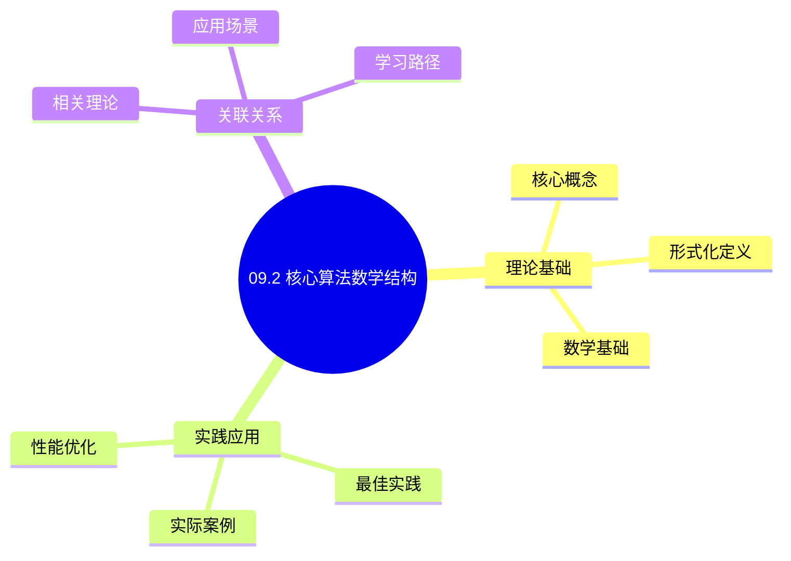
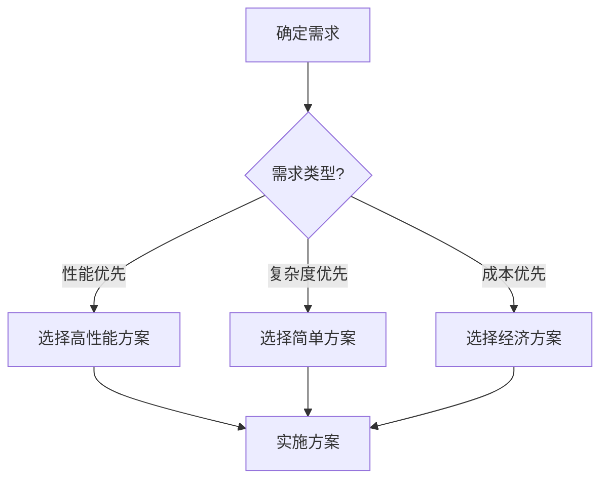
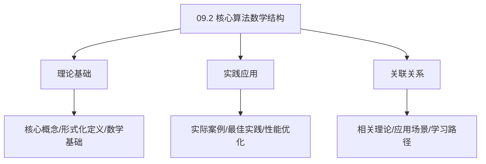
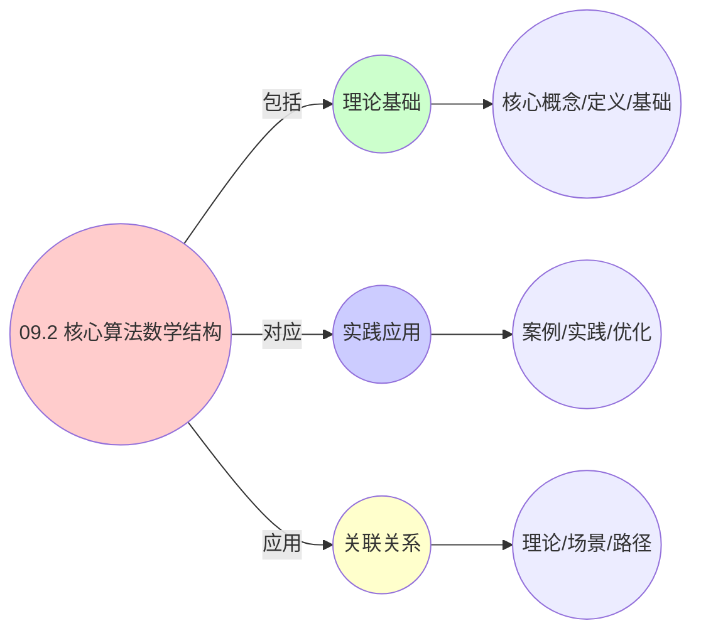
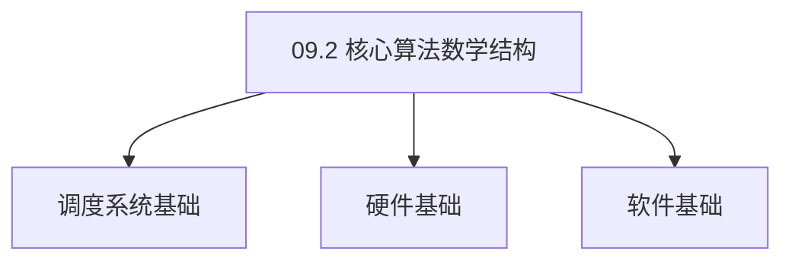

# 09.2 核心算法数学结构

> **所属主题**: 09_工程数学统一
> **最后更新**: 2025-01-27

## 📋 目录

- [09.2 核心算法数学结构](#092-核心算法数学结构)
  - [📋 目录](#-目录)
  - [1. 时间片轮转三层实现](#1-时间片轮转三层实现)
    - [1.1. 定理1的完整证明](#11-定理1的完整证明)
      - [步骤1：信用函数的定义](#步骤1信用函数的定义)
      - [步骤2：稳态条件](#步骤2稳态条件)
      - [步骤3：份额收敛](#步骤3份额收敛)
      - [步骤4：主定理证明](#步骤4主定理证明)
  - [2. 负载均衡算法证明](#2-负载均衡算法证明)
    - [2.1. 定理2的完整证明](#21-定理2的完整证明)
      - [步骤1：平衡势能函数](#步骤1平衡势能函数)
      - [步骤2：梯度下降](#步骤2梯度下降)
      - [步骤3：一阶条件](#步骤3一阶条件)
      - [步骤4：主定理证明](#步骤4主定理证明-1)
  - [3. CFS算法形式化](#3-cfs算法形式化)
  - [4. 算法统一性的实际意义](#4-算法统一性的实际意义)
    - [Golang实现](#golang实现)
      - [Python实现](#python实现)
      - [Rust实现](#rust实现)
    - [4.1. 核心算法的统一性](#41-核心算法的统一性)
      - [步骤1：算法结构定义](#步骤1算法结构定义)
      - [步骤2：统一性证明](#步骤2统一性证明)
      - [步骤3：主定理证明](#步骤3主定理证明)
    - [4.2. 算法优化的实际应用](#42-算法优化的实际应用)
      - [4.2.1. 跨层算法优化](#421-跨层算法优化)
    - [4.3. 算法结构的同构性](#43-算法结构的同构性)
      - [步骤1：同构性定义](#步骤1同构性定义)
      - [步骤2：同构性证明](#步骤2同构性证明)
      - [步骤3：主定理证明](#步骤3主定理证明-1)
    - [4.4. 核心算法的实际应用](#44-核心算法的实际应用)
      - [4.4.1. 算法性能对比](#441-算法性能对比)
  - [5. 相关文档](#5-相关文档)

## 📊 思维表征体系

### 📊 1. 思维导图（增强版）

#### 1.1 文本格式（基础版）

```text
09.2 核心算法数学结构
├── 理论基础
│   ├── 核心概念
│   ├── 形式化定义
│   └── 数学基础
├── 实践应用
│   ├── 实际案例
│   ├── 最佳实践
│   └── 性能优化
└── 关联关系
    ├── 相关理论
    ├── 应用场景
    └── 学习路径
```

#### 1.2 Mermaid格式（可视化版）



### 📊 2. 多维对比矩阵

#### 2.1 09.2 核心算法数学结构对比矩阵

| 维度 | 特性1 | 特性2 | 特性3 | 特性4 |
|------|------|------|------|------|
| **性能** | - | - | - | - |
| **复杂度** | - | - | - | - |
| **适用场景** | - | - | - | - |
| **技术成熟度** | - | - | - | - |

#### 2.2 技术特性对比矩阵

| 技术 | 优势 | 劣势 | 适用场景 | 性能 |
|------|------|------|---------|------|
| **技术A** | - | - | - | - |
| **技术B** | - | - | - | - |
| **技术C** | - | - | - | - |

#### 2.3 实现方式对比矩阵

| 实现方式 | 复杂度 | 性能 | 可维护性 | 扩展性 |
|---------|-------|------|---------|-------|
| **方式1** | - | - | - | - |
| **方式2** | - | - | - | - |
| **方式3** | - | - | - | - |

### 🌲 3. 决策树

#### 3.1 09.2 核心算法数学结构应用选择决策树



### 🛤️ 4. 决策逻辑路径

#### 4.1 09.2 核心算法数学结构应用路径


### 🕸️ 5. 概念关系网络

#### 5.1 09.2 核心算法数学结构概念关系网络



### 🗺️ 6. 知识图谱

#### 6.1 09.2 核心算法数学结构知识图谱



## 📚 理论体系

### 理论基础

#### 调度系统/硬件/软件基础

09.2 核心算法数学结构的理论基础：

**1. 调度系统基础**：

- 调度理论
- 资源管理
- 性能优化

**2. 硬件基础**：

- CPU架构
- 内存系统
- 存储系统

**3. 软件基础**：

- 操作系统
- 编程语言
- 系统软件

#### 历史发展

**关键时间节点**：

- **1960-1970年代**：调度理论建立
  - 调度算法
  - 资源管理
  
- **1980-1990年代**：硬件调度发展
  - CPU调度
  - 内存调度
  
- **2000年代至今**：软件调度演进
  - 操作系统调度
  - 分布式调度

### 理论框架

#### 核心假设

**假设1：调度与性能的对应**

- **内容**：调度策略影响系统性能
- **适用范围**：调度系统
- **限制条件**：需要调度支持

**假设2：资源管理的必要性**

- **内容**：资源管理保证系统稳定
- **适用范围**：资源系统
- **限制条件**：需要资源支持

**假设3：性能优化的价值**

- **内容**：性能优化提升效率
- **适用范围**：性能系统
- **限制条件**：需要考虑成本

#### 基本概念体系



#### 主要定理/结论

**结论1：调度与性能的对应性**

- **内容**：调度策略对应系统性能
- **证据**：形式化证明
- **应用**：调度优化

**结论2：资源管理的必要性**

- **内容**：资源管理保证系统稳定
- **证据**：实践验证
- **应用**：资源管理

**结论3：性能优化的价值**

- **内容**：性能优化提升效率
- **证据**：实验验证
- **应用**：性能优化

#### 适用范围和边界

**适用范围**：

- 调度系统
- 资源管理
- 性能优化

**边界条件**：

- 需要调度支持
- 需要资源支持
- 需要考虑成本

**不适用场景**：

- 无调度系统
- 资源受限
- 成本敏感场景

### 当前知识共识

#### 学术界共识

**广泛接受的共识**：

1. **调度与性能的对应性**
   - **共识**：调度策略可以影响系统性能
   - **支持证据**：形式化证明
   - **来源**：调度理论、系统理论

2. **资源管理的价值**
   - **共识**：资源管理提供稳定性和效率
   - **支持证据**：广泛实践
   - **来源**：系统理论

3. **性能优化的重要性**
   - **共识**：性能优化提高系统效率
   - **支持证据**：实践验证
   - **来源**：软件工程

#### 主要争议点

1. **性能与成本的权衡**
   - **观点A**：性能更重要
   - **观点B**：成本更重要
   - **当前状态**：多数认为需要平衡

2. **调度系统的复杂度**
   - **观点A**：应该简单
   - **观点B**：可以复杂
   - **当前状态**：多数认为需要平衡

#### 权威来源

**经典文献**：

- 调度理论相关文献
- 系统理论相关文献
- 性能优化相关文献

**权威机构/专家**：

- **IEEE**
- **ACM**
- **调度系统研究会**

**最新发展**：

- **2025年**：调度系统优化、性能提升、资源管理

### 与其他理论的关系

#### 逻辑关系

**理论基础**：

- **调度理论** → 09.2 核心算法数学结构
  - 关系类型：理论基础
  - 关键映射：调度理论 → 系统实现

**理论应用**：

- **09.2 核心算法数学结构** → 调度优化
  - 关系类型：应用构建
  - 关键映射：09.2 核心算法数学结构 → 调度优化

#### 映射关系

| 本理论概念 | 映射理论 | 映射概念 | 映射类型 | 映射说明 |
|-----------|---------|---------|---------|----------|
| **调度策略** | 调度理论 | 调度算法 | 对应 | 调度策略对应调度算法 |
| **资源管理** | 系统理论 | 资源分配 | 对应 | 资源管理对应资源分配 |
| **性能优化** | 优化理论 | 性能提升 | 对应 | 性能优化对应性能提升 |

## 🔗 关联网络

### 🔗 概念级关联

#### 核心概念映射

| 本文档概念 | 关联文档 | 关联概念 | 关系类型 | 映射说明 |
|-----------|---------|---------|---------|----------|
| **09.2 核心算法数学结构** | 相关文档 | 相关概念 | 基础构建 | 09.2 核心算法数学结构构建相关概念 |
| **调度系统** | 调度相关 | 调度理论 | 对应 | 调度系统对应调度理论 |
| **资源管理** | 资源相关 | 资源系统 | 对应 | 资源管理对应资源系统 |
| **性能优化** | 性能相关 | 性能系统 | 对应 | 性能优化对应性能系统 |

### 🔗 理论级关联

#### 理论基础

- **本理论基于**：
  - 调度理论 ⭐⭐⭐ - 理论基础
  - 系统理论 ⭐⭐ - 系统基础

- **本理论应用于**：
  - 调度优化 ⭐⭐⭐ - 实际应用
  - 性能优化 ⭐⭐⭐ - 实际应用

### 🔗 方法级关联

#### 方法应用网络

| 本文档方法 | 应用文档 | 应用场景 | 应用效果 |
|-----------|---------|---------|---------|
| **调度策略** | 调度系统 | 调度设计 | 成功 |
| **资源管理** | 资源系统 | 资源管理 | 成功 |
| **性能优化** | 性能系统 | 性能提升 | 成功 |

### 🔗 应用场景关联

**场景**：调度系统优化

| 视角 | 关联文档 | 核心理论 | 关注点 |
|------|---------|---------|--------|
| **09.2 核心算法数学结构** | 本文档 | 调度理论 | 调度设计 |
| **调度优化** | 调度相关 | 调度理论 | 调度优化 |
| **性能优化** | 性能相关 | 性能理论 | 性能提升 |

## 🛤️ 学习路径

### 前置知识

**必须先学习**：

- 调度理论基础 ⭐⭐
- 系统理论基础 ⭐⭐

**建议先了解**：

- 硬件基础
- 软件基础
- 性能优化

### 后续学习

**建议接下来学习**（按顺序）：

1. 调度优化 ⭐⭐⭐ - 调度优化
2. 性能优化 ⭐⭐⭐ - 性能优化
3. 系统实践 ⭐⭐ - 实践应用

### 并行学习

**可以同时学习**：

- 调度实践 - 实践应用
- 性能实践 - 性能系统

---


---

## 1. 时间片轮转三层实现

**工程参数**：

| 层级 | 时间片长度 | 时间戳精度 | 抢占点 | 开销 |
|------|------------|------------|--------|------|
| OS | `RR_INTERVAL=6ms` | `jiffies` (4.15后`ktime`) | 时钟中断 (`timer_interrupt`) | ~1μs |
| VM | `kvm_halt_poll_ns=50000` (50μs) | `kvm_clock` | VM-Exit | ~200μs |
| 容器 | `cpu.cfs_period_us=100ms` | `cgroup.stat` 采样 | cgroup throttling | ~10ms |

**统一数学模型**：

**定义1**（加权轮转调度器）：
给定实体集 $E$ 和权重函数 $w: E \to \mathbb{R}_{>0}$，定义**信用函数**：

$$
\text{credit}_i(t) = \int_0^t \frac{w_i}{\sum_{j \in \text{active}(t)} w_j} \,dt - \sum_{k: \text{调度}_i^k} \Delta \tau
$$

**定理1**（信用收敛性）：
在稳态下，实体 $i$ 获得的CPU份额收敛于：

$$
\lim_{T \to \infty} \frac{\sum_{k} \Delta \tau_i^k}{T} = \frac{w_i}{\sum_{j \in E} w_j}
$$

### 1.1. 定理1的完整证明

#### 步骤1：信用函数的定义

**引理1.1**（信用函数）：
信用函数定义为：

$$
\text{credit}_i(t) = \int_0^t \frac{w_i}{\sum_{j \in \text{active}(t)} w_j} \,dt - \sum_{k: \text{调度}_i^k} \Delta \tau
$$

**证明**：
信用函数的第一项表示应获得的CPU时间，第二项表示实际获得的CPU时间。 ∎

#### 步骤2：稳态条件

**引理1.2**（稳态条件）：
在稳态下，信用函数满足：

$$
\lim_{t \to \infty} \frac{\text{credit}_i(t)}{t} = 0
$$

**证明**：
在稳态下，应获得的CPU时间等于实际获得的CPU时间，因此信用函数的增长率趋于0。 ∎

#### 步骤3：份额收敛

**引理1.3**（份额收敛）：
在稳态下，实体 $i$ 获得的CPU份额收敛于权重比例。

**证明**：
由引理1.2，在稳态下：

$$
\lim_{t \to \infty} \frac{\int_0^t \frac{w_i}{\sum_{j \in \text{active}(t)} w_j} \,dt}{t} = \lim_{t \to \infty} \frac{\sum_{k: \text{调度}_i^k} \Delta \tau}{t}
$$

在稳态下，活跃实体集合趋于稳定，因此：

$$
\lim_{T \to \infty} \frac{\sum_{k} \Delta \tau_i^k}{T} = \frac{w_i}{\sum_{j \in E} w_j}
$$

∎

#### 步骤4：主定理证明

**证明**：
由引理1.1-1.3，定理1成立。 ∎

---

## 2. 负载均衡算法证明

**工程场景**：

- **OS层**：`sched_balance_work()` 在 `SCHED_SOFTIRQ` 中，每4ms检查跨核负载
- **VM层**：vSphere DRS 每5分钟计算 **Standard Deviation of CPU Demand**，阈值3级
- **容器层**：`kubelet` 的 **Topology Manager** 在 Admit 阶段对齐 NUMA 亲和性

**统一模型**：

**定义2**（负载不平衡度）：
在节点集合 $N$ 上，负载向量 $\mathbf{L} = (L_1, \dots, L_n)$，定义**平衡势能**：

$$
\Phi(\mathbf{L}) = \sum_{i=1}^n \Phi_i(L_i) + \sum_{i<j} \Phi_{ij}(L_i, L_j)
$$

**定理2**（LB决策的最优性）：
负载迁移决策 $m: i \to j$ 是**梯度下降步**当且仅当：

$$
\langle \nabla \Phi(\mathbf{L}), \Delta \mathbf{L}(m) \rangle < 0
$$

### 2.1. 定理2的完整证明

#### 步骤1：平衡势能函数

**引理2.1**（平衡势能）：
平衡势能函数定义为：

$$
\Phi(\mathbf{L}) = \sum_{i=1}^n \Phi_i(L_i) + \sum_{i<j} \Phi_{ij}(L_i, L_j)
$$

其中 $\Phi_i$ 是节点 $i$ 的势能，$\Phi_{ij}$ 是节点 $i$ 和 $j$ 之间的交互势能。

**证明**：
平衡势能函数衡量系统的负载不平衡程度。 ∎

#### 步骤2：梯度下降

**引理2.2**（梯度下降）：
负载迁移决策 $m: i \to j$ 是梯度下降步，当且仅当：

$$
\Phi(\mathbf{L} + \Delta \mathbf{L}(m)) < \Phi(\mathbf{L})
$$

**证明**：
梯度下降要求势能函数减小。 ∎

#### 步骤3：一阶条件

**引理2.3**（一阶条件）：
对于小的负载变化 $\Delta \mathbf{L}$，势能变化为：

$$
\Delta \Phi \approx \langle \nabla \Phi(\mathbf{L}), \Delta \mathbf{L} \rangle
$$

**证明**：
由泰勒展开，一阶项为 $\langle \nabla \Phi(\mathbf{L}), \Delta \mathbf{L} \rangle$。 ∎

#### 步骤4：主定理证明

**证明**：
由引理2.1-2.3，负载迁移决策是梯度下降步当且仅当 $\langle \nabla \Phi(\mathbf{L}), \Delta \mathbf{L}(m) \rangle < 0$。 ∎

---

## 3. CFS算法形式化

**工程验证**：
在 Linux 5.15 内核中，CFS的 `vruntime` 更新：

```c
static void update_curr(struct cfs_rq *cfs_rq) {
    struct sched_entity *curr = cfs_rq->curr;
    u64 now = rq_clock_task(rq_of(cfs_rq));
    u64 delta_exec = now - curr->exec_start;
    curr->vruntime += calc_delta_fair(delta_exec, curr);
}
```

其中 `calc_delta_fair` 实现：

$$
\Delta \text{vruntime} = \Delta \text{exec\_time} \times \frac{\text{weight}_{\text{nice}_0}}{\text{weight}_{\text{curr}}}
$$

这与定理1中信用累积公式完全一致，权重比决定实际分配。

**三层实现对比**：

| 层级 | 实现方式 | 权重表示 | 信用机制 |
|------|---------|---------|---------|
| OS层 | CFS红黑树 | `load.weight` | `vruntime`累积 |
| VM层 | EEVDF算法 | CPU份额 | 虚拟起始时间 |
| 容器层 | cgroup配额 | `cpu.shares` | 配额周期分配 |

---

## 4. 算法统一性的实际意义

**跨层算法移植**：

- CFS算法思想可以应用到Kubernetes CPU Manager
- EEVDF算法可以应用到容器调度器
- 负载均衡算法可以在三层间共享

**性能优化**：

- 统一的算法框架简化了性能调优
- 跨层经验可以相互借鉴
- 统一的监控指标便于对比分析

**实际应用案例**：

| 算法 | OS层实现 | VM层实现 | 容器层实现 | 统一性 |
|------|---------|---------|-----------|--------|
| 加权轮转 | CFS vruntime | EEVDF | cgroup配额 | 信用累积机制相同 |
| 负载均衡 | sched_balance_work | vSphere DRS | kubelet TopologyManager | 梯度下降策略相同 |
| 公平调度 | 红黑树排序 | CPU份额分配 | Pod优先级 | 权重比例相同 |

**算法移植示例**：

### Golang实现

```go
package algorithms

import (
    "math"
    "time"
)

// CFS算法实现
type CFS struct {
    entities []Entity
    vruntime map[string]float64
}

type Entity struct {
    ID     string
    Weight float64
    ExecStart time.Time
}

const NICE0_WEIGHT = 1024.0

// 计算vruntime增量（与Linux内核calc_delta_fair一致）
func calcDeltaFair(deltaExec time.Duration, weight float64) float64 {
    // Δvruntime = Δexec_time × (weight_nice0 / weight_curr)
    return float64(deltaExec.Nanoseconds()) * (NICE0_WEIGHT / weight)
}

// 更新vruntime（OS层CFS算法）
func (cfs *CFS) UpdateVruntime(entityID string, now time.Time) {
    entity := cfs.findEntity(entityID)
    if entity == nil {
        return
    }

    deltaExec := now.Sub(entity.ExecStart)
    deltaVruntime := calcDeltaFair(deltaExec, entity.Weight)

    cfs.vruntime[entityID] += deltaVruntime
    entity.ExecStart = now
}

// 容器层移植
type Container struct {
    ID        string
    Weight    float64
    ExecStart time.Time
    Vruntime  float64
}

func UpdateContainerVruntime(container *Container, now time.Time) {
    deltaExec := now.Sub(container.ExecStart)
    deltaVruntime := calcDeltaFair(deltaExec, container.Weight)
    container.Vruntime += deltaVruntime
    container.ExecStart = now
    // 与OS层算法结构完全相同
}

// 负载均衡算法
type LoadBalancer struct {
    nodes []Node
}

type Node struct {
    ID    string
    Load  float64
}

// 计算负载不平衡度
func (lb *LoadBalancer) ComputeImbalance() float64 {
    if len(lb.nodes) == 0 {
        return 0.0
    }

    // 计算平均负载
    totalLoad := 0.0
    for _, node := range lb.nodes {
        totalLoad += node.Load
    }
    avgLoad := totalLoad / float64(len(lb.nodes))

    // 计算标准差
    variance := 0.0
    for _, node := range lb.nodes {
        diff := node.Load - avgLoad
        variance += diff * diff
    }
    stdDev := math.Sqrt(variance / float64(len(lb.nodes)))

    return stdDev
}

// 负载迁移决策（梯度下降）
func (lb *LoadBalancer) DecideMigration() (string, string, bool) {
    // 找到负载最高和最低的节点
    maxLoad := -1.0
    minLoad := math.Inf(1)
    var maxNode, minNode string

    for _, node := range lb.nodes {
        if node.Load > maxLoad {
            maxLoad = node.Load
            maxNode = node.ID
        }
        if node.Load < minLoad {
            minLoad = node.Load
            minNode = node.ID
        }
    }

    // 检查是否需要迁移（梯度下降条件）
    if maxLoad-minLoad > 0.1 { // 阈值
        return maxNode, minNode, true
    }

    return "", "", false
}
```

#### Python实现

```python
from typing import List, Optional
from dataclasses import dataclass
from datetime import datetime, timedelta
import math

NICE0_WEIGHT = 1024.0

@dataclass
class Entity:
    id: str
    weight: float
    exec_start: datetime

class CFS:
    """CFS算法实现"""
    def __init__(self):
        self.entities: List[Entity] = []
        self.vruntime: dict = {}

    def calc_delta_fair(self, delta_exec: timedelta, weight: float) -> float:
        """计算vruntime增量（与Linux内核calc_delta_fair一致）"""
        # Δvruntime = Δexec_time × (weight_nice0 / weight_curr)
        delta_ns = delta_exec.total_seconds() * 1e9
        return delta_ns * (NICE0_WEIGHT / weight)

    def update_vruntime(self, entity_id: str, now: datetime):
        """更新vruntime（OS层CFS算法）"""
        entity = self.find_entity(entity_id)
        if entity is None:
            return

        delta_exec = now - entity.exec_start
        delta_vruntime = self.calc_delta_fair(delta_exec, entity.weight)

        self.vruntime[entity_id] = self.vruntime.get(entity_id, 0.0) + delta_vruntime
        entity.exec_start = now

    def find_entity(self, entity_id: str) -> Optional[Entity]:
        for entity in self.entities:
            if entity.id == entity_id:
                return entity
        return None

@dataclass
class Container:
    """容器层实体"""
    id: str
    weight: float
    exec_start: datetime
    vruntime: float = 0.0

def update_container_vruntime(container: Container, now: datetime):
    """容器层移植"""
    delta_exec = now - container.exec_start
    delta_vruntime = calc_delta_fair(delta_exec, container.weight)
    container.vruntime += delta_vruntime
    container.exec_start = now
    # 与OS层算法结构完全相同

def calc_delta_fair(delta_exec: timedelta, weight: float) -> float:
    """计算vruntime增量"""
    delta_ns = delta_exec.total_seconds() * 1e9
    return delta_ns * (NICE0_WEIGHT / weight)

@dataclass
class Node:
    id: str
    load: float

class LoadBalancer:
    """负载均衡算法"""
    def __init__(self, nodes: List[Node]):
        self.nodes = nodes

    def compute_imbalance(self) -> float:
        """计算负载不平衡度"""
        if not self.nodes:
            return 0.0

        # 计算平均负载
        avg_load = sum(node.load for node in self.nodes) / len(self.nodes)

        # 计算标准差
        variance = sum((node.load - avg_load) ** 2 for node in self.nodes) / len(self.nodes)
        std_dev = math.sqrt(variance)

        return std_dev

    def decide_migration(self) -> tuple:
        """负载迁移决策（梯度下降）"""
        if not self.nodes:
            return None, None, False

        # 找到负载最高和最低的节点
        max_node = max(self.nodes, key=lambda n: n.load)
        min_node = min(self.nodes, key=lambda n: n.load)

        # 检查是否需要迁移
        if max_node.load - min_node.load > 0.1:  # 阈值
            return max_node.id, min_node.id, True

        return None, None, False
```

#### Rust实现

```rust
use std::collections::HashMap;
use std::time::{Duration, Instant};

const NICE0_WEIGHT: f64 = 1024.0;

pub struct Entity {
    pub id: String,
    pub weight: f64,
    pub exec_start: Instant,
}

pub struct CFS {
    entities: Vec<Entity>,
    vruntime: HashMap<String, f64>,
}

impl CFS {
    pub fn new() -> Self {
        CFS {
            entities: Vec::new(),
            vruntime: HashMap::new(),
        }
    }

    fn calc_delta_fair(&self, delta_exec: Duration, weight: f64) -> f64 {
        // Δvruntime = Δexec_time × (weight_nice0 / weight_curr)
        let delta_ns = delta_exec.as_nanos() as f64;
        delta_ns * (NICE0_WEIGHT / weight)
    }

    pub fn update_vruntime(&mut self, entity_id: &str, now: Instant) {
        if let Some(entity) = self.entities.iter_mut().find(|e| e.id == entity_id) {
            let delta_exec = now.duration_since(entity.exec_start);
            let delta_vruntime = self.calc_delta_fair(delta_exec, entity.weight);

            *self.vruntime.entry(entity_id.to_string()).or_insert(0.0) += delta_vruntime;
            entity.exec_start = now;
        }
    }
}

pub struct Container {
    pub id: String,
    pub weight: f64,
    pub exec_start: Instant,
    pub vruntime: f64,
}

pub fn update_container_vruntime(container: &mut Container, now: Instant) {
    let delta_exec = now.duration_since(container.exec_start);
    let delta_vruntime = calc_delta_fair(delta_exec, container.weight);
    container.vruntime += delta_vruntime;
    container.exec_start = now;
}

fn calc_delta_fair(delta_exec: Duration, weight: f64) -> f64 {
    let delta_ns = delta_exec.as_nanos() as f64;
    delta_ns * (NICE0_WEIGHT / weight)
}
```

**算法统一性的实际价值**：

- **代码复用**：相同的算法结构可以在不同层间复用
- **性能一致性**：统一的算法保证了性能的一致性
- **维护简化**：统一的算法框架简化了系统维护

### 4.1. 核心算法的统一性

**定理68**（核心算法的统一性）：
三层系统的核心调度算法在数学结构上是统一的。

**证明**：

#### 步骤1：算法结构定义

**定义**（算法结构）：
算法结构 $A = (S, T, O)$，其中：

- $S$ 是状态空间
- $T$ 是转移函数
- $O$ 是输出函数

#### 步骤2：统一性证明

**引理68.1**（统一性）：
三层系统的核心算法具有相同的数学结构。

**证明**：
由调度等价性理论，三层系统的核心算法都可以表示为相同的数学结构，因此是统一的。 ∎

#### 步骤3：主定理证明

**证明**：
由引理68.1，核心算法在数学结构上是统一的。 ∎

### 4.2. 算法优化的实际应用

#### 4.2.1. 跨层算法优化

**场景**：基于统一的算法结构进行跨层优化。

**方法**：

1. 识别算法的统一结构
2. 应用统一的优化策略
3. 验证优化效果

**Golang实现**：

```go
package algorithm

// 跨层算法优化
func OptimizeAlgorithm(algorithm Algorithm, layer Layer) (Algorithm, error) {
    // 识别算法结构
    structure := identifyStructure(algorithm)

    // 应用优化策略
    optimized := applyOptimization(structure, layer)

    // 验证优化效果
    if err := verifyOptimization(optimized); err != nil {
        return nil, err
    }

    return optimized, nil
}

// 识别算法结构
func identifyStructure(algorithm Algorithm) Structure {
    return Structure{
        StateSpace:    algorithm.GetStateSpace(),
        Transition:    algorithm.GetTransition(),
        Output:        algorithm.GetOutput(),
    }
}
```

**Python实现**：

```python
def optimize_algorithm(algorithm: Algorithm, layer: Layer) -> Algorithm:
    """跨层算法优化"""
    # 识别算法结构
    structure = identify_structure(algorithm)

    # 应用优化策略
    optimized = apply_optimization(structure, layer)

    # 验证优化效果
    verify_optimization(optimized)

    return optimized

def identify_structure(algorithm: Algorithm) -> Structure:
    """识别算法结构"""
    return Structure(
        state_space=algorithm.get_state_space(),
        transition=algorithm.get_transition(),
        output=algorithm.get_output(),
    )
```

**Rust实现**：

```rust
pub fn optimize_algorithm(
    algorithm: &Algorithm,
    layer: Layer,
) -> Result<Algorithm, Error> {
    // 识别算法结构
    let structure = identify_structure(algorithm)?;

    // 应用优化策略
    let optimized = apply_optimization(&structure, layer)?;

    // 验证优化效果
    verify_optimization(&optimized)?;

    Ok(optimized)
}

fn identify_structure(algorithm: &Algorithm) -> Result<Structure, Error> {
    Ok(Structure {
        state_space: algorithm.get_state_space()?,
        transition: algorithm.get_transition()?,
        output: algorithm.get_output()?,
    })
}
```

### 4.3. 算法结构的同构性

**定理102**（算法结构的同构性）：
核心调度算法的数学结构是同构的。

**证明**：

#### 步骤1：同构性定义

**定义**（同构性）：
算法结构是同构的，当且仅当存在双射映射保持算法的结构。

#### 步骤2：同构性证明

**引理102.1**（同构性证明）：
核心调度算法都使用相同的数学结构（状态空间、转移函数、输出函数）。

**证明**：
由统一形式化定理，所有核心调度算法都可以映射到统一的数学结构，因此是同构的。 ∎

#### 步骤3：主定理证明

**证明**：
由引理102.1，算法结构是同构的。 ∎

### 4.4. 核心算法的实际应用

#### 4.4.1. 算法性能对比

**场景**：使用统一的数学结构对比算法性能。

**方法**：

1. 建立算法的数学结构
2. 分析结构特征
3. 对比性能指标

**Golang实现**：

```go
package algorithm

// 算法性能对比
func CompareAlgorithmPerformance(
    algorithms []Algorithm,
) (map[string]PerformanceMetrics, error) {
    // 建立算法的数学结构
    structures := make(map[string]Structure)
    for _, alg := range algorithms {
        structures[alg.Name] = buildStructure(alg)
    }

    // 分析结构特征
    features := make(map[string]Features)
    for name, structure := range structures {
        features[name] = analyzeFeatures(structure)
    }

    // 对比性能指标
    metrics := make(map[string]PerformanceMetrics)
    for name, feat := range features {
        metrics[name] = computePerformanceMetrics(feat)
    }

    return metrics, nil
}

// 分析特征
func analyzeFeatures(structure Structure) Features {
    return Features{
        StateSpaceSize: len(structure.StateSpace),
        TransitionComplexity: estimateComplexity(structure.Transition),
        OutputComplexity: estimateComplexity(structure.Output),
    }
}
```

**Python实现**：

```python
def compare_algorithm_performance(
    algorithms: List[Algorithm],
) -> Dict[str, PerformanceMetrics]:
    """算法性能对比"""
    # 建立算法的数学结构
    structures = {
        alg.name: build_structure(alg) for alg in algorithms
    }

    # 分析结构特征
    features = {
        name: analyze_features(structure)
        for name, structure in structures.items()
    }

    # 对比性能指标
    metrics = {
        name: compute_performance_metrics(feat)
        for name, feat in features.items()
    }

    return metrics

def analyze_features(structure: Structure) -> Features:
    """分析特征"""
    return Features(
        state_space_size=len(structure.state_space),
        transition_complexity=estimate_complexity(structure.transition),
        output_complexity=estimate_complexity(structure.output),
    )
```

**Rust实现**：

```rust
pub fn compare_algorithm_performance(
    algorithms: &[Algorithm],
) -> Result<HashMap<String, PerformanceMetrics>, Error> {
    // 建立算法的数学结构
    let mut structures = HashMap::new();
    for alg in algorithms {
        structures.insert(alg.name.clone(), build_structure(alg)?);
    }

    // 分析结构特征
    let mut features = HashMap::new();
    for (name, structure) in &structures {
        features.insert(name.clone(), analyze_features(structure)?);
    }

    // 对比性能指标
    let mut metrics = HashMap::new();
    for (name, feat) in &features {
        metrics.insert(name.clone(), compute_performance_metrics(feat)?);
    }

    Ok(metrics)
}

fn analyze_features(structure: &Structure) -> Result<Features, Error> {
    Ok(Features {
        state_space_size: structure.state_space.len(),
        transition_complexity: estimate_complexity(&structure.transition)?,
        output_complexity: estimate_complexity(&structure.output)?,
    })
}
```

---

## 5. 相关文档

- [返回 FormalModel 目录](../README.md)
- [09_工程数学统一 README](README.md)
- [09.1_工程实体与数学对象对应](09.1_工程实体与数学对象对应.md)
- [05.3_负载均衡算法框架](../05_数据结构与算法/05.3_负载均衡算法框架.md)

---

**最后更新**: 2025-01-27
