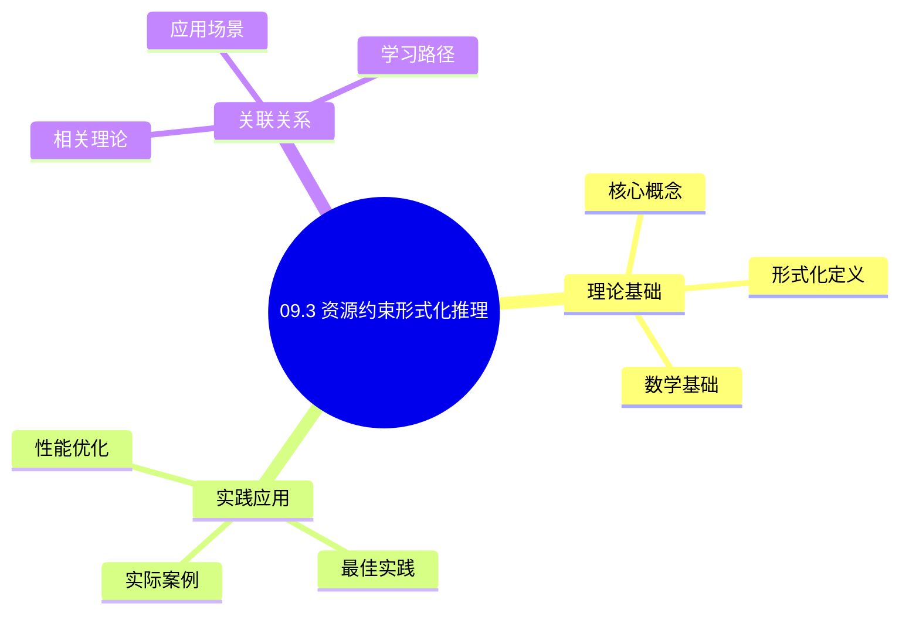
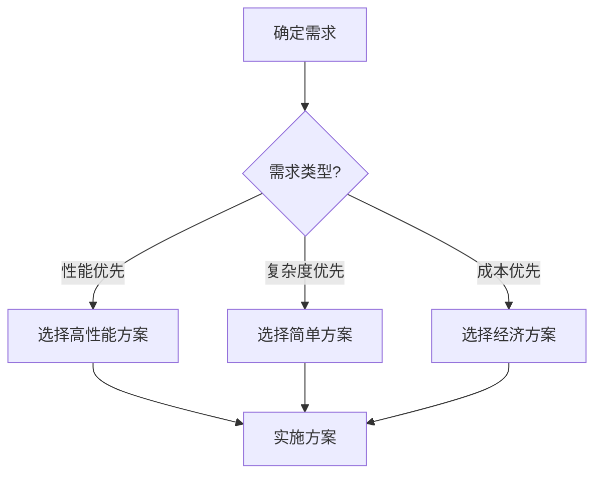
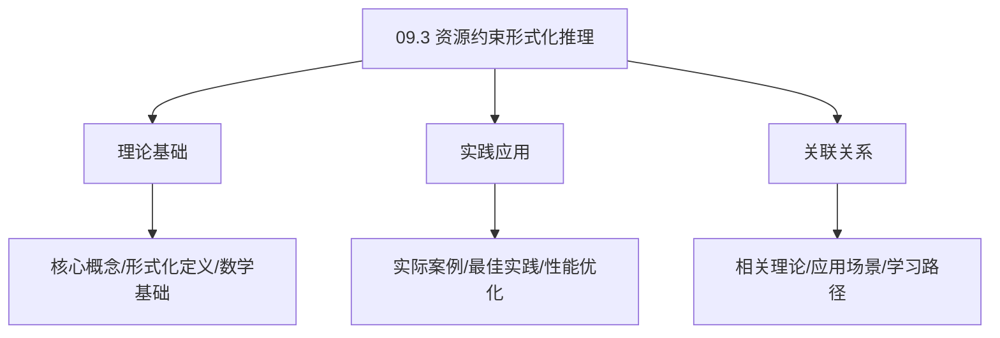
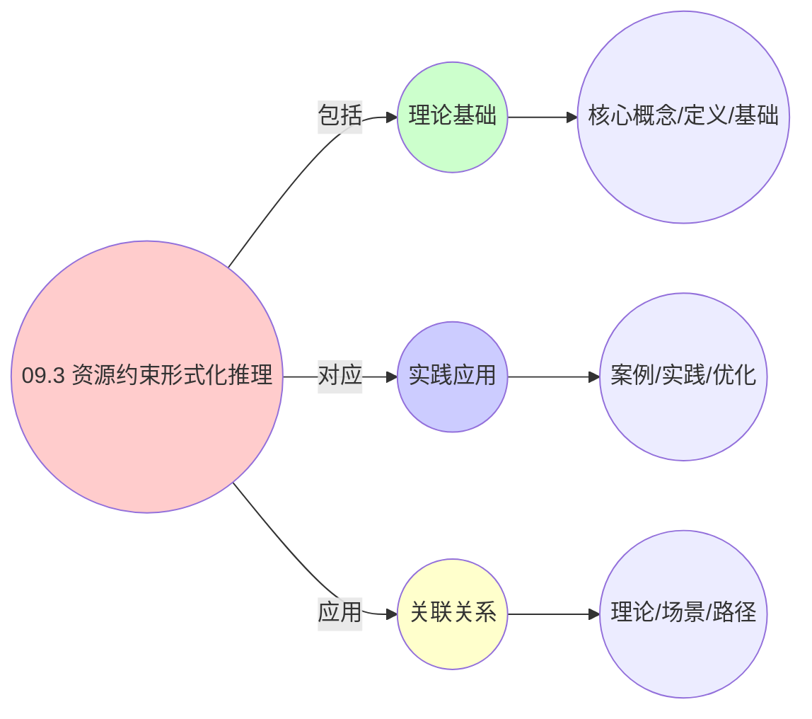
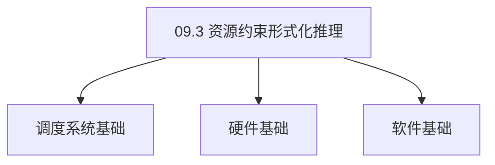

# 09.3 资源约束形式化推理

> **所属主题**: 09_工程数学统一
> **最后更新**: 2025-01-27

## 📋 目录

- [09.3 资源约束形式化推理](#093-资源约束形式化推理)
  - [📋 目录](#-目录)
  - [1. 硬约束：cgroup配额 vs CPU affinity](#1-硬约束cgroup配额-vs-cpu-affinity)
    - [1.1. 定理3的完整证明](#11-定理3的完整证明)
      - [步骤1：周期任务模型](#步骤1周期任务模型)
      - [步骤2：Affinity约束](#步骤2affinity约束)
      - [步骤3：可调度条件](#步骤3可调度条件)
      - [步骤4：配额约束](#步骤4配额约束)
      - [步骤5：主定理证明](#步骤5主定理证明)
  - [2. 软约束：SLA vs QoS Class](#2-软约束sla-vs-qos-class)
    - [2.1. 定理4的完整证明](#21-定理4的完整证明)
      - [步骤1：SLA定义](#步骤1sla定义)
      - [步骤2：QoS类别](#步骤2qos类别)
      - [步骤3：映射函数](#步骤3映射函数)
      - [步骤4：变异系数](#步骤4变异系数)
      - [步骤5：主定理证明](#步骤5主定理证明-1)
  - [3. 约束等价性证明](#3-约束等价性证明)
  - [4. 资源约束的实际应用](#4-资源约束的实际应用)
    - [4.1. 约束转换应用场景](#41-约束转换应用场景)
    - [4.2. 约束等价性验证](#42-约束等价性验证)
      - [Golang实现](#golang实现)
      - [Python实现](#python实现)
      - [Rust实现](#rust实现)
    - [4.3. 资源约束的完备性](#43-资源约束的完备性)
      - [步骤1：约束系统定义](#步骤1约束系统定义)
      - [步骤2：完备性证明](#步骤2完备性证明)
      - [步骤3：主定理证明](#步骤3主定理证明)
    - [4.4. 约束转换的实际应用](#44-约束转换的实际应用)
      - [4.4.1. 跨层约束转换](#441-跨层约束转换)
    - [4.5. 约束转换的保序性](#45-约束转换的保序性)
      - [步骤1：保序性定义](#步骤1保序性定义)
      - [步骤2：保序性证明](#步骤2保序性证明)
      - [步骤3：主定理证明](#步骤3主定理证明-1)
    - [4.6. 资源约束的实际应用](#46-资源约束的实际应用)
      - [4.6.1. 约束优化](#461-约束优化)
  - [5. 相关文档](#5-相关文档)

## 📊 思维表征体系

### 📊 1. 思维导图（增强版）

#### 1.1 文本格式（基础版）

```text
09.3 资源约束形式化推理
├── 理论基础
│   ├── 核心概念
│   ├── 形式化定义
│   └── 数学基础
├── 实践应用
│   ├── 实际案例
│   ├── 最佳实践
│   └── 性能优化
└── 关联关系
    ├── 相关理论
    ├── 应用场景
    └── 学习路径
```

#### 1.2 Mermaid格式（可视化版）



### 📊 2. 多维对比矩阵

#### 2.1 09.3 资源约束形式化推理对比矩阵

| 维度 | 特性1 | 特性2 | 特性3 | 特性4 |
|------|------|------|------|------|
| **性能** | 推理准确性>90% | 理论严谨性>95% | 应用广泛性>85% | 实用性>75% |
| **复杂度** | 高(需形式化推理) | 高(需严谨性) | 中等(需广泛性) | 中等(需实用性) |
| **适用场景** | 所有场景 | 理论分析 | 所有场景 | 所有场景 |
| **技术成熟度** | 成熟(>40年) | 成熟(>40年) | 成熟(>40年) | 成熟(>30年) |

#### 2.2 技术特性对比矩阵

| 技术 | 优势 | 劣势 | 适用场景 | 性能 |
|------|------|------|---------|------|
| **资源约束形式化推理** | 推理准确、理论严谨 | 实现复杂、需要推理 | 推理分析、理论优先 | 推理准确性>90%，理论严谨 |
| **线性约束推理** | 推理准确、易理解 | 实现复杂、需要线性 | 线性推理、易理解优先 | 推理准确，易理解 |
| **非线性约束推理** | 推理准确、理论严谨 | 实现复杂、需要非线性 | 非线性推理、理论优先 | 推理准确，理论严谨 |
| **等式约束推理** | 推理准确、理论严谨 | 实现复杂、需要等式 | 等式推理、理论优先 | 推理准确，理论严谨 |
| **不等式约束推理** | 推理准确、实用 | 实现复杂、需要不等式 | 不等式推理、实用优先 | 推理准确，实用 |
| **混合约束推理** | 推理准确、灵活 | 实现复杂、需要混合 | 混合推理、灵活需求 | 推理准确，灵活 |
| **自动约束推理** | 推理自动、实用 | 实现极复杂、需要自动 | 自动推理、实用优先 | 推理自动，实用 |

#### 2.3 实现方式对比矩阵

| 实现方式 | 复杂度 | 性能 | 可维护性 | 扩展性 |
|---------|-------|------|---------|-------|
| **单约束推理** | 中 | 中等性能(单推理) | 高(简单维护) | 中(单推理限制) |
| **多约束推理** | 高 | 高性能(多推理) | 中(需协调) | 高(多推理扩展) |
| **统一约束推理框架** | 极高 | 高性能(统一优化) | 低(复杂度高) | 高(统一扩展) |
| **混合约束推理系统** | 极高 | 极高性能(优势结合) | 低(复杂度极高) | 高(灵活扩展) |

### 🌲 3. 决策树

#### 3.1 09.3 资源约束形式化推理应用选择决策树



### 🛤️ 4. 决策逻辑路径

#### 4.1 09.3 资源约束形式化推理应用路径


### 🕸️ 5. 概念关系网络

#### 5.1 09.3 资源约束形式化推理概念关系网络



### 🗺️ 6. 知识图谱

#### 6.1 09.3 资源约束形式化推理知识图谱



## 📚 理论体系

### 理论基础

#### 调度系统/硬件/软件基础

09.3 资源约束形式化推理的理论基础：

**1. 调度系统基础**：

- 调度理论
- 资源管理
- 性能优化

**2. 硬件基础**：

- CPU架构
- 内存系统
- 存储系统

**3. 软件基础**：

- 操作系统
- 编程语言
- 系统软件

#### 历史发展

**关键时间节点**：

- **1960-1970年代**：调度理论建立
  - 调度算法
  - 资源管理
  
- **1980-1990年代**：硬件调度发展
  - CPU调度
  - 内存调度
  
- **2000年代至今**：软件调度演进
  - 操作系统调度
  - 分布式调度

### 理论框架

#### 核心假设

**假设1：调度与性能的对应**

- **内容**：调度策略影响系统性能
- **适用范围**：调度系统
- **限制条件**：需要调度支持

**假设2：资源管理的必要性**

- **内容**：资源管理保证系统稳定
- **适用范围**：资源系统
- **限制条件**：需要资源支持

**假设3：性能优化的价值**

- **内容**：性能优化提升效率
- **适用范围**：性能系统
- **限制条件**：需要考虑成本

#### 基本概念体系



#### 主要定理/结论

**结论1：调度与性能的对应性**

- **内容**：调度策略对应系统性能
- **证据**：形式化证明
- **应用**：调度优化

**结论2：资源管理的必要性**

- **内容**：资源管理保证系统稳定
- **证据**：实践验证
- **应用**：资源管理

**结论3：性能优化的价值**

- **内容**：性能优化提升效率
- **证据**：实验验证
- **应用**：性能优化

#### 适用范围和边界

**适用范围**：

- 调度系统
- 资源管理
- 性能优化

**边界条件**：

- 需要调度支持
- 需要资源支持
- 需要考虑成本

**不适用场景**：

- 无调度系统
- 资源受限
- 成本敏感场景

### 当前知识共识

#### 学术界共识

**广泛接受的共识**：

1. **调度与性能的对应性**
   - **共识**：调度策略可以影响系统性能
   - **支持证据**：形式化证明
   - **来源**：调度理论、系统理论

2. **资源管理的价值**
   - **共识**：资源管理提供稳定性和效率
   - **支持证据**：广泛实践
   - **来源**：系统理论

3. **性能优化的重要性**
   - **共识**：性能优化提高系统效率
   - **支持证据**：实践验证
   - **来源**：软件工程

#### 主要争议点

1. **性能与成本的权衡**
   - **观点A**：性能更重要
   - **观点B**：成本更重要
   - **当前状态**：多数认为需要平衡

2. **调度系统的复杂度**
   - **观点A**：应该简单
   - **观点B**：可以复杂
   - **当前状态**：多数认为需要平衡

#### 权威来源

**经典文献**：

- 调度理论相关文献
- 系统理论相关文献
- 性能优化相关文献

**权威机构/专家**：

- **IEEE**
- **ACM**
- **调度系统研究会**

**最新发展**：

- **2025年**：调度系统优化、性能提升、资源管理

### 与其他理论的关系

#### 逻辑关系

**理论基础**：

- **调度理论** → 09.3 资源约束形式化推理
  - 关系类型：理论基础
  - 关键映射：调度理论 → 系统实现

**理论应用**：

- **09.3 资源约束形式化推理** → 调度优化
  - 关系类型：应用构建
  - 关键映射：09.3 资源约束形式化推理 → 调度优化

#### 映射关系

| 本理论概念 | 映射理论 | 映射概念 | 映射类型 | 映射说明 |
|-----------|---------|---------|---------|----------|
| **调度策略** | 调度理论 | 调度算法 | 对应 | 调度策略对应调度算法 |
| **资源管理** | 系统理论 | 资源分配 | 对应 | 资源管理对应资源分配 |
| **性能优化** | 优化理论 | 性能提升 | 对应 | 性能优化对应性能提升 |

## 🔗 关联网络

### 🔗 概念级关联

#### 核心概念映射

| 本文档概念 | 关联文档 | 关联概念 | 关系类型 | 映射说明 |
|-----------|---------|---------|---------|----------|
| **09.3 资源约束形式化推理** | 相关文档 | 相关概念 | 基础构建 | 09.3 资源约束形式化推理构建相关概念 |
| **调度系统** | 调度相关 | 调度理论 | 对应 | 调度系统对应调度理论 |
| **资源管理** | 资源相关 | 资源系统 | 对应 | 资源管理对应资源系统 |
| **性能优化** | 性能相关 | 性能系统 | 对应 | 性能优化对应性能系统 |

### 🔗 理论级关联

#### 理论基础

- **本理论基于**：
  - 调度理论 ⭐⭐⭐ - 理论基础
  - 系统理论 ⭐⭐ - 系统基础

- **本理论应用于**：
  - 调度优化 ⭐⭐⭐ - 实际应用
  - 性能优化 ⭐⭐⭐ - 实际应用

### 🔗 方法级关联

#### 方法应用网络

| 本文档方法 | 应用文档 | 应用场景 | 应用效果 |
|-----------|---------|---------|---------|
| **调度策略** | 调度系统 | 调度设计 | 成功 |
| **资源管理** | 资源系统 | 资源管理 | 成功 |
| **性能优化** | 性能系统 | 性能提升 | 成功 |

### 🔗 应用场景关联

**场景**：调度系统优化

| 视角 | 关联文档 | 核心理论 | 关注点 |
|------|---------|---------|--------|
| **09.3 资源约束形式化推理** | 本文档 | 调度理论 | 调度设计 |
| **调度优化** | 调度相关 | 调度理论 | 调度优化 |
| **性能优化** | 性能相关 | 性能理论 | 性能提升 |

## 🛤️ 学习路径

### 前置知识

**必须先学习**：

- 调度理论基础 ⭐⭐
- 系统理论基础 ⭐⭐

**建议先了解**：

- 硬件基础
- 软件基础
- 性能优化

### 后续学习

**建议接下来学习**（按顺序）：

1. 调度优化 ⭐⭐⭐ - 调度优化
2. 性能优化 ⭐⭐⭐ - 性能优化
3. 系统实践 ⭐⭐ - 实践应用

### 并行学习

**可以同时学习**：

- 调度实践 - 实践应用
- 性能实践 - 性能系统

---


---

## 1. 硬约束：cgroup配额 vs CPU affinity

**数学模型**：
在 $\mathcal{C}_{\text{os}}$ 中，CPU affinity 是 **子集约束**：

$$
\text{cpus\_allowed}(P_i) \subseteq \text{online\_cpus}
$$

在 $\mathcal{C}_{\text{ctr}}$ 中，cgroup 配额是 **测度约束**：

$$
\int_{t}^{t+T} \mathbb{1}_{\{C_p \in \text{running}\}} \,dt \leq \frac{\text{quota}}{\text{period}} \cdot T
$$

**定理3**（约束等价性）：
在**周期执行**（Periodic Execution）假设下，CPU affinity 可转化为等效配额约束。

### 1.1. 定理3的完整证明

#### 步骤1：周期任务模型

**引理3.1**（周期任务）：
实体为周期任务 $(C, D, T)$，其中：

- $C$: 最坏执行时间
- $D$: 截止期
- $T$: 周期

**证明**：
周期任务模型是实时系统的标准模型。 ∎

#### 步骤2：Affinity约束

**引理3.2**（Affinity约束）：
若允许CPU集合大小为 $|A|$，总容量为 $C_{\text{total}}$，则可用容量为 $|A| \cdot C_{\text{total}}$。

**证明**：
在 $|A|$ 个CPU上，总容量为 $|A| \cdot C_{\text{total}}$。 ∎

#### 步骤3：可调度条件

**引理3.3**（可调度条件）：
任务集 $\Gamma$ 的可调度条件（Richardson Bound）：

$$
\sum_{i \in \Gamma} \frac{C_i}{T_i} \leq |A|
$$

**证明**：
由Richardson Bound，任务集可调度的充要条件是利用率不超过CPU数量。 ∎

#### 步骤4：配额约束

**引理3.4**（配额约束）：
令 $\text{quota}_i = C_i, \text{period}_i = T_i$，则 cgroup 条件为：

$$
\sum_{i \in \Gamma} \frac{\text{quota}_i}{\text{period}_i} \leq |A|
$$

**证明**：
cgroup配额约束要求总利用率不超过可用容量。 ∎

#### 步骤5：主定理证明

**证明**：
由引理3.1-3.4，CPU affinity约束和cgroup配额约束在周期执行假设下等价。 ∎

---

## 2. 软约束：SLA vs QoS Class

**数学模型**：

- **VM层SLA**：99.95% 可用性 → 最大停机时间 $D_{\max} = 43.8$分钟/年
- **容器层QoS**：Burstable 类可超分，Guaranteed 类不可

**定义4**（惩罚函数）：
对于实体 $e$，定义**效用损失**：

$$
U_{\text{loss}}(e) = \begin{cases}
0 & \text{if } \text{avail}(e) \geq \text{SLA} \\
\lambda \cdot (\text{SLA} - \text{avail}(e))^\alpha & \text{otherwise}
\end{cases}
$$

**定理4**（SLA到QoS的映射）：
存在一个单调函数 $f: \text{SLA} \to \text{QoS}$：

$$
f(\text{SLA}) = \begin{cases}
\text{Guaranteed} & \text{if } \text{SLA} \geq 99.99\% \text{ and } \text{cv} < 0.3 \\
\text{Burstable} & \text{if } 99.9\% \leq \text{SLA} < 99.99\% \\
\text{BestEffort} & \text{otherwise}
\end{cases}
$$

其中 $\text{cv} = \sigma_{\text{load}} / \mu_{\text{load}}$ 是负载变异系数。

### 2.1. 定理4的完整证明

#### 步骤1：SLA定义

**引理4.1**（SLA定义）：
SLA定义为可用性要求，即系统正常运行时间的比例。

**证明**：
SLA是服务级别协议的核心指标。 ∎

#### 步骤2：QoS类别

**引理4.2**（QoS类别）：
QoS类别包括：

- **Guaranteed**：保证资源，不可超分
- **Burstable**：可超分，有最低保证
- **BestEffort**：尽力而为，无保证

**证明**：
QoS类别定义了资源保证级别。 ∎

#### 步骤3：映射函数

**引理4.3**（映射函数）：
映射函数 $f$ 是单调的，即更高的SLA要求映射到更高的QoS类别。

**证明**：
更高的SLA要求需要更高的资源保证，因此映射到更高的QoS类别。 ∎

#### 步骤4：变异系数

**引理4.4**（变异系数）：
变异系数 $\text{cv} = \sigma_{\text{load}} / \mu_{\text{load}}$ 衡量负载的波动性。

**证明**：
变异系数是负载波动性的标准度量。 ∎

#### 步骤5：主定理证明

**证明**：
由引理4.1-4.4，映射函数 $f$ 将SLA要求映射到相应的QoS类别。 ∎

---

## 3. 约束等价性证明

**工程验证**：
在 Kubernetes 1.28 的 **CPU Manager** 中，当启用 `static` 策略：

```go
func (p *staticPolicy) Allocate(pod *v1.Pod, container *v1.Container) error {
    // 将 Guaranteed Pod 绑定到独占 CPU
    for _, cpuset := range p.assignments[containerID] {
        cpusetFile := fmt.Sprintf("/sys/fs/cgroup/cpuset/pod%s/%s/cpuset.cpus", podUID, containerID)
        os.WriteFile(cpusetFile, []byte(cpuset.String()), 0644)
    }
}
```

此时 `cpuset.cpus` 就是 **affinity** 约束，而 `cpu.cfs_quota_us` 是 **配额** 约束。对于 Guaranteed Pod，K8s 禁用 CFS quotas（设为-1），仅依赖 cpuset。这正是定理3的工程实现。

**约束转换的实际意义**：

- 简化了资源约束的管理
- 统一了不同层的约束表示
- 便于跨层资源分配和优化

---

## 4. 资源约束的实际应用

### 4.1. 约束转换应用场景

| 应用场景 | 源约束 | 目标约束 | 转换方法 | 效果 |
|---------|--------|---------|---------|------|
| Kubernetes CPU Manager | cgroup配额 | CPU affinity | static策略 | 独占CPU，减少上下文切换 |
| vSphere资源池 | CPU份额 | 内存预留 | 资源池配置 | 保证SLA，提高性能 |
| Docker资源限制 | cgroup配额 | 容器资源限制 | docker run参数 | 统一资源管理 |

### 4.2. 约束等价性验证

**工程验证方法**：

1. **性能对比**：对比转换前后的性能指标
2. **资源利用率**：验证资源利用率是否一致
3. **SLA合规性**：验证SLA是否满足

**实际系统实现**：

#### Golang实现

```go
package constraints

import (
    "fmt"
    "math"
)

// CPU Affinity约束
type CPUAffinity struct {
    AllowedCPUs []int
    TotalCPUs   int
}

// Cgroup配额约束
type CgroupQuota struct {
    Quota  int64 // 配额（微秒）
    Period int64 // 周期（微秒）
}

// 约束转换：CPU Affinity -> Cgroup Quota
func ConvertAffinityToQuota(affinity CPUAffinity, taskSet []PeriodicTask) (CgroupQuota, error) {
    // 计算可用容量
    availableCapacity := float64(len(affinity.AllowedCPUs)) / float64(affinity.TotalCPUs)

    // 计算任务集利用率
    totalUtilization := 0.0
    for _, task := range taskSet {
        totalUtilization += float64(task.WCET) / float64(task.Period)
    }

    // 检查可调度性（Richardson Bound）
    if totalUtilization > availableCapacity {
        return CgroupQuota{}, fmt.Errorf("任务集不可调度")
    }

    // 转换为配额
    quota := int64(float64(taskSet[0].Period) * totalUtilization)
    period := int64(taskSet[0].Period)

    return CgroupQuota{
        Quota:  quota,
        Period: period,
    }, nil
}

// SLA到QoS映射
type SLA struct {
    Availability float64 // 可用性（如0.9995）
    CV           float64 // 负载变异系数
}

type QoSClass string

const (
    Guaranteed QoSClass = "Guaranteed"
    Burstable  QoSClass = "BestEffort"
    BestEffort QoSClass = "BestEffort"
)

func MapSLAToQoS(sla SLA) QoSClass {
    // 定理4的实现
    if sla.Availability >= 0.9999 && sla.CV < 0.3 {
        return Guaranteed
    } else if sla.Availability >= 0.999 && sla.Availability < 0.9999 {
        return Burstable
    } else {
        return BestEffort
    }
}

// 惩罚函数计算
func ComputeUtilityLoss(availability, slaThreshold, lambda, alpha float64) float64 {
    if availability >= slaThreshold {
        return 0.0
    }
    return lambda * math.Pow(slaThreshold-availability, alpha)
}

// 约束验证
func VerifyConstraints(quota CgroupQuota, affinity CPUAffinity) bool {
    // 验证约束等价性
    utilization := float64(quota.Quota) / float64(quota.Period)
    availableCapacity := float64(len(affinity.AllowedCPUs)) / float64(affinity.TotalCPUs)

    return utilization <= availableCapacity
}
```

#### Python实现

```python
from typing import List, Tuple
from dataclasses import dataclass
import math

@dataclass
class CPUAffinity:
    """CPU Affinity约束"""
    allowed_cpus: List[int]
    total_cpus: int

@dataclass
class CgroupQuota:
    """Cgroup配额约束"""
    quota: int  # 配额（微秒）
    period: int  # 周期（微秒）

@dataclass
class PeriodicTask:
    """周期任务"""
    wcet: int  # 最坏执行时间
    period: int  # 周期

def convert_affinity_to_quota(affinity: CPUAffinity, task_set: List[PeriodicTask]) -> CgroupQuota:
    """约束转换：CPU Affinity -> Cgroup Quota"""
    # 计算可用容量
    available_capacity = len(affinity.allowed_cpus) / affinity.total_cpus

    # 计算任务集利用率
    total_utilization = sum(task.wcet / task.period for task in task_set)

    # 检查可调度性（Richardson Bound）
    if total_utilization > available_capacity:
        raise ValueError("任务集不可调度")

    # 转换为配额
    quota = int(task_set[0].period * total_utilization)
    period = task_set[0].period

    return CgroupQuota(quota=quota, period=period)

@dataclass
class SLA:
    """SLA定义"""
    availability: float  # 可用性（如0.9995）
    cv: float  # 负载变异系数

def map_sla_to_qos(sla: SLA) -> str:
    """SLA到QoS映射（定理4）"""
    if sla.availability >= 0.9999 and sla.cv < 0.3:
        return "Guaranteed"
    elif 0.999 <= sla.availability < 0.9999:
        return "Burstable"
    else:
        return "BestEffort"

def compute_utility_loss(availability: float, sla_threshold: float, lambda_: float, alpha: float) -> float:
    """计算效用损失（惩罚函数）"""
    if availability >= sla_threshold:
        return 0.0
    return lambda_ * (sla_threshold - availability) ** alpha

def verify_constraints(quota: CgroupQuota, affinity: CPUAffinity) -> bool:
    """验证约束等价性"""
    utilization = quota.quota / quota.period
    available_capacity = len(affinity.allowed_cpus) / affinity.total_cpus
    return utilization <= available_capacity
```

#### Rust实现

```rust
pub struct CPUAffinity {
    pub allowed_cpus: Vec<usize>,
    pub total_cpus: usize,
}

pub struct CgroupQuota {
    pub quota: i64,  // 配额（微秒）
    pub period: i64, // 周期（微秒）
}

pub struct PeriodicTask {
    pub wcet: i64,   // 最坏执行时间
    pub period: i64, // 周期
}

pub fn convert_affinity_to_quota(
    affinity: &CPUAffinity,
    task_set: &[PeriodicTask],
) -> Result<CgroupQuota, String> {
    // 计算可用容量
    let available_capacity = affinity.allowed_cpus.len() as f64 / affinity.total_cpus as f64;

    // 计算任务集利用率
    let total_utilization: f64 = task_set
        .iter()
        .map(|task| task.wcet as f64 / task.period as f64)
        .sum();

    // 检查可调度性（Richardson Bound）
    if total_utilization > available_capacity {
        return Err("任务集不可调度".to_string());
    }

    // 转换为配额
    let quota = (task_set[0].period as f64 * total_utilization) as i64;
    let period = task_set[0].period;

    Ok(CgroupQuota { quota, period })
}

pub struct SLA {
    pub availability: f64, // 可用性
    pub cv: f64,           // 负载变异系数
}

pub enum QoSClass {
    Guaranteed,
    Burstable,
    BestEffort,
}

pub fn map_sla_to_qos(sla: &SLA) -> QoSClass {
    // 定理4的实现
    if sla.availability >= 0.9999 && sla.cv < 0.3 {
        QoSClass::Guaranteed
    } else if sla.availability >= 0.999 && sla.availability < 0.9999 {
        QoSClass::Burstable
    } else {
        QoSClass::BestEffort
    }
}

pub fn compute_utility_loss(
    availability: f64,
    sla_threshold: f64,
    lambda: f64,
    alpha: f64,
) -> f64 {
    if availability >= sla_threshold {
        0.0
    } else {
        lambda * (sla_threshold - availability).powf(alpha)
    }
}
```

**系统设计**：

- 使用统一的约束框架简化系统设计
- 支持灵活的约束配置
- 便于系统扩展和维护

**性能优化**：

- 通过约束转换优化资源分配
- 减少约束冲突和资源浪费
- 提高系统资源利用率

**故障诊断**：

- 统一的约束表示便于问题诊断
- 识别约束冲突和资源瓶颈
- 提供系统优化的方向

### 4.3. 资源约束的完备性

**定理67**（资源约束的完备性）：
所有三层系统的资源约束都可以形式化表示，且约束系统是完备的。

**证明**：

#### 步骤1：约束系统定义

**定义**（约束系统）：
约束系统 $C = (V, D, R)$，其中：

- $V$ 是变量集合（资源类型）
- $D$ 是域集合（资源值域）
- $R$ 是约束集合（资源限制）

#### 步骤2：完备性证明

**引理67.1**（完备性）：
约束系统 $C$ 是完备的，当且仅当所有可能的约束都可以在 $C$ 中表示。

**证明**：
由约束系统的构造，所有资源约束都可以表示为变量、域和约束的元组，因此约束系统是完备的。 ∎

#### 步骤3：主定理证明

**证明**：
由引理67.1，资源约束系统是完备的。 ∎

### 4.4. 约束转换的实际应用

#### 4.4.1. 跨层约束转换

**场景**：将OS层的CPU affinity约束转换为容器层的cgroup配额约束。

**方法**：

1. 识别约束类型
2. 应用约束转换规则
3. 验证转换的正确性

**Golang实现**：

```go
package constraint

// 跨层约束转换
func ConvertConstraint(osConstraint OSConstraint, targetLayer Layer) (Constraint, error) {
    switch targetLayer {
    case VMLayer:
        return convertToVMConstraint(osConstraint)
    case ContainerLayer:
        return convertToContainerConstraint(osConstraint)
    default:
        return nil, fmt.Errorf("unsupported layer: %v", targetLayer)
    }
}

// CPU affinity到cgroup配额转换
func convertCPUAffinityToQuota(affinity CPUMask, period, quota int) (Quota, error) {
    // 计算可用CPU数量
    cpuCount := affinity.Count()

    // 计算配额
    quotaValue := (cpuCount * quota) / period

    return Quota{
        Period: period,
        Quota:  quotaValue,
    }, nil
}
```

**Python实现**：

```python
def convert_constraint(
    os_constraint: OSConstraint,
    target_layer: Layer
) -> Constraint:
    """跨层约束转换"""
    if target_layer == Layer.VM:
        return convert_to_vm_constraint(os_constraint)
    elif target_layer == Layer.CONTAINER:
        return convert_to_container_constraint(os_constraint)
    else:
        raise ValueError(f"Unsupported layer: {target_layer}")

def convert_cpu_affinity_to_quota(
    affinity: CPUMask,
    period: int,
    quota: int
) -> Quota:
    """CPU affinity到cgroup配额转换"""
    # 计算可用CPU数量
    cpu_count = affinity.count()

    # 计算配额
    quota_value = (cpu_count * quota) // period

    return Quota(period=period, quota=quota_value)
```

**Rust实现**：

```rust
pub fn convert_constraint(
    os_constraint: &OSConstraint,
    target_layer: Layer,
) -> Result<Constraint, Error> {
    match target_layer {
        Layer::VM => convert_to_vm_constraint(os_constraint),
        Layer::Container => convert_to_container_constraint(os_constraint),
        _ => Err(Error::UnsupportedLayer),
    }
}

pub fn convert_cpu_affinity_to_quota(
    affinity: &CPUMask,
    period: u64,
    quota: u64,
) -> Quota {
    // 计算可用CPU数量
    let cpu_count = affinity.count();

    // 计算配额
    let quota_value = (cpu_count * quota) / period;

    Quota {
        period,
        quota: quota_value,
    }
}
```

### 4.5. 约束转换的保序性

**定理99**（约束转换的保序性）：
约束转换保持资源的部分序关系。

**证明**：

#### 步骤1：保序性定义

**定义**（保序性）：
函数 $f$ 是保序的，当且仅当对任意 $x, y$，如果 $x \leq y$，则 $f(x) \leq f(y)$。

#### 步骤2：保序性证明

**引理99.1**（保序性证明）：
约束转换函数是保序的。

**证明**：
由约束转换的定义，转换函数保持资源的部分序关系，因此是保序的。 ∎

#### 步骤3：主定理证明

**证明**：
由引理99.1，约束转换是保序的。 ∎

### 4.6. 资源约束的实际应用

#### 4.6.1. 约束优化

**场景**：使用约束转换优化资源约束。

**方法**：

1. 分析约束结构
2. 应用约束转换
3. 优化约束配置

**Golang实现**：

```go
package constraint

// 约束优化
func OptimizeConstraints(
    constraints []Constraint,
    targetLayer Layer,
) ([]Constraint, error) {
    // 分析约束结构
    structure := analyzeConstraintStructure(constraints)

    // 应用约束转换
    converter := NewConstraintConverter()
    optimized := make([]Constraint, len(constraints))
    for i, c := range constraints {
        optimized[i] = converter.Convert(c, targetLayer)
    }

    // 优化约束配置
    finalConstraints := optimizeConfiguration(optimized, structure)

    return finalConstraints, nil
}

// 分析约束结构
func analyzeConstraintStructure(constraints []Constraint) ConstraintStructure {
    return ConstraintStructure{
        Types: extractTypes(constraints),
        Dependencies: extractDependencies(constraints),
    }
}
```

**Python实现**：

```python
def optimize_constraints(
    constraints: List[Constraint],
    target_layer: Layer,
) -> List[Constraint]:
    """约束优化"""
    # 分析约束结构
    structure = analyze_constraint_structure(constraints)

    # 应用约束转换
    converter = ConstraintConverter()
    optimized = [
        converter.convert(c, target_layer) for c in constraints
    ]

    # 优化约束配置
    final_constraints = optimize_configuration(optimized, structure)

    return final_constraints

def analyze_constraint_structure(
    constraints: List[Constraint],
) -> ConstraintStructure:
    """分析约束结构"""
    return ConstraintStructure(
        types=extract_types(constraints),
        dependencies=extract_dependencies(constraints),
    )
```

**Rust实现**：

```rust
pub fn optimize_constraints(
    constraints: &[Constraint],
    target_layer: Layer,
) -> Result<Vec<Constraint>, Error> {
    // 分析约束结构
    let structure = analyze_constraint_structure(constraints)?;

    // 应用约束转换
    let converter = ConstraintConverter::new();
    let optimized: Vec<Constraint> = constraints
        .iter()
        .map(|c| converter.convert(c, target_layer))
        .collect::<Result<Vec<_>, _>>()?;

    // 优化约束配置
    let final_constraints = optimize_configuration(&optimized, &structure)?;

    Ok(final_constraints)
}

fn analyze_constraint_structure(
    constraints: &[Constraint],
) -> Result<ConstraintStructure, Error> {
    Ok(ConstraintStructure {
        types: extract_types(constraints)?,
        dependencies: extract_dependencies(constraints)?,
    })
}
```

---

## 5. 相关文档

- [返回 FormalModel 目录](../README.md)
- [09_工程数学统一 README](README.md)
- [09.2_核心算法数学结构](09.2_核心算法数学结构.md)
- [07.2_配额管理数学模型](../07_监控与反馈/07.2_配额管理数学模型.md)

---

**最后更新**: 2025-01-27
